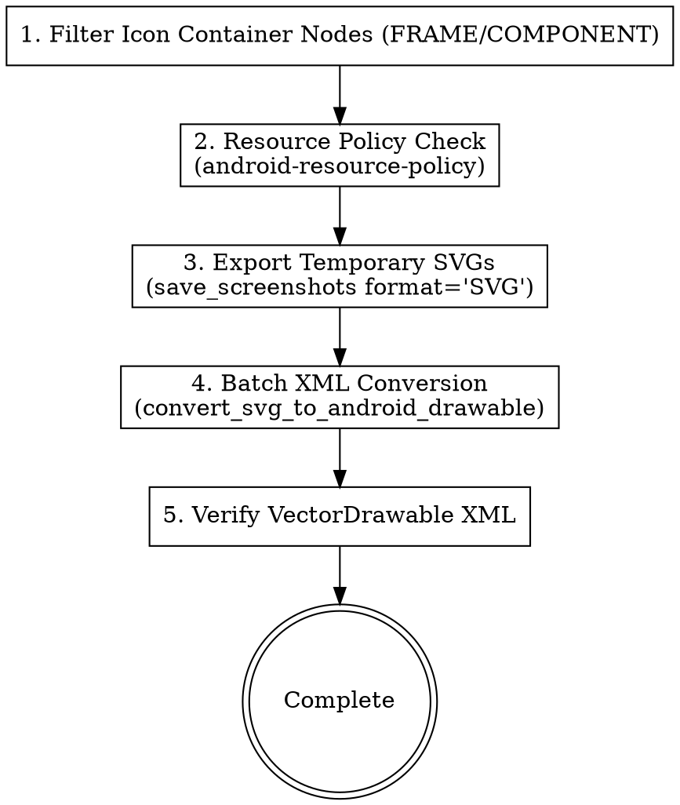

# Figma Asset & Token Extractor

This skill automates the extraction of visual assets (Icons, Images, Design Tokens) from Figma directly into Android Resource directories (`res/drawable/`, `res/values/`, or `:core:designsystem` Kotlin theme tokens) via the `figma_mcp_android` MCP server.

---

## 1. Batch Vector Icon Extraction Pipeline (SVG -> VectorDrawable)

Standard workflow utilizing `save_screenshots` and `convert_svg_to_android_drawable`:



### Step 1: Collect Node IDs & Standardize Names
1. Identify icon container nodes (from `figma-design-analyzer` output or via `scan_nodes_by_types`).
2. Format file names as `ic_<feature_or_name>.xml` (snake_case, lowercase, no hyphens).

### Step 2: Export Temporary SVGs
Call `call_mcp_tool('figma_mcp_android', 'save_screenshots', ...)` to write SVGs to a temporary directory:
```json
{
  "format": "SVG",
  "items": [
    {
      "nodeId": "102:405",
      "outputPath": "temp_svgs/ic_arrow_back.svg",
      "format": "SVG"
    },
    {
      "nodeId": "102:406",
      "outputPath": "temp_svgs/ic_filter.svg",
      "format": "SVG"
    }
  ]
}
```

### Step 3: Batch Convert to Android VectorDrawable
Call `call_mcp_tool('figma_mcp_android', 'convert_svg_to_android_drawable', ...)` to write XMLs directly into `res/drawable/`:
```json
{
  "items": [
    {
      "svgPath": "temp_svgs/ic_arrow_back.svg",
      "outputPath": "core/designsystem/src/main/res/drawable/ic_arrow_back.xml",
      "floatPrecision": 6,
      "fillBlack": false
    },
    {
      "svgPath": "temp_svgs/ic_filter.svg",
      "outputPath": "core/designsystem/src/main/res/drawable/ic_filter.xml",
      "floatPrecision": 6,
      "fillBlack": false
    }
  ]
}
```
*Note: Source SVG files are automatically deleted upon successful conversion.*

---

## 2. Rendering Icons & Images in Jetpack Compose

### Vector Icons
Render VectorDrawables using Compose `Icon` or `Image`:
```kotlin
Icon(
    painter = painterResource(id = R.drawable.ic_arrow_back),
    contentDescription = stringResource(R.string.cd_back),
    tint = AppTheme.colorScheme.colorText
)
```

### Dynamic & Remote Images (Landscapist Glide)
For dynamic URLs, artwork, and banners, use `GlideImage`:
```kotlin
GlideImage(
    imageModel = { imageUrl },
    modifier = Modifier.size(80.dp),
    previewPlaceholder = painterResource(id = R.drawable.ic_image_placeholder),
    loading = { /* loading box */ },
    failure = { /* failure box */ }
)
```

---

## 3. Design Token Extraction (Colors, Typography & Spacing)

1. Call `call_mcp_tool('figma_mcp_android', 'export_tokens', { format: 'json' })`.
2. Parse token JSON output:
   - Color definitions (`colorPrimary`, `colorBgContainer`, `colorText`, `colorError`).
   - Dimension/spacing definitions (`spacing.xs = 4.dp`, `spacing.sm = 8.dp`, `spacing.md = 16.dp`).
   - Corner radius tokens (`shape2`, `shape4`, `shape6`, `shape8`, `shape12`).
   - Typography tokens (`titleLarge`, `bodyMedium`, `labelLarge`).
3. Map tokens into `:core:designsystem` theme files (`Color.kt`, `Spacing.kt`, `Typography.kt`, `Theme.kt`).

---

## Verification Checklist
- [ ] Simple vector icons converted and exported strictly as `ic_<snake_case>.xml` in `res/drawable/`.
- [ ] No temporary SVG leftover files in the workspace.
- [ ] Resource reuse verified before adding new drawables or tokens.
- [ ] Jetpack Compose uses `AppTheme` tokens and Landscapist `GlideImage`.
