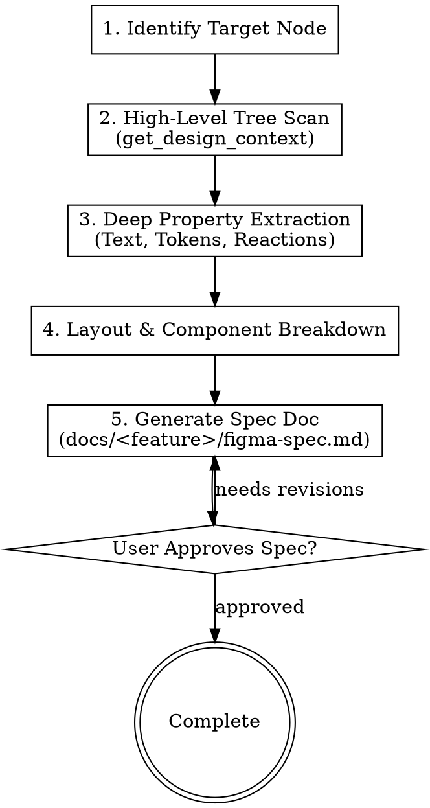

# Figma Design Analyzer

This skill connects to Figma via the `figma_mcp_android` MCP server to comprehensively inspect screens or components in Figma, extracting layout hierarchy, design parameters, prototype reactions, and generating a structured design specification document (`figma-spec.md`).

---

## Figma MCP Tools Used

| Tool | Purpose |
|---|---|
| `get_selection` | Get the list of currently selected nodes in Figma. |
| `get_design_context` | Token-efficient tree retrieval with bounded depth and detail (prevents context overflow). |
| `get_node` | Inspect full detailed properties of a specific node. |
| `scan_text_nodes` | Extract all text content and typography properties across a screen. |
| `scan_nodes_by_types` | Filter nodes by type (`COMPONENT`, `INSTANCE`, `VECTOR`, `FRAME`). |
| `get_reactions` | Extract prototype interactions (onClick, onNavigate, delay, bottom sheets). |
| `get_annotations` | Read designer notes and Dev Mode measurements. |
| `get_styles` / `export_tokens` | Retrieve color, typography, elevation styles and design tokens. |
| `get_screenshot` / `save_screenshots` | Capture preview images of screens or components. |

For detailed parameter definitions and usage, see [references/figma-mcp-tools.md](./references/figma-mcp-tools.md).  
For Auto-Layout to Android translation rules, see [references/layout-mapping-guide.md](./references/layout-mapping-guide.md).

---

## Standard 5-Step Analysis Workflow



### Step 1: Identify Target Node
1. If the user already selected nodes in Figma: Call `call_mcp_tool('figma_mcp_android', 'get_selection', {})`.
2. If the user provides a screen name or URL: Call `call_mcp_tool('figma_mcp_android', 'search_nodes', { query: '<ScreenName>', nodeTypes: ['FRAME', 'SECTION', 'COMPONENT'] })`.
3. Confirm the target `nodeId` with the user if multiple matching frames are found.

### Step 2: High-Level Tree Scan (Token Efficiency)
<HARD-GATE>
NEVER call `get_document` on the entire Figma file, as the massive payload will exhaust context window limits.
</HARD-GATE>

1. Call `call_mcp_tool('figma_mcp_android', 'get_design_context', { depth: 2, detail: 'minimal' })` to obtain top-level structural layout (e.g., TopBar, Content Area, Bottom Navigation/CTA Bar).
2. Call `call_mcp_tool('figma_mcp_android', 'get_design_context', { depth: 3, detail: 'compact', dedupe_components: true })` on specific container frames to inspect nested layout items.

### Step 3: Deep Property Extraction
1. **Text & Typography**:
   - Call `call_mcp_tool('figma_mcp_android', 'scan_text_nodes', { nodeId: '<targetNodeId>', depth: 4 })`.
   - Distinguish static strings (to be placed in `strings.xml`) from dynamic strings (fed from API/State).
   - Record `fontSize`, `fontWeight`, `lineHeight`, and `color`.
2. **Icons, Vector Assets & Raster Images**:
   - Call `call_mcp_tool('figma_mcp_android', 'scan_nodes_by_types', { nodeTypes: ['COMPONENT', 'INSTANCE', 'VECTOR', 'FRAME'], depth: 4 })`.
   - **Vector Icons**: Identify top-level icon container nodes for SVG export to `res/drawable/ic_<name>.xml`.
   - **Raster Images & Complex Artwork**: Identify artwork, background cards, hero graphics, and complex multi-color assets for export and rendering via Landscapist `GlideImage` or Compose `painterResource`.
3. **Prototype Reactions (User Interactions & Flows)**:
   - Call `call_mcp_tool('figma_mcp_android', 'get_reactions', { nodeId: '<buttonOrCardNodeId>' })`.
   - Extract triggers (`ON_CLICK`, `AFTER_TIMEOUT`) and actions (Navigate to Node, Open Overlay/BottomSheet, Back, Open URL).
4. **Dev Annotations**:
   - Call `call_mcp_tool('figma_mcp_android', 'get_annotations', { nodeId: '<targetNodeId>' })` for developer notes or measurement specs.
5. **Design Tokens**:
   - Call `call_mcp_tool('figma_mcp_android', 'export_tokens', { format: 'json' })` or `get_styles` for color schemes, shadows, and corner radiuses.

### Step 4: Layout & Component Breakdown
Map each layout section against [references/layout-mapping-guide.md](./references/layout-mapping-guide.md):
- **Core Layout Container**: `Row` (Auto-Layout HORIZONTAL), `Column` (Auto-Layout VERTICAL), or `Box` (Freeform / Overlays).
- **Padding & Spacing**: `Arrangement.spacedBy(...)`, `Modifier.padding(...)`.
- **Sizing Constraints**: Fixed (`size/width/height`), Hug (`wrapContent`), Fill (`fillMaxWidth` / `weight(1f)`).
- **Shapes & Borders**: Corner radius, border stroke width/color, background color/brush.
- **Design System Components**: Map buttons to `AppPrimaryButton`/`AppSecondaryButton`, texts to `AppText`, cards to `AppPanel`, etc.

### Step 5: Write Specification Document (`docs/<feature>/figma-spec.md`)
Create the design spec file using the following template:
```markdown
# Figma Design Spec: <Screen / Feature Name>

## 1. Overview
- **Figma Node ID**: `<nodeId>`
- **Node Name**: `<name>`
- **Dimensions**: `<width> x <height>` dp
- **Target Feature**: `<feature-name>`

## 2. Color Palette & Design Tokens
| Token Name / Hex | Role in UI | AppTheme Token Mapping |
|---|---|---|

## 3. Typography & Text Resources
| Text Content | Type (Static/Dynamic) | Font / Weight / Size | Proposed String Resource Key |
|---|---|---|---|

## 4. Icons & Graphic Assets List
| Layer Name | Node ID | Asset Type | Target Location | Rendering Component |
|---|---|---|---|---|
| ic_back | 102:405 | Vector | `res/drawable/ic_back.xml` | `Icon(painterResource(R.drawable.ic_back))` |
| img_hero | 105:210 | Raster / URL | Dynamic URL or Drawable | Landscapist `GlideImage` |

## 5. UI Layout Hierarchy
- Header: Row(...)
  - Back Button: AppPrimaryCircleButton(...)
  - Title: AppText(...)
- Content: LazyColumn / Column(...)
  - Hero Image: GlideImage(...)
  - Card 1: AppPanel(...)
- BottomBar: AppBottomBar(...)
  - CTA Button: AppPrimaryButton(...)

## 6. Interaction Flows & Reactions
| Component | Trigger | Expected System Behavior | Orbit MVI Action / SideEffect |
|---|---|---|---|
```

---

## Completion Checklist
- [ ] Bounded queries used (`get_design_context` with depth/detail params); avoided full `get_document`.
- [ ] Complete list of static & dynamic text strings extracted.
- [ ] Complete list of icon container node IDs and raster assets identified.
- [ ] Prototype reactions translated into Orbit MVI Action/SideEffect events.
- [ ] Auto-Layout properties mapped to Jetpack Compose layout modifiers and design system components.
- [ ] `figma-spec.md` reviewed and confirmed with the user.
