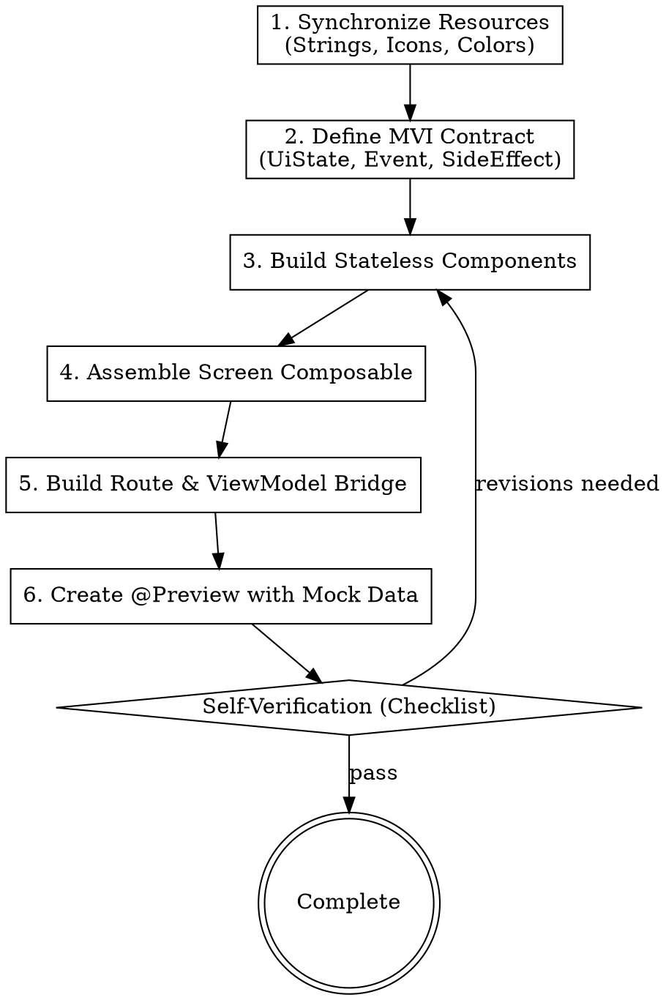

# Figma to Jetpack Compose UI Implementation

This skill handles translating Figma design specifications and assets into production-ready Jetpack Compose UI code, supporting both **updating existing screens** (modifying Composables while preserving ViewModel & business logic) and **implementing new screens**.

---

## Implementation & Update Modes

- **Update Existing Screen Mode**:
  - Retain the existing `*ViewModel`, `*Contract`, UseCases, and navigation structure.
  - Update Composable functions in-place (styling, Auto-Layout paddings, colors, typography, shapes).
  - Swap old vector drawables / icons for newly extracted Figma icons.
- **New Screen Mode**:
  - Build full MVI Contract, Stateless Composables, Route, and `@Preview`s.

---

## Required Reference Guides

- Layout Mapping: [figma-design-analyzer/references/layout-mapping-guide.md](../figma-design-analyzer/references/layout-mapping-guide.md)
- MVI Contract Derivation: [references/mvi-contract-from-figma.md](./references/mvi-contract-from-figma.md)
- Resource Management: `android-resource-policy`
- Component API shape (modifier params, slots, content lambdas): `compose-component-design`
- State ownership, hoisting, and effects: `compose-state-and-effects`
- Project Style Guide: `.agents/rules/lean.md` (YAGNI, reuse-first, NO comments, null-safety) and `AGENTS.md` (AppTheme tokens, string resources, Orbit MVI)

---

## Upstream pipeline — run this before Step 1

The six steps below start once the design is understood and its assets are in the repo. Getting
there is delegated, because inspecting a Figma tree and converting assets both burn context
that the implementation needs:

1. **Design context** — parse the file key and `node-id` from the URL (URLs encode the colon
   as `%3A` or `-`; convert `123-456` to `123:456`). Dispatch `figma-analyzer` to call
   `get_design_context` with `depth: 2`, `detail: "compact"`, `dedupe_components: true`, and to
   write `docs/<feature>/figma-spec.md` covering the Auto-Layout to Compose mapping, typography,
   token names, the asset list, and the prototype reactions. Locate the existing screen files in
   parallel with `android-code-indexer`.
2. **Assets and tokens** — once the spec exists, dispatch `figma-asset-extractor` against its
   asset list to batch-convert simple vector icons (24–48dp) into `res/drawable/ic_<name>.xml`
   via `convert_svg_to_android_drawable`, export raster artwork, and fill token gaps in
   `com.genesys.core.designsystem.theme.AppTheme`.

Step 1 goes alone — nothing downstream can start without the spec. Step 2 and the
implementation below touch disjoint files, so dispatch `figma-asset-extractor` and
`figma-compose-developer` together in one `invoke_subagent` call (`Subagents` is an array) and
let the implementer check asset names against the spec. Keep the MVI contract and the route
yourself if you would rather not hand the whole screen over.

Skip the pipeline when the design was already analysed in this session and the icons already
exist: re-extracting assets that are on disk is pure cost.

---

## Standard 6-Step Implementation Workflow



---

### Step 1: Synchronize Resources & Tokens
1. Add static UI text into `res/values/strings.xml` using feature-prefixed keys (e.g., `feature_name_title`).
2. Verify all vector icons have been converted into `res/drawable/ic_<name>.xml` (via `figma-asset-extractor`).
3. Ensure colors, spacing, and shapes reference project theme tokens (`MaterialTheme` / `DesignSystemTheme`).

### Step 2: Define MVI Contract (`Contract.kt`)
Create the MVI Contract file defining:
- `UiState`: Immutable data class describing screen UI state.
- `UiEvent` (or `ScreenAction`): Sealed interface representing user actions.
- `UiSideEffect`: Sealed interface representing one-off side effects (Navigation, Toast, Sheet).

### Step 3: Build Stateless Child Components
Decompose the layout into focused `@Composable` functions:
- Follow **Stateless by default**: receive state via parameters, emit user interactions via callbacks (`onEvent: (ScreenEvent) -> Unit`).
- Map Auto-Layout accurately:
  - Figma `HORIZONTAL` -> `Row(horizontalArrangement = Arrangement.spacedBy(...), verticalAlignment = ...)`
  - Figma `VERTICAL` -> `Column(verticalArrangement = Arrangement.spacedBy(...), horizontalAlignment = ...)`
  - Figma `NONE` / Overlays -> `Box(...)`
  - Dynamic lists -> `LazyColumn` / `LazyRow` with `items(items, key = { ... })`
- Translate padding, corner radius, borders, and shadows to exact `dp`/`sp` dimensions.

### Step 4: Assemble Screen Composable (`Screen.kt`)
Create the top-level Screen Composable:
```kotlin
@Composable
fun FeatureScreen(
    uiState: FeatureUiState,
    onEvent: (FeatureEvent) -> Unit,
    modifier: Modifier = Modifier
) {
    Scaffold(
        modifier = modifier.fillMaxSize(),
        topBar = {
            FeatureTopBar(
                title = stringResource(R.string.feature_title),
                onBackClick = { onEvent(FeatureEvent.OnBackClicked) }
            )
        }
    ) { innerPadding ->
        FeatureContent(
            uiState = uiState,
            onEvent = onEvent,
            modifier = Modifier
                .fillMaxSize()
                .padding(innerPadding)
        )
    }
}
```

### Step 5: Route & ViewModel Bridge (`Route.kt` & `ViewModel.kt`)
Connect the ViewModel to the Screen within the Route Composable:
```kotlin
@Composable
fun FeatureRoute(
    onNavigateBack: () -> Unit,
    onNavigateDetail: (String) -> Unit,
    viewModel: FeatureViewModel = hiltViewModel()
) {
    val uiState by viewModel.container.stateFlow.collectAsStateWithLifecycle()

    ObserveSideEffect(viewModel.container.sideEffectFlow) { effect ->
        when (effect) {
            is FeatureSideEffect.NavigateBack -> onNavigateBack()
            is FeatureSideEffect.NavigateDetail -> onNavigateDetail(effect.id)
        }
    }

    FeatureScreen(
        uiState = uiState,
        onEvent = viewModel::onEvent
    )
}
```

### Step 6: Create Comprehensive `@Preview` Functions
Each screen and core component MUST include:
1. Default / Success state preview with realistic mock data.
2. Loading / Empty state preview (if applicable).
3. Light and Dark mode preview verification.

---

## Pre-Delivery Checklist
- [ ] ZERO Kotlin comments (`//`, `/* */`).
- [ ] ZERO hardcoded display strings; use `stringResource(...)`.
- [ ] ZERO hardcoded hex color codes in layouts; use Theme tokens.
- [ ] All icons use project drawables (`R.drawable.ic_*`), avoiding default Material icons unless specified.
- [ ] Robust responsiveness against long text strings and dynamic font scaling.
- [ ] Minimum touch target of 48dp x 48dp for all clickable elements.
- [ ] Functional `@Preview` composables provided with mock data.
