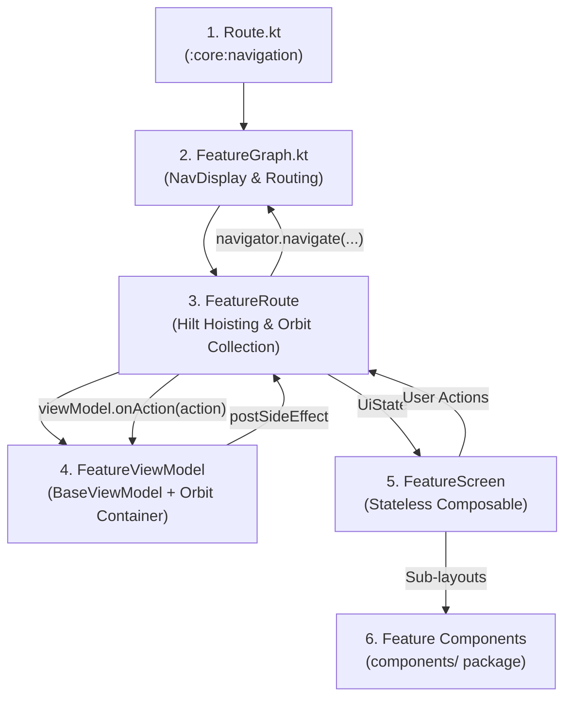

# 🏛️ Canonical Orbit MVI Feature Reference Template

This reference document provides the complete, copy-paste-ready, self-contained implementation patterns for building feature modules in Genesys Compose using Orbit MVI, Navigation 3, and Dagger Hilt.

All code snippets here are self-contained and do not rely on sample features that may be deleted during development.

---

## Architecture Flow



---

## 1. Route Definition (`:core:navigation`)

All screen routes are declared in `:core:navigation` under `Route.kt` (`com.genesys.core.navigation.Route`). This allows decoupled multi-module navigation without feature-to-feature dependencies.

```kotlin
// Location: :core:navigation/src/main/java/com/genesys/core/navigation/Route.kt
package com.genesys.core.navigation

import kotlinx.parcelize.Parcelize
import kotlinx.serialization.Serializable

// No-argument destination
@Serializable
@Parcelize
data object Home : Route

// Destination with parameters
@Serializable
@Parcelize
data class ItemDetail(
    val itemId: String
) : Route
```

---

## 2. MVI Contract (`[Feature]Contract.kt`)

Defines the immutable contract between the Presentation layer and the ViewModel.

```kotlin
// Location: :feature:<name>/src/main/java/com/genesys/feature/<name>/presentation/list/ItemListContract.kt
package com.genesys.feature.itemlist.presentation.list

import com.genesys.core.common.base.mvi.Action
import com.genesys.core.common.base.mvi.SideEffect
import com.genesys.core.common.base.mvi.UiState

// 1. Immutable UI State
data class ItemListUiState(
    val items: List<ItemModel> = emptyList(),
    val isLoading: Boolean = false,
    val isLoadMoreLoading: Boolean = false,
    val searchQuery: String = "",
    val errorMessage: String? = null
) : UiState {
    val filteredItems: List<ItemModel>
        get() = if (searchQuery.isBlank()) {
            items
        } else {
            items.filter { it.title.contains(searchQuery, ignoreCase = true) }
        }
}

// 2. User & Lifecycle Intent Actions
sealed interface ItemListAction : Action {
    data object LoadItems : ItemListAction
    data object Refresh : ItemListAction
    data object LoadNextPage : ItemListAction
    data class OnSearchQueryChanged(val query: String) : ItemListAction
    data class OnItemClicked(val item: ItemModel) : ItemListAction
}

// 3. Transient One-Off Side Effects (Navigation, Snackbars, Dialogs)
sealed interface ItemListSideEffect : SideEffect {
    data class OpenItemDetail(val itemId: String) : ItemListSideEffect
    data class ShowToast(val message: String) : ItemListSideEffect
}
```

---

## 3. Orbit MVI ViewModel (`[Feature]ViewModel.kt`)

Extends `BaseViewModel`, initializes Orbit `container`, and processes actions through `intent`, `reduce`, and `postSideEffect`.

```kotlin
// Location: :feature:<name>/src/main/java/com/genesys/feature/<name>/presentation/list/ItemListViewModel.kt
package com.genesys.feature.itemlist.presentation.list

import com.genesys.core.common.base.BaseViewModel
import com.genesys.core.common.base.Result
import com.genesys.core.domain.usecase.GetItemsUseCase
import dagger.hilt.android.lifecycle.HiltViewModel
import javax.inject.Inject
import org.orbitmvi.orbit.viewmodel.container

@HiltViewModel
class ItemListViewModel @Inject constructor(
    private val getItemsUseCase: GetItemsUseCase
) : BaseViewModel<ItemListUiState, ItemListSideEffect, ItemListAction>() {

    override val container = container<ItemListUiState, ItemListSideEffect>(ItemListUiState())

    init {
        loadItems()
    }

    override fun onAction(action: ItemListAction) {
        when (action) {
            ItemListAction.LoadItems, ItemListAction.Refresh -> loadItems()
            ItemListAction.LoadNextPage -> loadNextPage()
            is ItemListAction.OnSearchQueryChanged -> updateSearchQuery(action.query)
            is ItemListAction.OnItemClicked -> onItemClicked(action.item)
        }
    }

    private fun loadItems() {
        intent {
            if (state.isLoading) return@intent

            getItemsUseCase(page = 0).collect { result ->
                when (result) {
                    is Result.Loading -> reduce {
                        state.copy(isLoading = true, errorMessage = null)
                    }
                    is Result.Success -> reduce {
                        state.copy(
                            items = result.data,
                            isLoading = false,
                            errorMessage = null
                        )
                    }
                    is Result.Error -> reduce {
                        state.copy(
                            isLoading = false,
                            errorMessage = result.msg ?: "An unexpected error occurred."
                        )
                    }
                    is Result.Initial -> Unit
                }
            }
        }
    }

    private fun loadNextPage() {
        intent {
            if (state.isLoadMoreLoading || state.isLoading) return@intent

            // Implement pagination flow...
        }
    }

    private fun updateSearchQuery(query: String) {
        intent {
            reduce { state.copy(searchQuery = query) }
        }
    }

    private fun onItemClicked(item: ItemModel) {
        intent {
            postSideEffect(ItemListSideEffect.OpenItemDetail(item.id))
        }
    }
}
```

---

## 4. Route Composable & Stateless Screen (`[Feature]Screen.kt`)

Separates the **Route** (ViewModel hoisting, state collection, side-effect dispatch) from the **Screen** (100% stateless composable, design system components, previewable).

```kotlin
// Location: :feature:<name>/src/main/java/com/genesys/feature/<name>/presentation/list/ItemListScreen.kt
package com.genesys.feature.itemlist.presentation.list

import androidx.compose.foundation.background
import androidx.compose.foundation.layout.Box
import androidx.compose.foundation.layout.Column
import androidx.compose.foundation.layout.PaddingValues
import androidx.compose.foundation.layout.fillMaxSize
import androidx.compose.foundation.layout.fillMaxWidth
import androidx.compose.foundation.layout.padding
import androidx.compose.runtime.Composable
import androidx.compose.runtime.getValue
import androidx.compose.ui.Alignment
import androidx.compose.ui.Modifier
import androidx.compose.ui.tooling.preview.Preview
import androidx.compose.ui.unit.dp
import androidx.hilt.lifecycle.viewmodel.compose.hiltViewModel
import com.genesys.core.designsystem.component.AppPageFrame
import com.genesys.core.designsystem.component.ErrorState
import com.genesys.core.designsystem.component.LoadingIndicator
import com.genesys.core.designsystem.theme.AppTheme
import com.genesys.core.navigation.AppNavigator
import com.genesys.core.navigation.Route
import org.orbitmvi.orbit.compose.collectAsState
import org.orbitmvi.orbit.compose.collectSideEffect

/**
 * Route Composable: Hoists ViewModel, collects Orbit State & SideEffects, handles Navigation.
 */
@Composable
fun ItemListRoute(
    navigator: AppNavigator,
    modifier: Modifier = Modifier,
    viewModel: ItemListViewModel = hiltViewModel()
) {
    val state by viewModel.collectAsState()

    viewModel.collectSideEffect { sideEffect ->
        when (sideEffect) {
            is ItemListSideEffect.OpenItemDetail -> {
                navigator.navigate(Route.ItemDetail(sideEffect.itemId))
            }
            is ItemListSideEffect.ShowToast -> {
                // Trigger toast/snackbar handler
            }
        }
    }

    ItemListScreen(
        state = state,
        onAction = viewModel::onAction,
        modifier = modifier
    )
}

/**
 * Stateless Screen: Pure rendering layer driven by UiState and action callbacks.
 */
@Composable
fun ItemListScreen(
    state: ItemListUiState,
    onAction: (ItemListAction) -> Unit,
    modifier: Modifier = Modifier
) {
    AppPageFrame(
        modifier = modifier
            .fillMaxSize()
            .background(AppTheme.colorScheme.colorBgLayout),
        contentPadding = PaddingValues(0.dp)
    ) {
        Column(
            modifier = Modifier
                .fillMaxSize()
                .padding(horizontal = AppTheme.spacing.md)
        ) {
            Box(
                modifier = Modifier
                    .fillMaxWidth()
                    .weight(1f),
                contentAlignment = Alignment.Center
            ) {
                when {
                    state.isLoading && state.items.isEmpty() -> {
                        LoadingIndicator()
                    }
                    state.errorMessage != null && state.items.isEmpty() -> {
                        ErrorState(
                            message = state.errorMessage,
                            onRetry = { onAction(ItemListAction.LoadItems) }
                        )
                    }
                    else -> {
                        // Render content list/grid
                    }
                }
            }
        }
    }
}

@Preview(showBackground = true)
@Composable
private fun ItemListScreenPreview() {
    AppTheme {
        ItemListScreen(
            state = ItemListUiState(
                items = listOf()
            ),
            onAction = {}
        )
    }
}
```

---

## 5. Feature Navigation Graph (`[Feature]Graph.kt`)

Wires typed routes to their route composables using Navigation 3's `entryProvider` and `NavDisplay`.

```kotlin
// Location: :feature:<name>/src/main/java/com/genesys/feature/<name>/navigation/FeatureGraph.kt
package com.genesys.feature.itemlist.navigation

import androidx.compose.runtime.Composable
import androidx.compose.ui.Modifier
import androidx.navigation3.runtime.NavBackStack
import androidx.navigation3.runtime.NavKey
import androidx.navigation3.runtime.entryProvider
import androidx.navigation3.ui.NavDisplay
import com.genesys.core.navigation.AppNavigator
import com.genesys.core.navigation.Route
import com.genesys.feature.itemlist.presentation.detail.ItemDetailRoute
import com.genesys.feature.itemlist.presentation.list.ItemListRoute

@Composable
fun FeatureGraph(
    backStack: NavBackStack<NavKey>,
    navigator: AppNavigator,
    modifier: Modifier = Modifier
) {
    val entries = entryProvider<NavKey> {
        entry<Route.Home> {
            ItemListRoute(
                navigator = navigator,
                modifier = modifier
            )
        }

        entry<Route.ItemDetail> { destination ->
            ItemDetailRoute(
                itemId = destination.itemId,
                onBack = navigator::popIfPossible,
                modifier = modifier
            )
        }
    }

    NavDisplay(
        backStack = backStack,
        onBack = navigator::popIfPossible,
        entryProvider = entries,
        modifier = modifier
    )
}
```

---

## 6. Modular Feature Components (`components/`)

Extract individual UI chunks (cards, headers, search bars, list rows) into a `components/` subpackage.

```kotlin
// Location: :feature:<name>/src/main/java/com/genesys/feature/<name>/presentation/list/components/ItemCard.kt
package com.genesys.feature.itemlist.presentation.list.components

import androidx.compose.foundation.clickable
import androidx.compose.foundation.layout.Column
import androidx.compose.foundation.layout.padding
import androidx.compose.runtime.Composable
import androidx.compose.ui.Modifier
import com.genesys.core.designsystem.component.AppPanel
import com.genesys.core.designsystem.component.AppText
import com.genesys.core.designsystem.theme.AppTheme

@Composable
fun ItemCard(
    title: String,
    subtitle: String,
    onClick: () -> Unit,
    modifier: Modifier = Modifier
) {
    AppPanel(
        modifier = modifier.clickable(onClick = onClick)
    ) {
        Column(modifier = Modifier.padding(AppTheme.spacing.md)) {
            AppText(
                text = title,
                style = AppTheme.typography.titleMedium,
                color = AppTheme.colorScheme.colorTextPrimary
            )
            AppText(
                text = subtitle,
                style = AppTheme.typography.bodySmall,
                color = AppTheme.colorScheme.colorTextSecondary
            )
        }
    }
}
```
