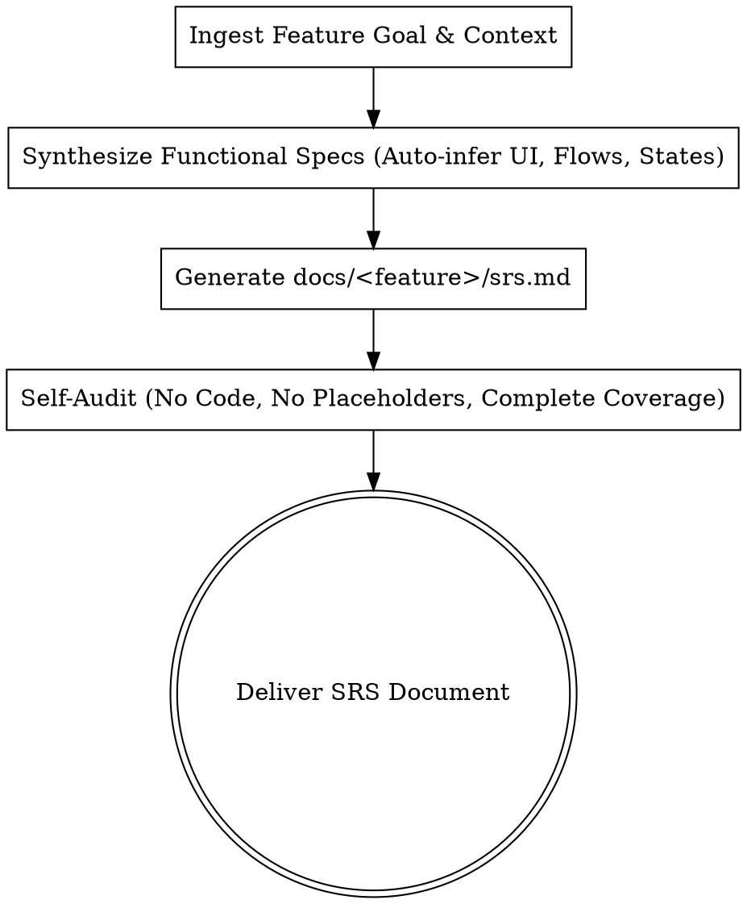

# Autonomous SRS Generator

Automatically transform feature goals, prompts, or design contexts into comprehensive, production-grade Software Requirements Specification (SRS) documents without manual Q&A bottlenecks.

<HARD-GATE>
DO NOT mention technical implementation, code, class names, database tables, API payloads, or software architecture. Only describe functional requirements: UI components, user interactions, system responses, and state lifecycles.
</HARD-GATE>

---

## Workflow Checklist

Execute the following steps autonomously:

1. **Autonomous Context Exploration**:
   - Inspect feature descriptions, user goals, existing features, or Figma design references in the workspace.
   - Infer the target user persona, core workflow, and business objectives automatically.

2. **Functional Requirements Synthesis**:
   - Automatically deduce the complete screen hierarchy and UI components (App Bar, Inputs, Buttons, Lists, Panels, Chips, Modals).
   - Auto-derive all interaction matrices: `User Action` → `System Response`.
   - Specify all UI states: **Initial / Idle**, **Loading**, **Populated / Success**, **Empty**, and **Error / Retry**.
   - Infer standard validation rules (empty inputs, formats, boundaries, confirmation dialogs).

3. **Generate Standard SRS Document**:
   - Structure and write the SRS document to `docs/<feature name>/srs.md`.

4. **Automated Self-Audit**:
   - Check for and eliminate any placeholders (`TODO`, `TBD`).
   - Check for any technical/code leaks (Kotlin, SQL, JSON, endpoints) and strip them.
   - Verify every user action has a clear, deterministic system response.

5. **Deliver Final Artifact**:
   - Present the finalized SRS file to the user for instant review.

---

## Process Diagram



---

## Autonomous Generation Guidelines

### 1. Proactive Inference vs. User Asking
- **Do not stall or ask repetitive step-by-step questions** for standard mobile behaviors (e.g., standard back buttons, pull-to-refresh, loading indicators, empty states, confirmation alerts).
- **Auto-infer standard mobile best practices** directly into the functional spec.
- Only prompt the user if there is a fundamental functional conflict or mutually exclusive business goal that cannot be reasonably inferred.

### 2. Required SRS Document Structure (`docs/<feature-name>/srs.md`)

When generating `srs.md`, format the content using the following standardized functional structure:

```markdown
# Functional Specification: [Feature Name]

## 1. Overview & Objective
- **Purpose**: High-level functional goal of the feature.
- **Target User**: Who uses this feature and what problem it solves.
- **Scope**: What is covered in this feature flow.

## 2. Screen Hierarchy & Navigation Flow
- **Entry Points**: How the user navigates into this feature.
- **Screen List**: List of all screens and dialogs in this feature.
- **Screen Flow Diagram**: Step-by-step navigation map between screens.

## 3. Detailed Screen Specifications

### Screen: [Screen Name]
#### 3.1 UI Components & Layout
- Header / Top Bar (Title, Navigation icons, Action buttons)
- Content Area (Form fields, Cards, Lists, Dynamic items)
- Primary Actions (Action buttons, Floating buttons, Bottom bar)

#### 3.2 State Lifecycles
- **Initial / Idle State**: Default appearance when screen first opens.
- **Loading State**: Visual feedback during data fetching or asynchronous tasks (shimmer/spinner).
- **Populated / Success State**: Layout when items or content are present.
- **Empty State**: Visual guidance and action when no data/items exist.
- **Error State**: User feedback when an operation fails, with retry options.

#### 3.3 User Interactions & System Responses
| Component | User Action | System Response |
|---|---|---|
| Search Input | Types keyword | Filters list in real-time after typing ceases |
| Submit Button | Taps button | Validates fields -> Shows loading indicator -> Navigates to confirmation screen |
| Back Button | Taps back | Discards unsaved changes or returns to previous screen |

#### 3.4 Form Validation & Business Rules
- Mandatory vs. optional fields.
- Input constraints (character limits, format requirements).
- Inline error messages and boundary conditions.

## 4. Edge Cases & Offline / Error Handling
- Network disconnection behavior (show offline banner, disable actions).
- Timeout or server error feedback (toast/dialog with retry).
- Cancellation / Back navigation handling during in-flight actions.

## 5. Acceptance Criteria
- Explicit checklist of functional capabilities to verify completion.
```

---

## Strict Hard Gates

- **Zero Code**: No Kotlin, Swift, Jetpack Compose, XML, JSON, SQL, or pseudocode.
- **Zero Architecture Details**: No mention of ViewModels, Repositories, UseCases, DB tables, HTTP status codes, or API endpoints.
- **Pure Functional Focus**: Everything must be described from the user's perspective (`User sees`, `User performs`, `System responds with`).
- **No Placeholders**: Never leave `TODO`, `TBD`, or placeholder bullets.
