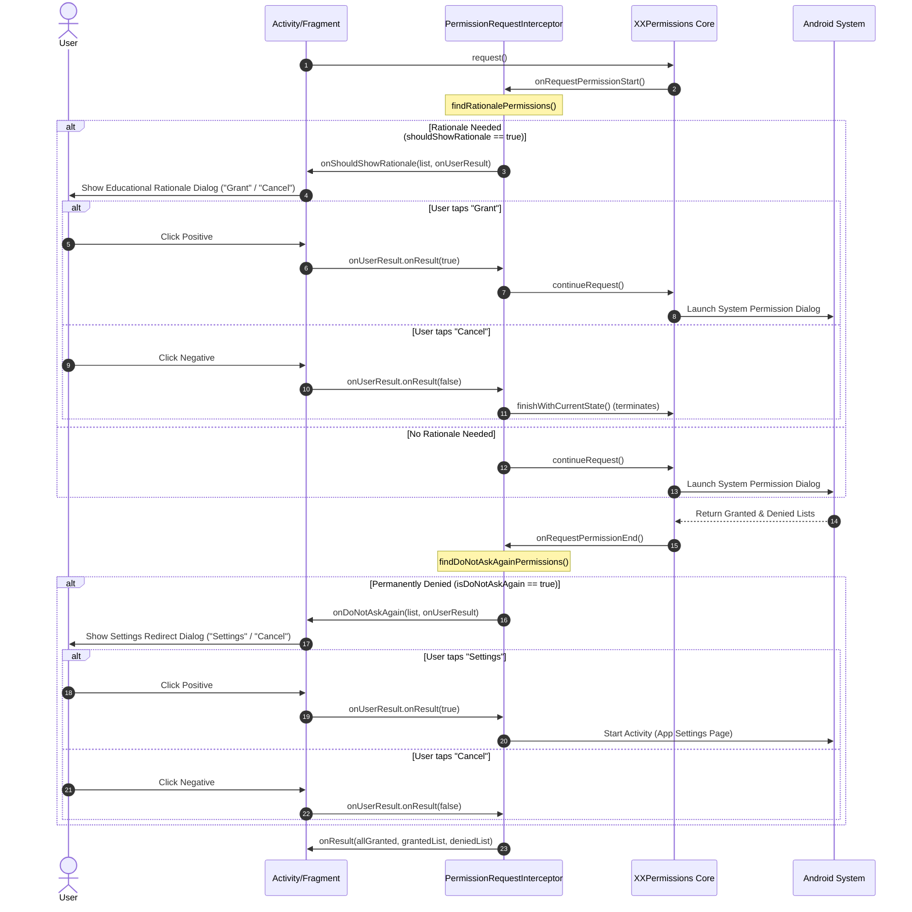

# Rationale & Dialog Architecture in `xxpermissionktx`

This document details how `XXPermissionsExt` intercepts permission cycles and how to structure rationale and "Do Not Ask Again" dialog flows cleanly.

---

## 1. Interceptor Lifecycle & Execution Mechanics

When you call `xxPermissions { ... }`, the request pipeline is mediated by `XXPermissionsExt.PermissionRequestInterceptor`:



### Rationale Trigger Condition (`findRationalePermissions`)
In `XXPermissionsExt`:
- **Dangerous permissions**: Evaluated via `ActivityCompat.shouldShowRequestPermissionRationale(activity, permission.getPermissionName())`.
- **Special permissions**: Evaluated via `!permission.isGrantedPermission(activity)`. If ungranted, the rationale is automatically triggered so the user understands why they are being redirected to a system settings page.

### Do Not Ask Again Condition (`findDoNotAskAgainPermissions`)
Evaluated on all denied permissions via `permission.isDoNotAskAgainPermission(activity)`:
- Returns `true` if the user checked "Don't ask again" in the system dialog.
- Returns `true` on Android 11+ if the user repeatedly dismissed or denied permissions.
- Returns `true` if restricted by device policy / enterprise management.

---

## 2. Decoupled UI Content Mapper Pattern

To keep UI components clean and prevent giant `when` blocks in Activities, the sample employs a 3-part decoupling:

### A. View Model: `PermissionDialogContent`
A lightweight presentation model representing the dialog contents:
```kotlin
data class PermissionDialogContent(
    @field:DrawableRes val imageResId: Int,
    val title: String,
    val description: String
)
```

### B. Content Resolver: `PermissionDialogContentMapper`
Maps permission identifiers to corresponding resources based on whether it is a Rationale or a Do Not Ask Again situation:

```kotlin
class PermissionDialogContentMapper(private val context: Context) {
    fun map(permission: String, isDoNotAskAgain: Boolean): PermissionDialogContent {
        return when (permission) {
            PermissionLists.getPostNotificationsPermission().getPermissionName() -> PermissionDialogContent(
                imageResId = android.R.drawable.ic_dialog_info,
                title = context.getString(
                    if (isDoNotAskAgain) R.string.permission_notification_denied_title
                    else R.string.permission_notification_needed_title
                ),
                description = context.getString(
                    if (isDoNotAskAgain) R.string.permission_notification_denied_description
                    else R.string.permission_notification_needed_description
                )
            )

            PermissionLists.getSystemAlertWindowPermission().getPermissionName() -> PermissionDialogContent(
                imageResId = android.R.drawable.ic_menu_view,
                title = context.getString(
                    if (isDoNotAskAgain) R.string.permission_overlay_denied_title
                    else R.string.permission_overlay_needed_title
                ),
                description = context.getString(
                    if (isDoNotAskAgain) R.string.permission_overlay_denied_description
                    else R.string.permission_overlay_needed_description
                )
            )

            // Group media permissions together
            PermissionLists.getReadMediaImagesPermission().getPermissionName(),
            PermissionLists.getReadMediaVisualUserSelectedPermission().getPermissionName(),
            PermissionLists.getWriteExternalStoragePermission().getPermissionName() -> PermissionDialogContent(
                imageResId = android.R.drawable.ic_menu_gallery,
                title = context.getString(
                    if (isDoNotAskAgain) R.string.permission_media_denied_title
                    else R.string.permission_media_needed_title
                ),
                description = context.getString(
                    if (isDoNotAskAgain) R.string.permission_media_denied_description
                    else R.string.permission_media_needed_description
                )
            )

            else -> PermissionDialogContent(
                imageResId = android.R.drawable.ic_dialog_alert,
                title = context.getString(
                    if (isDoNotAskAgain) R.string.permission_default_denied_title
                    else R.string.permission_default_needed_title
                ),
                description = context.getString(
                    if (isDoNotAskAgain) R.string.permission_default_denied_description
                    else R.string.permission_default_needed_description
                )
            )
        }
    }
}
```

---

## 3. Strict Dialog Contract Rules

1. **Non-Cancelable Dialogs**:
   Always set `dialog.setCancelable(false)` and `dialog.setCanceledOnTouchOutside(false)`. If a user dismisses the dialog via the back gesture or clicking the scrim without tapping a button, `onUserResult.onResult(...)` will not fire, deadlocking the internal request interceptor.
2. **Clear Button Copy Semantics**:
   - **Rationale (`isDoNotAskAgain = false`)**:
     - Positive Button: `"Grant"`, `"Continue"`, or `"Allow"` -> invokes `onUserResult.onResult(true)`
     - Negative Button: `"Cancel"`, `"Not Now"` -> invokes `onUserResult.onResult(false)`
   - **Do Not Ask Again (`isDoNotAskAgain = true`)**:
     - Positive Button: `"Go to Settings"` -> invokes `onUserResult.onResult(true)`
     - Negative Button: `"Cancel"` -> invokes `onUserResult.onResult(false)`
3. **Leak Prevention**:
   In `onDestroy()` of the DialogFragment, always set `onUserResult = null` to release references to the activity context.
