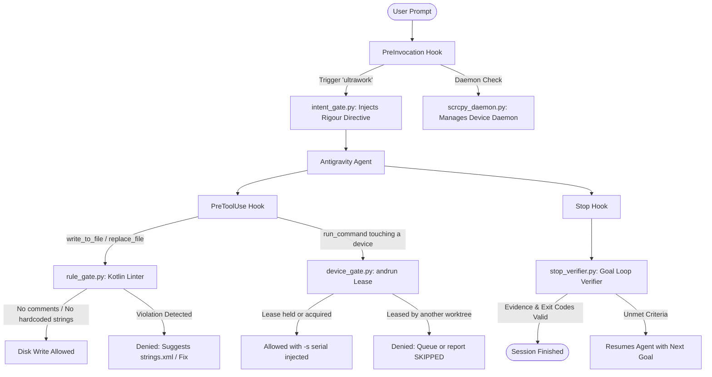

# AndroidHarnessAGY (AHA — Android Harness Antigravity)

> **A production-ready agentic engineering harness for Android development with Google Antigravity IDE & CLI (`agy`).**

**AndroidHarnessAGY** equips Google Antigravity with senior Android engineering guardrails, patterns, and workflows. It packages architectural rules, agent personas, 42 specialized domain skills, deterministic safety hooks, Figma-to-Compose pipelines, and a durable goal-loop engine into a zero-pollution `.agents/` payload that can be injected into any Android repository via the included `aha` CLI.

---

## Table of Contents

- [Key Capabilities](#key-capabilities)
- [Global Installation & Quickstart](#global-installation--quickstart)
  - [1. Install Globally via npm](#1-install-globally-via-npm)
  - [2. Inject into an Android Project](#2-inject-into-an-android-project)
  - [3. Installation Profiles](#3-installation-profiles)
  - [4. Harness Management Commands](#4-harness-management-commands)
- [System Architecture](#system-architecture)
  - [1. Deterministic Lifecycle Hooks](#1-deterministic-lifecycle-hooks)
  - [2. Specialized Agent Personas](#2-specialized-agent-personas)
  - [3. Domain Skills Catalog](#3-domain-skills-catalog)
  - [4. Architectural Rules and Guardrails](#4-architectural-rules-and-guardrails)
  - [5. Durable Goal Loop Engine](#5-durable-goal-loop-engine)
- [Figma-to-Jetpack-Compose Workflow](#figma-to-jetpack-compose-workflow)
- [Developer Workflows and Slash Commands](#developer-workflows-and-slash-commands)
- [Repository Layout](#repository-layout)

---

## Key Capabilities

- **Clean Architecture & Orbit MVI Enforcement**: Hardened rules ensure stateless composables, unidirectional data flow (`ContainerHost`, `UiState`, `SideEffect`), and ViewModel decoupling.
- **Figma-to-Compose Pipeline**: Native Figma MCP integration (`figma-mcp-android`) extracts layouts, tokens, and vector drawables (`ic_*.xml`), generating production-grade Jetpack Compose UI.
- **Automated PreToolUse & PreInvocation Safety Gates**: Python hooks block comment clutter, catch hardcoded UI strings, prevent raw hex colors, and activate rigour modes autonomously.
- **Resilient Goal Loop Engine (`loop.py`)**: Structured, append-only ledger for multi-goal workflows that survives LLM context compaction and enforces verified exit criteria.
- **Lean Engineering Mindset**: Enforces YAGNI (You Aren't Gonna Need It), Kotlin stdlib/KTX reuse, Compose native primitives, and zero speculative scaffolding.
- **Single-Command Drop-in Packaging (`aha`)**: Painlessly inject, sync, or undo the entire harness across multiple Android projects. Installed files are locally excluded file-by-file in `.git/info/exclude` under a marked block so `git status` remains clean without hiding other `.agents/` files or polluting `.gitignore`. Everything lands in `.agents/`; the only root file is `AGENTS.md`, spliced in as a marked block so an existing one keeps its content.

---

## Global Installation & Quickstart

### 1. Install Globally via npm

You can install the harness globally so that `aha` is available anywhere in your terminal:

```bash
# Install globally from npm (or local repository)
npm install -g android-harness-agy

# Or from local source during development:
npm link
```

You can also run directly with `npx` without installing:

```bash
npx android-harness-agy init /path/to/MyAndroidApp
```

### 2. Inject into an Android Project

From any directory or directly inside your Android project root:

```bash
# Inject into current project (target defaults to .)
aha init

# Or specify a target path
aha init /path/to/MyAndroidApp
```

This injects `.agents/` into your target repository and creates an `.aha.json` manifest to track versions, digests, and local edits.

Installed harness files are locally excluded file-by-file in `.git/info/exclude` under an `# <!-- aha:exclude:start -->` marked block. This keeps your `git status` clean without hiding other custom or overlapping files in `.agents/` or polluting your project's `.gitignore`.

It also writes the delegation rule to `AGENTS.md` at the project root, between
`<!-- aha:orchestrate:start -->` / `<!-- aha:orchestrate:end -->` markers. That rule lives at
the root rather than in `.agents/rules/` because `AGENTS.md` is read reliably on every turn
while rule files are not. If your project already has an `AGENTS.md`, the block is appended
and your content is left alone; `aha update` refreshes only the block, and `aha undo` (or `aha remove`) cleanly
reverses the installation and restores your original file. Skip it entirely with `--no-agents-md`.

### 3. Installation Profiles

Tailor the harness payload to your project's needs using `--profile`:

| Profile | Skills | Agents | Rules | Primary Use Case |
| :--- | :---: | :---: | :---: | :--- |
| **`full`** *(default)* | All 42 | All 8 | All 3 | Complete Android, Figma, MVI, and Rigour harness |
| **`android`** | 39 | 5 | 2 | Pure Android app development (Clean Arch + Orbit MVI + Compose) |
| **`figma`** | 7 | 5 | 3 | Design-to-code sprint focusing on UI & asset generation |
| **`minimal`** | 10 | 5 | 1 | Lean engineering, code reviews, and basic goal loops |

```bash
# Examples:
aha init --profile android
aha init --profile figma
aha init --profile minimal
```

### 4. Harness Management Commands

| Command | Description |
| :--- | :--- |
| `aha init [target]` | Installs `.agents/` plus the `AGENTS.md` block into `[target]` (default: `.`). Locally excludes installed files file-by-file in `.git/info/exclude`. Safely merges an existing `AGENTS.md`, `hooks.json`, and `mcp_config.json`. |
| `aha update [target]` | Updates harness files while strictly preserving any local edits you made and refreshing `.git/info/exclude`. |
| `aha update [target] --prune` | Updates and removes files no longer included in the active profile. |
| `aha status [target]` | Inspects the target: shows installed version, upstream commits, and drifted files. |
| `aha undo [target]` | Cleanly reverses `init`: deletes only manifest-tracked files, preserves overlapping user files in `.agents/`, removes entries from `.git/info/exclude`, and unsplices `AGENTS.md`. |
| `aha undo-init [target]` | Alias for `aha undo`. |
| `aha remove [target]` | Alias for `aha undo` (protects uncommitted local changes unless `--force`). |
| `aha list` | Lists all available rules, skills, agents, hooks, and profiles. |

#### Granular Component Selection
```bash
# Install only specific skills or skip hooks
aha init --skills orbit-mvi-feature-builder,navigation-3,edge-to-edge
aha init --no-hooks --no-mcp --no-git-exclude
aha init --dry-run
aha undo --dry-run
```

---

## System Architecture

### 1. Deterministic Lifecycle Hooks

Antigravity executes Python hooks in `.agents/hooks/` to enforce safety and orchestrate long-running workflows without burning LLM reasoning tokens:



- **`kotlin-rule-gate` (`rule_gate.py` - `PreToolUse`)**:
  - Scans all Kotlin writes in real-time.
  - Rejects `//` or `/* */` comments (KDoc allowed).
  - Blocks hardcoded user-facing strings (enforces `res/values/strings.xml`).
  - Blocks hardcoded hex colors (enforces `AppTheme.colorScheme`).
- **`stop-verifier` (`stop_verifier.py` - `Stop`)**:
  - Holds active goal loops open until verification evidence and commands (e.g., `./gradlew test`) exit cleanly.
- **`ultrawork-intent-gate` (`intent_gate.py` - `PreInvocation`)**:
  - Intercepts prompts containing keywords (`ultrawork`, `ulw`) and injects rigorous step-by-step verification directives.
- **`scrcpy-daemon` (`scrcpy_daemon.py` - `PreInvocation` / `Stop`)**:
  - Automatically manages the `scrcpy-cli` daemon lifecycle with reference counting across sessions.
- **`device-gate` (`device_gate.py` - `PreToolUse` / `Stop`)**:
  - Makes the `andrun` device lease non-optional, so parallel git worktrees cannot install over each other's verification.
  - A `run_command` that occupies a device leases one first (`andrun queue ensure`), and the leased serial is injected into `scrcpy-cli` / `adb` via `overwrite` - agents never carry a serial or a lease token.
  - Denies the forms that pick a device themselves: `adb install`, Gradle `install*` / `connected*` / `uninstall*` tasks, `andrun install` without `--no-build`, and `scrcpy-cli daemon start|stop`.
  - Releases on `Stop`, refcounted by conversation so a finishing subagent cannot free the device its dispatcher is using. Requires `andrun >= 1.1`.
  - Lift it for one session: `python .agents/hooks/device_gate.py --off` (`--on`, `--status`, `--self-test`).
- **`root-write-guard` (`write_guard.py` - `PreToolUse`, enabled)**:
  - Enforcement half of the delegation rule in `AGENTS.md`. Denies source-file writes (`.kt .kts .java .xml .gradle .py .sh .ps1 .json .toml .properties`) from the root session, so code changes must go through `executor`. Docs, notes and plans are never gated.
  - Lift it for one session without editing config: `python .agents/hooks/write_guard.py --off` (`--on`, `--status`).

---

### 2. Specialized Agent Personas

| Agent | Role | Tools & Capabilities |
| :--- | :--- | :--- |
| **`orchestrator`** | Strategic Lead | Decomposes complex requests, creates goal ledgers, coordinates workers, dispatches reviews. |
| **`explore`** | Code Indexer & Finder | Fast, read-only search using ripgrep, file viewing, and architecture indexing. |
| **`oracle`** | Architectural Judge | Consultative deep-thinker for reviewing architecture, edge cases, and design compliance. |
| **`executor`** | Implementer | Every code change: single-file fixes through multi-module features, refactors and migrations. Holds the shell, so it compiles and tests what it writes. |
| **`verifier`** | Build & Device Gate | Read-only on the repo. Runs the one aggregate Gradle build over a converged change set — per-module compiles do not prove `:app` links — then, for UI work, `installDebug` and drives the real screen via `scrcpy-cli` for launch, screenshots, and a named scenario. Holds Gradle exclusively, so a fan-out ends with it rather than with N concurrent builds in one worktree. |
| **`figma-analyzer`** | Design Specifier | Analyzes layout hierarchy, padding, typography, colors, and prototype reactions. |
| **`figma-asset-extractor`** | Asset Pipeline | Converts Figma SVGs to Android VectorDrawables (`ic_*.xml`) and exports raster assets. |
| **`figma-compose-developer`** | UI Developer | Implements stateless Compose screens and previews matching Figma nodes. |

---

### 3. Domain Skills Catalog

#### Android & Jetpack Compose
- [`orbit-mvi-feature-builder`](file:///.agents/skills/orbit-mvi-feature-builder/SKILL.md): Implements Orbit MVI features (`ContainerHost`, `UiState`, `SideEffect`).
- [`navigation-3`](file:///.agents/skills/navigation-3/SKILL.md): Jetpack Navigation 3 scenes, multi-stack flows, and deep link routing.
- [`edge-to-edge`](file:///.agents/skills/edge-to-edge/SKILL.md): Window insets, IME padding, and system bar styling.
- [`adaptive`](file:///.agents/skills/adaptive/SKILL.md): Responsive UI for tablets, foldables, desktop, and multi-window modes.
- [`compose-animations`](file:///.agents/skills/compose-animations/SKILL.md): Motion, transitions, `AnimatedVisibility`, and layout morphing.
- [`compose-component-design`](file:///.agents/skills/compose-component-design/SKILL.md): Idiomatic, reusable composable API design.
- [`compose-performance`](file:///.agents/skills/compose-performance/SKILL.md): Recomposition optimization, stability analysis, and phase skipping.
- [`compose-state-and-effects`](file:///.agents/skills/compose-state-and-effects/SKILL.md): State hoisting, `LaunchedEffect`, and lifecycle collections.
- [`image-loading-landscapist`](file:///.agents/skills/image-loading-landscapist/SKILL.md): Skydoves Landscapist Glide best practices.
- [`migrate-xml-views-to-jetpack-compose`](file:///.agents/skills/migrate-xml-views-to-jetpack-compose/SKILL.md): Step-by-step XML-to-Compose migration.
- [`styles`](file:///.agents/skills/styles/SKILL.md): Design system tokens and dynamic styling in Compose.

#### Figma to Code
- [`figma-design-analyzer`](file:///.agents/skills/figma-design-analyzer/SKILL.md): Deep structural inspection of Figma URLs and node IDs.
- [`figma-asset-extractor`](file:///.agents/skills/figma-asset-extractor/SKILL.md): Automated SVG-to-VectorDrawable conversion and token extraction.
- [`figma2compose`](file:///.agents/skills/figma2compose/SKILL.md): Full Figma design-to-Compose screen implementation.

#### Performance & Tooling
- [`android-profiler`](file:///.agents/skills/android-profiler/SKILL.md): Perfetto system tracing, memory leak diagnosis, and startup optimization.
- [`gradle-run`](file:///.agents/skills/gradle-run/SKILL.md): Gradle execution, build caching, and failure diagnosis.
- [`r8-analyzer`](file:///.agents/skills/r8-analyzer/SKILL.md): Proguard/R8 rule optimization and APK size reduction.
- [`scrcpy`](file:///.agents/skills/scrcpy/SKILL.md): Real device interaction, screenshots, and command automation.
- [`testing-setup`](file:///.agents/skills/testing-setup/SKILL.md): Compose UI test harnesses, Robolectric, and MockK unit tests.
- [`play-policy-insights`](file:///.agents/skills/play-policy-insights/SKILL.md): Google Play Store policy and data safety compliance audits.

#### Code Quality, Rigour & Review
- [`ultrawork`](file:///.agents/skills/ultrawork/SKILL.md): High-rigour execution with formal goal tracking and test-backed proof.
- [`loop`](file:///.agents/skills/loop/SKILL.md): Durable goal loop driver for context-resilient long-running work.
- [`code-review`](file:///.agents/skills/code-review/SKILL.md): Multi-agent code review fanning out discovery to `explore` and judgement to `oracle`.
- [`lean`](file:///.agents/skills/lean/SKILL.md): Minimalist, YAGNI-driven coding philosophy.
- [`lean-audit`](file:///.agents/skills/lean-audit/SKILL.md): Whole-repo audit for dead code, speculative wrappers, and over-engineering.
- [`lean-review`](file:///.agents/skills/lean-review/SKILL.md): Fast, line-by-line simplification diff review.
- [`android-code-indexer`](file:///.agents/skills/android-code-indexer/SKILL.md): Maintains a compact graph of modules, screens, and dependencies.
- [`android-intent-security`](file:///.agents/skills/android-intent-security/SKILL.md): Audits Android components for Intent redirection vulnerabilities.

---

### 4. Architectural Rules and Guardrails

The delegation rule sits in **`AGENTS.md`** at the project root; the domain rules are injected from `.agents/rules/`:

0. **`AGENTS.md`** *(project root, not `.agents/rules/`)*:
   - The session the human talks to plans and delegates; it does not edit source files.
   - Classify every message first (understanding / investigation / evaluation / implementation) — only an explicit implementation verb authorises a dispatch.
   - Roster and routing: `explore` for discovery, `oracle` for judgement, `executor` for every code change, `verifier` for the aggregate build after a fan-out.
   - Every dispatch carries the six sections (TASK / EXPECTED OUTCOME / MUST DO / MUST NOT DO / CONTEXT / SKILLS); every result is verified with `view_file`.
   - This re-homes `agents/orchestrator.md`, whose `mainAgent: true` does not load via `agy --agent <name>` in CLI 1.1.22 (see `docs/omo-port/MAPPING.md`). The agent file still binds on the **subagent** path.
   - **Why the root, not a rule file:** `.agents/rules/*.md` proved unreliable at actually reaching the turn, and this is the one rule whose failure is silent — the session just quietly starts editing code itself. `AGENTS.md` is read on every turn. It ships as a marked block, so a project's own `AGENTS.md` survives injection intact.

1. **`android.md`**:
   - Maintain Clean Architecture and Orbit MVI patterns.
   - Keep Composable screens purely stateless (`UiState` + callbacks).
   - Use `AppTheme` design system tokens (`colorScheme`, `typography`, `spacing`, `shapes`).
   - Simple 1–2 color icons must be `res/drawable/ic_<name>.xml`.
   - Dynamic/complex images must use Skydoves Landscapist Glide.
   - Never hardcode strings — always use `strings.xml`.
   - No unnecessary inline comments in Kotlin code.

2. **`figma.md`**:
   - Triggers automatically when a Figma URL (`https://www.figma.com/design/...`) or node ID is detected.
   - Mandates extraction of tokens, Auto-Layout parameters, typography, and vector icons before writing code.

3. **`lean.md`**:
   - Follows the Decision Ladder: YAGNI -> Reuse First -> Kotlin Stdlib/KTX -> Native Compose -> Shortest Idiomatic Form.
   - Rejects single-impl interfaces and speculative factory boilerplate.

---

### 5. Durable Goal Loop Engine

For large refactors or multi-step features, `.agents/scripts/loop.py` provides an append-only, durable state machine stored under `.agents/state/loop/`:

```bash
# Create structured goals
python .agents/scripts/loop.py create-goals --session <id> '[{"id":"g1","description":"Refactor Repository layer"},{"id":"g2","description":"Update ViewModel & UI"}]'

# Check status
python .agents/scripts/loop.py status --session <id>

# Record checkpoint with verification evidence
python .agents/scripts/loop.py checkpoint --session <id> --goal g1 --status complete --evidence "Unit tests passed"
```

The **`stop-verifier` hook** watches this ledger and prevents the agent from finishing prematurely if incomplete goals remain.

---

## Figma-to-Jetpack-Compose Workflow

Convert any Figma design into clean, theme-aware Compose code:

```
Paste Figma Link -> figma-analyzer -> figma-asset-extractor -> figma-compose-developer -> rule_gate Check
```

1. **Provide a Figma URL**:
   > *"Implement the Profile screen from https://www.figma.com/design/AbCdEf12345/AppUI?node-id=102-456"*
2. **Analysis & Extraction**:
   - The harness automatically queries Figma MCP.
   - Extracts typography, colors, padding, and constraints.
   - Converts vector icons directly to `res/drawable/ic_*.xml`.
3. **Compose Generation**:
   - Generates stateless `@Composable` screens and preview components.
   - Connects UI state to Orbit MVI contracts (`ProfileUiState`, `ProfileEvent`).
   - Verifies against design tokens in `com.genesys.core.designsystem.theme.AppTheme`.

---

## Developer Workflows and Slash Commands

| Action | How to Trigger | What Happens |
| :--- | :--- | :--- |
| **Full Rigour Mode** | Type `/ultrawork <task>` or use the word `ultrawork` | Injects formal planning, registers goal loops, dispatches agents, and requires test-proven verification. |
| **Comprehensive Code Review** | Type `/code-review` | Spawns `explore` agents across modified modules and asks `oracle` to review architecture and security. |
| **Over-Engineering Audit** | Type `/lean-audit` | Scans the repository for unnecessary boilerplate, dead wrappers, and speculative abstractions. |
| **Diff Simplification** | Type `/lean-review` | Inspects the current git diff and proposes shorter, stdlib-first implementations. |
| **Interactive Plan Alignment** | Type `/grill-me` | Conducts a design interview to clarify requirements before writing code. |
| **Continuous Goal Loop** | Type `/goal <objective>` | Runs an unbroken, evidence-bound goal execution loop. |

---

## Repository Layout

Everything that ships is an asset under `assets/`, copied into whatever project you point
`aha init` at. This repository keeps **no `.agents/` of its own** — there is exactly one copy
of every rule, skill, agent and hook, and it lives in `assets/`.

```
AndroidHarnessAGY/
├── assets/
│   ├── .agents/        # the payload: rules, agents, skills, hooks, scripts, mcp_config.json
│   └── AGENTS.md       # delegation rule, spliced into the target's root AGENTS.md
├── aha.py              # the installer (stdlib only)
├── bin/aha.js          # npm shim that finds Python and runs aha.py
├── evals/              # harness evaluation harness (not shipped)
├── docs/               # design notes and upstream references (not shipped)
└── tests/test_aha.py   # install / update / undo round-trip tests
```

To change the harness, edit the files under `assets/.agents/`, then `aha init` (or `aha update`)
a scratch project to try them. `aha init` refuses to target this repository itself.
