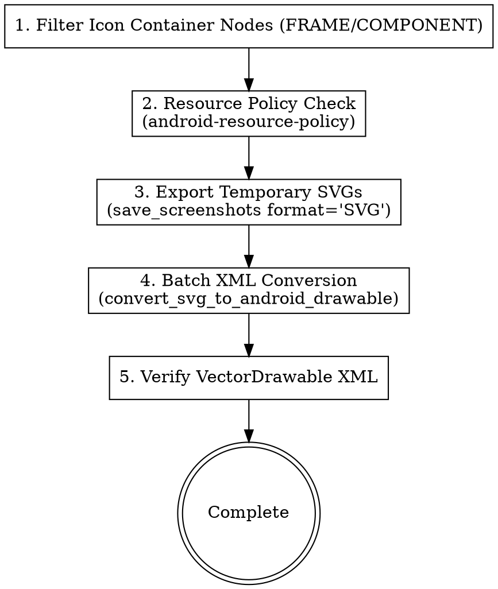

# Figma Asset & Token Extractor

This skill automates the extraction of visual assets (Icons, Images, Design Tokens) from Figma directly into Android Resource directories (`res/drawable/`, `res/values/`, or `:core:designsystem` Kotlin theme tokens) via the `figma_mcp_android` MCP server.

---

## 1. Batch Vector Icon Extraction Pipeline (SVG -> VectorDrawable)

Standard workflow utilizing `save_screenshots` and `convert_svg_to_android_drawable`:



### Step 1: Collect Node IDs & Standardize Names
1. Identify icon container nodes (from `figma-design-analyzer` output or via `scan_nodes_by_types`).
2. Format file names as `ic_<feature_or_name>.xml` (snake_case, lowercase, no hyphens).

### Step 2: Export Temporary SVGs
Call `call_mcp_tool('figma_mcp_android', 'save_screenshots', ...)` to write SVGs to a temporary directory:
```json
{
  "format": "SVG",
  "items": [
    {
      "nodeId": "102:405",
      "outputPath": "temp_svgs/ic_arrow_back.svg",
      "format": "SVG"
    },
    {
      "nodeId": "102:406",
      "outputPath": "temp_svgs/ic_filter.svg",
      "format": "SVG"
    }
  ]
}
```

### Step 3: Batch Convert to Android VectorDrawable
Call `call_mcp_tool('figma_mcp_android', 'convert_svg_to_android_drawable', ...)` to write XMLs directly into `res/drawable/`:
```json
{
  "items": [
    {
      "svgPath": "temp_svgs/ic_arrow_back.svg",
      "outputPath": "core/designsystem/src/main/res/drawable/ic_arrow_back.xml",
      "floatPrecision": 6,
      "fillBlack": false
    },
    {
      "svgPath": "temp_svgs/ic_filter.svg",
      "outputPath": "core/designsystem/src/main/res/drawable/ic_filter.xml",
      "floatPrecision": 6,
      "fillBlack": false
    }
  ]
}
```
*Note: Source SVG files are automatically deleted upon successful conversion.*

---

## 2. Rendering Icons & Images in Jetpack Compose

### Vector Icons
Render VectorDrawables using Compose `Icon` or `Image`:
```kotlin
Icon(
    painter = painterResource(id = R.drawable.ic_arrow_back),
    contentDescription = stringResource(R.string.cd_back),
    tint = AppTheme.colorScheme.colorText
)
```

### Dynamic & Remote Images (Landscapist Glide)
For dynamic URLs, artwork, and banners, use `GlideImage`:
```kotlin
GlideImage(
    imageModel = { imageUrl },
    modifier = Modifier.size(80.dp),
    previewPlaceholder = painterResource(id = R.drawable.ic_image_placeholder),
    loading = { /* loading box */ },
    failure = { /* failure box */ }
)
```

---

## 3. Design Token Extraction (Colors, Typography & Spacing)

1. Call `call_mcp_tool('figma_mcp_android', 'export_tokens', { format: 'json' })`.
2. Parse token JSON output:
   - Color definitions (`colorPrimary`, `colorBgContainer`, `colorText`, `colorError`).
   - Dimension/spacing definitions (`spacing.xs = 4.dp`, `spacing.sm = 8.dp`, `spacing.md = 16.dp`).
   - Corner radius tokens (`shape2`, `shape4`, `shape6`, `shape8`, `shape12`).
   - Typography tokens (`titleLarge`, `bodyMedium`, `labelLarge`).
3. Map tokens into `:core:designsystem` theme files (`Color.kt`, `Spacing.kt`, `Typography.kt`, `Theme.kt`).

---

## 4. Snap Before You Add — token tolerance policy

A design system fragments one token at a time. `spacing15` next to `spacing.md`, a second
near-black beside `colorBgBase`, and within a quarter the theme is a palette again. Every
gap in §6 of the spec gets a decision from this table — never a reflex `add`.

| Kind | Snap to the nearest token when | Add a token when |
|---|---|---|
| Spacing / size | `Δ ≤ 2dp` | `Δ > 2dp`, or the value is a real step the scale lacks |
| Corner radius | `Δ ≤ 2dp` | `Δ > 2dp` |
| Stroke width | `Δ ≤ 0.5dp` | anything larger |
| Colour | per-channel `Δ ≤ 3/255` **and** the same semantic role | a different role, or a visible difference |
| Font size | `Δ ≤ 1sp` **and** the same weight and line height | anything else |
| Line height | `Δ ≤ 2sp` | anything else |

Colour is the strict one on purpose: two near-identical greys with different names is the
failure this policy exists to stop, and a colour that reads the same but means something
different (`colorError` vs a new `colorWarning`) is a genuine addition however close the
hex.

**Every snap is recorded**, in `tokens.snapped[]` of the manifest. An unrecorded snap looks
exactly like a layout defect to floor 4 of `verifier`, which measures the device against the
spec's dp values and does not know you rounded.

When the design **contradicts** an existing token — same role, materially different value —
do not change the token and do not add a near-duplicate. Record it in `tokens.conflicts[]`
and report it. A token is shared surface; changing its value restyles screens nobody asked
you to touch.

---

## 5. Write the Manifest

Every run ends by writing `docs/<feature>/figma-assets.json` — what actually landed, what
was reused instead of exported, what you renamed, which tokens you added or snapped, and
the resource compile you ran. Schema and field rules:
[references/asset-manifest.md](./references/asset-manifest.md).

Stage 3 resolves every `R.drawable` reference against this file. Write it even when you
exported nothing: `"exported": []` proves the stage ran, while a missing file is
indistinguishable from a stage that was never dispatched.

---

## Verification Checklist
- [ ] Simple vector icons converted and exported strictly as `ic_<snake_case>.xml` in `res/drawable/`.
- [ ] Icon container node exported, never a child `VECTOR` path; viewport read back and checked against the frame size.
- [ ] No temporary SVG leftover files in the workspace.
- [ ] Resource reuse verified before adding new drawables or tokens.
- [ ] Every §6 gap decided against the tolerance table — snapped or added, never by reflex.
- [ ] No existing token renamed or revalued; contradictions recorded as conflicts, not resolved.
- [ ] `docs/<feature>/figma-assets.json` written, with every deviation from spec §8 in `renamed[]`.
- [ ] Resource compile run and its exit code recorded in the manifest.
- [ ] Jetpack Compose uses `AppTheme` tokens and Landscapist `GlideImage`.
