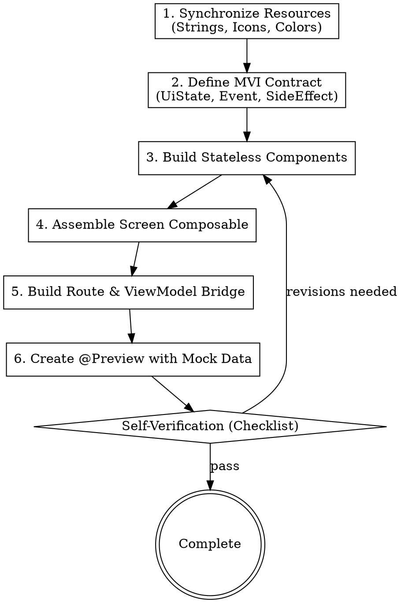

# Figma to Jetpack Compose UI Implementation

This skill handles translating Figma design specifications and assets into production-ready Jetpack Compose UI code, supporting both **updating existing screens** (modifying Composables while preserving ViewModel & business logic) and **implementing new screens**.

---

## Implementation & Update Modes

- **Update Existing Screen Mode**:
  - Retain the existing `*ViewModel`, `*Contract`, UseCases, and navigation structure.
  - Update Composable functions in-place (styling, Auto-Layout paddings, colors, typography, shapes).
  - Swap old vector drawables / icons for newly extracted Figma icons.
- **New Screen Mode**:
  - Build full MVI Contract, Stateless Composables, Route, and `@Preview`s.

---

## Required Reference Guides

- Spec shape (section numbers and table columns): [figma-design-analyzer/references/figma-spec-template.md](../figma-design-analyzer/references/figma-spec-template.md)
- Asset manifest (what stage 2 actually produced): [figma-asset-extractor/references/asset-manifest.md](../figma-asset-extractor/references/asset-manifest.md)
- Layout Mapping: [figma-design-analyzer/references/layout-mapping-guide.md](../figma-design-analyzer/references/layout-mapping-guide.md)
- MVI Contract Derivation: [references/mvi-contract-from-figma.md](./references/mvi-contract-from-figma.md)
- Resource Management: `android-resource-policy`
- Component API shape (modifier params, slots, content lambdas): `compose-component-design`
- State ownership, hoisting, and effects: `compose-state-and-effects`
- Project Style Guide: `.agents/rules/lean.md` (YAGNI, reuse-first, NO comments, null-safety) and `.agents/rules/android.md` (AppTheme tokens, string resources, Orbit MVI)

---

## Upstream pipeline — run this before Step 1

The six steps below start once the design is understood and its assets are in the repo. Getting
there is delegated, because inspecting a Figma tree and converting assets both burn context
that the implementation needs:

1. **Design context** — parse the file key and `node-id` from the URL (URLs encode the colon
   as `%3A` or `-`; convert `123-456` to `123:456`). Dispatch `figma-analyzer` to write
   `docs/<feature>/figma-spec.md` to the canonical template: component inventory, layout
   mapping, variant matrix, typography, token gaps with snap candidates, the asset list, the
   reactions, and a reference PNG per frame under `docs/<feature>/figma/`. Locate the existing
   screen files in parallel with `android-code-indexer`.
2. **Assets and tokens** — once the spec exists, dispatch `figma-asset-extractor` against §8
   to batch-convert simple vector icons (24–48dp) into `res/drawable/ic_<name>.xml` via
   `convert_svg_to_android_drawable`, export raster artwork, resolve §6 gaps by the snap
   policy, and write `docs/<feature>/figma-assets.json`.

Step 1 goes alone — nothing downstream can start without the spec. Step 2 and the
implementation below touch disjoint files, so dispatch `figma-asset-extractor` and
`figma-compose-developer` together in one `invoke_subagent` call (`Subagents` is an array);
the implementer resolves asset names against the manifest, which stage 2 writes last, so a
late read is fine and a mismatch surfaces as a named gap rather than an unresolved symbol.
Keep the MVI contract and the route yourself if you would rather not hand the whole screen
over.

4. **Device conformance** — dispatch `verifier` with the spec path, the reference images, and
   the navigation path to each changed screen. It assembles, installs, drives to the screen,
   and compares what renders against the design. A UI change that only compiles is unverified.

Skip stage 1 when the design was already analysed in this session, and stage 2 when the spec
lists no new assets or tokens. Re-extracting assets that are on disk is pure cost.

---

## Standard 6-Step Implementation Workflow



---

### Step 0: Resolve Names Against the Manifest
Read `docs/<feature>/figma-assets.json` first. Apply `renamed[]` and `reused[].requestedAs`
to the names spec §8 proposed, so that every resource reference you are about to write
points at a file that exists. Anything on the spec's asset list with no manifest entry is a
gap to report, not a reference to write. `tokens.conflicts[]` blocks the elements it names.

### Step 1: Synchronize Resources & Tokens
1. Add static UI text into `res/values/strings.xml` using the ids spec §7 proposed, content descriptions (`cd_*`) included.
2. Verify all vector icons have been converted into `res/drawable/ic_<name>.xml` (via `figma-asset-extractor`).
3. Ensure colors, spacing, and shapes reference project theme tokens (`AppTheme.colorScheme`, `AppTheme.spacing`, `AppTheme.shapes`, `AppTheme.typography`).
4. Build spec §3's `NEW shared` components once, at the path the inventory names — before the screens that consume them.

### Step 2: Define MVI Contract (`Contract.kt`)
Create the MVI Contract file defining:
- `UiState`: Immutable data class describing screen UI state.
- `UiEvent` (or `ScreenAction`): Sealed interface representing user actions.
- `UiSideEffect`: Sealed interface representing one-off side effects (Navigation, Toast, Sheet).

### Step 3: Build Stateless Child Components
Decompose the layout into focused `@Composable` functions:
- Follow **Stateless by default**: receive state via parameters, emit user interactions via callbacks (`onEvent: (ScreenEvent) -> Unit`).
- Map Auto-Layout accurately:
  - Figma `HORIZONTAL` -> `Row(horizontalArrangement = Arrangement.spacedBy(...), verticalAlignment = ...)`
  - Figma `VERTICAL` -> `Column(verticalArrangement = Arrangement.spacedBy(...), horizontalAlignment = ...)`
  - Figma `NONE` / Overlays -> `Box(...)`
  - Dynamic lists -> `LazyColumn` / `LazyRow` with `items(items, key = { ... })`
- Translate padding, corner radius, borders, and shadows to exact `dp`/`sp` dimensions.

### Step 4: Assemble Screen Composable (`Screen.kt`)
Create the top-level Screen Composable:
```kotlin
@Composable
fun FeatureScreen(
    uiState: FeatureUiState,
    onEvent: (FeatureEvent) -> Unit,
    modifier: Modifier = Modifier
) {
    Scaffold(
        modifier = modifier.fillMaxSize(),
        topBar = {
            FeatureTopBar(
                title = stringResource(R.string.feature_title),
                onBackClick = { onEvent(FeatureEvent.OnBackClicked) }
            )
        }
    ) { innerPadding ->
        FeatureContent(
            uiState = uiState,
            onEvent = onEvent,
            modifier = Modifier
                .fillMaxSize()
                .padding(innerPadding)
        )
    }
}
```

### Step 5: Route & ViewModel Bridge (`Route.kt` & `ViewModel.kt`)
Connect the ViewModel to the Screen within the Route Composable:
```kotlin
@Composable
fun FeatureRoute(
    onNavigateBack: () -> Unit,
    onNavigateDetail: (String) -> Unit,
    viewModel: FeatureViewModel = hiltViewModel()
) {
    val uiState by viewModel.container.stateFlow.collectAsStateWithLifecycle()

    ObserveSideEffect(viewModel.container.sideEffectFlow) { effect ->
        when (effect) {
            is FeatureSideEffect.NavigateBack -> onNavigateBack()
            is FeatureSideEffect.NavigateDetail -> onNavigateDetail(effect.id)
        }
    }

    FeatureScreen(
        uiState = uiState,
        onEvent = viewModel::onEvent
    )
}
```

### Step 6: Create `@Preview` Functions — one per §5 row
The variant matrix in spec §5 is the checklist. Every row marked `Preview required` needs a
`@Preview` that renders it with realistic mock data, and a `UiState` shape that can express
it. Do not stop at the default state because it is the one the design shows first.

A row marked `not designed` takes the design system default — do not invent a bespoke
treatment for a state the designer did not draw.

---

## Pre-Delivery Checklist
- [ ] Every `R.drawable` reference matched to an `exported[]` or `reused[]` manifest entry.
- [ ] Every spec §5 row marked `Preview required` has a `@Preview` and a `UiState` that can express it.
- [ ] Shared components from spec §3 built once, at the inventory's path, not duplicated per screen.
- [ ] ZERO Kotlin comments (`//`, `/* */`).
- [ ] ZERO hardcoded display strings; use `stringResource(...)`.
- [ ] ZERO hardcoded hex color codes in layouts; use Theme tokens.
- [ ] All icons use project drawables (`R.drawable.ic_*`), avoiding default Material icons unless specified.
- [ ] Every icon and image carries a `contentDescription` from the `cd_*` strings in spec §7.
- [ ] Robust responsiveness against long text strings and dynamic font scaling.
- [ ] Minimum touch target of 48dp x 48dp for all clickable elements.
- [ ] Navigation path to each changed screen reported, so floor 4 can reach it.
