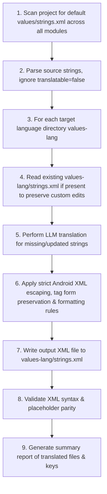

# 🌐 Android Localization & Translation Skill (`translate-strings`)

This skill empowers the AI agent to localize all default Android `strings.xml` resources across all modules in the project into a comprehensive set of target languages. Translations are performed directly by the agent using LLM contextual translation capabilities, adhering strictly to Android AAPT XML compilation rules without requiring external scripts or third-party APIs.

---

## 🎯 Target Languages & Resource Qualifiers

By default, translate strings into the following standard Android resource directories (or any subset specified by the user):

| Language | Code | Android Resource Directory | Notes / Text Direction |
|:---|:---:|:---|:---|
| **Vietnamese** | `vi` | `values-vi` | LTR |
| **Spanish** | `es` | `values-es` | LTR |
| **French** | `fr` | `values-fr` | LTR |
| **German** | `de` | `values-de` | LTR |
| **Chinese (Simplified)** | `zh` | `values-zh` | LTR (or `values-zh-rCN`) |
| **Chinese (Traditional)** | `zh-TW` | `values-zh-rTW` | LTR |
| **Japanese** | `ja` | `values-ja` | LTR |
| **Korean** | `ko` | `values-ko` | LTR |
| **Arabic** | `ar` | `values-ar` | RTL |
| **Italian** | `it` | `values-it` | LTR |
| **Portuguese (Brazil)** | `pt` | `values-pt` | LTR (or `values-pt-rBR`) |
| **Russian** | `ru` | `values-ru` | LTR |
| **Turkish** | `tr` | `values-tr` | LTR |
| **Indonesian** | `in` | `values-in` | LTR (Android AAPT uses `values-in`) |
| **Malay** | `ms` | `values-ms` | LTR |
| **Thai** | `th` | `values-th` | LTR |
| **Ukrainian** | `uk` | `values-uk` | LTR |
| **Polish** | `pl` | `values-pl` | LTR |
| **Dutch** | `nl` | `values-nl` | LTR |
| **Swedish** | `sv` | `values-sv` | LTR |
| **Croatian** | `hr` | `values-hr` | LTR |
| **Serbian** | `sr` | `values-sr` | LTR |
| **Hindi** | `hi` | `values-hi` | LTR |
| **Filipino / Tagalog** | `fil` | `values-fil` | LTR (or `values-tl`) |
| **Hebrew** | `iw` | `values-iw` | RTL (Android AAPT uses `values-iw`) |
| **Farsi / Persian** | `fa` | `values-fa` | RTL |
| **Bengali** | `bn` | `values-bn` | LTR |
| **Czech** | `cs` | `values-cs` | LTR |
| **Romanian** | `ro` | `values-ro` | LTR |
| **Hungarian** | `hu` | `values-hu` | LTR |
| **Greek** | `el` | `values-el` | LTR |

---

## 📋 Translation Workflow



---

## 🛠️ Step-by-Step Implementation Guide

### 1. Scan for Default `strings.xml` Files

- Search for all default `strings.xml` files across all modules in the repository:
  - Pattern: `**/src/main/res/values/strings.xml`
  - Modules may include `:app`, `:core:*`, `:feature:*`, or design system libraries.
- **Ignore** all existing localized folders (`values-<lang>`) when discovering source strings.

### 2. Parse Source Strings & Handle Special Attributes

- Read the content of the default `src/main/res/values/strings.xml`.
- **Skip items marked with `translatable="false"`**:
  ```xml
  <string name="app_name" translatable="false">MyApp</string>
  ```
- Identify different resource types:
  - `<string name="...">...</string>`
  - `<string-array name="...">` with `<item>...</item>`
  - `<plurals name="...">` with `<item quantity="...">...</item>`

### 3. Differential / Incremental Translation

For each target language:
- Check if `src/main/res/values-<lang>/strings.xml` already exists.
- If it exists:
  - Read and parse existing keys.
  - **Preserve** existing manually curated translations for unchanged keys.
  - **Translate only new or modified strings**.
  - Remove obsolete keys that no longer exist in the base `values/strings.xml`.

### 4. Strict Android XML Escaping & Tag Formatting Rules

Ensure full compliance with Android AAPT / Resource compiler constraints:

| Character / Pattern | Escaping Rule | Example Source | Example Translated (Escaped) |
|:---|:---|:---|:---|
| **Apostrophe / Single Quote** (`'`) | Escape with backslash `\'` | `Don't miss out` | `No te lo pierdas` / `N\'hésite pas` |
| **Double Quotes** (`"`) | Escape with backslash `\"` | `Select "Next"` | `Sélectionnez \"Suivant\"` |
| **Ampersand** (`&`) | Escape with `&amp;` | `Terms & Conditions` | `Điều khoản &amp; Điều kiện` |
| **Angle Brackets** (`<`, `>`) | Escape with `&lt;` and `&gt;` | `<5 minutes` | `&lt; 5 minutes` |
| **Starting `@` or `?`** | Escape with `\@` or `\?` (prevents Android resource ref lookup) | `@username` | `\@nom_utilisateur` |
| **Percent Sign (`%`)** | Standalone `%` without placeholders must be `%%` or set `formatted="false"` | `50% off` | `50%% de descuento` or `formatted="false"` |
| **Placeholders** (`%s`, `%d`, `%1$s`, `%2$d`, `%.2f`) | **Never translate specifiers**. Adjust positional order for target grammar | `Page %1$d of %2$d` | `Trang %1$d / %2$d` |
| **Newlines & Whitespace** | Keep explicit `\n` or `\t`. Wrap in quotes if leading/trailing whitespace is required | `"  Spacing  "` | `"  Espaciado  "` |

#### 🏷️ Tag Form & HTML Styling Preservation Rules
Preserve the exact form of tags present in the source string:
- **Raw HTML tags vs Escaped HTML entities**:
  - If the source string uses **raw XML tags** (e.g. `<b>...</b>`, `<i>...</i>`, `<u>...</u>`, `<a>...</a>`, `<font>...</font>`), preserve them as **raw XML tags** in the translation.
  - If the source string uses **entity-escaped tags** (e.g. `&lt;u&gt;...&lt;/u&gt;` or `&lt;b&gt;...&lt;/b&gt;`), preserve them **strictly as entity-escaped tags**. Do NOT convert them into raw XML tags `<...>`, and do NOT convert raw tags into escaped tags.
- **CDATA Blocks (`<![CDATA[...]]>`)**:
  - If the source string wraps content inside `<![CDATA[...]]>`, keep the CDATA wrapper intact and preserve the inner HTML tags without XML escaping.
- **XLIFF Replacement Tags (`<xliff:g>`)**:
  - If the source string uses `<xliff:g id="..." example="...">%1$s</xliff:g>`, keep the `<xliff:g>` tag, its attributes (`id`, `example`), and inner placeholder untouched.
- **Self-closing / Void Tags**:
  - Preserve tags like `<br/>` or `<br>` exactly in their source form.

### 5. Handling Plurals (`<plurals>`) & String Arrays (`<string-array>`)

- **Plurals**: Match the target language's CLDR plural categories:
  - *Languages with single plural form (Japanese, Chinese, Vietnamese, Korean)*: Use `quantity="other"`.
  - *Languages with two forms (English, Spanish, French, German)*: Use `quantity="one"` and `quantity="other"`.
  - *Languages with complex forms (Arabic, Russian, Polish, Ukrainian)*: Provide appropriate items (`zero`, `one`, `two`, `few`, `many`, `other`).
- **String Arrays**: Translate each child `<item>` element in identical order.

### 6. Writing Localized Files

- Create target directory if it does not exist (e.g. `src/main/res/values-vi/`).
- Maintain valid XML structure:
  ```xml
  <?xml version="1.0" encoding="utf-8"?>
  <resources>
      <string name="title_home">Trang chủ</string>
      <string name="action_retry">Thử lại</string>
  </resources>
  ```
- Write using `write_to_file`.

### 7. Validation & Parity Check

- **Static XML Syntax Check**: Verify all tags are properly closed, attributes are valid, and XML entities (`&amp;`, `&lt;`, `&gt;`) are escaped.
- **Tag Parity Check**: Ensure every open/close tag pair in the source string is matched in the translation with identical tag naming and form (raw vs entity-escaped).
- **Placeholder Count & Type Check**: Verify that every format specifier in the source string (e.g., `%1$s`, `%2$d`) exists in the localized string.
- **Apostrophe Check**: Ensure no unescaped apostrophes (`'`) remain in the values.
- **Compilation Check**: If Android SDK and Gradle build environment are available, run `./gradlew assembleDebug` or lint to confirm resource compilation. If the Android SDK is not installed in the environment, rely on rigorous static XML and regex validation.

---

## 🚫 Hard Constraints

1. **No External Scripts or APIs**: Never execute Python, Bash, or HTTP requests to external translation APIs. Translation is executed directly by the LLM in-context.
2. **No Placeholder / Stub Comments**: Never write `<!-- TODO: Translate -->` or leave untranslated stub strings. Every translatable key must be fully translated.
3. **Preserve Resource Names**: Never modify `<string name="...">` identifiers.
4. **Preserve Translatable Attributes**: Respect `translatable="false"` and do not output them into localized directories.
5. **Preserve Tag Form**: Never alter the form of tags (never turn `&lt;u&gt;` into `<u>` or `<u>` into `&lt;u&gt;`).
