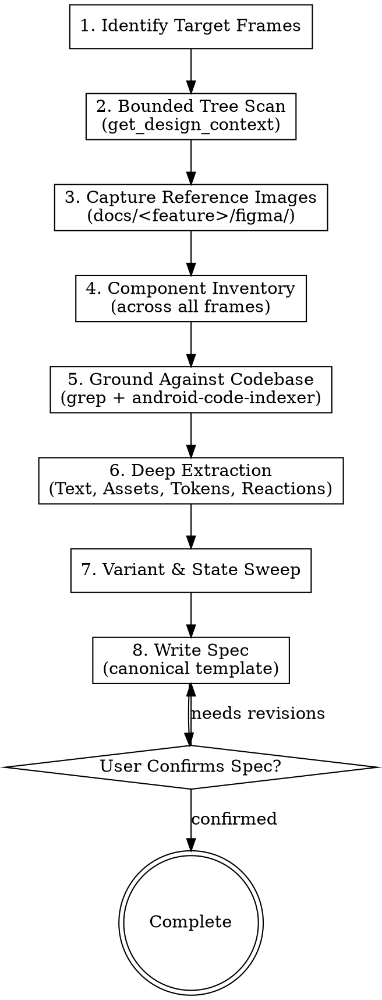

# Figma Design Analyzer

Stage 1 of the Figma pipeline. Inspects screens or components through the
`figma_mcp_android` MCP server and produces one artefact — `docs/<feature>/figma-spec.md`
— plus the reference images beside it in `docs/<feature>/figma/`.

Three agents downstream read that spec and never open Figma themselves. Its completeness
is the whole value of this stage; its *shape* is fixed by
[references/figma-spec-template.md](./references/figma-spec-template.md), which is the
only place the spec's sections and table columns are defined. Do not improvise a section
and do not rename a column — stages 2, 3, and 4 `grep_search` for both.

---

## Figma MCP Tools Used

| Tool | Purpose |
|---|---|
| `get_selection` | Get the list of currently selected nodes in Figma. |
| `get_design_context` | Token-efficient tree retrieval with bounded depth and detail (prevents context overflow). |
| `get_node` | Inspect full detailed properties of a specific node. |
| `get_nodes_info` | Inspect several nodes in one call — the variant sweep depends on it. |
| `scan_text_nodes` | Extract all text content and typography properties across a screen. |
| `scan_nodes_by_types` | Filter nodes by type (`COMPONENT`, `INSTANCE`, `VECTOR`, `FRAME`). |
| `get_local_components` | Component definitions and their variant sets. |
| `get_reactions` | Extract prototype interactions (onClick, onNavigate, delay, bottom sheets). |
| `get_annotations` | Read designer notes and Dev Mode measurements. |
| `get_styles` / `get_variable_defs` / `export_tokens` | Retrieve color, typography, elevation styles, variable modes, and design tokens. |
| `save_screenshots` | Export reference PNGs and SVGs to disk. |

For detailed parameter definitions and usage, see [references/figma-mcp-tools.md](./references/figma-mcp-tools.md).
For Auto-Layout to Android translation rules, see [references/layout-mapping-guide.md](./references/layout-mapping-guide.md).

---

## Workflow



### Step 1: Identify Target Frames
1. If the user already selected nodes in Figma: `call_mcp_tool('figma_mcp_android', 'get_selection', {})`.
2. If the user provides a screen name or URL: `call_mcp_tool('figma_mcp_android', 'search_nodes', { query: '<ScreenName>', nodeTypes: ['FRAME', 'SECTION', 'COMPONENT'] })`.
3. URLs encode the node-id colon as `%3A` or `-`. Convert `node-id=123-456` to `123:456` before any MCP call.
4. Confirm the target with the user when several frames match, and list every frame in scope — a flow is normal, and finding frame 4 after the spec is written costs a second pass over all of them.

### Step 2: Bounded Tree Scan
<HARD-GATE>
NEVER call `get_document` on the entire Figma file. The payload will exhaust the context window and end the task.
</HARD-GATE>

1. `get_design_context` with `depth: 2, detail: 'minimal'` for the skeleton — top bar, content, bottom bar.
2. `get_design_context` with `depth: 3, detail: 'compact', dedupe_components: true` on the containers that matter.
3. `get_node` is for one node whose exact properties you need, never for a sweep.

Log every call in §1 of the spec, and name the branches you skipped. If the design is too
large to inspect properly within budget, stop and return the skeleton plus a proposed split
by frame. **A shallow spec covering six screens is worse than a complete spec covering
one** — the shallow one gets implemented.

### Step 3: Capture Reference Images
Export a PNG of every frame in scope before going deeper:

```json
{
  "format": "PNG", "scale": 2,
  "items": [{ "nodeId": "145:220", "outputPath": "docs/home/figma/ref-home.png", "format": "PNG", "scale": 2 }]
}
```

These are not decoration. They are what the human reviews the spec against, and what
`verifier` compares the running screen to in floor 4. Record each path in §2 of the spec.

### Step 4: Component Inventory
Before describing any single screen, find what repeats across all of them. Use
`get_local_components` and `scan_nodes_by_types` with `nodeTypes: ['COMPONENT', 'INSTANCE']`,
then group instances by their source component.

Fill §3 of the spec. A component on three frames gets one `Decision` row and is built once.
Skipping this step is how the same card gets implemented three times in stage 3, each
slightly differently.

For a single-frame job, write "single frame — no shared components" rather than deleting
the section.

### Step 5: Ground Against the Codebase
Before you claim anything is new, look. `grep_search` and `android-code-indexer` for:
the screen that already exists, the shared layout or `Widget.App.*` style that already
matches the design's button, the drawable already in `res/drawable/`, the `@color` that already
holds that colour.

This populates §2 `Target file`, §3 `Existing match`, §6 `Used`, and §8 `Already in the
repo`. **The most valuable line in the spec is "this is `AppPrimaryButton`, unchanged"** —
it deletes downstream work. The most expensive mistake is describing a component the design
system already ships.

### Step 6: Deep Extraction
1. **Text** — `scan_text_nodes` with `{ nodeId, depth: 4 }`. Split static from dynamic, record `fontSize`, `fontWeight`, `lineHeight`, colour, and the `TextAppearance.App.*` style each maps to. Add a `cd_` row for every icon and image. → §7
2. **Assets** — `scan_nodes_by_types` with `nodeTypes: ['COMPONENT', 'INSTANCE', 'VECTOR', 'FRAME']`. Vector icons: the **outer container** node id and its size. Raster artwork: node id and render path. → §8
3. **Tokens** — `export_tokens` / `get_styles` / `get_variable_defs`. Map each value to a `@color`, `@dimen` or text-appearance resource. Where none exists, record the nearest with its delta — that cell is the input to stage 2's snap decision, not a formality. → §6
4. **Reactions** — `get_reactions` on every clickable node, phrased as user action and system response. → §9
5. **Annotations** — `get_annotations`. Designer notes override every inference you made. → §10

### Step 7: Variant & State Sweep
The step that decides whether the implementation covers more than the happy path.

1. For each component in §3 with a variant set, read its variants (`get_local_components`, then `get_nodes_info` on the variant node ids in one call).
2. For each screen, look for sibling frames named `Loading`, `Empty`, `Error`, `Disabled`, `Pressed`, `Selected`, or a `Dark` mode of the same frame.
3. Fill §5 with one row per state, including the ones the design does **not** define — written as `not designed`, which is a finding, not a blank.

Stage 3 builds a `render` branch per row, and floor 4 walks each one on the device — XML
has no previews, so the route matters. A state absent from this table is a state that ships
unimplemented.

### Step 8: Write the Spec
Write `docs/<feature>/figma-spec.md` exactly as
[references/figma-spec-template.md](./references/figma-spec-template.md) defines it, then
confirm with the user before the pipeline continues.

For a `DIFF` request, state per element **matches**, **changed** (old → new), or **new**.
Do not re-describe a whole screen when three paddings moved.

---

## Completion Checklist
- [ ] Bounded queries only; `get_document` never called; MCP calls and skipped branches logged in §1.
- [ ] A reference PNG on disk for every frame in scope, path recorded in §2.
- [ ] §3 component inventory filled, with an explicit `REUSE`/`NEW` decision per component.
- [ ] §5 variant matrix covers loading, empty, error, dark, and interactive states — `not designed` where absent.
- [ ] §6 gaps carry a nearest-token candidate and delta, not just a hex value.
- [ ] §7 includes a `cd_` content description for every icon and image.
- [ ] §8 asset paths are exact — stage 2 writes them literally.
- [ ] §9 reactions translated into Event / SideEffect names.
- [ ] Every node id in the spec was observed in an MCP response, not constructed.
- [ ] §10 open questions are actionable; an empty §10 claims the design was unambiguous.
- [ ] Spec confirmed with the user before stage 2 or 3 is dispatched.
