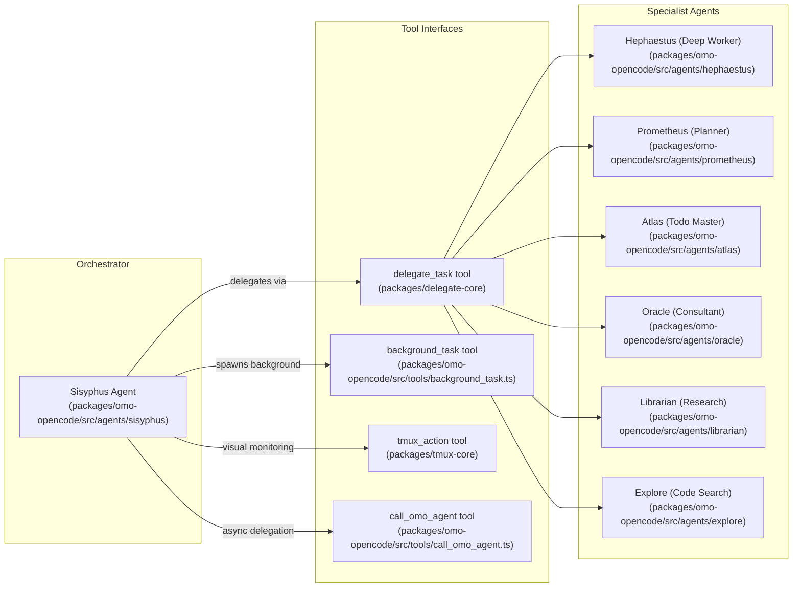

# Overview

Relevant source files

The following files were used as context for generating this wiki page:

- [.agents/skills/work-with-pr-workspace/iteration-1/eval-5/with_skill/outputs/execution-plan.md](https://github.com/code-yeongyu/oh-my-openagent/blob/HEAD/.agents/skills/work-with-pr-workspace/iteration-1/eval-5/with_skill/outputs/execution-plan.md)
- [.omo/evidence/20260809-omo-agent-toolkit-rename/task-5.txt](https://github.com/code-yeongyu/oh-my-openagent/blob/HEAD/.omo/evidence/20260809-omo-agent-toolkit-rename/task-5.txt)
- [.omo/evidence/20260812-init-deep/hierarchy-green.txt](https://github.com/code-yeongyu/oh-my-openagent/blob/HEAD/.omo/evidence/20260812-init-deep/hierarchy-green.txt)
- [.omo/evidence/20260812-init-deep/hierarchy-red.txt](https://github.com/code-yeongyu/oh-my-openagent/blob/HEAD/.omo/evidence/20260812-init-deep/hierarchy-red.txt)
- [.omo/evidence/20260812-init-deep/manual-review.md](https://github.com/code-yeongyu/oh-my-openagent/blob/HEAD/.omo/evidence/20260812-init-deep/manual-review.md)
- [.omo/evidence/20260812-init-deep/qa-summary.md](https://github.com/code-yeongyu/oh-my-openagent/blob/HEAD/.omo/evidence/20260812-init-deep/qa-summary.md)
- [.omo/evidence/20260812-init-deep/scoring.md](https://github.com/code-yeongyu/oh-my-openagent/blob/HEAD/.omo/evidence/20260812-init-deep/scoring.md)
- [.omo/evidence/20260812-init-deep/validation-green.txt](https://github.com/code-yeongyu/oh-my-openagent/blob/HEAD/.omo/evidence/20260812-init-deep/validation-green.txt)
- [.omo/evidence/20260812-init-deep/validation-red.txt](https://github.com/code-yeongyu/oh-my-openagent/blob/HEAD/.omo/evidence/20260812-init-deep/validation-red.txt)
- [.opencode/skills/work-with-pr-workspace/iteration-1/eval-5/with_skill/outputs/execution-plan.md](https://github.com/code-yeongyu/oh-my-openagent/blob/HEAD/.opencode/skills/work-with-pr-workspace/iteration-1/eval-5/with_skill/outputs/execution-plan.md)
- [AGENTS.md](https://github.com/code-yeongyu/oh-my-openagent/blob/HEAD/AGENTS.md)
- [CHANGELOG.md](https://github.com/code-yeongyu/oh-my-openagent/blob/HEAD/CHANGELOG.md)
- [README.ja.md](https://github.com/code-yeongyu/oh-my-openagent/blob/HEAD/README.ja.md)
- [README.ko.md](https://github.com/code-yeongyu/oh-my-openagent/blob/HEAD/README.ko.md)
- [README.md](https://github.com/code-yeongyu/oh-my-openagent/blob/HEAD/README.md)
- [README.ru.md](https://github.com/code-yeongyu/oh-my-openagent/blob/HEAD/README.ru.md)
- [README.zh-cn.md](https://github.com/code-yeongyu/oh-my-openagent/blob/HEAD/README.zh-cn.md)
- [assets/oh-my-opencode.schema.json](https://github.com/code-yeongyu/oh-my-openagent/blob/HEAD/assets/oh-my-opencode.schema.json)
- [bun.lock](https://github.com/code-yeongyu/oh-my-openagent/blob/HEAD/bun.lock)
- [docs/examples/coding-focused.jsonc](https://github.com/code-yeongyu/oh-my-openagent/blob/HEAD/docs/examples/coding-focused.jsonc)
- [docs/examples/default.jsonc](https://github.com/code-yeongyu/oh-my-openagent/blob/HEAD/docs/examples/default.jsonc)
- [docs/examples/planning-focused.jsonc](https://github.com/code-yeongyu/oh-my-openagent/blob/HEAD/docs/examples/planning-focused.jsonc)
- [docs/guide/agent-model-matching.md](https://github.com/code-yeongyu/oh-my-openagent/blob/HEAD/docs/guide/agent-model-matching.md)
- [docs/guide/installation.md](https://github.com/code-yeongyu/oh-my-openagent/blob/HEAD/docs/guide/installation.md)
- [docs/guide/orchestration.md](https://github.com/code-yeongyu/oh-my-openagent/blob/HEAD/docs/guide/orchestration.md)
- [docs/guide/overview.md](https://github.com/code-yeongyu/oh-my-openagent/blob/HEAD/docs/guide/overview.md)
- [docs/guide/team-mode.md](https://github.com/code-yeongyu/oh-my-openagent/blob/HEAD/docs/guide/team-mode.md)
- [docs/reference/cli.md](https://github.com/code-yeongyu/oh-my-openagent/blob/HEAD/docs/reference/cli.md)
- [docs/reference/codex-telemetry.md](https://github.com/code-yeongyu/oh-my-openagent/blob/HEAD/docs/reference/codex-telemetry.md)
- [docs/reference/configuration.md](https://github.com/code-yeongyu/oh-my-openagent/blob/HEAD/docs/reference/configuration.md)
- [docs/reference/features.md](https://github.com/code-yeongyu/oh-my-openagent/blob/HEAD/docs/reference/features.md)
- [docs/reference/known-issues.md](https://github.com/code-yeongyu/oh-my-openagent/blob/HEAD/docs/reference/known-issues.md)
- [docs/reference/prompt-async-gate-rfc.md](https://github.com/code-yeongyu/oh-my-openagent/blob/HEAD/docs/reference/prompt-async-gate-rfc.md)
- [docs/reference/rules-injection-cross-module-comparison.md](https://github.com/code-yeongyu/oh-my-openagent/blob/HEAD/docs/reference/rules-injection-cross-module-comparison.md)
- [package.json](https://github.com/code-yeongyu/oh-my-openagent/blob/HEAD/package.json)
- [packages/AGENTS.md](https://github.com/code-yeongyu/oh-my-openagent/blob/HEAD/packages/AGENTS.md)
- [packages/memory-core/AGENTS.md](https://github.com/code-yeongyu/oh-my-openagent/blob/HEAD/packages/memory-core/AGENTS.md)
- [packages/omo-codex/README.md](https://github.com/code-yeongyu/oh-my-openagent/blob/HEAD/packages/omo-codex/README.md)
- [packages/omo-codex/plugin/README.md](https://github.com/code-yeongyu/oh-my-openagent/blob/HEAD/packages/omo-codex/plugin/README.md)
- [packages/omo-codex/scripts/install-dist/install-local.mjs](https://github.com/code-yeongyu/oh-my-openagent/blob/HEAD/packages/omo-codex/scripts/install-dist/install-local.mjs)
- [packages/omo-codex/tsconfig.json](https://github.com/code-yeongyu/oh-my-openagent/blob/HEAD/packages/omo-codex/tsconfig.json)
- [packages/omo-native/package.json](https://github.com/code-yeongyu/oh-my-openagent/blob/HEAD/packages/omo-native/package.json)
- [packages/omo-native/test/package-shape.test.ts](https://github.com/code-yeongyu/oh-my-openagent/blob/HEAD/packages/omo-native/test/package-shape.test.ts)
- [packages/omo-native/test/senpi-pin.test.ts](https://github.com/code-yeongyu/oh-my-openagent/blob/HEAD/packages/omo-native/test/senpi-pin.test.ts)
- [packages/omo-opencode/src/shared/markdown-link-audit.test.ts](https://github.com/code-yeongyu/oh-my-openagent/blob/HEAD/packages/omo-opencode/src/shared/markdown-link-audit.test.ts)
- [packages/omo-senpi/package.json](https://github.com/code-yeongyu/oh-my-openagent/blob/HEAD/packages/omo-senpi/package.json)
- [packages/omo-senpi/plugin/package.json](https://github.com/code-yeongyu/oh-my-openagent/blob/HEAD/packages/omo-senpi/plugin/package.json)
- [packages/omo-senpi/src/package-shape.test.ts](https://github.com/code-yeongyu/oh-my-openagent/blob/HEAD/packages/omo-senpi/src/package-shape.test.ts)
- [packages/senpi-task/package.json](https://github.com/code-yeongyu/oh-my-openagent/blob/HEAD/packages/senpi-task/package.json)
- [postinstall.test.ts](https://github.com/code-yeongyu/oh-my-openagent/blob/HEAD/postinstall.test.ts)

## Purpose and Scope

This page introduces **oh-my-openagent** (formerly **oh-my-opencode**) as an OpenCode plugin and explains its purpose as a multi-model AI agent orchestration system with "batteries-included" tooling. Oh My OpenAgent transforms a single AI assistant into a coordinated development team by providing 11 specialized agents, 54+ lifecycle hooks, and a suite of tools for code manipulation, task delegation, and background execution.

For practical installation and setup, see [Quick Start](02_1.1-quick-start.md). For a detailed explanation of core terminology and agent behaviors, see [Key Concepts](03_1.2-key-concepts.md).

Sources: [README.md:103-110](https://github.com/code-yeongyu/oh-my-openagent/blob/HEAD/README.md#L103-L110), [AGENTS.md:1-5](https://github.com/code-yeongyu/oh-my-openagent/blob/HEAD/AGENTS.md#L1-L5), [docs/guide/overview.md:1-8](https://github.com/code-yeongyu/oh-my-openagent/blob/HEAD/docs/guide/overview.md#L1-L8)

## What is Oh My OpenAgent?

Oh My OpenAgent is a multi-harness agent orchestration system. It is designed to run on heterogeneous AI models from multiple providers, orchestrating them intelligently to maximize performance and reduce costs. It breaks free from single-provider lock-in by picking the "right brain for the right job."

Key characteristics include:

- **Multi-Agent System:** 11 specialized "Discipline Agents" perform distinct roles, such as main orchestration (`Sisyphus`), deep autonomous work (`Hephaestus`), planning (`Prometheus`), and execution management (`Atlas`) [docs/reference/features.md:5-23](https://github.com/code-yeongyu/oh-my-openagent/blob/HEAD/docs/reference/features.md#L5-L23).
- **Lifecycle Hooks:** A 54-hook system across Session management, Tool Guards, Transforms, and Continuation tiers provide fine-grained control over the agent environment [AGENTS.md:48-48](https://github.com/code-yeongyu/oh-my-openagent/blob/HEAD/AGENTS.md#L48), [package.json:20-20](https://github.com/code-yeongyu/oh-my-openagent/blob/HEAD/package.json#L20).
- **Rich Tooling:** A comprehensive suite of tools supports code manipulation (LSP, AST-grep), hashline-anchored edits, and background processing via `BackgroundManager` [package.json:15-22](https://github.com/code-yeongyu/oh-my-openagent/blob/HEAD/package.json#L15-L22), [package.json:33-33](https://github.com/code-yeongyu/oh-my-openagent/blob/HEAD/package.json#L33).
- **Multi-Harness Support:** Ships in **Ultimate Edition** (for OpenCode) and **Light Edition** (branded as **LazyCodex** for OpenAI Codex CLI) [docs/guide/installation.md:3-8](https://github.com/code-yeongyu/oh-my-openagent/blob/HEAD/docs/guide/installation.md#L3-L8). It also supports **Senpi** as a third harness [packages/omo-senpi/package.json:2-2](https://github.com/code-yeongyu/oh-my-openagent/blob/HEAD/packages/omo-senpi/package.json#L2).
- **Unified Configuration:** Uses `omo.jsonc` with a 4-layer resolution model (shared base → harness block → profile → profile-harness) [docs/reference/configuration.md:3-3](https://github.com/code-yeongyu/oh-my-openagent/blob/HEAD/docs/reference/configuration.md#L3), [docs/reference/configuration.md:52-61](https://github.com/code-yeongyu/oh-my-openagent/blob/HEAD/docs/reference/configuration.md#L52-L61).

Sources: [README.md:103-110](https://github.com/code-yeongyu/oh-my-openagent/blob/HEAD/README.md#L103-L110), [docs/guide/installation.md:3-8](https://github.com/code-yeongyu/oh-my-openagent/blob/HEAD/docs/guide/installation.md#L3-L8), [docs/reference/features.md:4-23](https://github.com/code-yeongyu/oh-my-openagent/blob/HEAD/docs/reference/features.md#L4-L23), [docs/reference/configuration.md:3-61](https://github.com/code-yeongyu/oh-my-openagent/blob/HEAD/docs/reference/configuration.md#L3-L61), [packages/omo-senpi/package.json:2-2](https://github.com/code-yeongyu/oh-my-openagent/blob/HEAD/packages/omo-senpi/package.json#L2)

## System Architecture at a Glance

The following diagrams bridge high-level system concepts with the specific code entities implementing them.

### Bridging NL Space to Code Entity Space: Core Package Layer

The system is built on a 19-package core layer using a strict DAG dependency model.

```mermaid
graph TB
    subgraph Harness_Adapters ["Harness Adapters"]
        OC["omo-opencode\n(packages/omo-opencode)"]
        CX["omo-codex\n(packages/omo-codex)"]
        SP["omo-senpi\n(packages/omo-senpi)"]
        NativeCLI["omo-native\n(packages/omo-native)"]
    end
    
    subgraph Core_Package_Layer ["Core Package Layer"]
        Config["omo-config-core\n(packages/omo-config-core)"]
        ModelCore["model-core\n(packages/model-core)"]
        AgentsCore["agents-md-core\n(packages/agents-md-core)"]
        Boulder["boulder-state\n(packages/boulder-state)"]
        PromptsCore["prompts-core\n(packages/prompts-core)"]
        RulesEngine["rules-engine\n(packages/rules-engine)"]
        HashlineCore["hashline-core\n(packages/hashline-core)"]
        LspCore["lsp-core\n(packages/lsp-core)"]
        TmuxCore["tmux-core\n(packages/tmux-core)"]
        SkillsLoader["skills-loader-core\n(packages/skills-loader-core)"]
        TeamCore["team-core\n(packages/team-core)"]
        DelegateCore["delegate-core\n(packages/delegate-core)"]
        MemoryCore["memory-core\n(packages/memory-core)"]
        TelemetryCore["telemetry-core\n(packages/telemetry-core)"]
        ClaudeCodeCompatCore["claude-code-compat-core\n(packages/claude-code-compat-core)"]
        CommentCheckerCore["comment-checker-core\n(packages/comment-checker-core)"]
        McpStdioCore["mcp-stdio-core\n(packages/mcp-stdio-core)"]
        McpClientCore["mcp-client-core\n(packages/mcp-client-core)"]
        Utils["utils\n(packages/utils)"]
    end
    
    subgraph Execution_Engines ["Execution Engines"]
        SenpiTask["senpi-task\n(packages/senpi-task)"]
        OpenClaw["openclaw-core\n(packages/openclaw-core)"]
    end
    
    OC --> Config
    CX --> Config
    SP --> Config
    NativeCLI --> Config
    
    OC --> DelegateCore
    OC --> TeamCore
    
    SP --> SenpiTask
    OC --> OpenClaw
    
    DelegateCore --> ModelCore
    AgentsCore --> RulesEngine
    HashlineCore --> Boulder
    MemoryCore --> Utils
    TelemetryCore --> Utils
    ClaudeCodeCompatCore --> ModelCore
    ClaudeCodeCompatCore --> Utils
    CommentCheckerCore --> Utils
    McpStdioCore --> Utils
    McpClientCore --> ClaudeCodeCompatCore
    McpClientCore --> Utils
    McpClientCore --> ModelCore
    LspCore --> McpStdioCore
    RulesEngine --> Utils
    SkillsLoader --> Utils
    TeamCore --> Utils
    TmuxCore --> Utils
    PromptsCore --> Utils
    ModelCore --> Utils
    Config --> Utils
    SenpiTask --> Utils
    SenpiTask --> ModelCore
    SenpiTask --> OpenClaw
    OpenClaw --> Utils
    CX --> Utils
    SP --> Utils
    NativeCLI --> Utils
    NativeCLI --> SenpiTask
    NativeCLI --> OpenClaw
    NativeCLI --> ModelCore
    NativeCLI --> TelemetryCore
    NativeCLI --> Config
    NativeCLI --> PromptsCore
    NativeCLI --> RulesEngine
    NativeCLI --> SkillsLoader
    NativeCLI --> CommentCheckerCore
    NativeCLI --> LspCore
    NativeCLI --> McpClientCore
    NativeCLI --> McpStdioCore
    NativeCLI --> MemoryCore
    NativeCLI --> TeamCore
    NativeCLI --> DelegateCore
    NativeCLI --> ClaudeCodeCompatCore
    NativeCLI --> HashlineCore
    NativeCLI --> Boulder
    OC --> Utils
    OC --> ModelCore
    OC --> PromptsCore
    OC --> RulesEngine
    OC --> AgentsCore
    OC --> CommentCheckerCore
    OC --> HashlineCore
    OC --> Boulder
    OC --> TelemetryCore
    OC --> LspCore
    OC --> McpStdioCore
    OC --> TmuxCore
    OC --> ClaudeCodeCompatCore
    OC --> SkillsLoader
    OC --> McpClientCore
    OC --> TeamCore
    OC --> DelegateCore
    OC --> MemoryCore
```

Sources: [package.json:8-38](https://github.com/code-yeongyu/oh-my-openagent/blob/HEAD/package.json#L8-L38), [docs/reference/configuration.md:46-47](https://github.com/code-yeongyu/oh-my-openagent/blob/HEAD/docs/reference/configuration.md#L46-L47), [AGENTS.md:51-51](https://github.com/code-yeongyu/oh-my-openagent/blob/HEAD/AGENTS.md#L51), [bun.lock:28-56](https://github.com/code-yeongyu/oh-my-openagent/blob/HEAD/bun.lock#L28-L56)

### Bridging NL Space to Code Entity Space: Agent Orchestration

The `Sisyphus` orchestrator coordinates specialists through delegation and background task tools.

Sources: [docs/reference/features.md:5-23](https://github.com/code-yeongyu/oh-my-openagent/blob/HEAD/docs/reference/features.md#L5-L23), [package.json:10-10](https://github.com/code-yeongyu/oh-my-openagent/blob/HEAD/package.json#L10), [package.json:22-23](https://github.com/code-yeongyu/oh-my-openagent/blob/HEAD/package.json#L22-L23), [docs/reference/features.md:62-79](https://github.com/code-yeongyu/oh-my-openagent/blob/HEAD/docs/reference/features.md#L62-L79), [docs/reference/configuration.md:123-124](https://github.com/code-yeongyu/oh-my-openagent/blob/HEAD/docs/reference/configuration.md#L123-L124), [docs/reference/configuration.md:125-125](https://github.com/code-yeongyu/oh-my-openagent/blob/HEAD/docs/reference/configuration.md#L125)

## Key Components

### Discipline Agents (11 total)

Agents are specialized by role, model preference, and tool permissions. The system uses edition-aware model chains.

| Agent | Role | Primary Model | Fallback Logic |
| :--- | :--- | :--- | :--- |
| **Sisyphus** | Main Orchestrator | `claude-opus-5` | Falls back to `kimi-k3` → `gpt-5.6-sol` → `glm-5.2` [docs/reference/features.md:13-13](https://github.com/code-yeongyu/oh-my-openagent/blob/HEAD/docs/reference/features.md#L13) |
| **Hephaestus** | Deep Worker | `gpt-5.6-sol` | Flagship GPT-5.x line for autonomous multi-file reasoning [docs/guide/agent-model-matching.md:68-74](https://github.com/code-yeongyu/oh-my-openagent/blob/HEAD/docs/guide/agent-model-matching.md#L68-L74) |
| **Prometheus** | Strategic Planner | `claude-fable-5` | Optimized for mechanics-driven planning and interview-mode [docs/reference/features.md:19-19](https://github.com/code-yeongyu/oh-my-openagent/blob/HEAD/docs/reference/features.md#L19) |
| **Atlas** | Todo Master | `claude-sonnet-5` | Manages execution loops and task status [docs/reference/features.md:22-22](https://github.com/code-yeongyu/oh-my-openagent/blob/HEAD/docs/reference/features.md#L22) |
| **Oracle** | Consultant | `gpt-5.6-sol` | Read-only architecture and design reviewer [docs/reference/features.md:39-39](https://github.com/code-yeongyu/oh-my-openagent/blob/HEAD/docs/reference/features.md#L39) |
| **Librarian** | Research | `google/gemini-3.6-flash` | Cheap, fast models for external documentation and knowledge retrieval [docs/reference/configuration.md:123-123](https://github.com/code-yeongyu/oh-my-openagent/blob/HEAD/docs/reference/configuration.md#L123) |
| **Explore** | Code Search | `github-copilot/grok-code-fast-1` | Efficiently searches and navigates the codebase [docs/reference/configuration.md:124-124](https://github.com/code-yeongyu/oh-my-openagent/blob/HEAD/docs/reference/configuration.md#L124) |

For details on agent-model matching and specific model chains, see [Agent-Model Matching Guide](https://github.com/code-yeongyu/oh-my-openagent/blob/HEAD/docs/guide/agent-model-matching.md).

Sources: [docs/reference/features.md:11-23](https://github.com/code-yeongyu/oh-my-openagent/blob/HEAD/docs/reference/features.md#L11-L23), [docs/guide/agent-model-matching.md:47-77](https://github.com/code-yeongyu/oh-my-openagent/blob/HEAD/docs/guide/agent-model-matching.md#L47-L77), [docs/reference/configuration.md:123-124](https://github.com/code-yeongyu/oh-my-openagent/blob/HEAD/docs/reference/configuration.md#L123-L124)

### Tools and Features

- **Hashline Edit System**: Uses `LINE#ID` content hashing to prevent model hallucinations during file edits [docs/reference/configuration.md:35-35](https://github.com/code-yeongyu/oh-my-openagent/blob/HEAD/docs/reference/configuration.md#L35), [package.json:21-21](https://github.com/code-yeongyu/oh-my-openagent/blob/HEAD/package.json#L21).
- **Background Task System**: `BackgroundManager` handles concurrent execution (limit 5 per provider) with parent session notifications [docs/reference/features.md:62-79](https://github.com/code-yeongyu/oh-my-openagent/blob/HEAD/docs/reference/features.md#L62-L79).
- **Tmux Integration**: Provides a `TmuxSessionManager` for visual monitoring of background agents and interactive bash sessions [package.json:22-22](https://github.com/code-yeongyu/oh-my-openagent/blob/HEAD/package.json#L22), [docs/reference/configuration.md:25-25](https://github.com/code-yeongyu/oh-my-openagent/blob/HEAD/docs/reference/configuration.md#L25).
- **Skills System**: Discoverable MCP-based skills including `git-master`, `ast-grep`, and `ultimate-browsing` [package.json:28-30](https://github.com/code-yeongyu/oh-my-openagent/blob/HEAD/package.json#L28-L30).
- **OpenClaw Integration**: Provides a webhook/notification gateway for external integrations like Discord, Telegram, and HTTP webhooks [package.json:24-24](https://github.com/code-yeongyu/oh-my-openagent/blob/HEAD/package.json#L24).

Sources: [package.json:8-35](https://github.com/code-yeongyu/oh-my-openagent/blob/HEAD/package.json#L8-L35), [docs/reference/features.md:62-79](https://github.com/code-yeongyu/oh-my-openagent/blob/HEAD/docs/reference/features.md#L62-L79), [docs/reference/configuration.md:35-35](https://github.com/code-yeongyu/oh-my-openagent/blob/HEAD/docs/reference/configuration.md#L35), [package.json:24-24](https://github.com/code-yeongyu/oh-my-openagent/blob/HEAD/package.json#L24)

## Key Workflows

- **Ultrawork Mode (`/ultrawork`)**: Engages all agents in an aggressive parallel execution loop until the task is complete [README.md:109-109](https://github.com/code-yeongyu/oh-my-openagent/blob/HEAD/README.md#L109), [docs/guide/installation.md:5-5](https://github.com/code-yeongyu/oh-my-openagent/blob/HEAD/docs/guide/installation.md#L5).
- **Planning Workflow (`/start-work`)**: Initiates strategic pre-planning with `Prometheus` before handing off to worker agents [docs/reference/features.md:19-19](https://github.com/code-yeongyu/oh-my-openagent/blob/HEAD/docs/reference/features.md#L19), [package.json:19-19](https://github.com/code-yeongyu/oh-my-openagent/blob/HEAD/package.json#L19).
- **Team Mode**: A multi-agent coordination system where a Lead agent manages Members with mailbox communication and worktree isolation [package.json:23-23](https://github.com/code-yeongyu/oh-my-openagent/blob/HEAD/package.json#L23).
- **Ralph Loop**: A mechanism for continuous task execution and todo enforcement, often used in conjunction with `ultrawork` [README.md:85-85](https://github.com/code-yeongyu/oh-my-openagent/blob/HEAD/README.md#L85).

Sources: [README.md:109-109](https://github.com/code-yeongyu/oh-my-openagent/blob/HEAD/README.md#L109), [docs/guide/installation.md:5-5](https://github.com/code-yeongyu/oh-my-openagent/blob/HEAD/docs/guide/installation.md#L5), [package.json:23-23](https://github.com/code-yeongyu/oh-my-openagent/blob/HEAD/package.json#L23), [README.md:85-85](https://github.com/code-yeongyu/oh-my-openagent/blob/HEAD/README.md#L85)

## Next Steps

For deeper exploration of the system, visit these child pages:

- **[Quick Start](02_1.1-quick-start.md)** — Rapid installation guide and first usage of `ultrawork`.
- **[Key Concepts](03_1.2-key-concepts.md)** — Detailed explanation of core terminology like `ultrawork`, Discipline Agents, IntentGate, Hash-Anchored Edit, categories, skills, and the three harnesses (OpenCode, Codex, Senpi).

Sources: [README.md:112-133](https://github.com/code-yeongyu/oh-my-openagent/blob/HEAD/README.md#L112-L133), [docs/guide/overview.md:11-34](https://github.com/code-yeongyu/oh-my-openagent/blob/HEAD/docs/guide/overview.md#L11-L34)18:T45e8,# Qui