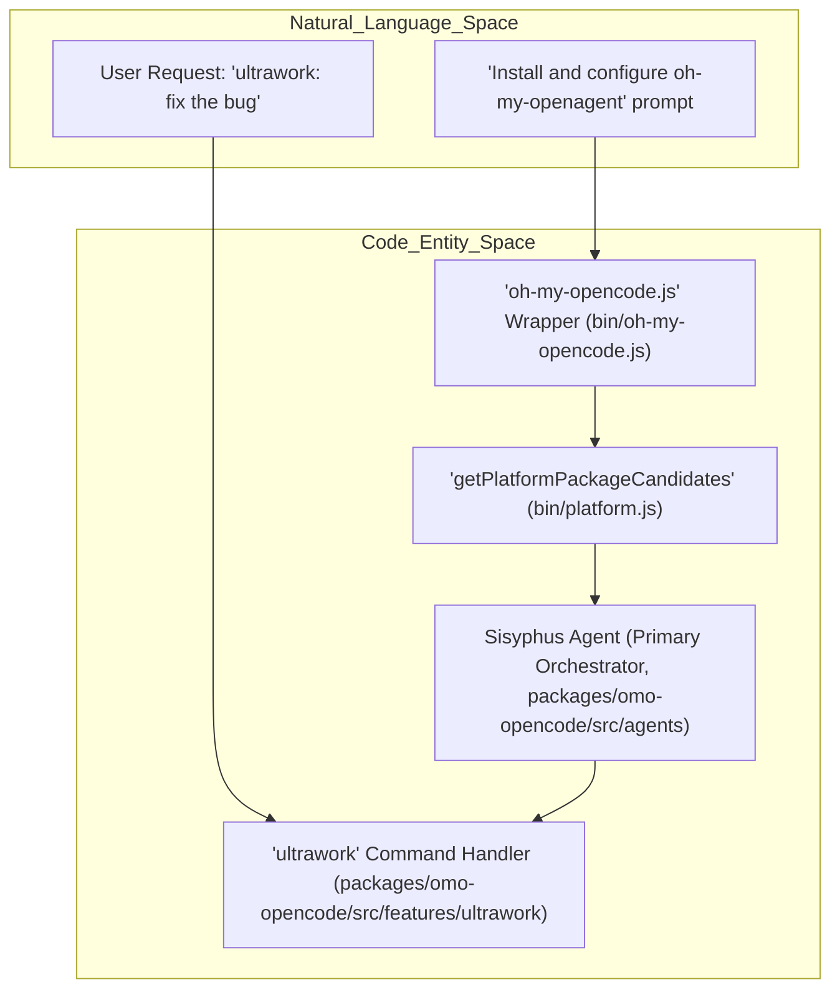
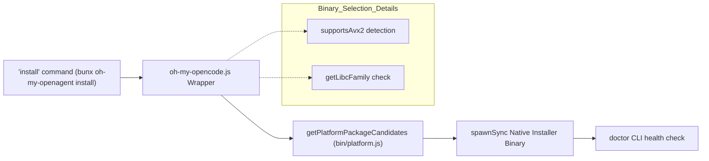
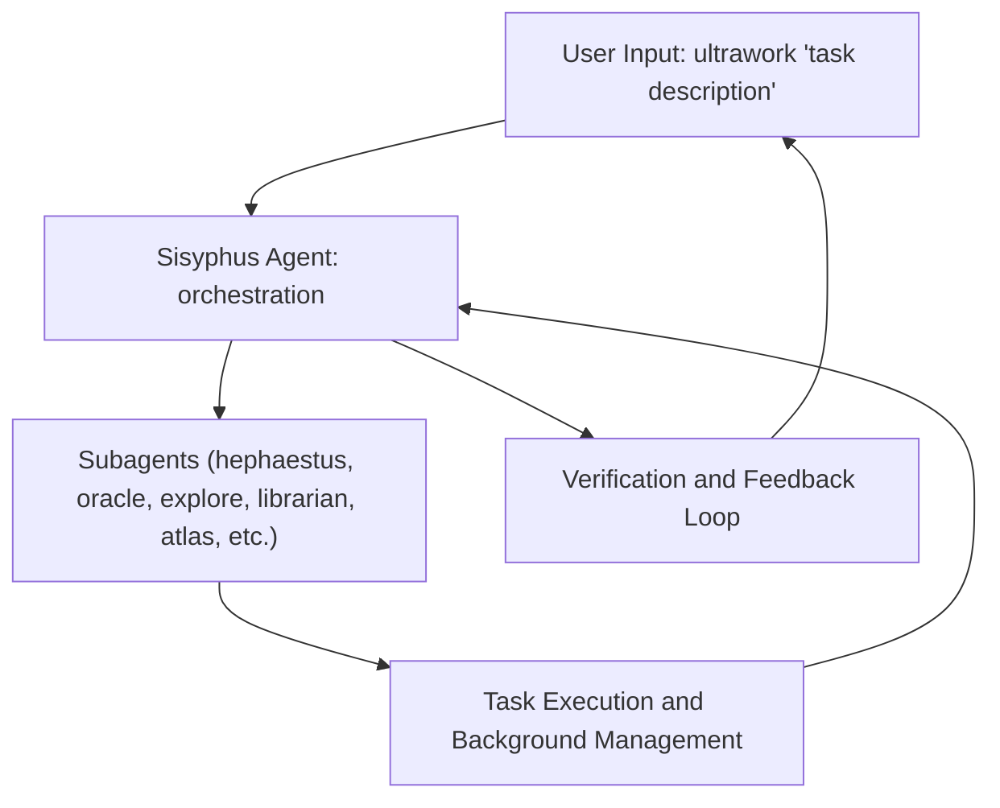
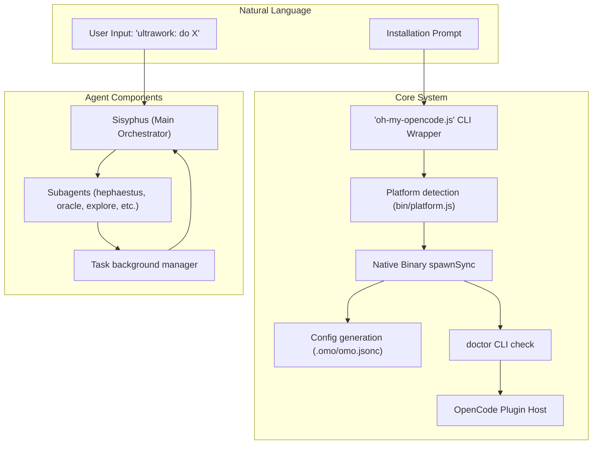

# Quick Start

<details>
<summary>Relevant source files</summary>

The following files were used as context for generating this wiki page:

- [.agents/skills/work-with-pr-workspace/iteration-1/eval-5/with_skill/outputs/execution-plan.md](https://github.com/code-yeongyu/oh-my-openagent/blob/HEAD/.agents/skills/work-with-pr-workspace/iteration-1/eval-5/with_skill/outputs/execution-plan.md)
- [.omo/evidence/20260809-omo-agent-toolkit-rename/task-5.txt](https://github.com/code-yeongyu/oh-my-openagent/blob/HEAD/.omo/evidence/20260809-omo-agent-toolkit-rename/task-5.txt)
- [.opencode/skills/work-with-pr-workspace/iteration-1/eval-5/with_skill/outputs/execution-plan.md](https://github.com/code-yeongyu/oh-my-openagent/blob/HEAD/.opencode/skills/work-with-pr-workspace/iteration-1/eval-5/with_skill/outputs/execution-plan.md)
- [CHANGELOG.md](https://github.com/code-yeongyu/oh-my-openagent/blob/HEAD/CHANGELOG.md)
- [README.ja.md](https://github.com/code-yeongyu/oh-my-openagent/blob/HEAD/README.ja.md)
- [README.ko.md](https://github.com/code-yeongyu/oh-my-openagent/blob/HEAD/README.ko.md)
- [README.md](https://github.com/code-yeongyu/oh-my-openagent/blob/HEAD/README.md)
- [README.ru.md](https://github.com/code-yeongyu/oh-my-openagent/blob/HEAD/README.ru.md)
- [README.zh-cn.md](https://github.com/code-yeongyu/oh-my-openagent/blob/HEAD/README.zh-cn.md)
- [assets/oh-my-opencode.schema.json](https://github.com/code-yeongyu/oh-my-openagent/blob/HEAD/assets/oh-my-opencode.schema.json)
- [docs/examples/coding-focused.jsonc](https://github.com/code-yeongyu/oh-my-openagent/blob/HEAD/docs/examples/coding-focused.jsonc)
- [docs/examples/default.jsonc](https://github.com/code-yeongyu/oh-my-openagent/blob/HEAD/docs/examples/default.jsonc)
- [docs/examples/planning-focused.jsonc](https://github.com/code-yeongyu/oh-my-openagent/blob/HEAD/docs/examples/planning-focused.jsonc)
- [docs/guide/agent-model-matching.md](https://github.com/code-yeongyu/oh-my-openagent/blob/HEAD/docs/guide/agent-model-matching.md)
- [docs/guide/installation.md](https://github.com/code-yeongyu/oh-my-openagent/blob/HEAD/docs/guide/installation.md)
- [docs/guide/orchestration.md](https://github.com/code-yeongyu/oh-my-openagent/blob/HEAD/docs/guide/orchestration.md)
- [docs/guide/overview.md](https://github.com/code-yeongyu/oh-my-openagent/blob/HEAD/docs/guide/overview.md)
- [docs/guide/team-mode.md](https://github.com/code-yeongyu/oh-my-openagent/blob/HEAD/docs/guide/team-mode.md)
- [docs/reference/cli.md](https://github.com/code-yeongyu/oh-my-openagent/blob/HEAD/docs/reference/cli.md)
- [docs/reference/codex-telemetry.md](https://github.com/code-yeongyu/oh-my-openagent/blob/HEAD/docs/reference/codex-telemetry.md)
- [docs/reference/configuration.md](https://github.com/code-yeongyu/oh-my-openagent/blob/HEAD/docs/reference/configuration.md)
- [docs/reference/features.md](https://github.com/code-yeongyu/oh-my-openagent/blob/HEAD/docs/reference/features.md)
- [docs/reference/known-issues.md](https://github.com/code-yeongyu/oh-my-openagent/blob/HEAD/docs/reference/known-issues.md)
- [docs/reference/prompt-async-gate-rfc.md](https://github.com/code-yeongyu/oh-my-openagent/blob/HEAD/docs/reference/prompt-async-gate-rfc.md)
- [docs/reference/rules-injection-cross-module-comparison.md](https://github.com/code-yeongyu/oh-my-openagent/blob/HEAD/docs/reference/rules-injection-cross-module-comparison.md)
- [packages/omo-codex/README.md](https://github.com/code-yeongyu/oh-my-openagent/blob/HEAD/packages/omo-codex/README.md)
- [packages/omo-codex/plugin/README.md](https://github.com/code-yeongyu/oh-my-openagent/blob/HEAD/packages/omo-codex/plugin/README.md)
- [packages/omo-codex/scripts/install-agent-links.test.mjs](https://github.com/code-yeongyu/oh-my-openagent/blob/HEAD/packages/omo-codex/scripts/install-agent-links.test.mjs)
- [packages/omo-codex/scripts/install-cli-args.test.mjs](https://github.com/code-yeongyu/oh-my-openagent/blob/HEAD/packages/omo-codex/scripts/install-cli-args.test.mjs)
- [packages/omo-codex/scripts/install-delegated-command.test.mjs](https://github.com/code-yeongyu/oh-my-openagent/blob/HEAD/packages/omo-codex/scripts/install-delegated-command.test.mjs)
- [packages/omo-codex/scripts/install-local-entrypoint.test.mjs](https://github.com/code-yeongyu/oh-my-openagent/blob/HEAD/packages/omo-codex/scripts/install-local-entrypoint.test.mjs)
- [packages/omo-codex/scripts/install-local.mjs](https://github.com/code-yeongyu/oh-my-openagent/blob/HEAD/packages/omo-codex/scripts/install-local.mjs)
- [packages/omo-codex/scripts/install-local.test.mjs](https://github.com/code-yeongyu/oh-my-openagent/blob/HEAD/packages/omo-codex/scripts/install-local.test.mjs)
- [packages/omo-codex/scripts/install-project-local-cleanup.test.mjs](https://github.com/code-yeongyu/oh-my-openagent/blob/HEAD/packages/omo-codex/scripts/install-project-local-cleanup.test.mjs)
- [packages/omo-codex/src/install/install-local-cli.ts](https://github.com/code-yeongyu/oh-my-openagent/blob/HEAD/packages/omo-codex/src/install/install-local-cli.ts)
- [packages/omo-codex/src/install/lazycodex-cli-args.ts](https://github.com/code-yeongyu/oh-my-openagent/blob/HEAD/packages/omo-codex/src/install/lazycodex-cli-args.ts)
- [packages/omo-codex/src/install/lazycodex-delegated-command.ts](https://github.com/code-yeongyu/oh-my-openagent/blob/HEAD/packages/omo-codex/src/install/lazycodex-delegated-command.ts)
- [packages/omo-codex/tsconfig.json](https://github.com/code-yeongyu/oh-my-openagent/blob/HEAD/packages/omo-codex/tsconfig.json)
- [packages/omo-opencode/src/cli/install-codex/install-codex.ts](https://github.com/code-yeongyu/oh-my-openagent/blob/HEAD/packages/omo-opencode/src/cli/install-codex/install-codex.ts)
- [packages/omo-opencode/src/cli/install-codex/link-cached-plugin-agents.ts](https://github.com/code-yeongyu/oh-my-openagent/blob/HEAD/packages/omo-opencode/src/cli/install-codex/link-cached-plugin-agents.ts)
- [packages/omo-opencode/src/features/team-mode/team-runtime/create.ts](https://github.com/code-yeongyu/oh-my-openagent/blob/HEAD/packages/omo-opencode/src/features/team-mode/team-runtime/create.ts)
- [packages/omo-opencode/src/features/tmux-subagent/failed-readiness-cache.ts](https://github.com/code-yeongyu/oh-my-openagent/blob/HEAD/packages/omo-opencode/src/features/tmux-subagent/failed-readiness-cache.ts)
- [packages/omo-opencode/src/features/tmux-subagent/resolve-server-url.ts](https://github.com/code-yeongyu/oh-my-openagent/blob/HEAD/packages/omo-opencode/src/features/tmux-subagent/resolve-server-url.ts)
- [packages/omo-opencode/src/shared/markdown-link-audit.test.ts](https://github.com/code-yeongyu/oh-my-openagent/blob/HEAD/packages/omo-opencode/src/shared/markdown-link-audit.test.ts)
- [postinstall.test.ts](https://github.com/code-yeongyu/oh-my-openagent/blob/HEAD/postinstall.test.ts)

</details>


This guide provides a rapid getting-started path for **oh-my-openagent** (formerly **oh-my-opencode**). It covers installation via the CLI and executing your first `ultrawork` command to engage the multi-agent orchestration system.

---

## Overview: Installation to First Command

The setup process transitions from package installation to an interactive configuration phase that automatically detects your AI subscriptions (Claude, OpenAI, Gemini, etc.) and maps the best "brains" to specific agent roles. This is documented in the Installation Guide [docs/guide/installation.md:3-14](https://github.com/code-yeongyu/oh-my-openagent/blob/HEAD/docs/guide/installation.md#L3-L14).

**oh-my-openagent** implements a multi-model approach where different providers are orchestrated based on their specific reasoning strengths. For example, Claude-family models are used for orchestration in the Sisyphus agent, while GPT-family models handle deep technical execution in Hephaestus [docs/guide/agent-model-matching.md:13-37](https://github.com/code-yeongyu/oh-my-openagent/blob/HEAD/docs/guide/agent-model-matching.md#L13-L37).

### Natural Language to Code Entity Space

The following diagram illustrates the flow from a natural language user request through the system components responsible for installation and starting the `ultrawork` command:



**Sources:** [bin/oh-my-opencode.js:141-163](https://github.com/code-yeongyu/oh-my-openagent/blob/HEAD/bin/oh-my-opencode.js#L141-L163), [bin/platform.js:11-15](https://github.com/code-yeongyu/oh-my-openagent/blob/HEAD/bin/platform.js#L11-L15), [docs/reference/features.md:3-25](https://github.com/code-yeongyu/oh-my-openagent/blob/HEAD/docs/reference/features.md#L3-L25), [docs/guide/overview.md:29-32](https://github.com/code-yeongyu/oh-my-openagent/blob/HEAD/docs/guide/overview.md#L29-L32)

---

## Step 1: Install and Configure

The recommended way to get started is to run the interactive installer, which handles plugin registration for OpenCode and maps agent models based on the API keys detected.

### For Humans

Paste the following prompt into your existing LLM agent session (e.g., Claude Code, AmpCode, Cursor):

```text
Install and configure oh-my-openagent by following the instructions here:
https://raw.githubusercontent.com/code-yeongyu/oh-my-openagent/refs/heads/dev/docs/guide/installation.md
```

This method is strongly recommended as LLMs perform the interactive setup more reliably than manual typing [docs/guide/installation.md:20-22](https://github.com/code-yeongyu/oh-my-openagent/blob/HEAD/docs/guide/installation.md#L20-L22).

### Manual CLI Execution

For direct control, run the installer from the CLI. The main binary wrapper `oh-my-opencode.js` automatically selects the correct platform package and binary variant depending on your system [bin/oh-my-opencode.js:37-68](https://github.com/code-yeongyu/oh-my-openagent/blob/HEAD/bin/oh-my-opencode.js#L37-L68).

```bash
bunx oh-my-openagent install
```

For the Light Edition targeting Codex CLI users, run:

```bash
npx lazycodex-ai install
```

**Installer Responsibilities:**

-   **Platform Detection:** Determines whether to install for OpenCode (Ultimate), Codex (Light), or both, placing files and configs accordingly [docs/guide/installation.md:10-14](https://github.com/code-yeongyu/oh-my-openagent/blob/HEAD/docs/guide/installation.md#L10-L14).
-   **Binary Selection:** Detects processor features like AVX2 and libc variants to pick the optimal native binary [bin/oh-my-opencode.js:23-68](https://github.com/code-yeongyu/oh-my-openagent/blob/HEAD/bin/oh-my-opencode.js#L23-L68).
-   **Subscription Detection:** Prompts for API keys to associate providers (Anthropic, OpenAI, Gemini, etc.) and assigns models to agents [docs/reference/cli.md:45-72](https://github.com/code-yeongyu/oh-my-openagent/blob/HEAD/docs/reference/cli.md#L45-L72).
-   **Configuration Generation:** Synthesizes and writes `omo.jsonc` with agent-to-model mappings and category-based skill model routing [docs/reference/configuration.md:44-59](https://github.com/code-yeongyu/oh-my-openagent/blob/HEAD/docs/reference/configuration.md#L44-L59).

**Sources:** [docs/guide/installation.md:3-14](https://github.com/code-yeongyu/oh-my-openagent/blob/HEAD/docs/guide/installation.md#L3-L14), [bin/oh-my-opencode.js:37-163](https://github.com/code-yeongyu/oh-my-openagent/blob/HEAD/bin/oh-my-opencode.js#L37-L163), [docs/reference/configuration.md:44-59](https://github.com/code-yeongyu/oh-my-openagent/blob/HEAD/docs/reference/configuration.md#L44-L59), [docs/reference/cli.md:45-72](https://github.com/code-yeongyu/oh-my-openagent/blob/HEAD/docs/reference/cli.md#L45-L72)

---

## Step 2: Verify Plugin Loading

After installation, open OpenCode to trigger plugin initialization. You can verify the health of your installation using the built-in diagnostic tool:

```bash
bunx oh-my-openagent doctor
```

This command verifies system compatibility, plugin loading, configuration correctness, model availability, and basic tool operation [docs/reference/cli.md:120-125](https://github.com/code-yeongyu/oh-my-openagent/blob/HEAD/docs/reference/cli.md#L120-L125).

### Initialization and Binary Selection Flow

The flowchart below depicts the installation command invocation and platform-native binary resolution process:



**Sources:** [bin/oh-my-opencode.js:23-68](https://github.com/code-yeongyu/oh-my-openagent/blob/HEAD/bin/oh-my-opencode.js#L23-L68), [bin/oh-my-opencode.js:141-196](https://github.com/code-yeongyu/oh-my-openagent/blob/HEAD/bin/oh-my-opencode.js#L141-L196), [bin/platform.js:11-15](https://github.com/code-yeongyu/oh-my-openagent/blob/HEAD/bin/platform.js#L11-L15), [docs/reference/cli.md:120-125](https://github.com/code-yeongyu/oh-my-openagent/blob/HEAD/docs/reference/cli.md#L120-L125)

---

## Step 3: Your First `ultrawork`

Once installed and verified, run the `ultrawork` command in your OpenCode or Codex CLI session to invoke the full multi-agent orchestration system:

```text
ultrawork: Add a new API endpoint for user profile updates with validation.
```

This command activates the main orchestrator (Sisyphus) which plans, delegates, and automatically manages task completion using specialized agents [docs/guide/overview.md:29-32](https://github.com/code-yeongyu/oh-my-openagent/blob/HEAD/docs/guide/overview.md#L29-L32), [docs/reference/features.md:6-20](https://github.com/code-yeongyu/oh-my-openagent/blob/HEAD/docs/reference/features.md#L6-L20).

### How Ultrawork Works

1.  **Sisyphus: The Main Orchestrator**
    Sisyphus manages the task lifecycle, delegating subtasks to specialized subagents intelligently, maintaining aggressive parallel execution until completion [docs/reference/features.md:10-15](https://github.com/code-yeongyu/oh-my-openagent/blob/HEAD/docs/reference/features.md#L10-L15).

2.  **Specialized Worker Agents**
    Subagents include `hephaestus` (deep developer using GPT-5.6 Sol), `oracle` (architecture consultant), `librarian` (documentation search), and more. Each uses appropriate models and tools optimized for their role [docs/reference/features.md:5-22](https://github.com/code-yeongyu/oh-my-openagent/blob/HEAD/docs/reference/features.md#L5-L22).

3.  **Task and Loop Enforcement**
    The system uses a `ulw-loop` mechanism combined with the `boulder` work state system to iteratively monitor and ensure the task progresses until done, invoking retries and fallback models automatically [docs/reference/cli.md:30-41](https://github.com/code-yeongyu/oh-my-openagent/blob/HEAD/docs/reference/cli.md#L30-L41).

### Data Flow During Ultrawork



**Sources:** [docs/guide/overview.md:29-32](https://github.com/code-yeongyu/oh-my-openagent/blob/HEAD/docs/guide/overview.md#L29-L32), [docs/reference/features.md:6-22](https://github.com/code-yeongyu/oh-my-openagent/blob/HEAD/docs/reference/features.md#L6-L22), [docs/reference/cli.md:30-41](https://github.com/code-yeongyu/oh-my-openagent/blob/HEAD/docs/reference/cli.md#L30-L41)

---

## Configuration Reference

**oh-my-openagent** uses a JSONC configuration file, typically `~/.omo/omo.jsonc` or `.omo/omo.jsonc`, to configure agents, categories, models, concurrency limits, and feature flags [docs/reference/configuration.md:43-144](https://github.com/code-yeongyu/oh-my-openagent/blob/HEAD/docs/reference/configuration.md#L43-L144).

| Feature | Description | Config Section |
| :--------------------- | :----------------------------------------- | :--------------------------- |
| **Agents** | Definitions and model overrides for agents | `agents` |
| **Categories** | Task categories used for model routing | `categories` |
| **Concurrency** | Limits on provider and model concurrency | `background_task` |
| **Disabled Features** | Disabled hooks, skills, tools, commands | `disabled_hooks`, etc. |
| **Experimental Flags** | Experimental features toggles | `experimental` |

### Example Configuration Snippet

```jsonc
{
  "$schema": "https://raw.githubusercontent.com/code-yeongyu/oh-my-openagent/dev/assets/omo.schema.json",

  "[opencode]": {
    "agents": {
      // Main orchestrator: Claude Opus or Kimi K3 work best
      "sisyphus": {
        "model": "kimi-for-coding/kimi-k3",
        "ultrawork": { "model": "anthropic/claude-opus-5", "reasoning": "max" },
      },

      // Research agents: cheap fast models are fine
      "librarian": { "model": "google/gemini-3.6-flash" },
      "explore": { "model": "github-copilot/grok-code-fast-1" },

      // Architecture consultation: GPT-5.6 Sol or Claude Opus
      "oracle": { "model": "openai/gpt-5.6-sol", "reasoning": "xhigh" },

      // Prometheus inherits sisyphus model; just add prompt guidance
      "prometheus": {
        "prompt_append": "Leverage deep & quick agents heavily, always in parallel.",
      },
    },

    "categories": {
      // quick - Kimi high-speed by default
      "quick": { "model": "kimi-for-coding/kimi-k3", "reasoningEffort": "low" },
      // deep - GPT-5.6 Sol medium by default
      "deep": { "model": "openai/gpt-5.6-sol", "reasoningEffort": "medium" },
      // ultrabrain - GPT-5.6 Sol xhigh by default
      "ultrabrain": { "model": "openai/gpt-5.6-sol", "reasoningEffort": "xhigh" },
      // visual-engineering - Claude Opus 5 max by default
      "visual-engineering": { "model": "anthropic/claude-opus-5", "reasoningEffort": "max" },
      // artistry - Claude Fable 5 by default
      "artistry": { "model": "anthropic/claude-fable-5", "reasoningEffort": "high" },
      // unspecified-low - GPT-5.6 Luna by default
      "unspecified-low": { "model": "openai/gpt-5.6-luna-fast", "reasoningEffort": "minimal" },
      // unspecified-high - Kimi K3 by default
      "unspecified-high": { "model": "kimi-for-coding/kimi-k3", "reasoningEffort": "medium" },
      // writing - Kimi K3 by default
      "writing": { "model": "kimi-for-coding/kimi-k3", "reasoningEffort": "medium" }
    },

    "default_mode": "ultrawork", // auto-activates ultrawork on every session
    "enableParentSessionNotifications": true, // enable OS notifications for parent session
    "plugin_load_timeout_ms": 10000 // increase plugin load timeout
  }
}
```

**Sources:** [docs/reference/configuration.md:71-143](https://github.com/code-yeongyu/oh-my-openagent/blob/HEAD/docs/reference/configuration.md#L71-L143), [assets/oh-my-opencode.schema.json:1-91](https://github.com/code-yeongyu/oh-my-openagent/blob/HEAD/assets/oh-my-opencode.schema.json#L1-L91)

---

## Troubleshooting

| Symptom | Possible Cause | Recommended Fix |
| :---------------------------------------- | :-------------------------------------- | :------------------------------------------------ |
| Platform binary not installed | Missing platform-specific binary package | Run `npm install` for the suggested platform package [bin/oh-my-opencode.js:175-182](https://github.com/code-yeongyu/oh-my-openagent/blob/HEAD/bin/oh-my-opencode.js#L175-L182) |
| Sisyphus breaks on tool calls | Unsupported orchestration model | Use Claude Opus 5, Kimi K3, Kimi K2.7, or GLM 5.2 [docs/guide/agent-model-matching.md:13-17](https://github.com/code-yeongyu/oh-my-openagent/blob/HEAD/docs/guide/agent-model-matching.md#L13-L17) |
| Missing Git Bash on Windows for Codex CLI | Git Bash dependency not installed | Install Git with `winget install --id Git.Git` [docs/guide/installation.md:45-50](https://github.com/code-yeongyu/oh-my-openagent/blob/HEAD/docs/guide/installation.md#L45-L50) |

If you encounter further issues, run:

```bash
bunx oh-my-openagent doctor
```

to diagnose system and configuration status.

**Sources:** [bin/oh-my-opencode.js:175-182](https://github.com/code-yeongyu/oh-my-openagent/blob/HEAD/bin/oh-my-opencode.js#L175-L182), [docs/guide/agent-model-matching.md:13-17](https://github.com/code-yeongyu/oh-my-openagent/blob/HEAD/docs/guide/agent-model-matching.md#L13-L17), [docs/guide/installation.md:45-50](https://github.com/code-yeongyu/oh-my-openagent/blob/HEAD/docs/guide/installation.md#L45-L50), [docs/reference/cli.md:120-125](https://github.com/code-yeongyu/oh-my-openagent/blob/HEAD/docs/reference/cli.md#L120-L125)

---

This finishes the rapid start-up workflow from installation to running your first fully autonomous full-task command with oh-my-openagent’s multi-agent orchestration system.

For deeper understanding, see the child pages:
- [1.2 Key Concepts](https://github.com/code-yeongyu/oh-my-openagent/blob/HEAD/./1.2)
- [2 Architecture](https://github.com/code-yeongyu/oh-my-openagent/blob/HEAD/../2)
- [7 Installation and Setup](https://github.com/code-yeongyu/oh-my-openagent/blob/HEAD/../7)
- [9 Usage Workflows](https://github.com/code-yeongyu/oh-my-openagent/blob/HEAD/../9)

---

# Appendix: Technical Workflow Mermaid — From Natural Language to Agent Execution



This diagram captures the full chain from user input or installation prompts through the runtime components involved in multi-agent orchestration.

---

# Summary

-   Installation involves an LLM-driven or manual interactive process that sets up platform binaries, API keys, agent models, and config files.
-   The core orchestrator Sisyphus mediates your request via `ultrawork`, delegating subtasks to specialized subagents with model-appropriate brains.
-   Background task management, concurrency, fallback models, and a rich configuration schema underlie robust automated AI team workflows.
-   Troubleshooting commands and health checks aid in validating your setup.

Welcome to **oh-my-openagent** — unleash multi-model AI development orchestration.

---

**Sources:**
[README.md:3-134](https://github.com/code-yeongyu/oh-my-openagent/blob/HEAD/README.md#L3-L134), [docs/guide/installation.md:3-68](https://github.com/code-yeongyu/oh-my-openagent/blob/HEAD/docs/guide/installation.md#L3-L68), [docs/reference/configuration.md:40-143](https://github.com/code-yeongyu/oh-my-openagent/blob/HEAD/docs/reference/configuration.md#L40-L143),
[docs/guide/agent-model-matching.md:7-61](https://github.com/code-yeongyu/oh-my-openagent/blob/HEAD/docs/guide/agent-model-matching.md#L7-L61), [docs/reference/features.md:3-22](https://github.com/code-yeongyu/oh-my-openagent/blob/HEAD/docs/reference/features.md#L3-L22), [bin/oh-my-opencode.js:23-196](https://github.com/code-yeongyu/oh-my-openagent/blob/HEAD/bin/oh-my-opencode.js#L23-L196), [bin/platform.js:11-15](https://github.com/code-yeongyu/oh-my-openagent/blob/HEAD/bin/platform.js#L11-L15), [docs/reference/cli.md:40-125](https://github.com/code-yeongyu/oh-my-openagent/blob/HEAD/docs/reference/cli.md#L40-L125)19:T48