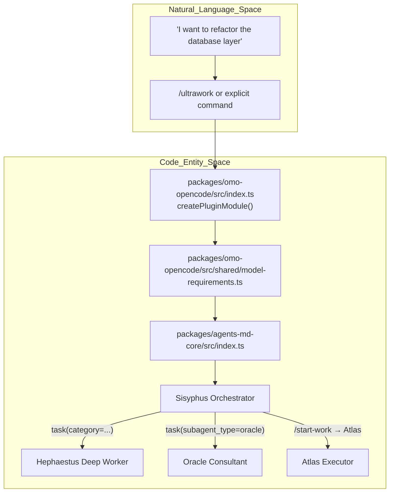
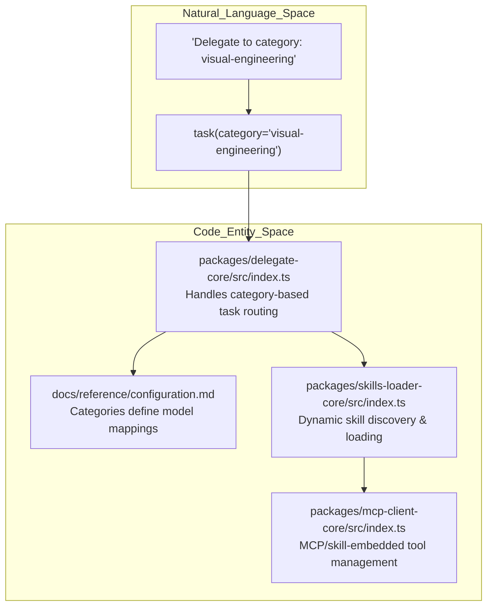

# Key Concepts

Relevant source files

The following files were used as context for generating this wiki page:

- [.agents/skills/work-with-pr-workspace/iteration-1/eval-5/with_skill/outputs/execution-plan.md](https://github.com/code-yeongyu/oh-my-openagent/blob/HEAD/.agents/skills/work-with-pr-workspace/iteration-1/eval-5/with_skill/outputs/execution-plan.md)
- [.omo/evidence/20260809-omo-agent-toolkit-rename/task-5.txt](https://github.com/code-yeongyu/oh-my-openagent/blob/HEAD/.omo/evidence/20260809-omo-agent-toolkit-rename/task-5.txt)
- [.omo/evidence/20260810-omo-native-telemetry/task-3.md](https://github.com/code-yeongyu/oh-my-openagent/blob/HEAD/.omo/evidence/20260810-omo-native-telemetry/task-3.md)
- [.omo/evidence/20260812-init-deep/hierarchy-green.txt](https://github.com/code-yeongyu/oh-my-openagent/blob/HEAD/.omo/evidence/20260812-init-deep/hierarchy-green.txt)
- [.omo/evidence/20260812-init-deep/hierarchy-red.txt](https://github.com/code-yeongyu/oh-my-openagent/blob/HEAD/.omo/evidence/20260812-init-deep/hierarchy-red.txt)
- [.omo/evidence/20260812-init-deep/manual-review.md](https://github.com/code-yeongyu/oh-my-openagent/blob/HEAD/.omo/evidence/20260812-init-deep/manual-review.md)
- [.omo/evidence/20260812-init-deep/qa-summary.md](https://github.com/code-yeongyu/oh-my-openagent/blob/HEAD/.omo/evidence/20260812-init-deep/qa-summary.md)
- [.omo/evidence/20260812-init-deep/scoring.md](https://github.com/code-yeongyu/oh-my-openagent/blob/HEAD/.omo/evidence/20260812-init-deep/scoring.md)
- [.omo/evidence/20260812-init-deep/validation-green.txt](https://github.com/code-yeongyu/oh-my-openagent/blob/HEAD/.omo/evidence/20260812-init-deep/validation-green.txt)
- [.omo/evidence/20260812-init-deep/validation-red.txt](https://github.com/code-yeongyu/oh-my-openagent/blob/HEAD/.omo/evidence/20260812-init-deep/validation-red.txt)
- [.opencode/skills/work-with-pr-workspace/iteration-1/eval-5/with_skill/outputs/execution-plan.md](https://github.com/code-yeongyu/oh-my-openagent/blob/HEAD/.opencode/skills/work-with-pr-workspace/iteration-1/eval-5/with_skill/outputs/execution-plan.md)
- [AGENTS.md](https://github.com/code-yeongyu/oh-my-openagent/blob/HEAD/AGENTS.md)
- [CHANGELOG.md](https://github.com/code-yeongyu/oh-my-openagent/blob/HEAD/CHANGELOG.md)
- [README.ja.md](https://github.com/code-yeongyu/oh-my-openagent/blob/HEAD/README.ja.md)
- [README.ko.md](https://github.com/code-yeongyu/oh-my-openagent/blob/HEAD/README.ko.md)
- [README.md](https://github.com/code-yeongyu/oh-my-openagent/blob/HEAD/README.md)
- [README.ru.md](https://github.com/code-yeongyu/oh-my-openagent/blob/HEAD/README.ru.md)
- [README.zh-cn.md](https://github.com/code-yeongyu/oh-my-openagent/blob/HEAD/README.zh-cn.md)
- [assets/oh-my-opencode.schema.json](https://github.com/code-yeongyu/oh-my-openagent/blob/HEAD/assets/oh-my-opencode.schema.json)
- [docs/examples/coding-focused.jsonc](https://github.com/code-yeongyu/oh-my-openagent/blob/HEAD/docs/examples/coding-focused.jsonc)
- [docs/examples/default.jsonc](https://github.com/code-yeongyu/oh-my-openagent/blob/HEAD/docs/examples/default.jsonc)
- [docs/examples/planning-focused.jsonc](https://github.com/code-yeongyu/oh-my-openagent/blob/HEAD/docs/examples/planning-focused.jsonc)
- [docs/guide/agent-model-matching.md](https://github.com/code-yeongyu/oh-my-openagent/blob/HEAD/docs/guide/agent-model-matching.md)
- [docs/guide/installation.md](https://github.com/code-yeongyu/oh-my-openagent/blob/HEAD/docs/guide/installation.md)
- [docs/guide/orchestration.md](https://github.com/code-yeongyu/oh-my-openagent/blob/HEAD/docs/guide/orchestration.md)
- [docs/guide/overview.md](https://github.com/code-yeongyu/oh-my-openagent/blob/HEAD/docs/guide/overview.md)
- [docs/guide/team-mode.md](https://github.com/code-yeongyu/oh-my-openagent/blob/HEAD/docs/guide/team-mode.md)
- [docs/reference/cli.md](https://github.com/code-yeongyu/oh-my-openagent/blob/HEAD/docs/reference/cli.md)
- [docs/reference/codex-telemetry.md](https://github.com/code-yeongyu/oh-my-openagent/blob/HEAD/docs/reference/codex-telemetry.md)
- [docs/reference/configuration.md](https://github.com/code-yeongyu/oh-my-openagent/blob/HEAD/docs/reference/configuration.md)
- [docs/reference/features.md](https://github.com/code-yeongyu/oh-my-openagent/blob/HEAD/docs/reference/features.md)
- [docs/reference/known-issues.md](https://github.com/code-yeongyu/oh-my-openagent/blob/HEAD/docs/reference/known-issues.md)
- [docs/reference/prompt-async-gate-rfc.md](https://github.com/code-yeongyu/oh-my-openagent/blob/HEAD/docs/reference/prompt-async-gate-rfc.md)
- [docs/reference/rules-injection-cross-module-comparison.md](https://github.com/code-yeongyu/oh-my-openagent/blob/HEAD/docs/reference/rules-injection-cross-module-comparison.md)
- [packages/AGENTS.md](https://github.com/code-yeongyu/oh-my-openagent/blob/HEAD/packages/AGENTS.md)
- [packages/memory-core/AGENTS.md](https://github.com/code-yeongyu/oh-my-openagent/blob/HEAD/packages/memory-core/AGENTS.md)
- [packages/omo-codex/README.md](https://github.com/code-yeongyu/oh-my-openagent/blob/HEAD/packages/omo-codex/README.md)
- [packages/omo-codex/plugin/README.md](https://github.com/code-yeongyu/oh-my-openagent/blob/HEAD/packages/omo-codex/plugin/README.md)
- [packages/omo-codex/plugin/components/ultrawork/directive.md](https://github.com/code-yeongyu/oh-my-openagent/blob/HEAD/packages/omo-codex/plugin/components/ultrawork/directive.md)
- [packages/omo-codex/plugin/components/ultrawork/skills/ultrawork/SKILL.md](https://github.com/code-yeongyu/oh-my-openagent/blob/HEAD/packages/omo-codex/plugin/components/ultrawork/skills/ultrawork/SKILL.md)
- [packages/omo-codex/plugin/components/ulw-loop/directive.md](https://github.com/code-yeongyu/oh-my-openagent/blob/HEAD/packages/omo-codex/plugin/components/ulw-loop/directive.md)
- [packages/omo-codex/tsconfig.json](https://github.com/code-yeongyu/oh-my-openagent/blob/HEAD/packages/omo-codex/tsconfig.json)
- [packages/omo-opencode/src/shared/markdown-link-audit.test.ts](https://github.com/code-yeongyu/oh-my-openagent/blob/HEAD/packages/omo-opencode/src/shared/markdown-link-audit.test.ts)
- [packages/omo-senpi/plugin/scripts/embed-directive.mjs](https://github.com/code-yeongyu/oh-my-openagent/blob/HEAD/packages/omo-senpi/plugin/scripts/embed-directive.mjs)
- [packages/omo-senpi/skills/ultrawork/SKILL.md](https://github.com/code-yeongyu/oh-my-openagent/blob/HEAD/packages/omo-senpi/skills/ultrawork/SKILL.md)
- [packages/omo-senpi/src/components/ultrawork/generated-directive.ts](https://github.com/code-yeongyu/oh-my-openagent/blob/HEAD/packages/omo-senpi/src/components/ultrawork/generated-directive.ts)
- [packages/omo-senpi/src/components/ultrawork/index.ts](https://github.com/code-yeongyu/oh-my-openagent/blob/HEAD/packages/omo-senpi/src/components/ultrawork/index.ts)
- [packages/omo-senpi/src/components/ultrawork/ultrawork-arming.test.ts](https://github.com/code-yeongyu/oh-my-openagent/blob/HEAD/packages/omo-senpi/src/components/ultrawork/ultrawork-arming.test.ts)
- [packages/omo-senpi/src/components/ultrawork/ultrawork.test-support.ts](https://github.com/code-yeongyu/oh-my-openagent/blob/HEAD/packages/omo-senpi/src/components/ultrawork/ultrawork.test-support.ts)
- [packages/omo-senpi/src/components/ultrawork/ultrawork.test.ts](https://github.com/code-yeongyu/oh-my-openagent/blob/HEAD/packages/omo-senpi/src/components/ultrawork/ultrawork.test.ts)
- [packages/prompts-core/prompts/ultrawork/codex.md](https://github.com/code-yeongyu/oh-my-openagent/blob/HEAD/packages/prompts-core/prompts/ultrawork/codex.md)
- [packages/prompts-core/prompts/ultrawork/default.md](https://github.com/code-yeongyu/oh-my-openagent/blob/HEAD/packages/prompts-core/prompts/ultrawork/default.md)
- [packages/prompts-core/prompts/ultrawork/gemini.md](https://github.com/code-yeongyu/oh-my-openagent/blob/HEAD/packages/prompts-core/prompts/ultrawork/gemini.md)
- [packages/prompts-core/prompts/ultrawork/glm.md](https://github.com/code-yeongyu/oh-my-openagent/blob/HEAD/packages/prompts-core/prompts/ultrawork/glm.md)
- [packages/prompts-core/prompts/ultrawork/gpt.md](https://github.com/code-yeongyu/oh-my-openagent/blob/HEAD/packages/prompts-core/prompts/ultrawork/gpt.md)
- [postinstall.test.ts](https://github.com/code-yeongyu/oh-my-openagent/blob/HEAD/postinstall.test.ts)

This page defines the core terminology and technical abstractions of the `oh-my-openagent` (previously `oh-my-opencode`) plugin. It explains how high-level user intents are translated into coordinated actions across agents, tools, and background components, providing a stable foundation for understanding the system internals.

---

## 1. Ultrawork (`/ultrawork` or `ulw`)

**Ultrawork** is the flagship multi-agent autonomous mode designed to continuously execute tasks until completion with minimal user intervention. It activates the full **Discipline Agents** system with aggressive parallelism and self-regulating loops to push progress on complex workflows [README.md:109-111](https://github.com/code-yeongyu/oh-my-openagent/blob/HEAD/README.md#L109-L111), [docs/guide/overview.md:135-141](https://github.com/code-yeongyu/oh-my-openagent/blob/HEAD/docs/guide/overview.md#L135-L141).

### Implementation and Data Flow

- The **keywordDetector** hook (in `packages/omo-opencode/src/hooks/keyword-detector/`) picks up `/ultrawork` or `ulw` triggers from user input and injects orchestration instructions [packages/omo-codex/plugin/components/ultrawork/directive.md:1-10](https://github.com/code-yeongyu/oh-my-openagent/blob/HEAD/packages/omo-codex/plugin/components/ultrawork/directive.md#L1-L10), [packages/omo-senpi/src/components/ultrawork/generated-directive.ts:1-10](https://github.com/code-yeongyu/oh-my-openagent/blob/HEAD/packages/omo-senpi/src/components/ultrawork/generated-directive.ts#L1-L10).
- The orchestrator **Sisyphus** is entered with a special ultrawork instruction set signaling it to operate in this autonomous, aggressive mode [docs/guide/orchestration.md:135-141](https://github.com/code-yeongyu/oh-my-openagent/blob/HEAD/docs/guide/orchestration.md#L135-L141).
- The **Ralph Loop** (`ulw-loop`) continuation hook repeatedly resumes agent tasks as far as needed until the entire work is verified complete [packages/omo-codex/plugin/components/ulw-loop/directive.md:1-10](https://github.com/code-yeongyu/oh-my-openagent/blob/HEAD/packages/omo-codex/plugin/components/ulw-loop/directive.md#L1-L10), [docs/guide/installation.md:5-6](https://github.com/code-yeongyu/oh-my-openagent/blob/HEAD/docs/guide/installation.md#L5-L6).
- **Todo Continuation Enforcer (Boulder)** monitors the system state to detect unfinished todos and wakes up background sessions to either continue or prune tasks [AGENTS.md:49](https://github.com/code-yeongyu/oh-my-openagent/blob/HEAD/AGENTS.md#L49).

This pipeline ensures robust autonomous task execution and retry, orchestrating multiple agents and tools simultaneously.

Sources: [README.md:109-111](https://github.com/code-yeongyu/oh-my-openagent/blob/HEAD/README.md#L109-L111), [docs/guide/overview.md:135-141](https://github.com/code-yeongyu/oh-my-openagent/blob/HEAD/docs/guide/overview.md#L135-L141), [packages/omo-codex/plugin/components/ultrawork/directive.md:1-10](https://github.com/code-yeongyu/oh-my-openagent/blob/HEAD/packages/omo-codex/plugin/components/ultrawork/directive.md#L1-L10), [packages/omo-senpi/src/components/ultrawork/generated-directive.ts:1-10](https://github.com/code-yeongyu/oh-my-openagent/blob/HEAD/packages/omo-senpi/src/components/ultrawork/generated-directive.ts#L1-L10), [docs/guide/orchestration.md:135-141](https://github.com/code-yeongyu/oh-my-openagent/blob/HEAD/docs/guide/orchestration.md#L135-L141), [packages/omo-codex/plugin/components/ulw-loop/directive.md:1-10](https://github.com/code-yeongyu/oh-my-openagent/blob/HEAD/packages/omo-codex/plugin/components/ulw-loop/directive.md#L1-L10), [docs/guide/installation.md:5-6](https://github.com/code-yeongyu/oh-my-openagent/blob/HEAD/docs/guide/installation.md#L5-L6), [AGENTS.md:49](https://github.com/code-yeongyu/oh-my-openagent/blob/HEAD/AGENTS.md#L49)

---

## 2. Discipline Agents

Discipline Agents are specialized AI personas built with particular roles, model selections, and permission sets. Together, they form a collaborative multi-agent system that maximizes productivity and task discipline via role separation [README.md:81-82](https://github.com/code-yeongyu/oh-my-openagent/blob/HEAD/README.md#L81-L82), [docs/guide/agent-model-matching.md:45-46](https://github.com/code-yeongyu/oh-my-openagent/blob/HEAD/docs/guide/agent-model-matching.md#L45-L46).

### Agent Inventory and Model Mapping

The system includes **11 built-in agents**, classified as **Primary agents** (main session controllers) and **Subagents** (specialists invoked on demand). Each agent has a recommended default model, often with fallback model chains [docs/guide/orchestration.md:84-88](https://github.com/code-yeongyu/oh-my-openagent/blob/HEAD/docs/guide/orchestration.md#L84-L88), [docs/reference/features.md:9-24](https://github.com/code-yeongyu/oh-my-openagent/blob/HEAD/docs/reference/features.md#L9-L24).

| Agent Name | Mode | Recommended Primary Model | Purpose |
|---|---|---|---|
| **Sisyphus** | Primary | `claude-opus-5` / `kimi-k3` | Main orchestrator; plans, delegates, runs ultrawork |
| **Hephaestus** | Primary | `gpt-5.6-sol` | Autonomous deep worker for complex technical tasks |
| **Prometheus** | Primary | `claude-fable-5` | Strategic planner, conducts interview-style planning |
| **Atlas** | Primary | `claude-sonnet-5` | Todo execution orchestrator based on Prometheus plans |
| **Oracle** | Subagent | `gpt-5.6-sol` | Read-only architecture and debugging consultant |
| **Librarian** | Subagent | `gpt-5.6-luna-fast` | Documentation lookup, multi-repo analysis |
| **Explore** | Subagent | `gpt-5.6-luna-fast` | Rapid codebase search and pattern discovery |
| **Metis** | Subagent | `claude-opus-5` | Gap analysis and pre-review during planning |
| **Momus** | Subagent | `gpt-5.6-terra` | Plan reviewer enforcing clarity and context |
| **Multimodal Looker** | Subagent | `gpt-5.6-sol` | Visual and screenshot-based analysis |
| **Sisyphus-Junior** | Subagent | `claude-sonnet-5` | Task executor delegated by Sisyphus |

### Delegation Flow and Model Mapping

The main orchestrator **Sisyphus** selects subagents either by **category** or explicit **subagent_type**, delegating subtasks accompanied by proper model resolution and fallback chains [docs/reference/features.md:9-31](https://github.com/code-yeongyu/oh-my-openagent/blob/HEAD/docs/reference/features.md#L9-L31), [AGENTS.md:51](https://github.com/code-yeongyu/oh-my-openagent/blob/HEAD/AGENTS.md#L51), [docs/guide/orchestration.md:80](https://github.com/code-yeongyu/oh-my-openagent/blob/HEAD/docs/guide/orchestration.md#L80).

Sources: [README.md:81-82](https://github.com/code-yeongyu/oh-my-openagent/blob/HEAD/README.md#L81-L82), [docs/guide/agent-model-matching.md:45-46](https://github.com/code-yeongyu/oh-my-openagent/blob/HEAD/docs/guide/agent-model-matching.md#L45-L46), [docs/reference/features.md:9-31](https://github.com/code-yeongyu/oh-my-openagent/blob/HEAD/docs/reference/features.md#L9-L31), [AGENTS.md:51](https://github.com/code-yeongyu/oh-my-openagent/blob/HEAD/AGENTS.md#L51), [docs/guide/orchestration.md:80-88](https://github.com/code-yeongyu/oh-my-openagent/blob/HEAD/docs/guide/orchestration.md#L80-L88)

The category-based delegation shields users from explicit model management, ensuring flexible, optimal model usage across tasks [docs/guide/overview.md:69](https://github.com/code-yeongyu/oh-my-openagent/blob/HEAD/docs/guide/overview.md#L69).

Sources: [README.md:81-82](https://github.com/code-yeongyu/oh-my-openagent/blob/HEAD/README.md#L81-L82), [docs/guide/agent-model-matching.md:45-46](https://github.com/code-yeongyu/oh-my-openagent/blob/HEAD/docs/guide/agent-model-matching.md#L45-L46), [docs/reference/features.md:9-31](https://github.com/code-yeongyu/oh-my-openagent/blob/HEAD/docs/reference/features.md#L9-L31), [AGENTS.md:51](https://github.com/code-yeongyu/oh-my-openagent/blob/HEAD/AGENTS.md#L51), [docs/guide/orchestration.md:80-88](https://github.com/code-yeongyu/oh-my-openagent/blob/HEAD/docs/guide/orchestration.md#L80-L88)

---

## 3. IntentGate

**IntentGate** is the semantic classification and routing layer engaged before any agents or tools respond to user inputs. It scans incoming commands and natural language for interpretable triggers, then directs processing to the appropriate agent or tool [AGENTS.md:49](https://github.com/code-yeongyu/oh-my-openagent/blob/HEAD/AGENTS.md#L49), [docs/guide/overview.md:57](https://github.com/code-yeongyu/oh-my-openagent/blob/HEAD/docs/guide/overview.md#L57).

Features include:
- Parsing and recognizing keywords such as `/ultrawork`, `search:`, `team:` to route to specialized work modes or agents [docs/guide/overview.md:57-67](https://github.com/code-yeongyu/oh-my-openagent/blob/HEAD/docs/guide/overview.md#L57-L67).
- Validating permissions and project policies through the `rules-engine` package [docs/reference/features.md:53-55](https://github.com/code-yeongyu/oh-my-openagent/blob/HEAD/docs/reference/features.md#L53-L55).
- Dynamically extending capabilities by hooking into keyword detectors that map novel terms to specific skills or orchestration flows [packages/omo-opencode/src/shared/markdown-link-audit.test.ts:1-10](https://github.com/code-yeongyu/oh-my-openagent/blob/HEAD/packages/omo-opencode/src/shared/markdown-link-audit.test.ts#L1-L10).

IntentGate acts as the gatekeeper to organized agent workflows, ensuring user requests reach the correct model-backed specialist.

Sources: [AGENTS.md:49](https://github.com/code-yeongyu/oh-my-openagent/blob/HEAD/AGENTS.md#L49), [docs/guide/overview.md:57-67](https://github.com/code-yeongyu/oh-my-openagent/blob/HEAD/docs/guide/overview.md#L57-L67), [docs/reference/features.md:53-55](https://github.com/code-yeongyu/oh-my-openagent/blob/HEAD/docs/reference/features.md#L53-L55), [packages/omo-opencode/src/shared/markdown-link-audit.test.ts:1-10](https://github.com/code-yeongyu/oh-my-openagent/blob/HEAD/packages/omo-opencode/src/shared/markdown-link-audit.test.ts#L1-L10)

---

## 4. Hash-Anchored Edit (`hashline_edit`)

The Hash-Anchored Edit system guarantees reliability and accuracy of incremental code modifications by anchoring edits to line-specific content hashes, identified as `LINE#ID`. This technique prevents applying patches to shifted or outdated lines, mitigating hallucination and drift inherent in AI-generated code edits [AGENTS.md:49](https://github.com/code-yeongyu/oh-my-openagent/blob/HEAD/AGENTS.md#L49).

### Technical Details

- Controlled by the boolean `hashline_edit` option in the configuration schema [assets/oh-my-opencode.schema.json:89-91](https://github.com/code-yeongyu/oh-my-openagent/blob/HEAD/assets/oh-my-opencode.schema.json#L89-L91).
- Core functionality provided by the `hashline-core` package, which manages line hash generation, tracking, and validation [docs/reference/configuration.md:35](https://github.com/code-yeongyu/oh-my-openagent/blob/HEAD/docs/reference/configuration.md#L35).
- Edit process:
  1. File lines are preprocessed to append unique hashes (`LINE#ID`) denoting their original content.
  2. AI-generated edits reference specific anchors, ensuring that each change aligns with the intended line.
  3. The patching tool verifies hash matches prior to applying changes, preventing misapplied or stale modifications.

This system was inspired by the `oh-my-pi` project and secures merge integrity at the granularity of individual text lines [docs/guide/installation.md:5](https://github.com/code-yeongyu/oh-my-openagent/blob/HEAD/docs/guide/installation.md#L5).

Sources: [AGENTS.md:49](https://github.com/code-yeongyu/oh-my-openagent/blob/HEAD/AGENTS.md#L49), [assets/oh-my-opencode.schema.json:89-91](https://github.com/code-yeongyu/oh-my-openagent/blob/HEAD/assets/oh-my-opencode.schema.json#L89-L91), [docs/reference/configuration.md:35](https://github.com/code-yeongyu/oh-my-openagent/blob/HEAD/docs/reference/configuration.md#L35), [docs/guide/installation.md:5](https://github.com/code-yeongyu/oh-my-openagent/blob/HEAD/docs/guide/installation.md#L5)

---

## 5. Categories and Skills

### Categories

Categories represent semantic task domains that guide subagent dispatch and model configuration. They enable declarative routing by task type without user micromanagement [docs/guide/overview.md:69](https://github.com/code-yeongyu/oh-my-openagent/blob/HEAD/docs/guide/overview.md#L69), [docs/reference/configuration.md:135-155](https://github.com/code-yeongyu/oh-my-openagent/blob/HEAD/docs/reference/configuration.md#L135-L155).

Common built-in categories include:
- `visual-engineering`: Prefers Claude Opus 5 or Kimi K3 [docs/guide/overview.md:104](https://github.com/code-yeongyu/oh-my-openagent/blob/HEAD/docs/guide/overview.md#L104).
- `ultrabrain`: Prefers GPT-5.6 Sol at high effort [docs/guide/overview.md:104](https://github.com/code-yeongyu/oh-my-openagent/blob/HEAD/docs/guide/overview.md#L104).
- `deep`: Prefers GPT-5.6 Sol medium [docs/guide/overview.md:104](https://github.com/code-yeongyu/oh-my-openagent/blob/HEAD/docs/guide/overview.md#L104).
- `artistry`: Prefers Claude Fable 5 [docs/guide/overview.md:104](https://github.com/code-yeongyu/oh-my-openagent/blob/HEAD/docs/guide/overview.md#L104).
- `quick`: Prefers Kimi high-speed models [docs/guide/overview.md:104](https://github.com/code-yeongyu/oh-my-openagent/blob/HEAD/docs/guide/overview.md#L104).
- `writing`: Prefers Kimi K3 [docs/guide/overview.md:104](https://github.com/code-yeongyu/oh-my-openagent/blob/HEAD/docs/guide/overview.md#L104).

When an agent delegates a task using `task(category="...")`, category settings determine the model family, prompt tuning, and permissions [docs/reference/configuration.md:105-124](https://github.com/code-yeongyu/oh-my-openagent/blob/HEAD/docs/reference/configuration.md#L105-L124).

### Skills

**Skills** are modular capabilities agents can discover and invoke to extend their operational abilities [AGENTS.md:49-51](https://github.com/code-yeongyu/oh-my-openagent/blob/HEAD/AGENTS.md#L49-L51).

Key points:
- The system dynamically discovers skills from multiple scopes: core shared, global, project-specific, and embedded MCPs (Message Control Planes) [docs/reference/configuration.md:21](https://github.com/code-yeongyu/oh-my-openagent/blob/HEAD/docs/reference/configuration.md#L21).
- The `skills-loader-core` package manages the discovery and loading of these capabilities [docs/reference/cli.md:1-10](https://github.com/code-yeongyu/oh-my-openagent/blob/HEAD/docs/reference/cli.md#L1-L10).
- There is a shared skill library with 20+ skills such as `ulw-plan` (ultrawork planning), `git-master` (automated git operations), and `ast-grep` [docs/guide/installation.md:6](https://github.com/code-yeongyu/oh-my-openagent/blob/HEAD/docs/guide/installation.md#L6).
- Migration from `.agents/` to `.opencode/` folders reflects the consolidation of skill and command storage under the OpenCode plugin ecosystem [AGENTS.md:49](https://github.com/code-yeongyu/oh-my-openagent/blob/HEAD/AGENTS.md#L49).

### Skills and Category Delegation Flow

Sources: [docs/guide/overview.md:69, 104](https://github.com/code-yeongyu/oh-my-openagent/blob/HEAD/docs/guide/overview.md#L69), [docs/reference/configuration.md:135-155](https://github.com/code-yeongyu/oh-my-openagent/blob/HEAD/docs/reference/configuration.md#L135-L155), [AGENTS.md:49-51](https://github.com/code-yeongyu/oh-my-openagent/blob/HEAD/AGENTS.md#L49-L51), [docs/reference/configuration.md:21](https://github.com/code-yeongyu/oh-my-openagent/blob/HEAD/docs/reference/configuration.md#L21), [docs/reference/cli.md:1-10](https://github.com/code-yeongyu/oh-my-openagent/blob/HEAD/docs/reference/cli.md#L1-L10), [docs/guide/installation.md:6](https://github.com/code-yeongyu/oh-my-openagent/blob/HEAD/docs/guide/installation.md#L6)

---

## 6. The Three Harnesses (OpenCode, Codex, Senpi)

The codebase supports multiple agent platform adapters called **Harnesses**, enabling Oh My OpenAgent to run atop different underlying ecosystems. Configuration is unified via the `omo.jsonc` file, but each harness can have specific blocks [docs/reference/configuration.md:3, 56-59](https://github.com/code-yeongyu/oh-my-openagent/blob/HEAD/docs/reference/configuration.md#L3).

| Harness | Description | Key Characteristics |
|---|---|---|
| **OpenCode** | The Ultimate, full-featured harness supporting 11 discipline agents, 54+ hooks, Team Mode, and advanced tooling [docs/guide/installation.md:5](https://github.com/code-yeongyu/oh-my-openagent/blob/HEAD/docs/guide/installation.md#L5) | Full plugin in `packages/omo-opencode/`; supports orchestrated multitier agents and ultrawork lifecycle hints |
| **Codex** | A Light-weight edition tailored for OpenAI's Codex CLI with a distilled feature set (`rules`, `lsp`, `ultrawork`) [docs/guide/installation.md:6](https://github.com/code-yeongyu/oh-my-openagent/blob/HEAD/docs/guide/installation.md#L6) | Packed under `packages/omo-codex/`; no multi-agent coordination or Team Mode |
| **Senpi** | Native Pi/Pi-inspired extension adapter focused on components like ultrawork, ulw-loop, and task engine [README.md:13-14](https://github.com/code-yeongyu/oh-my-openagent/blob/HEAD/README.md#L13-L14) | Encompasses `packages/omo-senpi/` with its own ExtensionAPI layers and local installers |

Sources: [docs/reference/configuration.md:3, 56-59](https://github.com/code-yeongyu/oh-my-openagent/blob/HEAD/docs/reference/configuration.md#L3), [docs/guide/installation.md:5-6](https://github.com/code-yeongyu/oh-my-openagent/blob/HEAD/docs/guide/installation.md#L5-L6), [README.md:13-14](https://github.com/code-yeongyu/oh-my-openagent/blob/HEAD/README.md#L13-L14)

---

# Summary Table of Key Concepts

| Concept | Description | Key Files / Packages |
|---|---|---|
| Ultrawork | Autonomous multi-agent task mode triggered by `/ultrawork`| `ulw-loop`, `keyword-detector` hook |
| Discipline Agents | Specialized AI personas (Sisyphus, Hephaestus, etc.) | `packages/agents-md-core/`, `src/agents/` |
| IntentGate | Semantic input parser and router | `packages/rules-engine/`, `keyword-detector` |
| Hash-Anchored Edit | Line-based content hashing for edit integrity | `packages/hashline-core/`, `hashline_edit` config |
| Categories | Task domain classifiers (e.g., `visual-engineering`) | `packages/delegate-core/`, `omo.jsonc` |
| Skills | Modular capability extensions for agents | `packages/skills-loader-core/`, `packages/mcp-client-core/` |
| Harnesses | Platform adapters: OpenCode, Codex, Senpi | `omo-opencode`, `omo-codex`, `omo-senpi` packages |

Sources: [AGENTS.md:49-51](https://github.com/code-yeongyu/oh-my-openagent/blob/HEAD/AGENTS.md#L49-L51), [docs/reference/configuration.md:1-104](https://github.com/code-yeongyu/oh-my-openagent/blob/HEAD/docs/reference/configuration.md#L1-L104), [docs/guide/installation.md:3-6](https://github.com/code-yeongyu/oh-my-openagent/blob/HEAD/docs/guide/installation.md#L3-L6)1a