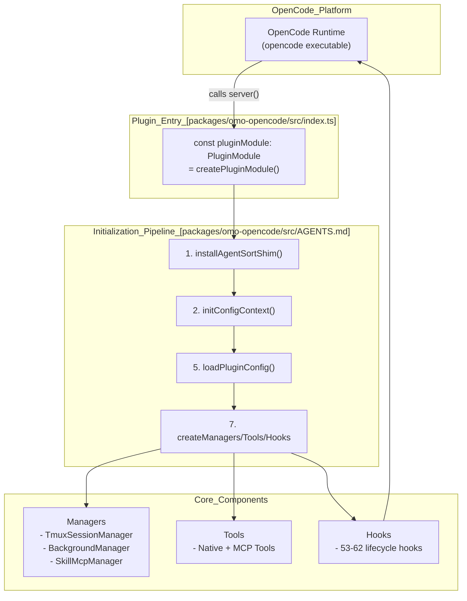
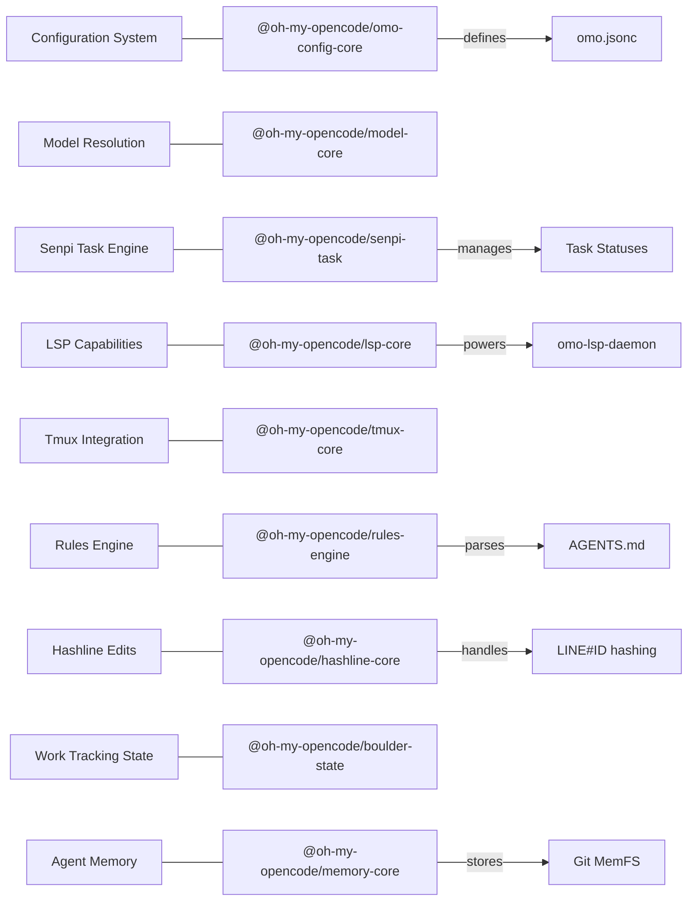

# Architecture

<details>
<summary>Relevant source files</summary>

The following files were used as context for generating this wiki page:

- [.omo/evidence/20260812-init-deep/hierarchy-green.txt](https://github.com/code-yeongyu/oh-my-openagent/blob/HEAD/.omo/evidence/20260812-init-deep/hierarchy-green.txt)
- [.omo/evidence/20260812-init-deep/hierarchy-red.txt](https://github.com/code-yeongyu/oh-my-openagent/blob/HEAD/.omo/evidence/20260812-init-deep/hierarchy-red.txt)
- [.omo/evidence/20260812-init-deep/manual-review.md](https://github.com/code-yeongyu/oh-my-openagent/blob/HEAD/.omo/evidence/20260812-init-deep/manual-review.md)
- [.omo/evidence/20260812-init-deep/qa-summary.md](https://github.com/code-yeongyu/oh-my-openagent/blob/HEAD/.omo/evidence/20260812-init-deep/qa-summary.md)
- [.omo/evidence/20260812-init-deep/scoring.md](https://github.com/code-yeongyu/oh-my-openagent/blob/HEAD/.omo/evidence/20260812-init-deep/scoring.md)
- [.omo/evidence/20260812-init-deep/validation-green.txt](https://github.com/code-yeongyu/oh-my-openagent/blob/HEAD/.omo/evidence/20260812-init-deep/validation-green.txt)
- [.omo/evidence/20260812-init-deep/validation-red.txt](https://github.com/code-yeongyu/oh-my-openagent/blob/HEAD/.omo/evidence/20260812-init-deep/validation-red.txt)
- [AGENTS.md](https://github.com/code-yeongyu/oh-my-openagent/blob/HEAD/AGENTS.md)
- [bun.lock](https://github.com/code-yeongyu/oh-my-openagent/blob/HEAD/bun.lock)
- [package.json](https://github.com/code-yeongyu/oh-my-openagent/blob/HEAD/package.json)
- [packages/AGENTS.md](https://github.com/code-yeongyu/oh-my-openagent/blob/HEAD/packages/AGENTS.md)
- [packages/memory-core/AGENTS.md](https://github.com/code-yeongyu/oh-my-openagent/blob/HEAD/packages/memory-core/AGENTS.md)
- [packages/omo-codex/scripts/install-dist/install-local.mjs](https://github.com/code-yeongyu/oh-my-openagent/blob/HEAD/packages/omo-codex/scripts/install-dist/install-local.mjs)
- [packages/omo-config-core/src/migration/index.ts](https://github.com/code-yeongyu/oh-my-openagent/blob/HEAD/packages/omo-config-core/src/migration/index.ts)
- [packages/omo-native/package.json](https://github.com/code-yeongyu/oh-my-openagent/blob/HEAD/packages/omo-native/package.json)
- [packages/omo-native/test/package-shape.test.ts](https://github.com/code-yeongyu/oh-my-openagent/blob/HEAD/packages/omo-native/test/package-shape.test.ts)
- [packages/omo-native/test/senpi-pin.test.ts](https://github.com/code-yeongyu/oh-my-openagent/blob/HEAD/packages/omo-native/test/senpi-pin.test.ts)
- [packages/omo-opencode/src/agents/sisyphus/claude-opus-4-7.ts](https://github.com/code-yeongyu/oh-my-openagent/blob/HEAD/packages/omo-opencode/src/agents/sisyphus/claude-opus-4-7.ts)
- [packages/omo-opencode/src/cli/config-manager/plugin-detection.test.ts](https://github.com/code-yeongyu/oh-my-openagent/blob/HEAD/packages/omo-opencode/src/cli/config-manager/plugin-detection.test.ts)
- [packages/omo-opencode/src/features/opencode-runtime-skills/source-server.test.ts](https://github.com/code-yeongyu/oh-my-openagent/blob/HEAD/packages/omo-opencode/src/features/opencode-runtime-skills/source-server.test.ts)
- [packages/omo-opencode/src/features/opencode-runtime-skills/source-server.ts](https://github.com/code-yeongyu/oh-my-openagent/blob/HEAD/packages/omo-opencode/src/features/opencode-runtime-skills/source-server.ts)
- [packages/omo-opencode/src/hooks/claude-code-hooks/config-loader.test.ts](https://github.com/code-yeongyu/oh-my-openagent/blob/HEAD/packages/omo-opencode/src/hooks/claude-code-hooks/config-loader.test.ts)
- [packages/omo-opencode/src/hooks/claude-code-hooks/config-loader.ts](https://github.com/code-yeongyu/oh-my-openagent/blob/HEAD/packages/omo-opencode/src/hooks/claude-code-hooks/config-loader.ts)
- [packages/omo-opencode/src/index.telemetry.test.ts](https://github.com/code-yeongyu/oh-my-openagent/blob/HEAD/packages/omo-opencode/src/index.telemetry.test.ts)
- [packages/omo-opencode/src/index.test.ts](https://github.com/code-yeongyu/oh-my-openagent/blob/HEAD/packages/omo-opencode/src/index.test.ts)
- [packages/omo-opencode/src/shared/external-plugin-detector.test.ts](https://github.com/code-yeongyu/oh-my-openagent/blob/HEAD/packages/omo-opencode/src/shared/external-plugin-detector.test.ts)
- [packages/omo-opencode/src/startup-migration.ts](https://github.com/code-yeongyu/oh-my-openagent/blob/HEAD/packages/omo-opencode/src/startup-migration.ts)
- [packages/omo-opencode/src/testing/create-plugin-module-live-route.test.ts](https://github.com/code-yeongyu/oh-my-openagent/blob/HEAD/packages/omo-opencode/src/testing/create-plugin-module-live-route.test.ts)
- [packages/omo-opencode/src/testing/create-plugin-module.test.ts](https://github.com/code-yeongyu/oh-my-openagent/blob/HEAD/packages/omo-opencode/src/testing/create-plugin-module.test.ts)
- [packages/omo-opencode/src/testing/create-plugin-module.ts](https://github.com/code-yeongyu/oh-my-openagent/blob/HEAD/packages/omo-opencode/src/testing/create-plugin-module.ts)
- [packages/omo-senpi/package.json](https://github.com/code-yeongyu/oh-my-openagent/blob/HEAD/packages/omo-senpi/package.json)
- [packages/omo-senpi/plugin/package.json](https://github.com/code-yeongyu/oh-my-openagent/blob/HEAD/packages/omo-senpi/plugin/package.json)
- [packages/omo-senpi/src/package-shape.test.ts](https://github.com/code-yeongyu/oh-my-openagent/blob/HEAD/packages/omo-senpi/src/package-shape.test.ts)
- [packages/senpi-task/package.json](https://github.com/code-yeongyu/oh-my-openagent/blob/HEAD/packages/senpi-task/package.json)

</details>


This document describes the overall system architecture of **oh-my-opencode** (also dual-published as **oh-my-openagent**), a modular, batteries-included AI agent orchestration system. It provides a high-level overview of the system's core architectural components, their design principles, and their interactions across multiple harnesses including OpenCode, Codex, and Senpi.

For technical deep-dives into individual subsystems, please refer to the dedicated child pages:
- [Plugin System](05_2.1-plugin-system.md) — Integration with OpenCode, initialization flow, and plugin API.
- [Agent Orchestration](06_2.2-agent-orchestration.md) — Multi-agent architecture, delegation patterns, orchestrator coordination.
- [Background Task System](07_2.3-background-task-system.md) — BackgroundManager lifecycle, concurrency, and notifications.
- [Configuration Pipeline](08_2.4-configuration-pipeline.md) — Multi-phase config loading, merging, validation, and runtime adaption.
- [Model Resolution and Fallback](09_2.5-model-resolution-and-fallback.md) — Model selection priority, fallback chains, and fuzzy matching.
- [Core Package Layer](10_2.6-core-package-layer.md) — The 19-package core layer refactor and the strict DAG dependency model.

---

## System Design Philosophy

The system has undergone a massive multi-harness refactor, moving from a monolithic OpenCode plugin to a layered architecture of over 40 sibling packages. The architecture is designed to support multiple "harnesses" (OpenCode Ultimate, Codex Light, and Senpi) by sharing a common **Core Layer** of 19 packages.

The architecture applies a staged initialization pipeline where each stage consumes output from the prior stage:

```
Config → Managers → Tools → Hooks → Plugin Interface
```

This layering allows harness-neutral core logic to be reused while adapting to host-specific APIs and environment constraints.

Sources: [AGENTS.md:1-5](https://github.com/code-yeongyu/oh-my-openagent/blob/HEAD/AGENTS.md#L1-L5), [packages/AGENTS.md:1-7](https://github.com/code-yeongyu/oh-my-openagent/blob/HEAD/packages/AGENTS.md#L1-L7), [packages/omo-opencode/src/AGENTS.md:22-25](https://github.com/code-yeongyu/oh-my-openagent/blob/HEAD/packages/omo-opencode/src/AGENTS.md#L22-L25)

---

## Package Layering and Roles

The oh-my-opencode codebase is organized into a strict hierarchy (DAG) to enforce harness-neutral core logic and clear boundaries:

| Role               | Count | Description                                                                                           |
|--------------------|-------|---------------------------------------------------------------------------------------------------|
| **Core Packages**   | 20    | Pure TypeScript logic libraries such as `model-core`, `prompts-core`, `rules-engine`, etc. These have zero harness dependencies and provide foundational capabilities. |
| **MCP Packages**    | 4     | External tool servers and MCP clients, including `lsp-tools-mcp`, `git-bash-mcp`, `lsp-daemon`, and `ast-grep-mcp`. These run as separate processes. |
| **Adapters**        | 5 (+1 adapter-support) | Harness-specific shims wrapping the core packages: `omo-opencode` (OpenCode), `omo-codex` (Codex), `omo-senpi` (Senpi), plus standalone Pi adapters. |
| **Platform Binaries** | 12  | OS and architecture-specific launcher packages for deployment, selected at install time by `postinstall.mjs`. |

Sources: [packages/AGENTS.md:9-18](https://github.com/code-yeongyu/oh-my-openagent/blob/HEAD/packages/AGENTS.md#L9-L18), [package.json:8-38](https://github.com/code-yeongyu/oh-my-openagent/blob/HEAD/package.json#L8-L38), [bun.lock:79-202](https://github.com/code-yeongyu/oh-my-openagent/blob/HEAD/bun.lock#L79-L202)

---

## Initialization Pipeline (OpenCode Adapter)

The OpenCode adapter follows a staged initialization process. At runtime, the OpenCode platform calls the plugin's exported `server()` function, which orchestrates initialization stages including configuration loading, manager creation, tool registration, and hook setup.

Title: OpenCode Initialization Flow


Sources: [packages/omo-opencode/src/AGENTS.md:39-51](https://github.com/code-yeongyu/oh-my-openagent/blob/HEAD/packages/omo-opencode/src/AGENTS.md#L39-L51), [packages/omo-opencode/src/AGENTS.md:26-37](https://github.com/code-yeongyu/oh-my-openagent/blob/HEAD/packages/omo-opencode/src/AGENTS.md#L26-L37)

---

## Configuration Pipeline

Configuration management is handled by the `omo-config-core` package. It implements a unified `omo.jsonc` configuration system with a 4-layer resolution model.

- **Resolution Layers**: Shared base → [harness] block → profiles.<P> → profiles.<P>.[harness].
- **Migration**: Includes a lock+journal migration engine for legacy `oh-my-openagent.json` files.
- **Validation**: Uses Zod for strict schema validation.

Full details are covered in the [Configuration Pipeline](08_2.4-configuration-pipeline.md) child page.

Sources: [packages/AGENTS.md:40](https://github.com/code-yeongyu/oh-my-openagent/blob/HEAD/packages/AGENTS.md#L40), [bun.lock:195-202](https://github.com/code-yeongyu/oh-my-openagent/blob/HEAD/bun.lock#L195-L202), [packages/omo-opencode/src/AGENTS.md:53-67](https://github.com/code-yeongyu/oh-my-openagent/blob/HEAD/packages/omo-opencode/src/AGENTS.md#L53-L67)

---

## Core Managers and Subsystems

Key managers are created during initialization and injected into tools and hooks.

| Manager                | Responsibility                                                                            | Core Package                                   |
|------------------------|-------------------------------------------------------------------------------------------|-----------------------------------------------|
| `BackgroundManager`     | Manages lifecycle and concurrency of background tasks.                                     | Core logic in `packages/omo-opencode/src/features/` |
| `TmuxSessionManager`   | Maintains tmux sessions, panes, and layouts for multi-agent monitoring.                    | `tmux-core`                                    |
| `SkillMcpManager`      | Handles MCP clients embedded in skills and manages OAuth workflows.                        | `mcp-client-core`                              |
| `ConfigHandler`        | Multi-layer configuration loading and merging.                                            | `omo-config-core`                              |

Sources: [packages/omo-opencode/src/AGENTS.md:34-37](https://github.com/code-yeongyu/oh-my-openagent/blob/HEAD/packages/omo-opencode/src/AGENTS.md#L34-L37), [packages/omo-senpi/package.json:30-44](https://github.com/code-yeongyu/oh-my-openagent/blob/HEAD/packages/omo-senpi/package.json#L30-L44)

---

## Hook System

oh-my-opencode extends the underlying harness with a 5-tier hook system (53 base hooks, 60 with team-mode enabled):

- **Session Hooks (24)**: Lifecycle event listeners like `preemptiveCompaction` and `sessionNotification`.
- **Tool Guard Hooks (17-18)**: Safety checks like `writeExistingFileGuard` and `commentChecker`.
- **Transform Hooks (4-6)**: Message transformations including `keywordDetector`.
- **Continuation Hooks (7)**: Repeating loop behaviors like `todoContinuationEnforcer` (Boulder).
- **Skill Hooks (2)**: Skill-specific behaviors like `autoSlashCommand`.

Sources: [packages/omo-opencode/src/hooks/AGENTS.md:1-26](https://github.com/code-yeongyu/oh-my-openagent/blob/HEAD/packages/omo-opencode/src/hooks/AGENTS.md#L1-L26), [packages/omo-opencode/src/AGENTS.md:69-105](https://github.com/code-yeongyu/oh-my-openagent/blob/HEAD/packages/omo-opencode/src/AGENTS.md#L69-L105)

---

## Agent Orchestration

The system employs a multi-agent architecture where orchestrators coordinate specialists:

- **Sisyphus (Main Orchestrator)**: Coordinates task delegation and verification loops.
- **Planning Agents (Prometheus, Metis, Momus)**: Handle strategic analysis and plan review.
- **Worker Agents (Hephaestus, Atlas, Oracle)**: Perform deep work, todo management, and specialized consultation.
- **Team Mode**: Enables multi-agent coordination with roles, mailboxes, and worktree isolation.

For detailed workflows, see the [Agent Orchestration](06_2.2-agent-orchestration.md) child page.

Sources: [packages/omo-opencode/src/agents/sisyphus/claude-opus-4-7.ts:1-1000](https://github.com/code-yeongyu/oh-my-openagent/blob/HEAD/packages/omo-opencode/src/agents/sisyphus/claude-opus-4-7.ts#L1-L1000), [packages/omo-opencode/src/features/team-mode/AGENTS.md](https://github.com/code-yeongyu/oh-my-openagent/blob/HEAD/packages/omo-opencode/src/features/team-mode/AGENTS.md), [AGENTS.md:49](https://github.com/code-yeongyu/oh-my-openagent/blob/HEAD/AGENTS.md#L49)

---

## Summary Diagram: Natural Language to Code Entities

This diagram maps high-level system concepts to concrete code entities in the workspace packages.

Title: System Concept to Code Mapping


Sources: [packages/AGENTS.md:36-60](https://github.com/code-yeongyu/oh-my-openagent/blob/HEAD/packages/AGENTS.md#L36-L60), [bun.lock:103-106](https://github.com/code-yeongyu/oh-my-openagent/blob/HEAD/bun.lock#L103-L106), [packages/omo-senpi/package.json:30-44](https://github.com/code-yeongyu/oh-my-openagent/blob/HEAD/packages/omo-senpi/package.json#L30-L44), [packages/senpi-task/package.json:42-47](https://github.com/code-yeongyu/oh-my-openagent/blob/HEAD/packages/senpi-task/package.json#L42-L47), [packages/memory-core/AGENTS.md](https://github.com/code-yeongyu/oh-my-openagent/blob/HEAD/packages/memory-core/AGENTS.md)

---

## Summary Diagram: Harness Adapter Architecture

This diagram illustrates how harness adapters consume the shared Core layer.

Title: Harness Adapter Architecture

```mermaid
graph TB
    subgraph Core_Layer__packages_core ["Core_Layer_(packages/*-core)"]
        Core_Model["model-core"]
        Core_Config["omo-config-core"]
        Core_LSP["lsp-core"]
        Core_Rules["rules-engine"]
        Core_Prompts["prompts-core"]
        Core_Utils["utils"]
        Core_Telemetry["telemetry-core"]
        Core_CommentChecker["comment-checker-core"]
        Core_Delegate["delegate-core"]
        Core_Team["team-core"]
        Core_Boulder["boulder-state"]
    end

    subgraph OpenCode_Adapter__omo_opencode ["OpenCode_Adapter_(omo-opencode)"]
        OC_Index["src/index.ts"]
        OC_Hooks["src/hooks/"]
    end

    subgraph Codex_Adapter__omo_codex ["Codex_Adapter_(omo-codex)"]
        Codex_Plugin["plugin/"]
        Codex_Comp["plugin/components/"]
    end

    subgraph Senpi_Adapter__omo_senpi ["Senpi_Adapter_(omo-senpi)"]
        Senpi_Ext["src/index.ts"]
        Senpi_Task["senpi-task"]
    end

    OC_Index --> Core_Model
    OC_Index --> Core_Config
    OC_Index --> Core_Rules
    OC_Index --> Core_Telemetry
    OC_Index --> Core_CommentChecker
    OC_Index --> Core_Delegate
    OC_Index --> Core_Team
    OC_Index --> Core_Boulder

    Codex_Comp --> Core_Config
    Codex_Comp --> Core_LSP
    Codex_Comp --> Core_Telemetry
    Codex_Comp --> Core_CommentChecker
    Codex_Comp --> Core_Rules

    Senpi_Ext --> Core_Config
    Senpi_Ext --> Senpi_Task
    Senpi_Ext --> Core_Telemetry
    Senpi_Ext --> Core_CommentChecker
    Senpi_Ext --> Core_LSP
    Senpi_Ext --> Core_Delegate
    Senpi_Ext --> Core_Team
    Senpi_Ext --> Core_Boulder
    Senpi_Task --> Core_Model
    Senpi_Task --> Core_Utils
    Senpi_Task --> Core_Config
    Senpi_Task --> Core_Delegate
    Senpi_Task --> Core_Team
```


Sources: [packages/AGENTS.md:9-18](https://github.com/code-yeongyu/oh-my-openagent/blob/HEAD/packages/AGENTS.md#L9-L18), [package.json:8-38](https://github.com/code-yeongyu/oh-my-openagent/blob/HEAD/package.json#L8-L38), [packages/omo-senpi/package.json:30-44](https://github.com/code-yeongyu/oh-my-openagent/blob/HEAD/packages/omo-senpi/package.json#L30-L44), [packages/senpi-task/package.json:42-47](https://github.com/code-yeongyu/oh-my-openagent/blob/HEAD/packages/senpi-task/package.json#L42-L47)

---

# Child Pages for Further Details

For more in-depth details on the architecture's major subsystems, see the following child pages:

- [Plugin System](05_2.1-plugin-system.md) — Explains the `OhMyOpenCodePlugin` integration and initialization flow.
- [Agent Orchestration](06_2.2-agent-orchestration.md) — Describes the multi-agent hierarchy and coordination.
- [Background Task System](07_2.3-background-task-system.md) — Details the `BackgroundManager` and task lifecycle.
- [Configuration Pipeline](08_2.4-configuration-pipeline.md) — Documents the `omo.jsonc` system and migration engine.
- [Model Resolution and Fallback](09_2.5-model-resolution-and-fallback.md) — Documents the 5-tier resolution and fallback chains.
- [Core Package Layer](10_2.6-core-package-layer.md) — Documents the 19-package core layer and dependency model.

Sources: [package.json:8-38](https://github.com/code-yeongyu/oh-my-openagent/blob/HEAD/package.json#L8-L38), [packages/AGENTS.md:1-18](https://github.com/code-yeongyu/oh-my-openagent/blob/HEAD/packages/AGENTS.md#L1-L18)1b:T35a8,# Plugin System

<details>
<s