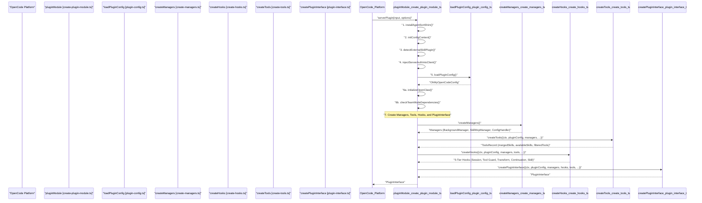
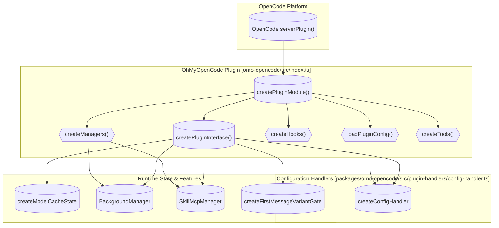
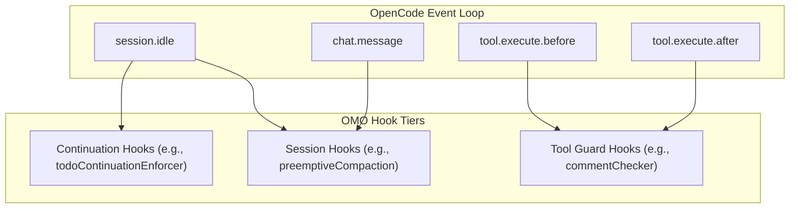

# Plugin System

Relevant source files

The following files were used as context for generating this wiki page:

- [.omo/evidence/20260812-init-deep/hierarchy-green.txt](https://github.com/code-yeongyu/oh-my-openagent/blob/HEAD/.omo/evidence/20260812-init-deep/hierarchy-green.txt)
- [.omo/evidence/20260812-init-deep/hierarchy-red.txt](https://github.com/code-yeongyu/oh-my-openagent/blob/HEAD/.omo/evidence/20260812-init-deep/hierarchy-red.txt)
- [.omo/evidence/20260812-init-deep/manual-review.md](https://github.com/code-yeongyu/oh-my-openagent/blob/HEAD/.omo/evidence/20260812-init-deep/manual-review.md)
- [.omo/evidence/20260812-init-deep/qa-summary.md](https://github.com/code-yeongyu/oh-my-openagent/blob/HEAD/.omo/evidence/20260812-init-deep/qa-summary.md)
- [.omo/evidence/20260812-init-deep/scoring.md](https://github.com/code-yeongyu/oh-my-openagent/blob/HEAD/.omo/evidence/20260812-init-deep/scoring.md)
- [.omo/evidence/20260812-init-deep/validation-green.txt](https://github.com/code-yeongyu/oh-my-openagent/blob/HEAD/.omo/evidence/20260812-init-deep/validation-green.txt)
- [.omo/evidence/20260812-init-deep/validation-red.txt](https://github.com/code-yeongyu/oh-my-openagent/blob/HEAD/.omo/evidence/20260812-init-deep/validation-red.txt)
- [AGENTS.md](https://github.com/code-yeongyu/oh-my-openagent/blob/HEAD/AGENTS.md)
- [packages/AGENTS.md](https://github.com/code-yeongyu/oh-my-openagent/blob/HEAD/packages/AGENTS.md)
- [packages/memory-core/AGENTS.md](https://github.com/code-yeongyu/oh-my-openagent/blob/HEAD/packages/memory-core/AGENTS.md)
- [packages/omo-config-core/src/migration/index.ts](https://github.com/code-yeongyu/oh-my-openagent/blob/HEAD/packages/omo-config-core/src/migration/index.ts)
- [packages/omo-opencode/src/agents/sisyphus/claude-opus-4-7.ts](https://github.com/code-yeongyu/oh-my-openagent/blob/HEAD/packages/omo-opencode/src/agents/sisyphus/claude-opus-4-7.ts)
- [packages/omo-opencode/src/cli/config-manager/plugin-detection.test.ts](https://github.com/code-yeongyu/oh-my-openagent/blob/HEAD/packages/omo-opencode/src/cli/config-manager/plugin-detection.test.ts)
- [packages/omo-opencode/src/features/opencode-runtime-skills/source-server.test.ts](https://github.com/code-yeongyu/oh-my-openagent/blob/HEAD/packages/omo-opencode/src/features/opencode-runtime-skills/source-server.test.ts)
- [packages/omo-opencode/src/features/opencode-runtime-skills/source-server.ts](https://github.com/code-yeongyu/oh-my-openagent/blob/HEAD/packages/omo-opencode/src/features/opencode-runtime-skills/source-server.ts)
- [packages/omo-opencode/src/hooks/claude-code-hooks/config-loader.test.ts](https://github.com/code-yeongyu/oh-my-openagent/blob/HEAD/packages/omo-opencode/src/hooks/claude-code-hooks/config-loader.test.ts)
- [packages/omo-opencode/src/hooks/claude-code-hooks/config-loader.ts](https://github.com/code-yeongyu/oh-my-openagent/blob/HEAD/packages/omo-opencode/src/hooks/claude-code-hooks/config-loader.ts)
- [packages/omo-opencode/src/index.telemetry.test.ts](https://github.com/code-yeongyu/oh-my-openagent/blob/HEAD/packages/omo-opencode/src/index.telemetry.test.ts)
- [packages/omo-opencode/src/index.test.ts](https://github.com/code-yeongyu/oh-my-openagent/blob/HEAD/packages/omo-opencode/src/index.test.ts)
- [packages/omo-opencode/src/plugin-handlers/config-handler-cache.test.ts](https://github.com/code-yeongyu/oh-my-openagent/blob/HEAD/packages/omo-opencode/src/plugin-handlers/config-handler-cache.test.ts)
- [packages/omo-opencode/src/plugin-handlers/config-handler-formatter.test.ts](https://github.com/code-yeongyu/oh-my-openagent/blob/HEAD/packages/omo-opencode/src/plugin-handlers/config-handler-formatter.test.ts)
- [packages/omo-opencode/src/plugin-handlers/config-handler.test.ts](https://github.com/code-yeongyu/oh-my-openagent/blob/HEAD/packages/omo-opencode/src/plugin-handlers/config-handler.test.ts)
- [packages/omo-opencode/src/plugin-handlers/config-handler.ts](https://github.com/code-yeongyu/oh-my-openagent/blob/HEAD/packages/omo-opencode/src/plugin-handlers/config-handler.ts)
- [packages/omo-opencode/src/plugin-handlers/plugin-components-loader.ts](https://github.com/code-yeongyu/oh-my-openagent/blob/HEAD/packages/omo-opencode/src/plugin-handlers/plugin-components-loader.ts)
- [packages/omo-opencode/src/shared/external-plugin-detector.test.ts](https://github.com/code-yeongyu/oh-my-openagent/blob/HEAD/packages/omo-opencode/src/shared/external-plugin-detector.test.ts)
- [packages/omo-opencode/src/startup-migration.ts](https://github.com/code-yeongyu/oh-my-openagent/blob/HEAD/packages/omo-opencode/src/startup-migration.ts)
- [packages/omo-opencode/src/testing/create-plugin-module-live-route.test.ts](https://github.com/code-yeongyu/oh-my-openagent/blob/HEAD/packages/omo-opencode/src/testing/create-plugin-module-live-route.test.ts)
- [packages/omo-opencode/src/testing/create-plugin-module.test.ts](https://github.com/code-yeongyu/oh-my-openagent/blob/HEAD/packages/omo-opencode/src/testing/create-plugin-module.test.ts)
- [packages/omo-opencode/src/testing/create-plugin-module.ts](https://github.com/code-yeongyu/oh-my-openagent/blob/HEAD/packages/omo-opencode/src/testing/create-plugin-module.ts)

This document details how `oh-my-openagent` integrates as a plugin with the OpenCode system, outlining the initialization sequence, the key plugin interface, configuration management, runtime state coordination, and safety checks against conflicting plugins.

---

## OpenCode Plugin Interface

`oh-my-openagent` implements the OpenCode `PluginModule` interface, exposing lifecycle handlers and tool definitions for AI agent orchestration. OpenCode loads the plugin at startup, invoking the exported interface via the main entry to obtain the handlers it should call.

### Plugin Contract

- The plugin receives a `PluginContext` object which includes:
  - `directory`: The root workspace directory. Used for resolving config files and environment detection. [packages/omo-opencode/src/AGENTS.md:56-59](https://github.com/code-yeongyu/oh-my-openagent/blob/HEAD/packages/omo-opencode/src/AGENTS.md#L56-L59)
  - `client`: OpenCode API client, supporting session operations, UI interactions, and authentication injection. [packages/omo-opencode/src/testing/create-plugin-module.ts:45-49](https://github.com/code-yeongyu/oh-my-openagent/blob/HEAD/packages/omo-opencode/src/testing/create-plugin-module.ts#L45-L49)

The plugin exports the following key handlers:

| Handler | Purpose |
|---|---|
| `config` | Registers the `ConfigHandler` which manages the plugin's configuration. [packages/omo-opencode/src/plugin-handlers/config-handler.ts:90-160](https://github.com/code-yeongyu/oh-my-openagent/blob/HEAD/packages/omo-opencode/src/plugin-handlers/config-handler.ts#L90-L160) |
| `tool` | Registers built-in tools and skill-embedded MCP interfaces. [packages/omo-opencode/src/create-tools.ts:35-36](https://github.com/code-yeongyu/oh-my-openagent/blob/HEAD/packages/omo-opencode/src/create-tools.ts#L35-L36) |
| `chat.params` | Applies agent variants based on model capabilities and Switch/Think modes. [packages/omo-opencode/src/hooks/AGENTS.md:32-32](https://github.com/code-yeongyu/oh-my-openagent/blob/HEAD/packages/omo-opencode/src/hooks/AGENTS.md#L32) |
| `chat.message` | Handles session setup, goal management, model overrides, and recovery. [packages/omo-opencode/src/hooks/AGENTS.md:37-53](https://github.com/code-yeongyu/oh-my-openagent/blob/HEAD/packages/omo-opencode/src/hooks/AGENTS.md#L37-L53) |
| `experimental.chat.messages.transform` | Applies transformations to chat messages (e.g., keyword detection, AGENTS.md injection). [packages/omo-opencode/src/hooks/AGENTS.md:81-84](https://github.com/code-yeongyu/oh-my-openagent/blob/HEAD/packages/omo-opencode/src/hooks/AGENTS.md#L81-L84) |
| `event` | Processes lifecycle events (session created/idle/error/deleted) via the dispatcher. [packages/omo-opencode/src/testing/create-plugin-module.ts:18-21](https://github.com/code-yeongyu/oh-my-openagent/blob/HEAD/packages/omo-opencode/src/testing/create-plugin-module.ts#L18-L21) |
| `tool.execute.before` | Executes preconditions and guards before tool commands run, including write access guards. [packages/omo-opencode/src/hooks/AGENTS.md:61-75](https://github.com/code-yeongyu/oh-my-openagent/blob/HEAD/packages/omo-opencode/src/hooks/AGENTS.md#L61-L75) |
| `tool.execute.after` | Handles post-execution steps such as output truncation and error recovery. [packages/omo-opencode/src/hooks/AGENTS.md:59-73](https://github.com/code-yeongyu/oh-my-openagent/blob/HEAD/packages/omo-opencode/src/hooks/AGENTS.md#L59-L73) |

Sources:
[packages/omo-opencode/src/AGENTS.md:28-37](https://github.com/code-yeongyu/oh-my-openagent/blob/HEAD/packages/omo-opencode/src/AGENTS.md#L28-L37), [packages/omo-opencode/src/hooks/AGENTS.md:1-105](https://github.com/code-yeongyu/oh-my-openagent/blob/HEAD/packages/omo-opencode/src/hooks/AGENTS.md#L1-L105), [packages/omo-opencode/src/plugin-handlers/config-handler.ts:90-160](https://github.com/code-yeongyu/oh-my-openagent/blob/HEAD/packages/omo-opencode/src/plugin-handlers/config-handler.ts#L90-L160)

---

## Initialization Flow

The plugin initialization follows a 7-step staged sequence to ensure proper integration with OpenCode internals.

### Initialization Sequence Diagram

This flow represents:

1.  **`installAgentSortShim()`**: Patches `Array.prototype` for canonical agent ordering. [packages/omo-opencode/src/testing/create-plugin-module.ts:22-22](https://github.com/code-yeongyu/oh-my-openagent/blob/HEAD/packages/omo-opencode/src/testing/create-plugin-module.ts#L22)
2.  **`initConfigContext()`**: Detects config layout. [packages/omo-opencode/src/testing/create-plugin-module.ts:23-23](https://github.com/code-yeongyu/oh-my-openagent/blob/HEAD/packages/omo-opencode/src/testing/create-plugin-module.ts#L23)
3.  **`detectExternalSkillPlugin()`**: Warns if conflicting plugins are loaded. [packages/omo-opencode/src/testing/create-plugin-module.ts:26-28](https://github.com/code-yeongyu/oh-my-openagent/blob/HEAD/packages/omo-opencode/src/testing/create-plugin-module.ts#L26-L28)
4.  **`injectServerAuthIntoClient()`**: Wires auth headers into shared SDK. [packages/omo-opencode/src/testing/create-plugin-module.ts:35-35](https://github.com/code-yeongyu/oh-my-openagent/blob/HEAD/packages/omo-opencode/src/testing/create-plugin-module.ts#L35)
5.  **`loadPluginConfig()`**: Hierarchical merge of `~/.omo/omo.jsonc` and project configs. [packages/omo-opencode/src/testing/create-plugin-module.ts:15-15](https://github.com/code-yeongyu/oh-my-openagent/blob/HEAD/packages/omo-opencode/src/testing/create-plugin-module.ts#L15)
6.  **`initializeOpenClaw()` / `checkTeamModeDependencies()`**: Bootstraps external gateways and verifies Git/Tmux for Team Mode. [packages/omo-opencode/src/testing/create-plugin-module.ts:12-12](https://github.com/code-yeongyu/oh-my-openagent/blob/HEAD/packages/omo-opencode/src/testing/create-plugin-module.ts#L12)
7.  **`createManagers()`**: Assembles `TmuxSessionManager`, `BackgroundManager`, `SkillMcpManager`, and `ConfigHandler`. [packages/omo-opencode/src/testing/create-plugin-module.ts:83-83](https://github.com/code-yeongyu/oh-my-openagent/blob/HEAD/packages/omo-opencode/src/testing/create-plugin-module.ts#L83)

Sources:
[packages/omo-opencode/src/AGENTS.md:39-51](https://github.com/code-yeongyu/oh-my-openagent/blob/HEAD/packages/omo-opencode/src/AGENTS.md#L39-L51), [packages/omo-opencode/src/testing/create-plugin-module.ts:163-175](https://github.com/code-yeongyu/oh-my-openagent/blob/HEAD/packages/omo-opencode/src/testing/create-plugin-module.ts#L163-L175)

---

## Conflict Detection and Safety Mechanisms

To maintain plugin stability, several conflict checks and safeguards are implemented:

-   **Duplicate OMO Detection**: Prevents loading multiple instances of the plugin. [packages/omo-opencode/src/testing/create-plugin-module.ts:24-27](https://github.com/code-yeongyu/oh-my-openagent/blob/HEAD/packages/omo-opencode/src/testing/create-plugin-module.ts#L24-L27)
-   **External Skill Plugin Detection**: Warns if other plugins are scanning `skills/` directories. [packages/omo-opencode/src/testing/create-plugin-module.ts:67-68](https://github.com/code-yeongyu/oh-my-openagent/blob/HEAD/packages/omo-opencode/src/testing/create-plugin-module.ts#L67-L68)
-   **Legacy Plugin Toast**: Alerts users when legacy plugin names are detected in the configuration. [packages/omo-opencode/src/shared/log-legacy-plugin-startup-warning.ts:1-1](https://github.com/code-yeongyu/oh-my-openagent/blob/HEAD/packages/omo-opencode/src/shared/log-legacy-plugin-startup-warning.ts#L1)

Sources:
[packages/omo-opencode/src/testing/create-plugin-module.ts:99-103](https://github.com/code-yeongyu/oh-my-openagent/blob/HEAD/packages/omo-opencode/src/testing/create-plugin-module.ts#L99-L103), [packages/omo-opencode/src/shared/log-legacy-plugin-startup-warning.ts:1-1](https://github.com/code-yeongyu/oh-my-openagent/blob/HEAD/packages/omo-opencode/src/shared/log-legacy-plugin-startup-warning.ts#L1)

---

## Plugin Entry Point and Runtime State Coordination

The plugin entry point orchestrates the preparation of runtime state, managers, and handlers that coordinate background work, MCP connections, and agent session states.

### Natural Language to Code Entity Mapping: Entry Point Composition

-   **`createConfigHandler`**: Manages the multi-stage application of `omo.jsonc` settings to OpenCode. [packages/omo-opencode/src/plugin-handlers/config-handler.ts:90-160](https://github.com/code-yeongyu/oh-my-openagent/blob/HEAD/packages/omo-opencode/src/plugin-handlers/config-handler.ts#L90-L160)
-   **`createModelCacheState`**: Shared model resolution state across handlers. [packages/omo-opencode/src/testing/create-plugin-module.ts:85-85](https://github.com/code-yeongyu/oh-my-openagent/blob/HEAD/packages/omo-opencode/src/testing/create-plugin-module.ts#L85)
-   **`BackgroundManager`**: Manages the lifecycle of asynchronous background tasks. [packages/omo-opencode/src/testing/create-plugin-module.ts:50-51](https://github.com/code-yeongyu/oh-my-openagent/blob/HEAD/packages/omo-opencode/src/testing/create-plugin-module.ts#L50-L51)
-   **`SkillMcpManager`**: Coordinates MCP servers embedded within skills. [packages/omo-opencode/src/testing/create-plugin-module.ts:52-52](https://github.com/code-yeongyu/oh-my-openagent/blob/HEAD/packages/omo-opencode/src/testing/create-plugin-module.ts#L52)

Sources:
[packages/omo-opencode/src/AGENTS.md:30-37](https://github.com/code-yeongyu/oh-my-openagent/blob/HEAD/packages/omo-opencode/src/AGENTS.md#L30-L37), [packages/omo-opencode/src/plugin-handlers/config-handler.ts:90-160](https://github.com/code-yeongyu/oh-my-openagent/blob/HEAD/packages/omo-opencode/src/plugin-handlers/config-handler.ts#L90-L160), [packages/omo-opencode/src/testing/create-plugin-module.ts:79-88](https://github.com/code-yeongyu/oh-my-openagent/blob/HEAD/packages/omo-opencode/src/testing/create-plugin-module.ts#L79-L88)

---

## Hook Composition

The plugin uses a 5-tier composition model to register approximately 54 base lifecycle hooks (up to 62 with team-mode and monitor enabled).

### Hook Tier Inventory

| Tier | Count | Key Hooks | Purpose |
|---|---|---|---|
| **Session** | 24 | `preemptiveCompaction`, `sessionNotification`, `thinkMode`, `modelFallback`, `goal` | OpenCode session lifecycle and model variant switching. |
| **Tool Guard** | 17 | `commentChecker`, `rulesInjector`, `writeExistingFileGuard`, `hashlineReadEnhancer` | Pre/post tool execution safety and data enrichment. |
| **Transform** | 4 | `keywordDetector`, `contextInjectorMessagesTransform`, `toolPairValidator` | `experimental.chat.messages.transform` message manipulation. |
| **Continuation** | 7 | `todoContinuationEnforcer` (Boulder), `atlasHook`, `backgroundNotificationHook` | Loop persistence and task status propagation. |
| **Skill** | 2 | `categorySkillReminder`, `autoSlashCommand` | Enhancing agent awareness of available skills and commands. |

Sources:
[packages/omo-opencode/src/AGENTS.md:69-105](https://github.com/code-yeongyu/oh-my-openagent/blob/HEAD/packages/omo-opencode/src/AGENTS.md#L69-L105), [packages/omo-opencode/src/hooks/AGENTS.md:7-22](https://github.com/code-yeongyu/oh-my-openagent/blob/HEAD/packages/omo-opencode/src/hooks/AGENTS.md#L7-L22)

### Hook Interaction Diagram

Sources:
[packages/omo-opencode/src/AGENTS.md:76-98](https://github.com/code-yeongyu/oh-my-openagent/blob/HEAD/packages/omo-opencode/src/AGENTS.md#L76-L98), [packages/omo-opencode/src/hooks/AGENTS.md:26-76](https://github.com/code-yeongyu/oh-my-openagent/blob/HEAD/packages/omo-opencode/src/hooks/AGENTS.md#L26-L76)