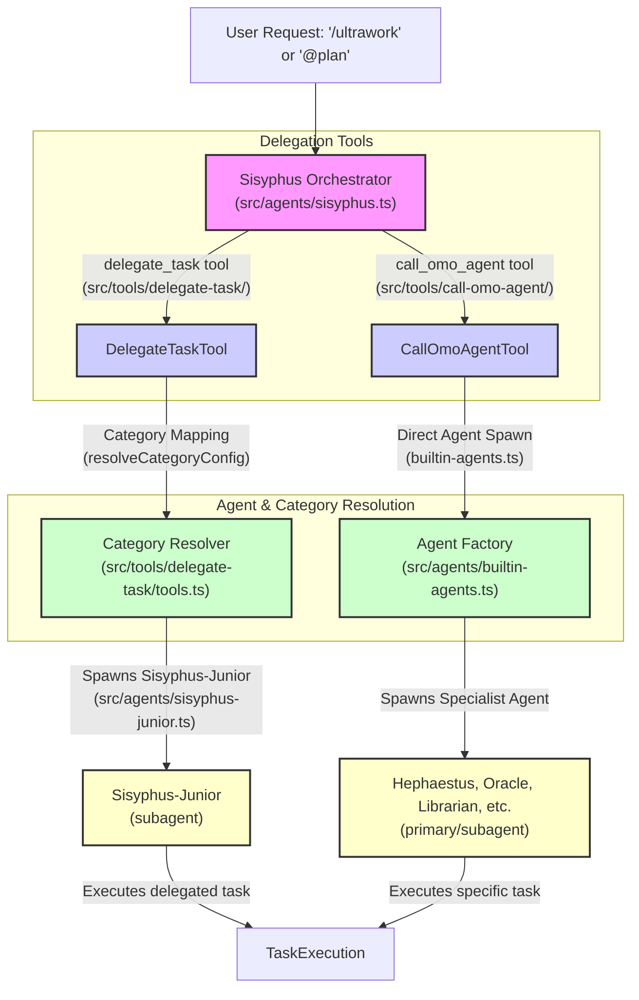
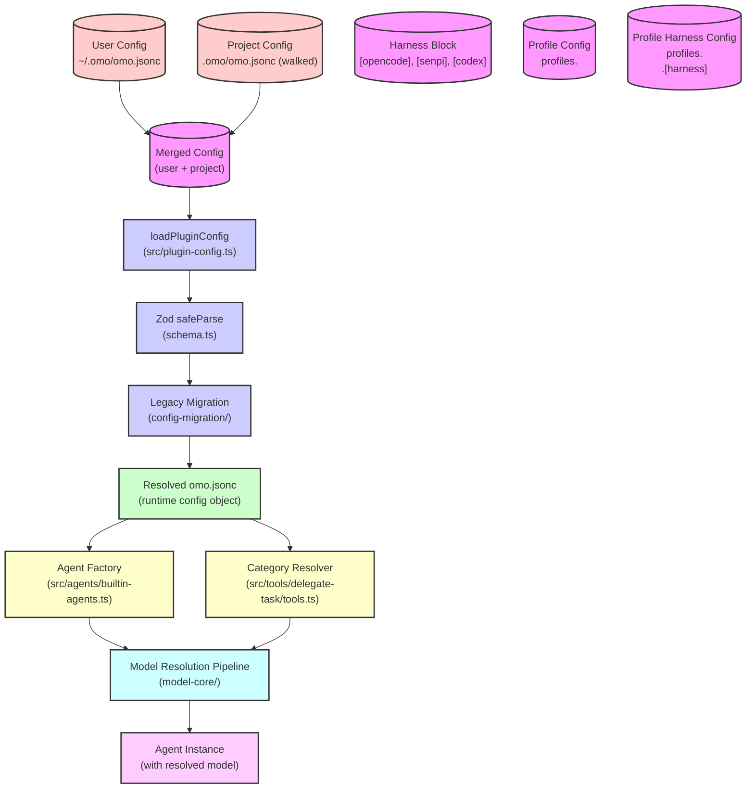

# Agent Orchestration

Relevant source files

The following files were used as context for generating this wiki page:

- [.omo/evidence/20260812-init-deep/hierarchy-green.txt](https://github.com/code-yeongyu/oh-my-openagent/blob/HEAD/.omo/evidence/20260812-init-deep/hierarchy-green.txt)
- [.omo/evidence/20260812-init-deep/hierarchy-red.txt](https://github.com/code-yeongyu/oh-my-openagent/blob/HEAD/.omo/evidence/20260812-init-deep/hierarchy-red.txt)
- [.omo/evidence/20260812-init-deep/manual-review.md](https://github.com/code-yeongyu/oh-my-openagent/blob/HEAD/.omo/evidence/20260812-init-deep/manual-review.md)
- [.omo/evidence/20260812-init-deep/qa-summary.md](https://github.com/code-yeongyu/oh-my-openagent/blob/HEAD/.omo/evidence/20260812-init-deep/qa-summary.md)
- [.omo/evidence/20260812-init-deep/scoring.md](https://github.com/code-yeongyu/oh-my-openagent/blob/HEAD/.omo/evidence/20260812-init-deep/scoring.md)
- [.omo/evidence/20260812-init-deep/validation-green.txt](https://github.com/code-yeongyu/oh-my-openagent/blob/HEAD/.omo/evidence/20260812-init-deep/validation-green.txt)
- [.omo/evidence/20260812-init-deep/validation-red.txt](https://github.com/code-yeongyu/oh-my-openagent/blob/HEAD/.omo/evidence/20260812-init-deep/validation-red.txt)
- [AGENTS.md](https://github.com/code-yeongyu/oh-my-openagent/blob/HEAD/AGENTS.md)
- [packages/AGENTS.md](https://github.com/code-yeongyu/oh-my-openagent/blob/HEAD/packages/AGENTS.md)
- [packages/ast-grep-mcp/AGENTS.md](https://github.com/code-yeongyu/oh-my-openagent/blob/HEAD/packages/ast-grep-mcp/AGENTS.md)
- [packages/memory-core/AGENTS.md](https://github.com/code-yeongyu/oh-my-openagent/blob/HEAD/packages/memory-core/AGENTS.md)
- [packages/omo-opencode/src/AGENTS.md](https://github.com/code-yeongyu/oh-my-openagent/blob/HEAD/packages/omo-opencode/src/AGENTS.md)
- [packages/omo-opencode/src/agents/AGENTS.md](https://github.com/code-yeongyu/oh-my-openagent/blob/HEAD/packages/omo-opencode/src/agents/AGENTS.md)
- [packages/omo-opencode/src/agents/prometheus/AGENTS.md](https://github.com/code-yeongyu/oh-my-openagent/blob/HEAD/packages/omo-opencode/src/agents/prometheus/AGENTS.md)
- [packages/omo-opencode/src/config-migration/AGENTS.md](https://github.com/code-yeongyu/oh-my-openagent/blob/HEAD/packages/omo-opencode/src/config-migration/AGENTS.md)
- [packages/omo-opencode/src/features/AGENTS.md](https://github.com/code-yeongyu/oh-my-openagent/blob/HEAD/packages/omo-opencode/src/features/AGENTS.md)
- [packages/omo-opencode/src/features/boulder-state/AGENTS.md](https://github.com/code-yeongyu/oh-my-openagent/blob/HEAD/packages/omo-opencode/src/features/boulder-state/AGENTS.md)
- [packages/omo-opencode/src/features/team-mode/AGENTS.md](https://github.com/code-yeongyu/oh-my-openagent/blob/HEAD/packages/omo-opencode/src/features/team-mode/AGENTS.md)
- [packages/omo-opencode/src/hooks/AGENTS.md](https://github.com/code-yeongyu/oh-my-openagent/blob/HEAD/packages/omo-opencode/src/hooks/AGENTS.md)
- [packages/omo-opencode/src/hooks/auto-update-checker/AGENTS.md](https://github.com/code-yeongyu/oh-my-openagent/blob/HEAD/packages/omo-opencode/src/hooks/auto-update-checker/AGENTS.md)
- [packages/omo-opencode/src/hooks/keyword-detector/AGENTS.md](https://github.com/code-yeongyu/oh-my-openagent/blob/HEAD/packages/omo-opencode/src/hooks/keyword-detector/AGENTS.md)
- [packages/omo-opencode/src/tools/AGENTS.md](https://github.com/code-yeongyu/oh-my-openagent/blob/HEAD/packages/omo-opencode/src/tools/AGENTS.md)
- [packages/omo-opencode/src/tools/delegate-task/anthropic-categories.ts](https://github.com/code-yeongyu/oh-my-openagent/blob/HEAD/packages/omo-opencode/src/tools/delegate-task/anthropic-categories.ts)
- [packages/omo-opencode/src/tools/delegate-task/builtin-categories.ts](https://github.com/code-yeongyu/oh-my-openagent/blob/HEAD/packages/omo-opencode/src/tools/delegate-task/builtin-categories.ts)
- [packages/omo-opencode/src/tools/delegate-task/builtin-category-definition.ts](https://github.com/code-yeongyu/oh-my-openagent/blob/HEAD/packages/omo-opencode/src/tools/delegate-task/builtin-category-definition.ts)
- [packages/omo-opencode/src/tools/delegate-task/categories.ts](https://github.com/code-yeongyu/oh-my-openagent/blob/HEAD/packages/omo-opencode/src/tools/delegate-task/categories.ts)
- [packages/omo-opencode/src/tools/delegate-task/category-routing-policy.test.ts](https://github.com/code-yeongyu/oh-my-openagent/blob/HEAD/packages/omo-opencode/src/tools/delegate-task/category-routing-policy.test.ts)
- [packages/omo-opencode/src/tools/delegate-task/constants.ts](https://github.com/code-yeongyu/oh-my-openagent/blob/HEAD/packages/omo-opencode/src/tools/delegate-task/constants.ts)
- [packages/omo-opencode/src/tools/delegate-task/google-categories.ts](https://github.com/code-yeongyu/oh-my-openagent/blob/HEAD/packages/omo-opencode/src/tools/delegate-task/google-categories.ts)
- [packages/omo-opencode/src/tools/delegate-task/kimi-categories.ts](https://github.com/code-yeongyu/oh-my-openagent/blob/HEAD/packages/omo-opencode/src/tools/delegate-task/kimi-categories.ts)
- [packages/omo-opencode/src/tools/delegate-task/openai-categories.ts](https://github.com/code-yeongyu/oh-my-openagent/blob/HEAD/packages/omo-opencode/src/tools/delegate-task/openai-categories.ts)
- [packages/omo-opencode/src/tools/delegate-task/tools.test.ts](https://github.com/code-yeongyu/oh-my-openagent/blob/HEAD/packages/omo-opencode/src/tools/delegate-task/tools.test.ts)

This page details the multi-agent orchestration architecture within `oh-my-openagent`. It explains the delegation hierarchy of agents, the role of orchestrators, and how coordination among specialist agents is implemented across multiple harnesses (OpenCode and Codex). The page covers technical details about the agent tiers, routing and delegation mechanisms, model resolution logic, and enforcement of tool permissions.

---

## Agent Hierarchy

The architecture is structured as a layered hierarchy where **orchestrators** manage **specialists** and **category-based executors**, enabling complex workflows via multi-agent delegation.

Agents have `mode` attributes which determine their operational context and visibility:
- `primary`: Top-level, user-facing orchestrators selected directly in UI/CLI.
- `subagent`: Worker or specialist agents invoked by orchestrators via delegation tools.

These modes are defined in the core agent types and influence fallback strategies and prompt construction [packages/omo-opencode/src/agents/AGENTS.md:106-111](https://github.com/code-yeongyu/oh-my-openagent/blob/HEAD/packages/omo-opencode/src/agents/AGENTS.md#L106-L111).

### Orchestration Tiers

1.  **Main Orchestrator (Sisyphus)**
    The central "Discipline Agent" responsible for planning, task decomposition, and delegating subtasks to specialists [AGENTS.md:22](https://github.com/code-yeongyu/oh-my-openagent/blob/HEAD/AGENTS.md#L22).
    -   Supports model-tailored prompt variants optimized for Claude, GPT, Kimi K3, and Gemini [packages/omo-opencode/src/agents/AGENTS.md:22](https://github.com/code-yeongyu/oh-my-openagent/blob/HEAD/packages/omo-opencode/src/agents/AGENTS.md#L22).
    -   Operates as the default entry point for the `ultrawork` command.

2.  **Strategic Planning Agents (Prometheus Family)**
    Responsible for interview-like clarification and generation of detailed project plans before implementation.
    -   **Prometheus:** Strategic planner that conducts user interviews [packages/omo-opencode/src/agents/AGENTS.md:31](https://github.com/code-yeongyu/oh-my-openagent/blob/HEAD/packages/omo-opencode/src/agents/AGENTS.md#L31).
    -   **Metis:** Pre-planning consultant [packages/omo-opencode/src/agents/AGENTS.md:28](https://github.com/code-yeongyu/oh-my-openagent/blob/HEAD/packages/omo-opencode/src/agents/AGENTS.md#L28).
    -   **Momus:** Plan reviewer [packages/omo-opencode/src/agents/AGENTS.md:29](https://github.com/code-yeongyu/oh-my-openagent/blob/HEAD/packages/omo-opencode/src/agents/AGENTS.md#L29).

3.  **Execution Master (Atlas)**
    The "Conductor" that executes Prometheus plans by distributing tasks to subagents and managing the todo list [packages/omo-opencode/src/agents/AGENTS.md:30](https://github.com/code-yeongyu/oh-my-openagent/blob/HEAD/packages/omo-opencode/src/agents/AGENTS.md#L30).

4.  **Worker Specialists**
    Domain experts who execute delegated tasks:
    -   **Hephaestus:** Autonomous deep worker [packages/omo-opencode/src/agents/AGENTS.md:23](https://github.com/code-yeongyu/oh-my-openagent/blob/HEAD/packages/omo-opencode/src/agents/AGENTS.md#L23).
    -   **Oracle:** Read-only consultation [packages/omo-opencode/src/agents/AGENTS.md:24](https://github.com/code-yeongyu/oh-my-openagent/blob/HEAD/packages/omo-opencode/src/agents/AGENTS.md#L24).
    -   **Explore:** Contextual grep [packages/omo-opencode/src/agents/AGENTS.md:26](https://github.com/code-yeongyu/oh-my-openagent/blob/HEAD/packages/omo-opencode/src/agents/AGENTS.md#L26).
    -   **Librarian:** External docs/code search [packages/omo-opencode/src/agents/AGENTS.md:25](https://github.com/code-yeongyu/oh-my-openagent/blob/HEAD/packages/omo-opencode/src/agents/AGENTS.md#L25).
    -   **Multimodal-Looker:** PDF/image analysis [packages/omo-opencode/src/agents/AGENTS.md:27](https://github.com/code-yeongyu/oh-my-openagent/blob/HEAD/packages/omo-opencode/src/agents/AGENTS.md#L27).
    -   **Sisyphus-Junior:** Category-spawned executor [packages/omo-opencode/src/agents/AGENTS.md:32](https://github.com/code-yeongyu/oh-my-openagent/blob/HEAD/packages/omo-opencode/src/agents/AGENTS.md#L32).

Sources:
[AGENTS.md:22](https://github.com/code-yeongyu/oh-my-openagent/blob/HEAD/AGENTS.md#L22)
[packages/omo-opencode/src/agents/AGENTS.md:22-32](https://github.com/code-yeongyu/oh-my-openagent/blob/HEAD/packages/omo-opencode/src/agents/AGENTS.md#L22-L32)

---

### Natural Language to Code Entity Mapping: Orchestration Flow

This diagram illustrates how a user request triggers the `Sisyphus` orchestrator, which then utilizes specific tools to delegate work. `delegate_task` routes through a category resolver, typically spawning `Sisyphus-Junior` for general tasks. `call_omo_agent` directly spawns a named specialist agent.

Sources:
[packages/omo-opencode/src/agents/sisyphus.ts](https://github.com/code-yeongyu/oh-my-openagent/blob/HEAD/packages/omo-opencode/src/agents/sisyphus.ts)
[packages/omo-opencode/src/tools/delegate-task/tools.ts](https://github.com/code-yeongyu/oh-my-openagent/blob/HEAD/packages/omo-opencode/src/tools/delegate-task/tools.ts)
[packages/omo-opencode/src/tools/call-omo-agent/](https://github.com/code-yeongyu/oh-my-openagent/blob/HEAD/packages/omo-opencode/src/tools/call-omo-agent/)
[packages/omo-opencode/src/agents/builtin-agents.ts](https://github.com/code-yeongyu/oh-my-openagent/blob/HEAD/packages/omo-opencode/src/agents/builtin-agents.ts)
[packages/omo-opencode/src/agents/sisyphus-junior.ts](https://github.com/code-yeongyu/oh-my-openagent/blob/HEAD/packages/omo-opencode/src/agents/sisyphus-junior.ts)

---

## Delegation Mechanisms

Task delegation relies on semantic classification into **categories**, and dynamic prompt construction reflecting available agent capabilities and skills.

### Category-Based Routing

Delegations to subagents typically route through **categories**, which are semantically defined task buckets linked to specialized models and fallback chains. The `delegate_task` tool uses these categories to resolve the appropriate model and context without the orchestrator needing to know specific model IDs.

| Category | Default Model | Variant | Purpose | Source File |
| :--- | :--- | :--- | :--- | :--- |
| `visual-engineering` | `anthropic/claude-opus-5` | `max` | Frontend, UI/UX | [packages/omo-opencode/src/tools/delegate-task/tools.test.ts:162-168](https://github.com/code-yeongyu/oh-my-openagent/blob/HEAD/packages/omo-opencode/src/tools/delegate-task/tools.test.ts#L162-L168) |
| `ultrabrain` | `openai/gpt-5.6-sol` | `xhigh` | Deep logical reasoning / complex architecture tasks | [packages/omo-opencode/src/tools/delegate-task/tools.test.ts:171-177](https://github.com/code-yeongyu/oh-my-openagent/blob/HEAD/packages/omo-opencode/src/tools/delegate-task/tools.test.ts#L171-L177), [packages/omo-opencode/src/tools/delegate-task/openai-categories.ts:4-24](https://github.com/code-yeongyu/oh-my-openagent/blob/HEAD/packages/omo-opencode/src/tools/delegate-task/openai-categories.ts#L4-L24) |
| `deep` | `openai/gpt-5.6-sol` | `medium` | Goal-oriented autonomous tasks, thorough exploration | [packages/omo-opencode/src/tools/delegate-task/tools.test.ts:180-186](https://github.com/code-yeongyu/oh-my-openagent/blob/HEAD/packages/omo-opencode/src/tools/delegate-task/tools.test.ts#L180-L186), [packages/omo-opencode/src/tools/delegate-task/openai-categories.ts:26-67](https://github.com/code-yeongyu/oh-my-openagent/blob/HEAD/packages/omo-opencode/src/tools/delegate-task/openai-categories.ts#L26-L67) |
| `artistry` | `anthropic/claude-fable-5` | `xhigh` | Creative / unconventional approaches | [packages/omo-opencode/src/tools/delegate-task/google-categories.ts](https://github.com/code-yeongyu/oh-my-openagent/blob/HEAD/packages/omo-opencode/src/tools/delegate-task/google-categories.ts) |
| `quick` | `kimi-for-coding/kimi-for-coding-highspeed` | | Small / quick tasks, efficient execution | [packages/omo-opencode/src/tools/delegate-task/openai-categories.ts:76-89](https://github.com/code-yeongyu/oh-my-openagent/blob/HEAD/packages/omo-opencode/src/tools/delegate-task/openai-categories.ts#L76-L89) |
| `unspecified-low` | `openai/gpt-5.6-luna` | `xhigh` | Moderate effort fallback | [packages/omo-opencode/src/tools/delegate-task/openai-categories.ts:127-132](https://github.com/code-yeongyu/oh-my-openagent/blob/HEAD/packages/omo-opencode/src/tools/delegate-task/openai-categories.ts#L127-L132) |
| `unspecified-high` | `kimi-for-coding/k3` | `max` | High effort fallback, unclassifiable tasks | [packages/omo-opencode/src/tools/delegate-task/tools.test.ts:189-195](https://github.com/code-yeongyu/oh-my-openagent/blob/HEAD/packages/omo-opencode/src/tools/delegate-task/tools.test.ts#L189-L195), [packages/omo-opencode/src/tools/delegate-task/anthropic-categories.ts:18-25](https://github.com/code-yeongyu/oh-my-openagent/blob/HEAD/packages/omo-opencode/src/tools/delegate-task/anthropic-categories.ts#L18-L25) |
| `writing` | `kimi-for-coding/k3` | `low` | Documentation, prose | [packages/omo-opencode/src/tools/delegate-task/kimi-categories.ts](https://github.com/code-yeongyu/oh-my-openagent/blob/HEAD/packages/omo-opencode/src/tools/delegate-task/kimi-categories.ts) |

User-defined categories in `omo.jsonc` can override or extend these defaults [packages/omo-opencode/src/tools/AGENTS.md:65](https://github.com/code-yeongyu/oh-my-openagent/blob/HEAD/packages/omo-opencode/src/tools/AGENTS.md#L65).

Sources:
[packages/omo-opencode/src/tools/AGENTS.md:50-67](https://github.com/code-yeongyu/oh-my-openagent/blob/HEAD/packages/omo-opencode/src/tools/AGENTS.md#L50-L67)
[packages/omo-opencode/src/tools/delegate-task/tools.test.ts:162-195](https://github.com/code-yeongyu/oh-my-openagent/blob/HEAD/packages/omo-opencode/src/tools/delegate-task/tools.test.ts#L162-L195)
[packages/omo-opencode/src/tools/delegate-task/openai-categories.ts:4-132](https://github.com/code-yeongyu/oh-my-openagent/blob/HEAD/packages/omo-opencode/src/tools/delegate-task/openai-categories.ts#L4-L132)
[packages/omo-opencode/src/tools/delegate-task/anthropic-categories.ts:18-25](https://github.com/code-yeongyu/oh-my-openagent/blob/HEAD/packages/omo-opencode/src/tools/delegate-task/anthropic-categories.ts#L18-L25)
[packages/omo-opencode/src/tools/delegate-task/google-categories.ts](https://github.com/code-yeongyu/oh-my-openagent/blob/HEAD/packages/omo-opencode/src/tools/delegate-task/google-categories.ts)
[packages/omo-opencode/src/tools/delegate-task/kimi-categories.ts](https://github.com/code-yeongyu/oh-my-openagent/blob/HEAD/packages/omo-opencode/src/tools/delegate-task/kimi-categories.ts)

---

### Technical Model Resolution Pipeline

A sophisticated multi-layer configuration pipeline resolves which model a given agent or category should use. The system follows a 4-layer resolution model:

1.  **User Config:** `~/.omo/omo.jsonc` [packages/omo-opencode/src/AGENTS.md:55](https://github.com/code-yeongyu/oh-my-openagent/blob/HEAD/packages/omo-opencode/src/AGENTS.md#L55).
2.  **Walked Project Configs:** `.omo/omo.jsonc` files found by walking up the directory tree from the current working directory [packages/omo-opencode/src/AGENTS.md:56](https://github.com/code-yeongyu/oh-my-openagent/blob/HEAD/packages/omo-opencode/src/AGENTS.md#L56).
3.  **Harness Block:** Specific overrides for `[opencode]`, `[senpi]`, or `[codex]` within the merged configuration.
4.  **Profiles:** Named configuration sets (e.g., `profiles.production`) and their harness-specific overrides (e.g., `profiles.dev.[opencode]`).

The **Model Catalog** allows mapping short names (e.g., "fast") to full model specifications including `variant` and `reasoningEffort`.

Sources:
[packages/omo-opencode/src/AGENTS.md:54-67](https://github.com/code-yeongyu/oh-my-openagent/blob/HEAD/packages/omo-opencode/src/AGENTS.md#L54-L67)

---

### Code Entity Space: Configuration Model Resolution Flow

This flow describes how `omo-config-core` resolves layered configurations, which the `AgentFactory` and `CategoryResolver` consume to instantiate agents with the correct model and prompt settings. The `tryFallbackRetry` logic ensures session continuity if the primary model fails.

Sources:
[packages/omo-opencode/src/AGENTS.md:54-67](https://github.com/code-yeongyu/oh-my-openagent/blob/HEAD/packages/omo-opencode/src/AGENTS.md#L54-L67)
[packages/omo-opencode/src/config-migration/AGENTS.md](https://github.com/code-yeongyu/oh-my-openagent/blob/HEAD/packages/omo-opencode/src/config-migration/AGENTS.md)
[packages/omo-opencode/src/agents/builtin-agents.ts](https://github.com/code-yeongyu/oh-my-openagent/blob/HEAD/packages/omo-opencode/src/agents/builtin-agents.ts)
[packages/omo-opencode/src/tools/delegate-task/tools.ts](https://github.com/code-yeongyu/oh-my-openagent/blob/HEAD/packages/omo-opencode/src/tools/delegate-task/tools.ts)
[packages/model-core/](https://github.com/code-yeongyu/oh-my-openagent/blob/HEAD/packages/model-core/)

---

## Tool Permissions and Restrictions

Agent roles enforce capability restrictions to ensure safety and specialized focus. These are enforced via deterministic permission gates and tool allowlists/blocklists.

| Agent | Denied Tools |
| :--- | :--- |
| **Oracle** | `write`, `edit`, `task`, `call_omo_agent` |
| **Librarian** | `write`, `edit`, `task`, `call_omo_agent` |
| **Explore** | `write`, `edit`, `task`, `call_omo_agent` |
| **Multimodal-Looker** | ALL except `read` |
| **Atlas** | `task`, `call_omo_agent` |
| **Momus** | `write`, `edit`, `task` |
| **Prometheus** | Enforces `.md`-only writes via `prometheus-md-only` hook (path-based, not tool-based) |

These restrictions are defined in [`src/shared/agent-tool-restrictions.ts`](https://github.com/code-yeongyu/oh-my-openagent/blob/HEAD/packages/omo-opencode/src/shared/agent-tool-restrictions.ts)() and enforced by tool guard hooks like `teamToolGating` and `writeExistingFileGuard` [packages/omo-opencode/src/hooks/AGENTS.md:85-91](https://github.com/code-yeongyu/oh-my-openagent/blob/HEAD/packages/omo-opencode/src/hooks/AGENTS.md#L85-L91).

Sources:
[packages/omo-opencode/src/agents/AGENTS.md:38-47](https://github.com/code-yeongyu/oh-my-openagent/blob/HEAD/packages/omo-opencode/src/agents/AGENTS.md#L38-L47)
[packages/omo-opencode/src/hooks/AGENTS.md:85-91](https://github.com/code-yeongyu/oh-my-openagent/blob/HEAD/packages/omo-opencode/src/hooks/AGENTS.md#L85-L91)
[packages/omo-opencode/src/shared/agent-tool-restrictions.ts](https://github.com/code-yeongyu/oh-my-openagent/blob/HEAD/packages/omo-opencode/src/shared/agent-tool-restrictions.ts)

---

## Summary

`oh-my-openagent` implements a sophisticated, multi-agent orchestration system where the **Sisyphus** agent acts as the lead orchestrator, delegating work to a diverse team of specialists like **Hephaestus** (Deep Work) and **Oracle** (Consultation). Delegation relies on semantic **category** routing and a 4-layer configuration resolution pipeline.

The architecture ensures that the "right brain is used for the right job"—leveraging Claude's instruction following for orchestration and GPT's reasoning for deep technical execution—while maintaining strict safety boundaries through a deterministic tool permission model.1d:T