# Background Task System

<details>
<summary>Relevant source files</summary>

The following files were used as context for generating this wiki page:

- [packages/omo-opencode/src/features/background-agent/background-task-marker.ts](https://github.com/code-yeongyu/oh-my-openagent/blob/HEAD/packages/omo-opencode/src/features/background-agent/background-task-marker.ts)
- [packages/omo-opencode/src/features/background-agent/background-task-notification-template.test.ts](https://github.com/code-yeongyu/oh-my-openagent/blob/HEAD/packages/omo-opencode/src/features/background-agent/background-task-notification-template.test.ts)
- [packages/omo-opencode/src/features/background-agent/background-task-notification-template.ts](https://github.com/code-yeongyu/oh-my-openagent/blob/HEAD/packages/omo-opencode/src/features/background-agent/background-task-notification-template.ts)
- [packages/omo-opencode/src/features/background-agent/error-classifier.test.ts](https://github.com/code-yeongyu/oh-my-openagent/blob/HEAD/packages/omo-opencode/src/features/background-agent/error-classifier.test.ts)
- [packages/omo-opencode/src/features/background-agent/error-classifier.ts](https://github.com/code-yeongyu/oh-my-openagent/blob/HEAD/packages/omo-opencode/src/features/background-agent/error-classifier.ts)
- [packages/omo-opencode/src/features/background-agent/manager-continuation-marker.test.ts](https://github.com/code-yeongyu/oh-my-openagent/blob/HEAD/packages/omo-opencode/src/features/background-agent/manager-continuation-marker.test.ts)
- [packages/omo-opencode/src/features/background-agent/manager.test.ts](https://github.com/code-yeongyu/oh-my-openagent/blob/HEAD/packages/omo-opencode/src/features/background-agent/manager.test.ts)
- [packages/omo-opencode/src/features/background-agent/manager.ts](https://github.com/code-yeongyu/oh-my-openagent/blob/HEAD/packages/omo-opencode/src/features/background-agent/manager.ts)
- [packages/omo-opencode/src/features/background-agent/parent-wake-active-defer-ceiling.test.ts](https://github.com/code-yeongyu/oh-my-openagent/blob/HEAD/packages/omo-opencode/src/features/background-agent/parent-wake-active-defer-ceiling.test.ts)
- [packages/omo-opencode/src/features/background-agent/parent-wake-active-turn-event.test.ts](https://github.com/code-yeongyu/oh-my-openagent/blob/HEAD/packages/omo-opencode/src/features/background-agent/parent-wake-active-turn-event.test.ts)
- [packages/omo-opencode/src/features/background-agent/parent-wake-assistant-text-race.test.ts](https://github.com/code-yeongyu/oh-my-openagent/blob/HEAD/packages/omo-opencode/src/features/background-agent/parent-wake-assistant-text-race.test.ts)
- [packages/omo-opencode/src/features/background-agent/parent-wake-dedupe.ts](https://github.com/code-yeongyu/oh-my-openagent/blob/HEAD/packages/omo-opencode/src/features/background-agent/parent-wake-dedupe.ts)
- [packages/omo-opencode/src/features/background-agent/parent-wake-dispatched-tracker.ts](https://github.com/code-yeongyu/oh-my-openagent/blob/HEAD/packages/omo-opencode/src/features/background-agent/parent-wake-dispatched-tracker.ts)
- [packages/omo-opencode/src/features/background-agent/parent-wake-flush-runner.ts](https://github.com/code-yeongyu/oh-my-openagent/blob/HEAD/packages/omo-opencode/src/features/background-agent/parent-wake-flush-runner.ts)
- [packages/omo-opencode/src/features/background-agent/parent-wake-inflight-dispatch.test.ts](https://github.com/code-yeongyu/oh-my-openagent/blob/HEAD/packages/omo-opencode/src/features/background-agent/parent-wake-inflight-dispatch.test.ts)
- [packages/omo-opencode/src/features/background-agent/parent-wake-late-error-recovery.test.ts](https://github.com/code-yeongyu/oh-my-openagent/blob/HEAD/packages/omo-opencode/src/features/background-agent/parent-wake-late-error-recovery.test.ts)
- [packages/omo-opencode/src/features/background-agent/parent-wake-notifier-types.ts](https://github.com/code-yeongyu/oh-my-openagent/blob/HEAD/packages/omo-opencode/src/features/background-agent/parent-wake-notifier-types.ts)
- [packages/omo-opencode/src/features/background-agent/parent-wake-notifier.ts](https://github.com/code-yeongyu/oh-my-openagent/blob/HEAD/packages/omo-opencode/src/features/background-agent/parent-wake-notifier.ts)
- [packages/omo-opencode/src/features/background-agent/parent-wake-pending-queue.ts](https://github.com/code-yeongyu/oh-my-openagent/blob/HEAD/packages/omo-opencode/src/features/background-agent/parent-wake-pending-queue.ts)
- [packages/omo-opencode/src/features/background-agent/parent-wake-window-recovery.ts](https://github.com/code-yeongyu/oh-my-openagent/blob/HEAD/packages/omo-opencode/src/features/background-agent/parent-wake-window-recovery.ts)
- [packages/omo-opencode/src/features/background-agent/parent-wake-window-requeue.test.ts](https://github.com/code-yeongyu/oh-my-openagent/blob/HEAD/packages/omo-opencode/src/features/background-agent/parent-wake-window-requeue.test.ts)
- [packages/omo-opencode/src/features/hook-message-injector/injector.test.ts](https://github.com/code-yeongyu/oh-my-openagent/blob/HEAD/packages/omo-opencode/src/features/hook-message-injector/injector.test.ts)
- [packages/omo-opencode/src/features/hook-message-injector/sdk-message-lookup.ts](https://github.com/code-yeongyu/oh-my-openagent/blob/HEAD/packages/omo-opencode/src/features/hook-message-injector/sdk-message-lookup.ts)
- [packages/omo-opencode/src/features/team-mode/integration.test.ts](https://github.com/code-yeongyu/oh-my-openagent/blob/HEAD/packages/omo-opencode/src/features/team-mode/integration.test.ts)
- [packages/omo-opencode/src/features/team-mode/team-mailbox/poll.test.ts](https://github.com/code-yeongyu/oh-my-openagent/blob/HEAD/packages/omo-opencode/src/features/team-mode/team-mailbox/poll.test.ts)
- [packages/omo-opencode/src/features/team-mode/team-runtime/create.test.ts](https://github.com/code-yeongyu/oh-my-openagent/blob/HEAD/packages/omo-opencode/src/features/team-mode/team-runtime/create.test.ts)
- [packages/omo-opencode/src/features/team-mode/test-support/async-test-helpers.ts](https://github.com/code-yeongyu/oh-my-openagent/blob/HEAD/packages/omo-opencode/src/features/team-mode/test-support/async-test-helpers.ts)
- [packages/omo-opencode/src/hooks/atlas/tool-execute-after-background-launch.test.ts](https://github.com/code-yeongyu/oh-my-openagent/blob/HEAD/packages/omo-opencode/src/hooks/atlas/tool-execute-after-background-launch.test.ts)
- [packages/omo-opencode/src/hooks/atlas/tool-execute-after-subagent-completion.test.ts](https://github.com/code-yeongyu/oh-my-openagent/blob/HEAD/packages/omo-opencode/src/hooks/atlas/tool-execute-after-subagent-completion.test.ts)
- [packages/omo-opencode/src/hooks/atlas/tool-execute-after-subagent-completion.ts](https://github.com/code-yeongyu/oh-my-openagent/blob/HEAD/packages/omo-opencode/src/hooks/atlas/tool-execute-after-subagent-completion.ts)
- [packages/omo-opencode/src/hooks/atlas/tool-execute-after.ts](https://github.com/code-yeongyu/oh-my-openagent/blob/HEAD/packages/omo-opencode/src/hooks/atlas/tool-execute-after.ts)
- [packages/omo-opencode/src/hooks/atlas/types.ts](https://github.com/code-yeongyu/oh-my-openagent/blob/HEAD/packages/omo-opencode/src/hooks/atlas/types.ts)
- [packages/omo-opencode/src/shared/posthog-activity-state.ts](https://github.com/code-yeongyu/oh-my-openagent/blob/HEAD/packages/omo-opencode/src/shared/posthog-activity-state.ts)
- [packages/omo-opencode/src/shared/posthog.test.ts](https://github.com/code-yeongyu/oh-my-openagent/blob/HEAD/packages/omo-opencode/src/shared/posthog.test.ts)
- [packages/omo-opencode/src/shared/posthog.ts](https://github.com/code-yeongyu/oh-my-openagent/blob/HEAD/packages/omo-opencode/src/shared/posthog.ts)
- [packages/omo-opencode/src/shared/prompt-async-gate/pending-tool-turn.test.ts](https://github.com/code-yeongyu/oh-my-openagent/blob/HEAD/packages/omo-opencode/src/shared/prompt-async-gate/pending-tool-turn.test.ts)
- [packages/team-core/src/team-mailbox/poll.test.ts](https://github.com/code-yeongyu/oh-my-openagent/blob/HEAD/packages/team-core/src/team-mailbox/poll.test.ts)

</details>


The Background Task System in oh-my-openagent is responsible for managing asynchronous execution of agent sub-tasks in the background, orchestrating their lifecycle, concurrency, and inter-session notifications. It enables delegation of long-running or parallel AI agent activities while maintaining orderly task execution, status monitoring, and user notification.

This page provides a detailed technical description of the `BackgroundManager` implementation, its task lifecycle states and transitions, concurrency control mechanisms, spawn depth guards for subagents, and the parent session notification system.

---

## Purpose and Scope

The Background Task System offers:

- **Asynchronous Task Execution:** Enables agents to spawn subagent sessions asynchronously, allowing parallel work independent of the parent. This is primarily exposed via `BackgroundManager.launch()` which initiates and queues background tasks for new sessions [packages/omo-opencode/src/features/background-agent/manager.ts:223-245](https://github.com/code-yeongyu/oh-my-openagent/blob/HEAD/packages/omo-opencode/src/features/background-agent/manager.ts#L223-L245).

- **Concurrency Management:** Employs a queue-per-key concurrency control using `ConcurrencyManager` to limit simultaneous active tasks by concurrency key (usually by model/provider), preventing overload or API rate issues [packages/omo-opencode/src/features/background-agent/concurrency.ts:1-50](https://github.com/code-yeongyu/oh-my-openagent/blob/HEAD/packages/omo-opencode/src/features/background-agent/concurrency.ts#L1-L50).

- **Task Lifecycle Management:** Tracks background tasks through defined states such as `pending`, `running`, `completed`, `error`, `interrupt`, and `cancelled`. It actively polls running tasks for progress and cleans up stale or outdated ones [packages/omo-opencode/src/features/background-agent/types.ts:5-11](https://github.com/code-yeongyu/oh-my-openagent/blob/HEAD/packages/omo-opencode/src/features/background-agent/types.ts#L5-L11).

- **Parent Session Notifications:** Upon task completion or errors, the system schedules safe, synthetic notifications to the parent session. Notifications are debounced and injected only when the parent is idle to avoid concurrency hazards, managed by the `ParentWakeNotifier` [packages/omo-opencode/src/features/background-agent/parent-wake-notifier.ts:18-172](https://github.com/code-yeongyu/oh-my-openagent/blob/HEAD/packages/omo-opencode/src/features/background-agent/parent-wake-notifier.ts#L18-L172).

- **Spawn Depth Guards:** Enforce limits on how deeply subagents can spawn further subagents, avoiding runaway recursion by calculating spawn context and aborting with an explicit error if exceeded [packages/omo-opencode/src/features/background-agent/subagent-spawn-limits.ts:101-107](https://github.com/code-yeongyu/oh-my-openagent/blob/HEAD/packages/omo-opencode/src/features/background-agent/subagent-spawn-limits.ts#L101-L107).

- **Error Handling and Recovery:** Includes detection of terminal/non-retryable session errors and model fallbacks with automatic retry, along with staleness detection that interrupts stuck tasks [packages/omo-opencode/src/features/background-agent/error-classifier.ts:149-160](https://github.com/code-yeongyu/oh-my-openagent/blob/HEAD/packages/omo-opencode/src/features/background-agent/error-classifier.ts#L149-L160).

- **Loop Protection:** Detects repetitive tool use and activating circuit breakers to prevent infinite loops, saving API costs and preventing abuse [packages/omo-opencode/src/features/background-agent/loop-detector.ts:1-102](https://github.com/code-yeongyu/oh-my-openagent/blob/HEAD/packages/omo-opencode/src/features/background-agent/loop-detector.ts#L1-L102).

**Sources:**  
[packages/omo-opencode/src/features/background-agent/manager.ts:186-246](https://github.com/code-yeongyu/oh-my-openagent/blob/HEAD/packages/omo-opencode/src/features/background-agent/manager.ts#L186-L246),  
[packages/omo-opencode/src/features/background-agent/types.ts:5-98](https://github.com/code-yeongyu/oh-my-openagent/blob/HEAD/packages/omo-opencode/src/features/background-agent/types.ts#L5-L98),  
[packages/omo-opencode/src/features/background-agent/constants.ts:4-16](https://github.com/code-yeongyu/oh-my-openagent/blob/HEAD/packages/omo-opencode/src/features/background-agent/constants.ts#L4-L16)  

---

## Core Architecture

### BackgroundManager Class

The `BackgroundManager` class is the central coordinator that manages all background tasks. It maintains several key in-memory data structures:

- `tasks`: A Map storing all current background tasks by their unique IDs. Each task is a `BackgroundTask` object that holds status, session IDs, progress, and parent context. [packages/omo-opencode/src/features/background-agent/manager.ts:115-116](https://github.com/code-yeongyu/oh-my-openagent/blob/HEAD/packages/omo-opencode/src/features/background-agent/manager.ts#L115-L116)

- `notifications`: A Map keyed by parent session ID, each value is a list of background tasks requiring the parent session to be notified. [packages/omo-opencode/src/features/background-agent/manager.ts:115-116](https://github.com/code-yeongyu/oh-my-openagent/blob/HEAD/packages/omo-opencode/src/features/background-agent/manager.ts#L115-L116)

- `pendingByParent`: Maps parent session IDs to Sets of running child task IDs, tracking tasks actively running per parent. [packages/omo-opencode/src/features/background-agent/manager.ts:115-116](https://github.com/code-yeongyu/oh-my-openagent/blob/HEAD/packages/omo-opencode/src/features/background-agent/manager.ts#L115-L116)

- `queuesByKey`: Maps concurrency keys (usually per model/provider) to FIFO queues of waiting tasks, enabling concurrency control. [packages/omo-opencode/src/features/background-agent/manager.ts:56-56](https://github.com/code-yeongyu/oh-my-openagent/blob/HEAD/packages/omo-opencode/src/features/background-agent/manager.ts#L56)

Supporting helper components used internally:

- **ConcurrencyManager:** Enforces concurrency limits, manages acquisition and release of concurrency slots per key. [packages/omo-opencode/src/features/background-agent/concurrency.ts:1-50](https://github.com/code-yeongyu/oh-my-openagent/blob/HEAD/packages/omo-opencode/src/features/background-agent/concurrency.ts#L1-L50)

- **TaskToastManager:** Manages OS-level toast notifications for background task statuses. [packages/omo-opencode/src/features/task-toast-manager/manager.ts](https://github.com/code-yeongyu/oh-my-openagent/blob/HEAD/packages/omo-opencode/src/features/task-toast-manager/manager.ts)

- **ParentWakeNotifier:** Handles scheduling, deduplication, and safe dispatching of notifications to parent sessions. It defers notifications if the parent is busy or if there are concurrent user messages, ensuring race condition avoidance. [packages/omo-opencode/src/features/background-agent/parent-wake-notifier.ts:18-172](https://github.com/code-yeongyu/oh-my-openagent/blob/HEAD/packages/omo-opencode/src/features/background-agent/parent-wake-notifier.ts#L18-L172)

### BackgroundManager Relationships Diagram

```mermaid
graph TB
    subgraph BackgroundManager_State_manager_ts ["BackgroundManager State [manager.ts]"]
        tasks["tasks: Map<string, BackgroundTask>"]
        notifications["notifications: Map<string, BackgroundTask[]>"]
        pendingByParent["pendingByParent: Map<string, Set<string>>"]
        queuesByKey["queuesByKey: Map<string, QueueItem[]>"]
    end
    
    subgraph Supporting_Components ["Supporting Components"]
        CM["ConcurrencyManager [concurrency.ts]"]
        TTM["TaskToastManager [task-toast-manager/manager.ts]"]
        PWN["ParentWakeNotifier [parent-wake-notifier.ts]"]
    end
    
    subgraph Key_Methods ["Key Methods"]
        launch["launch(LaunchInput) [manager.ts:223-245]"]
        resume["resume(ResumeInput) [manager.ts:251-273]"]
        handleIdle["handleSessionIdleBackgroundEvent() [manager.ts:91-91]"]
        staleChecker["checkAndInterruptStaleTasks() [task-poller.ts:109-109]"]
        queueNotification["queuePendingParentWake() [parent-wake-notifier.ts:108-117]"]
    end
    
    BM["BackgroundManager"] -->|"manages"| tasks
    BM --> notifications
    BM --> pendingByParent
    BM --> queuesByKey

    BM --> CM
    BM --> TTM
    BM --> PWN

    BM --> launch
    BM --> resume
    BM --> handleIdle
    BM --> staleChecker
    BM --> queueNotification
```



**Sources:**  
[packages/omo-opencode/src/features/background-agent/manager.ts:1-200](https://github.com/code-yeongyu/oh-my-openagent/blob/HEAD/packages/omo-opencode/src/features/background-agent/manager.ts#L1-L200),  
[packages/omo-opencode/src/features/background-agent/types.ts:44-90](https://github.com/code-yeongyu/oh-my-openagent/blob/HEAD/packages/omo-opencode/src/features/background-agent/types.ts#L44-L90),  
[packages/omo-opencode/src/features/background-agent/task-poller.ts:109-109](https://github.com/code-yeongyu/oh-my-openagent/blob/HEAD/packages/omo-opencode/src/features/background-agent/task-poller.ts#L109)  

---

## Task Lifecycle

### State Machine

Background tasks transition through the following states, enumerated as `BackgroundTask["status"]`:

```mermaid
stateDiagram-v2
    [*] --> pending: "Task creation & queuing (spawner)"
    pending --> running: "startTask() on concurrency grant"
    pending --> cancelled: "Cancelled or pruned before start"
    running --> completed: "Normal successful completion"
    running --> error: "Terminal error (non-retryable)"
    running --> interrupt: "Stale session aborted during polling"
    running --> cancelled: "Timeout or manual cancellation"
    completed --> [*]: "Terminal; parent notified"
    error --> [*]: "Terminal; parent notified"
    interrupt --> [*]: "Terminal; parent notified"
    cancelled --> [*]: "Pruned silently"
    
    note right of running
        "BackgroundManager polls every 3s:
        - interrupts stale tasks
        - prunes old tasks and notifications"
    end note
```



- **pending:** The task is created and queued, waiting for concurrency slot to start.  
- **running:** The background session is active and shows progress.  
- **completed:** Finished successfully; triggers parent notification.  
- **error:** Failed with terminal errors (e.g., model not found); triggers notification.  
- **interrupt:** Aborted due to detected staleness or inactivity.  
- **cancelled:** Cancelled or removed before running; no notification sent.

These states ensure clean lifecycle management and clear notification semantics.

**Sources:**  
[packages/omo-opencode/src/features/background-agent/types.ts:5-11](https://github.com/code-yeongyu/oh-my-openagent/blob/HEAD/packages/omo-opencode/src/features/background-agent/types.ts#L5-L11),  
[packages/omo-opencode/src/features/background-agent/task-poller.ts:25-50](https://github.com/code-yeongyu/oh-my-openagent/blob/HEAD/packages/omo-opencode/src/features/background-agent/task-poller.ts#L25-L50),  
[packages/omo-opencode/src/features/background-agent/constants.ts:59-63](https://github.com/code-yeongyu/oh-my-openagent/blob/HEAD/packages/omo-opencode/src/features/background-agent/constants.ts#L59-L63)  

---

### Polling and Staleness Detection

The `BackgroundManager` polls active tasks every 3 seconds, leveraging the constant:

- `POLLING_INTERVAL_MS` = 3000 ms [packages/omo-opencode/src/features/background-agent/constants.ts:59](https://github.com/code-yeongyu/oh-my-openagent/blob/HEAD/packages/omo-opencode/src/features/background-agent/constants.ts#L59)

During poll cycles:

1. **Progress Timeout:** If a task shows no progress for longer than `TASK_TTL_MS` (30 minutes default) it is considered stale and is aborted as `interrupt` [packages/omo-opencode/src/features/background-agent/constants.ts:61-62](https://github.com/code-yeongyu/oh-my-openagent/blob/HEAD/packages/omo-opencode/src/features/background-agent/constants.ts#L61-L62).

2. **Session Existence:** Uses `verifySessionStillExists` to confirm the remote session shell is alive. If lost, the task is interrupted and parent notified [packages/omo-opencode/src/features/background-agent/session-existence.ts:87-90](https://github.com/code-yeongyu/oh-my-openagent/blob/HEAD/packages/omo-opencode/src/features/background-agent/session-existence.ts#L87-L90).

3. **Pruning:** Tasks in terminal states older than `TASK_CLEANUP_DELAY_MS` (1 minute) are pruned from memory and notification queues [packages/omo-opencode/src/features/background-agent/constants.ts:60](https://github.com/code-yeongyu/oh-my-openagent/blob/HEAD/packages/omo-opencode/src/features/background-agent/constants.ts#L60).

Poll-driven stale detection ensures resources are cleaned and parent sessions get timely status updates.

**Sources:**  
[packages/omo-opencode/src/features/background-agent/task-poller.ts:40-125](https://github.com/code-yeongyu/oh-my-openagent/blob/HEAD/packages/omo-opencode/src/features/background-agent/task-poller.ts#L40-L125),  
[packages/omo-opencode/src/features/background-agent/constants.ts:59-63](https://github.com/code-yeongyu/oh-my-openagent/blob/HEAD/packages/omo-opencode/src/features/background-agent/constants.ts#L59-L63)  

---

## Concurrency and Spawn Limits

### Concurrency Management

`ConcurrencyManager` is a core component implementing concurrency control with a queue-per-key approach:

- Concurrency keys are typically model-provider and model IDs (e.g., "openai/gpt-4") ensuring limits are scoped per API resource [packages/omo-opencode/src/features/background-agent/concurrency.ts:20-50](https://github.com/code-yeongyu/oh-my-openagent/blob/HEAD/packages/omo-opencode/src/features/background-agent/concurrency.ts#L20-L50).  
- Each key maintains a FIFO waiting queue of pending tasks.  
- When concurrency slots free up (e.g., a task finishes), queued tasks are launched in order.  
- The concurrency limits for each key are configurable but generally default to maximum 5 concurrent tasks per key.

This system prevents overwhelming external APIs or models with simultaneous background requests, ensuring graceful backpressure.

### Spawn Depth Bounds

Infinite or runaway subagent spawning is prevented by spawn depth guards:

- `getMaxSubagentDepth()` returns maximum allowed spawn nesting levels based on configuration or defaults. [packages/omo-opencode/src/features/background-agent/subagent-spawn-limits.ts:104](https://github.com/code-yeongyu/oh-my-openagent/blob/HEAD/packages/omo-opencode/src/features/background-agent/subagent-spawn-limits.ts#L104)  
- `resolveSubagentSpawnContext()` computes the current nesting depth from session lineage. [packages/omo-opencode/src/features/background-agent/subagent-spawn-limits.ts:105](https://github.com/code-yeongyu/oh-my-openagent/blob/HEAD/packages/omo-opencode/src/features/background-agent/subagent-spawn-limits.ts#L105)  
- If the limit is exceeded, `createSubagentDepthLimitError()` returns an explicit error which immediately fails the spawning attempt [packages/omo-opencode/src/features/background-agent/subagent-spawn-limits.ts:103](https://github.com/code-yeongyu/oh-my-openagent/blob/HEAD/packages/omo-opencode/src/features/background-agent/subagent-spawn-limits.ts#L103).

This guard keeps the background task tree bounded and manageable.

**Sources:**  
[packages/omo-opencode/src/features/background-agent/manager.ts:207-215](https://github.com/code-yeongyu/oh-my-openagent/blob/HEAD/packages/omo-opencode/src/features/background-agent/manager.ts#L207-L215),  
[packages/omo-opencode/src/features/background-agent/subagent-spawn-limits.ts:101-107](https://github.com/code-yeongyu/oh-my-openagent/blob/HEAD/packages/omo-opencode/src/features/background-agent/subagent-spawn-limits.ts#L101-L107)  

---

## Parent Session Notifications

### Notification System Overview

The `ParentWakeNotifier` component manages notification flow from background tasks to their parent sessions:

- When a task reaches a terminal state (`completed`, `error`, `interrupt`), the manager enqueues a synthetic notification for the parent session.  
- Notifications are queued and debounced to avoid flooding the parent, using `queuePendingParentWake()` [packages/omo-opencode/src/features/background-agent/parent-wake-notifier.ts:108-117](https://github.com/code-yeongyu/oh-my-openagent/blob/HEAD/packages/omo-opencode/src/features/background-agent/parent-wake-notifier.ts#L108-L117).  
- The `ParentWakeFlushRunner` schedules notification dispatches but only sends the notification prompt if the parent session is currently idle, determined by `isSessionActive()` and a short idle settle period. This avoids race conditions with concurrent user prompts or other agent activities [packages/omo-opencode/src/features/background-agent/parent-wake-flush-runner.ts:23-154](https://github.com/code-yeongyu/oh-my-openagent/blob/HEAD/packages/omo-opencode/src/features/background-agent/parent-wake-flush-runner.ts#L23-L154).  
- If the parent session is busy or a user message just arrived, the notification dispatch is deferred and retried later.  
- Notifications are injected via synthetic internal prompt calls (`promptAsync`) that simulate assistant messages notifying "All background tasks complete" or errors [packages/omo-opencode/src/features/background-agent/parent-wake-prompt-dispatch.ts:6-6](https://github.com/code-yeongyu/oh-my-openagent/blob/HEAD/packages/omo-opencode/src/features/background-agent/parent-wake-prompt-dispatch.ts#L6).
- The system includes a recovery mechanism for dispatched wakes that fail to produce output. `handleDispatchedParentWakeWindowElapsed` triggers a requeue if a notification was sent but no assistant turn followed [packages/omo-opencode/src/features/background-agent/parent-wake-window-recovery.ts:20-50](https://github.com/code-yeongyu/oh-my-openagent/blob/HEAD/packages/omo-opencode/src/features/background-agent/parent-wake-window-recovery.ts#L20-L50).

### Parent Wake Notification Flow Diagram

```mermaid
sequenceDiagram
    participant Natural_Language_Space as "Natural Language Space"
    participant Background_Task_BackgroundTask as "Background Task [BackgroundTask]"
    participant BackgroundManager_manager_ts as "BackgroundManager [manager.ts]"
    participant ParentWakeFlushRunner_parent_wake_flush as "ParentWakeFlushRunner [parent-wake-flush-runner.ts]"
    participant ParentWakeNotifier_parent_wake_notifier as "ParentWakeNotifier [parent-wake-notifier.ts]"
    participant OpenCode_Client_PluginInput_client_sessi as "OpenCode Client [PluginInput.client.session]"
    participant NL as Natural_Language_Space
    participant BT as Background_Task_BackgroundTask
    participant BM as BackgroundManager_manager_ts
    participant PWR as ParentWakeFlushRunner_parent_wake_flush
    participant PWN as ParentWakeNotifier_parent_wake_notifier
    participant OC as OpenCode_Client_PluginInput_client_sessi

    Note over NL: "User expects notification for background task completion"
    BT->>BM: "Task reaches terminal status (completed/error/interrupt)"
    BM->>PWN: "queuePendingParentWake(parentSessionId, notification, context, shouldReply)"
    PWN->>PWR: "schedulePendingParentWakeFlush(parentSessionId)"
    PWR->>OC: "isSessionActive(parentSessionId)"
    alt "Parent session is idle"
        PWR->>OC: "sendParentWakePrompt() to inject synthetic notification message"
        Note over NL: "Parent session receives notification prompt"
    else "Parent session is busy or user message in progress"
        PWR->>PWR: "Defer notification; reschedule flush"
    end
```

**Sources:**  
[packages/omo-opencode/src/features/background-agent/parent-wake-flush-runner.ts:23-154](https://github.com/code-yeongyu/oh-my-openagent/blob/HEAD/packages/omo-opencode/src/features/background-agent/parent-wake-flush-runner.ts#L23-L154),  
[packages/omo-opencode/src/features/background-agent/parent-wake-notifier.ts:108-117](https://github.com/code-yeongyu/oh-my-openagent/blob/HEAD/packages/omo-opencode/src/features/background-agent/parent-wake-notifier.ts#L108-L117),  
[packages/omo-opencode/src/features/background-agent/parent-wake-window-recovery.ts:20-50](https://github.com/code-yeongyu/oh-my-openagent/blob/HEAD/packages/omo-opencode/src/features/background-agent/parent-wake-window-recovery.ts#L20-L50)

### Background Task Marker and Continuation

To help parent sessions coordinate and resume interaction consistently, the system updates a continuation marker file representing the notification state:

- `updateBackgroundTaskMarker()` writes or clears a marker recording whether background tasks are active or idle per parent session [packages/omo-opencode/src/features/background-agent/background-task-marker.ts:40-52](https://github.com/code-yeongyu/oh-my-openagent/blob/HEAD/packages/omo-opencode/src/features/background-agent/background-task-marker.ts#L40-L52).
- This marker is consulted by parent session handlers to determine when to resume workflows or present UI indications.
- The marker system cooperates with the `ParentWakeNotifier` event lifecycle and reservation system that protects against race conditions related to overlapping notifications [packages/omo-opencode/src/features/background-agent/manager-continuation-marker.test.ts:103-124](https://github.com/code-yeongyu/oh-my-openagent/blob/HEAD/packages/omo-opencode/src/features/background-agent/manager-continuation-marker.test.ts#L103-L124).

**Sources:**  
[packages/omo-opencode/src/features/background-agent/background-task-marker.ts:40-52](https://github.com/code-yeongyu/oh-my-openagent/blob/HEAD/packages/omo-opencode/src/features/background-agent/background-task-marker.ts#L40-L52),  
[packages/omo-opencode/src/features/background-agent/manager-continuation-marker.test.ts:103-124](https://github.com/code-yeongyu/oh-my-openagent/blob/HEAD/packages/omo-opencode/src/features/background-agent/manager-continuation-marker.test.ts#L103-L124)  

---

## Error Classification and Task Restart

Error classification is critical to determine retry behavior:

- `isTerminalSessionError()` detects session errors that will never successfully complete, e.g., "model not found," "no provider available," or missing API keys [packages/omo-opencode/src/features/background-agent/error-classifier.ts:149-160](https://github.com/code-yeongyu/oh-my-openagent/blob/HEAD/packages/omo-opencode/src/features/background-agent/error-classifier.ts#L149-L160).
- `isAbortedSessionError()` checks if the session was explicitly aborted [packages/omo-opencode/src/features/background-agent/error-classifier.ts:4-7](https://github.com/code-yeongyu/oh-my-openagent/blob/HEAD/packages/omo-opencode/src/features/background-agent/error-classifier.ts#L4-L7).
- The manager uses this classification to decide whether to attempt fallback retries with alternative models or immediately mark tasks as failed and notify parents.
- Automatic fallback retry is managed in the `tryFallbackRetry()` helper logic [packages/omo-opencode/src/features/background-agent/manager.ts:74-76](https://github.com/code-yeongyu/oh-my-openagent/blob/HEAD/packages/omo-opencode/src/features/background-agent/manager.ts#L74-L76).

**Sources:**  
[packages/omo-opencode/src/features/background-agent/error-classifier.ts:4-7,149-160](https://github.com/code-yeongyu/oh-my-openagent/blob/HEAD/packages/omo-opencode/src/features/background-agent/error-classifier.ts#L4-L7),  
[packages/omo-opencode/src/features/background-agent/manager.ts:74-76](https://github.com/code-yeongyu/oh-my-openagent/blob/HEAD/packages/omo-opencode/src/features/background-agent/manager.ts#L74-L76)  

---

## Code Integration Tools

Various tools interface directly with background tasks:

| Tool Name           | Implementation Reference                                                       | Description                                               |
|---------------------|--------------------------------------------------------------------------------|-----------------------------------------------------------|
| `background_task`   | `createTask()` - task creation in `spawner.ts` [packages/omo-opencode/src/features/background-agent/spawner.ts:26-50](https://github.com/code-yeongyu/oh-my-openagent/blob/HEAD/packages/omo-opencode/src/features/background-agent/spawner.ts#L26-L50)              | Creates new background tasks and initializes metadata.   |
| `background_output` | `handleSubagentCompletionAfter()` hook in `atlas/tool-execute-after-subagent-completion.ts` [packages/omo-opencode/src/hooks/atlas/tool-execute-after-subagent-completion.ts:46-180](https://github.com/code-yeongyu/oh-my-openagent/blob/HEAD/packages/omo-opencode/src/hooks/atlas/tool-execute-after-subagent-completion.ts#L46-L180) | Retrieves and formats completed task results.            |
| `background_cancel` | `BackgroundManager.cancelTask()` [packages/omo-opencode/src/features/background-agent/manager.ts:116-116](https://github.com/code-yeongyu/oh-my-openagent/blob/HEAD/packages/omo-opencode/src/features/background-agent/manager.ts#L116)                         | Cancels and forcibly terminates a running background task.|

**Sources:**  
[packages/omo-opencode/src/features/background-agent/spawner.ts:26-50](https://github.com/code-yeongyu/oh-my-openagent/blob/HEAD/packages/omo-opencode/src/features/background-agent/spawner.ts#L26-L50),  
[packages/omo-opencode/src/features/background-agent/manager.ts:116-116](https://github.com/code-yeongyu/oh-my-openagent/blob/HEAD/packages/omo-opencode/src/features/background-agent/manager.ts#L116),  
[packages/omo-opencode/src/hooks/atlas/tool-execute-after-subagent-completion.ts:46-180](https://github.com/code-yeongyu/oh-my-openagent/blob/HEAD/packages/omo-opencode/src/hooks/atlas/tool-execute-after-subagent-completion.ts#L46-L180)

---

# Summary

The Background Task System in oh-my-openagent is an essential subsystem enabling robust asynchronous agent orchestration. It carefully manages task lifecycles, concurrency, subagent spawn depth, and parent session communication to provide a reliable and interference-free background execution model.

Through the `BackgroundManager` and associated components like `ConcurrencyManager` and `ParentWakeNotifier`, the system enforces limits, detects errors, orchestrates retries, and notifies parent sessions safely. This architecture enables the sophisticated multi-agent strategies powering oh-my-openagent's multi-model AI orchestration.

---

**Sources:**  
- [packages/omo-opencode/src/features/background-agent/manager.ts:1-246](https://github.com/code-yeongyu/oh-my-openagent/blob/HEAD/packages/omo-opencode/src/features/background-agent/manager.ts#L1-L246)  
- [packages/omo-opencode/src/features/background-agent/concurrency.ts:1-50](https://github.com/code-yeongyu/oh-my-openagent/blob/HEAD/packages/omo-opencode/src/features/background-agent/concurrency.ts#L1-L50)  
- [packages/omo-opencode/src/features/background-agent/types.ts:5-98](https://github.com/code-yeongyu/oh-my-openagent/blob/HEAD/packages/omo-opencode/src/features/background-agent/types.ts#L5-L98)  
- [packages/omo-opencode/src/features/background-agent/constants.ts:4-63](https://github.com/code-yeongyu/oh-my-openagent/blob/HEAD/packages/omo-opencode/src/features/background-agent/constants.ts#L4-L63)  
- [packages/omo-opencode/src/features/background-agent/task-poller.ts:20-130](https://github.com/code-yeongyu/oh-my-openagent/blob/HEAD/packages/omo-opencode/src/features/background-agent/task-poller.ts#L20-L130)  
- [packages/omo-opencode/src/features/background-agent/session-existence.ts:85-90](https://github.com/code-yeongyu/oh-my-openagent/blob/HEAD/packages/omo-opencode/src/features/background-agent/session-existence.ts#L85-L90)  
- [packages/omo-opencode/src/features/background-agent/subagent-spawn-limits.ts:101-107](https://github.com/code-yeongyu/oh-my-openagent/blob/HEAD/packages/omo-opencode/src/features/background-agent/subagent-spawn-limits.ts#L101-L107)  
- [packages/omo-opencode/src/features/background-agent/parent-wake-notifier.ts:18-172](https://github.com/code-yeongyu/oh-my-openagent/blob/HEAD/packages/omo-opencode/src/features/background-agent/parent-wake-notifier.ts#L18-L172)  
- [packages/omo-opencode/src/features/background-agent/parent-wake-flush-runner.ts:20-154](https://github.com/code-yeongyu/oh-my-openagent/blob/HEAD/packages/omo-opencode/src/features/background-agent/parent-wake-flush-runner.ts#L20-L154)  
- [packages/omo-opencode/src/features/background-agent/parent-wake-prompt-dispatch.ts:6-6](https://github.com/code-yeongyu/oh-my-openagent/blob/HEAD/packages/omo-opencode/src/features/background-agent/parent-wake-prompt-dispatch.ts#L6)  
- [packages/omo-opencode/src/features/background-agent/background-task-marker.ts:40-52](https://github.com/code-yeongyu/oh-my-openagent/blob/HEAD/packages/omo-opencode/src/features/background-agent/background-task-marker.ts#L40-L52)  
- [packages/omo-opencode/src/features/background-agent/error-classifier.ts:4-7,149-160](https://github.com/code-yeongyu/oh-my-openagent/blob/HEAD/packages/omo-opencode/src/features/background-agent/error-classifier.ts#L4-L7)  
- [packages/omo-opencode/src/features/background-agent/loop-detector.ts:1-102](https://github.com/code-yeongyu/oh-my-openagent/blob/HEAD/packages/omo-opencode/src/features/background-agent/loop-detector.ts#L1-L102)  
- [packages/omo-opencode/src/features/background-agent/spawner.ts:26-174](https://github.com/code-yeongyu/oh-my-openagent/blob/HEAD/packages/omo-opencode/src/features/background-agent/spawner.ts#L26-L174)  
- [packages/omo-opencode/src/hooks/atlas/tool-execute-after-subagent-completion.ts:46-180](https://github.com/code-yeongyu/oh-my-openagent/blob/HEAD/packages/omo-opencode/src/hooks/atlas/tool-execute-after-subagent-completion.ts#L46-L180)