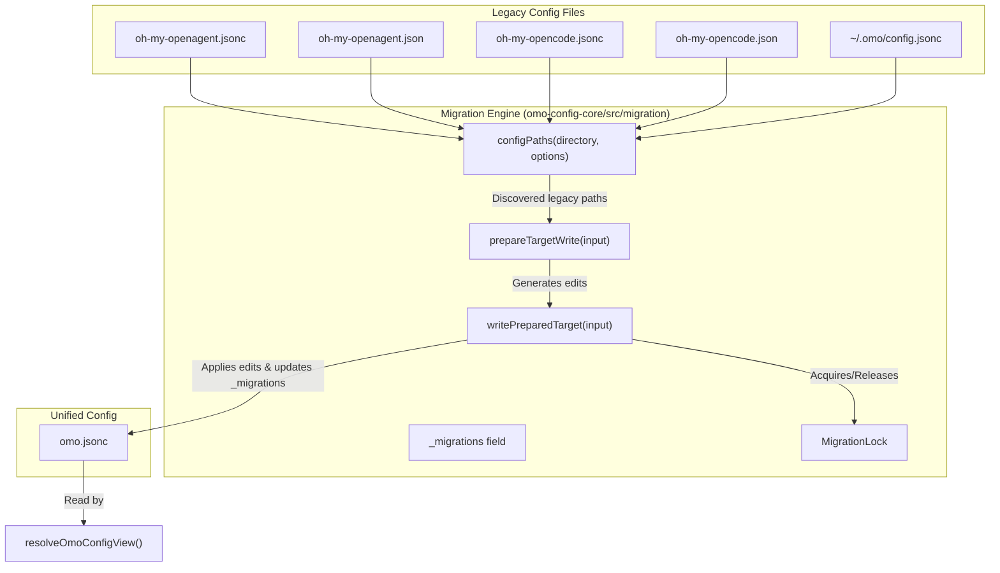
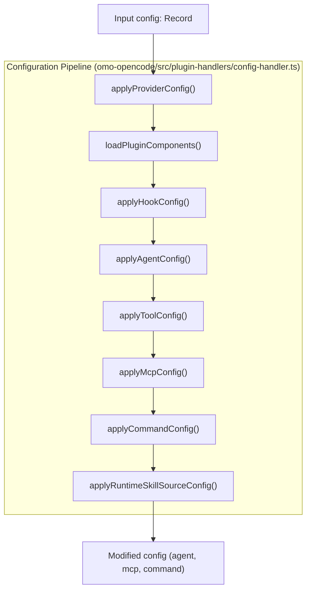
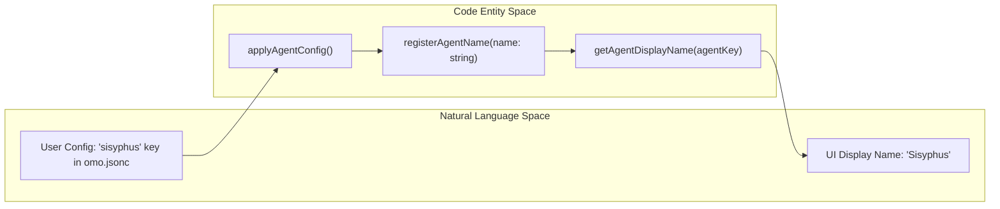

# Configuration Pipeline

Relevant source files

The following files were used as context for generating this wiki page:

- [.omo/evidence/20260810-omo-native-telemetry/task-4.md](https://github.com/code-yeongyu/oh-my-openagent/blob/HEAD/.omo/evidence/20260810-omo-native-telemetry/task-4.md)
- [.omo/evidence/task-17-subagent-session-resume-revival.txt](https://github.com/code-yeongyu/oh-my-openagent/blob/HEAD/.omo/evidence/task-17-subagent-session-resume-revival.txt)
- [.omo/evidence/task-3-senpi-model-chain-overhaul.txt](https://github.com/code-yeongyu/oh-my-openagent/blob/HEAD/.omo/evidence/task-3-senpi-model-chain-overhaul.txt)
- [packages/omo-config-core/package.json](https://github.com/code-yeongyu/oh-my-openagent/blob/HEAD/packages/omo-config-core/package.json)
- [packages/omo-config-core/src/index.ts](https://github.com/code-yeongyu/oh-my-openagent/blob/HEAD/packages/omo-config-core/src/index.ts)
- [packages/omo-config-core/src/internal/index.ts](https://github.com/code-yeongyu/oh-my-openagent/blob/HEAD/packages/omo-config-core/src/internal/index.ts)
- [packages/omo-config-core/src/internal/jsonc-parse.ts](https://github.com/code-yeongyu/oh-my-openagent/blob/HEAD/packages/omo-config-core/src/internal/jsonc-parse.ts)
- [packages/omo-config-core/src/internal/plain-object.ts](https://github.com/code-yeongyu/oh-my-openagent/blob/HEAD/packages/omo-config-core/src/internal/plain-object.ts)
- [packages/omo-config-core/src/internal/posix-path.ts](https://github.com/code-yeongyu/oh-my-openagent/blob/HEAD/packages/omo-config-core/src/internal/posix-path.ts)
- [packages/omo-config-core/src/loader/harness-fold.test.ts](https://github.com/code-yeongyu/oh-my-openagent/blob/HEAD/packages/omo-config-core/src/loader/harness-fold.test.ts)
- [packages/omo-config-core/src/loader/index.ts](https://github.com/code-yeongyu/oh-my-openagent/blob/HEAD/packages/omo-config-core/src/loader/index.ts)
- [packages/omo-config-core/src/loader/legacy-user-config-purge.test.ts](https://github.com/code-yeongyu/oh-my-openagent/blob/HEAD/packages/omo-config-core/src/loader/legacy-user-config-purge.test.ts)
- [packages/omo-config-core/src/loader/loader-resolution.test.ts](https://github.com/code-yeongyu/oh-my-openagent/blob/HEAD/packages/omo-config-core/src/loader/loader-resolution.test.ts)
- [packages/omo-config-core/src/loader/loader.test.ts](https://github.com/code-yeongyu/oh-my-openagent/blob/HEAD/packages/omo-config-core/src/loader/loader.test.ts)
- [packages/omo-config-core/src/loader/loader.ts](https://github.com/code-yeongyu/oh-my-openagent/blob/HEAD/packages/omo-config-core/src/loader/loader.ts)
- [packages/omo-config-core/src/loader/merge.ts](https://github.com/code-yeongyu/oh-my-openagent/blob/HEAD/packages/omo-config-core/src/loader/merge.ts)
- [packages/omo-config-core/src/loader/paths.test.ts](https://github.com/code-yeongyu/oh-my-openagent/blob/HEAD/packages/omo-config-core/src/loader/paths.test.ts)
- [packages/omo-config-core/src/loader/paths.ts](https://github.com/code-yeongyu/oh-my-openagent/blob/HEAD/packages/omo-config-core/src/loader/paths.ts)
- [packages/omo-config-core/src/loader/project-config-path-discovery.test.ts](https://github.com/code-yeongyu/oh-my-openagent/blob/HEAD/packages/omo-config-core/src/loader/project-config-path-discovery.test.ts)
- [packages/omo-config-core/src/loader/resolution.test.ts](https://github.com/code-yeongyu/oh-my-openagent/blob/HEAD/packages/omo-config-core/src/loader/resolution.test.ts)
- [packages/omo-config-core/src/loader/resolution.ts](https://github.com/code-yeongyu/oh-my-openagent/blob/HEAD/packages/omo-config-core/src/loader/resolution.ts)
- [packages/omo-config-core/src/loader/telemetry-resolution.test.ts](https://github.com/code-yeongyu/oh-my-openagent/blob/HEAD/packages/omo-config-core/src/loader/telemetry-resolution.test.ts)
- [packages/omo-config-core/src/loader/top-level-senpi-config-characterization.test.ts](https://github.com/code-yeongyu/oh-my-openagent/blob/HEAD/packages/omo-config-core/src/loader/top-level-senpi-config-characterization.test.ts)
- [packages/omo-config-core/src/loader/types.ts](https://github.com/code-yeongyu/oh-my-openagent/blob/HEAD/packages/omo-config-core/src/loader/types.ts)
- [packages/omo-config-core/src/migration/backup-move.ts](https://github.com/code-yeongyu/oh-my-openagent/blob/HEAD/packages/omo-config-core/src/migration/backup-move.ts)
- [packages/omo-config-core/src/migration/batch.test.ts](https://github.com/code-yeongyu/oh-my-openagent/blob/HEAD/packages/omo-config-core/src/migration/batch.test.ts)
- [packages/omo-config-core/src/migration/batch.ts](https://github.com/code-yeongyu/oh-my-openagent/blob/HEAD/packages/omo-config-core/src/migration/batch.ts)
- [packages/omo-config-core/src/migration/commit.ts](https://github.com/code-yeongyu/oh-my-openagent/blob/HEAD/packages/omo-config-core/src/migration/commit.ts)
- [packages/omo-config-core/src/migration/engine.ts](https://github.com/code-yeongyu/oh-my-openagent/blob/HEAD/packages/omo-config-core/src/migration/engine.ts)
- [packages/omo-config-core/src/migration/journal.ts](https://github.com/code-yeongyu/oh-my-openagent/blob/HEAD/packages/omo-config-core/src/migration/journal.ts)
- [packages/omo-config-core/src/migration/lock.test.ts](https://github.com/code-yeongyu/oh-my-openagent/blob/HEAD/packages/omo-config-core/src/migration/lock.test.ts)
- [packages/omo-config-core/src/migration/lock.ts](https://github.com/code-yeongyu/oh-my-openagent/blob/HEAD/packages/omo-config-core/src/migration/lock.ts)
- [packages/omo-config-core/src/migration/merge-commit.test.ts](https://github.com/code-yeongyu/oh-my-openagent/blob/HEAD/packages/omo-config-core/src/migration/merge-commit.test.ts)
- [packages/omo-config-core/src/migration/merge.ts](https://github.com/code-yeongyu/oh-my-openagent/blob/HEAD/packages/omo-config-core/src/migration/merge.ts)
- [packages/omo-config-core/src/migration/migration-test-support.ts](https://github.com/code-yeongyu/oh-my-openagent/blob/HEAD/packages/omo-config-core/src/migration/migration-test-support.ts)
- [packages/omo-config-core/src/migration/predicate.test.ts](https://github.com/code-yeongyu/oh-my-openagent/blob/HEAD/packages/omo-config-core/src/migration/predicate.test.ts)
- [packages/omo-config-core/src/migration/predicate.ts](https://github.com/code-yeongyu/oh-my-openagent/blob/HEAD/packages/omo-config-core/src/migration/predicate.ts)
- [packages/omo-config-core/src/migration/recovery.test.ts](https://github.com/code-yeongyu/oh-my-openagent/blob/HEAD/packages/omo-config-core/src/migration/recovery.test.ts)
- [packages/omo-config-core/src/migration/recovery.ts](https://github.com/code-yeongyu/oh-my-openagent/blob/HEAD/packages/omo-config-core/src/migration/recovery.ts)
- [packages/omo-config-core/src/migration/transaction.test.ts](https://github.com/code-yeongyu/oh-my-openagent/blob/HEAD/packages/omo-config-core/src/migration/transaction.test.ts)
- [packages/omo-config-core/src/migration/types.ts](https://github.com/code-yeongyu/oh-my-openagent/blob/HEAD/packages/omo-config-core/src/migration/types.ts)
- [packages/omo-config-core/src/models/index.ts](https://github.com/code-yeongyu/oh-my-openagent/blob/HEAD/packages/omo-config-core/src/models/index.ts)
- [packages/omo-config-core/src/models/model-catalog-cycles.ts](https://github.com/code-yeongyu/oh-my-openagent/blob/HEAD/packages/omo-config-core/src/models/model-catalog-cycles.ts)
- [packages/omo-config-core/src/models/model-reference-resolution.test.ts](https://github.com/code-yeongyu/oh-my-openagent/blob/HEAD/packages/omo-config-core/src/models/model-reference-resolution.test.ts)
- [packages/omo-config-core/src/models/model-reference-resolution.ts](https://github.com/code-yeongyu/oh-my-openagent/blob/HEAD/packages/omo-config-core/src/models/model-reference-resolution.ts)
- [packages/omo-config-core/src/schema/agent-schema.test.ts](https://github.com/code-yeongyu/oh-my-openagent/blob/HEAD/packages/omo-config-core/src/schema/agent-schema.test.ts)
- [packages/omo-config-core/src/schema/agent.ts](https://github.com/code-yeongyu/oh-my-openagent/blob/HEAD/packages/omo-config-core/src/schema/agent.ts)
- [packages/omo-config-core/src/schema/category.test.ts](https://github.com/code-yeongyu/oh-my-openagent/blob/HEAD/packages/omo-config-core/src/schema/category.test.ts)
- [packages/omo-config-core/src/schema/category.ts](https://github.com/code-yeongyu/oh-my-openagent/blob/HEAD/packages/omo-config-core/src/schema/category.ts)
- [packages/omo-config-core/src/schema/codegraph.ts](https://github.com/code-yeongyu/oh-my-openagent/blob/HEAD/packages/omo-config-core/src/schema/codegraph.ts)
- [packages/omo-config-core/src/schema/config-schema.test.ts](https://github.com/code-yeongyu/oh-my-openagent/blob/HEAD/packages/omo-config-core/src/schema/config-schema.test.ts)
- [packages/omo-config-core/src/schema/config.ts](https://github.com/code-yeongyu/oh-my-openagent/blob/HEAD/packages/omo-config-core/src/schema/config.ts)
- [packages/omo-config-core/src/schema/fallback-models.ts](https://github.com/code-yeongyu/oh-my-openagent/blob/HEAD/packages/omo-config-core/src/schema/fallback-models.ts)
- [packages/omo-config-core/src/schema/harness.ts](https://github.com/code-yeongyu/oh-my-openagent/blob/HEAD/packages/omo-config-core/src/schema/harness.ts)
- [packages/omo-config-core/src/schema/index.ts](https://github.com/code-yeongyu/oh-my-openagent/blob/HEAD/packages/omo-config-core/src/schema/index.ts)
- [packages/omo-config-core/src/schema/model-ref.ts](https://github.com/code-yeongyu/oh-my-openagent/blob/HEAD/packages/omo-config-core/src/schema/model-ref.ts)
- [packages/omo-config-core/src/schema/reasoning-vocabulary.ts](https://github.com/code-yeongyu/oh-my-openagent/blob/HEAD/packages/omo-config-core/src/schema/reasoning-vocabulary.ts)
- [packages/omo-config-core/src/schema/task.test.ts](https://github.com/code-yeongyu/oh-my-openagent/blob/HEAD/packages/omo-config-core/src/schema/task.test.ts)
- [packages/omo-config-core/src/schema/task.ts](https://github.com/code-yeongyu/oh-my-openagent/blob/HEAD/packages/omo-config-core/src/schema/task.ts)
- [packages/omo-config-core/src/schema/team.ts](https://github.com/code-yeongyu/oh-my-openagent/blob/HEAD/packages/omo-config-core/src/schema/team.ts)
- [packages/omo-config-core/src/schema/telemetry.test.ts](https://github.com/code-yeongyu/oh-my-openagent/blob/HEAD/packages/omo-config-core/src/schema/telemetry.test.ts)
- [packages/omo-config-core/src/schema/telemetry.ts](https://github.com/code-yeongyu/oh-my-openagent/blob/HEAD/packages/omo-config-core/src/schema/telemetry.ts)
- [packages/omo-config-core/src/writer/types.ts](https://github.com/code-yeongyu/oh-my-openagent/blob/HEAD/packages/omo-config-core/src/writer/types.ts)
- [packages/omo-config-core/src/writer/writer-security.test.ts](https://github.com/code-yeongyu/oh-my-openagent/blob/HEAD/packages/omo-config-core/src/writer/writer-security.test.ts)
- [packages/omo-config-core/src/writer/writer.test.ts](https://github.com/code-yeongyu/oh-my-openagent/blob/HEAD/packages/omo-config-core/src/writer/writer.test.ts)
- [packages/omo-config-core/src/writer/writer.ts](https://github.com/code-yeongyu/oh-my-openagent/blob/HEAD/packages/omo-config-core/src/writer/writer.ts)
- [packages/omo-opencode/src/config-migration/2026-08-reasoning-unification/fixture-expected.json](https://github.com/code-yeongyu/oh-my-openagent/blob/HEAD/packages/omo-opencode/src/config-migration/2026-08-reasoning-unification/fixture-expected.json)
- [packages/omo-opencode/src/config-migration/2026-08-reasoning-unification/fixture-input.json](https://github.com/code-yeongyu/oh-my-openagent/blob/HEAD/packages/omo-opencode/src/config-migration/2026-08-reasoning-unification/fixture-input.json)
- [packages/omo-opencode/src/config-migration/discovery-paths.ts](https://github.com/code-yeongyu/oh-my-openagent/blob/HEAD/packages/omo-opencode/src/config-migration/discovery-paths.ts)
- [packages/omo-opencode/src/config-migration/discovery-roots.ts](https://github.com/code-yeongyu/oh-my-openagent/blob/HEAD/packages/omo-opencode/src/config-migration/discovery-roots.ts)
- [packages/omo-opencode/src/config-migration/discovery-windows-host.test.ts](https://github.com/code-yeongyu/oh-my-openagent/blob/HEAD/packages/omo-opencode/src/config-migration/discovery-windows-host.test.ts)
- [packages/omo-opencode/src/config-migration/discovery.test.ts](https://github.com/code-yeongyu/oh-my-openagent/blob/HEAD/packages/omo-opencode/src/config-migration/discovery.test.ts)
- [packages/omo-opencode/src/config-migration/discovery.ts](https://github.com/code-yeongyu/oh-my-openagent/blob/HEAD/packages/omo-opencode/src/config-migration/discovery.ts)
- [packages/omo-opencode/src/config-migration/types.ts](https://github.com/code-yeongyu/oh-my-openagent/blob/HEAD/packages/omo-opencode/src/config-migration/types.ts)
- [packages/omo-opencode/src/startup-migration.test.ts](https://github.com/code-yeongyu/oh-my-openagent/blob/HEAD/packages/omo-opencode/src/startup-migration.test.ts)
- [packages/omo-senpi/src/components/config-resolution/index.test.ts](https://github.com/code-yeongyu/oh-my-openagent/blob/HEAD/packages/omo-senpi/src/components/config-resolution/index.test.ts)
- [packages/omo-senpi/src/components/config-resolution/index.ts](https://github.com/code-yeongyu/oh-my-openagent/blob/HEAD/packages/omo-senpi/src/components/config-resolution/index.ts)
- [packages/omo-senpi/src/components/config-startup/index.test.ts](https://github.com/code-yeongyu/oh-my-openagent/blob/HEAD/packages/omo-senpi/src/components/config-startup/index.test.ts)
- [packages/omo-senpi/src/components/config-startup/index.ts](https://github.com/code-yeongyu/oh-my-openagent/blob/HEAD/packages/omo-senpi/src/components/config-startup/index.ts)
- [packages/senpi-task/scripts/manual-routing-policy-qa.ts](https://github.com/code-yeongyu/oh-my-openagent/blob/HEAD/packages/senpi-task/scripts/manual-routing-policy-qa.ts)
- [packages/senpi-task/src/config/settings.test.ts](https://github.com/code-yeongyu/oh-my-openagent/blob/HEAD/packages/senpi-task/src/config/settings.test.ts)
- [packages/senpi-task/src/lifecycle/batch-admission.test.ts](https://github.com/code-yeongyu/oh-my-openagent/blob/HEAD/packages/senpi-task/src/lifecycle/batch-admission.test.ts)
- [packages/senpi-task/src/manager/residency-unlimited.test.ts](https://github.com/code-yeongyu/oh-my-openagent/blob/HEAD/packages/senpi-task/src/manager/residency-unlimited.test.ts)
- [packages/team-core/src/config.ts](https://github.com/code-yeongyu/oh-my-openagent/blob/HEAD/packages/team-core/src/config.ts)
- [packages/utils/package.json](https://github.com/code-yeongyu/oh-my-openagent/blob/HEAD/packages/utils/package.json)
- [packages/utils/src/skill-path-resolver.ts](https://github.com/code-yeongyu/oh-my-openagent/blob/HEAD/packages/utils/src/skill-path-resolver.ts)
- [tests/omo-config-category-drift.test.ts](https://github.com/code-yeongyu/oh-my-openagent/blob/HEAD/tests/omo-config-category-drift.test.ts)

This document details the comprehensive configuration pipeline in OhMyOpenAgent. It explains how multiple configuration sources are loaded, merged, and processed through ordered stages—yielding final runtime settings for agents, tools, providers, MCP servers, commands, and runtime skill adaptation. Additionally, it covers the unified `omo.jsonc` system, the 4-layer resolution model, and the lock+journal migration engine for legacy files.

## Configuration Sources and Loading

Config files are gathered from multiple hierarchical sources, loaded, and merged to produce a unified configuration object.

- **Source Locations**: Configuration is loaded primarily from user-global config paths (`~/.omo/omo.jsonc`) and a directory-walking search of project-scoped `.omo` folders containing `omo.jsonc` or `omo.json` files [packages/omo-config-core/src/loader/paths.ts:27-41](https://github.com/code-yeongyu/oh-my-openagent/blob/HEAD/packages/omo-config-core/src/loader/paths.ts#L27-L41). The user configuration directory is resolved using `resolveUserOmoConfigDirectory` [packages/omo-config-core/src/loader/paths.ts:31](https://github.com/code-yeongyu/oh-my-openagent/blob/HEAD/packages/omo-config-core/src/loader/paths.ts#L31). Project configuration paths are found using `findProjectConfigPathsFarthestFirst` [packages/omo-config-core/src/loader/paths.ts:75-102](https://github.com/code-yeongyu/oh-my-openagent/blob/HEAD/packages/omo-config-core/src/loader/paths.ts#L75-L102).
- **Merging Order**: Layers are merged farthest-to-nearest with user config as the lowest priority and the nearest project config as the highest priority [packages/omo-config-core/src/loader/paths.ts:75-102](https://github.com/code-yeongyu/oh-my-openagent/blob/HEAD/packages/omo-config-core/src/loader/paths.ts#L75-L102). Deep merges happen on keyed objects such as `categories`, `agents`, and `teams` to preserve incremental overrides [packages/omo-config-core/src/loader/loader.test.ts:28-89](https://github.com/code-yeongyu/oh-my-openagent/blob/HEAD/packages/omo-config-core/src/loader/loader.test.ts#L28-L89).
- **File Formats**: Supports JSON or JSONC (JSON with comments) [packages/omo-config-core/src/loader/loader.ts:22-36](https://github.com/code-yeongyu/oh-my-openagent/blob/HEAD/packages/omo-config-core/src/loader/loader.ts#L22-L36).
- **Symlinks**: Symlinked project `.omo` directories or config files are skipped for security [packages/omo-config-core/src/loader/paths.ts:43-64](https://github.com/code-yeongyu/oh-my-openagent/blob/HEAD/packages/omo-config-core/src/loader/paths.ts#L43-L64). The `isSymlinkedProjectPath` function checks for symlinks [packages/omo-config-core/src/loader/paths.ts:43-51](https://github.com/code-yeongyu/oh-my-openagent/blob/HEAD/packages/omo-config-core/src/loader/paths.ts#L43-L51).

This loading and merging mechanism is implemented centrally in the independent `@oh-my-opencode/omo-config-core` package [packages/omo-config-core/src/loader/loader.ts:133-183](https://github.com/code-yeongyu/oh-my-openagent/blob/HEAD/packages/omo-config-core/src/loader/loader.ts#L133-L183).

Sources:
- [packages/omo-config-core/src/loader/paths.ts:27-102](https://github.com/code-yeongyu/oh-my-openagent/blob/HEAD/packages/omo-config-core/src/loader/paths.ts#L27-L102)
- [packages/omo-config-core/src/loader/loader.ts:22-183](https://github.com/code-yeongyu/oh-my-openagent/blob/HEAD/packages/omo-config-core/src/loader/loader.ts#L22-L183)
- [packages/omo-config-core/src/loader/loader.test.ts:28-89](https://github.com/code-yeongyu/oh-my-openagent/blob/HEAD/packages/omo-config-core/src/loader/loader.test.ts#L28-L89)

## Unified `omo.jsonc` Configuration System

The `omo.jsonc` file serves as the single harness-spanning configuration surface. The configuration supports JSONC format, allowing comments and trailing commas. All schema objects are strict, meaning unknown keys are rejected and reported as diagnostics [packages/omo-config-core/src/schema/config.ts:18-59](https://github.com/code-yeongyu/oh-my-openagent/blob/HEAD/packages/omo-config-core/src/schema/config.ts#L18-L59).

### 4-Layer Resolution Model

After the file layers are merged, each harness resolves its specific view from the unified `omo.jsonc` document. This resolution follows a strict 4-layer precedence, where later layers override earlier ones:

1.  **Shared base keys**: All top-level keys in `omo.jsonc` except `profiles` and the bracketed harness blocks (`[opencode]`, `[senpi]`, `[codex]`).
2.  **`[harness]` block**: The block specific to the current harness (e.g., `[opencode]`, `[senpi]`, `[codex]`) [packages/omo-config-core/src/schema/config.ts:38-40](https://github.com/code-yeongyu/oh-my-openagent/blob/HEAD/packages/omo-config-core/src/schema/config.ts#L38-L40).
3.  **`profiles.<name>`**: The configuration for the active profile, specified by environment variables [packages/omo-config-core/src/schema/config.ts:29-41](https://github.com/code-yeongyu/oh-my-openagent/blob/HEAD/packages/omo-config-core/src/schema/config.ts#L29-L41).
4.  **`profiles.<name>.[harness]`**: The harness-specific overrides within the active profile.

Control keys (`profiles`, `[opencode]`, etc.) are stripped from the final resolved configuration object by `stripResolutionControlKeys` [packages/omo-config-core/src/loader/loader.ts:46-55](https://github.com/code-yeongyu/oh-my-openagent/blob/HEAD/packages/omo-config-core/src/loader/loader.ts#L46-L55).

Sources:
- [packages/omo-config-core/src/loader/resolution.ts](https://github.com/code-yeongyu/oh-my-openagent/blob/HEAD/packages/omo-config-core/src/loader/resolution.ts)
- [packages/omo-config-core/src/loader/loader.ts:46-55](https://github.com/code-yeongyu/oh-my-openagent/blob/HEAD/packages/omo-config-core/src/loader/loader.ts#L46-L55)
- [packages/omo-config-core/src/schema/config.ts:18-59](https://github.com/code-yeongyu/oh-my-openagent/blob/HEAD/packages/omo-config-core/src/schema/config.ts#L18-L59)

### Profile Activation

The active profile name is determined by `resolveOmoProfileName` [packages/omo-config-core/src/loader/resolution.ts:10-20](https://github.com/code-yeongyu/oh-my-openagent/blob/HEAD/packages/omo-config-core/src/loader/resolution.ts#L10-L20), which checks the following in order:
1.  `OMO_PROFILE` environment variable.
2.  `OCX_PROFILE` environment variable.
3.  `OPENCODE_CONFIG_DIR` if its lexical tail matches a profile pattern.

Sources:
- [packages/omo-config-core/src/loader/resolution.ts](https://github.com/code-yeongyu/oh-my-openagent/blob/HEAD/packages/omo-config-core/src/loader/resolution.ts)
- [packages/omo-config-core/src/loader/loader.ts:156-159](https://github.com/code-yeongyu/oh-my-openagent/blob/HEAD/packages/omo-config-core/src/loader/loader.ts#L156-L159)

### Shared Models Catalog

The `models` top-level key defines a shared catalog of model entries [packages/omo-config-core/src/schema/config.ts:50](https://github.com/code-yeongyu/oh-my-openagent/blob/HEAD/packages/omo-config-core/src/schema/config.ts#L50). Each entry specifies a `model` identifier and optional parameters like `reasoning`, `temperature`, and `max_tokens` [packages/omo-config-core/src/schema/model-catalog.ts:10-17](https://github.com/code-yeongyu/oh-my-openagent/blob/HEAD/packages/omo-config-core/src/schema/model-catalog.ts#L10-L17). These can be referenced by agents and categories to centralize model tuning.

Sources:
- [packages/omo-config-core/src/schema/config.ts:50](https://github.com/code-yeongyu/oh-my-openagent/blob/HEAD/packages/omo-config-core/src/schema/config.ts#L50)
- [packages/omo-config-core/src/schema/model-catalog.ts:10-17](https://github.com/code-yeongyu/oh-my-openagent/blob/HEAD/packages/omo-config-core/src/schema/model-catalog.ts#L10-L17)

## Lock + Journal Migration Engine

The system includes a migration engine to handle legacy configuration files (`oh-my-openagent.json[c]`, `oh-my-opencode.json[c]`).

- **Discovery**: `configPaths` identifies legacy files in a given directory [packages/omo-opencode/src/config-migration/discovery-paths.ts:55-59](https://github.com/code-yeongyu/oh-my-openagent/blob/HEAD/packages/omo-opencode/src/config-migration/discovery-paths.ts#L55-L59). The `CONFIG_FILE_NAMES` constant lists the legacy file names [packages/omo-opencode/src/config-migration/discovery-paths.ts:9-14](https://github.com/code-yeongyu/oh-my-openagent/blob/HEAD/packages/omo-opencode/src/config-migration/discovery-paths.ts#L9-L14).
- **Journaling**: Applied migrations are recorded in the `_migrations` field of `omo.jsonc` to prevent re-application [packages/omo-config-core/src/migration/commit.ts:26-33](https://github.com/code-yeongyu/oh-my-openagent/blob/HEAD/packages/omo-config-core/src/migration/commit.ts#L26-L33). The `markerValue` function manages this field [packages/omo-config-core/src/migration/commit.ts:26-33](https://github.com/code-yeongyu/oh-my-openagent/blob/HEAD/packages/omo-config-core/src/migration/commit.ts#L26-L33).
- **Locking**: Ensures atomic migration execution to prevent race conditions during concurrent harness startups [packages/omo-config-core/src/migration/lock.ts:1-10](https://github.com/code-yeongyu/oh-my-openagent/blob/HEAD/packages/omo-config-core/src/migration/lock.ts#L1-L10). The `MigrationLock` class handles this [packages/omo-config-core/src/migration/lock.ts:1-10](https://github.com/code-yeongyu/oh-my-openagent/blob/HEAD/packages/omo-config-core/src/migration/lock.ts#L1-L10).

The `runSenpiStartupMigration` function in the Senpi adapter runs this engine before the harness initializes its config view [packages/omo-senpi/src/components/config-startup/index.ts:23-24](https://github.com/code-yeongyu/oh-my-openagent/blob/HEAD/packages/omo-senpi/src/components/config-startup/index.ts#L23-L24).

Sources:
- [packages/omo-opencode/src/config-migration/discovery-paths.ts:9-14](https://github.com/code-yeongyu/oh-my-openagent/blob/HEAD/packages/omo-opencode/src/config-migration/discovery-paths.ts#L9-L14)
- [packages/omo-opencode/src/config-migration/discovery-paths.ts:55-59](https://github.com/code-yeongyu/oh-my-openagent/blob/HEAD/packages/omo-opencode/src/config-migration/discovery-paths.ts#L55-L59)
- [packages/omo-config-core/src/migration/commit.ts:26-33](https://github.com/code-yeongyu/oh-my-openagent/blob/HEAD/packages/omo-config-core/src/migration/commit.ts#L26-L33)
- [packages/omo-config-core/src/migration/lock.ts:1-10](https://github.com/code-yeongyu/oh-my-openagent/blob/HEAD/packages/omo-config-core/src/migration/lock.ts#L1-L10)
- [packages/omo-senpi/src/components/config-startup/index.ts:23-24](https://github.com/code-yeongyu/oh-my-openagent/blob/HEAD/packages/omo-senpi/src/components/config-startup/index.ts#L23-L24)

### Migration Engine Data Flow

Sources:
- [packages/omo-opencode/src/config-migration/discovery-paths.ts:9-14](https://github.com/code-yeongyu/oh-my-openagent/blob/HEAD/packages/omo-opencode/src/config-migration/discovery-paths.ts#L9-L14)
- [packages/omo-opencode/src/config-migration/discovery-paths.ts:55-59](https://github.com/code-yeongyu/oh-my-openagent/blob/HEAD/packages/omo-opencode/src/config-migration/discovery-paths.ts#L55-L59)
- [packages/omo-config-core/src/migration/commit.ts:79-128](https://github.com/code-yeongyu/oh-my-openagent/blob/HEAD/packages/omo-config-core/src/migration/commit.ts#L79-L128)
- [packages/omo-config-core/src/loader/resolution.ts](https://github.com/code-yeongyu/oh-my-openagent/blob/HEAD/packages/omo-config-core/src/loader/resolution.ts)
- [packages/omo-config-core/src/migration/lock.ts](https://github.com/code-yeongyu/oh-my-openagent/blob/HEAD/packages/omo-config-core/src/migration/lock.ts)

## Core Configuration Pipeline

The pipeline is realized in the `createConfigHandler` function, applying transforms in a strict phase order [packages/omo-opencode/src/plugin-handlers/config-handler.ts:90-160](https://github.com/code-yeongyu/oh-my-openagent/blob/HEAD/packages/omo-opencode/src/plugin-handlers/config-handler.ts#L90-L160).

Sources:
- [packages/omo-opencode/src/plugin-handlers/config-handler.ts:90-160](https://github.com/code-yeongyu/oh-my-openagent/blob/HEAD/packages/omo-opencode/src/plugin-handlers/config-handler.ts#L90-L160)

### Key Pipeline Phases

1.  **Provider Configuration**: `applyProviderConfig()` applies customizations and resets internal caches (e.g., hashline-edit formatters) [packages/omo-opencode/src/plugin-handlers/config-handler.ts:98-103](https://github.com/code-yeongyu/oh-my-openagent/blob/HEAD/packages/omo-opencode/src/plugin-handlers/config-handler.ts#L98-L103).
2.  **Plugin Components**: `loadPluginComponents()` loads agents, skills, and hooks asynchronously with a timeout [packages/omo-opencode/src/plugin-handlers/plugin-components-loader.ts:27-73](https://github.com/code-yeongyu/oh-my-openagent/blob/HEAD/packages/omo-opencode/src/plugin-handlers/plugin-components-loader.ts#L27-L73).
3.  **Agent Configuration**: `applyAgentConfig()` builds the agent roster. It uses a cache snapshot of the agent config to avoid redundant recomputations [packages/omo-opencode/src/plugin-handlers/config-handler.ts:110-139](https://github.com/code-yeongyu/oh-my-openagent/blob/HEAD/packages/omo-opencode/src/plugin-handlers/config-handler.ts#L110-L139).
4.  **Tool Configuration**: `applyToolConfig()` maps per-agent permissions and availability based on global config and task system status [packages/omo-opencode/src/plugin-handlers/tool-config-handler.ts:1-162](https://github.com/code-yeongyu/oh-my-openagent/blob/HEAD/packages/omo-opencode/src/plugin-handlers/tool-config-handler.ts#L1-L162).

Sources:
- [packages/omo-opencode/src/plugin-handlers/config-handler.ts:98-139](https://github.com/code-yeongyu/oh-my-openagent/blob/HEAD/packages/omo-opencode/src/plugin-handlers/config-handler.ts#L98-L139)
- [packages/omo-opencode/src/plugin-handlers/plugin-components-loader.ts:27-73](https://github.com/code-yeongyu/oh-my-openagent/blob/HEAD/packages/omo-opencode/src/plugin-handlers/plugin-components-loader.ts#L27-L73)
- [packages/omo-opencode/src/plugin-handlers/tool-config-handler.ts:1-162](https://github.com/code-yeongyu/oh-my-openagent/blob/HEAD/packages/omo-opencode/src/plugin-handlers/tool-config-handler.ts#L1-L162)

## Runtime Adaptation and Caching

### Agent Config Snapshot and Side Effects

The pipeline caches the agent config result. The snapshot cache key is a JSON string of the relevant agent config. On cache hits, the config is cloned and side effects (registering names, setting default agents) are replayed to maintain state consistency [packages/omo-opencode/src/plugin-handlers/config-handler.ts:66-88](https://github.com/code-yeongyu/oh-my-openagent/blob/HEAD/packages/omo-opencode/src/plugin-handlers/config-handler.ts#L66-L88).

Sources:
- [packages/omo-opencode/src/plugin-handlers/config-handler.ts:66-88](https://github.com/code-yeongyu/oh-my-openagent/blob/HEAD/packages/omo-opencode/src/plugin-handlers/config-handler.ts#L66-L88)

## Agent Identity Mapping Diagram

Sources:  
- [packages/omo-opencode/src/plugin-handlers/config-handler.ts:110-139](https://github.com/code-yeongyu/oh-my-openagent/blob/HEAD/packages/omo-opencode/src/plugin-handlers/config-handler.ts#L110-L139)  
- [packages/omo-opencode/src/features/claude-code-session-state.ts:14-17](https://github.com/code-yeongyu/oh-my-openagent/blob/HEAD/packages/omo-opencode/src/features/claude-code-session-state.ts#L14-L17)  
- [packages/omo-opencode/src/shared/agent-display-names.ts:6-7](https://github.com/code-yeongyu/oh-my-openagent/blob/HEAD/packages/omo-opencode/src/shared/agent-display-names.ts#L6-L7)

## Configuration Schema Reference Summary

| Property | Type | Description | Schema Source |
| :--- | :--- | :--- | :--- |
| `categories` | Object | Named model/tool profiles | [packages/omo-config-core/src/schema/category.ts:10-17](https://github.com/code-yeongyu/oh-my-openagent/blob/HEAD/packages/omo-config-core/src/schema/category.ts#L10-L17) |
| `agents` | Object | Agent-specific overrides | [packages/omo-config-core/src/schema/agent.ts:10-17](https://github.com/code-yeongyu/oh-my-openagent/blob/HEAD/packages/omo-config-core/src/schema/agent.ts#L10-L17) |
| `task` | Object | Concurrency and residency settings | [packages/omo-config-core/src/schema/task.ts:23-41](https://github.com/code-yeongyu/oh-my-openagent/blob/HEAD/packages/omo-config-core/src/schema/task.ts#L23-L41) |
| `teams` | Object | Multi-agent team definitions | [packages/omo-config-core/src/schema/team.ts:10-17](https://github.com/code-yeongyu/oh-my-openagent/blob/HEAD/packages/omo-config-core/src/schema/team.ts#L10-L17) |

Sources:
- [packages/omo-config-core/src/schema/config.ts:43-59](https://github.com/code-yeongyu/oh-my-openagent/blob/HEAD/packages/omo-config-core/src/schema/config.ts#L43-L59)
- [packages/omo-config-core/src/schema/category.ts:10-17](https://github.com/code-yeongyu/oh-my-openagent/blob/HEAD/packages/omo-config-core/src/schema/category.ts#L10-L17)
- [packages/omo-config-core/src/schema/agent.ts:10-17](https://github.com/code-yeongyu/oh-my-openagent/blob/HEAD/packages/omo-config-core/src/schema/agent.ts#L10-L17)
- [packages/omo-config-core/src/schema/task.ts:23-41](https://github.com/code-yeongyu/oh-my-openagent/blob/HEAD/packages/omo-config-core/src/schema/task.ts#L23-L41)
- [packages/omo-config-core/src/schema/team.ts:10-17](https://github.com/code-yeongyu/oh-my-openagent/blob/HEAD/packages/omo-config-core/src/schema/team.ts#L10-L17)1f