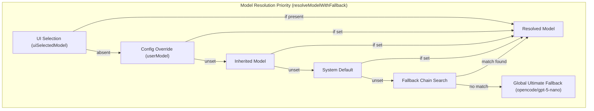
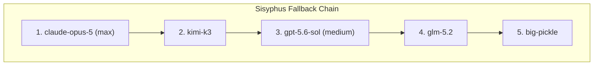
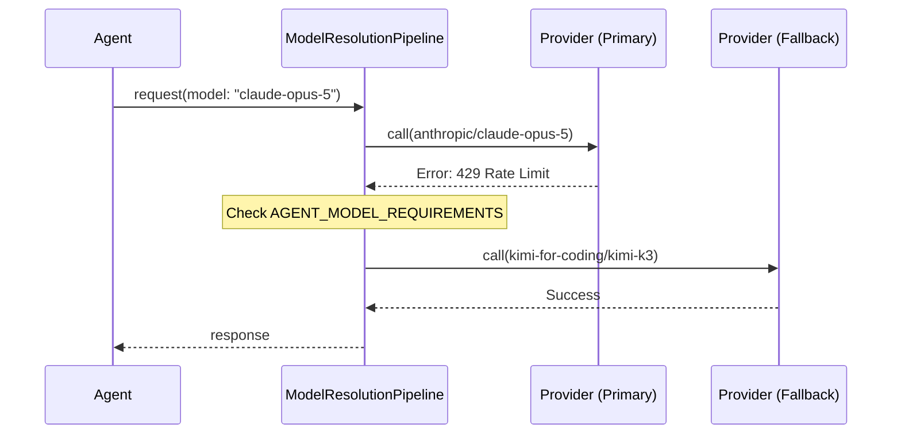
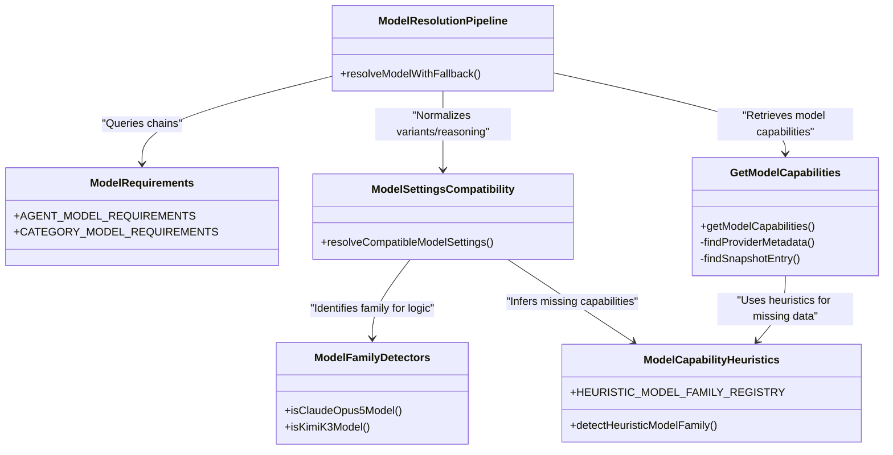

# Model Resolution and Fallback

Relevant source files

The following files were used as context for generating this wiki page:

- [.omo/evidence/20260730-fix-6338-oracle-temperature/SCOPE-CORRECTION-20260804.md](https://github.com/code-yeongyu/oh-my-openagent/blob/HEAD/.omo/evidence/20260730-fix-6338-oracle-temperature/SCOPE-CORRECTION-20260804.md)
- [.omo/evidence/20260730-fix-6338-oracle-temperature/chat-params-driver.ts](https://github.com/code-yeongyu/oh-my-openagent/blob/HEAD/.omo/evidence/20260730-fix-6338-oracle-temperature/chat-params-driver.ts)
- [.omo/evidence/20260730-fix-6338-oracle-temperature/chat-params-integration.txt](https://github.com/code-yeongyu/oh-my-openagent/blob/HEAD/.omo/evidence/20260730-fix-6338-oracle-temperature/chat-params-integration.txt)
- [.omo/evidence/20260730-fix-6338-oracle-temperature/codex-p2-deep-research-20260805.md](https://github.com/code-yeongyu/oh-my-openagent/blob/HEAD/.omo/evidence/20260730-fix-6338-oracle-temperature/codex-p2-deep-research-20260805.md)
- [.omo/evidence/20260730-fix-6338-oracle-temperature/codex-p2-suffix-provider-lookup-20260804.md](https://github.com/code-yeongyu/oh-my-openagent/blob/HEAD/.omo/evidence/20260730-fix-6338-oracle-temperature/codex-p2-suffix-provider-lookup-20260804.md)
- [.omo/evidence/20260730-fix-6338-oracle-temperature/diag-capabilities.ts](https://github.com/code-yeongyu/oh-my-openagent/blob/HEAD/.omo/evidence/20260730-fix-6338-oracle-temperature/diag-capabilities.ts)
- [.omo/evidence/20260730-fix-6338-oracle-temperature/diag-config.sh](https://github.com/code-yeongyu/oh-my-openagent/blob/HEAD/.omo/evidence/20260730-fix-6338-oracle-temperature/diag-config.sh)
- [.omo/evidence/20260730-fix-6338-oracle-temperature/diag-temp-forwarding.sh](https://github.com/code-yeongyu/oh-my-openagent/blob/HEAD/.omo/evidence/20260730-fix-6338-oracle-temperature/diag-temp-forwarding.sh)
- [.omo/evidence/20260730-fix-6338-oracle-temperature/live-request-AFTER.txt](https://github.com/code-yeongyu/oh-my-openagent/blob/HEAD/.omo/evidence/20260730-fix-6338-oracle-temperature/live-request-AFTER.txt)
- [.omo/evidence/20260730-fix-6338-oracle-temperature/live-request-BEFORE.txt](https://github.com/code-yeongyu/oh-my-openagent/blob/HEAD/.omo/evidence/20260730-fix-6338-oracle-temperature/live-request-BEFORE.txt)
- [.omo/evidence/20260730-fix-6338-oracle-temperature/live-request-driver.sh](https://github.com/code-yeongyu/oh-my-openagent/blob/HEAD/.omo/evidence/20260730-fix-6338-oracle-temperature/live-request-driver.sh)
- [.omo/evidence/20260730-fix-6338-oracle-temperature/mock-provider.mjs](https://github.com/code-yeongyu/oh-my-openagent/blob/HEAD/.omo/evidence/20260730-fix-6338-oracle-temperature/mock-provider.mjs)
- [.omo/evidence/20260730-fix-6338-oracle-temperature/qa-summary.md](https://github.com/code-yeongyu/oh-my-openagent/blob/HEAD/.omo/evidence/20260730-fix-6338-oracle-temperature/qa-summary.md)
- [.omo/evidence/20260730-fix-6338-oracle-temperature/review-capabilities-output-20260731.txt](https://github.com/code-yeongyu/oh-my-openagent/blob/HEAD/.omo/evidence/20260730-fix-6338-oracle-temperature/review-capabilities-output-20260731.txt)
- [.omo/evidence/20260730-fix-6338-oracle-temperature/review-rerun-20260731.txt](https://github.com/code-yeongyu/oh-my-openagent/blob/HEAD/.omo/evidence/20260730-fix-6338-oracle-temperature/review-rerun-20260731.txt)
- [.omo/evidence/20260730-fix-6338-oracle-temperature/review-rerun-driver.sh](https://github.com/code-yeongyu/oh-my-openagent/blob/HEAD/.omo/evidence/20260730-fix-6338-oracle-temperature/review-rerun-driver.sh)
- [.omo/evidence/task-1-senpi-model-chain-overhaul.txt](https://github.com/code-yeongyu/oh-my-openagent/blob/HEAD/.omo/evidence/task-1-senpi-model-chain-overhaul.txt)
- [packages/model-core/src/agent-model-requirements.ts](https://github.com/code-yeongyu/oh-my-openagent/blob/HEAD/packages/model-core/src/agent-model-requirements.ts)
- [packages/model-core/src/category-model-requirements.ts](https://github.com/code-yeongyu/oh-my-openagent/blob/HEAD/packages/model-core/src/category-model-requirements.ts)
- [packages/model-core/src/category-routing-policy.test.ts](https://github.com/code-yeongyu/oh-my-openagent/blob/HEAD/packages/model-core/src/category-routing-policy.test.ts)
- [packages/model-core/src/connected-providers-cache.ts](https://github.com/code-yeongyu/oh-my-openagent/blob/HEAD/packages/model-core/src/connected-providers-cache.ts)
- [packages/model-core/src/gpt-5.6-copilot-resolution.test.ts](https://github.com/code-yeongyu/oh-my-openagent/blob/HEAD/packages/model-core/src/gpt-5.6-copilot-resolution.test.ts)
- [packages/model-core/src/model-availability.test.ts](https://github.com/code-yeongyu/oh-my-openagent/blob/HEAD/packages/model-core/src/model-availability.test.ts)
- [packages/model-core/src/model-availability.ts](https://github.com/code-yeongyu/oh-my-openagent/blob/HEAD/packages/model-core/src/model-availability.ts)
- [packages/model-core/src/model-capabilities-bundled-snapshot.test.ts](https://github.com/code-yeongyu/oh-my-openagent/blob/HEAD/packages/model-core/src/model-capabilities-bundled-snapshot.test.ts)
- [packages/model-core/src/model-capabilities-openai-fast-aliases.test.ts](https://github.com/code-yeongyu/oh-my-openagent/blob/HEAD/packages/model-core/src/model-capabilities-openai-fast-aliases.test.ts)
- [packages/model-core/src/model-capabilities-suffixed-provider-lookup.test.ts](https://github.com/code-yeongyu/oh-my-openagent/blob/HEAD/packages/model-core/src/model-capabilities-suffixed-provider-lookup.test.ts)
- [packages/model-core/src/model-capabilities.test.ts](https://github.com/code-yeongyu/oh-my-openagent/blob/HEAD/packages/model-core/src/model-capabilities.test.ts)
- [packages/model-core/src/model-capabilities/bundled-snapshot.ts](https://github.com/code-yeongyu/oh-my-openagent/blob/HEAD/packages/model-core/src/model-capabilities/bundled-snapshot.ts)
- [packages/model-core/src/model-capabilities/get-model-capabilities.ts](https://github.com/code-yeongyu/oh-my-openagent/blob/HEAD/packages/model-core/src/model-capabilities/get-model-capabilities.ts)
- [packages/model-core/src/model-capability-aliases.test.ts](https://github.com/code-yeongyu/oh-my-openagent/blob/HEAD/packages/model-core/src/model-capability-aliases.test.ts)
- [packages/model-core/src/model-capability-aliases.ts](https://github.com/code-yeongyu/oh-my-openagent/blob/HEAD/packages/model-core/src/model-capability-aliases.ts)
- [packages/model-core/src/model-capability-guardrails.test.ts](https://github.com/code-yeongyu/oh-my-openagent/blob/HEAD/packages/model-core/src/model-capability-guardrails.test.ts)
- [packages/model-core/src/model-capability-guardrails.ts](https://github.com/code-yeongyu/oh-my-openagent/blob/HEAD/packages/model-core/src/model-capability-guardrails.ts)
- [packages/model-core/src/model-capability-heuristics.ts](https://github.com/code-yeongyu/oh-my-openagent/blob/HEAD/packages/model-core/src/model-capability-heuristics.ts)
- [packages/model-core/src/model-requirements-agents.test.ts](https://github.com/code-yeongyu/oh-my-openagent/blob/HEAD/packages/model-core/src/model-requirements-agents.test.ts)
- [packages/model-core/src/model-requirements-categories.test.ts](https://github.com/code-yeongyu/oh-my-openagent/blob/HEAD/packages/model-core/src/model-requirements-categories.test.ts)
- [packages/model-core/src/model-resolution-pipeline.test.ts](https://github.com/code-yeongyu/oh-my-openagent/blob/HEAD/packages/model-core/src/model-resolution-pipeline.test.ts)
- [packages/model-core/src/model-resolution-pipeline.ts](https://github.com/code-yeongyu/oh-my-openagent/blob/HEAD/packages/model-core/src/model-resolution-pipeline.ts)
- [packages/model-core/src/model-resolver.test.ts](https://github.com/code-yeongyu/oh-my-openagent/blob/HEAD/packages/model-core/src/model-resolver.test.ts)
- [packages/model-core/src/model-settings-compatibility.test.ts](https://github.com/code-yeongyu/oh-my-openagent/blob/HEAD/packages/model-core/src/model-settings-compatibility.test.ts)
- [packages/model-core/src/provider-model-id-transform.test.ts](https://github.com/code-yeongyu/oh-my-openagent/blob/HEAD/packages/model-core/src/provider-model-id-transform.test.ts)
- [packages/model-core/src/provider-model-id-transform.ts](https://github.com/code-yeongyu/oh-my-openagent/blob/HEAD/packages/model-core/src/provider-model-id-transform.ts)
- [packages/omo-codex/plugin/components/teammode/AGENTS.md](https://github.com/code-yeongyu/oh-my-openagent/blob/HEAD/packages/omo-codex/plugin/components/teammode/AGENTS.md)
- [packages/omo-codex/plugin/components/teammode/test/v2-spawn-schema.test.ts](https://github.com/code-yeongyu/oh-my-openagent/blob/HEAD/packages/omo-codex/plugin/components/teammode/test/v2-spawn-schema.test.ts)
- [packages/omo-opencode/src/agents/gpt-5.6-warm-cache-registration.test.ts](https://github.com/code-yeongyu/oh-my-openagent/blob/HEAD/packages/omo-opencode/src/agents/gpt-5.6-warm-cache-registration.test.ts)
- [packages/omo-opencode/src/agents/utils.test.ts](https://github.com/code-yeongyu/oh-my-openagent/blob/HEAD/packages/omo-opencode/src/agents/utils.test.ts)
- [packages/omo-opencode/src/cli/config-manager/generate-omo-config.test.ts](https://github.com/code-yeongyu/oh-my-openagent/blob/HEAD/packages/omo-opencode/src/cli/config-manager/generate-omo-config.test.ts)
- [packages/omo-opencode/src/cli/doctor/checks/model-resolution.test.ts](https://github.com/code-yeongyu/oh-my-openagent/blob/HEAD/packages/omo-opencode/src/cli/doctor/checks/model-resolution.test.ts)
- [packages/omo-opencode/src/cli/model-fallback-providers.test.ts](https://github.com/code-yeongyu/oh-my-openagent/blob/HEAD/packages/omo-opencode/src/cli/model-fallback-providers.test.ts)
- [packages/omo-opencode/src/cli/model-fallback.test.ts](https://github.com/code-yeongyu/oh-my-openagent/blob/HEAD/packages/omo-opencode/src/cli/model-fallback.test.ts)
- [packages/omo-opencode/src/cli/openai-only-model-catalog.test.ts](https://github.com/code-yeongyu/oh-my-openagent/blob/HEAD/packages/omo-opencode/src/cli/openai-only-model-catalog.test.ts)
- [packages/omo-opencode/src/cli/openai-only-model-catalog.ts](https://github.com/code-yeongyu/oh-my-openagent/blob/HEAD/packages/omo-opencode/src/cli/openai-only-model-catalog.ts)
- [packages/omo-opencode/src/cli/provider-model-id-transform.test.ts](https://github.com/code-yeongyu/oh-my-openagent/blob/HEAD/packages/omo-opencode/src/cli/provider-model-id-transform.test.ts)
- [packages/omo-opencode/src/features/claude-code-agent-loader/opencode-config-agents-reader.test.ts](https://github.com/code-yeongyu/oh-my-openagent/blob/HEAD/packages/omo-opencode/src/features/claude-code-agent-loader/opencode-config-agents-reader.test.ts)
- [packages/omo-opencode/src/generated/model-capabilities.generated.json](https://github.com/code-yeongyu/oh-my-openagent/blob/HEAD/packages/omo-opencode/src/generated/model-capabilities.generated.json)
- [packages/omo-opencode/src/hooks/model-fallback/hook.test.ts](https://github.com/code-yeongyu/oh-my-openagent/blob/HEAD/packages/omo-opencode/src/hooks/model-fallback/hook.test.ts)
- [packages/omo-opencode/src/hooks/no-sisyphus-gpt/hook.ts](https://github.com/code-yeongyu/oh-my-openagent/blob/HEAD/packages/omo-opencode/src/hooks/no-sisyphus-gpt/hook.ts)
- [packages/omo-opencode/src/plugin-handlers/agent-config-finalizer.test.ts](https://github.com/code-yeongyu/oh-my-openagent/blob/HEAD/packages/omo-opencode/src/plugin-handlers/agent-config-finalizer.test.ts)
- [packages/omo-opencode/src/plugin-handlers/agent-config-finalizer.ts](https://github.com/code-yeongyu/oh-my-openagent/blob/HEAD/packages/omo-opencode/src/plugin-handlers/agent-config-finalizer.ts)
- [packages/omo-opencode/src/plugin-handlers/tool-config-handler-display-name.test.ts](https://github.com/code-yeongyu/oh-my-openagent/blob/HEAD/packages/omo-opencode/src/plugin-handlers/tool-config-handler-display-name.test.ts)
- [packages/omo-opencode/src/plugin-handlers/tool-config-handler.test.ts](https://github.com/code-yeongyu/oh-my-openagent/blob/HEAD/packages/omo-opencode/src/plugin-handlers/tool-config-handler.test.ts)
- [packages/omo-opencode/src/plugin-handlers/tool-config-handler.ts](https://github.com/code-yeongyu/oh-my-openagent/blob/HEAD/packages/omo-opencode/src/plugin-handlers/tool-config-handler.ts)
- [packages/omo-opencode/src/plugin-interface.test.ts](https://github.com/code-yeongyu/oh-my-openagent/blob/HEAD/packages/omo-opencode/src/plugin-interface.test.ts)
- [packages/omo-opencode/src/plugin-interface.ts](https://github.com/code-yeongyu/oh-my-openagent/blob/HEAD/packages/omo-opencode/src/plugin-interface.ts)
- [packages/omo-opencode/src/plugin/event.model-fallback.test.ts](https://github.com/code-yeongyu/oh-my-openagent/blob/HEAD/packages/omo-opencode/src/plugin/event.model-fallback.test.ts)
- [packages/omo-opencode/src/plugin/event.test.ts](https://github.com/code-yeongyu/oh-my-openagent/blob/HEAD/packages/omo-opencode/src/plugin/event.test.ts)
- [packages/senpi-task/scripts/manual-category-qa.ts](https://github.com/code-yeongyu/oh-my-openagent/blob/HEAD/packages/senpi-task/scripts/manual-category-qa.ts)
- [packages/senpi-task/src/agents/builtin/fallback-chains.test.ts](https://github.com/code-yeongyu/oh-my-openagent/blob/HEAD/packages/senpi-task/src/agents/builtin/fallback-chains.test.ts)
- [packages/senpi-task/src/agents/builtin/fallback-chains.ts](https://github.com/code-yeongyu/oh-my-openagent/blob/HEAD/packages/senpi-task/src/agents/builtin/fallback-chains.ts)
- [packages/senpi-task/src/category/__snapshots__/resolve-category.test.ts.snap](https://github.com/code-yeongyu/oh-my-openagent/blob/HEAD/packages/senpi-task/src/category/__snapshots__/resolve-category.test.ts.snap)
- [packages/senpi-task/src/category/anthropic-categories.test.ts](https://github.com/code-yeongyu/oh-my-openagent/blob/HEAD/packages/senpi-task/src/category/anthropic-categories.test.ts)
- [packages/senpi-task/src/category/anthropic-categories.ts](https://github.com/code-yeongyu/oh-my-openagent/blob/HEAD/packages/senpi-task/src/category/anthropic-categories.ts)
- [packages/senpi-task/src/category/category-routing-policy.test.ts](https://github.com/code-yeongyu/oh-my-openagent/blob/HEAD/packages/senpi-task/src/category/category-routing-policy.test.ts)
- [packages/senpi-task/src/category/fallback-chains.ts](https://github.com/code-yeongyu/oh-my-openagent/blob/HEAD/packages/senpi-task/src/category/fallback-chains.ts)
- [packages/senpi-task/src/category/google-categories.ts](https://github.com/code-yeongyu/oh-my-openagent/blob/HEAD/packages/senpi-task/src/category/google-categories.ts)
- [packages/senpi-task/src/category/openai-categories.ts](https://github.com/code-yeongyu/oh-my-openagent/blob/HEAD/packages/senpi-task/src/category/openai-categories.ts)
- [packages/senpi-task/src/category/resolve-category-boundary.test.ts](https://github.com/code-yeongyu/oh-my-openagent/blob/HEAD/packages/senpi-task/src/category/resolve-category-boundary.test.ts)
- [packages/utils/src/prompt-async-gate/pending-tool-turn.test.ts](https://github.com/code-yeongyu/oh-my-openagent/blob/HEAD/packages/utils/src/prompt-async-gate/pending-tool-turn.test.ts)
- [packages/utils/src/prompt-async-gate/pending-tool-turn.ts](https://github.com/code-yeongyu/oh-my-openagent/blob/HEAD/packages/utils/src/prompt-async-gate/pending-tool-turn.ts)
- [packages/utils/src/prompt-async-gate/prompt-message-state.ts](https://github.com/code-yeongyu/oh-my-openagent/blob/HEAD/packages/utils/src/prompt-async-gate/prompt-message-state.ts)

This document expands on the technical details of OhMyOpenCode's model resolution and fallback system, which orchestrates model selection for agents and categories across diverse AI service providers. It emphasizes the 5-tier priority resolution strategy, fallback chains, fuzzy model matching, and the new unified reasoning field with `:level` suffix support.

---

## Purpose and Scope

The Model Resolution and Fallback system exists to provide:

- Consistent, prioritized model selection for agents and categories based on available providers.
- Automated fallback chains to switch models smoothly when errors or rate-limits occur.
- Fuzzy matching of requested models against provider-available variants for flexibility.
- Runtime error handling hooks to perform automatic retries and model fallback on recoverable failures.
- Unified reasoning effort control through a standardized field and syntax.

---

## 1. Five-Tier Model Resolution Priority System

Model assignment respects a hierarchy of configuration sources to determine which model an agent uses, ensuring the most appropriate and available model is selected:

1.  **UI Selection (Highest Priority)**: The model explicitly selected via the user interface or CLI input (`uiSelectedModel`). This takes precedence over all other settings.
2.  **User Config Override**: User configuration files (`omo.jsonc`) or overrides specify explicit models for agents.
3.  **Inherited Model**: A model passed down from a parent session or context, preserving continuity across related tasks.
4.  **System Default**: The predefined default model associated with an agent or category in the system configuration.
5.  **Ultimate Fallback (Global)**: A universal fallback model (typically `opencode/gpt-5-nano`) ensuring the system can always resolve a usable model if all else fails.

### Data Flow: Model Resolution Logic

The function `resolveModelWithFallback` implements this priority order. It queries each priority tier in sequence until a model is resolved:

Sources: [packages/model-core/src/model-resolution-pipeline.ts:10-70](https://github.com/code-yeongyu/oh-my-openagent/blob/HEAD/packages/model-core/src/model-resolution-pipeline.ts#L10-L70), [packages/model-core/src/model-resolver.test.ts:19-64](https://github.com/code-yeongyu/oh-my-openagent/blob/HEAD/packages/model-core/src/model-resolver.test.ts#L19-L64)

---

## 2. Fallback Chains and Requirements

Fallback chains define an ordered list of model-provider tuples for agents and categories. These chains enable graceful fallback to alternative models if the primary model is unavailable.

### Core Fallback Chain Data

- **Agent Model Requirements:** `AGENT_MODEL_REQUIREMENTS` maps builtin agents (e.g., `sisyphus`, `hephaestus`, `oracle`) to their fallback chains. [packages/model-core/src/agent-model-requirements.ts:3-186](https://github.com/code-yeongyu/oh-my-openagent/blob/HEAD/packages/model-core/src/agent-model-requirements.ts#L3-L186)
- **Category Model Requirements:** `CATEGORY_MODEL_REQUIREMENTS` provides fallback chains for categories such as `ultrabrain`, `deep`, and `visual-engineering`. [packages/model-core/src/category-model-requirements.ts:3-161](https://github.com/code-yeongyu/oh-my-openagent/blob/HEAD/packages/model-core/src/category-model-requirements.ts#L3-L161)

**Example Fallback Structure:**
The `sisyphus` agent prioritizes `claude-opus-5` (max variant) before falling back to `kimi-k3`, `gpt-5.6-sol`, `glm-5.2`, and finally `big-pickle`. [packages/model-core/src/agent-model-requirements.ts:5-29](https://github.com/code-yeongyu/oh-my-openagent/blob/HEAD/packages/model-core/src/agent-model-requirements.ts#L5-L29)

Sources: [packages/model-core/src/agent-model-requirements.ts:3-186](https://github.com/code-yeongyu/oh-my-openagent/blob/HEAD/packages/model-core/src/agent-model-requirements.ts#L3-L186), [packages/model-core/src/category-model-requirements.ts:3-161](https://github.com/code-yeongyu/oh-my-openagent/blob/HEAD/packages/model-core/src/category-model-requirements.ts#L3-L161), [packages/senpi-task/src/category/fallback-chains.ts:7-140](https://github.com/code-yeongyu/oh-my-openagent/blob/HEAD/packages/senpi-task/src/category/fallback-chains.ts#L7-L140)

---

## 3. Model Capability Resolution and Normalization

The system normalizes model IDs and resolves them to capability profiles to provide consistent behavior across providers.

### Alias Resolution and Heuristics
Before capabilities are fetched, model IDs are canonicalized through `resolveModelIDAlias`. [packages/model-core/src/model-capability-aliases.ts:11-12](https://github.com/code-yeongyu/oh-my-openagent/blob/HEAD/packages/model-core/src/model-capability-aliases.ts#L11-L12) If runtime metadata is missing, the system uses the `HEURISTIC_MODEL_FAMILY_REGISTRY` to detect capabilities like thinking support or supported variants. [packages/model-core/src/model-capability-heuristics.ts:13-113](https://github.com/code-yeongyu/oh-my-openagent/blob/HEAD/packages/model-core/src/model-capability-heuristics.ts#L13-L113)

### Fuzzy Model Matching
The `getModelCapabilities` function performs fuzzy matching when looking up model metadata from the `ProviderCache` or `runtimeSnapshot`/`bundledSnapshot`. It constructs a list of candidate model IDs by stripping provider prefixes and variant suffixes to find the best match. This ensures that a request for `o3:high` can still find a cache entry for `o3` if `o3:high` is not explicitly listed. [packages/model-core/src/model-capabilities/get-model-capabilities.ts:71-85](https://github.com/code-yeongyu/oh-my-openagent/blob/HEAD/packages/model-core/src/model-capabilities/get-model-capabilities.ts#L71-L85)

The lookup order for `findProviderMetadata` and `findSnapshotEntry` is:
1. Exact requested ID (e.g., `custom/future-model:high`)
2. Same-provider prefix-stripped requested ID (e.g., `future-model:high`)
3. Suffix-stripped ID (e.g., `custom/future-model`)
4. Same-provider prefix-stripped bare ID (e.g., `future-model`)

This ensures that explicitly suffixed metadata takes precedence, but a bare model entry is found if no exact match exists. [packages/model-core/src/model-capabilities/get-model-capabilities.ts:71-120](https://github.com/code-yeongyu/oh-my-openagent/blob/HEAD/packages/model-core/src/model-capabilities/get-model-capabilities.ts#L71-L120), [.omo/evidence/20260730-fix-6338-oracle-temperature/codex-p2-suffix-provider-lookup-20260804.md:116-119](https://github.com/code-yeongyu/oh-my-openagent/blob/HEAD/.omo/evidence/20260730-fix-6338-oracle-temperature/codex-p2-suffix-provider-lookup-20260804.md#L116-L119)

### Unified Reasoning and Variants
The system supports a unified `reasoningEffort` field. For models that don't support explicit reasoning effort, the system attempts to map the `variant` (e.g., `max`, `high`, `medium`, `low`) to the closest supported behavior. [packages/model-core/src/model-settings-compatibility.ts:6-183](https://github.com/code-yeongyu/oh-my-openagent/blob/HEAD/packages/model-core/src/model-settings-compatibility.ts#L6-L183)

- **Suffix Support:** Users can specify reasoning levels directly in the model string using a `:level` suffix (e.g., `gpt-5.4:high`).
- **Compatibility Mapping:** `resolveCompatibleModelSettings` handles downgrading unsupported variants (e.g., mapping `max` to `high` for GitHub Copilot GPT models to prevent provider hangs). [packages/omo-opencode/src/cli/model-fallback.test.ts:41-79](https://github.com/code-yeongyu/oh-my-openagent/blob/HEAD/packages/omo-opencode/src/cli/model-fallback.test.ts#L41-L79)

Sources: [packages/model-core/src/model-capability-heuristics.ts:13-113](https://github.com/code-yeongyu/oh-my-openagent/blob/HEAD/packages/model-core/src/model-capability-heuristics.ts#L13-L113), [packages/model-core/src/model-settings-compatibility.ts:6-183](https://github.com/code-yeongyu/oh-my-openagent/blob/HEAD/packages/model-core/src/model-settings-compatibility.ts#L6-L183), [packages/model-core/src/model-capabilities/get-model-capabilities.ts:10-15](https://github.com/code-yeongyu/oh-my-openagent/blob/HEAD/packages/model-core/src/model-capabilities/get-model-capabilities.ts#L10-L15), [packages/model-core/src/model-capabilities/get-model-capabilities.ts:71-120](https://github.com/code-yeongyu/oh-my-openagent/blob/HEAD/packages/model-core/src/model-capabilities/get-model-capabilities.ts#L71-L120), [.omo/evidence/20260730-fix-6338-oracle-temperature/codex-p2-suffix-provider-lookup-20260804.md:116-119](https://github.com/code-yeongyu/oh-my-openagent/blob/HEAD/.omo/evidence/20260730-fix-6338-oracle-temperature/codex-p2-suffix-provider-lookup-20260804.md#L116-L119)

---

## 4. Model Family Detectors

Precise model family identification enables provider-specific logic, such as Anthropic's adaptive thinking or Kimi's thinking budget.

| Detector Function | Target Family | Key Logic |
| :--- | :--- | :--- |
| `isClaudeOpus47OrLaterModel` | Claude 4.7+ / Fable | Detects adaptive-only thinking models. [packages/model-core/src/model-family-detectors.ts:41-50](https://github.com/code-yeongyu/oh-my-openagent/blob/HEAD/packages/model-core/src/model-family-detectors.ts#L41-L50) |
| `isKimiK3Model` | Kimi K3 | Detects `kimi-k3` or `k3p` variants. [packages/model-core/src/model-family-detectors.ts:79-84](https://github.com/code-yeongyu/oh-my-openagent/blob/HEAD/packages/model-core/src/model-family-detectors.ts#L79-L84) |
| `isGeminiModel` | Google Gemini | Matches `google/` prefix or `gemini-` names. [packages/model-core/src/model-family-detectors.ts:98-109](https://github.com/code-yeongyu/oh-my-openagent/blob/HEAD/packages/model-core/src/model-family-detectors.ts#L98-L109) |
| `isGptModel` | OpenAI GPT | Matches `gpt` substring. [packages/model-core/src/model-family-detectors.ts:5-8](https://github.com/code-yeongyu/oh-my-openagent/blob/HEAD/packages/model-core/src/model-family-detectors.ts#L5-L8) |

Sources: [packages/model-core/src/model-family-detectors.ts:1-110](https://github.com/code-yeongyu/oh-my-openagent/blob/HEAD/packages/model-core/src/model-family-detectors.ts#L1-L110), [packages/model-core/src/model-family-detectors.test.ts:1-142](https://github.com/code-yeongyu/oh-my-openagent/blob/HEAD/packages/model-core/src/model-family-detectors.test.ts#L1-L142)

---

## 5. Runtime Fallback and Error Recovery

The system implements automatic fallback on runtime errors utilizing hooks and error classification.

### failure-to-fallback Logic
When a model request fails, the system iterates through the `fallbackChain` for the active agent or category.

Sources: [packages/model-core/src/model-resolution-pipeline.ts:10-70](https://github.com/code-yeongyu/oh-my-openagent/blob/HEAD/packages/model-core/src/model-resolution-pipeline.ts#L10-L70), [packages/omo-opencode/src/cli/model-fallback.ts:5-10](https://github.com/code-yeongyu/oh-my-openagent/blob/HEAD/packages/omo-opencode/src/cli/model-fallback.ts#L5-L10)

---

## 6. Code Entity Space Mapping

This diagram illustrates key code entities and their relationships involved in model resolution:

Sources: [packages/model-core/src/model-resolution-pipeline.ts:5-23](https://github.com/code-yeongyu/oh-my-openagent/blob/HEAD/packages/model-core/src/model-resolution-pipeline.ts#L5-L23), [packages/model-core/src/agent-model-requirements.ts:3-186](https://github.com/code-yeongyu/oh-my-openagent/blob/HEAD/packages/model-core/src/agent-model-requirements.ts#L3-L186), [packages/model-core/src/model-capability-heuristics.ts:115-129](https://github.com/code-yeongyu/oh-my-openagent/blob/HEAD/packages/model-core/src/model-capability-heuristics.ts#L115-L129), [packages/model-core/src/model-settings-compatibility.ts:6-183](https://github.com/code-yeongyu/oh-my-openagent/blob/HEAD/packages/model-core/src/model-settings-compatibility.ts#L6-L183), [packages/model-core/src/model-capabilities/get-model-capabilities.ts:133-172](https://github.com/code-yeongyu/oh-my-openagent/blob/HEAD/packages/model-core/src/model-capabilities/get-model-capabilities.ts#L133-L172)

---

## Summary

The OhMyOpenCode model resolution and fallback system implements a robust approach to AI model selection using a 5-tier priority system, comprehensive fallback chains, and intelligent capability normalization. By combining strict configuration overrides with heuristic-based fuzzy matching and unified reasoning effort controls, the system ensures that agents always operate on the most capable model available while gracefully handling provider-specific limitations and runtime failures.

---

## Sources
- [packages/model-core/src/agent-model-requirements.ts:3-186](https://github.com/code-yeongyu/oh-my-openagent/blob/HEAD/packages/model-core/src/agent-model-requirements.ts#L3-L186)
- [packages/model-core/src/category-model-requirements.ts:3-161](https://github.com/code-yeongyu/oh-my-openagent/blob/HEAD/packages/model-core/src/category-model-requirements.ts#L3-L161)
- [packages/model-core/src/model-resolution-pipeline.ts:5-70](https://github.com/code-yeongyu/oh-my-openagent/blob/HEAD/packages/model-core/src/model-resolution-pipeline.ts#L5-L70)
- [packages/model-core/src/model-family-detectors.ts:1-110](https://github.com/code-yeongyu/oh-my-openagent/blob/HEAD/packages/model-core/src/model-family-detectors.ts#L1-L110)
- [packages/model-core/src/model-capability-heuristics.ts:13-129](https://github.com/code-yeongyu/oh-my-openagent/blob/HEAD/packages/model-core/src/model-capability-heuristics.ts#L13-L129)
- [packages/model-core/src/model-settings-compatibility.ts:6-250](https://github.com/code-yeongyu/oh-my-openagent/blob/HEAD/packages/model-core/src/model-settings-compatibility.ts#L6-L250)
- [packages/senpi-task/src/category/fallback-chains.ts:7-140](https://github.com/code-yeongyu/oh-my-openagent/blob/HEAD/packages/senpi-task/src/category/fallback-chains.ts#L7-L140)
- [packages/omo-opencode/src/cli/model-fallback.test.ts:41-79](https://github.com/code-yeongyu/oh-my-openagent/blob/HEAD/packages/omo-opencode/src/cli/model-fallback.test.ts#L41-L79)
- [packages/model-core/src/model-capabilities/get-model-capabilities.ts:10-145](https://github.com/code-yeongyu/oh-my-openagent/blob/HEAD/packages/model-core/src/model-capabilities/get-model-capabilities.ts#L10-L145)
- [packages/model-core/src/model-capabilities/get-model-capabilities.ts:71-120](https://github.com/code-yeongyu/oh-my-openagent/blob/HEAD/packages/model-core/src/model-capabilities/get-model-capabilities.ts#L71-L120)
- [.omo/evidence/20260730-fix-6338-oracle-temperature/codex-p2-suffix-provider-lookup-20260804.md:116-119](https://github.com/code-yeongyu/oh-my-openagent/blob/HEAD/.omo/evidence/20260730-fix-6338-oracle-temperature/codex-p2-suffix-provider-lookup-20260804.md#L116-L119)