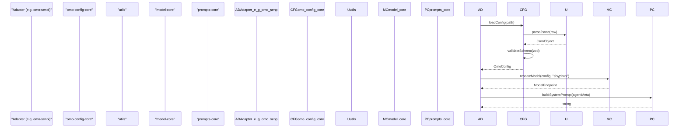

# Core Package Layer

<details>
<summary>Relevant source files</summary>

The following files were used as context for generating this wiki page:

- [.omo/evidence/20260727-codegraph-1.5.0-bump/README.md](https://github.com/code-yeongyu/oh-my-openagent/blob/HEAD/.omo/evidence/20260727-codegraph-1.5.0-bump/README.md)
- [.omo/evidence/20260809-omo-ai-beta-release/task-1.txt](https://github.com/code-yeongyu/oh-my-openagent/blob/HEAD/.omo/evidence/20260809-omo-ai-beta-release/task-1.txt)
- [.omo/evidence/20260809-omo-ai-beta-release/task-5.txt](https://github.com/code-yeongyu/oh-my-openagent/blob/HEAD/.omo/evidence/20260809-omo-ai-beta-release/task-5.txt)
- [.omo/evidence/20260810-omo-native-placeholder-key/fix.md](https://github.com/code-yeongyu/oh-my-openagent/blob/HEAD/.omo/evidence/20260810-omo-native-placeholder-key/fix.md)
- [.omo/evidence/20260810-omo-native-telemetry/task-2.md](https://github.com/code-yeongyu/oh-my-openagent/blob/HEAD/.omo/evidence/20260810-omo-native-telemetry/task-2.md)
- [.omo/evidence/20260810-omo-native-telemetry/task-4.md](https://github.com/code-yeongyu/oh-my-openagent/blob/HEAD/.omo/evidence/20260810-omo-native-telemetry/task-4.md)
- [.omo/evidence/20260810-omo-native-telemetry/task-7.md](https://github.com/code-yeongyu/oh-my-openagent/blob/HEAD/.omo/evidence/20260810-omo-native-telemetry/task-7.md)
- [.omo/evidence/task-17-subagent-session-resume-revival.txt](https://github.com/code-yeongyu/oh-my-openagent/blob/HEAD/.omo/evidence/task-17-subagent-session-resume-revival.txt)
- [.omo/evidence/task-3-senpi-model-chain-overhaul.txt](https://github.com/code-yeongyu/oh-my-openagent/blob/HEAD/.omo/evidence/task-3-senpi-model-chain-overhaul.txt)
- [THIRD-PARTY-NOTICES.md](https://github.com/code-yeongyu/oh-my-openagent/blob/HEAD/THIRD-PARTY-NOTICES.md)
- [bun.lock](https://github.com/code-yeongyu/oh-my-openagent/blob/HEAD/bun.lock)
- [docs/reference/omo-ai-publishing.md](https://github.com/code-yeongyu/oh-my-openagent/blob/HEAD/docs/reference/omo-ai-publishing.md)
- [docs/reference/re-export-shim-inventory.md](https://github.com/code-yeongyu/oh-my-openagent/blob/HEAD/docs/reference/re-export-shim-inventory.md)
- [docs/reference/release-process.md](https://github.com/code-yeongyu/oh-my-openagent/blob/HEAD/docs/reference/release-process.md)
- [docs/reference/shared-core-multi-pr.md](https://github.com/code-yeongyu/oh-my-openagent/blob/HEAD/docs/reference/shared-core-multi-pr.md)
- [package.json](https://github.com/code-yeongyu/oh-my-openagent/blob/HEAD/package.json)
- [packages/omo-codex/THIRD-PARTY-NOTICES.md](https://github.com/code-yeongyu/oh-my-openagent/blob/HEAD/packages/omo-codex/THIRD-PARTY-NOTICES.md)
- [packages/omo-codex/plugin/components/codegraph/NODE-RUNTIME-LICENSES.md](https://github.com/code-yeongyu/oh-my-openagent/blob/HEAD/packages/omo-codex/plugin/components/codegraph/NODE-RUNTIME-LICENSES.md)
- [packages/omo-codex/plugin/components/codegraph/NOTICE](https://github.com/code-yeongyu/oh-my-openagent/blob/HEAD/packages/omo-codex/plugin/components/codegraph/NOTICE)
- [packages/omo-codex/plugin/components/codegraph/test/package-runtime.test.ts](https://github.com/code-yeongyu/oh-my-openagent/blob/HEAD/packages/omo-codex/plugin/components/codegraph/test/package-runtime.test.ts)
- [packages/omo-codex/plugin/components/codegraph/test/session-start-trust-boundary.test.ts](https://github.com/code-yeongyu/oh-my-openagent/blob/HEAD/packages/omo-codex/plugin/components/codegraph/test/session-start-trust-boundary.test.ts)
- [packages/omo-codex/plugin/components/start-work-continuation/.npmignore](https://github.com/code-yeongyu/oh-my-openagent/blob/HEAD/packages/omo-codex/plugin/components/start-work-continuation/.npmignore)
- [packages/omo-codex/plugin/components/telemetry/LICENSE](https://github.com/code-yeongyu/oh-my-openagent/blob/HEAD/packages/omo-codex/plugin/components/telemetry/LICENSE)
- [packages/omo-codex/plugin/components/telemetry/NOTICE](https://github.com/code-yeongyu/oh-my-openagent/blob/HEAD/packages/omo-codex/plugin/components/telemetry/NOTICE)
- [packages/omo-codex/plugin/components/ulw-loop/.npmignore](https://github.com/code-yeongyu/oh-my-openagent/blob/HEAD/packages/omo-codex/plugin/components/ulw-loop/.npmignore)
- [packages/omo-codex/plugin/shared/src/config-loader.ts](https://github.com/code-yeongyu/oh-my-openagent/blob/HEAD/packages/omo-codex/plugin/shared/src/config-loader.ts)
- [packages/omo-codex/scripts/install-dist/install-local.mjs](https://github.com/code-yeongyu/oh-my-openagent/blob/HEAD/packages/omo-codex/scripts/install-dist/install-local.mjs)
- [packages/omo-config-core/package.json](https://github.com/code-yeongyu/oh-my-openagent/blob/HEAD/packages/omo-config-core/package.json)
- [packages/omo-config-core/src/loader/harness-fold.test.ts](https://github.com/code-yeongyu/oh-my-openagent/blob/HEAD/packages/omo-config-core/src/loader/harness-fold.test.ts)
- [packages/omo-config-core/src/loader/index.ts](https://github.com/code-yeongyu/oh-my-openagent/blob/HEAD/packages/omo-config-core/src/loader/index.ts)
- [packages/omo-config-core/src/loader/loader-resolution.test.ts](https://github.com/code-yeongyu/oh-my-openagent/blob/HEAD/packages/omo-config-core/src/loader/loader-resolution.test.ts)
- [packages/omo-config-core/src/loader/loader.ts](https://github.com/code-yeongyu/oh-my-openagent/blob/HEAD/packages/omo-config-core/src/loader/loader.ts)
- [packages/omo-config-core/src/loader/merge.ts](https://github.com/code-yeongyu/oh-my-openagent/blob/HEAD/packages/omo-config-core/src/loader/merge.ts)
- [packages/omo-config-core/src/loader/resolution.ts](https://github.com/code-yeongyu/oh-my-openagent/blob/HEAD/packages/omo-config-core/src/loader/resolution.ts)
- [packages/omo-config-core/src/loader/telemetry-resolution.test.ts](https://github.com/code-yeongyu/oh-my-openagent/blob/HEAD/packages/omo-config-core/src/loader/telemetry-resolution.test.ts)
- [packages/omo-config-core/src/loader/top-level-senpi-config-characterization.test.ts](https://github.com/code-yeongyu/oh-my-openagent/blob/HEAD/packages/omo-config-core/src/loader/top-level-senpi-config-characterization.test.ts)
- [packages/omo-config-core/src/schema/agent-schema.test.ts](https://github.com/code-yeongyu/oh-my-openagent/blob/HEAD/packages/omo-config-core/src/schema/agent-schema.test.ts)
- [packages/omo-config-core/src/schema/agent.ts](https://github.com/code-yeongyu/oh-my-openagent/blob/HEAD/packages/omo-config-core/src/schema/agent.ts)
- [packages/omo-config-core/src/schema/category.test.ts](https://github.com/code-yeongyu/oh-my-openagent/blob/HEAD/packages/omo-config-core/src/schema/category.test.ts)
- [packages/omo-config-core/src/schema/category.ts](https://github.com/code-yeongyu/oh-my-openagent/blob/HEAD/packages/omo-config-core/src/schema/category.ts)
- [packages/omo-config-core/src/schema/codegraph.ts](https://github.com/code-yeongyu/oh-my-openagent/blob/HEAD/packages/omo-config-core/src/schema/codegraph.ts)
- [packages/omo-config-core/src/schema/config-schema.test.ts](https://github.com/code-yeongyu/oh-my-openagent/blob/HEAD/packages/omo-config-core/src/schema/config-schema.test.ts)
- [packages/omo-config-core/src/schema/config.ts](https://github.com/code-yeongyu/oh-my-openagent/blob/HEAD/packages/omo-config-core/src/schema/config.ts)
- [packages/omo-config-core/src/schema/fallback-models.ts](https://github.com/code-yeongyu/oh-my-openagent/blob/HEAD/packages/omo-config-core/src/schema/fallback-models.ts)
- [packages/omo-config-core/src/schema/harness.ts](https://github.com/code-yeongyu/oh-my-openagent/blob/HEAD/packages/omo-config-core/src/schema/harness.ts)
- [packages/omo-config-core/src/schema/index.ts](https://github.com/code-yeongyu/oh-my-openagent/blob/HEAD/packages/omo-config-core/src/schema/index.ts)
- [packages/omo-config-core/src/schema/model-ref.ts](https://github.com/code-yeongyu/oh-my-openagent/blob/HEAD/packages/omo-config-core/src/schema/model-ref.ts)
- [packages/omo-config-core/src/schema/reasoning-vocabulary.ts](https://github.com/code-yeongyu/oh-my-openagent/blob/HEAD/packages/omo-config-core/src/schema/reasoning-vocabulary.ts)
- [packages/omo-config-core/src/schema/task.test.ts](https://github.com/code-yeongyu/oh-my-openagent/blob/HEAD/packages/omo-config-core/src/schema/task.test.ts)
- [packages/omo-config-core/src/schema/task.ts](https://github.com/code-yeongyu/oh-my-openagent/blob/HEAD/packages/omo-config-core/src/schema/task.ts)
- [packages/omo-config-core/src/schema/team.ts](https://github.com/code-yeongyu/oh-my-openagent/blob/HEAD/packages/omo-config-core/src/schema/team.ts)
- [packages/omo-config-core/src/schema/telemetry.test.ts](https://github.com/code-yeongyu/oh-my-openagent/blob/HEAD/packages/omo-config-core/src/schema/telemetry.test.ts)
- [packages/omo-config-core/src/schema/telemetry.ts](https://github.com/code-yeongyu/oh-my-openagent/blob/HEAD/packages/omo-config-core/src/schema/telemetry.ts)
- [packages/omo-native/AGENTS.md](https://github.com/code-yeongyu/oh-my-openagent/blob/HEAD/packages/omo-native/AGENTS.md)
- [packages/omo-native/package.json](https://github.com/code-yeongyu/oh-my-openagent/blob/HEAD/packages/omo-native/package.json)
- [packages/omo-native/test/package-shape.test.ts](https://github.com/code-yeongyu/oh-my-openagent/blob/HEAD/packages/omo-native/test/package-shape.test.ts)
- [packages/omo-native/test/senpi-pin.test.ts](https://github.com/code-yeongyu/oh-my-openagent/blob/HEAD/packages/omo-native/test/senpi-pin.test.ts)
- [packages/omo-native/tsconfig.json](https://github.com/code-yeongyu/oh-my-openagent/blob/HEAD/packages/omo-native/tsconfig.json)
- [packages/omo-opencode/src/config-migration/2026-08-reasoning-unification/fixture-expected.json](https://github.com/code-yeongyu/oh-my-openagent/blob/HEAD/packages/omo-opencode/src/config-migration/2026-08-reasoning-unification/fixture-expected.json)
- [packages/omo-opencode/src/config-migration/2026-08-reasoning-unification/fixture-input.json](https://github.com/code-yeongyu/oh-my-openagent/blob/HEAD/packages/omo-opencode/src/config-migration/2026-08-reasoning-unification/fixture-input.json)
- [packages/omo-opencode/src/shared-skills-package.test.ts](https://github.com/code-yeongyu/oh-my-openagent/blob/HEAD/packages/omo-opencode/src/shared-skills-package.test.ts)
- [packages/omo-senpi/package.json](https://github.com/code-yeongyu/oh-my-openagent/blob/HEAD/packages/omo-senpi/package.json)
- [packages/omo-senpi/plugin/package.json](https://github.com/code-yeongyu/oh-my-openagent/blob/HEAD/packages/omo-senpi/plugin/package.json)
- [packages/omo-senpi/src/components/config-resolution/index.test.ts](https://github.com/code-yeongyu/oh-my-openagent/blob/HEAD/packages/omo-senpi/src/components/config-resolution/index.test.ts)
- [packages/omo-senpi/src/components/telemetry/omo-native-prompt.test.ts](https://github.com/code-yeongyu/oh-my-openagent/blob/HEAD/packages/omo-senpi/src/components/telemetry/omo-native-prompt.test.ts)
- [packages/omo-senpi/src/components/telemetry/omo-native-prompt.ts](https://github.com/code-yeongyu/oh-my-openagent/blob/HEAD/packages/omo-senpi/src/components/telemetry/omo-native-prompt.ts)
- [packages/omo-senpi/src/package-shape.test.ts](https://github.com/code-yeongyu/oh-my-openagent/blob/HEAD/packages/omo-senpi/src/package-shape.test.ts)
- [packages/senpi-task/package.json](https://github.com/code-yeongyu/oh-my-openagent/blob/HEAD/packages/senpi-task/package.json)
- [packages/senpi-task/scripts/manual-routing-policy-qa.ts](https://github.com/code-yeongyu/oh-my-openagent/blob/HEAD/packages/senpi-task/scripts/manual-routing-policy-qa.ts)
- [packages/senpi-task/src/config/settings.test.ts](https://github.com/code-yeongyu/oh-my-openagent/blob/HEAD/packages/senpi-task/src/config/settings.test.ts)
- [packages/senpi-task/src/lifecycle/batch-admission.test.ts](https://github.com/code-yeongyu/oh-my-openagent/blob/HEAD/packages/senpi-task/src/lifecycle/batch-admission.test.ts)
- [packages/senpi-task/src/manager/residency-unlimited.test.ts](https://github.com/code-yeongyu/oh-my-openagent/blob/HEAD/packages/senpi-task/src/manager/residency-unlimited.test.ts)
- [packages/team-core/src/config.ts](https://github.com/code-yeongyu/oh-my-openagent/blob/HEAD/packages/team-core/src/config.ts)
- [packages/telemetry-core/index.d.ts](https://github.com/code-yeongyu/oh-my-openagent/blob/HEAD/packages/telemetry-core/index.d.ts)
- [packages/telemetry-core/src/activity-state.test.ts](https://github.com/code-yeongyu/oh-my-openagent/blob/HEAD/packages/telemetry-core/src/activity-state.test.ts)
- [packages/telemetry-core/src/activity-state.ts](https://github.com/code-yeongyu/oh-my-openagent/blob/HEAD/packages/telemetry-core/src/activity-state.ts)
- [packages/telemetry-core/src/constants.ts](https://github.com/code-yeongyu/oh-my-openagent/blob/HEAD/packages/telemetry-core/src/constants.ts)
- [packages/telemetry-core/src/diagnostics.ts](https://github.com/code-yeongyu/oh-my-openagent/blob/HEAD/packages/telemetry-core/src/diagnostics.ts)
- [packages/telemetry-core/src/env.test.ts](https://github.com/code-yeongyu/oh-my-openagent/blob/HEAD/packages/telemetry-core/src/env.test.ts)
- [packages/telemetry-core/src/env.ts](https://github.com/code-yeongyu/oh-my-openagent/blob/HEAD/packages/telemetry-core/src/env.ts)
- [packages/telemetry-core/src/events.test.ts](https://github.com/code-yeongyu/oh-my-openagent/blob/HEAD/packages/telemetry-core/src/events.test.ts)
- [packages/telemetry-core/src/events.ts](https://github.com/code-yeongyu/oh-my-openagent/blob/HEAD/packages/telemetry-core/src/events.ts)
- [packages/telemetry-core/src/index.ts](https://github.com/code-yeongyu/oh-my-openagent/blob/HEAD/packages/telemetry-core/src/index.ts)
- [packages/telemetry-core/src/posthog-client.test.ts](https://github.com/code-yeongyu/oh-my-openagent/blob/HEAD/packages/telemetry-core/src/posthog-client.test.ts)
- [packages/telemetry-core/src/posthog-client.ts](https://github.com/code-yeongyu/oh-my-openagent/blob/HEAD/packages/telemetry-core/src/posthog-client.ts)
- [packages/telemetry-core/src/types.ts](https://github.com/code-yeongyu/oh-my-openagent/blob/HEAD/packages/telemetry-core/src/types.ts)
- [packages/utils/package.json](https://github.com/code-yeongyu/oh-my-openagent/blob/HEAD/packages/utils/package.json)
- [packages/utils/src/skill-path-resolver.ts](https://github.com/code-yeongyu/oh-my-openagent/blob/HEAD/packages/utils/src/skill-path-resolver.ts)
- [script/package-registration-audit.test.ts](https://github.com/code-yeongyu/oh-my-openagent/blob/HEAD/script/package-registration-audit.test.ts)
- [script/shared-core-extraction-guard.test.ts](https://github.com/code-yeongyu/oh-my-openagent/blob/HEAD/script/shared-core-extraction-guard.test.ts)
- [scripts/check-third-party-notices.mjs](https://github.com/code-yeongyu/oh-my-openagent/blob/HEAD/scripts/check-third-party-notices.mjs)
- [scripts/check-third-party-notices.test.mjs](https://github.com/code-yeongyu/oh-my-openagent/blob/HEAD/scripts/check-third-party-notices.test.mjs)
- [scripts/third-party-notice-requirements.mjs](https://github.com/code-yeongyu/oh-my-openagent/blob/HEAD/scripts/third-party-notice-requirements.mjs)
- [tests/omo-config-category-drift.test.ts](https://github.com/code-yeongyu/oh-my-openagent/blob/HEAD/tests/omo-config-category-drift.test.ts)

</details>


The **Core Package Layer** is a foundational set of 19 pure TypeScript packages extracted from the main Oh My OpenAgent codebase to enable harness-neutral functionality. This strategic refactor enforces a strict Directed Acyclic Graph (DAG) dependency model, ensuring the core logic remains decoupled from harness-specific adapters such as OpenCode, Codex, and Senpi. Each core package addresses a distinct domain within the AI agent orchestration ecosystem, facilitating modularity, reuse, and testability in isolation [package.json:8-36](https://github.com/code-yeongyu/oh-my-openagent/blob/HEAD/package.json#L8-L36), [script/package-registration-audit.test.ts:7-27](https://github.com/code-yeongyu/oh-my-openagent/blob/HEAD/script/package-registration-audit.test.ts#L7-L27).

---

## Architectural Principles

The core layer is governed by the following principles:

1.  **Harness Neutrality**: Core packages comprise pure logic—rule engines, parsing, model resolution, state machines, configuration schemas—without dependencies on plugin or UI harnesses. This enables reusability by multiple runtime adapters [packages/omo-senpi/package.json:28-39](https://github.com/code-yeongyu/oh-my-openagent/blob/HEAD/packages/omo-senpi/package.json#L28-L39).
2.  **Strict DAG Dependency Model**: Dependencies flow downhill in the call graph: adapter layers depend on MCPs, which depend on Cores; cores never depend on adapters or MCP processes. This avoids circular dependencies and maintains clear boundaries [script/package-registration-audit.test.ts:47-52](https://github.com/code-yeongyu/oh-my-openagent/blob/HEAD/script/package-registration-audit.test.ts#L47-L52).
3.  **Encapsulation of Runtime Boundaries**: Core packages operate at the pure logic layer, MCP packages provide external process boundaries (e.g., MCP servers using stdio JSON-RPC), and adapters consume core and MCP layers to integrate with specific hosts [packages/ast-grep-mcp/src/mcp.ts:3-10](https://github.com/code-yeongyu/oh-my-openagent/blob/HEAD/packages/ast-grep-mcp/src/mcp.ts#L3-L10).

---

## Core Package Dependency Flow

The core packages form a dependency graph layered from foundational utilities to high-level orchestration components.

### Core Dependency Hierarchy

```mermaid
graph TD
  subgraph CoreLayer ["Core Package Layer (Pure TS)"]
    UTILS["utils"]
    MODEL_CORE["model-core"]
    OMO_CONFIG_CORE["omo-config-core"]
    PROMPTS_CORE["prompts-core"]
    RULES_ENGINE["rules-engine"]
    AGENTS_MD_CORE["agents-md-core"]
    COMMENT_CHECKER_CORE["comment-checker-core"]
    HASHLINE_CORE["hashline-core"]
    BOULDER_STATE["boulder-state"]
    TELEMETRY_CORE["telemetry-core"]
    LSP_CORE["lsp-core"]
    MCP_STDIO_CORE["mcp-stdio-core"]
    TMUX_CORE["tmux-core"]
    CLAUDE_CODE_COMPAT_CORE["claude-code-compat-core"]
    SKILLS_LOADER_CORE["skills-loader-core"]
    MCP_CLIENT_CORE["mcp-client-core"]
    OPENCLAW_CORE["openclaw-core"]
    TEAM_CORE["team-core"]
    DELEGATE_CORE["delegate-core"]
    MEMORY_CORE["memory-core"]
  end

  subgraph MCP_Layer ["MCP Layer (Process/Stdio)"]
    AST_GREP_MCP["ast-grep-mcp"]
    GIT_BASH_MCP["git-bash-mcp"]
  end

  subgraph AdapterLayer ["Adapter Layer (Harness Glue)"]
    OMO_OPENCODE["omo-opencode (OpenCode Ultimate)"]
    OMO_CODEX["omo-codex (Codex Light)"]
    OMO_SENPI["omo-senpi (Senpi Extension)"]
    OMO_NATIVE["omo-native (Native CLI)"]
  end

  %% Dependencies Core packages
  MODEL_CORE --> UTILS
  OMO_CONFIG_CORE --> UTILS
  PROMPTS_CORE --> MODEL_CORE
  RULES_ENGINE --> UTILS
  AGENTS_MD_CORE --> RULES_ENGINE
  COMMENT_CHECKER_CORE --> UTILS
  HASHLINE_CORE --> ["diff" (external)]
  BOULDER_STATE --> UTILS
  TELEMETRY_CORE --> UTILS
  LSP_CORE --> MCP_STDIO_CORE
  MCP_CLIENT_CORE --> CLAUDE_CODE_COMPAT_CORE
  MCP_CLIENT_CORE --> UTILS
  TMUX_CORE --> UTILS
  CLAUDE_CODE_COMPAT_CORE --> MODEL_CORE
  CLAUDE_CODE_COMPAT_CORE --> UTILS
  SKILLS_LOADER_CORE --> UTILS
  DELEGATE_CORE --> MODEL_CORE
  TEAM_CORE --> DELEGATE_CORE
  OMO_CONFIG_CORE --> ["jsonc-parser" (external)]
  OMO_CONFIG_CORE --> ["zod" (external)]
  MEMORY_CORE --> UTILS

  %% MCP Layer depends on Core Layer
  AST_GREP_MCP --> MCP_STDIO_CORE
  AST_GREP_MCP --> UTILS
  GIT_BASH_MCP --> MCP_STDIO_CORE

  %% Adapter depends on Core and MCP
  OMO_OPENCODE --> CoreLayer
  OMO_CODEX --> UTILS
  OMO_SENPI --> CoreLayer
  OMO_SENPI --> AST_GREP_MCP
  OMO_NATIVE --> OMO_SENPI
```

**Notes:**
- `hashline-core` uses the external `diff` package for content comparison [bun.lock:144](https://github.com/code-yeongyu/oh-my-openagent/blob/HEAD/bun.lock#L144).
- `omo-config-core` relies on `jsonc-parser` and `zod` for schema validation and loading [bun.lock:199-200](https://github.com/code-yeongyu/oh-my-openagent/blob/HEAD/bun.lock#L199-L200).
- `omo-senpi` acts as a heavy consumer, importing 11 core packages to build its Senpi-native extension [packages/omo-senpi/package.json:28-39](https://github.com/code-yeongyu/oh-my-openagent/blob/HEAD/packages/omo-senpi/package.json#L28-L39).
- `omo-native` depends on `omo-senpi` as its core runtime [packages/omo-native/package.json:16-17](https://github.com/code-yeongyu/oh-my-openagent/blob/HEAD/packages/omo-native/package.json#L16-L17).

Sources: [package.json:8-36](https://github.com/code-yeongyu/oh-my-openagent/blob/HEAD/package.json#L8-L36), [bun.lock:79-184](https://github.com/code-yeongyu/oh-my-openagent/blob/HEAD/bun.lock#L79-L184), [packages/omo-senpi/package.json:28-39](https://github.com/code-yeongyu/oh-my-openagent/blob/HEAD/packages/omo-senpi/package.json#L28-L39), [packages/ast-grep-mcp/package.json:20-23](https://github.com/code-yeongyu/oh-my-openagent/blob/HEAD/packages/ast-grep-mcp/package.json#L20-L23), [script/package-registration-audit.test.ts:7-27](https://github.com/code-yeongyu/oh-my-openagent/blob/HEAD/script/package-registration-audit.test.ts#L7-L27), [packages/omo-native/package.json:16-17](https://github.com/code-yeongyu/oh-my-openagent/blob/HEAD/packages/omo-native/package.json#L16-L17).

---

## Package Roles and Implementation Details

### Data Flow: From Configuration to Model Interaction
The following diagram illustrates how core packages interact to transform a raw `omo.jsonc` file into an actionable model request.



Sources: [packages/omo-config-core/src/loader/loader.ts:1-100](https://github.com/code-yeongyu/oh-my-openagent/blob/HEAD/packages/omo-config-core/src/loader/loader.ts#L1-L100), [packages/omo-config-core/src/schema/config.ts:1-100](https://github.com/code-yeongyu/oh-my-openagent/blob/HEAD/packages/omo-config-core/src/schema/config.ts#L1-L100), [packages/model-core/src/model-capabilities.ts:1-100](https://github.com/code-yeongyu/oh-my-openagent/blob/HEAD/packages/model-core/src/model-capabilities.ts#L1-L100), [packages/prompts-core/src/agent-prompt-builder.ts:1-100](https://github.com/code-yeongyu/oh-my-openagent/blob/HEAD/packages/prompts-core/src/agent-prompt-builder.ts#L1-L100)

### Core Package Inventory

| Package Name | Purpose | Key Entities / Functions |
| :--- | :--- | :--- |
| `utils` | Foundation logic for all packages. | `deepMerge`, `jsoncParser`, `CommandExecutor`, `GitWorktree` [packages/omo-codex/scripts/install-dist/install-local.mjs:19-40](https://github.com/code-yeongyu/oh-my-openagent/blob/HEAD/packages/omo-codex/scripts/install-dist/install-local.mjs#L19-L40) |
| `omo-config-core` | Central configuration schema and loading logic. | `OmoConfigSchema`, `loadConfig`, `mergeConfigs` [bun.lock:195-202](https://github.com/code-yeongyu/oh-my-openagent/blob/HEAD/bun.lock#L195-L202) |
| `model-core` | Model capability mapping and resolution logic. | `resolveModel`, `ModelCapabilityGuardrails` [bun.lock:181-184](https://github.com/code-yeongyu/oh-my-openagent/blob/HEAD/bun.lock#L181-L184) |
| `prompts-core` | Base templates and logic for prompt construction. | `AgentPromptBuilder` [bun.lock:48](https://github.com/code-yeongyu/oh-my-openagent/blob/HEAD/bun.lock#L48) |
| `rules-engine` | Evaluates system and user-defined behavioral rules. | `RulesEvaluator` [bun.lock:49](https://github.com/code-yeongyu/oh-my-openagent/blob/HEAD/bun.lock#L49) |
| `agents-md-core` | Parses and manages `AGENTS.md` documentation. | `AgentsMdParser` [bun.lock:82-87](https://github.com/code-yeongyu/oh-my-openagent/blob/HEAD/bun.lock#L82-L87) |
| `comment-checker-core` | Logic for identifying AI-generated slop in comments. | `CommentChecker` [bun.lock:115-120](https://github.com/code-yeongyu/oh-my-openagent/blob/HEAD/bun.lock#L115-L120) |
| `hashline-core` | LINE#ID based content hashing and edit verification. | `HashlineVerifier`, `applyHashlineEdit` [bun.lock:143-149](https://github.com/code-yeongyu/oh-my-openagent/blob/HEAD/bun.lock#L143-L149) |
| `boulder-state` | Manages the "Boulder" todo enforcement state. | `BoulderStateManager` [bun.lock:103-106](https://github.com/code-yeongyu/oh-my-openagent/blob/HEAD/bun.lock#L103-L106) |
| `telemetry-core` | Anonymized usage tracking and error reporting. | `TelemetryClient`, `getDailyActiveCaptureState` [bun.lock:107-110](https://github.com/code-yeongyu/oh-my-openagent/blob/HEAD/bun.lock#L107-L110), [packages/omo-codex/scripts/install-dist/install-local.mjs:115-129](https://github.com/code-yeongyu/oh-my-openagent/blob/HEAD/packages/omo-codex/scripts/install-dist/install-local.mjs#L115-L129) |
| `lsp-core` | Protocol logic for Language Server Protocol interaction. | `LspClient`, `DiagnosticManager` [bun.lock:150-156](https://github.com/code-yeongyu/oh-my-openagent/blob/HEAD/bun.lock#L150-L156) |
| `mcp-stdio-core` | Low-level JSON-RPC transport for MCP servers. | `runJsonRpcStdioServer`, `errorResponse` [bun.lock:173-176](https://github.com/code-yeongyu/oh-my-openagent/blob/HEAD/bun.lock#L173-L176) |
| `tmux-core` | Manages background subagent tmux panes. | `TmuxSessionManager` [bun.lock:55](https://github.com/code-yeongyu/oh-my-openagent/blob/HEAD/bun.lock#L55) |
| `claude-code-compat-core` | Compatibility layer for Claude Code plugins. | `ClaudePluginAdapter` [bun.lock:107-114](https://github.com/code-yeongyu/oh-my-openagent/blob/HEAD/bun.lock#L107-L114) |
| `skills-loader-core` | Discovers and loads `.md` based agent skills. | `SkillLoader` [bun.lock:52](https://github.com/code-yeongyu/oh-my-openagent/blob/HEAD/bun.lock#L52) |
| `mcp-client-core` | Logic for consuming external MCP servers. | `McpClient` [bun.lock:157-170](https://github.com/code-yeongyu/oh-my-openagent/blob/HEAD/bun.lock#L157-L170) |
| `openclaw-core` | Gateway for external webhooks (Discord/Telegram). | `OpenClawClient` [bun.lock:45](https://github.com/code-yeongyu/oh-my-openagent/blob/HEAD/bun.lock#L45) |
| `team-core` | Multi-agent coordination and mailbox logic. | `TeamOrchestrator` [bun.lock:53](https://github.com/code-yeongyu/oh-my-openagent/blob/HEAD/bun.lock#L53) |
| `delegate-core` | Logic for the `delegate_task` tool. | `TaskDelegator` [bun.lock:122-128](https://github.com/code-yeongyu/oh-my-openagent/blob/HEAD/bun.lock#L122-L128) |
| `memory-core` | Git-backed markdown memory system for agents. | `GitMemoryRepo`, `MemoryManager` [bun.lock:177-180](https://github.com/code-yeongyu/oh-my-openagent/blob/HEAD/bun.lock#L177-L180) |

Sources: [packages/omo-codex/scripts/install-dist/install-local.mjs:19-40](https://github.com/code-yeongyu/oh-my-openagent/blob/HEAD/packages/omo-codex/scripts/install-dist/install-local.mjs#L19-L40), [bun.lock:45-184](https://github.com/code-yeongyu/oh-my-openagent/blob/HEAD/bun.lock#L45-L184), [script/package-registration-audit.test.ts:7-27](https://github.com/code-yeongyu/oh-my-openagent/blob/HEAD/script/package-registration-audit.test.ts#L7-L27).

---

## Adapter Consumption Pattern

Adapters like `omo-senpi` or `omo-opencode` do not implement core logic. Instead, they compose these packages into a runtime.

**Example: `omo-senpi` Initialization**
The `omo-senpi` adapter imports core packages to satisfy its harness requirements:
- Uses `lsp-core` to provide IDE diagnostics [packages/omo-senpi/package.json:36](https://github.com/code-yeongyu/oh-my-openagent/blob/HEAD/packages/omo-senpi/package.json#L36).
- Uses `senpi-task` for task lifecycle management [packages/omo-senpi/package.json:37](https://github.com/code-yeongyu/oh-my-openagent/blob/HEAD/packages/omo-senpi/package.json#L37).
- Uses `boulder-state` to track task persistence [packages/omo-senpi/package.json:42](https://github.com/code-yeongyu/oh-my-openagent/blob/HEAD/packages/omo-senpi/package.json#L42).

This separation allows the core logic to be tested via `bun test` in pure Node/Bun environments without needing to launch a full IDE or harness [packages/omo-senpi/package.json:26](https://github.com/code-yeongyu/oh-my-openagent/blob/HEAD/packages/omo-senpi/package.json#L26).

Sources: [packages/omo-senpi/package.json:26-42](https://github.com/code-yeongyu/oh-my-openagent/blob/HEAD/packages/omo-senpi/package.json#L26-L42).21:T