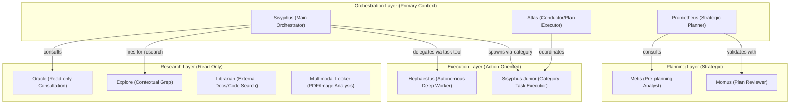
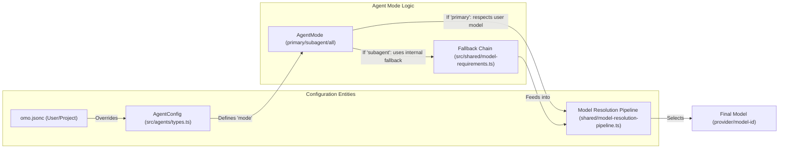
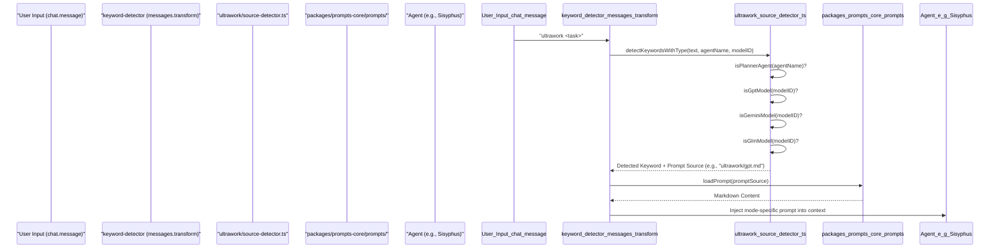

# Agents

Relevant source files

The following files were used as context for generating this wiki page:

- [packages/ast-grep-mcp/AGENTS.md](https://github.com/code-yeongyu/oh-my-openagent/blob/HEAD/packages/ast-grep-mcp/AGENTS.md)
- [packages/omo-opencode/src/AGENTS.md](https://github.com/code-yeongyu/oh-my-openagent/blob/HEAD/packages/omo-opencode/src/AGENTS.md)
- [packages/omo-opencode/src/agents/AGENTS.md](https://github.com/code-yeongyu/oh-my-openagent/blob/HEAD/packages/omo-opencode/src/agents/AGENTS.md)
- [packages/omo-opencode/src/agents/prometheus/AGENTS.md](https://github.com/code-yeongyu/oh-my-openagent/blob/HEAD/packages/omo-opencode/src/agents/prometheus/AGENTS.md)
- [packages/omo-opencode/src/config-migration/AGENTS.md](https://github.com/code-yeongyu/oh-my-openagent/blob/HEAD/packages/omo-opencode/src/config-migration/AGENTS.md)
- [packages/omo-opencode/src/features/AGENTS.md](https://github.com/code-yeongyu/oh-my-openagent/blob/HEAD/packages/omo-opencode/src/features/AGENTS.md)
- [packages/omo-opencode/src/features/boulder-state/AGENTS.md](https://github.com/code-yeongyu/oh-my-openagent/blob/HEAD/packages/omo-opencode/src/features/boulder-state/AGENTS.md)
- [packages/omo-opencode/src/features/team-mode/AGENTS.md](https://github.com/code-yeongyu/oh-my-openagent/blob/HEAD/packages/omo-opencode/src/features/team-mode/AGENTS.md)
- [packages/omo-opencode/src/hooks/AGENTS.md](https://github.com/code-yeongyu/oh-my-openagent/blob/HEAD/packages/omo-opencode/src/hooks/AGENTS.md)
- [packages/omo-opencode/src/hooks/auto-update-checker/AGENTS.md](https://github.com/code-yeongyu/oh-my-openagent/blob/HEAD/packages/omo-opencode/src/hooks/auto-update-checker/AGENTS.md)
- [packages/omo-opencode/src/hooks/keyword-detector/AGENTS.md](https://github.com/code-yeongyu/oh-my-openagent/blob/HEAD/packages/omo-opencode/src/hooks/keyword-detector/AGENTS.md)

This page provides an overview of the agent system in oh-my-openagent. Agents are specialized AI personas with distinct roles, model assignments, tool permissions, and prompts. The system includes 11 built-in agents that handle everything from main orchestration (Sisyphus) to specialized consultation (Oracle), code exploration (Explore, Librarian), planning (Prometheus, Metis, Momus), and execution (Hephaestus, Atlas).

The system is currently undergoing a **Package Layering Refactor**, moving core agent logic into harness-neutral packages like `agents-md-core`, `prompts-core`, and `delegate-core` to support multiple platforms including OpenCode, Codex, and Senpi [packages/omo-opencode/src/AGENTS.md:22-24](https://github.com/code-yeongyu/oh-my-openagent/blob/HEAD/packages/omo-opencode/src/AGENTS.md#L22-L24).

For detailed information about specific agents, see:
- [Sisyphus (Main Orchestrator)](12_3.1-sisyphus-main-orchestrator.md) — Document Sisyphus's role, model-specific prompts (GPT-5.4, Gemini, Claude, Kimi-K2), task creation, and verification loops.
- [Planning Agents](13_3.2-planning-agents.md) — Cover Prometheus (strategic planner), Metis (pre-planning analyst), and Momus (plan reviewer).
- [Worker Agents](14_3.3-worker-agents.md) — Document Hephaestus (deep worker), Atlas (todo master), and specialized agents (Oracle, Librarian, Explore).
- [Agent-Model Matching](15_3.4-agent-model-matching.md) — Explain how agents are matched to optimal models based on provider availability and requirements.
- [Dynamic Prompt Building](16_3.5-dynamic-prompt-building.md) — Detail the dynamic-agent-prompt-builder system and how prompts adapt to available agents/tools/skills.

---

## Agent Inventory

The system defines 11 built-in agents. These are specialized "discipline agents" designed to coordinate as a development team. Each agent has a specific working style and is assigned to models that match its "personality" [packages/omo-opencode/src/agents/AGENTS.md:10-16](https://github.com/code-yeongyu/oh-my-openagent/blob/HEAD/packages/omo-opencode/src/agents/AGENTS.md#L10-L16).

### Agent Orchestration Hierarchy

The agents are organized into layers based on purpose and delegation capability. Sisyphus acts as the primary entry point for complex tasks, while specialized subagents handle research and validation.

Sources: [packages/omo-opencode/src/agents/AGENTS.md:20-32](https://github.com/code-yeongyu/oh-my-openagent/blob/HEAD/packages/omo-opencode/src/agents/AGENTS.md#L20-L32)

### Agent Inventory Table

| Agent | Default Model | Temp | Mode | Fallback (after default) | Purpose |
|-------|---------------|------|------|--------------------------|---------|
| **Sisyphus** | `claude-opus-5` max | (model default) | `primary` | `kimi-k3` → `gpt-5.6-sol` medium → `glm-5.2` → `big-pickle` | Main orchestrator, plans + delegates; `thinking: { type: "enabled", budgetTokens: 32000 }` |
| **Hephaestus** | `gpt-5.6-sol` medium | (model default) | `primary` | `GPT-5.6 Sol` only (`requiresProvider`: openai \| github-copilot \| opencode \| vercel) | Autonomous deep worker |
| **Oracle** | `gpt-5.6-sol` xhigh (high on Copilot) | 0.1 | `subagent` | `gemini-3.1-pro` high → `claude-opus-5` max → `glm-5.2` | Read-only consultation |
| **Librarian** | `gpt-5.6-luna-fast` | 0.1 | `subagent` | `qwen3.7-plus` → `minimax-m2.7-highspeed` → `minimax-m3` → `minimax-m2.7` → `claude-haiku-4-5` → `gpt-5.4-nano` | External docs/code search |
| **Explore** | `gpt-5.6-luna-fast` | 0.1 | `subagent` | `qwen3.7-plus` → `minimax-m2.7-highspeed` → `minimax-m3` → `minimax-m2.7` → `claude-haiku-4-5` → `gpt-5.4-nano` | Contextual grep |
| **Multimodal-Looker** | `gpt-5.6-sol` low | 0.1 | `subagent` | `kimi-k3` → `glm-4.6v` → `gpt-5-nano` | PDF/image analysis |
| **Metis** | `claude-opus-5` high | **0.3** | `subagent` | `kimi-k3` low | Pre-planning consultant |
| **Momus** | `gpt-5.6-terra` high | 0.1 | `subagent` | `gpt-5.6-sol` xhigh (high on Copilot) → `claude-opus-5` max → `gemini-3.1-pro` high → `glm-5.2` | Plan reviewer |
| **Atlas** | `claude-sonnet-5` | 0.1 | `primary` | `kimi-k3` → `gpt-5.6-sol` medium → `minimax-m3` → `MiniMax-M3` → `minimax-m2.7` | Todo-list orchestrator |
| **Prometheus** | `claude-fable-5` xhigh | (override-only) | `primary` | `kimi-k3` max | Strategic planner (interview); built via `buildPrometheusAgentConfig` (not in `agentSources`) |
| **Sisyphus-Junior** | `claude-sonnet-5` | 0.1 (`SISYPHUS_JUNIOR_DEFAULTS`) | `subagent` | `kimi-k3` → `gpt-5.6-sol` medium → `minimax-m3` → `MiniMax-M3` → `minimax-m2.7` → `big-pickle` | Category-spawned executor |

Sources: [packages/omo-opencode/src/agents/AGENTS.md:20-32](https://github.com/code-yeongyu/oh-my-openagent/blob/HEAD/packages/omo-opencode/src/agents/AGENTS.md#L20-L32)

---

## Agent Modes

Agent modes determine how the system resolves the model and manages UI behavior.

- **`primary`**: These agents respect the user's UI-selected model. Used by `Sisyphus`, `Hephaestus`, `Atlas`, and `Prometheus` [packages/omo-opencode/src/agents/AGENTS.md:107-108](https://github.com/code-yeongyu/oh-my-openagent/blob/HEAD/packages/omo-opencode/src/agents/AGENTS.md#L107-L108).
- **`subagent`**: These agents use their own predefined fallback chain and ignore UI selections. Used by `Oracle`, `Librarian`, `Explore`, `Multimodal-Looker`, `Metis`, `Momus`, and `Sisyphus-Junior` [packages/omo-opencode/src/agents/AGENTS.md:109-110](https://github.com/code-yeongyu/oh-my-openagent/blob/HEAD/packages/omo-opencode/src/agents/AGENTS.md#L109-L110).
- **`all`**: Declared in the type for OpenCode compatibility but no built-in agent currently uses it [packages/omo-opencode/src/agents/AGENTS.md:111](https://github.com/code-yeongyu/oh-my-openagent/blob/HEAD/packages/omo-opencode/src/agents/AGENTS.md#L111).

### Model Resolution Mapping

The following diagram maps how Agent Modes interact with the configuration system to select a model.

Sources: [packages/omo-opencode/src/agents/AGENTS.md:105-111](https://github.com/code-yeongyu/oh-my-openagent/blob/HEAD/packages/omo-opencode/src/agents/AGENTS.md#L105-L111), [packages/omo-opencode/src/shared/model-requirements.ts:1-100](https://github.com/code-yeongyu/oh-my-openagent/blob/HEAD/packages/omo-opencode/src/shared/model-requirements.ts#L1-L100), [packages/omo-opencode/src/shared/model-resolution-pipeline.ts:1-100](https://github.com/code-yeongyu/oh-my-openagent/blob/HEAD/packages/omo-opencode/src/shared/model-resolution-pipeline.ts#L1-L100)

---

## Tool Permission System

To maintain operational discipline, agents have restricted toolsets. These are enforced via the config and built-in guard hooks.

| Agent | Denied Tools / Restrictions |
|-------|-----------------------------|
| **Oracle** | `write`, `edit`, `task`, `call_omo_agent` |
| **Librarian** | `write`, `edit`, `task`, `call_omo_agent` |
| **Explore** | `write`, `edit`, `task`, `call_omo_agent` |
| **Multimodal-Looker** | ALL except `read` |
| **Atlas** | `task`, `call_omo_agent` |
| **Momus** | `write`, `edit`, `task` |
| **Prometheus** | enforces `.md`-only writes via `prometheus-md-only` hook (path-based, not tool-based) |

Sources: [packages/omo-opencode/src/agents/AGENTS.md:36-46](https://github.com/code-yeongyu/oh-my-openagent/blob/HEAD/packages/omo-opencode/src/agents/AGENTS.md#L36-L46), [packages/omo-opencode/src/shared/agent-tool-restrictions.ts:1-100](https://github.com/code-yeongyu/oh-my-openagent/blob/HEAD/packages/omo-opencode/src/shared/agent-tool-restrictions.ts#L1-L100)

### Team-Mode Eligibility

Not all agents are eligible to be members of a multi-agent team. This is defined in the `AGENT_ELIGIBILITY_REGISTRY` [packages/omo-opencode/src/features/team-mode/types.ts:1-100](https://github.com/code-yeongyu/oh-my-openagent/blob/HEAD/packages/omo-opencode/src/features/team-mode/types.ts#L1-L100).

| Verdict | Agents | Notes |
|---------|--------|-------|
| `eligible` | `sisyphus`, `atlas`, `sisyphus-junior` | These agents can participate directly in a team. |
| `conditional` | `hephaestus` | Lacks `teammate: "allow"` permission by default. Requires explicit configuration or delegation via `subagent_type: "sisyphus"` [packages/omo-opencode/src/features/team-mode/AGENTS.md:59](https://github.com/code-yeongyu/oh-my-openagent/blob/HEAD/packages/omo-opencode/src/features/team-mode/AGENTS.md#L59). |
| `hard-reject` | `oracle`, `librarian`, `explore`, `multimodal-looker`, `metis`, `momus`, `prometheus` | Read-only or plan-mode-only agents are rejected at TeamSpec parse time. The lead delegates to them via the `task` tool instead [packages/omo-opencode/src/features/team-mode/AGENTS.md:60](https://github.com/code-yeongyu/oh-my-openagent/blob/HEAD/packages/omo-opencode/src/features/team-mode/AGENTS.md#L60). |

Sources: [packages/omo-opencode/src/features/team-mode/AGENTS.md:51-63](https://github.com/code-yeongyu/oh-my-openagent/blob/HEAD/packages/omo-opencode/src/features/team-mode/AGENTS.md#L51-L63), [packages/omo-opencode/src/features/team-mode/types.ts:1-100](https://github.com/code-yeongyu/oh-my-openagent/blob/HEAD/packages/omo-opencode/src/features/team-mode/types.ts#L1-L100)

---

## Dynamic Prompt Building

The system uses a dynamic prompt builder to adapt system instructions to the specific model family being used. This ensures that prompts are optimized for the capabilities and nuances of each model. The `dynamic-agent-prompt-builder.ts` [packages/omo-opencode/src/agents/dynamic-agent-prompt-builder.ts:1-100](https://github.com/code-yeongyu/oh-my-openagent/blob/HEAD/packages/omo-opencode/src/agents/dynamic-agent-prompt-builder.ts#L1-L100) is central to this process.

### Prompt Family Selection Logic

The `keyword-detector` hook [packages/omo-opencode/src/hooks/keyword-detector/AGENTS.md:1-100](https://github.com/code-yeongyu/oh-my-openagent/blob/HEAD/packages/omo-opencode/src/hooks/keyword-detector/AGENTS.md#L1-L100) demonstrates how models are routed to specific prompt variants for `ultrawork` mode:

- **Planner agents**: `prometheus`, `planner`, or normalized `plan` route to `planner.md` [packages/omo-opencode/src/hooks/keyword-detector/AGENTS.md:62](https://github.com/code-yeongyu/oh-my-openagent/blob/HEAD/packages/omo-opencode/src/hooks/keyword-detector/AGENTS.md#L62).
- **GPT family models**: Detected by `isGptModel(modelID)`, route to `gpt.md` [packages/omo-opencode/src/hooks/keyword-detector/AGENTS.md:63](https://github.com/code-yeongyu/oh-my-openagent/blob/HEAD/packages/omo-opencode/src/hooks/keyword-detector/AGENTS.md#L63).
- **Gemini family models**: Detected by `isGeminiModel(modelID)`, route to `gemini.md` [packages/omo-opencode/src/hooks/keyword-detector/AGENTS.md:64](https://github.com/code-yeongyu/oh-my-openagent/blob/HEAD/packages/omo-opencode/src/hooks/keyword-detector/AGENTS.md#L64).
- **GLM family models**: Detected by `isGlmModel(modelID)`, route to `glm.md` [packages/omo-opencode/src/hooks/keyword-detector/AGENTS.md:65](https://github.com/code-yeongyu/oh-my-openagent/blob/HEAD/packages/omo-opencode/src/hooks/keyword-detector/AGENTS.md#L65).
- **Everything else**: Routes to `default.md` [packages/omo-opencode/src/hooks/keyword-detector/AGENTS.md:66](https://github.com/code-yeongyu/oh-my-openagent/blob/HEAD/packages/omo-opencode/src/hooks/keyword-detector/AGENTS.md#L66).

Sources: [packages/omo-opencode/src/hooks/keyword-detector/AGENTS.md:1-100](https://github.com/code-yeongyu/oh-my-openagent/blob/HEAD/packages/omo-opencode/src/hooks/keyword-detector/AGENTS.md#L1-L100), [packages/omo-opencode/src/hooks/keyword-detector/ultrawork/source-detector.ts:1-100](https://github.com/code-yeongyu/oh-my-openagent/blob/HEAD/packages/omo-opencode/src/hooks/keyword-detector/ultrawork/source-detector.ts#L1-L100), [packages/prompts-core/prompts/ultrawork/default.md:1-100](https://github.com/code-yeongyu/oh-my-openagent/blob/HEAD/packages/prompts-core/prompts/ultrawork/default.md#L1-L100)

---

## Agent-Model Matching

Model matching is based on the "Developer Persona" philosophy. Orchestrators like Sisyphus require models with high instruction-following and communicative nuance (Claude/Kimi), while workers like Hephaestus require deep, autonomous technical reasoning. The `model-resolution-pipeline.ts` [packages/omo-opencode/src/shared/model-resolution-pipeline.ts:1-100](https://github.com/code-yeongyu/oh-my-openagent/blob/HEAD/packages/omo-opencode/src/shared/model-resolution-pipeline.ts#L1-L100) handles the 4-step pipeline: override → category-default → provider-fallback → system-default [packages/omo-opencode/src/agents/AGENTS.md:102-103](https://github.com/code-yeongyu/oh-my-openagent/blob/HEAD/packages/omo-opencode/src/agents/AGENTS.md#L102-L103).

### Reasoning and Thinking Configuration
The system automatically configures reasoning capabilities based on the detected model family:
- **Claude**: Injects `thinking` configuration with a budget of 32,000 tokens [packages/omo-opencode/src/agents/AGENTS.md:22](https://github.com/code-yeongyu/oh-my-openagent/blob/HEAD/packages/omo-opencode/src/agents/AGENTS.md#L22).
- **GPT**: Injects `reasoningEffort` (defaulting to `medium`) [packages/omo-opencode/src/agents/AGENTS.md:23](https://github.com/code-yeongyu/oh-my-openagent/blob/HEAD/packages/omo-opencode/src/agents/AGENTS.md#L23).

Sources: [packages/omo-opencode/src/agents/AGENTS.md:22-23](https://github.com/code-yeongyu/oh-my-openagent/blob/HEAD/packages/omo-opencode/src/agents/AGENTS.md#L22-L23), [packages/omo-opencode/src/shared/model-resolution-pipeline.ts:1-100](https://github.com/code-yeongyu/oh-my-openagent/blob/HEAD/packages/omo-opencode/src/shared/model-resolution-pipeline.ts#L1-L100)

---

This overview introduces the foundations of the agent system. For deeper technical details, proceed to the specific child pages:

- [Sisyphus (Main Orchestrator)](12_3.1-sisyphus-main-orchestrator.md)  
- [Planning Agents](13_3.2-planning-agents.md)  
- [Worker Agents](14_3.3-worker-agents.md)  
- [Agent-Model Matching](15_3.4-agent-model-matching.md)  
- [Dynamic Prompt Building](16_3.5-dynamic-prompt-building.md)22:T469f,# Sisyphus (Main Orchestrator)

Relevant sourc