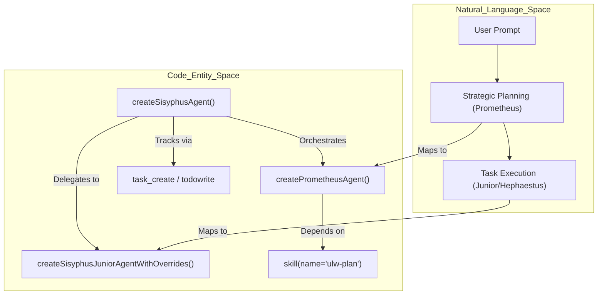

# Sisyphus (Main Orchestrator)

<details>
<summary>Relevant source files</summary>

The following files were used as context for generating this wiki page:

- [.omo/evidence/20260724-sisyphus-opus5-prompt/bun-test-full-suite-tail.txt](https://github.com/code-yeongyu/oh-my-openagent/blob/HEAD/.omo/evidence/20260724-sisyphus-opus5-prompt/bun-test-full-suite-tail.txt)
- [.omo/evidence/20260724-sisyphus-opus5-prompt/capture-fake-llm.mjs](https://github.com/code-yeongyu/oh-my-openagent/blob/HEAD/.omo/evidence/20260724-sisyphus-opus5-prompt/capture-fake-llm.mjs)
- [.omo/evidence/20260724-sisyphus-opus5-prompt/captured-system-prompt-excerpt.txt](https://github.com/code-yeongyu/oh-my-openagent/blob/HEAD/.omo/evidence/20260724-sisyphus-opus5-prompt/captured-system-prompt-excerpt.txt)
- [.omo/evidence/20260724-sisyphus-opus5-prompt/opencode-qa.md](https://github.com/code-yeongyu/oh-my-openagent/blob/HEAD/.omo/evidence/20260724-sisyphus-opus5-prompt/opencode-qa.md)
- [.omo/evidence/20260724-sisyphus-opus5-prompt/qa-run-output.txt](https://github.com/code-yeongyu/oh-my-openagent/blob/HEAD/.omo/evidence/20260724-sisyphus-opus5-prompt/qa-run-output.txt)
- [.omo/evidence/20260724-sisyphus-opus5-prompt/qa-run.sh](https://github.com/code-yeongyu/oh-my-openagent/blob/HEAD/.omo/evidence/20260724-sisyphus-opus5-prompt/qa-run.sh)
- [.omo/evidence/20260724-sisyphus-opus5-prompt/routing-before-after.txt](https://github.com/code-yeongyu/oh-my-openagent/blob/HEAD/.omo/evidence/20260724-sisyphus-opus5-prompt/routing-before-after.txt)
- [packages/ast-grep-mcp/AGENTS.md](https://github.com/code-yeongyu/oh-my-openagent/blob/HEAD/packages/ast-grep-mcp/AGENTS.md)
- [packages/model-core/src/model-family-detectors.test.ts](https://github.com/code-yeongyu/oh-my-openagent/blob/HEAD/packages/model-core/src/model-family-detectors.test.ts)
- [packages/model-core/src/model-family-detectors.ts](https://github.com/code-yeongyu/oh-my-openagent/blob/HEAD/packages/model-core/src/model-family-detectors.ts)
- [packages/omo-opencode/src/AGENTS.md](https://github.com/code-yeongyu/oh-my-openagent/blob/HEAD/packages/omo-opencode/src/AGENTS.md)
- [packages/omo-opencode/src/agents/AGENTS.md](https://github.com/code-yeongyu/oh-my-openagent/blob/HEAD/packages/omo-opencode/src/agents/AGENTS.md)
- [packages/omo-opencode/src/agents/atlas/AGENTS.md](https://github.com/code-yeongyu/oh-my-openagent/blob/HEAD/packages/omo-opencode/src/agents/atlas/AGENTS.md)
- [packages/omo-opencode/src/agents/atlas/agent.ts](https://github.com/code-yeongyu/oh-my-openagent/blob/HEAD/packages/omo-opencode/src/agents/atlas/agent.ts)
- [packages/omo-opencode/src/agents/atlas/atlas-prompt.test.ts](https://github.com/code-yeongyu/oh-my-openagent/blob/HEAD/packages/omo-opencode/src/agents/atlas/atlas-prompt.test.ts)
- [packages/omo-opencode/src/agents/atlas/prompt-routing.test.ts](https://github.com/code-yeongyu/oh-my-openagent/blob/HEAD/packages/omo-opencode/src/agents/atlas/prompt-routing.test.ts)
- [packages/omo-opencode/src/agents/atlas/prompt-runtime-injection.test.ts](https://github.com/code-yeongyu/oh-my-openagent/blob/HEAD/packages/omo-opencode/src/agents/atlas/prompt-runtime-injection.test.ts)
- [packages/omo-opencode/src/agents/prometheus/AGENTS.md](https://github.com/code-yeongyu/oh-my-openagent/blob/HEAD/packages/omo-opencode/src/agents/prometheus/AGENTS.md)
- [packages/omo-opencode/src/agents/sisyphus-agent-config.ts](https://github.com/code-yeongyu/oh-my-openagent/blob/HEAD/packages/omo-opencode/src/agents/sisyphus-agent-config.ts)
- [packages/omo-opencode/src/agents/sisyphus-agent-factory.test.ts](https://github.com/code-yeongyu/oh-my-openagent/blob/HEAD/packages/omo-opencode/src/agents/sisyphus-agent-factory.test.ts)
- [packages/omo-opencode/src/agents/sisyphus-agent-factory.ts](https://github.com/code-yeongyu/oh-my-openagent/blob/HEAD/packages/omo-opencode/src/agents/sisyphus-agent-factory.ts)
- [packages/omo-opencode/src/agents/sisyphus-junior/AGENTS.md](https://github.com/code-yeongyu/oh-my-openagent/blob/HEAD/packages/omo-opencode/src/agents/sisyphus-junior/AGENTS.md)
- [packages/omo-opencode/src/agents/sisyphus-junior/agent.ts](https://github.com/code-yeongyu/oh-my-openagent/blob/HEAD/packages/omo-opencode/src/agents/sisyphus-junior/agent.ts)
- [packages/omo-opencode/src/agents/sisyphus-junior/glm-5-2.ts](https://github.com/code-yeongyu/oh-my-openagent/blob/HEAD/packages/omo-opencode/src/agents/sisyphus-junior/glm-5-2.ts)
- [packages/omo-opencode/src/agents/sisyphus-junior/index.test.ts](https://github.com/code-yeongyu/oh-my-openagent/blob/HEAD/packages/omo-opencode/src/agents/sisyphus-junior/index.test.ts)
- [packages/omo-opencode/src/agents/sisyphus-junior/index.ts](https://github.com/code-yeongyu/oh-my-openagent/blob/HEAD/packages/omo-opencode/src/agents/sisyphus-junior/index.ts)
- [packages/omo-opencode/src/agents/sisyphus-junior/kimi-k2-7.ts](https://github.com/code-yeongyu/oh-my-openagent/blob/HEAD/packages/omo-opencode/src/agents/sisyphus-junior/kimi-k2-7.ts)
- [packages/omo-opencode/src/agents/sisyphus-junior/kimi-k3.ts](https://github.com/code-yeongyu/oh-my-openagent/blob/HEAD/packages/omo-opencode/src/agents/sisyphus-junior/kimi-k3.ts)
- [packages/omo-opencode/src/agents/sisyphus/glm-5-2.ts](https://github.com/code-yeongyu/oh-my-openagent/blob/HEAD/packages/omo-opencode/src/agents/sisyphus/glm-5-2.ts)
- [packages/omo-opencode/src/agents/sisyphus/index.ts](https://github.com/code-yeongyu/oh-my-openagent/blob/HEAD/packages/omo-opencode/src/agents/sisyphus/index.ts)
- [packages/omo-opencode/src/agents/sisyphus/kimi-k2-7.ts](https://github.com/code-yeongyu/oh-my-openagent/blob/HEAD/packages/omo-opencode/src/agents/sisyphus/kimi-k2-7.ts)
- [packages/omo-opencode/src/agents/types.test.ts](https://github.com/code-yeongyu/oh-my-openagent/blob/HEAD/packages/omo-opencode/src/agents/types.test.ts)
- [packages/omo-opencode/src/agents/types.ts](https://github.com/code-yeongyu/oh-my-openagent/blob/HEAD/packages/omo-opencode/src/agents/types.ts)
- [packages/omo-opencode/src/config-migration/AGENTS.md](https://github.com/code-yeongyu/oh-my-openagent/blob/HEAD/packages/omo-opencode/src/config-migration/AGENTS.md)
- [packages/omo-opencode/src/features/AGENTS.md](https://github.com/code-yeongyu/oh-my-openagent/blob/HEAD/packages/omo-opencode/src/features/AGENTS.md)
- [packages/omo-opencode/src/features/boulder-state/AGENTS.md](https://github.com/code-yeongyu/oh-my-openagent/blob/HEAD/packages/omo-opencode/src/features/boulder-state/AGENTS.md)
- [packages/omo-opencode/src/features/team-mode/AGENTS.md](https://github.com/code-yeongyu/oh-my-openagent/blob/HEAD/packages/omo-opencode/src/features/team-mode/AGENTS.md)
- [packages/omo-opencode/src/hooks/AGENTS.md](https://github.com/code-yeongyu/oh-my-openagent/blob/HEAD/packages/omo-opencode/src/hooks/AGENTS.md)
- [packages/omo-opencode/src/hooks/auto-update-checker/AGENTS.md](https://github.com/code-yeongyu/oh-my-openagent/blob/HEAD/packages/omo-opencode/src/hooks/auto-update-checker/AGENTS.md)
- [packages/omo-opencode/src/hooks/keyword-detector/AGENTS.md](https://github.com/code-yeongyu/oh-my-openagent/blob/HEAD/packages/omo-opencode/src/hooks/keyword-detector/AGENTS.md)
- [packages/omo-opencode/src/hooks/keyword-detector/ultrawork/default.ts](https://github.com/code-yeongyu/oh-my-openagent/blob/HEAD/packages/omo-opencode/src/hooks/keyword-detector/ultrawork/default.ts)
- [packages/omo-opencode/src/hooks/keyword-detector/ultrawork/gemini.ts](https://github.com/code-yeongyu/oh-my-openagent/blob/HEAD/packages/omo-opencode/src/hooks/keyword-detector/ultrawork/gemini.ts)
- [packages/omo-opencode/src/hooks/keyword-detector/ultrawork/gpt.ts](https://github.com/code-yeongyu/oh-my-openagent/blob/HEAD/packages/omo-opencode/src/hooks/keyword-detector/ultrawork/gpt.ts)
- [packages/omo-opencode/src/hooks/keyword-detector/ultrawork/planner.ts](https://github.com/code-yeongyu/oh-my-openagent/blob/HEAD/packages/omo-opencode/src/hooks/keyword-detector/ultrawork/planner.ts)
- [packages/prompts-core/package.json](https://github.com/code-yeongyu/oh-my-openagent/blob/HEAD/packages/prompts-core/package.json)
- [packages/prompts-core/prompts/mode/hyperplan.md](https://github.com/code-yeongyu/oh-my-openagent/blob/HEAD/packages/prompts-core/prompts/mode/hyperplan.md)
- [packages/prompts-core/prompts/mode/team.md](https://github.com/code-yeongyu/oh-my-openagent/blob/HEAD/packages/prompts-core/prompts/mode/team.md)
- [packages/prompts-core/src/__test_fixtures__/test-prompt/default.md](https://github.com/code-yeongyu/oh-my-openagent/blob/HEAD/packages/prompts-core/src/__test_fixtures__/test-prompt/default.md)
- [packages/prompts-core/src/__test_fixtures__/test-prompt/gpt.md](https://github.com/code-yeongyu/oh-my-openagent/blob/HEAD/packages/prompts-core/src/__test_fixtures__/test-prompt/gpt.md)
- [packages/prompts-core/src/atlas-prompts.ts](https://github.com/code-yeongyu/oh-my-openagent/blob/HEAD/packages/prompts-core/src/atlas-prompts.ts)
- [packages/prompts-core/src/index.ts](https://github.com/code-yeongyu/oh-my-openagent/blob/HEAD/packages/prompts-core/src/index.ts)
- [packages/prompts-core/src/loader.test.ts](https://github.com/code-yeongyu/oh-my-openagent/blob/HEAD/packages/prompts-core/src/loader.test.ts)
- [packages/prompts-core/src/loader.ts](https://github.com/code-yeongyu/oh-my-openagent/blob/HEAD/packages/prompts-core/src/loader.ts)
- [packages/prompts-core/src/mode-prompts.ts](https://github.com/code-yeongyu/oh-my-openagent/blob/HEAD/packages/prompts-core/src/mode-prompts.ts)
- [packages/prompts-core/src/types.ts](https://github.com/code-yeongyu/oh-my-openagent/blob/HEAD/packages/prompts-core/src/types.ts)
- [packages/prompts-core/src/variant-resolver.test.ts](https://github.com/code-yeongyu/oh-my-openagent/blob/HEAD/packages/prompts-core/src/variant-resolver.test.ts)
- [packages/prompts-core/src/variant-resolver.ts](https://github.com/code-yeongyu/oh-my-openagent/blob/HEAD/packages/prompts-core/src/variant-resolver.ts)

</details>


## Purpose and Scope

This page documents **Sisyphus**, the main orchestrator agent in Oh My OpenCode. Sisyphus is responsible for interpreting user requests, orchestrating specialized subagents, tools, and skills to accomplish tasks effectively. It acts as the default, primary agent interacting with users, leveraging a delegation-first strategy to achieve high-quality outcomes.

---

## Overview

Sisyphus is designed as the primary **orchestrator** that balances task decomposition, delegation, parallel execution, and verification. Instead of performing deep implementation work directly, Sisyphus routes subtasks to more specialized agents or skills while supervising the workflow and verifying results. This model ensures outputs indistinguishable from those of senior human engineers, emphasizing correctness and precision.

| Characteristic | Value | Reference |
|---|---|---|
| **Mode** | `primary` | Default main orchestrator mode [packages/omo-opencode/src/agents/types.ts:61-61](https://github.com/code-yeongyu/oh-my-openagent/blob/HEAD/packages/omo-opencode/src/agents/types.ts#L61) |
| **Cost Tier** | `EXPENSIVE` | Uses high-capability large models [packages/omo-opencode/src/agents/types.ts:83-83](https://github.com/code-yeongyu/oh-my-openagent/blob/HEAD/packages/omo-opencode/src/agents/types.ts#L83) |
| **Default Models** | Claude Opus 5, GPT-5.6-sol, Kimi K3 | Model-family-specific prompt adaptations [packages/omo-opencode/src/agents/AGENTS.md:22-22](https://github.com/code-yeongyu/oh-my-openagent/blob/HEAD/packages/omo-opencode/src/agents/AGENTS.md#L22) |
| **Core Strategy** | Delegation-First | Senior engineer role who scales via delegation [packages/omo-opencode/src/agents/sisyphus-agent-factory.ts:1-40](https://github.com/code-yeongyu/oh-my-openagent/blob/HEAD/packages/omo-opencode/src/agents/sisyphus-agent-factory.ts#L1-L40) |
| **Execution Style** | Parallel task execution | Parallelize independent reads and agent fires [packages/omo-opencode/src/agents/sisyphus-agent-factory.test.ts:59-67](https://github.com/code-yeongyu/oh-my-openagent/blob/HEAD/packages/omo-opencode/src/agents/sisyphus-agent-factory.test.ts#L59-L67) |

Sources:
[packages/omo-opencode/src/agents/AGENTS.md:22-22](https://github.com/code-yeongyu/oh-my-openagent/blob/HEAD/packages/omo-opencode/src/agents/AGENTS.md#L22),
[packages/omo-opencode/src/agents/types.ts:61-83](https://github.com/code-yeongyu/oh-my-openagent/blob/HEAD/packages/omo-opencode/src/agents/types.ts#L61-L83),
[packages/omo-opencode/src/agents/sisyphus-agent-factory.test.ts:59-67](https://github.com/code-yeongyu/oh-my-openagent/blob/HEAD/packages/omo-opencode/src/agents/sisyphus-agent-factory.test.ts#L59-L67),
[packages/omo-opencode/src/agents/sisyphus-agent-factory.ts:1-40](https://github.com/code-yeongyu/oh-my-openagent/blob/HEAD/packages/omo-opencode/src/agents/sisyphus-agent-factory.ts#L1-L40)

---

## Architecture

### Configuration and Creation Pipeline

Sisyphus is built through a **factory pattern** that performs:

- **Model resolution**: The `resolveSisyphusPromptFamily` function maps specific model names to prompt families (e.g., `kimi-k3`, `gpt-5-5`, `claude-opus-4-8`) [packages/omo-opencode/src/agents/sisyphus-agent-factory.ts:62-74](https://github.com/code-yeongyu/oh-my-openagent/blob/HEAD/packages/omo-opencode/src/agents/sisyphus-agent-factory.ts#L62-L74) (Note: `gpt-5-5` is now `gpt-5-6-sol` in `AGENTS.md`).
- **Dynamic prompt construction**: Crafts the entire system prompt tailored to the resolved model and the available agents, tools, categories, and skills [packages/omo-opencode/src/agents/sisyphus-agent-factory.ts:89-163](https://github.com/code-yeongyu/oh-my-openagent/blob/HEAD/packages/omo-opencode/src/agents/sisyphus-agent-factory.ts#L89-L163) (Note: `buildGptSisyphusAgentConfig` is now `buildGptSisyphusPrompt`).
- **Permission setup**: Applies fine-grained permissions; Sisyphus is explicitly denied `call_omo_agent` to prevent recursive orchestration loops, though its junior variant `sisyphus-junior` is allowed it for exploration [packages/omo-opencode/src/agents/sisyphus-agent-factory.test.ts:26-29](https://github.com/code-yeongyu/oh-my-openagent/blob/HEAD/packages/omo-opencode/src/agents/sisyphus-agent-factory.test.ts#L26-L29), [packages/omo-opencode/src/agents/sisyphus-junior/agent.ts:137-137](https://github.com/code-yeongyu/oh-my-openagent/blob/HEAD/packages/omo-opencode/src/agents/sisyphus-junior/agent.ts#L137).

The agent configuration is created via `createSisyphusAgent`, which selects the appropriate config builder (e.g., `buildGptSisyphusPrompt`) and prompt builder (e.g., `buildKimiK3SisyphusPrompt`) [packages/omo-opencode/src/agents/sisyphus-agent-factory.ts:76-164](https://github.com/code-yeongyu/oh-my-openagent/blob/HEAD/packages/omo-opencode/src/agents/sisyphus-agent-factory.ts#L76-L164).

#### System Integration Diagram: Creation Flow from Configuration to Agent Object

```mermaid
graph TD
    subgraph Config_Sources ["Config_Sources"]
        Config1["OhMyOpenCodeConfig"]
        Config2["AgentOverrideConfig"]
    end

    subgraph Factory_Logic ["Factory_Logic"]
        CreateSisyphusAgent["createSisyphusAgent()"]
        ResolveModel["resolveSisyphusPromptFamily()"]
        GptPrompt["buildGptSisyphusPrompt()"]
        ClaudePrompt["buildClaudeSisyphusPrompt()"]
        KimiK3Prompt["buildKimiK3SisyphusPrompt()"]
        GlmPrompt["buildGlmSisyphusPrompt()"]
        DynamicPrompt["Dynamic Prompt Generation"]

        CreateSisyphusAgent --> ResolveModel
        ResolveModel -- "gpt-5-5/5-6" --> GptPrompt
        ResolveModel -- "claude-opus-4-8/5" --> ClaudePrompt
        ResolveModel -- "kimi-k3" --> KimiK3Prompt
        ResolveModel -- "glm-5-2" --> GlmPrompt

        GptPrompt --> DynamicPrompt
        ClaudePrompt --> DynamicPrompt
        KimiK3Prompt --> DynamicPrompt
        GlmPrompt --> DynamicPrompt

        DynamicPrompt --> AgentConfig["Final AgentConfig Object"]
        CreateSisyphusAgent --> AgentConfig

        Factory_Logic -.-> Permissions["createSisyphusAgent.permission"]
        Permissions --> AgentConfig
    end

    Config_Sources --> CreateSisyphusAgent
```

Sources:
[packages/omo-opencode/src/agents/sisyphus-agent-factory.ts:62-164](https://github.com/code-yeongyu/oh-my-openagent/blob/HEAD/packages/omo-opencode/src/agents/sisyphus-agent-factory.ts#L62-L164),
[packages/omo-opencode/src/agents/sisyphus-agent-factory.test.ts:26-29](https://github.com/code-yeongyu/oh-my-openagent/blob/HEAD/packages/omo-opencode/src/agents/sisyphus-agent-factory.test.ts#L26-L29),
[packages/omo-opencode/src/agents/sisyphus-junior/agent.ts:137-137](https://github.com/code-yeongyu/oh-my-openagent/blob/HEAD/packages/omo-opencode/src/agents/sisyphus-junior/agent.ts#L137)

---

### Dynamic Prompt Construction

The core Sisyphus prompt applies multiple organized sections built dynamically according to model family and available resources:

- **Agent Identity and Role**: States "Sisyphus" as orchestration lead running on specific hardware (e.g., Kimi K2.7) [packages/omo-opencode/src/agents/sisyphus-agent-factory.test.ts:46-48](https://github.com/code-yeongyu/oh-my-openagent/blob/HEAD/packages/omo-opencode/src/agents/sisyphus-agent-factory.test.ts#L46-L48) (Note: `sisyphus-junior` is the one that explicitly states "running on Kimi K2.7" in its prompt, Sisyphus itself uses more general phrasing).
- **Operating Rules & Constraints**: Specifies principles like "running on Kimi K3" or specific calibration blocks [packages/omo-opencode/src/agents/sisyphus-agent-factory.test.ts:39-39](https://github.com/code-yeongyu/oh-my-openagent/blob/HEAD/packages/omo-opencode/src/agents/sisyphus-agent-factory.test.ts#L39).
- **Task Tracking**: Uses specific guides for task management via `task_create` or `todowrite` [packages/omo-opencode/src/agents/sisyphus-agent-factory.test.ts:86-103](https://github.com/code-yeongyu/oh-my-openagent/blob/HEAD/packages/omo-opencode/src/agents/sisyphus-agent-factory.test.ts#L86-L103).
- **Ultrawork Mode**: A high-precision mode requiring strict model-specific prompts (e.g., `ULTRAWORK_GEMINI_PROMPT`, `ULTRAWORK_GPT_PROMPT`) [packages/prompts-core/src/index.ts:18-22](https://github.com/code-yeongyu/oh-my-openagent/blob/HEAD/packages/prompts-core/src/index.ts#L18-L22).

Sources:
[packages/omo-opencode/src/agents/sisyphus-agent-factory.test.ts:46-103](https://github.com/code-yeongyu/oh-my-openagent/blob/HEAD/packages/omo-opencode/src/agents/sisyphus-agent-factory.test.ts#L46-L103),
[packages/prompts-core/src/index.ts:18-22](https://github.com/code-yeongyu/oh-my-openagent/blob/HEAD/packages/prompts-core/src/index.ts#L18-L22),
[packages/omo-opencode/src/agents/sisyphus-agent-factory.ts:89-163](https://github.com/code-yeongyu/oh-my-openagent/blob/HEAD/packages/omo-opencode/src/agents/sisyphus-agent-factory.ts#L89-L163)

---

## Core Workflows

### Delegation Protocol

Sisyphus adopts a **delegation-first** approach:

- **Specialist Routing**: Sisyphus delegates tasks to specialized agents like `hephaestus`, `oracle`, or `librarian` [packages/omo-opencode/src/agents/types.ts:148-157](https://github.com/code-yeongyu/oh-my-openagent/blob/HEAD/packages/omo-opencode/src/agents/types.ts#L148-L157).
- **Junior Execution**: For focused task execution without further delegation, Sisyphus utilizes `sisyphus-junior` [packages/omo-opencode/src/agents/sisyphus-junior/agent.ts:2-5](https://github.com/code-yeongyu/oh-my-openagent/blob/HEAD/packages/omo-opencode/src/agents/sisyphus-junior/agent.ts#L2-L5).
- **Parallel Tracks**: Orchestrates multiple subagents and tools simultaneously to minimize latency.

Sources:
[packages/omo-opencode/src/agents/types.ts:148-157](https://github.com/code-yeongyu/oh-my-openagent/blob/HEAD/packages/omo-opencode/src/agents/types.ts#L148-L157),
[packages/omo-opencode/src/agents/sisyphus-junior/agent.ts:2-5](https://github.com/code-yeongyu/oh-my-openagent/blob/HEAD/packages/omo-opencode/src/agents/sisyphus-junior/agent.ts#L2-L5)

---

## Model-Specific Sisyphus Prompt Variants

Sisyphus dynamically adapts the system prompt depending on the resolved model family.

### GPT-5.4/5.5 Variant
- Sets `reasoningEffort: "medium"` by default [packages/omo-opencode/src/agents/sisyphus-agent-factory.test.ts:138-138](https://github.com/code-yeongyu/oh-my-openagent/blob/HEAD/packages/omo-opencode/src/agents/sisyphus-agent-factory.test.ts#L138).
- Includes specific prompt anchors like `## Validating your work` and `## Task tracking` [packages/omo-opencode/src/agents/sisyphus-agent-factory.test.ts:50-51](https://github.com/code-yeongyu/oh-my-openagent/blob/HEAD/packages/omo-opencode/src/agents/sisyphus-agent-factory.test.ts#L50-L51).

### Gemini Variant
- Injects Gemini-specific corrective anchors: `<TOOL_CALL_MANDATE>`, `<GEMINI_TOOL_GUIDE>`, and `<GEMINI_DELEGATION_OVERRIDE>` [packages/omo-opencode/src/agents/sisyphus-agent-factory.test.ts:192-194](https://github.com/code-yeongyu/oh-my-openagent/blob/HEAD/packages/omo-opencode/src/agents/sisyphus-agent-factory.test.ts#L192-L194).

### Claude Variant
- Uses XML anchors like `<use_parallel_tool_calls>` and `<Task_Management>` [packages/omo-opencode/src/agents/sisyphus-agent-factory.test.ts:59-67](https://github.com/code-yeongyu/oh-my-openagent/blob/HEAD/packages/omo-opencode/src/agents/sisyphus-agent-factory.test.ts#L59-L67).
- `claude-sonnet-4-6` specifically enables the thinking budget, whereas `opus-4-7` and later models (including Fable/Mythos) do not, letting OpenCode core drive adaptive thinking [packages/omo-opencode/src/agents/types.ts:46-53](https://github.com/code-yeongyu/oh-my-openagent/blob/HEAD/packages/omo-opencode/src/agents/types.ts#L46-L53), [packages/omo-opencode/src/agents/sisyphus-agent-factory.test.ts:155-162](https://github.com/code-yeongyu/oh-my-openagent/blob/HEAD/packages/omo-opencode/src/agents/sisyphus-agent-factory.test.ts#L155-L162).

### Kimi K2/K2.7/K3 Variants
- **Kimi K3**: Includes `<k3_calibration>` anchors for terminal condition handling [packages/omo-opencode/src/agents/sisyphus-agent-factory.test.ts:39-39](https://github.com/code-yeongyu/oh-my-openagent/blob/HEAD/packages/omo-opencode/src/agents/sisyphus-agent-factory.test.ts#L39). Identifies itself as "running on Kimi K3" [packages/omo-opencode/src/agents/sisyphus-agent-factory.test.ts:114-114](https://github.com/code-yeongyu/oh-my-openagent/blob/HEAD/packages/omo-opencode/src/agents/sisyphus-agent-factory.test.ts#L114).
- **Kimi K2.7**: Includes "running on Kimi K2.7" and `<operating_rules>` [packages/omo-opencode/src/agents/sisyphus-agent-factory.test.ts:48-48](https://github.com/code-yeongyu/oh-my-openagent/blob/HEAD/packages/omo-opencode/src/agents/sisyphus-agent-factory.test.ts#L48).
- **Kimi K2.x (e.g., K2.6)**: Includes `<re_entry_rule>` and `<verification_loop>` [packages/omo-opencode/src/agents/sisyphus-agent-factory.test.ts:43-43](https://github.com/code-yeongyu/oh-my-openagent/blob/HEAD/packages/omo-opencode/src/agents/sisyphus-agent-factory.test.ts#L43).

Sources:
[packages/omo-opencode/src/agents/sisyphus-agent-factory.test.ts:34-194](https://github.com/code-yeongyu/oh-my-openagent/blob/HEAD/packages/omo-opencode/src/agents/sisyphus-agent-factory.test.ts#L34-L194),
[packages/omo-opencode/src/agents/types.ts:46-53](https://github.com/code-yeongyu/oh-my-openagent/blob/HEAD/packages/omo-opencode/src/agents/types.ts#L46-L53),
[packages/omo-opencode/src/agents/sisyphus-agent-factory.ts:89-163](https://github.com/code-yeongyu/oh-my-openagent/blob/HEAD/packages/omo-opencode/src/agents/sisyphus-agent-factory.ts#L89-L163)

---

## Task Creation and Verification Loops

Sisyphus advances work by creating explicit tasks and tracking progress. This is often paired with the **Prometheus** (Planning Agent) for strategic planning.

### Planning Integration
Sisyphus coordinates with Prometheus, who acts as a planning consultant:
- **ulw-plan skill**: Prometheus is mandated to load and follow the `ulw-plan` skill for every session [packages/omo-opencode/src/agents/prometheus/AGENTS.md:10-10](https://github.com/code-yeongyu/oh-my-openagent/blob/HEAD/packages/omo-opencode/src/agents/prometheus/AGENTS.md#L10).
- **Implementation Loophole**: Prometheus is strictly forbidden from implementing code directly or by proxy via subagents [packages/omo-opencode/src/agents/prometheus/AGENTS.md:11-11](https://github.com/code-yeongyu/oh-my-openagent/blob/HEAD/packages/omo-opencode/src/agents/prometheus/AGENTS.md#L11).

### Diagram: Natural Language to Code Entity Space Mapping



Sources:
[packages/omo-opencode/src/agents/sisyphus-agent-factory.ts:76-164](https://github.com/code-yeongyu/oh-my-openagent/blob/HEAD/packages/omo-opencode/src/agents/sisyphus-agent-factory.ts#L76-L164),
[packages/omo-opencode/src/agents/prometheus/AGENTS.md:10-11](https://github.com/code-yeongyu/oh-my-openagent/blob/HEAD/packages/omo-opencode/src/agents/prometheus/AGENTS.md#L10-L11),
[packages/omo-opencode/src/agents/sisyphus-junior/index.ts:109-175](https://github.com/code-yeongyu/oh-my-openagent/blob/HEAD/packages/omo-opencode/src/agents/sisyphus-junior/index.ts#L109-L175)

---

## Testing and Verification

Robust unit tests ensure Sisyphus's behavior and prompt correctness:

- **Factory Contract**: Verifies `createSisyphusAgent` exposes the `primary` facade and sets appropriate token limits (64k) [packages/omo-opencode/src/agents/sisyphus-agent-factory.test.ts:13-30](https://github.com/code-yeongyu/oh-my-openagent/blob/HEAD/packages/omo-opencode/src/agents/sisyphus-agent-factory.test.ts#L13-L30).
- **Prompt Routing**: Ensures specific model families (Kimi K3, GPT-5.5, Claude Opus 4.8) receive their specialized prompt anchors [packages/omo-opencode/src/agents/sisyphus-agent-factory.test.ts:34-84](https://github.com/code-yeongyu/oh-my-openagent/blob/HEAD/packages/omo-opencode/src/agents/sisyphus-agent-factory.test.ts#L34-L84).
- **Junior Overrides**: Confirms `sisyphus-junior` correctly applies model, temperature, and reasoning effort overrides while forcing `subagent` mode [packages/omo-opencode/src/agents/sisyphus-junior/index.test.ts:9-145](https://github.com/code-yeongyu/oh-my-openagent/blob/HEAD/packages/omo-opencode/src/agents/sisyphus-junior/index.test.ts#L9-L145).

Sources:
[packages/omo-opencode/src/agents/sisyphus-agent-factory.test.ts:13-84](https://github.com/code-yeongyu/oh-my-openagent/blob/HEAD/packages/omo-opencode/src/agents/sisyphus-agent-factory.test.ts#L13-L84),
[packages/omo-opencode/src/agents/sisyphus-junior/index.test.ts:9-145](https://github.com/code-yeongyu/oh-my-openagent/blob/HEAD/packages/omo-opencode/src/agents/sisyphus-junior/index.test.ts#L9-L145)