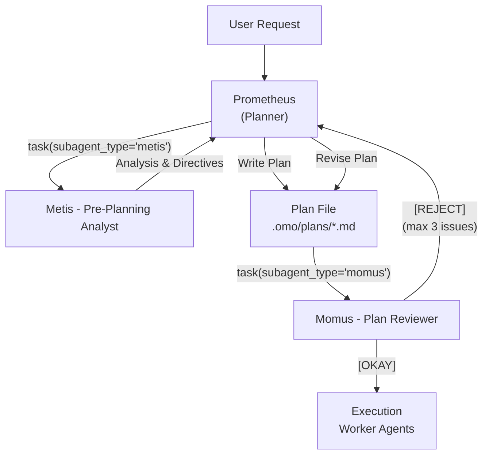
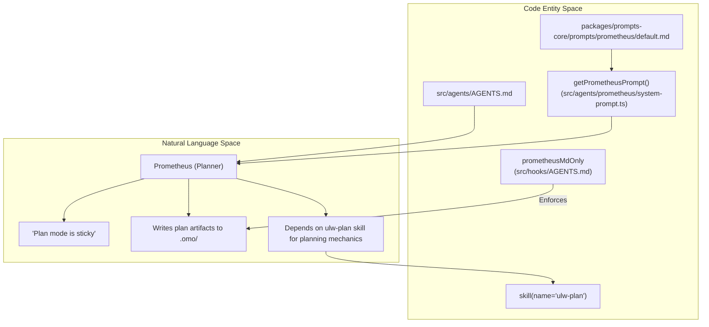
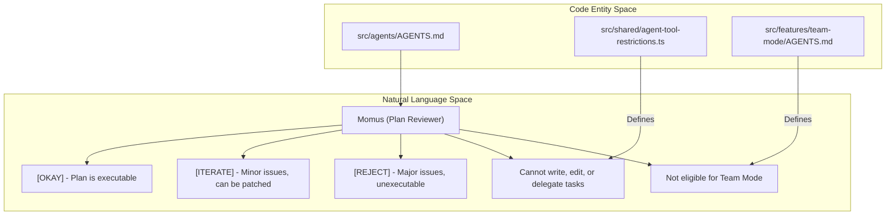
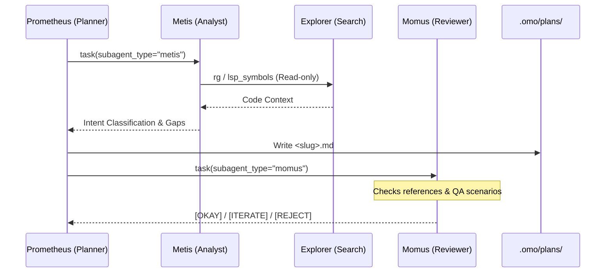

# Planning Agents

Relevant source files

The following files were used as context for generating this wiki page:

- [packages/ast-grep-mcp/AGENTS.md](https://github.com/code-yeongyu/oh-my-openagent/blob/HEAD/packages/ast-grep-mcp/AGENTS.md)
- [packages/omo-opencode/src/AGENTS.md](https://github.com/code-yeongyu/oh-my-openagent/blob/HEAD/packages/omo-opencode/src/AGENTS.md)
- [packages/omo-opencode/src/agents/AGENTS.md](https://github.com/code-yeongyu/oh-my-openagent/blob/HEAD/packages/omo-opencode/src/agents/AGENTS.md)
- [packages/omo-opencode/src/agents/index.ts](https://github.com/code-yeongyu/oh-my-openagent/blob/HEAD/packages/omo-opencode/src/agents/index.ts)
- [packages/omo-opencode/src/agents/prometheus/AGENTS.md](https://github.com/code-yeongyu/oh-my-openagent/blob/HEAD/packages/omo-opencode/src/agents/prometheus/AGENTS.md)
- [packages/omo-opencode/src/agents/prometheus/index.ts](https://github.com/code-yeongyu/oh-my-openagent/blob/HEAD/packages/omo-opencode/src/agents/prometheus/index.ts)
- [packages/omo-opencode/src/agents/prometheus/system-prompt.test.ts](https://github.com/code-yeongyu/oh-my-openagent/blob/HEAD/packages/omo-opencode/src/agents/prometheus/system-prompt.test.ts)
- [packages/omo-opencode/src/agents/prometheus/system-prompt.ts](https://github.com/code-yeongyu/oh-my-openagent/blob/HEAD/packages/omo-opencode/src/agents/prometheus/system-prompt.ts)
- [packages/omo-opencode/src/config-migration/AGENTS.md](https://github.com/code-yeongyu/oh-my-openagent/blob/HEAD/packages/omo-opencode/src/config-migration/AGENTS.md)
- [packages/omo-opencode/src/features/AGENTS.md](https://github.com/code-yeongyu/oh-my-openagent/blob/HEAD/packages/omo-opencode/src/features/AGENTS.md)
- [packages/omo-opencode/src/features/boulder-state/AGENTS.md](https://github.com/code-yeongyu/oh-my-openagent/blob/HEAD/packages/omo-opencode/src/features/boulder-state/AGENTS.md)
- [packages/omo-opencode/src/features/team-mode/AGENTS.md](https://github.com/code-yeongyu/oh-my-openagent/blob/HEAD/packages/omo-opencode/src/features/team-mode/AGENTS.md)
- [packages/omo-opencode/src/hooks/AGENTS.md](https://github.com/code-yeongyu/oh-my-openagent/blob/HEAD/packages/omo-opencode/src/hooks/AGENTS.md)
- [packages/omo-opencode/src/hooks/auto-update-checker/AGENTS.md](https://github.com/code-yeongyu/oh-my-openagent/blob/HEAD/packages/omo-opencode/src/hooks/auto-update-checker/AGENTS.md)
- [packages/omo-opencode/src/hooks/keyword-detector/AGENTS.md](https://github.com/code-yeongyu/oh-my-openagent/blob/HEAD/packages/omo-opencode/src/hooks/keyword-detector/AGENTS.md)
- [packages/omo-opencode/src/shared/dist-bundle-prompt-content.test.ts](https://github.com/code-yeongyu/oh-my-openagent/blob/HEAD/packages/omo-opencode/src/shared/dist-bundle-prompt-content.test.ts)
- [packages/prompts-core/prompts/prometheus/default.md](https://github.com/code-yeongyu/oh-my-openagent/blob/HEAD/packages/prompts-core/prompts/prometheus/default.md)
- [packages/prompts-core/src/prometheus-prompts.ts](https://github.com/code-yeongyu/oh-my-openagent/blob/HEAD/packages/prompts-core/src/prometheus-prompts.ts)

Planning agents provide strategic planning, pre-execution consultation, and plan review capabilities. This page covers the three core planning agents: **Prometheus** (strategic planner), **Metis** (pre-planning analyst), and **Momus** (plan reviewer). These agents work collaboratively to ensure that execution plans are thorough, unambiguous, and executable with zero further interview.

---

## Overview

The planning agents form a triage and refinement pipeline enabling the transformation of vague, large, or ambiguous user requests into one **decision-complete** markdown work plan that can be faithfully executed by downstream worker agents without human intervention.

| Agent | Mode | Default Model | Temp | Fallback (after default) | Purpose |
| :--- | :--- | :--- | :--- | :--- | :--- |
| **Prometheus** | `primary` | `claude-fable-5 xhigh` | (override-only) | `kimi-k3 max` | Strategic planner (interview); built via `buildPrometheusAgentConfig` (not in `agentSources`) |
| **Metis** | `subagent` | `claude-opus-5 high` | `0.3` | `kimi-k3 low` | Pre-planning consultant |
| **Momus** | `subagent` | `gpt-5.6-terra high` | `0.1` | `gpt-5.6-sol xhigh` (high on Copilot) → `claude-opus-5 max` → `gemini-3.1-pro high` → `glm-5.2` | Plan reviewer |

### Planning Workflow

This workflow ensures robustness: Metis analyzes and validates before plan generation, Prometheus synthesizes the plan, and Momus strictly reviews it before passing to execution agents.

Sources:
[packages/omo-opencode/src/agents/AGENTS.md:28-32](https://github.com/code-yeongyu/oh-my-openagent/blob/HEAD/packages/omo-opencode/src/agents/AGENTS.md#L28-L32), [packages/omo-opencode/src/agents/AGENTS.md:34-35](https://github.com/code-yeongyu/oh-my-openagent/blob/HEAD/packages/omo-opencode/src/agents/AGENTS.md#L34-L35)

---

## Prometheus: Strategic Planner

Prometheus serves as the **primary agent** responsible for strategic planning. It converts vague or large user requests into **one decision-complete work plan**, represented as markdown files under `.omo/plans/`.

### Implementation Details

-   **System Prompt and Identity:** Prometheus is a planning consultant that depends on the shared `ulw-plan` skill. It is strictly a planner and never an implementer—it is explicitly forbidden from editing product code directly or by proxy via subagents [packages/prompts-core/prompts/prometheus/default.md:1-6](https://github.com/code-yeongyu/oh-my-openagent/blob/HEAD/packages/prompts-core/prompts/prometheus/default.md#L1-L6). The `getPrometheusPrompt` function is responsible for loading this prompt [packages/omo-opencode/src/agents/prometheus/system-prompt.ts:20-24](https://github.com/code-yeongyu/oh-my-openagent/blob/HEAD/packages/omo-opencode/src/agents/prometheus/system-prompt.ts#L20-L24).
-   **Model Resolution:** Prometheus's default model is `claude-fable-5 xhigh`, with `kimi-k3 max` as a fallback [packages/omo-opencode/src/agents/AGENTS.md:34-34](https://github.com/code-yeongyu/oh-my-openagent/blob/HEAD/packages/omo-opencode/src/agents/AGENTS.md#L34). Its temperature is "override-only" [packages/omo-opencode/src/agents/AGENTS.md:34-34](https://github.com/code-yeongyu/oh-my-openagent/blob/HEAD/packages/omo-opencode/src/agents/AGENTS.md#L34).
-   **Plan Mode Enforcement:** The prompt enforces that "plan mode is sticky"—all requests like "do X" or "fix X" are interpreted as "plan X" [packages/prompts-core/prompts/prometheus/default.md:3-3](https://github.com/code-yeongyu/oh-my-openagent/blob/HEAD/packages/prompts-core/prompts/prometheus/default.md#L3).
-   **Skill Dependency:** Prometheus's first action in every planning session is to call `skill(name="ulw-plan")` to load its operational logic [packages/prompts-core/prompts/prometheus/default.md:5-5](https://github.com/code-yeongyu/oh-my-openagent/blob/HEAD/packages/prompts-core/prompts/prometheus/default.md#L5). This skill is the source of truth for exploration, intent routing, approval gates, plan templates, and review [packages/prompts-core/prompts/prometheus/default.md:5-5](https://github.com/code-yeongyu/oh-my-openagent/blob/HEAD/packages/prompts-core/prompts/prometheus/default.md#L5).
-   **File Restrictions:** Prometheus is restricted to creating/editing `.md` files, enforced by the `prometheusMdOnly` hook [packages/omo-opencode/src/hooks/AGENTS.md:44-44](https://github.com/code-yeongyu/oh-my-openagent/blob/HEAD/packages/omo-opencode/src/hooks/AGENTS.md#L44). It is forbidden from writing to `src/`, `package.json`, or config files [packages/omo-opencode/src/agents/prometheus/AGENTS.md:50-51](https://github.com/code-yeongyu/oh-my-openagent/blob/HEAD/packages/omo-opencode/src/agents/prometheus/AGENTS.md#L50-L51).

### Plan Generation
Prometheus's planning mechanics are primarily driven by the `ulw-plan` skill, which dictates:
-   Explore-first planning and when to ask the user [packages/omo-opencode/src/agents/prometheus/AGENTS.md:38-38](https://github.com/code-yeongyu/oh-my-openagent/blob/HEAD/packages/omo-opencode/src/agents/prometheus/AGENTS.md#L38).
-   Clear versus unclear intent routing [packages/omo-opencode/src/agents/prometheus/AGENTS.md:39-39](https://github.com/code-yeongyu/oh-my-openagent/blob/HEAD/packages/omo-opencode/src/agents/prometheus/AGENTS.md#L39).
-   Approval-gated plan generation [packages/omo-opencode/src/agents/prometheus/AGENTS.md:40-40](https://github.com/code-yeongyu/oh-my-openagent/blob/HEAD/packages/omo-opencode/src/agents/prometheus/AGENTS.md#L40).
-   Plan/draft scaffold creation under `.omo/` [packages/omo-opencode/src/agents/prometheus/AGENTS.md:41-41](https://github.com/code-yeongyu/oh-my-openagent/blob/HEAD/packages/omo-opencode/src/agents/prometheus/AGENTS.md#L41).
-   High-accuracy review expectations [packages/omo-opencode/src/agents/prometheus/AGENTS.md:42-42](https://github.com/code-yeongyu/oh-my-openagent/blob/HEAD/packages/omo-opencode/src/agents/prometheus/AGENTS.md#L42).
-   Worker-ready task graphs and verification criteria [packages/omo-opencode/src/agents/prometheus/AGENTS.md:43-43](https://github.com/code-yeongyu/oh-my-openagent/blob/HEAD/packages/omo-opencode/src/agents/prometheus/AGENTS.md#L43).

Sources:
[packages/prompts-core/prompts/prometheus/default.md:1-6](https://github.com/code-yeongyu/oh-my-openagent/blob/HEAD/packages/prompts-core/prompts/prometheus/default.md#L1-L6), [packages/omo-opencode/src/agents/prometheus/system-prompt.ts:20-24](https://github.com/code-yeongyu/oh-my-openagent/blob/HEAD/packages/omo-opencode/src/agents/prometheus/system-prompt.ts#L20-L24), [packages/omo-opencode/src/agents/AGENTS.md:34-34](https://github.com/code-yeongyu/oh-my-openagent/blob/HEAD/packages/omo-opencode/src/agents/AGENTS.md#L34), [packages/omo-opencode/src/hooks/AGENTS.md:44-44](https://github.com/code-yeongyu/oh-my-openagent/blob/HEAD/packages/omo-opencode/src/hooks/AGENTS.md#L44), [packages/omo-opencode/src/agents/prometheus/AGENTS.md:50-51](https://github.com/code-yeongyu/oh-my-openagent/blob/HEAD/packages/omo-opencode/src/agents/prometheus/AGENTS.md#L50-L51), [packages/omo-opencode/src/agents/prometheus/AGENTS.md:38-43](https://github.com/code-yeongyu/oh-my-openagent/blob/HEAD/packages/omo-opencode/src/agents/prometheus/AGENTS.md#L38-L43)

---

## Metis: Pre-Planning Analyst

Metis is a **subagent** specializing in early-stage task analysis. It acts as a pre-planning analyst to detect contradictions and clarify requirements before the heavy lifting of strategic planning begins.

### Implementation Details

-   **Role:** Pre-planning consultant [packages/omo-opencode/src/agents/AGENTS.md:32-32](https://github.com/code-yeongyu/oh-my-openagent/blob/HEAD/packages/omo-opencode/src/agents/AGENTS.md#L32).
-   **Model Configuration:** Metis defaults to `claude-opus-5 high` with a temperature of `0.3`, and `kimi-k3 low` as a fallback [packages/omo-opencode/src/agents/AGENTS.md:32-32](https://github.com/code-yeongyu/oh-my-openagent/blob/HEAD/packages/omo-opencode/src/agents/AGENTS.md#L32).
-   **Tool Restrictions:** Metis is a read-only agent and is `hard-reject` for team mode, meaning it cannot write to mailboxes and delegates via `task` instead [packages/omo-opencode/src/features/team-mode/AGENTS.md:60-60](https://github.com/code-yeongyu/oh-my-openagent/blob/HEAD/packages/omo-opencode/src/features/team-mode/AGENTS.md#L60).

Sources:
[packages/omo-opencode/src/agents/AGENTS.md:32-32](https://github.com/code-yeongyu/oh-my-openagent/blob/HEAD/packages/omo-opencode/src/agents/AGENTS.md#L32), [packages/omo-opencode/src/features/team-mode/AGENTS.md:60-60](https://github.com/code-yeongyu/oh-my-openagent/blob/HEAD/packages/omo-opencode/src/features/team-mode/AGENTS.md#L60)

---

## Momus: Plan Reviewer

Momus is a **subagent** who conducts a final critical review of plans with a focus on executability and reference validity.

### Implementation Details

-   **Mandate:** Review plans for executability and correctness of references [packages/omo-opencode/src/agents/AGENTS.md:33-33](https://github.com/code-yeongyu/oh-my-openagent/blob/HEAD/packages/omo-opencode/src/agents/AGENTS.md#L33).
-   **Model Requirements:** Momus defaults to `gpt-5.6-terra high` with a temperature of `0.1`. Its fallback chain includes `gpt-5.6-sol xhigh` (high on Copilot), `claude-opus-5 max`, `gemini-3.1-pro high`, and `glm-5.2` [packages/omo-opencode/src/agents/AGENTS.md:33-33](https://github.com/code-yeongyu/oh-my-openagent/blob/HEAD/packages/omo-opencode/src/agents/AGENTS.md#L33).
-   **Tool Restrictions:** Momus is restricted from `write`, `edit`, and `task` tools [packages/omo-opencode/src/agents/AGENTS.md:46-46](https://github.com/code-yeongyu/oh-my-openagent/blob/HEAD/packages/omo-opencode/src/agents/AGENTS.md#L46). It is also `hard-reject` for team mode [packages/omo-opencode/src/features/team-mode/AGENTS.md:60-60](https://github.com/code-yeongyu/oh-my-openagent/blob/HEAD/packages/omo-opencode/src/features/team-mode/AGENTS.md#L60).

Sources:
[packages/omo-opencode/src/agents/AGENTS.md:33-33](https://github.com/code-yeongyu/oh-my-openagent/blob/HEAD/packages/omo-opencode/src/agents/AGENTS.md#L33), [packages/omo-opencode/src/agents/AGENTS.md:46-46](https://github.com/code-yeongyu/oh-my-openagent/blob/HEAD/packages/omo-opencode/src/agents/AGENTS.md#L46), [packages/omo-opencode/src/features/team-mode/AGENTS.md:60-60](https://github.com/code-yeongyu/oh-my-openagent/blob/HEAD/packages/omo-opencode/src/features/team-mode/AGENTS.md#L60)

---

## Technical Data Flow and Interaction

The planning phase follows a strict sequence to ensure that by the time a worker agent receives a task, the path is fully cleared.

**Key Data Transitions:**
1.  **Context Gathering**: Prometheus gathers codebase patterns and external docs before drafting using tools like `skill(name="ulw-plan")` [packages/prompts-core/prompts/prometheus/default.md:5-5](https://github.com/code-yeongyu/oh-my-openagent/blob/HEAD/packages/prompts-core/prompts/prometheus/default.md#L5).
2.  **Ultrawork Detection**: The `keywordDetector` hook, a `Transform` tier hook on `messages.transform`, scans the first user message for mode keywords (like `ultrawork` or `hyperplan`) and injects mode-specific system prompts [packages/omo-opencode/src/hooks/keyword-detector/AGENTS.md:1-7](https://github.com/code-yeongyu/oh-my-openagent/blob/HEAD/packages/omo-opencode/src/hooks/keyword-detector/AGENTS.md#L1-L7). This hook routes to specific prompt variants based on the agent and model [packages/omo-opencode/src/hooks/keyword-detector/AGENTS.md:60-67](https://github.com/code-yeongyu/oh-my-openagent/blob/HEAD/packages/omo-opencode/src/hooks/keyword-detector/AGENTS.md#L60-L67).
3.  **Prompt Construction**: The `getPrometheusPrompt` function dynamically builds the system prompt, ensuring the planner's identity is consistent across all model families [packages/omo-opencode/src/agents/prometheus/system-prompt.test.ts:23-47](https://github.com/code-yeongyu/oh-my-openagent/blob/HEAD/packages/omo-opencode/src/agents/prometheus/system-prompt.test.ts#L23-L47). It always loads the `default.md` prompt body, ignoring model family for prompt selection [packages/omo-opencode/src/agents/prometheus/AGENTS.md:30-31](https://github.com/code-yeongyu/oh-my-openagent/blob/HEAD/packages/omo-opencode/src/agents/prometheus/AGENTS.md#L30-L31).
4.  **Reference Verification**: Momus is designed to verify that all file references and line numbers cited in the plan actually exist and contain the relevant code. Its tool restrictions prevent it from modifying files, ensuring its role is purely evaluative [packages/omo-opencode/src/agents/AGENTS.md:46-46](https://github.com/code-yeongyu/oh-my-openagent/blob/HEAD/packages/omo-opencode/src/agents/AGENTS.md#L46).

Sources:
[packages/prompts-core/prompts/prometheus/default.md:5-5](https://github.com/code-yeongyu/oh-my-openagent/blob/HEAD/packages/prompts-core/prompts/prometheus/default.md#L5), [packages/omo-opencode/src/hooks/keyword-detector/AGENTS.md:1-7](https://github.com/code-yeongyu/oh-my-openagent/blob/HEAD/packages/omo-opencode/src/hooks/keyword-detector/AGENTS.md#L1-L7), [packages/omo-opencode/src/hooks/keyword-detector/AGENTS.md:60-67](https://github.com/code-yeongyu/oh-my-openagent/blob/HEAD/packages/omo-opencode/src/hooks/keyword-detector/AGENTS.md#L60-L67), [packages/omo-opencode/src/agents/prometheus/system-prompt.test.ts:23-47](https://github.com/code-yeongyu/oh-my-openagent/blob/HEAD/packages/omo-opencode/src/agents/prometheus/system-prompt.test.ts#L23-L47), [packages/omo-opencode/src/agents/prometheus/AGENTS.md:30-31](https://github.com/code-yeongyu/oh-my-openagent/blob/HEAD/packages/omo-opencode/src/agents/prometheus/AGENTS.md#L30-L31), [packages/omo-opencode/src/agents/AGENTS.md:46-46](https://github.com/code-yeongyu/oh-my-openagent/blob/HEAD/packages/omo-opencode/src/agents/AGENTS.md#L46)24:T441c,#