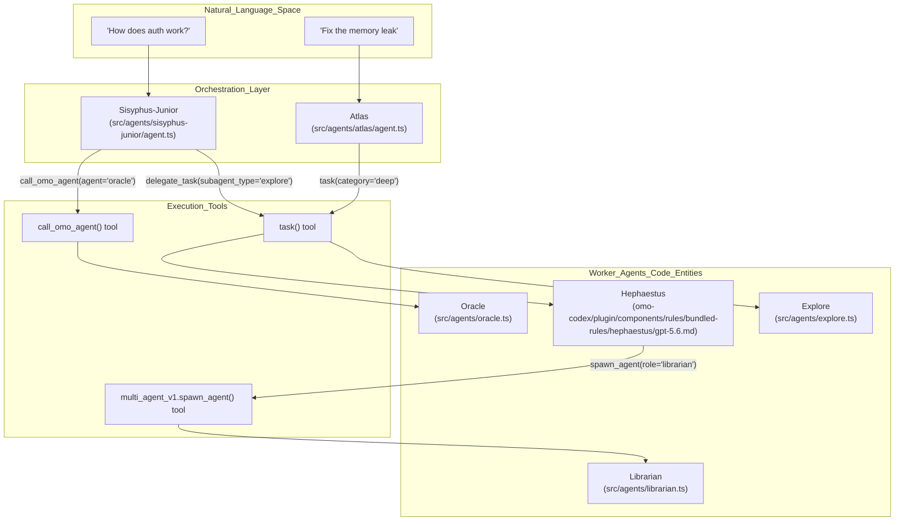

# Worker Agents

<details>
<summary>Relevant source files</summary>

The following files were used as context for generating this wiki page:

- [.agents/skills/work-with-pr-workspace/evals/evals.json](https://github.com/code-yeongyu/oh-my-openagent/blob/HEAD/.agents/skills/work-with-pr-workspace/evals/evals.json)
- [.agents/skills/work-with-pr/SKILL.md](https://github.com/code-yeongyu/oh-my-openagent/blob/HEAD/.agents/skills/work-with-pr/SKILL.md)
- [.omo/rules/test-discipline.md](https://github.com/code-yeongyu/oh-my-openagent/blob/HEAD/.omo/rules/test-discipline.md)
- [.opencode/skills/github-triage/SKILL.md](https://github.com/code-yeongyu/oh-my-openagent/blob/HEAD/.opencode/skills/github-triage/SKILL.md)
- [.opencode/skills/github-triage/scripts/gh_fetch.py](https://github.com/code-yeongyu/oh-my-openagent/blob/HEAD/.opencode/skills/github-triage/scripts/gh_fetch.py)
- [.opencode/skills/work-with-pr-workspace/evals/evals.json](https://github.com/code-yeongyu/oh-my-openagent/blob/HEAD/.opencode/skills/work-with-pr-workspace/evals/evals.json)
- [.opencode/skills/work-with-pr/SKILL.md](https://github.com/code-yeongyu/oh-my-openagent/blob/HEAD/.opencode/skills/work-with-pr/SKILL.md)
- [packages/ast-grep-mcp/AGENTS.md](https://github.com/code-yeongyu/oh-my-openagent/blob/HEAD/packages/ast-grep-mcp/AGENTS.md)
- [packages/omo-codex/plugin/components/rules/bundled-rules/hephaestus/gpt-5.5.md](https://github.com/code-yeongyu/oh-my-openagent/blob/HEAD/packages/omo-codex/plugin/components/rules/bundled-rules/hephaestus/gpt-5.5.md)
- [packages/omo-codex/plugin/components/rules/bundled-rules/hephaestus/gpt-5.6.md](https://github.com/code-yeongyu/oh-my-openagent/blob/HEAD/packages/omo-codex/plugin/components/rules/bundled-rules/hephaestus/gpt-5.6.md)
- [packages/omo-opencode/src/AGENTS.md](https://github.com/code-yeongyu/oh-my-openagent/blob/HEAD/packages/omo-opencode/src/AGENTS.md)
- [packages/omo-opencode/src/agents/AGENTS.md](https://github.com/code-yeongyu/oh-my-openagent/blob/HEAD/packages/omo-opencode/src/agents/AGENTS.md)
- [packages/omo-opencode/src/agents/atlas/AGENTS.md](https://github.com/code-yeongyu/oh-my-openagent/blob/HEAD/packages/omo-opencode/src/agents/atlas/AGENTS.md)
- [packages/omo-opencode/src/agents/atlas/agent.ts](https://github.com/code-yeongyu/oh-my-openagent/blob/HEAD/packages/omo-opencode/src/agents/atlas/agent.ts)
- [packages/omo-opencode/src/agents/atlas/atlas-prompt.test.ts](https://github.com/code-yeongyu/oh-my-openagent/blob/HEAD/packages/omo-opencode/src/agents/atlas/atlas-prompt.test.ts)
- [packages/omo-opencode/src/agents/atlas/prompt-routing.test.ts](https://github.com/code-yeongyu/oh-my-openagent/blob/HEAD/packages/omo-opencode/src/agents/atlas/prompt-routing.test.ts)
- [packages/omo-opencode/src/agents/atlas/prompt-runtime-injection.test.ts](https://github.com/code-yeongyu/oh-my-openagent/blob/HEAD/packages/omo-opencode/src/agents/atlas/prompt-runtime-injection.test.ts)
- [packages/omo-opencode/src/agents/hephaestus/delegation-table-contract.test.ts](https://github.com/code-yeongyu/oh-my-openagent/blob/HEAD/packages/omo-opencode/src/agents/hephaestus/delegation-table-contract.test.ts)
- [packages/omo-opencode/src/agents/hephaestus/gpt-5-5.ts](https://github.com/code-yeongyu/oh-my-openagent/blob/HEAD/packages/omo-opencode/src/agents/hephaestus/gpt-5-5.ts)
- [packages/omo-opencode/src/agents/hephaestus/gpt-5-6.ts](https://github.com/code-yeongyu/oh-my-openagent/blob/HEAD/packages/omo-opencode/src/agents/hephaestus/gpt-5-6.ts)
- [packages/omo-opencode/src/agents/prometheus/AGENTS.md](https://github.com/code-yeongyu/oh-my-openagent/blob/HEAD/packages/omo-opencode/src/agents/prometheus/AGENTS.md)
- [packages/omo-opencode/src/agents/sisyphus-junior/AGENTS.md](https://github.com/code-yeongyu/oh-my-openagent/blob/HEAD/packages/omo-opencode/src/agents/sisyphus-junior/AGENTS.md)
- [packages/omo-opencode/src/agents/sisyphus-junior/agent.ts](https://github.com/code-yeongyu/oh-my-openagent/blob/HEAD/packages/omo-opencode/src/agents/sisyphus-junior/agent.ts)
- [packages/omo-opencode/src/agents/sisyphus-junior/index.test.ts](https://github.com/code-yeongyu/oh-my-openagent/blob/HEAD/packages/omo-opencode/src/agents/sisyphus-junior/index.test.ts)
- [packages/omo-opencode/src/agents/sisyphus-junior/index.ts](https://github.com/code-yeongyu/oh-my-openagent/blob/HEAD/packages/omo-opencode/src/agents/sisyphus-junior/index.ts)
- [packages/omo-opencode/src/agents/sisyphus-junior/kimi-k2-7.ts](https://github.com/code-yeongyu/oh-my-openagent/blob/HEAD/packages/omo-opencode/src/agents/sisyphus-junior/kimi-k2-7.ts)
- [packages/omo-opencode/src/agents/sisyphus-junior/kimi-k3.ts](https://github.com/code-yeongyu/oh-my-openagent/blob/HEAD/packages/omo-opencode/src/agents/sisyphus-junior/kimi-k3.ts)
- [packages/omo-opencode/src/config-migration/AGENTS.md](https://github.com/code-yeongyu/oh-my-openagent/blob/HEAD/packages/omo-opencode/src/config-migration/AGENTS.md)
- [packages/omo-opencode/src/features/AGENTS.md](https://github.com/code-yeongyu/oh-my-openagent/blob/HEAD/packages/omo-opencode/src/features/AGENTS.md)
- [packages/omo-opencode/src/features/boulder-state/AGENTS.md](https://github.com/code-yeongyu/oh-my-openagent/blob/HEAD/packages/omo-opencode/src/features/boulder-state/AGENTS.md)
- [packages/omo-opencode/src/features/opencode-skill-loader/project-skill-tool-references.test.ts](https://github.com/code-yeongyu/oh-my-openagent/blob/HEAD/packages/omo-opencode/src/features/opencode-skill-loader/project-skill-tool-references.test.ts)
- [packages/omo-opencode/src/features/team-mode/AGENTS.md](https://github.com/code-yeongyu/oh-my-openagent/blob/HEAD/packages/omo-opencode/src/features/team-mode/AGENTS.md)
- [packages/omo-opencode/src/hooks/AGENTS.md](https://github.com/code-yeongyu/oh-my-openagent/blob/HEAD/packages/omo-opencode/src/hooks/AGENTS.md)
- [packages/omo-opencode/src/hooks/auto-update-checker/AGENTS.md](https://github.com/code-yeongyu/oh-my-openagent/blob/HEAD/packages/omo-opencode/src/hooks/auto-update-checker/AGENTS.md)
- [packages/omo-opencode/src/hooks/keyword-detector/AGENTS.md](https://github.com/code-yeongyu/oh-my-openagent/blob/HEAD/packages/omo-opencode/src/hooks/keyword-detector/AGENTS.md)
- [packages/omo-opencode/src/hooks/keyword-detector/ultrawork/default.ts](https://github.com/code-yeongyu/oh-my-openagent/blob/HEAD/packages/omo-opencode/src/hooks/keyword-detector/ultrawork/default.ts)
- [packages/omo-opencode/src/hooks/keyword-detector/ultrawork/gemini.ts](https://github.com/code-yeongyu/oh-my-openagent/blob/HEAD/packages/omo-opencode/src/hooks/keyword-detector/ultrawork/gemini.ts)
- [packages/omo-opencode/src/hooks/keyword-detector/ultrawork/gpt.ts](https://github.com/code-yeongyu/oh-my-openagent/blob/HEAD/packages/omo-opencode/src/hooks/keyword-detector/ultrawork/gpt.ts)
- [packages/omo-opencode/src/hooks/keyword-detector/ultrawork/planner.ts](https://github.com/code-yeongyu/oh-my-openagent/blob/HEAD/packages/omo-opencode/src/hooks/keyword-detector/ultrawork/planner.ts)
- [packages/prompts-core/package.json](https://github.com/code-yeongyu/oh-my-openagent/blob/HEAD/packages/prompts-core/package.json)
- [packages/prompts-core/prompts/mode/hyperplan.md](https://github.com/code-yeongyu/oh-my-openagent/blob/HEAD/packages/prompts-core/prompts/mode/hyperplan.md)
- [packages/prompts-core/prompts/mode/team.md](https://github.com/code-yeongyu/oh-my-openagent/blob/HEAD/packages/prompts-core/prompts/mode/team.md)
- [packages/prompts-core/src/__test_fixtures__/test-prompt/default.md](https://github.com/code-yeongyu/oh-my-openagent/blob/HEAD/packages/prompts-core/src/__test_fixtures__/test-prompt/default.md)
- [packages/prompts-core/src/__test_fixtures__/test-prompt/gpt.md](https://github.com/code-yeongyu/oh-my-openagent/blob/HEAD/packages/prompts-core/src/__test_fixtures__/test-prompt/gpt.md)
- [packages/prompts-core/src/atlas-prompts.ts](https://github.com/code-yeongyu/oh-my-openagent/blob/HEAD/packages/prompts-core/src/atlas-prompts.ts)
- [packages/prompts-core/src/index.ts](https://github.com/code-yeongyu/oh-my-openagent/blob/HEAD/packages/prompts-core/src/index.ts)
- [packages/prompts-core/src/loader.test.ts](https://github.com/code-yeongyu/oh-my-openagent/blob/HEAD/packages/prompts-core/src/loader.test.ts)
- [packages/prompts-core/src/loader.ts](https://github.com/code-yeongyu/oh-my-openagent/blob/HEAD/packages/prompts-core/src/loader.ts)
- [packages/prompts-core/src/mode-prompts.ts](https://github.com/code-yeongyu/oh-my-openagent/blob/HEAD/packages/prompts-core/src/mode-prompts.ts)
- [packages/prompts-core/src/types.ts](https://github.com/code-yeongyu/oh-my-openagent/blob/HEAD/packages/prompts-core/src/types.ts)
- [packages/prompts-core/src/variant-resolver.test.ts](https://github.com/code-yeongyu/oh-my-openagent/blob/HEAD/packages/prompts-core/src/variant-resolver.test.ts)
- [packages/prompts-core/src/variant-resolver.ts](https://github.com/code-yeongyu/oh-my-openagent/blob/HEAD/packages/prompts-core/src/variant-resolver.ts)
- [packages/shared-skills/skills/programming/SKILL.md](https://github.com/code-yeongyu/oh-my-openagent/blob/HEAD/packages/shared-skills/skills/programming/SKILL.md)
- [packages/shared-skills/skills/programming/references/code-smells.md](https://github.com/code-yeongyu/oh-my-openagent/blob/HEAD/packages/shared-skills/skills/programming/references/code-smells.md)
- [packages/shared-skills/skills/programming/references/logging.md](https://github.com/code-yeongyu/oh-my-openagent/blob/HEAD/packages/shared-skills/skills/programming/references/logging.md)
- [packages/shared-skills/skills/refactor/SKILL.md](https://github.com/code-yeongyu/oh-my-openagent/blob/HEAD/packages/shared-skills/skills/refactor/SKILL.md)
- [packages/skills-loader-core/src/features/builtin-skills/skills/review-work.ts](https://github.com/code-yeongyu/oh-my-openagent/blob/HEAD/packages/skills-loader-core/src/features/builtin-skills/skills/review-work.ts)
- [packages/skills-loader-core/src/features/opencode-skill-loader/project-skill-tool-references.test.ts](https://github.com/code-yeongyu/oh-my-openagent/blob/HEAD/packages/skills-loader-core/src/features/opencode-skill-loader/project-skill-tool-references.test.ts)

</details>


Worker agents in oh-my-openagent are specialized sub-agents engineered to carry out focused, domain-specific tasks. These agents operate primarily under the orchestration of primary agents such as Sisyphus or Atlas. Each worker agent is optimized for its unique role, employing tailored LLM models and tool permissions to efficiently execute its designated responsibilities.

This page presents a comprehensive technical overview of the key worker agents: **Hephaestus**, **Atlas**, and specialized specialists like **Oracle**, **Librarian**, and **Explore**.

---

## Overview

Worker agents typically run in `subagent` mode, meaning they:

- Use their own **model fallback chains** independent of UI or global model selection [packages/omo-opencode/src/agents/AGENTS.md:24](https://github.com/code-yeongyu/oh-my-openagent/blob/HEAD/packages/omo-opencode/src/agents/AGENTS.md#L24).
- Have **restricted tool permissions** aligned with their role (e.g., the `task` tool is blocked for sub-agents to prevent recursive orchestration bloat) [packages/omo-opencode/src/agents/sisyphus-junior/agent.ts:39-41](https://github.com/code-yeongyu/oh-my-openagent/blob/HEAD/packages/omo-opencode/src/agents/sisyphus-junior/agent.ts#L39-L41).
- Are generally invoked dynamically through tools like `delegate_task` or `call_omo_agent()` [packages/omo-opencode/src/agents/sisyphus-junior/agent.ts:40](https://github.com/code-yeongyu/oh-my-openagent/blob/HEAD/packages/omo-opencode/src/agents/sisyphus-junior/agent.ts#L40).
- Often run in **background sessions** to enable parallel workflows [packages/omo-codex/plugin/components/rules/bundled-rules/hephaestus/gpt-5.6.md:43-44](https://github.com/code-yeongyu/oh-my-openagent/blob/HEAD/packages/omo-codex/plugin/components/rules/bundled-rules/hephaestus/gpt-5.6.md#L43-L44).

| Agent Name | Primary Use | Mode | Key Characteristics |
|---|---|---|---|
| **Hephaestus** | Autonomous deep work and coding | `primary` | Full tool access; targets GPT-5.6/5.5 [packages/omo-codex/plugin/components/rules/bundled-rules/hephaestus/gpt-5.6.md:6](https://github.com/code-yeongyu/oh-my-openagent/blob/HEAD/packages/omo-codex/plugin/components/rules/bundled-rules/hephaestus/gpt-5.6.md#L6) |
| **Atlas** | Todo master and task continuation | `primary` | Tracks plan state; manages session continuity [packages/omo-opencode/src/agents/atlas/agent.ts:3-15](https://github.com/code-yeongyu/oh-my-openagent/blob/HEAD/packages/omo-opencode/src/agents/atlas/agent.ts#L3-L15) |
| **Oracle** | Architecture decisions and debugging | `subagent` | High-IQ, read-only strategy [packages/omo-opencode/src/agents/AGENTS.md:24](https://github.com/code-yeongyu/oh-my-openagent/blob/HEAD/packages/omo-opencode/src/agents/AGENTS.md#L24) |
| **Librarian** | External documentation research | `subagent` | Multi-phase discovery; SHA-pinned citations [packages/omo-opencode/src/agents/AGENTS.md:25](https://github.com/code-yeongyu/oh-my-openagent/blob/HEAD/packages/omo-opencode/src/agents/AGENTS.md#L25) |
| **Explore** | Internal codebase search | `subagent` | Aggressive parallel grep and LSP queries [packages/omo-opencode/src/agents/AGENTS.md:26](https://github.com/code-yeongyu/oh-my-openagent/blob/HEAD/packages/omo-opencode/src/agents/AGENTS.md#L26) |

**Sources:** [packages/omo-opencode/src/agents/sisyphus-junior/agent.ts:1-174](https://github.com/code-yeongyu/oh-my-openagent/blob/HEAD/packages/omo-opencode/src/agents/sisyphus-junior/agent.ts#L1-L174), [packages/omo-codex/plugin/components/rules/bundled-rules/hephaestus/gpt-5.6.md:1-55](https://github.com/code-yeongyu/oh-my-openagent/blob/HEAD/packages/omo-codex/plugin/components/rules/bundled-rules/hephaestus/gpt-5.6.md#L1-L55), [packages/omo-opencode/src/agents/atlas/agent.ts:1-133](https://github.com/code-yeongyu/oh-my-openagent/blob/HEAD/packages/omo-opencode/src/agents/atlas/agent.ts#L1-L133), [packages/omo-opencode/src/agents/AGENTS.md:18-32](https://github.com/code-yeongyu/oh-my-openagent/blob/HEAD/packages/omo-opencode/src/agents/AGENTS.md#L18-L32)

---

## Agent Architecture and Data Flow

This diagram illustrates the orchestration flow where primary agents receive natural language inputs and delegate to various worker agents.

### Diagram: Orchestration to Worker Mapping



**Sources:** [packages/omo-opencode/src/agents/sisyphus-junior/agent.ts:1-41](https://github.com/code-yeongyu/oh-my-openagent/blob/HEAD/packages/omo-opencode/src/agents/sisyphus-junior/agent.ts#L1-L41), [packages/omo-codex/plugin/components/rules/bundled-rules/hephaestus/gpt-5.6.md:34-44](https://github.com/code-yeongyu/oh-my-openagent/blob/HEAD/packages/omo-codex/plugin/components/rules/bundled-rules/hephaestus/gpt-5.6.md#L34-L44), [packages/omo-opencode/src/agents/atlas/agent.ts:72-104](https://github.com/code-yeongyu/oh-my-openagent/blob/HEAD/packages/omo-opencode/src/agents/atlas/agent.ts#L72-L104), [packages/omo-opencode/src/agents/AGENTS.md:63-72](https://github.com/code-yeongyu/oh-my-openagent/blob/HEAD/packages/omo-opencode/src/agents/AGENTS.md#L63-L72)

---

## Hephaestus: Deep Worker

Hephaestus is the autonomous implementation specialist designed for heavy "deep work." It focuses on complex coding tasks that require multi-step reasoning and full codebase modifications. Hephaestus is listed as a `primary` agent [packages/omo-opencode/src/agents/AGENTS.md:23](https://github.com/code-yeongyu/oh-my-openagent/blob/HEAD/packages/omo-opencode/src/agents/AGENTS.md#L23).

### Implementation and Discipline
- **Model Routing**: Uses specialized baseline disciplines for GPT-5.6 [packages/omo-codex/plugin/components/rules/bundled-rules/hephaestus/gpt-5.6.md:6](https://github.com/code-yeongyu/oh-my-openagent/blob/HEAD/packages/omo-codex/plugin/components/rules/bundled-rules/hephaestus/gpt-5.6.md#L6) and GPT-5.5 [packages/omo-codex/plugin/components/rules/bundled-rules/hephaestus/gpt-5.5.md:6](https://github.com/code-yeongyu/oh-my-openagent/blob/HEAD/packages/omo-codex/plugin/components/rules/bundled-rules/hephaestus/gpt-5.5.md#L6), ensuring outcome-first prompts.
- **Autonomy**: Operates under an "Implement, don't propose" doctrine. It commits to a binding stop condition at the start of every turn [packages/omo-codex/plugin/components/rules/bundled-rules/hephaestus/gpt-5.6.md:12](https://github.com/code-yeongyu/oh-my-openagent/blob/HEAD/packages/omo-codex/plugin/components/rules/bundled-rules/hephaestus/gpt-5.6.md#L12).
- **Operating Loop**: Follows a strict cycle of **Explore -> Plan -> Implement -> Verify -> Manually QA** [packages/omo-codex/plugin/components/rules/bundled-rules/hephaestus/gpt-5.6.md:26](https://github.com/code-yeongyu/oh-my-openagent/blob/HEAD/packages/omo-codex/plugin/components/rules/bundled-rules/hephaestus/gpt-5.6.md#L26).
- **Manual QA Gate**: Hephaestus is required to personally observe the artifact working through its matching surface (TUI, Web UI, HTTP API, or Library driver) before reporting completion [packages/omo-codex/plugin/components/rules/bundled-rules/hephaestus/gpt-5.6.md:47-53](https://github.com/code-yeongyu/oh-my-openagent/blob/HEAD/packages/omo-codex/plugin/components/rules/bundled-rules/hephaestus/gpt-5.6.md#L47-L53).
- **Pragmatism**: Prioritizes the smallest correct change and avoids speculative abstraction or unnecessary handlers [packages/omo-codex/plugin/components/rules/bundled-rules/hephaestus/gpt-5.5.md:83-89](https://github.com/code-yeongyu/oh-my-openagent/blob/HEAD/packages/omo-codex/plugin/components/rules/bundled-rules/hephaestus/gpt-5.5.md#L83-L89).

**Sources:** [packages/omo-codex/plugin/components/rules/bundled-rules/hephaestus/gpt-5.6.md:1-55](https://github.com/code-yeongyu/oh-my-openagent/blob/HEAD/packages/omo-codex/plugin/components/rules/bundled-rules/hephaestus/gpt-5.6.md#L1-L55), [packages/omo-codex/plugin/components/rules/bundled-rules/hephaestus/gpt-5.5.md:1-90](https://github.com/code-yeongyu/oh-my-openagent/blob/HEAD/packages/omo-codex/plugin/components/rules/bundled-rules/hephaestus/gpt-5.5.md#L1-L90), [packages/omo-opencode/src/agents/AGENTS.md:23](https://github.com/code-yeongyu/oh-my-openagent/blob/HEAD/packages/omo-opencode/src/agents/AGENTS.md#L23)

---

## Atlas: Todo Master

Atlas orchestrates multi-step task execution through rigorous todo management and plan lifecycle control. It is defined as a `primary` agent [packages/omo-opencode/src/agents/AGENTS.md:30](https://github.com/code-yeongyu/oh-my-openagent/blob/HEAD/packages/omo-opencode/src/agents/AGENTS.md#L30).

### Orchestration Logic
- **Task Delegation**: Uses the `task()` tool to coordinate specialized agents. Prompts are dynamically built with category sections, decision matrices, and skill guides [packages/omo-opencode/src/agents/atlas/agent.ts:72-104](https://github.com/code-yeongyu/oh-my-openagent/blob/HEAD/packages/omo-opencode/src/agents/atlas/agent.ts#L72-L104).
- **Model Routing**: Dynamically selects prompt variants based on model family (GPT, Gemini, GLM, etc.) via the `atlasPromptVariants` logic [packages/prompts-core/src/index.ts:14](https://github.com/code-yeongyu/oh-my-openagent/blob/HEAD/packages/prompts-core/src/index.ts#L14).
- **Auto-Continue**: Atlas is strictly forbidden from asking the user "should I continue" between plan steps; it must proceed immediately after verification. This behavior is enforced by the `atlasHook` continuation hook [packages/omo-opencode/src/AGENTS.md:97](https://github.com/code-yeongyu/oh-my-openagent/blob/HEAD/packages/omo-opencode/src/AGENTS.md#L97).
- **Subagent Completion Handling**: The `handleSubagentCompletionAfter` hook processes outputs from subagents, appending verification reminders for the orchestrator if a task is completed. It distinguishes between incomplete and complete reports to avoid premature verification.

**Sources:** [packages/omo-opencode/src/agents/atlas/agent.ts:1-133](https://github.com/code-yeongyu/oh-my-openagent/blob/HEAD/packages/omo-opencode/src/agents/atlas/agent.ts#L1-L133), [packages/prompts-core/src/index.ts:14-25](https://github.com/code-yeongyu/oh-my-openagent/blob/HEAD/packages/prompts-core/src/index.ts#L14-L25), [packages/omo-opencode/src/agents/sisyphus-junior/agent.ts:39-41](https://github.com/code-yeongyu/oh-my-openagent/blob/HEAD/packages/omo-opencode/src/agents/sisyphus-junior/agent.ts#L39-L41), [packages/omo-opencode/src/AGENTS.md:97](https://github.com/code-yeongyu/oh-my-openagent/blob/HEAD/packages/omo-opencode/src/AGENTS.md#L97), [packages/omo-opencode/src/agents/AGENTS.md:30](https://github.com/code-yeongyu/oh-my-openagent/blob/HEAD/packages/omo-opencode/src/agents/AGENTS.md#L30)

---

## Specialized Worker Agents

### Explore (Internal Search)
The **Explore** agent is a read-only specialist for finding code within the working tree [packages/omo-opencode/src/agents/AGENTS.md:26](https://github.com/code-yeongyu/oh-my-openagent/blob/HEAD/packages/omo-opencode/src/agents/AGENTS.md#L26).
- **Parallel Discovery**: Instructed to fire multiple independent tool calls (LSP, grep, search) concurrently using `Promise.all` or Python `concurrent.futures` to reduce latency [packages/omo-codex/plugin/components/rules/bundled-rules/hephaestus/gpt-5.6.md:22](https://github.com/code-yeongyu/oh-my-openagent/blob/HEAD/packages/omo-codex/plugin/components/rules/bundled-rules/hephaestus/gpt-5.6.md#L22).

### Librarian (External Research)
The **Librarian** agent researches external libraries, OSS code, and API contracts [packages/omo-opencode/src/agents/AGENTS.md:25](https://github.com/code-yeongyu/oh-my-openagent/blob/HEAD/packages/omo-opencode/src/agents/AGENTS.md#L25).
- **Constraint**: Must fill labels for **GOAL**, **STOP WHEN**, and **EVIDENCE** when spawned to prevent overworking [packages/omo-codex/plugin/components/rules/bundled-rules/hephaestus/gpt-5.6.md:41](https://github.com/code-yeongyu/oh-my-openagent/blob/HEAD/packages/omo-codex/plugin/components/rules/bundled-rules/hephaestus/gpt-5.6.md#L41).

### Oracle (Architecture Advisor)
The **Oracle** agent handles architecture decisions and complex debugging. It is often invoked for requests to answer, review, diagnose, or plan, requiring high-IQ read-only strategy [packages/omo-opencode/src/agents/AGENTS.md:24](https://github.com/code-yeongyu/oh-my-openagent/blob/HEAD/packages/omo-opencode/src/agents/AGENTS.md#L24).

**Sources:** [packages/omo-codex/plugin/components/rules/bundled-rules/hephaestus/gpt-5.6.md:22-41](https://github.com/code-yeongyu/oh-my-openagent/blob/HEAD/packages/omo-codex/plugin/components/rules/bundled-rules/hephaestus/gpt-5.6.md#L22-L41), [packages/omo-opencode/src/agents/AGENTS.md:24-26](https://github.com/code-yeongyu/oh-my-openagent/blob/HEAD/packages/omo-opencode/src/agents/AGENTS.md#L24-L26)

---

## Specialized Workflows: work-with-pr

The `work-with-pr` skill defines a high-fidelity worker lifecycle for landing changes as Pull Requests.

### Diagram: PR Worker Lifecycle

```mermaid
sequenceDiagram
    participant Worker as PR Worker (Subagent)
    participant WT as Git Worktree
    participant Loop as ulw-loop Skill
    participant GH as GitHub API

    Worker->>WT: Phase 0: Create isolated worktree (git worktree add)
    Worker->>Loop: Phase 1: Implement via ulw-loop
    Loop->>Loop: Evidence-bound Manual QA
    Worker->>GH: Phase 2: Push & Create PR (gh pr create)
    loop Verify Loop
        Worker->>GH: Phase 3: Check CI + Cubic (gh pr checks)
        alt Gate Fails
            Worker->>WT: Fix & Re-QA
        end
    end
    Worker->>GH: Phase 4: Merge & Cleanup
```

### Key Workflow Rules
- **Atomic Splits**: Tasks are decomposed into the smallest atomic, independently-mergeable PRs [packages/shared-skills/skills/programming/SKILL.md:38](https://github.com/code-yeongyu/oh-my-openagent/blob/HEAD/packages/shared-skills/skills/programming/SKILL.md#L38), [.opencode/skills/work-with-pr/SKILL.md:10](https://github.com/code-yeongyu/oh-my-openagent/blob/HEAD/.opencode/skills/work-with-pr/SKILL.md#L10).
- **Isolation**: Each PR is built in a fresh git worktree sibling to the main repo to allow parallel builds without collisions [.opencode/skills/work-with-pr/SKILL.md:32](https://github.com/code-yeongyu/oh-my-openagent/blob/HEAD/.opencode/skills/work-with-pr/SKILL.md#L32).
- **Verification Gates**: The workflow enforces two mandatory gates—CI (build/test) and Cubic (AI review)—before merging [.opencode/skills/work-with-pr/SKILL.md:19-21](https://github.com/code-yeongyu/oh-my-openagent/blob/HEAD/.opencode/skills/work-with-pr/SKILL.md#L19-L21).
- **Commit Strategy**: `ulw-loop` commits through `git-master`, enforcing atomic commits where each commit pairs implementation with its tests and QA evidence [.opencode/skills/work-with-pr/SKILL.md:101-112](https://github.com/code-yeongyu/oh-my-openagent/blob/HEAD/.opencode/skills/work-with-pr/SKILL.md#L101-L112).

**Sources:** [.opencode/skills/work-with-pr/SKILL.md:1-141](https://github.com/code-yeongyu/oh-my-openagent/blob/HEAD/.opencode/skills/work-with-pr/SKILL.md#L1-L141), [.agents/skills/work-with-pr/SKILL.md:1-141](https://github.com/code-yeongyu/oh-my-openagent/blob/HEAD/.agents/skills/work-with-pr/SKILL.md#L1-L141), [packages/shared-skills/skills/programming/SKILL.md:38-40](https://github.com/code-yeongyu/oh-my-openagent/blob/HEAD/packages/shared-skills/skills/programming/SKILL.md#L38-L40)25:T