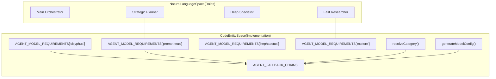
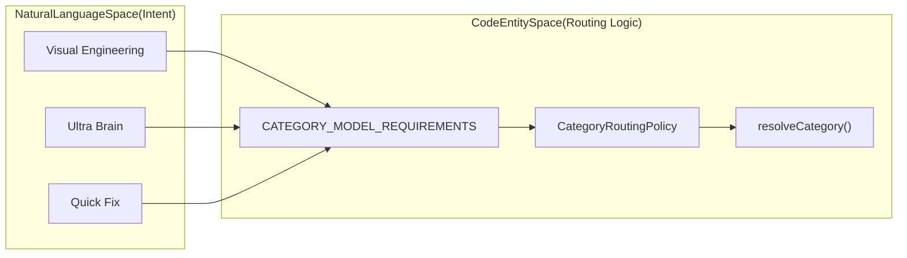
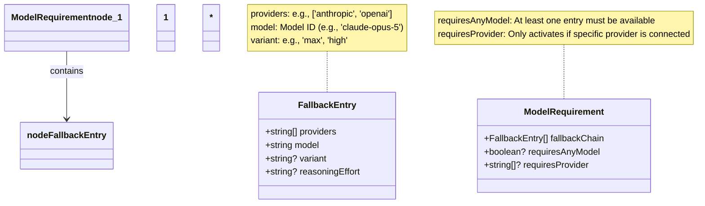
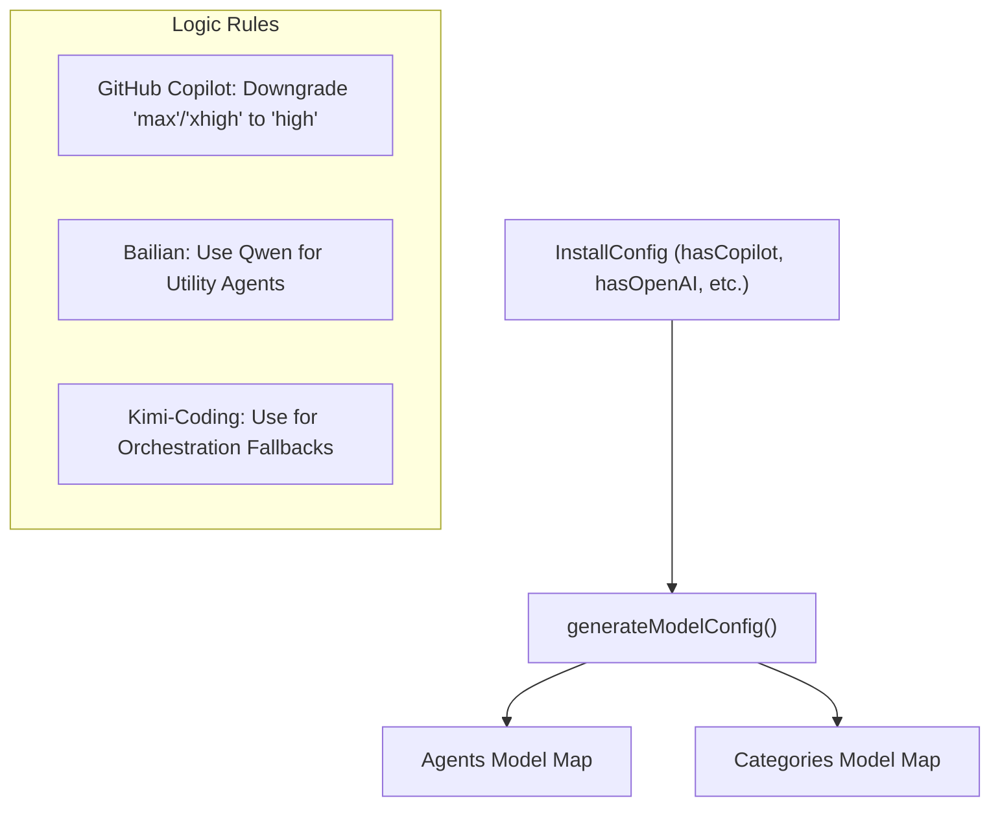

# Agent-Model Matching

Relevant source files

The following files were used as context for generating this wiki page:

- [.agents/skills/work-with-pr-workspace/iteration-1/eval-5/with_skill/outputs/execution-plan.md](https://github.com/code-yeongyu/oh-my-openagent/blob/HEAD/.agents/skills/work-with-pr-workspace/iteration-1/eval-5/with_skill/outputs/execution-plan.md)
- [.omo/evidence/20260724-sisyphus-opus5-prompt/bun-test-full-suite-tail.txt](https://github.com/code-yeongyu/oh-my-openagent/blob/HEAD/.omo/evidence/20260724-sisyphus-opus5-prompt/bun-test-full-suite-tail.txt)
- [.omo/evidence/20260724-sisyphus-opus5-prompt/capture-fake-llm.mjs](https://github.com/code-yeongyu/oh-my-openagent/blob/HEAD/.omo/evidence/20260724-sisyphus-opus5-prompt/capture-fake-llm.mjs)
- [.omo/evidence/20260724-sisyphus-opus5-prompt/captured-system-prompt-excerpt.txt](https://github.com/code-yeongyu/oh-my-openagent/blob/HEAD/.omo/evidence/20260724-sisyphus-opus5-prompt/captured-system-prompt-excerpt.txt)
- [.omo/evidence/20260724-sisyphus-opus5-prompt/opencode-qa.md](https://github.com/code-yeongyu/oh-my-openagent/blob/HEAD/.omo/evidence/20260724-sisyphus-opus5-prompt/opencode-qa.md)
- [.omo/evidence/20260724-sisyphus-opus5-prompt/qa-run-output.txt](https://github.com/code-yeongyu/oh-my-openagent/blob/HEAD/.omo/evidence/20260724-sisyphus-opus5-prompt/qa-run-output.txt)
- [.omo/evidence/20260724-sisyphus-opus5-prompt/qa-run.sh](https://github.com/code-yeongyu/oh-my-openagent/blob/HEAD/.omo/evidence/20260724-sisyphus-opus5-prompt/qa-run.sh)
- [.omo/evidence/20260724-sisyphus-opus5-prompt/routing-before-after.txt](https://github.com/code-yeongyu/oh-my-openagent/blob/HEAD/.omo/evidence/20260724-sisyphus-opus5-prompt/routing-before-after.txt)
- [.omo/evidence/20260809-omo-agent-toolkit-rename/task-5.txt](https://github.com/code-yeongyu/oh-my-openagent/blob/HEAD/.omo/evidence/20260809-omo-agent-toolkit-rename/task-5.txt)
- [.opencode/skills/work-with-pr-workspace/iteration-1/eval-5/with_skill/outputs/execution-plan.md](https://github.com/code-yeongyu/oh-my-openagent/blob/HEAD/.opencode/skills/work-with-pr-workspace/iteration-1/eval-5/with_skill/outputs/execution-plan.md)
- [CHANGELOG.md](https://github.com/code-yeongyu/oh-my-openagent/blob/HEAD/CHANGELOG.md)
- [README.ja.md](https://github.com/code-yeongyu/oh-my-openagent/blob/HEAD/README.ja.md)
- [README.ko.md](https://github.com/code-yeongyu/oh-my-openagent/blob/HEAD/README.ko.md)
- [README.md](https://github.com/code-yeongyu/oh-my-openagent/blob/HEAD/README.md)
- [README.ru.md](https://github.com/code-yeongyu/oh-my-openagent/blob/HEAD/README.ru.md)
- [README.zh-cn.md](https://github.com/code-yeongyu/oh-my-openagent/blob/HEAD/README.zh-cn.md)
- [assets/oh-my-opencode.schema.json](https://github.com/code-yeongyu/oh-my-openagent/blob/HEAD/assets/oh-my-opencode.schema.json)
- [docs/examples/coding-focused.jsonc](https://github.com/code-yeongyu/oh-my-openagent/blob/HEAD/docs/examples/coding-focused.jsonc)
- [docs/examples/default.jsonc](https://github.com/code-yeongyu/oh-my-openagent/blob/HEAD/docs/examples/default.jsonc)
- [docs/examples/planning-focused.jsonc](https://github.com/code-yeongyu/oh-my-openagent/blob/HEAD/docs/examples/planning-focused.jsonc)
- [docs/guide/agent-model-matching.md](https://github.com/code-yeongyu/oh-my-openagent/blob/HEAD/docs/guide/agent-model-matching.md)
- [docs/guide/installation.md](https://github.com/code-yeongyu/oh-my-openagent/blob/HEAD/docs/guide/installation.md)
- [docs/guide/orchestration.md](https://github.com/code-yeongyu/oh-my-openagent/blob/HEAD/docs/guide/orchestration.md)
- [docs/guide/overview.md](https://github.com/code-yeongyu/oh-my-openagent/blob/HEAD/docs/guide/overview.md)
- [docs/guide/team-mode.md](https://github.com/code-yeongyu/oh-my-openagent/blob/HEAD/docs/guide/team-mode.md)
- [docs/reference/cli.md](https://github.com/code-yeongyu/oh-my-openagent/blob/HEAD/docs/reference/cli.md)
- [docs/reference/codex-telemetry.md](https://github.com/code-yeongyu/oh-my-openagent/blob/HEAD/docs/reference/codex-telemetry.md)
- [docs/reference/configuration.md](https://github.com/code-yeongyu/oh-my-openagent/blob/HEAD/docs/reference/configuration.md)
- [docs/reference/features.md](https://github.com/code-yeongyu/oh-my-openagent/blob/HEAD/docs/reference/features.md)
- [docs/reference/known-issues.md](https://github.com/code-yeongyu/oh-my-openagent/blob/HEAD/docs/reference/known-issues.md)
- [docs/reference/prompt-async-gate-rfc.md](https://github.com/code-yeongyu/oh-my-openagent/blob/HEAD/docs/reference/prompt-async-gate-rfc.md)
- [docs/reference/rules-injection-cross-module-comparison.md](https://github.com/code-yeongyu/oh-my-openagent/blob/HEAD/docs/reference/rules-injection-cross-module-comparison.md)
- [packages/model-core/src/agent-model-requirements.ts](https://github.com/code-yeongyu/oh-my-openagent/blob/HEAD/packages/model-core/src/agent-model-requirements.ts)
- [packages/model-core/src/category-model-requirements.ts](https://github.com/code-yeongyu/oh-my-openagent/blob/HEAD/packages/model-core/src/category-model-requirements.ts)
- [packages/model-core/src/category-routing-policy.test.ts](https://github.com/code-yeongyu/oh-my-openagent/blob/HEAD/packages/model-core/src/category-routing-policy.test.ts)
- [packages/model-core/src/gpt-5.6-copilot-resolution.test.ts](https://github.com/code-yeongyu/oh-my-openagent/blob/HEAD/packages/model-core/src/gpt-5.6-copilot-resolution.test.ts)
- [packages/model-core/src/model-capability-guardrails.test.ts](https://github.com/code-yeongyu/oh-my-openagent/blob/HEAD/packages/model-core/src/model-capability-guardrails.test.ts)
- [packages/model-core/src/model-family-detectors.test.ts](https://github.com/code-yeongyu/oh-my-openagent/blob/HEAD/packages/model-core/src/model-family-detectors.test.ts)
- [packages/model-core/src/model-family-detectors.ts](https://github.com/code-yeongyu/oh-my-openagent/blob/HEAD/packages/model-core/src/model-family-detectors.ts)
- [packages/model-core/src/model-requirements-agents.test.ts](https://github.com/code-yeongyu/oh-my-openagent/blob/HEAD/packages/model-core/src/model-requirements-agents.test.ts)
- [packages/model-core/src/model-requirements-categories.test.ts](https://github.com/code-yeongyu/oh-my-openagent/blob/HEAD/packages/model-core/src/model-requirements-categories.test.ts)
- [packages/omo-codex/README.md](https://github.com/code-yeongyu/oh-my-openagent/blob/HEAD/packages/omo-codex/README.md)
- [packages/omo-codex/plugin/README.md](https://github.com/code-yeongyu/oh-my-openagent/blob/HEAD/packages/omo-codex/plugin/README.md)
- [packages/omo-codex/tsconfig.json](https://github.com/code-yeongyu/oh-my-openagent/blob/HEAD/packages/omo-codex/tsconfig.json)
- [packages/omo-opencode/src/agents/sisyphus-agent-config.ts](https://github.com/code-yeongyu/oh-my-openagent/blob/HEAD/packages/omo-opencode/src/agents/sisyphus-agent-config.ts)
- [packages/omo-opencode/src/agents/sisyphus-agent-factory.test.ts](https://github.com/code-yeongyu/oh-my-openagent/blob/HEAD/packages/omo-opencode/src/agents/sisyphus-agent-factory.test.ts)
- [packages/omo-opencode/src/agents/sisyphus-agent-factory.ts](https://github.com/code-yeongyu/oh-my-openagent/blob/HEAD/packages/omo-opencode/src/agents/sisyphus-agent-factory.ts)
- [packages/omo-opencode/src/agents/sisyphus-junior/glm-5-2.ts](https://github.com/code-yeongyu/oh-my-openagent/blob/HEAD/packages/omo-opencode/src/agents/sisyphus-junior/glm-5-2.ts)
- [packages/omo-opencode/src/agents/sisyphus/glm-5-2.ts](https://github.com/code-yeongyu/oh-my-openagent/blob/HEAD/packages/omo-opencode/src/agents/sisyphus/glm-5-2.ts)
- [packages/omo-opencode/src/agents/sisyphus/index.ts](https://github.com/code-yeongyu/oh-my-openagent/blob/HEAD/packages/omo-opencode/src/agents/sisyphus/index.ts)
- [packages/omo-opencode/src/agents/sisyphus/kimi-k2-7.ts](https://github.com/code-yeongyu/oh-my-openagent/blob/HEAD/packages/omo-opencode/src/agents/sisyphus/kimi-k2-7.ts)
- [packages/omo-opencode/src/agents/types.test.ts](https://github.com/code-yeongyu/oh-my-openagent/blob/HEAD/packages/omo-opencode/src/agents/types.test.ts)
- [packages/omo-opencode/src/agents/types.ts](https://github.com/code-yeongyu/oh-my-openagent/blob/HEAD/packages/omo-opencode/src/agents/types.ts)
- [packages/omo-opencode/src/agents/utils.test.ts](https://github.com/code-yeongyu/oh-my-openagent/blob/HEAD/packages/omo-opencode/src/agents/utils.test.ts)
- [packages/omo-opencode/src/cli/config-manager/generate-omo-config.test.ts](https://github.com/code-yeongyu/oh-my-openagent/blob/HEAD/packages/omo-opencode/src/cli/config-manager/generate-omo-config.test.ts)
- [packages/omo-opencode/src/cli/model-fallback-providers.test.ts](https://github.com/code-yeongyu/oh-my-openagent/blob/HEAD/packages/omo-opencode/src/cli/model-fallback-providers.test.ts)
- [packages/omo-opencode/src/cli/model-fallback.test.ts](https://github.com/code-yeongyu/oh-my-openagent/blob/HEAD/packages/omo-opencode/src/cli/model-fallback.test.ts)
- [packages/omo-opencode/src/cli/openai-only-model-catalog.test.ts](https://github.com/code-yeongyu/oh-my-openagent/blob/HEAD/packages/omo-opencode/src/cli/openai-only-model-catalog.test.ts)
- [packages/omo-opencode/src/cli/openai-only-model-catalog.ts](https://github.com/code-yeongyu/oh-my-openagent/blob/HEAD/packages/omo-opencode/src/cli/openai-only-model-catalog.ts)
- [packages/omo-opencode/src/cli/provider-model-id-transform.test.ts](https://github.com/code-yeongyu/oh-my-openagent/blob/HEAD/packages/omo-opencode/src/cli/provider-model-id-transform.test.ts)
- [packages/omo-opencode/src/features/claude-code-agent-loader/opencode-config-agents-reader.test.ts](https://github.com/code-yeongyu/oh-my-openagent/blob/HEAD/packages/omo-opencode/src/features/claude-code-agent-loader/opencode-config-agents-reader.test.ts)
- [packages/omo-opencode/src/hooks/model-fallback/hook.test.ts](https://github.com/code-yeongyu/oh-my-openagent/blob/HEAD/packages/omo-opencode/src/hooks/model-fallback/hook.test.ts)
- [packages/omo-opencode/src/hooks/no-sisyphus-gpt/hook.ts](https://github.com/code-yeongyu/oh-my-openagent/blob/HEAD/packages/omo-opencode/src/hooks/no-sisyphus-gpt/hook.ts)
- [packages/omo-opencode/src/plugin/event.model-fallback.test.ts](https://github.com/code-yeongyu/oh-my-openagent/blob/HEAD/packages/omo-opencode/src/plugin/event.model-fallback.test.ts)
- [packages/omo-opencode/src/plugin/event.test.ts](https://github.com/code-yeongyu/oh-my-openagent/blob/HEAD/packages/omo-opencode/src/plugin/event.test.ts)
- [packages/omo-opencode/src/shared/markdown-link-audit.test.ts](https://github.com/code-yeongyu/oh-my-openagent/blob/HEAD/packages/omo-opencode/src/shared/markdown-link-audit.test.ts)
- [packages/senpi-task/scripts/manual-category-qa.ts](https://github.com/code-yeongyu/oh-my-openagent/blob/HEAD/packages/senpi-task/scripts/manual-category-qa.ts)
- [packages/senpi-task/src/agents/builtin/fallback-chains.test.ts](https://github.com/code-yeongyu/oh-my-openagent/blob/HEAD/packages/senpi-task/src/agents/builtin/fallback-chains.test.ts)
- [packages/senpi-task/src/agents/builtin/fallback-chains.ts](https://github.com/code-yeongyu/oh-my-openagent/blob/HEAD/packages/senpi-task/src/agents/builtin/fallback-chains.ts)
- [packages/senpi-task/src/category/__snapshots__/resolve-category.test.ts.snap](https://github.com/code-yeongyu/oh-my-openagent/blob/HEAD/packages/senpi-task/src/category/__snapshots__/resolve-category.test.ts.snap)
- [packages/senpi-task/src/category/anthropic-categories.test.ts](https://github.com/code-yeongyu/oh-my-openagent/blob/HEAD/packages/senpi-task/src/category/anthropic-categories.test.ts)
- [packages/senpi-task/src/category/anthropic-categories.ts](https://github.com/code-yeongyu/oh-my-openagent/blob/HEAD/packages/senpi-task/src/category/anthropic-categories.ts)
- [packages/senpi-task/src/category/category-routing-policy.test.ts](https://github.com/code-yeongyu/oh-my-openagent/blob/HEAD/packages/senpi-task/src/category/category-routing-policy.test.ts)
- [packages/senpi-task/src/category/fallback-chains.ts](https://github.com/code-yeongyu/oh-my-openagent/blob/HEAD/packages/senpi-task/src/category/fallback-chains.ts)
- [packages/senpi-task/src/category/google-categories.ts](https://github.com/code-yeongyu/oh-my-openagent/blob/HEAD/packages/senpi-task/src/category/google-categories.ts)
- [packages/senpi-task/src/category/openai-categories.ts](https://github.com/code-yeongyu/oh-my-openagent/blob/HEAD/packages/senpi-task/src/category/openai-categories.ts)
- [packages/senpi-task/src/category/resolve-category-boundary.test.ts](https://github.com/code-yeongyu/oh-my-openagent/blob/HEAD/packages/senpi-task/src/category/resolve-category-boundary.test.ts)
- [postinstall.test.ts](https://github.com/code-yeongyu/oh-my-openagent/blob/HEAD/postinstall.test.ts)

## Purpose and Scope

This document explains how agents are matched to optimal AI models based on provider availability, working styles, and fallback requirements. The system uses a multi-tier resolution priority system with fuzzy model matching and provider-based fallback chains to ensure agents function effectively across diverse environments. 

In Oh My OpenAgent, model matching is not just about "smarter" models; it is about matching the **personality** and **technical constraints** of a model to an agent's specific role (e.g., Sisyphus's communicative orchestration vs. Hephaestus's deep specialist work).

Sources: [packages/model-core/src/agent-model-requirements.ts:1-25](https://github.com/code-yeongyu/oh-my-openagent/blob/HEAD/packages/model-core/src/agent-model-requirements.ts#L1-L25), [docs/guide/agent-model-matching.md:39-46](https://github.com/code-yeongyu/oh-my-openagent/blob/HEAD/docs/guide/agent-model-matching.md#L39-L46), [docs/guide/overview.md:48-52](https://github.com/code-yeongyu/oh-my-openagent/blob/HEAD/docs/guide/overview.md#L48-L52)

---

## Overview

Agent-model matching ensures that the "personality" and technical capabilities of a model match the specific role of the agent. This matching occurs at two distinct stages:

1.  **Install-time**: The CLI generates an initial configuration by mapping detected user subscriptions to the best available models in the fallback chains.
2.  **Runtime**: The plugin dynamically resolves models by prioritizing user overrides, then UI selections, and finally the automated fallback resolution via the `resolveModelForDelegateTask` logic.

### Code Entity Space to Natural Language Space

The following diagrams bridge high-level agent roles and categories to the specific code entities and data structures responsible for model resolution.

Title: Agent Role to Code Entity Mapping

Sources: [packages/model-core/src/agent-model-requirements.ts:3-12](https://github.com/code-yeongyu/oh-my-openagent/blob/HEAD/packages/model-core/src/agent-model-requirements.ts#L3-L12), [packages/senpi-task/src/agents/builtin/fallback-chains.ts:5-49](https://github.com/code-yeongyu/oh-my-openagent/blob/HEAD/packages/senpi-task/src/agents/builtin/fallback-chains.ts#L5-L49), [docs/guide/orchestration.md:34-78](https://github.com/code-yeongyu/oh-my-openagent/blob/HEAD/docs/guide/orchestration.md#L34-L78)

Title: Category Routing to Code Implementation

Sources: [packages/model-core/src/category-model-requirements.ts:3-10](https://github.com/code-yeongyu/oh-my-openagent/blob/HEAD/packages/model-core/src/category-model-requirements.ts#L3-L10), [packages/senpi-task/src/category/fallback-chains.ts:5-86](https://github.com/code-yeongyu/oh-my-openagent/blob/HEAD/packages/senpi-task/src/category/fallback-chains.ts#L5-L86), [docs/guide/overview.md:69-71](https://github.com/code-yeongyu/oh-my-openagent/blob/HEAD/docs/guide/overview.md#L69-L71)

---

## Model Requirements Schema

### Type Definitions

The core logic relies on the `ModelRequirement` structure, which defines the "ideal" model and its alternatives. These types are maintained in `@oh-my-opencode/model-core`.

Title: Model Requirement Data Structure

Sources: [packages/model-core/src/agent-model-requirements.ts:1-31](https://github.com/code-yeongyu/oh-my-openagent/blob/HEAD/packages/model-core/src/agent-model-requirements.ts#L1-L31), [assets/oh-my-opencode.schema.json:108-193](https://github.com/code-yeongyu/oh-my-openagent/blob/HEAD/assets/oh-my-opencode.schema.json#L108-L193)

### Agent Model Requirements

The system maintains a prioritized list of models for each agent role. Note that **Sisyphus** is maintainer-verified only on a specific set of models due to the complexity of its orchestration prompt.

| Agent | Primary Model (Fallback Chain Head) | Logic / Working Style |
| :--- | :--- | :--- |
| `sisyphus` | `claude-opus-5` | **The Sociable Lead**: Excels at complex multi-step instructions and multi-agent coordination. |
| `hephaestus` | `gpt-5.6-sol` | **The Deep Specialist**: Optimized for autonomous exploration and principle-driven implementation. |
| `oracle` | `gpt-5.6-sol` | **The Consultant**: High-IQ, read-only consultation for architecture and complex debugging. |
| `librarian` | `gpt-5.6-luna-fast` | **The Researcher**: Fast documentation lookup and OSS pattern analysis. |
| `explore` | `gpt-5.6-luna-fast` | **The Scout**: Rapid codebase navigation and pattern discovery via grep. |
| `prometheus` | `claude-fable-5` | **The Planner**: Strategic planning via user interviews. |
| `momus` | `gpt-5.6-terra` | **The Critic**: Ruthless plan reviewer validating context and clarity. |

Sources: [packages/model-core/src/agent-model-requirements.ts:3-203](https://github.com/code-yeongyu/oh-my-openagent/blob/HEAD/packages/model-core/src/agent-model-requirements.ts#L3-L203), [docs/guide/agent-model-matching.md:47-76](https://github.com/code-yeongyu/oh-my-openagent/blob/HEAD/docs/guide/agent-model-matching.md#L47-L76), [docs/reference/features.md:11-23](https://github.com/code-yeongyu/oh-my-openagent/blob/HEAD/docs/reference/features.md#L11-L23)

---

## The Matching Logic

### Runtime Resolution Priority
During task delegation, the system determines the model using a specific precedence:

1.  **User Agent Override**: Specific `model` or `variant` key in the `agents` or `categories` block of `omo.jsonc`. [docs/reference/configuration.md:115-120](https://github.com/code-yeongyu/oh-my-openagent/blob/HEAD/docs/reference/configuration.md#L115-L120)
2.  **Category Mapping**: If a task is delegated via `task(category="...")`, it routes using `CATEGORY_MODEL_REQUIREMENTS`. [packages/model-core/src/category-model-requirements.ts:3-10](https://github.com/code-yeongyu/oh-my-openagent/blob/HEAD/packages/model-core/src/category-model-requirements.ts#L3-L10)
3.  **Default Fallback Chain**: The built-in sequences defined in `model-core`. [packages/model-core/src/agent-model-requirements.ts:3-203](https://github.com/code-yeongyu/oh-my-openagent/blob/HEAD/packages/model-core/src/agent-model-requirements.ts#L3-L203)

### Compatibility and Normalization
The system ensures requested settings (like `variant` or `reasoningEffort`) are compatible with the selected model's family.

*   **Variant Downgrading**: Unsupported variants (e.g., `max` on Sonnet) are automatically downgraded to `high`. [packages/model-core/src/model-capability-guardrails.test.ts:1-100](https://github.com/code-yeongyu/oh-my-openagent/blob/HEAD/packages/model-core/src/model-capability-guardrails.test.ts#L1-L100)
*   **Reasoning Unification**: The system supports the unified `reasoning` field with `:level` suffix (e.g., `high:level`) for providers like OpenAI. [docs/reference/configuration.md:74-76](https://github.com/code-yeongyu/oh-my-openagent/blob/HEAD/docs/reference/configuration.md#L74-L76)
*   **Family Heuristics**: The system detects model families (Claude, GPT, Gemini, Kimi, GLM, etc.) to apply correct capability guardrails. [packages/model-core/src/model-family-detectors.ts:1-100](https://github.com/code-yeongyu/oh-my-openagent/blob/HEAD/packages/model-core/src/model-family-detectors.ts#L1-L100)

Sources: [docs/reference/configuration.md:74-76](https://github.com/code-yeongyu/oh-my-openagent/blob/HEAD/docs/reference/configuration.md#L74-L76), [packages/model-core/src/model-family-detectors.ts:1-100](https://github.com/code-yeongyu/oh-my-openagent/blob/HEAD/packages/model-core/src/model-family-detectors.ts#L1-L100), [packages/omo-opencode/src/cli/provider-model-id-transform.test.ts:1-20](https://github.com/code-yeongyu/oh-my-openagent/blob/HEAD/packages/omo-opencode/src/cli/provider-model-id-transform.test.ts#L1-L20)

---

## Configuration Generation (CLI)

The installation process handles the complex mapping of available provider subscriptions to agent roles.

Title: Provider Availability to Model Selection

Sources: [packages/omo-opencode/src/cli/model-fallback.test.ts:41-186](https://github.com/code-yeongyu/oh-my-openagent/blob/HEAD/packages/omo-opencode/src/cli/model-fallback.test.ts#L41-L186), [docs/reference/features.md:9-10](https://github.com/code-yeongyu/oh-my-openagent/blob/HEAD/docs/reference/features.md#L9-L10)

### Key Fallback Behaviors
*   **GitHub Copilot**: Automatically downgrades `max` or `xhigh` variants to `high` to prevent provider hangs. [packages/model-core/src/gpt-5.6-copilot-resolution.test.ts:1-100](https://github.com/code-yeongyu/oh-my-openagent/blob/HEAD/packages/model-core/src/gpt-5.6-copilot-resolution.test.ts#L1-L100)
*   **Kimi/GLM**: These are the primary fallbacks for orchestration if Claude is unavailable. Sisyphus is specifically calibrated for **Kimi K3** and **GLM 5.2**. [docs/guide/agent-model-matching.md:13-20](https://github.com/code-yeongyu/oh-my-openagent/blob/HEAD/docs/guide/agent-model-matching.md#L13-L20)
*   **Discouraged Orchestrators**: The system strongly discourages using MiniMax or Qwen for the Sisyphus role, as they fail under nested delegation prompts. [docs/guide/agent-model-matching.md:31-36](https://github.com/code-yeongyu/oh-my-openagent/blob/HEAD/docs/guide/agent-model-matching.md#L31-L36)

Sources: [docs/guide/agent-model-matching.md:7-36](https://github.com/code-yeongyu/oh-my-openagent/blob/HEAD/docs/guide/agent-model-matching.md#L7-L36), [packages/omo-opencode/src/cli/model-fallback.test.ts:41-79](https://github.com/code-yeongyu/oh-my-openagent/blob/HEAD/packages/omo-opencode/src/cli/model-fallback.test.ts#L41-L79)

---

## Category-Based Matching

When Sisyphus delegates a task using the `category` parameter, it uses a pre-defined mapping to route to specific models optimized for that domain.

| Category | Primary Model Chain | Purpose |
| :--- | :--- | :--- |
| `visual-engineering` | `claude-opus-5` → `kimi-k3` → `glm-5.2` | Frontend, UI/UX, and visual analysis. |
| `ultrabrain` | `gpt-5.6-sol` | Strategic reasoning and high-stakes decisions. |
| `deep` | `gpt-5.6-sol` | Complex implementation and autonomous work. |
| `artistry` | `claude-fable-5` | Creative design and refined UI work. |
| `quick` | `kimi-k3` | Trivial tasks and fast fixes. |
| `writing` | `kimi-k3` | Documentation and prose-optimized tasks. |

Sources: [packages/model-core/src/category-model-requirements.ts:3-201](https://github.com/code-yeongyu/oh-my-openagent/blob/HEAD/packages/model-core/src/category-model-requirements.ts#L3-L201), [docs/guide/overview.md:104-104](https://github.com/code-yeongyu/oh-my-openagent/blob/HEAD/docs/guide/overview.md#L104), [docs/reference/features.md:11-23](https://github.com/code-yeongyu/oh-my-openagent/blob/HEAD/docs/reference/features.md#L11-L23)26:T