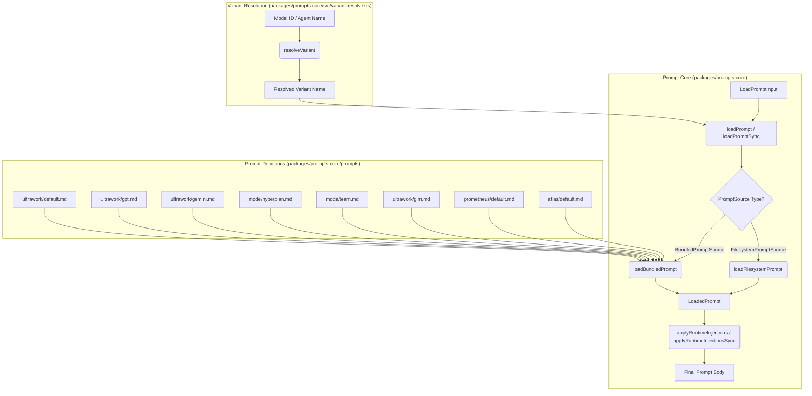
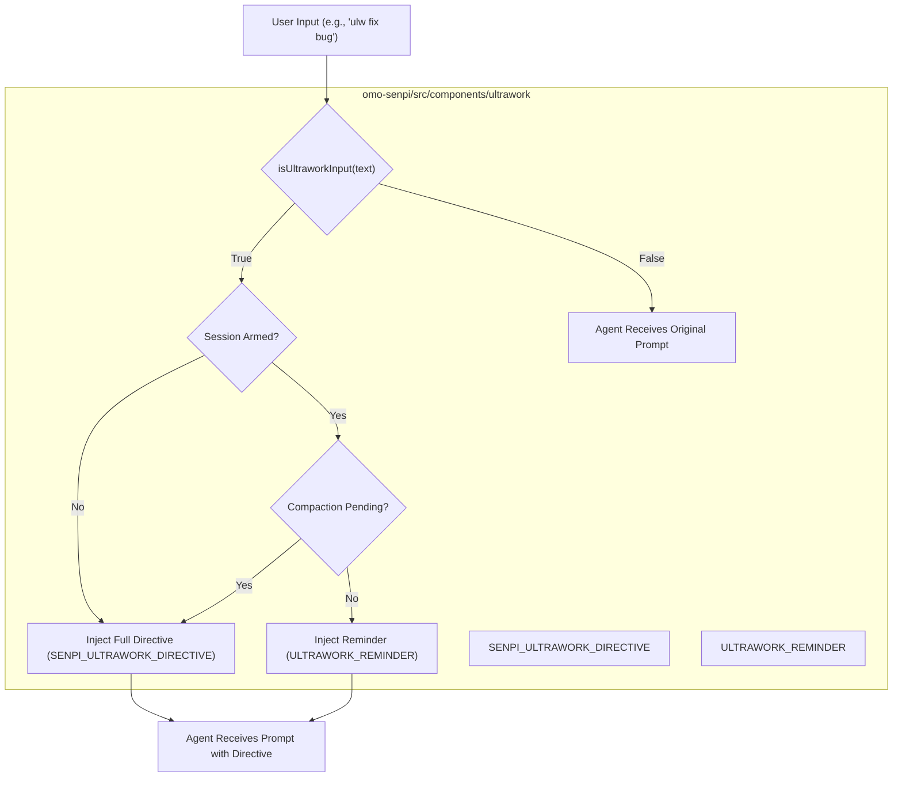
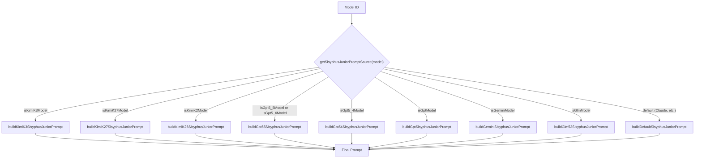

# Dynamic Prompt Building

<details>
<summary>Relevant source files</summary>

The following files were used as context for generating this wiki page:

- [.omo/evidence/20260810-omo-native-telemetry/task-3.md](https://github.com/code-yeongyu/oh-my-openagent/blob/HEAD/.omo/evidence/20260810-omo-native-telemetry/task-3.md)
- [packages/omo-codex/plugin/components/ultrawork/directive.md](https://github.com/code-yeongyu/oh-my-openagent/blob/HEAD/packages/omo-codex/plugin/components/ultrawork/directive.md)
- [packages/omo-codex/plugin/components/ultrawork/skills/ultrawork/SKILL.md](https://github.com/code-yeongyu/oh-my-openagent/blob/HEAD/packages/omo-codex/plugin/components/ultrawork/skills/ultrawork/SKILL.md)
- [packages/omo-codex/plugin/components/ulw-loop/directive.md](https://github.com/code-yeongyu/oh-my-openagent/blob/HEAD/packages/omo-codex/plugin/components/ulw-loop/directive.md)
- [packages/omo-opencode/src/agents/atlas/AGENTS.md](https://github.com/code-yeongyu/oh-my-openagent/blob/HEAD/packages/omo-opencode/src/agents/atlas/AGENTS.md)
- [packages/omo-opencode/src/agents/atlas/agent.ts](https://github.com/code-yeongyu/oh-my-openagent/blob/HEAD/packages/omo-opencode/src/agents/atlas/agent.ts)
- [packages/omo-opencode/src/agents/atlas/atlas-prompt.test.ts](https://github.com/code-yeongyu/oh-my-openagent/blob/HEAD/packages/omo-opencode/src/agents/atlas/atlas-prompt.test.ts)
- [packages/omo-opencode/src/agents/atlas/prompt-routing.test.ts](https://github.com/code-yeongyu/oh-my-openagent/blob/HEAD/packages/omo-opencode/src/agents/atlas/prompt-routing.test.ts)
- [packages/omo-opencode/src/agents/atlas/prompt-runtime-injection.test.ts](https://github.com/code-yeongyu/oh-my-openagent/blob/HEAD/packages/omo-opencode/src/agents/atlas/prompt-runtime-injection.test.ts)
- [packages/omo-opencode/src/agents/index.ts](https://github.com/code-yeongyu/oh-my-openagent/blob/HEAD/packages/omo-opencode/src/agents/index.ts)
- [packages/omo-opencode/src/agents/prometheus/index.ts](https://github.com/code-yeongyu/oh-my-openagent/blob/HEAD/packages/omo-opencode/src/agents/prometheus/index.ts)
- [packages/omo-opencode/src/agents/prometheus/system-prompt.test.ts](https://github.com/code-yeongyu/oh-my-openagent/blob/HEAD/packages/omo-opencode/src/agents/prometheus/system-prompt.test.ts)
- [packages/omo-opencode/src/agents/prometheus/system-prompt.ts](https://github.com/code-yeongyu/oh-my-openagent/blob/HEAD/packages/omo-opencode/src/agents/prometheus/system-prompt.ts)
- [packages/omo-opencode/src/agents/sisyphus-junior/AGENTS.md](https://github.com/code-yeongyu/oh-my-openagent/blob/HEAD/packages/omo-opencode/src/agents/sisyphus-junior/AGENTS.md)
- [packages/omo-opencode/src/agents/sisyphus-junior/agent.ts](https://github.com/code-yeongyu/oh-my-openagent/blob/HEAD/packages/omo-opencode/src/agents/sisyphus-junior/agent.ts)
- [packages/omo-opencode/src/agents/sisyphus-junior/index.test.ts](https://github.com/code-yeongyu/oh-my-openagent/blob/HEAD/packages/omo-opencode/src/agents/sisyphus-junior/index.test.ts)
- [packages/omo-opencode/src/agents/sisyphus-junior/index.ts](https://github.com/code-yeongyu/oh-my-openagent/blob/HEAD/packages/omo-opencode/src/agents/sisyphus-junior/index.ts)
- [packages/omo-opencode/src/agents/sisyphus-junior/kimi-k2-7.ts](https://github.com/code-yeongyu/oh-my-openagent/blob/HEAD/packages/omo-opencode/src/agents/sisyphus-junior/kimi-k2-7.ts)
- [packages/omo-opencode/src/agents/sisyphus-junior/kimi-k3.ts](https://github.com/code-yeongyu/oh-my-openagent/blob/HEAD/packages/omo-opencode/src/agents/sisyphus-junior/kimi-k3.ts)
- [packages/omo-opencode/src/hooks/keyword-detector/ultrawork/default.ts](https://github.com/code-yeongyu/oh-my-openagent/blob/HEAD/packages/omo-opencode/src/hooks/keyword-detector/ultrawork/default.ts)
- [packages/omo-opencode/src/hooks/keyword-detector/ultrawork/gemini.ts](https://github.com/code-yeongyu/oh-my-openagent/blob/HEAD/packages/omo-opencode/src/hooks/keyword-detector/ultrawork/gemini.ts)
- [packages/omo-opencode/src/hooks/keyword-detector/ultrawork/gpt.ts](https://github.com/code-yeongyu/oh-my-openagent/blob/HEAD/packages/omo-opencode/src/hooks/keyword-detector/ultrawork/gpt.ts)
- [packages/omo-opencode/src/hooks/keyword-detector/ultrawork/planner.ts](https://github.com/code-yeongyu/oh-my-openagent/blob/HEAD/packages/omo-opencode/src/hooks/keyword-detector/ultrawork/planner.ts)
- [packages/omo-opencode/src/shared/dist-bundle-prompt-content.test.ts](https://github.com/code-yeongyu/oh-my-openagent/blob/HEAD/packages/omo-opencode/src/shared/dist-bundle-prompt-content.test.ts)
- [packages/omo-senpi/plugin/scripts/embed-directive.mjs](https://github.com/code-yeongyu/oh-my-openagent/blob/HEAD/packages/omo-senpi/plugin/scripts/embed-directive.mjs)
- [packages/omo-senpi/skills/ultrawork/SKILL.md](https://github.com/code-yeongyu/oh-my-openagent/blob/HEAD/packages/omo-senpi/skills/ultrawork/SKILL.md)
- [packages/omo-senpi/src/components/ultrawork/generated-directive.ts](https://github.com/code-yeongyu/oh-my-openagent/blob/HEAD/packages/omo-senpi/src/components/ultrawork/generated-directive.ts)
- [packages/omo-senpi/src/components/ultrawork/index.ts](https://github.com/code-yeongyu/oh-my-openagent/blob/HEAD/packages/omo-senpi/src/components/ultrawork/index.ts)
- [packages/omo-senpi/src/components/ultrawork/ultrawork-arming.test.ts](https://github.com/code-yeongyu/oh-my-openagent/blob/HEAD/packages/omo-senpi/src/components/ultrawork/ultrawork-arming.test.ts)
- [packages/omo-senpi/src/components/ultrawork/ultrawork.test-support.ts](https://github.com/code-yeongyu/oh-my-openagent/blob/HEAD/packages/omo-senpi/src/components/ultrawork/ultrawork.test-support.ts)
- [packages/omo-senpi/src/components/ultrawork/ultrawork.test.ts](https://github.com/code-yeongyu/oh-my-openagent/blob/HEAD/packages/omo-senpi/src/components/ultrawork/ultrawork.test.ts)
- [packages/prompts-core/package.json](https://github.com/code-yeongyu/oh-my-openagent/blob/HEAD/packages/prompts-core/package.json)
- [packages/prompts-core/prompts/mode/hyperplan.md](https://github.com/code-yeongyu/oh-my-openagent/blob/HEAD/packages/prompts-core/prompts/mode/hyperplan.md)
- [packages/prompts-core/prompts/mode/team.md](https://github.com/code-yeongyu/oh-my-openagent/blob/HEAD/packages/prompts-core/prompts/mode/team.md)
- [packages/prompts-core/prompts/prometheus/default.md](https://github.com/code-yeongyu/oh-my-openagent/blob/HEAD/packages/prompts-core/prompts/prometheus/default.md)
- [packages/prompts-core/prompts/ultrawork/codex.md](https://github.com/code-yeongyu/oh-my-openagent/blob/HEAD/packages/prompts-core/prompts/ultrawork/codex.md)
- [packages/prompts-core/prompts/ultrawork/default.md](https://github.com/code-yeongyu/oh-my-openagent/blob/HEAD/packages/prompts-core/prompts/ultrawork/default.md)
- [packages/prompts-core/prompts/ultrawork/gemini.md](https://github.com/code-yeongyu/oh-my-openagent/blob/HEAD/packages/prompts-core/prompts/ultrawork/gemini.md)
- [packages/prompts-core/prompts/ultrawork/glm.md](https://github.com/code-yeongyu/oh-my-openagent/blob/HEAD/packages/prompts-core/prompts/ultrawork/glm.md)
- [packages/prompts-core/prompts/ultrawork/gpt.md](https://github.com/code-yeongyu/oh-my-openagent/blob/HEAD/packages/prompts-core/prompts/ultrawork/gpt.md)
- [packages/prompts-core/src/__test_fixtures__/test-prompt/default.md](https://github.com/code-yeongyu/oh-my-openagent/blob/HEAD/packages/prompts-core/src/__test_fixtures__/test-prompt/default.md)
- [packages/prompts-core/src/__test_fixtures__/test-prompt/gpt.md](https://github.com/code-yeongyu/oh-my-openagent/blob/HEAD/packages/prompts-core/src/__test_fixtures__/test-prompt/gpt.md)
- [packages/prompts-core/src/atlas-prompts.ts](https://github.com/code-yeongyu/oh-my-openagent/blob/HEAD/packages/prompts-core/src/atlas-prompts.ts)
- [packages/prompts-core/src/index.ts](https://github.com/code-yeongyu/oh-my-openagent/blob/HEAD/packages/prompts-core/src/index.ts)
- [packages/prompts-core/src/loader.test.ts](https://github.com/code-yeongyu/oh-my-openagent/blob/HEAD/packages/prompts-core/src/loader.test.ts)
- [packages/prompts-core/src/loader.ts](https://github.com/code-yeongyu/oh-my-openagent/blob/HEAD/packages/prompts-core/src/loader.ts)
- [packages/prompts-core/src/mode-prompts.ts](https://github.com/code-yeongyu/oh-my-openagent/blob/HEAD/packages/prompts-core/src/mode-prompts.ts)
- [packages/prompts-core/src/prometheus-prompts.ts](https://github.com/code-yeongyu/oh-my-openagent/blob/HEAD/packages/prompts-core/src/prometheus-prompts.ts)
- [packages/prompts-core/src/types.ts](https://github.com/code-yeongyu/oh-my-openagent/blob/HEAD/packages/prompts-core/src/types.ts)
- [packages/prompts-core/src/variant-resolver.test.ts](https://github.com/code-yeongyu/oh-my-openagent/blob/HEAD/packages/prompts-core/src/variant-resolver.test.ts)
- [packages/prompts-core/src/variant-resolver.ts](https://github.com/code-yeongyu/oh-my-openagent/blob/HEAD/packages/prompts-core/src/variant-resolver.ts)

</details>


## Purpose and Scope

The dynamic prompt building system is a modular architecture designed to construct agent system prompts at runtime. This system allows agents like **Sisyphus** (the orchestrator), **Hephaestus** (the worker), and **Prometheus** (the planner) to adapt their behavior based on the specific model being used, available tools, loaded skills, and active configuration categories.

The core logic is centered in the `packages/prompts-core` package, which provides a mechanism for loading prompt templates from either the filesystem or bundled sources, resolving model-specific variants, and performing runtime string injections. [packages/prompts-core/src/loader.ts:13-35](https://github.com/code-yeongyu/oh-my-openagent/blob/HEAD/packages/prompts-core/src/loader.ts#L13-L35), [packages/prompts-core/src/variant-resolver.ts:32-51](https://github.com/code-yeongyu/oh-my-openagent/blob/HEAD/packages/prompts-core/src/variant-resolver.ts#L32-L51)

Sources: [packages/prompts-core/src/loader.ts:13-35](https://github.com/code-yeongyu/oh-my-openagent/blob/HEAD/packages/prompts-core/src/loader.ts#L13-L35), [packages/prompts-core/src/variant-resolver.ts:32-51](https://github.com/code-yeongyu/oh-my-openagent/blob/HEAD/packages/prompts-core/src/variant-resolver.ts#L32-L51)

---

## System Architecture

The system functions as a pipeline: it gathers runtime metadata (connected providers, available models, discovered skills), resolves the optimal model for the task, and then invokes a series of loader functions to generate the prompt.

### Prompt Composition Flow

The following diagram illustrates how agents assemble their system prompts. The process varies significantly depending on whether the target model is a frontier model (like GPT-5.5) or a standard model.

**Agent Prompt Construction Pipeline**



Sources: [packages/prompts-core/src/loader.ts:37-54](https://github.com/code-yeongyu/oh-my-openagent/blob/HEAD/packages/prompts-core/src/loader.ts#L37-L54), [packages/prompts-core/src/variant-resolver.ts:32-51](https://github.com/code-yeongyu/oh-my-openagent/blob/HEAD/packages/prompts-core/src/variant-resolver.ts#L32-L51), [packages/prompts-core/src/types.ts:12-23](https://github.com/code-yeongyu/oh-my-openagent/blob/HEAD/packages/prompts-core/src/types.ts#L12-L23), [packages/prompts-core/src/atlas-prompts.ts:1-3](https://github.com/code-yeongyu/oh-my-openagent/blob/HEAD/packages/prompts-core/src/atlas-prompts.ts#L1-L3)

---

## Model-Specific Prompt Adaptation

The system detects the underlying LLM and applies specialized prompting architectures. This is managed by `resolveVariant` [packages/prompts-core/src/variant-resolver.ts:32-51](https://github.com/code-yeongyu/oh-my-openagent/blob/HEAD/packages/prompts-core/src/variant-resolver.ts#L32-L51) which selects the most appropriate prompt variant from a `VariantTable` [packages/prompts-core/src/types.ts:12](https://github.com/code-yeongyu/oh-my-openagent/blob/HEAD/packages/prompts-core/src/types.ts#L12) based on the `modelID` and `agentName`.

### Variant Resolution Logic
The `resolveVariant` function follows a specific priority order:
1.  **Planner Check**: If the agent is a planner (e.g., Prometheus), it prioritizes the "planner" variant. [packages/prompts-core/src/variant-resolver.ts:38-40](https://github.com/code-yeongyu/oh-my-openagent/blob/HEAD/packages/prompts-core/src/variant-resolver.ts#L38-L40)
2.  **Model Match**: It iterates through available variants and uses `MODEL_MATCHERS` (like `isGptModel`, `isGeminiModel`, `isGlmModel`, `isKimiK3Model`) to find a match for the current `modelID`. [packages/prompts-core/src/variant-resolver.ts:42-46](https://github.com/code-yeongyu/oh-my-openagent/blob/HEAD/packages/prompts-core/src/variant-resolver.ts#L42-L46), [packages/prompts-core/src/variant-resolver.ts:22-30](https://github.com/code-yeongyu/oh-my-openagent/blob/HEAD/packages/prompts-core/src/variant-resolver.ts#L22-L30)
3.  **Default Fallback**: If no specific model variant is found, it falls back to the "default" variant. [packages/prompts-core/src/variant-resolver.ts:48](https://github.com/code-yeongyu/oh-my-openagent/blob/HEAD/packages/prompts-core/src/variant-resolver.ts#L48)

### Prompt Families and Signatures
Prompts are often bundled as markdown files. The system exposes these via exported constants and variant tables. [packages/prompts-core/src/index.ts:14-32](https://github.com/code-yeongyu/oh-my-openagent/blob/HEAD/packages/prompts-core/src/index.ts#L14-L32)

| Agent / Mode | Variant | Exported Symbol |
|:---|:---|:---|
| Ultrawork | `gpt` | `ULTRAWORK_GPT_PROMPT` |
| Ultrawork | `gemini` | `ULTRAWORK_GEMINI_PROMPT` |
| Ultrawork | `planner` | `ULTRAWORK_PLANNER_PROMPT` |
| Team Mode | `default` | `TEAM_MODE_PROMPT` |
| Hyperplan Mode | `default` | `HYPERPLAN_MODE_PROMPT` |

Sources: [packages/prompts-core/src/variant-resolver.ts:22-51](https://github.com/code-yeongyu/oh-my-openagent/blob/HEAD/packages/prompts-core/src/variant-resolver.ts#L22-L51), [packages/prompts-core/src/index.ts:14-32](https://github.com/code-yeongyu/oh-my-openagent/blob/HEAD/packages/prompts-core/src/index.ts#L14-L32), [packages/prompts-core/src/mode-prompts.ts:1-5](https://github.com/code-yeongyu/oh-my-openagent/blob/HEAD/packages/prompts-core/src/mode-prompts.ts#L1-L5)

---

## Ultrawork Mode Directives

The `ultrawork` mode is a critical component that injects a comprehensive directive into the agent's prompt, guiding its behavior towards precision, outcome-first execution, and evidence-driven work. This directive is dynamically managed to ensure it's present when needed and not redundantly injected.

### Ultrawork Directive Injection Flow


The `ultrawork` component in `omo-senpi` [packages/omo-senpi/src/components/ultrawork/index.ts](https://github.com/code-yeongyu/oh-my-openagent/blob/HEAD/packages/omo-senpi/src/components/ultrawork/index.ts) handles the dynamic injection of the ultrawork directive.
- When a user prompt contains keywords like "ultrawork" or "ulw", the system checks if the session is already "armed" with the directive. [packages/omo-senpi/src/components/ultrawork/index.ts:143-146](https://github.com/code-yeongyu/oh-my-openagent/blob/HEAD/packages/omo-senpi/src/components/ultrawork/index.ts#L143-L146)
- If not armed, the full `SENPI_ULTRAWORK_DIRECTIVE` (a detailed markdown document) is injected as a hidden custom message. [packages/omo-senpi/src/components/ultrawork/generated-directive.ts:11-22822](https://github.com/code-yeongyu/oh-my-openagent/blob/HEAD/packages/omo-senpi/src/components/ultrawork/generated-directive.ts#L11-L22822)
- If the session is already armed, a shorter `ULTRAWORK_REMINDER` is injected to avoid token waste, unless a session compaction has occurred, which might remove the directive from the transcript, necessitating a full re-injection. [packages/omo-senpi/src/components/ultrawork/index.ts:18-20](https://github.com/code-yeongyu/oh-my-openagent/blob/HEAD/packages/omo-senpi/src/components/ultrawork/index.ts#L18-L20)
- The `ultrawork` skill [packages/omo-senpi/skills/ultrawork/SKILL.md](https://github.com/code-yeongyu/oh-my-openagent/blob/HEAD/packages/omo-senpi/skills/ultrawork/SKILL.md) provides the binding ultrawork mode directive for `omo-senpi`. A similar skill exists for `omo-codex` [packages/omo-codex/plugin/components/ultrawork/skills/ultrawork/SKILL.md](https://github.com/code-yeongyu/oh-my-openagent/blob/HEAD/packages/omo-codex/plugin/components/ultrawork/skills/ultrawork/SKILL.md).

Sources: [packages/omo-senpi/src/components/ultrawork/index.ts:1-140](https://github.com/code-yeongyu/oh-my-openagent/blob/HEAD/packages/omo-senpi/src/components/ultrawork/index.ts#L1-L140), [packages/omo-senpi/src/components/ultrawork/generated-directive.ts:11-22822](https://github.com/code-yeongyu/oh-my-openagent/blob/HEAD/packages/omo-senpi/src/components/ultrawork/generated-directive.ts#L11-L22822), [packages/omo-senpi/skills/ultrawork/SKILL.md:1-25601](https://github.com/code-yeongyu/oh-my-openagent/blob/HEAD/packages/omo-senpi/skills/ultrawork/SKILL.md#L1-L25601), [packages/omo-codex/plugin/components/ultrawork/skills/ultrawork/SKILL.md:1-21164](https://github.com/code-yeongyu/oh-my-openagent/blob/HEAD/packages/omo-codex/plugin/components/ultrawork/skills/ultrawork/SKILL.md#L1-L21164), [packages/omo-senpi/src/components/ultrawork/ultrawork-arming.test.ts:18-34](https://github.com/code-yeongyu/oh-my-openagent/blob/HEAD/packages/omo-senpi/src/components/ultrawork/ultrawork-arming.test.ts#L18-L34)

---

## Planning Agent Prompts (Prometheus)

Prometheus represents a specialized class of planning agents. The configuration for Prometheus is built using `buildPrometheusAgentConfig`, which handles model resolution and prompt assembly. [packages/omo-opencode/src/plugin-handlers/prometheus-agent-config-builder.ts:44-147](https://github.com/code-yeongyu/oh-my-openagent/blob/HEAD/packages/omo-opencode/src/plugin-handlers/prometheus-agent-config-builder.ts#L44-L147)

### Prometheus Logic
Key features of the Prometheus configuration:
*   **Model Resolution Pipeline**: Uses `resolveModelPipeline` to determine the model based on user intent, category defaults, and fallback chains. [packages/omo-opencode/src/plugin-handlers/prometheus-agent-config-builder.ts:69-84](https://github.com/code-yeongyu/oh-my-openagent/blob/HEAD/packages/omo-opencode/src/plugin-handlers/prometheus-agent-config-builder.ts#L69-L84)
*   **Prompt Generation**: Calls `getPrometheusPrompt` to generate the system prompt, which adapts to the resolved model and respects `disabledTools`. [packages/omo-opencode/src/plugin-handlers/prometheus-agent-config-builder.ts:116](https://github.com/code-yeongyu/oh-my-openagent/blob/HEAD/packages/omo-opencode/src/plugin-handlers/prometheus-agent-config-builder.ts#L116)
*   **Prompt Appending**: Supports `prompt_append` from configuration overrides, which is resolved via `resolvePromptAppend` and concatenated to the base prompt. [packages/omo-opencode/src/plugin-handlers/prometheus-agent-config-builder.ts:137-145](https://github.com/code-yeongyu/oh-my-openagent/blob/HEAD/packages/omo-opencode/src/plugin-handlers/prometheus-agent-config-builder.ts#L137-L145)

The core prompt for Prometheus emphasizes its role as a planner and mandates the use of the `ulw-plan` skill. [packages/prompts-core/prompts/prometheus/default.md:1-6](https://github.com/code-yeongyu/oh-my-openagent/blob/HEAD/packages/prompts-core/prompts/prometheus/default.md#L1-L6)

Sources: [packages/omo-opencode/src/plugin-handlers/prometheus-agent-config-builder.ts:44-147](https://github.com/code-yeongyu/oh-my-openagent/blob/HEAD/packages/omo-opencode/src/plugin-handlers/prometheus-agent-config-builder.ts#L44-L147), [packages/omo-opencode/src/agents/prometheus/index.ts:1-5](https://github.com/code-yeongyu/oh-my-openagent/blob/HEAD/packages/omo-opencode/src/agents/prometheus/index.ts#L1-L5), [packages/prompts-core/prompts/prometheus/default.md:1-6](https://github.com/code-yeongyu/oh-my-openagent/blob/HEAD/packages/prompts-core/prompts/prometheus/default.md#L1-L6)

---

## Sisyphus-Junior Prompt Building

Sisyphus-Junior is a focused task executor that adapts its prompt based on the specific model it is using. The `buildSisyphusJuniorPrompt` function [packages/omo-opencode/src/agents/sisyphus-junior/agent.ts:79-107](https://github.com/code-yeongyu/oh-my-openagent/blob/HEAD/packages/omo-opencode/src/agents/sisyphus-junior/agent.ts#L79-L107) dynamically selects the appropriate prompt builder function based on the model ID.

**Sisyphus-Junior Prompt Routing**



The `createSisyphusJuniorAgentWithOverrides` function [packages/omo-opencode/src/agents/sisyphus-junior/agent.ts:109-175](https://github.com/code-yeongyu/oh-my-openagent/blob/HEAD/packages/omo-opencode/src/agents/sisyphus-junior/agent.ts#L109-L175) integrates these model-specific prompts with agent configuration overrides, ensuring that parameters like `temperature`, `top_p`, and `description` are applied correctly, while also enforcing constraints like `mode: "subagent"` and preventing direct `prompt` overrides to preserve the discipline text. [packages/omo-opencode/src/agents/sisyphus-junior/index.test.ts:122-144](https://github.com/code-yeongyu/oh-my-openagent/blob/HEAD/packages/omo-opencode/src/agents/sisyphus-junior/index.test.ts#L122-L144)

Sources: [packages/omo-opencode/src/agents/sisyphus-junior/agent.ts:59-175](https://github.com/code-yeongyu/oh-my-openagent/blob/HEAD/packages/omo-opencode/src/agents/sisyphus-junior/agent.ts#L59-L175), [packages/omo-opencode/src/agents/sisyphus-junior/index.test.ts:10-144](https://github.com/code-yeongyu/oh-my-openagent/blob/HEAD/packages/omo-opencode/src/agents/sisyphus-junior/index.test.ts#L10-L144)

---

## Model Capability and Settings Compatibility

Prompt building is closely tied to model capabilities. The `resolveCompatibleModelSettings` function ensures that requested variants and reasoning efforts are compatible with the target model's family and metadata. [packages/model-core/src/model-settings-compatibility.test.ts:6-210](https://github.com/code-yeongyu/oh-my-openagent/blob/HEAD/packages/model-core/src/model-settings-compatibility.test.ts#L6-L210)

### Capability Detection
The system uses heuristics to detect model families and their supported features:
*   **Claude Family**: Detects Opus vs. non-Opus variants and manages "thinking" support. [packages/model-core/src/model-capability-heuristics.ts:15-25](https://github.com/code-yeongyu/oh-my-openagent/blob/HEAD/packages/model-core/src/model-capability-heuristics.ts#L15-L25)
*   **OpenAI Reasoning**: Detects `o-series` models and manages `reasoningEffort` support. [packages/model-core/src/model-capability-heuristics.ts:27-31](https://github.com/code-yeongyu/oh-my-openagent/blob/HEAD/packages/model-core/src/model-capability-heuristics.ts#L27-L31)
*   **GPT-5**: Supports extended variants (`xhigh`) and reasoning efforts. [packages/model-core/src/model-capability-heuristics.ts:33-37](https://github.com/code-yeongyu/oh-my-openagent/blob/HEAD/packages/model-core/src/model-capability-heuristics.ts#L33-L37)

### Variant Mapping in Prompts
When a prompt is built, the `applyAgentVariant` utility is used to set the correct `variant` or `reasoningEffort` on the chat message based on the agent's configuration and the model's runtime capabilities. [packages/omo-opencode/src/shared/agent-variant.ts:1-50](https://github.com/code-yeongyu/oh-my-openagent/blob/HEAD/packages/omo-opencode/src/shared/agent-variant.ts#L1-L50), [packages/omo-opencode/src/shared/agent-variant.test.ts:106-185](https://github.com/code-yeongyu/oh-my-openagent/blob/HEAD/packages/omo-opencode/src/shared/agent-variant.test.ts#L106-L185)

Sources: [packages/model-core/src/model-settings-compatibility.test.ts:6-210](https://github.com/code-yeongyu/oh-my-openagent/blob/HEAD/packages/model-core/src/model-settings-compatibility.test.ts#L6-L210), [packages/model-core/src/model-capability-heuristics.ts:13-113](https://github.com/code-yeongyu/oh-my-openagent/blob/HEAD/packages/model-core/src/model-capability-heuristics.ts#L13-L113), [packages/omo-opencode/src/shared/agent-variant.ts:1-50](https://github.com/code-yeongyu/oh-my-openagent/blob/HEAD/packages/omo-opencode/src/shared/agent-variant.ts#L1-L50)

---

## Runtime Injection and Frontmatter

The system supports metadata in prompt files via YAML frontmatter, parsed during the loading phase. [packages/prompts-core/src/loader.ts:26-54](https://github.com/code-yeongyu/oh-my-openagent/blob/HEAD/packages/prompts-core/src/loader.ts#L26-L54)

The `applyRuntimeInjections` (async) and `applyRuntimeInjectionsSync` (sync) functions replace placeholders in the prompt body. This is used to insert dynamic context into static templates. [packages/prompts-core/src/loader.ts:113-133](https://github.com/code-yeongyu/oh-my-openagent/blob/HEAD/packages/prompts-core/src/loader.ts#L113-L133)

### Injection Logic
The system allows for multiple runtime injections, applying all valid replacements and ignoring absent placeholders. [packages/prompts-core/src/loader.test.ts:86-99](https://github.com/code-yeongyu/oh-my-openagent/blob/HEAD/packages/prompts-core/src/loader.test.ts#L86-L99)

```typescript
// Example from loader.test.ts
const prompt = await loadPrompt({
  source: fixtureSource,
  name: "test-prompt",
  variant: "default",
  inject: [{ placeholder: "{X}", resolver: () => "Y" }],
});
// Result: "Default prompt body with Y."
```
[packages/prompts-core/src/loader.test.ts:75-84](https://github.com/code-yeongyu/oh-my-openagent/blob/HEAD/packages/prompts-core/src/loader.test.ts#L75-L84)

### Security and Reliability
*   **Path Traversal Protection**: `resolvePromptFilePath` ensures prompt names and variants do not escape the base directory. [packages/prompts-core/src/loader.ts:92-100](https://github.com/code-yeongyu/oh-my-openagent/blob/HEAD/packages/prompts-core/src/loader.ts#L92-L100)
*   **Error Handling**: Specific errors like `PromptFileNotFoundError` and `PromptPathTraversalError` provide clear feedback when prompt resolution fails. [packages/prompts-core/src/loader.ts:13-35](https://github.com/code-yeongyu/oh-my-openagent/blob/HEAD/packages/prompts-core/src/loader.ts#L13-L35)

Sources: [packages/prompts-core/src/loader.ts:60-133](https://github.com/code-yeongyu/oh-my-openagent/blob/HEAD/packages/prompts-core/src/loader.ts#L60-L133), [packages/prompts-core/src/loader.test.ts:59-100](https://github.com/code-yeongyu/oh-my-openagent/blob/HEAD/packages/prompts-core/src/loader.test.ts#L59-L100)