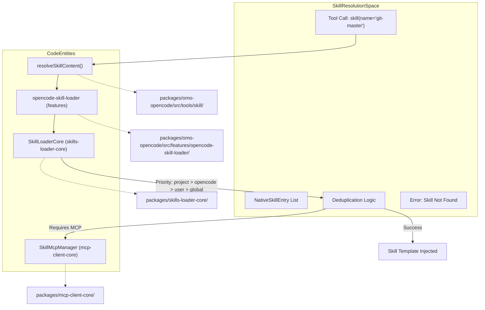

# Tools and Features

Relevant source files

The following files were used as context for generating this wiki page:

- [.omo/evidence/20260812-init-deep/hierarchy-green.txt](https://github.com/code-yeongyu/oh-my-openagent/blob/HEAD/.omo/evidence/20260812-init-deep/hierarchy-green.txt)
- [.omo/evidence/20260812-init-deep/hierarchy-red.txt](https://github.com/code-yeongyu/oh-my-openagent/blob/HEAD/.omo/evidence/20260812-init-deep/hierarchy-red.txt)
- [.omo/evidence/20260812-init-deep/manual-review.md](https://github.com/code-yeongyu/oh-my-openagent/blob/HEAD/.omo/evidence/20260812-init-deep/manual-review.md)
- [.omo/evidence/20260812-init-deep/qa-summary.md](https://github.com/code-yeongyu/oh-my-openagent/blob/HEAD/.omo/evidence/20260812-init-deep/qa-summary.md)
- [.omo/evidence/20260812-init-deep/scoring.md](https://github.com/code-yeongyu/oh-my-openagent/blob/HEAD/.omo/evidence/20260812-init-deep/scoring.md)
- [.omo/evidence/20260812-init-deep/validation-green.txt](https://github.com/code-yeongyu/oh-my-openagent/blob/HEAD/.omo/evidence/20260812-init-deep/validation-green.txt)
- [.omo/evidence/20260812-init-deep/validation-red.txt](https://github.com/code-yeongyu/oh-my-openagent/blob/HEAD/.omo/evidence/20260812-init-deep/validation-red.txt)
- [AGENTS.md](https://github.com/code-yeongyu/oh-my-openagent/blob/HEAD/AGENTS.md)
- [packages/AGENTS.md](https://github.com/code-yeongyu/oh-my-openagent/blob/HEAD/packages/AGENTS.md)
- [packages/memory-core/AGENTS.md](https://github.com/code-yeongyu/oh-my-openagent/blob/HEAD/packages/memory-core/AGENTS.md)
- [packages/omo-opencode/src/tools/AGENTS.md](https://github.com/code-yeongyu/oh-my-openagent/blob/HEAD/packages/omo-opencode/src/tools/AGENTS.md)
- [packages/omo-opencode/src/tools/delegate-task/anthropic-categories.ts](https://github.com/code-yeongyu/oh-my-openagent/blob/HEAD/packages/omo-opencode/src/tools/delegate-task/anthropic-categories.ts)
- [packages/omo-opencode/src/tools/delegate-task/builtin-categories.ts](https://github.com/code-yeongyu/oh-my-openagent/blob/HEAD/packages/omo-opencode/src/tools/delegate-task/builtin-categories.ts)
- [packages/omo-opencode/src/tools/delegate-task/builtin-category-definition.ts](https://github.com/code-yeongyu/oh-my-openagent/blob/HEAD/packages/omo-opencode/src/tools/delegate-task/builtin-category-definition.ts)
- [packages/omo-opencode/src/tools/delegate-task/categories.ts](https://github.com/code-yeongyu/oh-my-openagent/blob/HEAD/packages/omo-opencode/src/tools/delegate-task/categories.ts)
- [packages/omo-opencode/src/tools/delegate-task/category-routing-policy.test.ts](https://github.com/code-yeongyu/oh-my-openagent/blob/HEAD/packages/omo-opencode/src/tools/delegate-task/category-routing-policy.test.ts)
- [packages/omo-opencode/src/tools/delegate-task/constants.ts](https://github.com/code-yeongyu/oh-my-openagent/blob/HEAD/packages/omo-opencode/src/tools/delegate-task/constants.ts)
- [packages/omo-opencode/src/tools/delegate-task/google-categories.ts](https://github.com/code-yeongyu/oh-my-openagent/blob/HEAD/packages/omo-opencode/src/tools/delegate-task/google-categories.ts)
- [packages/omo-opencode/src/tools/delegate-task/kimi-categories.ts](https://github.com/code-yeongyu/oh-my-openagent/blob/HEAD/packages/omo-opencode/src/tools/delegate-task/kimi-categories.ts)
- [packages/omo-opencode/src/tools/delegate-task/openai-categories.ts](https://github.com/code-yeongyu/oh-my-openagent/blob/HEAD/packages/omo-opencode/src/tools/delegate-task/openai-categories.ts)
- [packages/omo-opencode/src/tools/delegate-task/tools.test.ts](https://github.com/code-yeongyu/oh-my-openagent/blob/HEAD/packages/omo-opencode/src/tools/delegate-task/tools.test.ts)

This page provides a high-level overview of the comprehensive suite of built-in tools available in the `oh-my-openagent` ecosystem. These tools enable agents to interact with the codebase, external systems, and each other. They are organized into functional categories such as Language Server Protocol (LSP), Abstract Syntax Tree (AST) manipulation, Task Management, Session Handling, Interactivity, and Consensus mechanisms.

The intent of this page is to introduce the overall landscape and relationships of the tools, without diving deeply into implementation details. Specific technical elaboration is delegated to dedicated child pages.

For detailed information on each tool group and feature set, see the corresponding child pages:
- [Task Delegation](18_4.1-task-delegation.md) — Covers the `delegate_task` tool, parameters, prompt structure, and category vs. subagent types.
- [Categories System](19_4.2-categories-system.md) — Describes the built-in 8 categories with their model-to-provider mappings and user overrides.
- [Skills System](20_4.3-skills-system.md) — Explains skill discovery across 4 scopes, embedded MCP skills, and the shared-skills library.
- [Background Task Tools](21_4.4-background-task-tools.md) — Details on asynchronous background task management and `call_omo_agent`.
- [Code Manipulation Tools](22_4.5-code-manipulation-tools.md) — Documentation of `hashline_edit`, LSP MCP tools, and AST-grep search tools.
- [Interactive Tools](23_4.6-interactive-tools.md) — Describes `interactive_bash` (tmux), `look_at` multimodal tools, and SparkShell command summarization.
- [Consensus Tool](24_4.7-consensus-tool.md) — Multi-lineage debate tool for high-stakes decision synthesis across model families.

---

## Tool Registry and Permission Architecture

The tool registry is assembled during plugin initialization, integrating capabilities from the 19-package core layer [packages/AGENTS.md:15-15](https://github.com/code-yeongyu/oh-my-openagent/blob/HEAD/packages/AGENTS.md#L15). A critical aspect of the tool system is the **Permission Engine**, which enforces strict access control per agent type [AGENTS.md:34-46](https://github.com/code-yeongyu/oh-my-openagent/blob/HEAD/AGENTS.md#L34-L46).

The `createToolRegistry` function in `src/plugin/tool-registry.ts` orchestrates the composition of native and conditional tools [packages/omo-opencode/src/tools/AGENTS.md:7-7](https://github.com/code-yeongyu/oh-my-openagent/blob/HEAD/packages/omo-opencode/src/tools/AGENTS.md#L7):
- **Always-On Tools**: Core utilities like `grep`, `glob`, `session_*` management, and the `task` delegation tool are available by default [packages/omo-opencode/src/tools/AGENTS.md:11-19](https://github.com/code-yeongyu/oh-my-openagent/blob/HEAD/packages/omo-opencode/src/tools/AGENTS.md#L11-L19).
- **Agent-Specific Permissions**: Orchestrators like `Sisyphus` and `Atlas` are granted `task` permissions, while analysis agents like `Oracle` or `Librarian` are read-only and denied `write`, `edit`, and `task` tools [AGENTS.md:34-46](https://github.com/code-yeongyu/oh-my-openagent/blob/HEAD/AGENTS.md#L34-L46).
- **Conditional Tools**: Many tools are gated by configuration, such as `look_at` (requires `multimodal-looker`), `interactive_bash` (requires `tmux_core`), and the 12 `team_*` tools (requires `team_mode.enabled`) [packages/omo-opencode/src/tools/AGENTS.md:23-31](https://github.com/code-yeongyu/oh-my-openagent/blob/HEAD/packages/omo-opencode/src/tools/AGENTS.md#L23-L31).
- **Team Mode Gating**: When `team_mode` is active, specific tool gating is applied to ensure members only use authorized coordination tools [AGENTS.md:85-91](https://github.com/code-yeongyu/oh-my-openagent/blob/HEAD/AGENTS.md#L85-L91).

---

### Mapping User Intent to Code Entities: Tool Providers Diagram

```mermaid
graph TB
    subgraph NaturalLanguageSpace ["NaturalLanguageSpace"]
        Intent1["'Delegate background fix task'"]
        Intent2["'Rename symbol across project'"]
        Intent3["'Search codebase for React components'"]
        Intent4["'Request second opinion on architecture'"]
        Intent5["'Call a skill-defined MCP tool'"]
        Intent6["'Run an interactive shell'"]
        Intent7["'Edit a file with hashline safety'"]
    end

    subgraph CodeEntitySpace ["CodeEntitySpace"]
        direction LR
        subgraph TaskDelegationTools ["TaskDelegationTools"]
            T1["delegate_task (delegate-core)"]
            T2["call_omo_agent (agents-md-core)"]
            T3["background_task (background-agent)"]
        end
        subgraph MCPTools ["MCPTools"]
            M1["lsp_rename (lsp-core)"]
            M2["ast_grep (ast-grep-mcp)"]
            M3["skill_mcp (mcp-client-core)"]
        end
        subgraph InteractiveExecution ["InteractiveExecution"]
            I1["interactive_bash (tmux-core)"]
        end
        subgraph CodeManipulation ["CodeManipulation"]
            C1["hashline_edit (hashline-core)"]
        end
        subgraph Consensus ["Consensus"]
            Con1["consensus_debate (omo-opencode/src/tools/consensus)"]
        end
    end

    Intent1 --> T1
    Intent1 --> T3
    Intent2 --> M1
    Intent3 --> M2
    Intent4 --> Con1
    Intent5 --> M3
    Intent6 --> I1
    Intent7 --> C1

    T1 -.-> Path1["packages/omo-opencode/src/tools/delegate-task/"]
    T2 -.-> Path2["packages/omo-opencode/src/tools/call-omo-agent/"]
    T3 -.-> Path3["packages/omo-opencode/src/features/background-agent/"]
    M1 -.-> Path4["packages/lsp-core/"]
    M2 -.-> Path5["packages/ast-grep-mcp/"]
    M3 -.-> Path6["packages/mcp-client-core/"]
    I1 -.-> Path7["packages/tmux-core/"]
    C1 -.-> Path8["packages/hashline-core/"]
    Con1 -.-> Path9["packages/omo-opencode/src/tools/consensus/"]
```

*This diagram associates typical user intents with the underlying code implementations and core packages defining their tool handling.*

**Sources:** [packages/omo-opencode/src/tools/AGENTS.md:9-31](https://github.com/code-yeongyu/oh-my-openagent/blob/HEAD/packages/omo-opencode/src/tools/AGENTS.md#L9-L31), [packages/AGENTS.md:15-15](https://github.com/code-yeongyu/oh-my-openagent/blob/HEAD/packages/AGENTS.md#L15), [packages/omo-opencode/src/features/AGENTS.md:39-48](https://github.com/code-yeongyu/oh-my-openagent/blob/HEAD/packages/omo-opencode/src/features/AGENTS.md#L39-L48)

---

## Skill Resolution and Native Integration

The system employs a unified mechanism to present available skills and slash commands to agents. The `opencode-skill-loader` manages discovery across four scopes: project, opencode, user, and global [AGENTS.md:63-68](https://github.com/code-yeongyu/oh-my-openagent/blob/HEAD/AGENTS.md#L63-L68). The `shared-skills` library provides a common set of 20+ capabilities used across both the Ultimate (OpenCode) and Light (Codex) editions [packages/AGENTS.md:17-17](https://github.com/code-yeongyu/oh-my-openagent/blob/HEAD/packages/AGENTS.md#L17).

### Skill Discovery Flow Diagram

*This diagram illustrates how the system bridges runtime plugin skills with native host skills.*

**Sources:** [AGENTS.md:63-68](https://github.com/code-yeongyu/oh-my-openagent/blob/HEAD/AGENTS.md#L63-L68), [packages/AGENTS.md:15-17](https://github.com/code-yeongyu/oh-my-openagent/blob/HEAD/packages/AGENTS.md#L15-L17), [packages/omo-opencode/src/tools/AGENTS.md:19-19](https://github.com/code-yeongyu/oh-my-openagent/blob/HEAD/packages/omo-opencode/src/tools/AGENTS.md#L19)

---

## Model Resolution Pipeline

A core feature of the toolset is the `model-core` resolution pipeline, which ensures that tools requiring LLM invocation use the most appropriate model based on availability and configuration [packages/AGENTS.md:41-41](https://github.com/code-yeongyu/oh-my-openagent/blob/HEAD/packages/AGENTS.md#L41).

The pipeline follows a tiered priority [AGENTS.md:102-102](https://github.com/code-yeongyu/oh-my-openagent/blob/HEAD/AGENTS.md#L102):
1. **User Override**: Explicit model chosen in `omo.jsonc`.
2. **Category Default**: Pre-defined model for specific task types (e.g., `visual-engineering` uses `claude-opus-5 max`) [packages/omo-opencode/src/tools/delegate-task/tools.test.ts:160-168](https://github.com/code-yeongyu/oh-my-openagent/blob/HEAD/packages/omo-opencode/src/tools/delegate-task/tools.test.ts#L160-L168).
3. **Provider Fallback**: Defined chains like `kimi-k3` → `gpt-5.6-sol` [AGENTS.md:22-32](https://github.com/code-yeongyu/oh-my-openagent/blob/HEAD/AGENTS.md#L22-L32).
4. **System Default**: Hardcoded fallback models like `anthropic/claude-sonnet-4-6` [packages/omo-opencode/src/tools/delegate-task/tools.test.ts:28-28](https://github.com/code-yeongyu/oh-my-openagent/blob/HEAD/packages/omo-opencode/src/tools/delegate-task/tools.test.ts#L28).

**Sources:** [packages/model-core/src/model-resolution-pipeline.ts:94-101](https://github.com/code-yeongyu/oh-my-openagent/blob/HEAD/packages/model-core/src/model-resolution-pipeline.ts#L94-L101), [AGENTS.md:102-102](https://github.com/code-yeongyu/oh-my-openagent/blob/HEAD/AGENTS.md#L102), [packages/omo-opencode/src/tools/delegate-task/tools.test.ts:160-198](https://github.com/code-yeongyu/oh-my-openagent/blob/HEAD/packages/omo-opencode/src/tools/delegate-task/tools.test.ts#L160-L198)

---

## Tool Categories by Functional Domain

### Task Management and Delegation
The primary tool for delegating work is `delegate_task` (aliased as `task`). It guides model selection and prompt injection via categories [packages/omo-opencode/src/tools/AGENTS.md:18-18](https://github.com/code-yeongyu/oh-my-openagent/blob/HEAD/packages/omo-opencode/src/tools/AGENTS.md#L18).
- **`delegate_task`**: Dispatches requests using a 6-section prompt structure. For details, see [Task Delegation](18_4.1-task-delegation.md).
- **`call_omo_agent`**: Direct delegation for named agents like `explore` or `librarian` [packages/omo-opencode/src/tools/AGENTS.md:18-18](https://github.com/code-yeongyu/oh-my-openagent/blob/HEAD/packages/omo-opencode/src/tools/AGENTS.md#L18).
- **`background_task`**: Managed by `BackgroundManager`, providing async execution with per-key concurrency limits [AGENTS.md:39-48](https://github.com/code-yeongyu/oh-my-openagent/blob/HEAD/AGENTS.md#L39-L48). For details, see [Background Task Tools](21_4.4-background-task-tools.md).

### Code Manipulation and Search
- **`hashline_edit`**: Precise, content-anchored edits using `LINE#ID` validation to prevent hallucination [packages/omo-opencode/src/tools/AGENTS.md:76-76](https://github.com/code-yeongyu/oh-my-openagent/blob/HEAD/packages/omo-opencode/src/tools/AGENTS.md#L76). For details, see [Code Manipulation Tools](22_4.5-code-manipulation-tools.md).
- **LSP Tools**: Provided by the `lsp` MCP (Tier-1), including `lsp_rename`, `lsp_goto_definition`, and `lsp_diagnostics` [packages/AGENTS.md:31-31](https://github.com/code-yeongyu/oh-my-openagent/blob/HEAD/packages/AGENTS.md#L31).
- **AST-grep Tools**: Structural search/rewrite wrapping the `sg` CLI via `ast-grep-mcp` [packages/AGENTS.md:34-34](https://github.com/code-yeongyu/oh-my-openagent/blob/HEAD/packages/AGENTS.md#L34).
- **`grep` / `glob`**: Standard filesystem search tools with safety limits (e.g., 60s timeout, 10MB limit) [packages/omo-opencode/src/tools/AGENTS.md:74-75](https://github.com/code-yeongyu/oh-my-openagent/blob/HEAD/packages/omo-opencode/src/tools/AGENTS.md#L74-L75).

### Interactive and Vision Tools
- **`interactive_bash`**: Managed via `TmuxSessionManager` for persistent shell control [AGENTS.md:70-73](https://github.com/code-yeongyu/oh-my-openagent/blob/HEAD/AGENTS.md#L70-L73). For details, see [Interactive Tools](23_4.6-interactive-tools.md).
- **`look_at`**: Multimodal analysis for images/PDFs, restricted to `multimodal-looker` [AGENTS.md:43-43](https://github.com/code-yeongyu/oh-my-openagent/blob/HEAD/AGENTS.md#L43).
- **SparkShell**: Condensing shell wrapper to summarize long outputs for agent consumption. For details, see [Interactive Tools](23_4.6-interactive-tools.md).

### Consensus Tool
- **`consensus_debate`**: Multi-lineage debate tool spawning voters from different model families to synthesize high-stakes decisions. For details, see [Consensus Tool](24_4.7-consensus-tool.md).

---

## Summary

The `oh-my-openagent` tool ecosystem is a multi-harness agent OS with batteries-included tooling. Tools are systematically categorized by functional domain and accessed via a unified registry with strict permission enforcement. This robust tooling enables powerful code editing, structural analysis, task coordination, and interactive shells across OpenCode, Codex, and Senpi harnesses.

**Sources:**
- [AGENTS.md:1-51](https://github.com/code-yeongyu/oh-my-openagent/blob/HEAD/AGENTS.md#L1-L51)
- [packages/omo-opencode/src/tools/AGENTS.md:1-97](https://github.com/code-yeongyu/oh-my-openagent/blob/HEAD/packages/omo-opencode/src/tools/AGENTS.md#L1-L97)
- [AGENTS.md:1-114](https://github.com/code-yeongyu/oh-my-openagent/blob/HEAD/AGENTS.md#L1-L114)
- [AGENTS.md:1-92](https://github.com/code-yeongyu/oh-my-openagent/blob/HEAD/AGENTS.md#L1-L92)
- [AGENTS.md:1-106](https://github.com/code-yeongyu/oh-my-openagent/blob/HEAD/AGENTS.md#L1-L106)
- [packages/omo-opencode/src/tools/delegate-task/tools.test.ts:1-213](https://github.com/code-yeongyu/oh-my-openagent/blob/HEAD/packages/omo-opencode/src/tools/delegate-task/tools.test.ts#L1-L213)28:T5307,# Task 