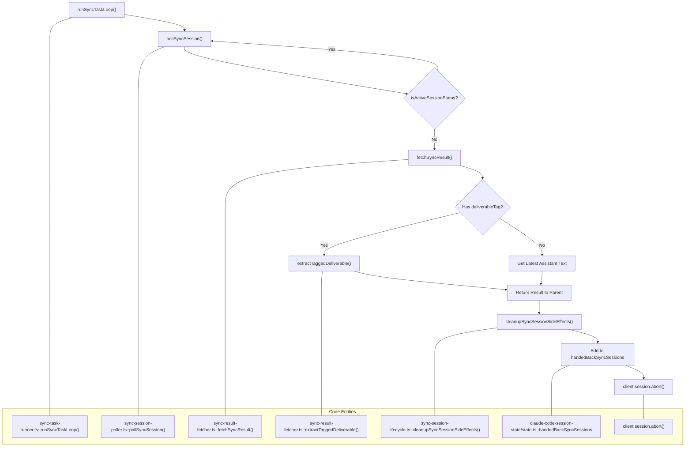
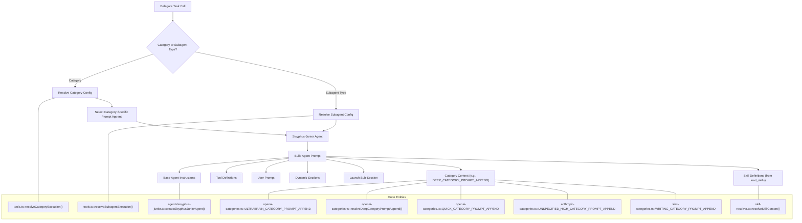
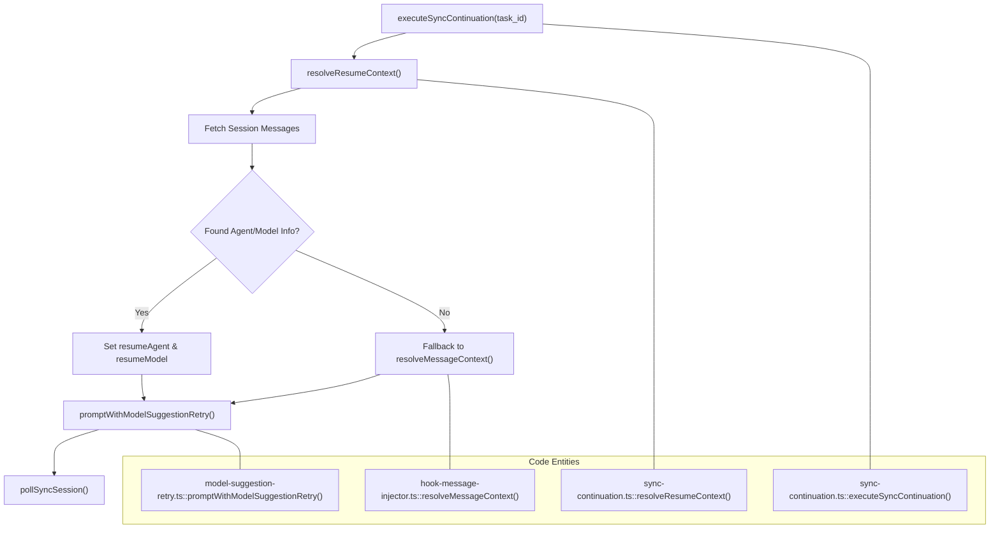

# Task Delegation

Relevant source files

The following files were used as context for generating this wiki page:

- [packages/omo-opencode/src/features/claude-code-session-state/state.ts](https://github.com/code-yeongyu/oh-my-openagent/blob/HEAD/packages/omo-opencode/src/features/claude-code-session-state/state.ts)
- [packages/omo-opencode/src/hooks/todo-continuation-enforcer/continuation-injection.test.ts](https://github.com/code-yeongyu/oh-my-openagent/blob/HEAD/packages/omo-opencode/src/hooks/todo-continuation-enforcer/continuation-injection.test.ts)
- [packages/omo-opencode/src/hooks/todo-continuation-enforcer/continuation-injection.ts](https://github.com/code-yeongyu/oh-my-openagent/blob/HEAD/packages/omo-opencode/src/hooks/todo-continuation-enforcer/continuation-injection.ts)
- [packages/omo-opencode/src/hooks/todo-continuation-enforcer/handler.ts](https://github.com/code-yeongyu/oh-my-openagent/blob/HEAD/packages/omo-opencode/src/hooks/todo-continuation-enforcer/handler.ts)
- [packages/omo-opencode/src/hooks/todo-continuation-enforcer/idle-event.ts](https://github.com/code-yeongyu/oh-my-openagent/blob/HEAD/packages/omo-opencode/src/hooks/todo-continuation-enforcer/idle-event.ts)
- [packages/omo-opencode/src/hooks/todo-continuation-enforcer/non-idle-events.test.ts](https://github.com/code-yeongyu/oh-my-openagent/blob/HEAD/packages/omo-opencode/src/hooks/todo-continuation-enforcer/non-idle-events.test.ts)
- [packages/omo-opencode/src/hooks/todo-continuation-enforcer/non-idle-events.ts](https://github.com/code-yeongyu/oh-my-openagent/blob/HEAD/packages/omo-opencode/src/hooks/todo-continuation-enforcer/non-idle-events.ts)
- [packages/omo-opencode/src/hooks/todo-continuation-enforcer/session-state.test.ts](https://github.com/code-yeongyu/oh-my-openagent/blob/HEAD/packages/omo-opencode/src/hooks/todo-continuation-enforcer/session-state.test.ts)
- [packages/omo-opencode/src/hooks/todo-continuation-enforcer/session-state.ts](https://github.com/code-yeongyu/oh-my-openagent/blob/HEAD/packages/omo-opencode/src/hooks/todo-continuation-enforcer/session-state.ts)
- [packages/omo-opencode/src/hooks/todo-continuation-enforcer/types.ts](https://github.com/code-yeongyu/oh-my-openagent/blob/HEAD/packages/omo-opencode/src/hooks/todo-continuation-enforcer/types.ts)
- [packages/omo-opencode/src/tools/AGENTS.md](https://github.com/code-yeongyu/oh-my-openagent/blob/HEAD/packages/omo-opencode/src/tools/AGENTS.md)
- [packages/omo-opencode/src/tools/call-omo-agent/sync-executor-reawaken-guard.test.ts](https://github.com/code-yeongyu/oh-my-openagent/blob/HEAD/packages/omo-opencode/src/tools/call-omo-agent/sync-executor-reawaken-guard.test.ts)
- [packages/omo-opencode/src/tools/call-omo-agent/sync-executor.ts](https://github.com/code-yeongyu/oh-my-openagent/blob/HEAD/packages/omo-opencode/src/tools/call-omo-agent/sync-executor.ts)
- [packages/omo-opencode/src/tools/delegate-task/anthropic-categories.ts](https://github.com/code-yeongyu/oh-my-openagent/blob/HEAD/packages/omo-opencode/src/tools/delegate-task/anthropic-categories.ts)
- [packages/omo-opencode/src/tools/delegate-task/builtin-categories.ts](https://github.com/code-yeongyu/oh-my-openagent/blob/HEAD/packages/omo-opencode/src/tools/delegate-task/builtin-categories.ts)
- [packages/omo-opencode/src/tools/delegate-task/builtin-category-definition.ts](https://github.com/code-yeongyu/oh-my-openagent/blob/HEAD/packages/omo-opencode/src/tools/delegate-task/builtin-category-definition.ts)
- [packages/omo-opencode/src/tools/delegate-task/categories.ts](https://github.com/code-yeongyu/oh-my-openagent/blob/HEAD/packages/omo-opencode/src/tools/delegate-task/categories.ts)
- [packages/omo-opencode/src/tools/delegate-task/category-routing-policy.test.ts](https://github.com/code-yeongyu/oh-my-openagent/blob/HEAD/packages/omo-opencode/src/tools/delegate-task/category-routing-policy.test.ts)
- [packages/omo-opencode/src/tools/delegate-task/constants.ts](https://github.com/code-yeongyu/oh-my-openagent/blob/HEAD/packages/omo-opencode/src/tools/delegate-task/constants.ts)
- [packages/omo-opencode/src/tools/delegate-task/google-categories.ts](https://github.com/code-yeongyu/oh-my-openagent/blob/HEAD/packages/omo-opencode/src/tools/delegate-task/google-categories.ts)
- [packages/omo-opencode/src/tools/delegate-task/kimi-categories.ts](https://github.com/code-yeongyu/oh-my-openagent/blob/HEAD/packages/omo-opencode/src/tools/delegate-task/kimi-categories.ts)
- [packages/omo-opencode/src/tools/delegate-task/openai-categories.ts](https://github.com/code-yeongyu/oh-my-openagent/blob/HEAD/packages/omo-opencode/src/tools/delegate-task/openai-categories.ts)
- [packages/omo-opencode/src/tools/delegate-task/sync-session-lifecycle.test.ts](https://github.com/code-yeongyu/oh-my-openagent/blob/HEAD/packages/omo-opencode/src/tools/delegate-task/sync-session-lifecycle.test.ts)
- [packages/omo-opencode/src/tools/delegate-task/sync-session-lifecycle.ts](https://github.com/code-yeongyu/oh-my-openagent/blob/HEAD/packages/omo-opencode/src/tools/delegate-task/sync-session-lifecycle.ts)
- [packages/omo-opencode/src/tools/delegate-task/sync-task-reawaken-guard.test.ts](https://github.com/code-yeongyu/oh-my-openagent/blob/HEAD/packages/omo-opencode/src/tools/delegate-task/sync-task-reawaken-guard.test.ts)
- [packages/omo-opencode/src/tools/delegate-task/sync-task.ts](https://github.com/code-yeongyu/oh-my-openagent/blob/HEAD/packages/omo-opencode/src/tools/delegate-task/sync-task.ts)
- [packages/omo-opencode/src/tools/delegate-task/tools.test.ts](https://github.com/code-yeongyu/oh-my-openagent/blob/HEAD/packages/omo-opencode/src/tools/delegate-task/tools.test.ts)

Task delegation is the primary mechanism for spawning specialized agents to execute subtasks. The `delegate_task` tool (implemented via `createDelegateTask`) enables the main orchestrator agents (Sisyphus, Atlas, Prometheus) to distribute work to category-optimized or specialized agents. This page documents the tool's parameters, delegation modes, prompt construction, and the execution polling logic.

---

## Tool Definition and Parameters

The `delegate_task` tool is registered in the tool registry and created by the `createDelegateTask` factory function [packages/omo-opencode/src/tools/delegate-task/tools.ts:81-81](https://github.com/code-yeongyu/oh-my-openagent/blob/HEAD/packages/omo-opencode/src/tools/delegate-task/tools.ts#L81). It requires either a `category` or `subagent_type` parameter to determine which agent will execute the task [packages/omo-opencode/src/tools/delegate-task/tools.ts:131-133](https://github.com/code-yeongyu/oh-my-openagent/blob/HEAD/packages/omo-opencode/src/tools/delegate-task/tools.ts#L131-L133).

### Parameters Schema

The tool arguments are defined in `delegateTaskArgsSchema` [packages/omo-opencode/src/tools/delegate-task/tools.ts:61-79](https://github.com/code-yeongyu/oh-my-openagent/blob/HEAD/packages/omo-opencode/src/tools/delegate-task/tools.ts#L61-L79):

| Parameter | Type | Description |
|-----------|------|-------------|
| `load_skills` | `string[]` | Skill names to inject. Optional. Pass an explicit array (e.g. `["git-master"]`) for skill-specific tasks. [packages/omo-opencode/src/tools/delegate-task/tools.ts:62-65](https://github.com/code-yeongyu/oh-my-openagent/blob/HEAD/packages/omo-opencode/src/tools/delegate-task/tools.ts#L62-L65) |
| `description` | `string` | Short task description (3-5 words). [packages/omo-opencode/src/tools/delegate-task/tools.ts:66-66](https://github.com/code-yeongyu/oh-my-openagent/blob/HEAD/packages/omo-opencode/src/tools/delegate-task/tools.ts#L66) |
| `prompt` | `string` | Full detailed prompt for the agent. [packages/omo-opencode/src/tools/delegate-task/tools.ts:67-67](https://github.com/code-yeongyu/oh-my-openagent/blob/HEAD/packages/omo-opencode/src/tools/delegate-task/tools.ts#L67) |
| `run_in_background` | `boolean` | `true`=async (returns `bg_...`), `false`=sync (waits). [packages/omo-opencode/src/tools/delegate-task/tools.ts:68-72](https://github.com/code-yeongyu/oh-my-openagent/blob/HEAD/packages/omo-opencode/src/tools/delegate-task/tools.ts#L68-L72) |
| `category` | `string` | REQUIRED if `subagent_type` not provided. Maps to specific model configurations. [packages/omo-opencode/src/tools/delegate-task/tools.ts:73-73](https://github.com/code-yeongyu/oh-my-openagent/blob/HEAD/packages/omo-opencode/src/tools/delegate-task/tools.ts#L73) |
| `subagent_type` | `string` | REQUIRED if `category` not provided. Invokes a specific specialist. [packages/omo-opencode/src/tools/delegate-task/tools.ts:74-74](https://github.com/code-yeongyu/oh-my-openagent/blob/HEAD/packages/omo-opencode/src/tools/delegate-task/tools.ts#L74) |
| `task_id` | `string` | Continuation session id (`ses_...`) used for resuming tasks. [packages/omo-opencode/src/tools/delegate-task/tools.ts:75-78](https://github.com/code-yeongyu/oh-my-openagent/blob/HEAD/packages/omo-opencode/src/tools/delegate-task/tools.ts#L75-L78)

**Sources:** [packages/omo-opencode/src/tools/delegate-task/tools.ts:61-79](https://github.com/code-yeongyu/oh-my-openagent/blob/HEAD/packages/omo-opencode/src/tools/delegate-task/tools.ts#L61-L79)

---

## Delegation Logic and Categories

The system uses a resolution pipeline to determine which agent and model to use based on the input parameters.

### Category vs. Subagent Type
- **Category-Based**: Spawns a `Sisyphus-Junior` agent by default [packages/omo-opencode/src/agents/AGENTS.md:32-32](https://github.com/code-yeongyu/oh-my-openagent/blob/HEAD/packages/omo-opencode/src/agents/AGENTS.md#L32). It uses `resolveCategoryExecution` to find the optimal model (e.g., `visual-engineering` or `ultrabrain`) [packages/omo-opencode/src/tools/delegate-task/tools.ts:158-160](https://github.com/code-yeongyu/oh-my-openagent/blob/HEAD/packages/omo-opencode/src/tools/delegate-task/tools.ts#L158-L160).
- **Subagent-Type**: Invokes a specific specialized agent (e.g., `hephaestus`, `atlas`) via `resolveSubagentExecution` [packages/omo-opencode/src/tools/delegate-task/tools.ts:162-164](https://github.com/code-yeongyu/oh-my-openagent/blob/HEAD/packages/omo-opencode/src/tools/delegate-task/tools.ts#L162-L164).

### Built-in Categories
The system provides 8 built-in categories, each with optimized models and specific prompt behaviors [packages/omo-opencode/src/tools/AGENTS.md:54-63](https://github.com/code-yeongyu/oh-my-openagent/blob/HEAD/packages/omo-opencode/src/tools/AGENTS.md#L54-L63):

| Category | Default Model | Source File | Domain |
|----------|---------------|-------------|--------|
| `visual-engineering` | `anthropic/claude-opus-5` (variant: max) | `google-categories.ts` | Frontend, UI/UX [packages/omo-opencode/src/tools/AGENTS.md:56-56](https://github.com/code-yeongyu/oh-my-openagent/blob/HEAD/packages/omo-opencode/src/tools/AGENTS.md#L56) |
| `ultrabrain` | `openai/gpt-5.6-sol` (variant: xhigh) | `openai-categories.ts` | Hard logic / heavy reasoning [packages/omo-opencode/src/tools/AGENTS.md:57-57](https://github.com/code-yeongyu/oh-my-openagent/blob/HEAD/packages/omo-opencode/src/tools/AGENTS.md#L57) |
| `deep` | `openai/gpt-5.6-sol` (variant: medium) | `openai-categories.ts` | Autonomous multi-step problem-solving [packages/omo-opencode/src/tools/AGENTS.md:58-58](https://github.com/code-yeongyu/oh-my-openagent/blob/HEAD/packages/omo-opencode/src/tools/AGENTS.md#L58) |
| `artistry` | `anthropic/claude-fable-5` (variant: xhigh) | `google-categories.ts` | Creative / unconventional approaches [packages/omo-opencode/src/tools/AGENTS.md:59-59](https://github.com/code-yeongyu/oh-my-openagent/blob/HEAD/packages/omo-opencode/src/tools/AGENTS.md#L59) |
| `quick` | `kimi-for-coding/kimi-for-coding-highspeed` | `openai-categories.ts` | Trivial single-file changes [packages/omo-opencode/src/tools/AGENTS.md:60-60](https://github.com/code-yeongyu/oh-my-openagent/blob/HEAD/packages/omo-opencode/src/tools/AGENTS.md#L60) |
| `unspecified-low` | `openai/gpt-5.6-luna` (variant: xhigh) | `openai-categories.ts` | Moderate effort fallback [packages/omo-opencode/src/tools/AGENTS.md:61-61](https://github.com/code-yeongyu/oh-my-openagent/blob/HEAD/packages/omo-opencode/src/tools/AGENTS.md#L61) |
| `unspecified-high` | `kimi-for-coding/kimi-k3` (variant: max) | `anthropic-categories.ts` | High effort fallback [packages/omo-opencode/src/tools/AGENTS.md:62-62](https://github.com/code-yeongyu/oh-my-openagent/blob/HEAD/packages/omo-opencode/src/tools/AGENTS.md#L62) |
| `writing` | `kimi-for-coding/kimi-k3` (variant: low) | `kimi-categories.ts` | Documentation, prose [packages/omo-opencode/src/tools/AGENTS.md:63-63](https://github.com/code-yeongyu/oh-my-openagent/blob/HEAD/packages/omo-opencode/src/tools/AGENTS.md#L63)

### Tool Gating and Permissions
Delegated agents have restricted toolsets to prevent recursive orchestration or inappropriate tool usage [packages/omo-opencode/src/agents/AGENTS.md:34-46](https://github.com/code-yeongyu/oh-my-openagent/blob/HEAD/packages/omo-opencode/src/agents/AGENTS.md#L34-L46).
- `Oracle`, `Librarian`, `Explore` are denied `write`, `edit`, `task`, `call_omo_agent` [packages/omo-opencode/src/agents/AGENTS.md:40-42](https://github.com/code-yeongyu/oh-my-openagent/blob/HEAD/packages/omo-opencode/src/agents/AGENTS.md#L40-L42).
- `Multimodal-Looker` is denied all tools except `read` [packages/omo-opencode/src/agents/AGENTS.md:43-43](https://github.com/code-yeongyu/oh-my-openagent/blob/HEAD/packages/omo-opencode/src/agents/AGENTS.md#L43).
- `Atlas` is denied `task`, `call_omo_agent` [packages/omo-opencode/src/agents/AGENTS.md:44-44](https://github.com/code-yeongyu/oh-my-openagent/blob/HEAD/packages/omo-opencode/src/agents/AGENTS.md#L44).
- `Momus` is denied `write`, `edit`, `task` [packages/omo-opencode/src/agents/AGENTS.md:45-45](https://github.com/code-yeongyu/oh-my-openagent/blob/HEAD/packages/omo-opencode/src/agents/AGENTS.md#L45).
- `Prometheus` enforces `.md`-only writes via a `prometheus-md-only` hook [packages/omo-opencode/src/agents/AGENTS.md:46-46](https://github.com/code-yeongyu/oh-my-openagent/blob/HEAD/packages/omo-opencode/src/agents/AGENTS.md#L46).

**Sources:** [packages/omo-opencode/src/agents/AGENTS.md:40-46](https://github.com/code-yeongyu/oh-my-openagent/blob/HEAD/packages/omo-opencode/src/agents/AGENTS.md#L40-L46), [packages/omo-opencode/src/tools/delegate-task/tools.ts:131-172](https://github.com/code-yeongyu/oh-my-openagent/blob/HEAD/packages/omo-opencode/src/tools/delegate-task/tools.ts#L131-L172), [packages/omo-opencode/src/tools/AGENTS.md:54-63](https://github.com/code-yeongyu/oh-my-openagent/blob/HEAD/packages/omo-opencode/src/tools/AGENTS.md#L54-L63)

---

## Sync Execution Flow

The `runSyncTaskLoop` manages the lifecycle of a synchronous delegation [packages/omo-opencode/src/tools/delegate-task/sync-task-runner.ts:67-67](https://github.com/code-yeongyu/oh-my-openagent/blob/HEAD/packages/omo-opencode/src/tools/delegate-task/sync-task-runner.ts#L67).

### 1. Session Polling
The `pollSyncSession` function monitors the sub-session until completion [packages/omo-opencode/src/tools/delegate-task/sync-session-poller.ts:44-59](https://github.com/code-yeongyu/oh-my-openagent/blob/HEAD/packages/omo-opencode/src/tools/delegate-task/sync-session-poller.ts#L44-L59). It tracks `isActiveSessionStatus` (busy, retry, running) [packages/omo-opencode/src/tools/delegate-task/sync-session-poller.ts:10-10](https://github.com/code-yeongyu/oh-my-openagent/blob/HEAD/packages/omo-opencode/src/tools/delegate-task/sync-session-poller.ts#L10) and handles user aborts [packages/omo-opencode/src/tools/delegate-task/sync-session-poller.ts:108-142](https://github.com/code-yeongyu/oh-my-openagent/blob/HEAD/packages/omo-opencode/src/tools/delegate-task/sync-session-poller.ts#L108-L142). It also implements a grace period (`childWakeGraceMs`) to wait for background children to settle before declaring a session finished [packages/omo-opencode/src/tools/delegate-task/sync-session-poller.ts:69-97](https://github.com/code-yeongyu/oh-my-openagent/blob/HEAD/packages/omo-opencode/src/tools/delegate-task/sync-session-poller.ts#L69-L97).

### 2. Result Extraction and Deliverable Tags
To resolve ambiguity in multi-turn sessions, the system uses `deliverableTag` (e.g., `<plan>...</plan>`) [packages/omo-opencode/src/tools/delegate-task/sync-result-fetcher.ts:38-55](https://github.com/code-yeongyu/oh-my-openagent/blob/HEAD/packages/omo-opencode/src/tools/delegate-task/sync-result-fetcher.ts#L38-L55).
- `extractTaggedDeliverable` searches for the last complete tag block in assistant messages [packages/omo-opencode/src/tools/delegate-task/sync-result-fetcher.ts:44-53](https://github.com/code-yeongyu/oh-my-openagent/blob/HEAD/packages/omo-opencode/src/tools/delegate-task/sync-result-fetcher.ts#L44-L53).
- `isSessionComplete` checks for terminal finish reasons (e.g., `stop`, `end_turn`) and ensures the last assistant message ID is greater than the last relevant user message ID [packages/omo-opencode/src/tools/delegate-task/sync-session-turns.ts:42-50](https://github.com/code-yeongyu/oh-my-openagent/blob/HEAD/packages/omo-opencode/src/tools/delegate-task/sync-session-turns.ts#L42-L50).
- Internal wakes like `[ALL BACKGROUND TASKS COMPLETE]` are treated as markers to stop polling once background children finish [packages/omo-opencode/src/tools/delegate-task/sync-session-turns.ts:21-23](https://github.com/code-yeongyu/oh-my-openagent/blob/HEAD/packages/omo-opencode/src/tools/delegate-task/sync-session-turns.ts#L21-L23).

### 3. Error Recovery and Fallbacks
- **Poll Recovery**: If a poll fails with an `AbortError` or `MessageAbortedError`, the system attempts `strictAbortRecovery` via `fetchSyncResult` to see if a valid result was generated before the abort [packages/omo-opencode/src/tools/delegate-task/sync-result-fetcher.ts:105-130](https://github.com/code-yeongyu/oh-my-openagent/blob/HEAD/packages/omo-opencode/src/tools/delegate-task/sync-result-fetcher.ts#L105-L130), [packages/omo-opencode/src/tools/delegate-task/sync-continuation.ts:29-52](https://github.com/code-yeongyu/oh-my-openagent/blob/HEAD/packages/omo-opencode/src/tools/delegate-task/sync-continuation.ts#L29-L52).
- **Model Fallbacks**: If a provider is exhausted, `getNextSyncFallbackModel` is used to switch models and retry the task in a new session [packages/omo-opencode/src/tools/delegate-task/sync-task-runner.ts:173-195](https://github.com/code-yeongyu/oh-my-openagent/blob/HEAD/packages/omo-opencode/src/tools/delegate-task/sync-task-runner.ts#L173-L195).
- **Sync Session Cleanup**: After a sync task completes or fails, `cleanupSyncSessionSideEffects` is called to remove the session from active subagent tracking, clear its bootstrap configuration, and clear its model fallback chain [packages/omo-opencode/src/tools/delegate-task/sync-session-lifecycle.ts:57-63](https://github.com/code-yeongyu/oh-my-openagent/blob/HEAD/packages/omo-opencode/src/tools/delegate-task/sync-session-lifecycle.ts#L57-L63). The session is then added to `handedBackSyncSessions` to prevent the `todo-continuation-enforcer` hook from re-awakening it [packages/omo-opencode/src/tools/delegate-task/sync-task.ts:158-160](https://github.com/code-yeongyu/oh-my-openagent/blob/HEAD/packages/omo-opencode/src/tools/delegate-task/sync-task.ts#L158-L160). An explicit `client.session.abort` is also attempted to cancel any remaining background jobs within the child session [packages/omo-opencode/src/tools/delegate-task/sync-task.ts:167-172](https://github.com/code-yeongyu/oh-my-openagent/blob/HEAD/packages/omo-opencode/src/tools/delegate-task/sync-task.ts#L167-L172).

Title: "Sync Task Polling and Result Extraction"

**Sources:** [packages/omo-opencode/src/tools/delegate-task/sync-task-runner.ts:67-206](https://github.com/code-yeongyu/oh-my-openagent/blob/HEAD/packages/omo-opencode/src/tools/delegate-task/sync-task-runner.ts#L67-L206), [packages/omo-opencode/src/tools/delegate-task/sync-session-poller.ts:44-106](https://github.com/code-yeongyu/oh-my-openagent/blob/HEAD/packages/omo-opencode/src/tools/delegate-task/sync-session-poller.ts#L44-L106), [packages/omo-opencode/src/tools/delegate-task/sync-result-fetcher.ts:38-164](https://github.com/code-yeongyu/oh-my-openagent/blob/HEAD/packages/omo-opencode/src/tools/delegate-task/sync-result-fetcher.ts#L38-L164), [packages/omo-opencode/src/tools/delegate-task/sync-session-turns.ts:42-50](https://github.com/code-yeongyu/oh-my-openagent/blob/HEAD/packages/omo-opencode/src/tools/delegate-task/sync-session-turns.ts#L42-L50), [packages/omo-opencode/src/tools/delegate-task/sync-session-lifecycle.ts:57-63](https://github.com/code-yeongyu/oh-my-openagent/blob/HEAD/packages/omo-opencode/src/tools/delegate-task/sync-session-lifecycle.ts#L57-L63), [packages/omo-opencode/src/tools/delegate-task/sync-task.ts:158-172](https://github.com/code-yeongyu/oh-my-openagent/blob/HEAD/packages/omo-opencode/src/tools/delegate-task/sync-task.ts#L158-L172), [packages/omo-opencode/src/features/claude-code-session-state/state.ts:1-1](https://github.com/code-yeongyu/oh-my-openagent/blob/HEAD/packages/omo-opencode/src/features/claude-code-session-state/state.ts#L1)

---

## Skill and Prompt Construction

The system prompt for delegated agents is built dynamically by combining the base agent context with requested skills and category-specific instructions.

### Skill Resolution
When a subagent is spawned via `delegate_task`, the `load_skills` parameter triggers `resolveSkillContent` [packages/omo-opencode/src/tools/delegate-task/skill-resolver.ts:5-5](https://github.com/code-yeongyu/oh-my-openagent/blob/HEAD/packages/omo-opencode/src/tools/delegate-task/skill-resolver.ts#L5).
- **Resolution Order**: It first checks `getLoadedSkills` (runtime/plugin skills), then falls back to `nativeSkills` (on-disk skills defined in `.opencode/skills/` or `SKILL.md`) [packages/omo-opencode/src/tools/delegate-task/skill-resolver.test.ts:75-109](https://github.com/code-yeongyu/oh-my-openagent/blob/HEAD/packages/omo-opencode/src/tools/delegate-task/skill-resolver.test.ts#L75-L109).
- **Shadowing**: Local project skills shadow bundled shared skills [packages/omo-opencode/src/plugin/skill-context-shared-skill.test.ts:198-204](https://github.com/code-yeongyu/oh-my-openagent/blob/HEAD/packages/omo-opencode/src/plugin/skill-context-shared-skill.test.ts#L198-L204).
- **Deduplication**: Skills are deduplicated by name, prioritizing project scope over user or builtin scopes [packages/skills-loader-core/src/features/opencode-skill-loader/merger.ts:84-89](https://github.com/code-yeongyu/oh-my-openagent/blob/HEAD/packages/skills-loader-core/src/features/opencode-skill-loader/merger.ts#L84-L89).

### 6-Section Prompt Structure
The prompt for delegated tasks is constructed dynamically, incorporating a base prompt, category-specific context, and skill definitions. For categories like `deep` and `quick`, specific prompt appends are used to guide the agent's behavior.

1.  **Base Agent Prompt**: The core instructions for the agent, defined in its `instructions` field.
2.  **Category Context**: Appended based on the chosen `category`. For example:
    - `ultrabrain`: Emphasizes deep logical reasoning, code style requirements, and strategic advisor mindset [packages/omo-opencode/src/tools/delegate-task/openai-categories.ts:4-24](https://github.com/code-yeongyu/oh-my-openagent/blob/HEAD/packages/omo-opencode/src/tools/delegate-task/openai-categories.ts#L4-L24).
    - `deep`: Focuses on goal-oriented autonomous tasks, extensive codebase exploration, and comprehensive solutions. The prompt append for `deep` category is dynamically resolved based on the model being used, with a specific version for GPT-5.5/5.6 models [packages/omo-opencode/src/tools/delegate-task/openai-categories.ts:26-74](https://github.com/code-yeongyu/oh-my-openagent/blob/HEAD/packages/omo-opencode/src/tools/delegate-task/openai-categories.ts#L26-L74).
    - `quick`: Stresses efficient execution, minimal viable implementation, and explicit instructions due to using a smaller/faster model [packages/omo-opencode/src/tools/delegate-task/openai-categories.ts:76-125](https://github.com/code-yeongyu/oh-my-openagent/blob/HEAD/packages/omo-opencode/src/tools/delegate-task/openai-categories.ts#L76-L125).
    - `unspecified-high`: Guides agents on tasks requiring substantial effort that don't fit other specific categories [packages/omo-opencode/src/tools/delegate-task/anthropic-categories.ts:3-15](https://github.com/code-yeongyu/oh-my-openagent/blob/HEAD/packages/omo-opencode/src/tools/delegate-task/anthropic-categories.ts#L3-L15).
    - `writing`: Enforces specific prose style, anti-AI-slop rules, and focuses on documentation and technical writing [packages/omo-opencode/src/tools/delegate-task/kimi-categories.ts:3-27](https://github.com/code-yeongyu/oh-my-openagent/blob/HEAD/packages/omo-opencode/src/tools/delegate-task/kimi-categories.ts#L3-L27).
3.  **Skill Definitions**: Injected based on the `load_skills` parameter, providing the agent with specific capabilities.
4.  **Tool Definitions**: The available tools for the delegated agent are described.
5.  **User Prompt**: The specific task prompt provided by the delegating agent.
6.  **Dynamic Sections**: Additional sections dynamically generated based on context, such as available agents or tool categorization.

Title: "Dynamic Prompt Construction"

**Sources:** [packages/omo-opencode/src/tools/delegate-task/openai-categories.ts:4-125](https://github.com/code-yeongyu/oh-my-openagent/blob/HEAD/packages/omo-opencode/src/tools/delegate-task/openai-categories.ts#L4-L125), [packages/omo-opencode/src/tools/delegate-task/anthropic-categories.ts:3-15](https://github.com/code-yeongyu/oh-my-openagent/blob/HEAD/packages/omo-opencode/src/tools/delegate-task/anthropic-categories.ts#L3-L15), [packages/omo-opencode/src/tools/delegate-task/kimi-categories.ts:3-27](https://github.com/code-yeongyu/oh-my-openagent/blob/HEAD/packages/omo-opencode/src/tools/delegate-task/kimi-categories.ts#L3-L27), [packages/omo-opencode/src/tools/delegate-task/skill-resolver.ts:5-5](https://github.com/code-yeongyu/oh-my-openagent/blob/HEAD/packages/omo-opencode/src/tools/delegate-task/skill-resolver.ts#L5), [packages/skills-loader-core/src/features/opencode-skill-loader/merger.ts:38-132](https://github.com/code-yeongyu/oh-my-openagent/blob/HEAD/packages/skills-loader-core/src/features/opencode-skill-loader/merger.ts#L38-L132)

---

## Continuation Logic

Tasks can be resumed using a `task_id`. The `executeSyncContinuation` function resolves the previous state to ensure continuity [packages/omo-opencode/src/tools/delegate-task/sync-continuation.ts:94-101](https://github.com/code-yeongyu/oh-my-openagent/blob/HEAD/packages/omo-opencode/src/tools/delegate-task/sync-continuation.ts#L94-L101).

- **Context Resolution**: `resolveResumeContext` inspects previous session messages to identify the `resumeAgent` and `resumeModel` used in the last turn [packages/omo-opencode/src/tools/delegate-task/sync-continuation.ts:55-92](https://github.com/code-yeongyu/oh-my-openagent/blob/HEAD/packages/omo-opencode/src/tools/delegate-task/sync-continuation.ts#L55-L92).
- **Tool Restoration**: It reapplies tool restrictions via `getAgentToolRestrictions` and `setSessionTools` to ensure the resumed session has the correct permissions [packages/omo-opencode/src/tools/delegate-task/sync-continuation.ts:159-165](https://github.com/code-yeongyu/oh-my-openagent/blob/HEAD/packages/omo-opencode/src/tools/delegate-task/sync-continuation.ts#L159-L165).
- **Metadata Publication**: The continuation logic publishes metadata about the resumed task to the `tool-metadata-store` [packages/omo-opencode/src/tools/delegate-task/sync-continuation.ts:137-154](https://github.com/code-yeongyu/oh-my-openagent/blob/HEAD/packages/omo-opencode/src/tools/delegate-task/sync-continuation.ts#L137-L154).

Title: "Task Continuation and State Recovery"

**Sources:** [packages/omo-opencode/src/tools/delegate-task/sync-continuation.ts:55-180](https://github.com/code-yeongyu/oh-my-openagent/blob/HEAD/packages/omo-opencode/src/tools/delegate-task/sync-continuation.ts#L55-L180), [packages/omo-opencode/src/features/hook-message-injector/index.ts:10-10](https://github.com/code-yeongyu/oh-my-openagent/blob/HEAD/packages/omo-opencode/src/features/hook-message-injector/index.ts#L10)