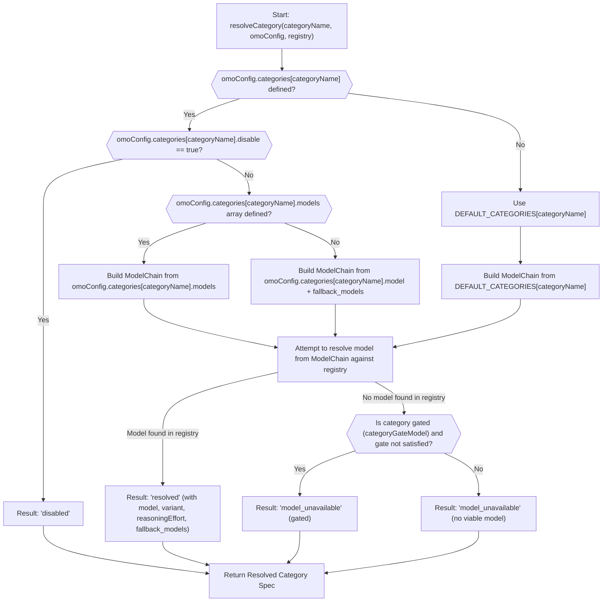
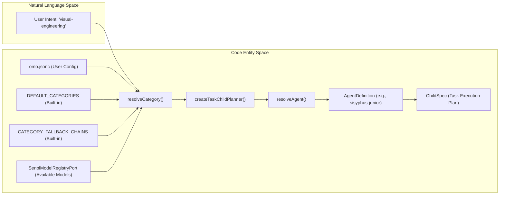

# Categories System

<details>
<summary>Relevant source files</summary>

The following files were used as context for generating this wiki page:

- [.omo/evidence/task-5-senpi-model-chain-overhaul.txt](https://github.com/code-yeongyu/oh-my-openagent/blob/HEAD/.omo/evidence/task-5-senpi-model-chain-overhaul.txt)
- [packages/delegate-core/src/model-selection.test.ts](https://github.com/code-yeongyu/oh-my-openagent/blob/HEAD/packages/delegate-core/src/model-selection.test.ts)
- [packages/delegate-core/src/model-selection.ts](https://github.com/code-yeongyu/oh-my-openagent/blob/HEAD/packages/delegate-core/src/model-selection.ts)
- [packages/omo-opencode/src/tools/AGENTS.md](https://github.com/code-yeongyu/oh-my-openagent/blob/HEAD/packages/omo-opencode/src/tools/AGENTS.md)
- [packages/omo-opencode/src/tools/delegate-task/anthropic-categories.ts](https://github.com/code-yeongyu/oh-my-openagent/blob/HEAD/packages/omo-opencode/src/tools/delegate-task/anthropic-categories.ts)
- [packages/omo-opencode/src/tools/delegate-task/builtin-categories.ts](https://github.com/code-yeongyu/oh-my-openagent/blob/HEAD/packages/omo-opencode/src/tools/delegate-task/builtin-categories.ts)
- [packages/omo-opencode/src/tools/delegate-task/builtin-category-definition.ts](https://github.com/code-yeongyu/oh-my-openagent/blob/HEAD/packages/omo-opencode/src/tools/delegate-task/builtin-category-definition.ts)
- [packages/omo-opencode/src/tools/delegate-task/categories.ts](https://github.com/code-yeongyu/oh-my-openagent/blob/HEAD/packages/omo-opencode/src/tools/delegate-task/categories.ts)
- [packages/omo-opencode/src/tools/delegate-task/category-routing-policy.test.ts](https://github.com/code-yeongyu/oh-my-openagent/blob/HEAD/packages/omo-opencode/src/tools/delegate-task/category-routing-policy.test.ts)
- [packages/omo-opencode/src/tools/delegate-task/constants.ts](https://github.com/code-yeongyu/oh-my-openagent/blob/HEAD/packages/omo-opencode/src/tools/delegate-task/constants.ts)
- [packages/omo-opencode/src/tools/delegate-task/google-categories.ts](https://github.com/code-yeongyu/oh-my-openagent/blob/HEAD/packages/omo-opencode/src/tools/delegate-task/google-categories.ts)
- [packages/omo-opencode/src/tools/delegate-task/kimi-categories.ts](https://github.com/code-yeongyu/oh-my-openagent/blob/HEAD/packages/omo-opencode/src/tools/delegate-task/kimi-categories.ts)
- [packages/omo-opencode/src/tools/delegate-task/openai-categories.ts](https://github.com/code-yeongyu/oh-my-openagent/blob/HEAD/packages/omo-opencode/src/tools/delegate-task/openai-categories.ts)
- [packages/omo-opencode/src/tools/delegate-task/tools.test.ts](https://github.com/code-yeongyu/oh-my-openagent/blob/HEAD/packages/omo-opencode/src/tools/delegate-task/tools.test.ts)
- [packages/omo-senpi/scripts/qa/task-runtime-fallback-e2e.mjs](https://github.com/code-yeongyu/oh-my-openagent/blob/HEAD/packages/omo-senpi/scripts/qa/task-runtime-fallback-e2e.mjs)
- [packages/omo-senpi/scripts/qa/task-runtime-fallback-mock-provider.ts](https://github.com/code-yeongyu/oh-my-openagent/blob/HEAD/packages/omo-senpi/scripts/qa/task-runtime-fallback-mock-provider.ts)
- [packages/omo-senpi/src/components/task/planner-agent-effort.test.ts](https://github.com/code-yeongyu/oh-my-openagent/blob/HEAD/packages/omo-senpi/src/components/task/planner-agent-effort.test.ts)
- [packages/omo-senpi/src/components/task/planner-runtime-fallback.test.ts](https://github.com/code-yeongyu/oh-my-openagent/blob/HEAD/packages/omo-senpi/src/components/task/planner-runtime-fallback.test.ts)
- [packages/omo-senpi/src/components/task/planner.test.ts](https://github.com/code-yeongyu/oh-my-openagent/blob/HEAD/packages/omo-senpi/src/components/task/planner.test.ts)
- [packages/omo-senpi/src/components/task/planner.ts](https://github.com/code-yeongyu/oh-my-openagent/blob/HEAD/packages/omo-senpi/src/components/task/planner.ts)
- [packages/senpi-task/src/agents/agent-builtin-chain-tuning.test.ts](https://github.com/code-yeongyu/oh-my-openagent/blob/HEAD/packages/senpi-task/src/agents/agent-builtin-chain-tuning.test.ts)
- [packages/senpi-task/src/agents/resolve-agent.test.ts](https://github.com/code-yeongyu/oh-my-openagent/blob/HEAD/packages/senpi-task/src/agents/resolve-agent.test.ts)
- [packages/senpi-task/src/agents/resolve-agent.ts](https://github.com/code-yeongyu/oh-my-openagent/blob/HEAD/packages/senpi-task/src/agents/resolve-agent.ts)
- [packages/senpi-task/src/category/available-categories.test.ts](https://github.com/code-yeongyu/oh-my-openagent/blob/HEAD/packages/senpi-task/src/category/available-categories.test.ts)
- [packages/senpi-task/src/category/gating.test.ts](https://github.com/code-yeongyu/oh-my-openagent/blob/HEAD/packages/senpi-task/src/category/gating.test.ts)
- [packages/senpi-task/src/category/index.ts](https://github.com/code-yeongyu/oh-my-openagent/blob/HEAD/packages/senpi-task/src/category/index.ts)
- [packages/senpi-task/src/category/resolve-category.test.ts](https://github.com/code-yeongyu/oh-my-openagent/blob/HEAD/packages/senpi-task/src/category/resolve-category.test.ts)
- [packages/senpi-task/src/category/resolver.ts](https://github.com/code-yeongyu/oh-my-openagent/blob/HEAD/packages/senpi-task/src/category/resolver.ts)
- [packages/senpi-task/src/category/types.ts](https://github.com/code-yeongyu/oh-my-openagent/blob/HEAD/packages/senpi-task/src/category/types.ts)
- [packages/senpi-task/src/manager/manager-runtime-fallback.test.ts](https://github.com/code-yeongyu/oh-my-openagent/blob/HEAD/packages/senpi-task/src/manager/manager-runtime-fallback.test.ts)
- [packages/senpi-task/src/manager/runtime-fallback-event.ts](https://github.com/code-yeongyu/oh-my-openagent/blob/HEAD/packages/senpi-task/src/manager/runtime-fallback-event.ts)
- [packages/senpi-task/src/manager/transcript-log.test.ts](https://github.com/code-yeongyu/oh-my-openagent/blob/HEAD/packages/senpi-task/src/manager/transcript-log.test.ts)
- [packages/senpi-task/src/manager/transcript-log.ts](https://github.com/code-yeongyu/oh-my-openagent/blob/HEAD/packages/senpi-task/src/manager/transcript-log.ts)
- [packages/senpi-task/src/model-chain.ts](https://github.com/code-yeongyu/oh-my-openagent/blob/HEAD/packages/senpi-task/src/model-chain.ts)
- [packages/senpi-task/src/runners/in-process-runtime-fallback.test.ts](https://github.com/code-yeongyu/oh-my-openagent/blob/HEAD/packages/senpi-task/src/runners/in-process-runtime-fallback.test.ts)
- [packages/senpi-task/src/runners/in-process/runtime-fallback-settings.ts](https://github.com/code-yeongyu/oh-my-openagent/blob/HEAD/packages/senpi-task/src/runners/in-process/runtime-fallback-settings.ts)
- [packages/senpi-task/src/tools/output/render.test.ts](https://github.com/code-yeongyu/oh-my-openagent/blob/HEAD/packages/senpi-task/src/tools/output/render.test.ts)
- [packages/senpi-task/src/tools/output/render.ts](https://github.com/code-yeongyu/oh-my-openagent/blob/HEAD/packages/senpi-task/src/tools/output/render.ts)

</details>


The **Categories System** in Oh My OpenAgent provides a semantic abstraction layer for classifying and delegating tasks to specialized subagents. It decouples the user's intent (e.g., "fix a UI bug") from specific model identifiers or agent configurations by encapsulating model selection logic, fallback chains, and prompt specialization.

---

## Overview

The Categories System serves three principal functions:

1.  **Intent Classification:** Tasks are grouped into semantic categories. This classification is resolved during task delegation, where a category name guides the system to the correct model and prompt behavior [packages/omo-opencode/src/tools/delegate-task/constants.ts:16-23](https://github.com/code-yeongyu/oh-my-openagent/blob/HEAD/packages/omo-opencode/src/tools/delegate-task/constants.ts#L16-L23).
2.  **Model Optimization & Resolution:** Each category is associated with a prioritized `fallbackChain`. The system resolves the best available model at runtime based on provider availability and suitability [packages/senpi-task/src/category/resolver.ts:126-175](https://github.com/code-yeongyu/oh-my-openagent/blob/HEAD/packages/senpi-task/src/category/resolver.ts#L126-L175).
3.  **Dynamic Configuration:** The system merges built-in definitions with user overrides from the configuration file, allowing users to redirect categories to specific providers or models [packages/senpi-task/src/category/resolve-category.test.ts:70-95](https://github.com/code-yeongyu/oh-my-openagent/blob/HEAD/packages/senpi-task/src/category/resolve-category.test.ts#L70-L95).

When a task is delegated (via the `delegate_task` tool), the system resolves the category to a model and invokes a specialized subagent—typically `sisyphus-junior`—to execute the work [packages/omo-senpi/src/components/task/planner.ts:30-68](https://github.com/code-yeongyu/oh-my-openagent/blob/HEAD/packages/omo-senpi/src/components/task/planner.ts#L30-L68).

Sources: [packages/omo-opencode/src/tools/delegate-task/constants.ts:16-23](https://github.com/code-yeongyu/oh-my-openagent/blob/HEAD/packages/omo-opencode/src/tools/delegate-task/constants.ts#L16-L23), [packages/senpi-task/src/category/resolver.ts:126-175](https://github.com/code-yeongyu/oh-my-openagent/blob/HEAD/packages/senpi-task/src/category/resolver.ts#L126-L175), [packages/senpi-task/src/category/resolve-category.test.ts:70-95](https://github.com/code-yeongyu/oh-my-openagent/blob/HEAD/packages/senpi-task/src/category/resolve-category.test.ts#L70-L95), [packages/omo-senpi/src/components/task/planner.ts:30-68](https://github.com/code-yeongyu/oh-my-openagent/blob/HEAD/packages/omo-senpi/src/components/task/planner.ts#L30-L68)

---

## Built-in Categories

The system provides **8 built-in categories** defined in `DEFAULT_CATEGORIES` [packages/omo-opencode/src/tools/delegate-task/constants.ts:3](https://github.com/code-yeongyu/oh-my-openagent/blob/HEAD/packages/omo-opencode/src/tools/delegate-task/constants.ts#L3). Each is tuned with a specific model, variant, and prompt append.

| Category | Default Model | Default Variant | Domain |
| :--- | :--- | :--- | :--- |
| `visual-engineering` | `anthropic/claude-opus-5` | `max` | Frontend, UI/UX, and design-focused engineering [packages/omo-opencode/src/tools/delegate-task/tools.test.ts:160-168](https://github.com/code-yeongyu/oh-my-openagent/blob/HEAD/packages/omo-opencode/src/tools/delegate-task/tools.test.ts#L160-L168) |
| `ultrabrain` | `openai/gpt-5.6-sol` | `xhigh` | Hard logic, heavy reasoning, and complex architecture [packages/omo-opencode/src/tools/delegate-task/tools.test.ts:170-178](https://github.com/code-yeongyu/oh-my-openagent/blob/HEAD/packages/omo-opencode/src/tools/delegate-task/tools.test.ts#L170-L178) |
| `deep` | `openai/gpt-5.6-sol` | `medium` | Autonomous multi-step problem-solving [packages/omo-opencode/src/tools/delegate-task/tools.test.ts:180-188](https://github.com/code-yeongyu/oh-my-openagent/blob/HEAD/packages/omo-opencode/src/tools/delegate-task/tools.test.ts#L180-L188) |
| `artistry` | `anthropic/claude-fable-5` | `xhigh` | Creative, visual design, or unconventional approaches [packages/omo-opencode/src/tools/AGENTS.md:59](https://github.com/code-yeongyu/oh-my-openagent/blob/HEAD/packages/omo-opencode/src/tools/AGENTS.md#L59) |
| `quick` | `kimi-for-coding/kimi-for-coding-highspeed` | - | Trivial single-file changes and simple edits [packages/omo-opencode/src/tools/AGENTS.md:60](https://github.com/code-yeongyu/oh-my-openagent/blob/HEAD/packages/omo-opencode/src/tools/AGENTS.md#L60) |
| `unspecified-low` | `openai/gpt-5.6-terra` | `high` | Moderate effort tasks; general purpose fallback [packages/senpi-task/src/category/resolve-category.test.ts:57-65](https://github.com/code-yeongyu/oh-my-openagent/blob/HEAD/packages/senpi-task/src/category/resolve-category.test.ts#L57-L65) |
| `unspecified-high` | `kimi-for-coding/kimi-k3` | `max` | High-effort complex tasks requiring maximum intelligence [packages/omo-opencode/src/tools/delegate-task/tools.test.ts:190-198](https://github.com/code-yeongyu/oh-my-openagent/blob/HEAD/packages/omo-opencode/src/tools/delegate-task/tools.test.ts#L190-L198) |
| `writing` | `kimi-for-coding/kimi-k3` | `low` | Documentation, prose, and technical writing [packages/omo-opencode/src/tools/AGENTS.md:63](https://github.com/code-yeongyu/oh-my-openagent/blob/HEAD/packages/omo-opencode/src/tools/AGENTS.md#L63) |

Sources: [packages/omo-opencode/src/tools/delegate-task/constants.ts:3](https://github.com/code-yeongyu/oh-my-openagent/blob/HEAD/packages/omo-opencode/src/tools/delegate-task/constants.ts#L3), [packages/omo-opencode/src/tools/delegate-task/tools.test.ts:160-168](https://github.com/code-yeongyu/oh-my-openagent/blob/HEAD/packages/omo-opencode/src/tools/delegate-task/tools.test.ts#L160-L168), [packages/omo-opencode/src/tools/delegate-task/tools.test.ts:170-178](https://github.com/code-yeongyu/oh-my-openagent/blob/HEAD/packages/omo-opencode/src/tools/delegate-task/tools.test.ts#L170-L178), [packages/omo-opencode/src/tools/delegate-task/tools.test.ts:180-188](https://github.com/code-yeongyu/oh-my-openagent/blob/HEAD/packages/omo-opencode/src/tools/delegate-task/tools.test.ts#L180-L188), [packages/omo-opencode/src/tools/AGENTS.md:59](https://github.com/code-yeongyu/oh-my-openagent/blob/HEAD/packages/omo-opencode/src/tools/AGENTS.md#L59), [packages/omo-opencode/src/tools/AGENTS.md:60](https://github.com/code-yeongyu/oh-my-openagent/blob/HEAD/packages/omo-opencode/src/tools/AGENTS.md#L60), [packages/senpi-task/src/category/resolve-category.test.ts:57-65](https://github.com/code-yeongyu/oh-my-openagent/blob/HEAD/packages/senpi-task/src/category/resolve-category.test.ts#L57-L65), [packages/omo-opencode/src/tools/delegate-task/tools.test.ts:190-198](https://github.com/code-yeongyu/oh-my-openagent/blob/HEAD/packages/omo-opencode/src/tools/delegate-task/tools.test.ts#L190-L198), [packages/omo-opencode/src/tools/AGENTS.md:63](https://github.com/code-yeongyu/oh-my-openagent/blob/HEAD/packages/omo-opencode/src/tools/AGENTS.md#L63)

---

## Model Resolution and Fallback Logic

The system uses a tiered resolution strategy to determine which model to use for a category based on the user's environment. This is handled primarily by the `resolveCategory` function [packages/senpi-task/src/category/index.ts:3](https://github.com/code-yeongyu/oh-my-openagent/blob/HEAD/packages/senpi-task/src/category/index.ts#L3).

### Resolution Priority
1.  **User Config Override:** Explicit `model` defined in the `categories` section of `omo.jsonc` [packages/senpi-task/src/category/resolve-category.test.ts:70-95](https://github.com/code-yeongyu/oh-my-openagent/blob/HEAD/packages/senpi-task/src/category/resolve-category.test.ts#L70-L95).
2.  **Canonical Model Chain:** The `models` array in `omo.jsonc` provides an ordered list of models, each with optional `variant` and `reasoning` settings [packages/senpi-task/src/category/resolver.ts:126-137](https://github.com/code-yeongyu/oh-my-openagent/blob/HEAD/packages/senpi-task/src/category/resolver.ts#L126-L137).
3.  **Legacy `model` + `fallback_models`:** If `models` is not defined, the system falls back to the `model` field as primary and `fallback_models` as a fallback chain [packages/senpi-task/src/category/resolver.ts:140-175](https://github.com/code-yeongyu/oh-my-openagent/blob/HEAD/packages/senpi-task/src/category/resolver.ts#L140-L175).
4.  **Built-in Fallback Chains:** If no user configuration is present, the system uses the `CATEGORY_FALLBACK_CHAINS` defined for each category [packages/senpi-task/src/category/resolver.ts:23](https://github.com/code-yeongyu/oh-my-openagent/blob/HEAD/packages/senpi-task/src/category/resolver.ts#L23).
5.  **Model Availability Gating:** Categories are only considered "available" if at least one model in their chain is present in the `SenpiModelRegistryPort` [packages/senpi-task/src/category/resolver.ts:181-185](https://github.com/code-yeongyu/oh-my-openagent/blob/HEAD/packages/senpi-task/src/category/resolver.ts#L181-L185).

### Diagram: Model Resolution Flow
This diagram illustrates how the system resolves a category to a specific model entity at runtime.


**Sources:** [packages/senpi-task/src/category/index.ts:3](https://github.com/code-yeongyu/oh-my-openagent/blob/HEAD/packages/senpi-task/src/category/index.ts#L3), [packages/senpi-task/src/category/resolve-category.test.ts:70-95](https://github.com/code-yeongyu/oh-my-openagent/blob/HEAD/packages/senpi-task/src/category/resolve-category.test.ts#L70-L95), [packages/senpi-task/src/category/resolver.ts:126-137](https://github.com/code-yeongyu/oh-my-openagent/blob/HEAD/packages/senpi-task/src/category/resolver.ts#L126-L137), [packages/senpi-task/src/category/resolver.ts:140-175](https://github.com/code-yeongyu/oh-my-openagent/blob/HEAD/packages/senpi-task/src/category/resolver.ts#L140-L175), [packages/senpi-task/src/category/resolver.ts:23](https://github.com/code-yeongyu/oh-my-openagent/blob/HEAD/packages/senpi-task/src/category/resolver.ts#L23), [packages/senpi-task/src/category/resolver.ts:181-185](https://github.com/code-yeongyu/oh-my-openagent/blob/HEAD/packages/senpi-task/src/category/resolver.ts#L181-L185), [packages/senpi-task/src/category/gating.test.ts:30-43](https://github.com/code-yeongyu/oh-my-openagent/blob/HEAD/packages/senpi-task/src/category/gating.test.ts#L30-L43)

---

## Implementation Details

### Data Structures
The system relies on the `DelegateFallbackEntry` type to define how categories map to models. The `OmoCategoryConfig` type in `omo-config-core` defines the structure for user-defined category overrides.

```typescript
// packages/delegate-core/src/model-selection.ts
export type DelegateFallbackEntry = {
  readonly providers: string[]
  readonly model: string
  readonly variant?: string
}

// packages/omo-config-core/src/schema.ts (simplified)
export type OmoCategoryConfig = {
  readonly model?: string
  readonly models?: readonly (string | OmoFallbackModelObject)[]
  readonly fallback_models?: OmoFallbackModels
  readonly variant?: string
  readonly reasoning?: string
  readonly reasoningEffort?: string
  readonly prompt_append?: string
  readonly disable?: boolean
  readonly description?: string
}
```
**Sources:** [packages/delegate-core/src/model-selection.ts:11-15](https://github.com/code-yeongyu/oh-my-openagent/blob/HEAD/packages/delegate-core/src/model-selection.ts#L11-L15), [packages/senpi-task/src/category/resolver.ts:6-10](https://github.com/code-yeongyu/oh-my-openagent/blob/HEAD/packages/senpi-task/src/category/resolver.ts#L6-L10)

### Specialized Execution
When a category task is triggered, the `createTaskChildPlanner` function in `omo-senpi` is responsible for resolving the category to a concrete model and agent persona. This planner is consumed by the task manager [packages/omo-senpi/src/components/task/planner.ts:30-68](https://github.com/code-yeongyu/oh-my-openagent/blob/HEAD/packages/omo-senpi/src/components/task/planner.ts#L30-L68). The `resolveAgent` function is used to determine the agent's persona and model if a `subagent_type` is specified [packages/senpi-task/src/agents/resolve-agent.ts:62-75](https://github.com/code-yeongyu/oh-my-openagent/blob/HEAD/packages/senpi-task/src/agents/resolve-agent.ts#L62-L75).

### Diagram: Category to Code Entity Mapping
This diagram bridges the gap between the semantic "Category" and the internal code structures that handle its execution.


**Sources:** [packages/omo-senpi/src/components/task/planner.ts:30-68](https://github.com/code-yeongyu/oh-my-openagent/blob/HEAD/packages/omo-senpi/src/components/task/planner.ts#L30-L68), [packages/senpi-task/src/agents/resolve-agent.ts:62-75](https://github.com/code-yeongyu/oh-my-openagent/blob/HEAD/packages/senpi-task/src/agents/resolve-agent.ts#L62-L75), [packages/senpi-task/src/category/resolver.ts:23](https://github.com/code-yeongyu/oh-my-openagent/blob/HEAD/packages/senpi-task/src/category/resolver.ts#L23), [packages/omo-opencode/src/tools/delegate-task/constants.ts:3](https://github.com/code-yeongyu/oh-my-openagent/blob/HEAD/packages/omo-opencode/src/tools/delegate-task/constants.ts#L3)

---

## User Overrides and Customization

Users can define custom categories or override built-in ones in their `omo.jsonc` configuration. This allows for fine-grained control over model selection and behavior for specific task types.

### Configuration Example
The following snippet illustrates how a user can override the `ultrabrain` category to use a specific Anthropic model with a custom variant and append additional prompt instructions. It also shows how to disable a category entirely.

```json
// omo.jsonc
{
  "categories": {
    "ultrabrain": {
      "model": "anthropic/claude-opus-4-7",
      "variant": "max",
      "prompt_append": "USER OVERLAY PROMPT"
    },
    "my-custom-category": {
      "model": "google/gemini-3.1-pro",
      "reasoningEffort": "high",
      "description": "A category for highly analytical tasks."
    },
    "deep": {
      "disable": true
    }
  }
}
```
When `resolveCategory` is called for `ultrabrain` with this configuration, the user's `anthropic/claude-opus-4-7` model will be selected, and the `prompt_append` will be combined with the built-in prompt [packages/senpi-task/src/category/resolve-category.test.ts:70-95](https://github.com/code-yeongyu/oh-my-openagent/blob/HEAD/packages/senpi-task/src/category/resolve-category.test.ts#L70-L95). If `deep` is requested, it will return a `disabled` result [packages/senpi-task/src/category/resolve-category.test.ts:98-114](https://github.com/code-yeongyu/oh-my-openagent/blob/HEAD/packages/senpi-task/src/category/resolve-category.test.ts#L98-L114).

Sources: [packages/senpi-task/src/category/resolve-category.test.ts:70-95](https://github.com/code-yeongyu/oh-my-openagent/blob/HEAD/packages/senpi-task/src/category/resolve-category.test.ts#L70-L95), [packages/senpi-task/src/category/resolve-category.test.ts:98-114](https://github.com/code-yeongyu/oh-my-openagent/blob/HEAD/packages/senpi-task/src/category/resolve-category.test.ts#L98-L114)2a:T