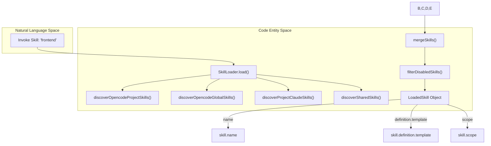
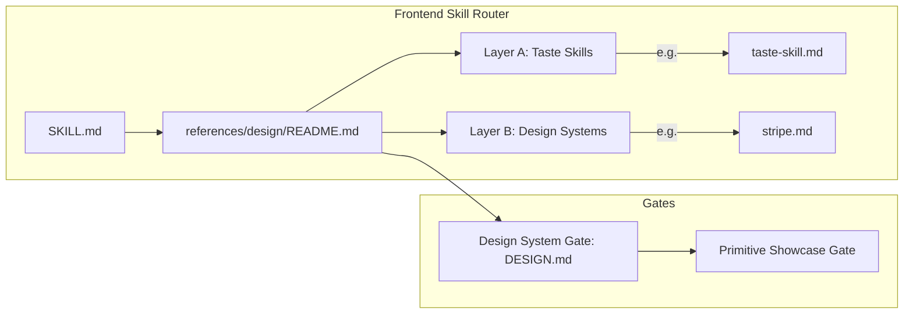

# Skills System

Relevant source files

The following files were used as context for generating this wiki page:

- [.omo/evidence/20260728-beui-interaction-skill/index-discoverability.txt](https://github.com/code-yeongyu/oh-my-openagent/blob/HEAD/.omo/evidence/20260728-beui-interaction-skill/index-discoverability.txt)
- [packages/omo-codex/plugin/components/ultrawork/skills/ulw-plan/SKILL.md](https://github.com/code-yeongyu/oh-my-openagent/blob/HEAD/packages/omo-codex/plugin/components/ultrawork/skills/ulw-plan/SKILL.md)
- [packages/omo-codex/plugin/components/ultrawork/skills/ulw-plan/references/full-workflow.md](https://github.com/code-yeongyu/oh-my-openagent/blob/HEAD/packages/omo-codex/plugin/components/ultrawork/skills/ulw-plan/references/full-workflow.md)
- [packages/omo-codex/plugin/components/ultrawork/skills/ulw-plan/references/intent-clear.md](https://github.com/code-yeongyu/oh-my-openagent/blob/HEAD/packages/omo-codex/plugin/components/ultrawork/skills/ulw-plan/references/intent-clear.md)
- [packages/omo-codex/plugin/components/ultrawork/skills/ulw-plan/references/intent-unclear.md](https://github.com/code-yeongyu/oh-my-openagent/blob/HEAD/packages/omo-codex/plugin/components/ultrawork/skills/ulw-plan/references/intent-unclear.md)
- [packages/omo-codex/plugin/components/ultrawork/skills/ulw-plan/scripts/scaffold-plan.mjs](https://github.com/code-yeongyu/oh-my-openagent/blob/HEAD/packages/omo-codex/plugin/components/ultrawork/skills/ulw-plan/scripts/scaffold-plan.mjs)
- [packages/omo-codex/plugin/skills/ulw-plan/SKILL.md](https://github.com/code-yeongyu/oh-my-openagent/blob/HEAD/packages/omo-codex/plugin/skills/ulw-plan/SKILL.md)
- [packages/omo-codex/plugin/test/scaffold-plan.test.mjs](https://github.com/code-yeongyu/oh-my-openagent/blob/HEAD/packages/omo-codex/plugin/test/scaffold-plan.test.mjs)
- [packages/omo-codex/plugin/test/ulw-plan-review-state-contract.test.mjs](https://github.com/code-yeongyu/oh-my-openagent/blob/HEAD/packages/omo-codex/plugin/test/ulw-plan-review-state-contract.test.mjs)
- [packages/omo-opencode/src/agents/builtin-agents/available-skills.test.ts](https://github.com/code-yeongyu/oh-my-openagent/blob/HEAD/packages/omo-opencode/src/agents/builtin-agents/available-skills.test.ts)
- [packages/omo-opencode/src/agents/builtin-agents/available-skills.ts](https://github.com/code-yeongyu/oh-my-openagent/blob/HEAD/packages/omo-opencode/src/agents/builtin-agents/available-skills.ts)
- [packages/omo-opencode/src/agents/dynamic-agent-prompt-builder.test.ts](https://github.com/code-yeongyu/oh-my-openagent/blob/HEAD/packages/omo-opencode/src/agents/dynamic-agent-prompt-builder.test.ts)
- [packages/omo-opencode/src/config/schema/agent-names.test.ts](https://github.com/code-yeongyu/oh-my-openagent/blob/HEAD/packages/omo-opencode/src/config/schema/agent-names.test.ts)
- [packages/omo-opencode/src/config/schema/agent-names.ts](https://github.com/code-yeongyu/oh-my-openagent/blob/HEAD/packages/omo-opencode/src/config/schema/agent-names.ts)
- [packages/omo-opencode/src/config/schema/browser-automation.ts](https://github.com/code-yeongyu/oh-my-openagent/blob/HEAD/packages/omo-opencode/src/config/schema/browser-automation.ts)
- [packages/omo-opencode/src/features/builtin-skills/frontend/SKILL.md](https://github.com/code-yeongyu/oh-my-openagent/blob/HEAD/packages/omo-opencode/src/features/builtin-skills/frontend/SKILL.md)
- [packages/omo-opencode/src/features/builtin-skills/shared-skill-extraction.test.ts](https://github.com/code-yeongyu/oh-my-openagent/blob/HEAD/packages/omo-opencode/src/features/builtin-skills/shared-skill-extraction.test.ts)
- [packages/omo-opencode/src/features/builtin-skills/skill-file-loader.test.ts](https://github.com/code-yeongyu/oh-my-openagent/blob/HEAD/packages/omo-opencode/src/features/builtin-skills/skill-file-loader.test.ts)
- [packages/omo-opencode/src/features/builtin-skills/skills.test.ts](https://github.com/code-yeongyu/oh-my-openagent/blob/HEAD/packages/omo-opencode/src/features/builtin-skills/skills.test.ts)
- [packages/omo-opencode/src/features/opencode-skill-loader/skill-content.test.ts](https://github.com/code-yeongyu/oh-my-openagent/blob/HEAD/packages/omo-opencode/src/features/opencode-skill-loader/skill-content.test.ts)
- [packages/omo-opencode/src/features/task-toast-manager/manager.test.ts](https://github.com/code-yeongyu/oh-my-openagent/blob/HEAD/packages/omo-opencode/src/features/task-toast-manager/manager.test.ts)
- [packages/omo-opencode/src/plugin-handlers/command-config-handler.test.ts](https://github.com/code-yeongyu/oh-my-openagent/blob/HEAD/packages/omo-opencode/src/plugin-handlers/command-config-handler.test.ts)
- [packages/omo-opencode/src/plugin-handlers/command-config-handler.ts](https://github.com/code-yeongyu/oh-my-openagent/blob/HEAD/packages/omo-opencode/src/plugin-handlers/command-config-handler.ts)
- [packages/omo-opencode/src/plugin/skill-context-shared-skill.test.ts](https://github.com/code-yeongyu/oh-my-openagent/blob/HEAD/packages/omo-opencode/src/plugin/skill-context-shared-skill.test.ts)
- [packages/omo-opencode/src/plugin/skill-context.ts](https://github.com/code-yeongyu/oh-my-openagent/blob/HEAD/packages/omo-opencode/src/plugin/skill-context.ts)
- [packages/omo-opencode/src/shared/skill-path-resolver.test.ts](https://github.com/code-yeongyu/oh-my-openagent/blob/HEAD/packages/omo-opencode/src/shared/skill-path-resolver.test.ts)
- [packages/omo-opencode/src/tools/delegate-task/native-skill-prompt-filter.test.ts](https://github.com/code-yeongyu/oh-my-openagent/blob/HEAD/packages/omo-opencode/src/tools/delegate-task/native-skill-prompt-filter.test.ts)
- [packages/omo-opencode/src/tools/delegate-task/prompt-builder.test.ts](https://github.com/code-yeongyu/oh-my-openagent/blob/HEAD/packages/omo-opencode/src/tools/delegate-task/prompt-builder.test.ts)
- [packages/omo-opencode/src/tools/delegate-task/prompt-builder.ts](https://github.com/code-yeongyu/oh-my-openagent/blob/HEAD/packages/omo-opencode/src/tools/delegate-task/prompt-builder.ts)
- [packages/omo-opencode/src/tools/delegate-task/skill-resolver.test.ts](https://github.com/code-yeongyu/oh-my-openagent/blob/HEAD/packages/omo-opencode/src/tools/delegate-task/skill-resolver.test.ts)
- [packages/omo-opencode/src/tools/delegate-task/skill-resolver.ts](https://github.com/code-yeongyu/oh-my-openagent/blob/HEAD/packages/omo-opencode/src/tools/delegate-task/skill-resolver.ts)
- [packages/omo-opencode/src/tools/delegate-task/tools.ts](https://github.com/code-yeongyu/oh-my-openagent/blob/HEAD/packages/omo-opencode/src/tools/delegate-task/tools.ts)
- [packages/omo-opencode/src/tools/delegate-task/types.ts](https://github.com/code-yeongyu/oh-my-openagent/blob/HEAD/packages/omo-opencode/src/tools/delegate-task/types.ts)
- [packages/omo-opencode/src/tools/skill/description-formatter.deduplication.test.ts](https://github.com/code-yeongyu/oh-my-openagent/blob/HEAD/packages/omo-opencode/src/tools/skill/description-formatter.deduplication.test.ts)
- [packages/omo-opencode/src/tools/skill/description-formatter.formatting.test.ts](https://github.com/code-yeongyu/oh-my-openagent/blob/HEAD/packages/omo-opencode/src/tools/skill/description-formatter.formatting.test.ts)
- [packages/omo-opencode/src/tools/skill/description-formatter.ts](https://github.com/code-yeongyu/oh-my-openagent/blob/HEAD/packages/omo-opencode/src/tools/skill/description-formatter.ts)
- [packages/omo-opencode/src/tools/skill/native-skills.ts](https://github.com/code-yeongyu/oh-my-openagent/blob/HEAD/packages/omo-opencode/src/tools/skill/native-skills.ts)
- [packages/omo-opencode/src/tools/skill/tools.ts](https://github.com/code-yeongyu/oh-my-openagent/blob/HEAD/packages/omo-opencode/src/tools/skill/tools.ts)
- [packages/omo-opencode/src/tools/skill/zauc-mocks-skill-tools/native-skills.test.ts](https://github.com/code-yeongyu/oh-my-openagent/blob/HEAD/packages/omo-opencode/src/tools/skill/zauc-mocks-skill-tools/native-skills.test.ts)
- [packages/shared-skills/frontend-thirdparty-manifest.test.ts](https://github.com/code-yeongyu/oh-my-openagent/blob/HEAD/packages/shared-skills/frontend-thirdparty-manifest.test.ts)
- [packages/shared-skills/scripts/frontend-refs-manifest.mjs](https://github.com/code-yeongyu/oh-my-openagent/blob/HEAD/packages/shared-skills/scripts/frontend-refs-manifest.mjs)
- [packages/shared-skills/skills/frontend/.gitignore](https://github.com/code-yeongyu/oh-my-openagent/blob/HEAD/packages/shared-skills/skills/frontend/.gitignore)
- [packages/shared-skills/skills/frontend/ATTRIBUTION.md](https://github.com/code-yeongyu/oh-my-openagent/blob/HEAD/packages/shared-skills/skills/frontend/ATTRIBUTION.md)
- [packages/shared-skills/skills/frontend/LICENSE-Apache-2.0.txt](https://github.com/code-yeongyu/oh-my-openagent/blob/HEAD/packages/shared-skills/skills/frontend/LICENSE-Apache-2.0.txt)
- [packages/shared-skills/skills/frontend/SKILL.md](https://github.com/code-yeongyu/oh-my-openagent/blob/HEAD/packages/shared-skills/skills/frontend/SKILL.md)
- [packages/shared-skills/skills/frontend/references/design/README.md](https://github.com/code-yeongyu/oh-my-openagent/blob/HEAD/packages/shared-skills/skills/frontend/references/design/README.md)
- [packages/shared-skills/skills/frontend/references/design/_INDEX.md](https://github.com/code-yeongyu/oh-my-openagent/blob/HEAD/packages/shared-skills/skills/frontend/references/design/_INDEX.md)
- [packages/shared-skills/skills/frontend/references/design/aside.md](https://github.com/code-yeongyu/oh-my-openagent/blob/HEAD/packages/shared-skills/skills/frontend/references/design/aside.md)
- [packages/shared-skills/skills/frontend/references/design/design-system-architecture.md](https://github.com/code-yeongyu/oh-my-openagent/blob/HEAD/packages/shared-skills/skills/frontend/references/design/design-system-architecture.md)
- [packages/shared-skills/skills/frontend/references/design/layout-skill.md](https://github.com/code-yeongyu/oh-my-openagent/blob/HEAD/packages/shared-skills/skills/frontend/references/design/layout-skill.md)
- [packages/shared-skills/skills/frontend/references/designpowers/README.md](https://github.com/code-yeongyu/oh-my-openagent/blob/HEAD/packages/shared-skills/skills/frontend/references/designpowers/README.md)
- [packages/shared-skills/skills/ulw-plan/SKILL.md](https://github.com/code-yeongyu/oh-my-openagent/blob/HEAD/packages/shared-skills/skills/ulw-plan/SKILL.md)
- [packages/shared-skills/skills/ulw-plan/references/full-workflow.md](https://github.com/code-yeongyu/oh-my-openagent/blob/HEAD/packages/shared-skills/skills/ulw-plan/references/full-workflow.md)
- [packages/shared-skills/skills/ulw-plan/references/intent-clear.md](https://github.com/code-yeongyu/oh-my-openagent/blob/HEAD/packages/shared-skills/skills/ulw-plan/references/intent-clear.md)
- [packages/shared-skills/skills/ulw-plan/references/intent-unclear.md](https://github.com/code-yeongyu/oh-my-openagent/blob/HEAD/packages/shared-skills/skills/ulw-plan/references/intent-unclear.md)
- [packages/shared-skills/skills/ulw-plan/scripts/scaffold-plan.mjs](https://github.com/code-yeongyu/oh-my-openagent/blob/HEAD/packages/shared-skills/skills/ulw-plan/scripts/scaffold-plan.mjs)
- [packages/shared-skills/skills/visual-qa/SKILL.md](https://github.com/code-yeongyu/oh-my-openagent/blob/HEAD/packages/shared-skills/skills/visual-qa/SKILL.md)
- [packages/skills-loader-core/src/features/builtin-skills/frontend/SKILL.md](https://github.com/code-yeongyu/oh-my-openagent/blob/HEAD/packages/skills-loader-core/src/features/builtin-skills/frontend/SKILL.md)
- [packages/skills-loader-core/src/features/builtin-skills/skills.test.ts](https://github.com/code-yeongyu/oh-my-openagent/blob/HEAD/packages/skills-loader-core/src/features/builtin-skills/skills.test.ts)
- [packages/skills-loader-core/src/features/builtin-skills/skills.ts](https://github.com/code-yeongyu/oh-my-openagent/blob/HEAD/packages/skills-loader-core/src/features/builtin-skills/skills.ts)
- [packages/skills-loader-core/src/features/builtin-skills/skills/frontend.ts](https://github.com/code-yeongyu/oh-my-openagent/blob/HEAD/packages/skills-loader-core/src/features/builtin-skills/skills/frontend.ts)
- [packages/skills-loader-core/src/features/builtin-skills/skills/index.ts](https://github.com/code-yeongyu/oh-my-openagent/blob/HEAD/packages/skills-loader-core/src/features/builtin-skills/skills/index.ts)
- [packages/skills-loader-core/src/features/builtin-skills/skills/playwright-mcp-skill.ts](https://github.com/code-yeongyu/oh-my-openagent/blob/HEAD/packages/skills-loader-core/src/features/builtin-skills/skills/playwright-mcp-skill.ts)
- [packages/skills-loader-core/src/features/builtin-skills/skills/playwright.test.ts](https://github.com/code-yeongyu/oh-my-openagent/blob/HEAD/packages/skills-loader-core/src/features/builtin-skills/skills/playwright.test.ts)
- [packages/skills-loader-core/src/features/builtin-skills/skills/playwright.ts](https://github.com/code-yeongyu/oh-my-openagent/blob/HEAD/packages/skills-loader-core/src/features/builtin-skills/skills/playwright.ts)
- [packages/skills-loader-core/src/features/opencode-runtime-skills/runtime-skill-config.test.ts](https://github.com/code-yeongyu/oh-my-openagent/blob/HEAD/packages/skills-loader-core/src/features/opencode-runtime-skills/runtime-skill-config.test.ts)
- [packages/skills-loader-core/src/features/opencode-runtime-skills/runtime-skill-config.ts](https://github.com/code-yeongyu/oh-my-openagent/blob/HEAD/packages/skills-loader-core/src/features/opencode-runtime-skills/runtime-skill-config.ts)
- [packages/skills-loader-core/src/features/opencode-skill-loader/index.ts](https://github.com/code-yeongyu/oh-my-openagent/blob/HEAD/packages/skills-loader-core/src/features/opencode-skill-loader/index.ts)
- [packages/skills-loader-core/src/features/opencode-skill-loader/loader-deduplication.test.ts](https://github.com/code-yeongyu/oh-my-openagent/blob/HEAD/packages/skills-loader-core/src/features/opencode-skill-loader/loader-deduplication.test.ts)
- [packages/skills-loader-core/src/features/opencode-skill-loader/loader.ts](https://github.com/code-yeongyu/oh-my-openagent/blob/HEAD/packages/skills-loader-core/src/features/opencode-skill-loader/loader.ts)
- [packages/skills-loader-core/src/features/opencode-skill-loader/merger.ts](https://github.com/code-yeongyu/oh-my-openagent/blob/HEAD/packages/skills-loader-core/src/features/opencode-skill-loader/merger.ts)
- [packages/skills-loader-core/src/features/opencode-skill-loader/merger/scope-priority.ts](https://github.com/code-yeongyu/oh-my-openagent/blob/HEAD/packages/skills-loader-core/src/features/opencode-skill-loader/merger/scope-priority.ts)
- [packages/skills-loader-core/src/features/opencode-skill-loader/skill-content-async-resolution.test.ts](https://github.com/code-yeongyu/oh-my-openagent/blob/HEAD/packages/skills-loader-core/src/features/opencode-skill-loader/skill-content-async-resolution.test.ts)
- [packages/skills-loader-core/src/features/opencode-skill-loader/skill-deduplication.ts](https://github.com/code-yeongyu/oh-my-openagent/blob/HEAD/packages/skills-loader-core/src/features/opencode-skill-loader/skill-deduplication.ts)
- [packages/skills-loader-core/src/features/opencode-skill-loader/skill-disable-config.test.ts](https://github.com/code-yeongyu/oh-my-openagent/blob/HEAD/packages/skills-loader-core/src/features/opencode-skill-loader/skill-disable-config.test.ts)
- [packages/skills-loader-core/src/features/opencode-skill-loader/skill-disable-config.ts](https://github.com/code-yeongyu/oh-my-openagent/blob/HEAD/packages/skills-loader-core/src/features/opencode-skill-loader/skill-disable-config.ts)
- [packages/skills-loader-core/src/features/opencode-skill-loader/skill-discovery.ts](https://github.com/code-yeongyu/oh-my-openagent/blob/HEAD/packages/skills-loader-core/src/features/opencode-skill-loader/skill-discovery.ts)
- [packages/skills-loader-core/src/features/opencode-skill-loader/types.ts](https://github.com/code-yeongyu/oh-my-openagent/blob/HEAD/packages/skills-loader-core/src/features/opencode-skill-loader/types.ts)
- [packages/skills-loader-core/src/tools/skill/scope-priority.ts](https://github.com/code-yeongyu/oh-my-openagent/blob/HEAD/packages/skills-loader-core/src/tools/skill/scope-priority.ts)
- [packages/skills-loader-core/src/tools/skill/skill-matcher.test.ts](https://github.com/code-yeongyu/oh-my-openagent/blob/HEAD/packages/skills-loader-core/src/tools/skill/skill-matcher.test.ts)
- [packages/skills-loader-core/src/tools/skill/skill-matcher.ts](https://github.com/code-yeongyu/oh-my-openagent/blob/HEAD/packages/skills-loader-core/src/tools/skill/skill-matcher.ts)

The Skills System provides domain-specific capability extensions through `SKILL.md` files that combine system instructions, tool permissions, and skill-embedded MCP (Model Context Protocol) server configurations. Skills are discovered from multiple scopes, injected into agent prompts on demand, and managed independently of the core agent system.

## Overview

Skills are self-contained capability units that provide:
- **Domain-tuned system instructions**: Specialized prompts for specific tasks (e.g., UI/UX, Git workflows) [packages/skills-loader-core/src/features/opencode-skill-loader/skill-content-async-resolution.test.ts:60-70](https://github.com/code-yeongyu/oh-my-openagent/blob/HEAD/packages/skills-loader-core/src/features/opencode-skill-loader/skill-content-async-resolution.test.ts#L60-L70).
- **Skill-embedded MCPs**: stdio or HTTP-based servers defined directly in skill metadata or companion `mcp.json` files [packages/skills-loader-core/src/features/opencode-skill-loader/types.ts:16-18](https://github.com/code-yeongyu/oh-my-openagent/blob/HEAD/packages/skills-loader-core/src/features/opencode-skill-loader/types.ts#L16-L18).
- **Scoped tool permissions**: Restricting agents to specific tools via `allowedTools` when a skill is active [packages/skills-loader-core/src/features/opencode-skill-loader/types.ts:19-20](https://github.com/code-yeongyu/oh-my-openagent/blob/HEAD/packages/skills-loader-core/src/features/opencode-skill-loader/types.ts#L19-L20).
- **Template-based content**: Variable substitution and path resolution for reusable capability patterns [packages/skills-loader-core/src/features/opencode-skill-loader/types.ts:10-13](https://github.com/code-yeongyu/oh-my-openagent/blob/HEAD/packages/skills-loader-core/src/features/opencode-skill-loader/types.ts#L10-L13).
- **Agent gating**: Restricting specific skills to designated agents to prevent misuse by specialized subagents.

Sources: [packages/skills-loader-core/src/features/opencode-skill-loader/types.ts:6-20](https://github.com/code-yeongyu/oh-my-openagent/blob/HEAD/packages/skills-loader-core/src/features/opencode-skill-loader/types.ts#L6-L20), [packages/skills-loader-core/src/features/opencode-skill-loader/loader.ts:15-45](https://github.com/code-yeongyu/oh-my-openagent/blob/HEAD/packages/skills-loader-core/src/features/opencode-skill-loader/loader.ts#L15-L45)

## Discovery and Scopes

Skills are discovered from four primary scopes with priority-based deduplication. The system searches for `SKILL.md` files within these directories to populate the `skill` tool's registry [packages/skills-loader-core/src/features/opencode-skill-loader/skill-discovery.ts:87-108](https://github.com/code-yeongyu/oh-my-openagent/blob/HEAD/packages/skills-loader-core/src/features/opencode-skill-loader/skill-discovery.ts#L87-L108).

### Discovery Hierarchy

| Priority | Scope | Path | Implementation |
|----------|-------|------|----------------|
| 1 | **opencode-project** | `.opencode/skills/` | `discoverOpencodeProjectSkills` [packages/skills-loader-core/src/features/opencode-skill-loader/skill-discovery.ts:174-184](https://github.com/code-yeongyu/oh-my-openagent/blob/HEAD/packages/skills-loader-core/src/features/opencode-skill-loader/skill-discovery.ts#L174-L184) |
| 2 | **opencode** | `~/.config/opencode/skills/` | `discoverOpencodeGlobalSkills` [packages/skills-loader-core/src/features/opencode-skill-loader/skill-discovery.ts:166-172](https://github.com/code-yeongyu/oh-my-openagent/blob/HEAD/packages/skills-loader-core/src/features/opencode-skill-loader/skill-discovery.ts#L166-L172) |
| 3 | **project** | `.agents/skills/` | `discoverProjectClaudeSkills` [packages/skills-loader-core/src/features/opencode-skill-loader/skill-discovery.ts:157-163](https://github.com/code-yeongyu/oh-my-openagent/blob/HEAD/packages/skills-loader-core/src/features/opencode-skill-loader/skill-discovery.ts#L157-L163) |
| 4 | **user** | `~/.config/claude/skills/` or `~/.agents/skills/` | `discoverUserClaudeSkills` [packages/skills-loader-core/src/features/opencode-skill-loader/skill-discovery.ts:153-156](https://github.com/code-yeongyu/oh-my-openagent/blob/HEAD/packages/skills-loader-core/src/features/opencode-skill-loader/skill-discovery.ts#L153-L156) |
| 5 | **shared** | `packages/shared-skills/skills/` | `discoverSharedSkills` [packages/skills-loader-core/src/features/opencode-skill-loader/skill-discovery.ts:186-188](https://github.com/code-yeongyu/oh-my-openagent/blob/HEAD/packages/skills-loader-core/src/features/opencode-skill-loader/skill-discovery.ts#L186-L188) |

When skills with identical names exist, `mergeSkills` ensures the highest-priority version is used [packages/skills-loader-core/src/features/opencode-skill-loader/merger.ts:179-191](https://github.com/code-yeongyu/oh-my-openagent/blob/HEAD/packages/skills-loader-core/src/features/opencode-skill-loader/merger.ts#L179-L191).

### Technical Data Flow: Discovery to Entity

This diagram bridges the Natural Language "Skill Name" to the Code Entity `LoadedSkill`.

Sources: [packages/skills-loader-core/src/features/opencode-skill-loader/loader.ts:15-45](https://github.com/code-yeongyu/oh-my-openagent/blob/HEAD/packages/skills-loader-core/src/features/opencode-skill-loader/loader.ts#L15-L45), [packages/skills-loader-core/src/features/opencode-skill-loader/skill-discovery.ts:87-108](https://github.com/code-yeongyu/oh-my-openagent/blob/HEAD/packages/skills-loader-core/src/features/opencode-skill-loader/skill-discovery.ts#L87-L108), [packages/skills-loader-core/src/features/opencode-skill-loader/merger.ts:179-191](https://github.com/code-yeongyu/oh-my-openagent/blob/HEAD/packages/skills-loader-core/src/features/opencode-skill-loader/merger.ts#L179-L191)

## Shared Skills Library

The codebase maintains a shared library of over 20 skills, including specialized logic for programming, debugging, and visual quality assurance.

### Key Shared Skills
- **`programming`**: General programming and logic tasks.
- **`debugging`**: Hypothesis-driven runtime debugging [packages/shared-skills/skills/debugging/SKILL.md:1-4](https://github.com/code-yeongyu/oh-my-openagent/blob/HEAD/packages/shared-skills/skills/debugging/SKILL.md#L1-L4).
- **`refactor`**: Code refactoring and structural improvement.
- **`ulw-plan`**: Strategic planning and intent clarification for Ultrawork. This skill, embodied by Prometheus, acts as a planning consultant, turning vague requests into decision-complete work plans. It explicitly states that it never implements code and that execution starts only on explicit user command (e.g., `$start-work`) [packages/shared-skills/skills/ulw-plan/SKILL.md:10-13](https://github.com/code-yeongyu/oh-my-openagent/blob/HEAD/packages/shared-skills/skills/ulw-plan/SKILL.md#L10-L13). It includes a dynamic adversarial workflow for architecture-scale requests, orchestrating subagents for collecting, verifying, designing, and adversarially reviewing plans [packages/shared-skills/skills/ulw-plan/references/full-workflow.md:24-30](https://github.com/code-yeongyu/oh-my-openagent/blob/HEAD/packages/shared-skills/skills/ulw-plan/references/full-workflow.md#L24-L30).
- **`ulw-research`**: Maximum-saturation research orchestration.
- **`ultimate-browsing`**: Advanced web browsing capabilities.
- **`visual-qa`**: Rigorous dual-oracle verification for Web and TUI surfaces. This skill captures objective evidence (screenshots, terminal captures), runs design-system/functional and visual-fidelity/CJK reviewer passes, and synthesizes a good/bad verdict [packages/shared-skills/skills/visual-qa/SKILL.md:1-16](https://github.com/code-yeongyu/oh-my-openagent/blob/HEAD/packages/shared-skills/skills/visual-qa/SKILL.md#L1-L16). It emphasizes capturing every page, not just a sample, and ensuring evidence is fresh and validated [packages/shared-skills/skills/visual-qa/SKILL.md:33-46](https://github.com/code-yeongyu/oh-my-openagent/blob/HEAD/packages/shared-skills/skills/visual-qa/SKILL.md#L33-L46).
- **`frontend`**: Routes between design taste, perfection (Lighthouse), and UI/UX databases [packages/shared-skills/skills/frontend/SKILL.md:1-21](https://github.com/code-yeongyu/oh-my-openagent/blob/HEAD/packages/shared-skills/skills/frontend/SKILL.md#L1-L21). It enforces a mandatory `DESIGN.md` gate before any UI work [packages/shared-skills/skills/frontend/references/design/README.md:29-55](https://github.com/code-yeongyu/oh-my-openagent/blob/HEAD/packages/shared-skills/skills/frontend/references/design/README.md#L29-L55). The skill's bar is set high: "work a senior designer at Linear, Stripe, or Supabase would ship," emphasizing that "correct-but-flat is a failure, not a finish" [packages/shared-skills/skills/frontend/SKILL.md:9-10](https://github.com/code-yeongyu/oh-my-openagent/blob/HEAD/packages/shared-skills/skills/frontend/SKILL.md#L9-L10).
- **`ast-grep`**: Structural code search using AST patterns.
- **`lsp-setup`**: Language Server Protocol setup and configuration.
- **`git-master`**: Atomic commit management and branching strategies.
- **`coding-agent-sessions`**: Finding and reconstructing agent sessions.
- **`review-work`**: Code review and feedback.
- **`data-scientist`**: Skills for data analysis and scientific computing.
- **LazyCodex-specific skills**: Optimized skills for the Codex harness including `hyperplan` and `teammode` [script/publish-lazycodex-workflow.test.ts:23-38](https://github.com/code-yeongyu/oh-my-openagent/blob/HEAD/script/publish-lazycodex-workflow.test.ts#L23-L38).

### Frontend Reference System
The `frontend` skill utilizes a complex routing system to provide high-fidelity design output. It routes between "Layer A" (taste/discipline) and "Layer B" (brand/design system) references [packages/shared-skills/skills/frontend/references/design/README.md:16-22](https://github.com/code-yeongyu/oh-my-openagent/blob/HEAD/packages/shared-skills/skills/frontend/references/design/README.md#L16-L22). The `ATTRIBUTION.md` file details the third-party content integrated into the `frontend` skill, including "Open Design" for brand design-system references and "taste-skill" for taste and image-generation skills [packages/shared-skills/skills/frontend/ATTRIBUTION.md:20-80](https://github.com/code-yeongyu/oh-my-openagent/blob/HEAD/packages/shared-skills/skills/frontend/ATTRIBUTION.md#L20-L80).

Sources: [packages/shared-skills/skills/frontend/SKILL.md:1-21](https://github.com/code-yeongyu/oh-my-openagent/blob/HEAD/packages/shared-skills/skills/frontend/SKILL.md#L1-L21), [packages/shared-skills/skills/frontend/references/design/README.md:1-55](https://github.com/code-yeongyu/oh-my-openagent/blob/HEAD/packages/shared-skills/skills/frontend/references/design/README.md#L1-L55), [packages/shared-skills/skills/frontend/references/design/design-system-architecture.md:1-20](https://github.com/code-yeongyu/oh-my-openagent/blob/HEAD/packages/shared-skills/skills/frontend/references/design/design-system-architecture.md#L1-L20), [packages/shared-skills/skills/ulw-plan/SKILL.md:10-13](https://github.com/code-yeongyu/oh-my-openagent/blob/HEAD/packages/shared-skills/skills/ulw-plan/SKILL.md#L10-L13), [packages/shared-skills/skills/ulw-plan/references/full-workflow.md:24-30](https://github.com/code-yeongyu/oh-my-openagent/blob/HEAD/packages/shared-skills/skills/ulw-plan/references/full-workflow.md#L24-L30), [packages/shared-skills/skills/visual-qa/SKILL.md:1-16](https://github.com/code-yeongyu/oh-my-openagent/blob/HEAD/packages/shared-skills/skills/visual-qa/SKILL.md#L1-L16), [packages/shared-skills/skills/visual-qa/SKILL.md:33-46](https://github.com/code-yeongyu/oh-my-openagent/blob/HEAD/packages/shared-skills/skills/visual-qa/SKILL.md#L33-L46), [packages/shared-skills/skills/frontend/ATTRIBUTION.md:20-80](https://github.com/code-yeongyu/oh-my-openagent/blob/HEAD/packages/shared-skills/skills/frontend/ATTRIBUTION.md#L20-L80)

## The Skill Tool

The `skill` tool allows agents to discover and evaluate available skills at runtime.

### Evaluation and Execution
- **Discovery**: Agents call the tool to list available items. The description is dynamically built using `formatCombinedDescription`, including name, description, and scope [packages/omo-opencode/src/tools/skill/description-formatter.ts:70-101](https://github.com/code-yeongyu/oh-my-openagent/blob/HEAD/packages/omo-opencode/src/tools/skill/description-formatter.ts#L70-L101).
- **Resolution**: Skills are resolved using `resolveSkillContentAsync`, which handles case-insensitive matching and priority-based selection [packages/skills-loader-core/src/features/opencode-skill-loader/skill-content.ts:9-13](https://github.com/code-yeongyu/oh-my-openagent/blob/HEAD/packages/skills-loader-core/src/features/opencode-skill-loader/skill-content.ts#L9-L13).
- **Deduplication**: If multiple scopes provide the same skill name, the system deduplicates them, favoring project-local overrides [packages/skills-loader-core/src/features/opencode-skill-loader/loader-deduplication.test.ts:15-30](https://github.com/code-yeongyu/oh-my-openagent/blob/HEAD/packages/skills-loader-core/src/features/opencode-skill-loader/loader-deduplication.test.ts#L15-L30).
- **Execution**: The `createSkillTool` function creates the tool instance, which can then execute skills based on their name [packages/omo-opencode/src/plugin/skill-context-shared-skill.test.ts:86-92](https://github.com/code-yeongyu/oh-my-openagent/blob/HEAD/packages/omo-opencode/src/plugin/skill-context-shared-skill.test.ts#L86-L92). If a local skill shadows a bundled shared skill, the local skill takes precedence [packages/omo-opencode/src/plugin/skill-context-shared-skill.test.ts:198-204](https://github.com/code-yeongyu/oh-my-openagent/blob/HEAD/packages/omo-opencode/src/plugin/skill-context-shared-skill.test.ts#L198-L204).

Sources: [packages/omo-opencode/src/tools/skill/description-formatter.ts:1-101](https://github.com/code-yeongyu/oh-my-openagent/blob/HEAD/packages/omo-opencode/src/tools/skill/description-formatter.ts#L1-L101), [packages/skills-loader-core/src/features/opencode-skill-loader/skill-content.ts:9-13](https://github.com/code-yeongyu/oh-my-openagent/blob/HEAD/packages/skills-loader-core/src/features/opencode-skill-loader/skill-content.ts#L9-L13), [packages/omo-opencode/src/plugin/skill-context-shared-skill.test.ts:86-92](https://github.com/code-yeongyu/oh-my-openagent/blob/HEAD/packages/omo-opencode/src/plugin/skill-context-shared-skill.test.ts#L86-L92), [packages/omo-opencode/src/plugin/skill-context-shared-skill.test.ts:198-204](https://github.com/code-yeongyu/oh-my-openagent/blob/HEAD/packages/omo-opencode/src/plugin/skill-context-shared-skill.test.ts#L198-L204)

## Migration: `.agents/` vs `.opencode/`

Project-scope skills have migrated from the legacy `.agents/` directory to the new `.opencode/` standard.

- **Legacy Support**: The loader still scans `.agents/skills/` for backward compatibility with existing project configurations [script/package-layout.test.ts:8-9](https://github.com/code-yeongyu/oh-my-openagent/blob/HEAD/script/package-layout.test.ts#L8-L9).
- **Modern Path**: The system now prioritizes `.opencode/skills/` for project-specific commands and skills [script/package-layout.test.ts:8-9](https://github.com/code-yeongyu/oh-my-openagent/blob/HEAD/script/package-layout.test.ts#L8-L9).
- **Deduplication**: During migration, if a skill exists in both, the version in `.opencode/` is treated as the modern canonical source during the `mergeSkills` phase [packages/skills-loader-core/src/features/opencode-skill-loader/merger.ts:38-131](https://github.com/code-yeongyu/oh-my-openagent/blob/HEAD/packages/skills-loader-core/src/features/opencode-skill-loader/merger.ts#L38-L131).

Sources: [script/package-layout.test.ts:7-117](https://github.com/code-yeongyu/oh-my-openagent/blob/HEAD/script/package-layout.test.ts#L7-L117), [packages/skills-loader-core/src/features/opencode-skill-loader/merger.ts:38-131](https://github.com/code-yeongyu/oh-my-openagent/blob/HEAD/packages/skills-loader-core/src/features/opencode-skill-loader/merger.ts#L38-L131)