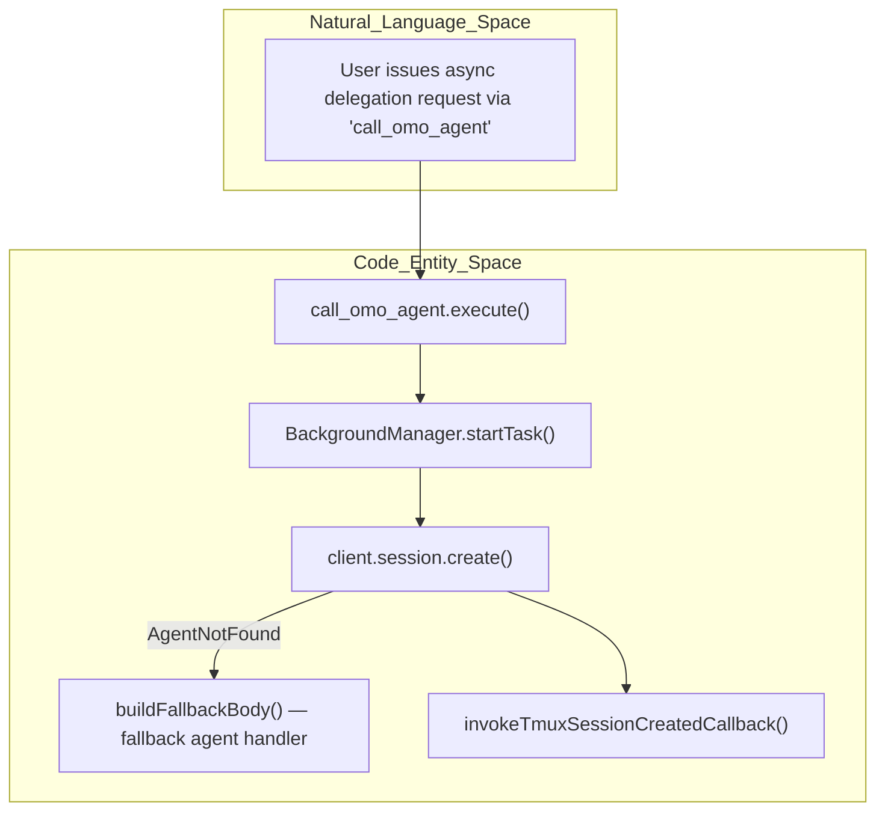
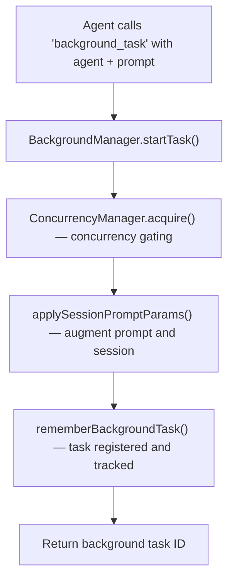
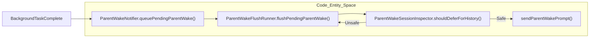
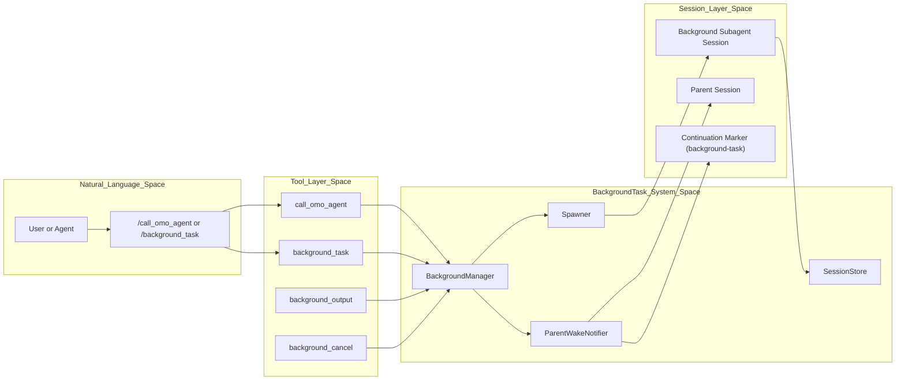

# Background Task Tools

Relevant source files

The following files were used as context for generating this wiki page:

- [packages/omo-opencode/src/features/background-agent/background-task-marker.ts](https://github.com/code-yeongyu/oh-my-openagent/blob/HEAD/packages/omo-opencode/src/features/background-agent/background-task-marker.ts)
- [packages/omo-opencode/src/features/background-agent/error-classifier.test.ts](https://github.com/code-yeongyu/oh-my-openagent/blob/HEAD/packages/omo-opencode/src/features/background-agent/error-classifier.test.ts)
- [packages/omo-opencode/src/features/background-agent/error-classifier.ts](https://github.com/code-yeongyu/oh-my-openagent/blob/HEAD/packages/omo-opencode/src/features/background-agent/error-classifier.ts)
- [packages/omo-opencode/src/features/background-agent/manager-continuation-marker.test.ts](https://github.com/code-yeongyu/oh-my-openagent/blob/HEAD/packages/omo-opencode/src/features/background-agent/manager-continuation-marker.test.ts)
- [packages/omo-opencode/src/features/background-agent/manager.test.ts](https://github.com/code-yeongyu/oh-my-openagent/blob/HEAD/packages/omo-opencode/src/features/background-agent/manager.test.ts)
- [packages/omo-opencode/src/features/background-agent/manager.ts](https://github.com/code-yeongyu/oh-my-openagent/blob/HEAD/packages/omo-opencode/src/features/background-agent/manager.ts)
- [packages/omo-opencode/src/features/background-agent/parent-wake-active-defer-ceiling.test.ts](https://github.com/code-yeongyu/oh-my-openagent/blob/HEAD/packages/omo-opencode/src/features/background-agent/parent-wake-active-defer-ceiling.test.ts)
- [packages/omo-opencode/src/features/background-agent/parent-wake-active-turn-event.test.ts](https://github.com/code-yeongyu/oh-my-openagent/blob/HEAD/packages/omo-opencode/src/features/background-agent/parent-wake-active-turn-event.test.ts)
- [packages/omo-opencode/src/features/background-agent/parent-wake-assistant-text-race.test.ts](https://github.com/code-yeongyu/oh-my-openagent/blob/HEAD/packages/omo-opencode/src/features/background-agent/parent-wake-assistant-text-race.test.ts)
- [packages/omo-opencode/src/features/background-agent/parent-wake-dedupe.ts](https://github.com/code-yeongyu/oh-my-openagent/blob/HEAD/packages/omo-opencode/src/features/background-agent/parent-wake-dedupe.ts)
- [packages/omo-opencode/src/features/background-agent/parent-wake-dispatched-tracker.ts](https://github.com/code-yeongyu/oh-my-openagent/blob/HEAD/packages/omo-opencode/src/features/background-agent/parent-wake-dispatched-tracker.ts)
- [packages/omo-opencode/src/features/background-agent/parent-wake-flush-runner.ts](https://github.com/code-yeongyu/oh-my-openagent/blob/HEAD/packages/omo-opencode/src/features/background-agent/parent-wake-flush-runner.ts)
- [packages/omo-opencode/src/features/background-agent/parent-wake-inflight-dispatch.test.ts](https://github.com/code-yeongyu/oh-my-openagent/blob/HEAD/packages/omo-opencode/src/features/background-agent/parent-wake-inflight-dispatch.test.ts)
- [packages/omo-opencode/src/features/background-agent/parent-wake-late-error-recovery.test.ts](https://github.com/code-yeongyu/oh-my-openagent/blob/HEAD/packages/omo-opencode/src/features/background-agent/parent-wake-late-error-recovery.test.ts)
- [packages/omo-opencode/src/features/background-agent/parent-wake-notifier-types.ts](https://github.com/code-yeongyu/oh-my-openagent/blob/HEAD/packages/omo-opencode/src/features/background-agent/parent-wake-notifier-types.ts)
- [packages/omo-opencode/src/features/background-agent/parent-wake-notifier.ts](https://github.com/code-yeongyu/oh-my-openagent/blob/HEAD/packages/omo-opencode/src/features/background-agent/parent-wake-notifier.ts)
- [packages/omo-opencode/src/features/background-agent/parent-wake-pending-queue.ts](https://github.com/code-yeongyu/oh-my-openagent/blob/HEAD/packages/omo-opencode/src/features/background-agent/parent-wake-pending-queue.ts)
- [packages/omo-opencode/src/features/background-agent/parent-wake-window-recovery.ts](https://github.com/code-yeongyu/oh-my-openagent/blob/HEAD/packages/omo-opencode/src/features/background-agent/parent-wake-window-recovery.ts)
- [packages/omo-opencode/src/features/background-agent/parent-wake-window-requeue.test.ts](https://github.com/code-yeongyu/oh-my-openagent/blob/HEAD/packages/omo-opencode/src/features/background-agent/parent-wake-window-requeue.test.ts)
- [packages/omo-opencode/src/features/claude-code-session-state/state.ts](https://github.com/code-yeongyu/oh-my-openagent/blob/HEAD/packages/omo-opencode/src/features/claude-code-session-state/state.ts)
- [packages/omo-opencode/src/hooks/todo-continuation-enforcer/continuation-injection.test.ts](https://github.com/code-yeongyu/oh-my-openagent/blob/HEAD/packages/omo-opencode/src/hooks/todo-continuation-enforcer/continuation-injection.test.ts)
- [packages/omo-opencode/src/hooks/todo-continuation-enforcer/continuation-injection.ts](https://github.com/code-yeongyu/oh-my-openagent/blob/HEAD/packages/omo-opencode/src/hooks/todo-continuation-enforcer/continuation-injection.ts)
- [packages/omo-opencode/src/hooks/todo-continuation-enforcer/handler.ts](https://github.com/code-yeongyu/oh-my-openagent/blob/HEAD/packages/omo-opencode/src/hooks/todo-continuation-enforcer/handler.ts)
- [packages/omo-opencode/src/hooks/todo-continuation-enforcer/idle-event.ts](https://github.com/code-yeongyu/oh-my-openagent/blob/HEAD/packages/omo-opencode/src/hooks/todo-continuation-enforcer/idle-event.ts)
- [packages/omo-opencode/src/hooks/todo-continuation-enforcer/non-idle-events.test.ts](https://github.com/code-yeongyu/oh-my-openagent/blob/HEAD/packages/omo-opencode/src/hooks/todo-continuation-enforcer/non-idle-events.test.ts)
- [packages/omo-opencode/src/hooks/todo-continuation-enforcer/non-idle-events.ts](https://github.com/code-yeongyu/oh-my-openagent/blob/HEAD/packages/omo-opencode/src/hooks/todo-continuation-enforcer/non-idle-events.ts)
- [packages/omo-opencode/src/hooks/todo-continuation-enforcer/session-state.test.ts](https://github.com/code-yeongyu/oh-my-openagent/blob/HEAD/packages/omo-opencode/src/hooks/todo-continuation-enforcer/session-state.test.ts)
- [packages/omo-opencode/src/hooks/todo-continuation-enforcer/session-state.ts](https://github.com/code-yeongyu/oh-my-openagent/blob/HEAD/packages/omo-opencode/src/hooks/todo-continuation-enforcer/session-state.ts)
- [packages/omo-opencode/src/hooks/todo-continuation-enforcer/types.ts](https://github.com/code-yeongyu/oh-my-openagent/blob/HEAD/packages/omo-opencode/src/hooks/todo-continuation-enforcer/types.ts)
- [packages/omo-opencode/src/tools/call-omo-agent/sync-executor-reawaken-guard.test.ts](https://github.com/code-yeongyu/oh-my-openagent/blob/HEAD/packages/omo-opencode/src/tools/call-omo-agent/sync-executor-reawaken-guard.test.ts)
- [packages/omo-opencode/src/tools/call-omo-agent/sync-executor.ts](https://github.com/code-yeongyu/oh-my-openagent/blob/HEAD/packages/omo-opencode/src/tools/call-omo-agent/sync-executor.ts)
- [packages/omo-opencode/src/tools/delegate-task/sync-session-lifecycle.test.ts](https://github.com/code-yeongyu/oh-my-openagent/blob/HEAD/packages/omo-opencode/src/tools/delegate-task/sync-session-lifecycle.test.ts)
- [packages/omo-opencode/src/tools/delegate-task/sync-session-lifecycle.ts](https://github.com/code-yeongyu/oh-my-openagent/blob/HEAD/packages/omo-opencode/src/tools/delegate-task/sync-session-lifecycle.ts)
- [packages/omo-opencode/src/tools/delegate-task/sync-task-reawaken-guard.test.ts](https://github.com/code-yeongyu/oh-my-openagent/blob/HEAD/packages/omo-opencode/src/tools/delegate-task/sync-task-reawaken-guard.test.ts)
- [packages/omo-opencode/src/tools/delegate-task/sync-task.ts](https://github.com/code-yeongyu/oh-my-openagent/blob/HEAD/packages/omo-opencode/src/tools/delegate-task/sync-task.ts)

This page documents the tools designed for asynchronous task delegation within *oh-my-openagent*: `call_omo_agent`, `background_task`, `background_output`, and `background_cancel`. These tools allow agents to spawn specialized subagents and retrieve their outputs asynchronously, leveraging the core Background Task System's lifecycle management, concurrency control, session continuation mechanisms, and parent session notifications.

---

## Tool Overview

| Tool | Primary Use | Implementation Detail |
|---|---|---|
| `call_omo_agent` | Privileged delegation to specialized agents (e.g., `explore`, `librarian`). | Enforces a whitelist, supports synchronous and asynchronous execution modes. Delegates via `BackgroundManager` for async tasks. |
| `background_task` | General-purpose background asynchronous task spawning for any agent. | Creates task with ID prefix `bg_`, registered and tracked in `BackgroundManager`. |
| `background_output` | Polls status or messages from background task sessions. | Utilizes session status classifiers to determine terminal status or ongoing progress. |
| `background_cancel` | Gracefully terminates active background tasks. | Transitions task status to `cancelled`, triggers cleanup and notifications. |

These tools interface with the `BackgroundManager` class ([src/features/background-agent/manager.ts:18-123](https://github.com/code-yeongyu/oh-my-openagent/blob/HEAD/src/features/background-agent/manager.ts#L18-L123)) and the `Spawner` subsystem ([src/features/background-agent/spawner.ts:26-163](https://github.com/code-yeongyu/oh-my-openagent/blob/HEAD/src/features/background-agent/spawner.ts#L26-L163)) to manage subagent lifecycle, session creation, and task continuations.

---

## call_omo_agent Tool

### Execution Flow and Implementation Detail

The `call_omo_agent` tool serves to delegate tasks either synchronously or asynchronously to specialized agents designated in a privileged whitelist. Its execution path depends on the flag `run_in_background`:

- **Synchronous Mode**: The specified agent is invoked directly, and the response is returned inline.
- **Asynchronous Mode**: The tool invokes the `BackgroundManager`'s `startTask()` method, which spins up a background session for the subagent and immediately returns a background task ID (e.g., `bg_XXXXXXXX`) to the caller.

Before launching, the tool applies session prompt parameters and resolves inheritance of tool permissions to configure the subagent's environment. If the specified agent or model is not available, it retries with a fallback agent to improve robustness.

#### Key Code Elements

- `call_omo_agent.execute()` — entry point for delegation [src/features/background-agent/manager.ts:33-34](https://github.com/code-yeongyu/oh-my-openagent/blob/HEAD/src/features/background-agent/manager.ts#L33-L34)
- `BackgroundManager.startTask()` — orchestrates creation and registration of the background session [src/features/background-agent/manager.ts:56](https://github.com/code-yeongyu/oh-my-openagent/blob/HEAD/src/features/background-agent/manager.ts#L56)
- `buildFallbackBody()` — constructs fallback prompt when agent not found [src/features/background-agent/manager.ts:100](https://github.com/code-yeongyu/oh-my-openagent/blob/HEAD/src/features/background-agent/manager.ts#L100)
- `invokeTmuxSessionCreatedCallback()` — integrates with TMUX session for background monitoring [src/features/background-agent/manager.ts:101](https://github.com/code-yeongyu/oh-my-openagent/blob/HEAD/src/features/background-agent/manager.ts#L101)

#### Execution Flow Diagram

---

## background_task Tool

### Purpose and Lifecycle

The `background_task` tool allows spawning arbitrary agents asynchronously in a background workflow. Each task is assigned a unique ID beginning with `bg_` plus a randomized suffix to ensure uniqueness.

When invoked, it registers the task in the `BackgroundManager`'s task registry and manages concurrency via the `ConcurrencyManager` to avoid overloading providers or models. After applying session prompt parameters and tool restrictions, the background session is created and tracked.

### Task Launch Flow

---

## background_output and background_cancel Tools

### Output Retrieval and Status Management

The `background_output` tool polls the underlying subagent's session to retrieve output, progress updates, or final completion messages. It uses session status classification utilities to determine whether a background task is still running, completed, or ended in error.

The `background_cancel` tool gracefully terminates an active background task by marking its status as `cancelled`. This halts further execution, triggers resource cleanup, and notifies the parent session if applicable.

### Status Classification

A set of terminal statuses are defined:

- `completed`
- `error`
- `cancelled`
- `interrupt`

The system uses these to avoid indefinite waits and to notify upstream when background tasks conclude.

Error classification utilities detect errors requiring retries, fallback, or abandonment, such as provider unavailability or model incompatibility.

---

## Parent Session Notifications (Parent Wake System)

A critical component of background task orchestration is the "Parent Wake" system, which sends notifications and continuation triggers back to the parent session that spawned background subagents.

### ParentWakeNotifier Lifecycle

The `ParentWakeNotifier` class manages notification state via:

- A **pending queue** for wakes to be delivered.
- A **dispatched tracker** monitoring ongoing wake dispatches.
- A **session inspector** to guard against unsafe wake dispatches caused by user activity or tool call conflicts.

The system guards against race conditions by:

- Waiting for session idle periods before dispatching wakes.
- Deferring notifications if the user has recently typed messages (window governed by `PARENT_WAKE_USER_MESSAGE_IN_PROGRESS_WINDOW_MS`).
- Admitting "no-reply" wakes that prepare the parent session silently without immediate assistant output.
- Requeuing failed or ignored wakes for later dispatch using recovery and retry logic.

### Continuation Marker File

A `background-task` continuation marker file is written to the filesystem during active background task execution to signal session liveliness. This prevents timing out or premature idling by the session management system.

### Parent Wake Dispatch Flow

---

## Task Health and Monitoring

### Loop Detection and Circuit Breakers

The system monitors task execution to detect repetitive or infinite loops caused by cyclical tool calls:

- Every tool invocation is recorded via `recordToolCall`.
- `detectRepetitiveToolUse` analyzes repeated identical calls.
- `resolveCircuitBreakerSettings` establishes thresholds for interrupting runaway tasks.

Once a circuit breaker triggers, the task may be cancelled or interrupted to prevent resource exhaustion.

### Stale Task Cleanup

The `BackgroundManager` maintains task and notification TTLs to prune stale or orphaned tasks.

- The task TTL defaults to 30 minutes (`TASK_TTL_MS`).
- Pruning removes expired tasks and clears their pending notifications.

Periodic pruning ensures system hygiene and memory/resource efficiency.

---

# Summary Diagram: Bridging NL Tool Invocations to Background Task System

---

# Detailed Notes

- `BackgroundManager` centralizes the background task lifecycle: creation, progress tracking, concurrency control, idle checks, and notification queueing.
- The `ParentWakeNotifier` module adds reliability and race-condition safety to notifying parents about subagent completions or state changes.
- Continuations via the `todoContinuationEnforcer` integrate with background task lifecycle by monitoring the `background-task` marker so that tasks in progress prevent session idle termination.
- The tools form a cohesive framework allowing asynchronous multi-agent workflows, delegation to specialized agents, and robust task progress/state management.

---

**Sources:**

- [src/features/background-agent/manager.ts:18-123, 33-34, 56, 100-101, 116](https://github.com/code-yeongyu/oh-my-openagent/blob/HEAD/src/features/background-agent/manager.ts#L18-L123)

- [src/features/background-agent/spawner.ts:26-163](https://github.com/code-yeongyu/oh-my-openagent/blob/HEAD/src/features/background-agent/spawner.ts#L26-L163)

- [src/features/background-agent/error-classifier.ts:149-160](https://github.com/code-yeongyu/oh-my-openagent/blob/HEAD/src/features/background-agent/error-classifier.ts#L149-L160)

- [src/features/background-agent/parent-wake-notifier.ts:18-193](https://github.com/code-yeongyu/oh-my-openagent/blob/HEAD/src/features/background-agent/parent-wake-notifier.ts#L18-L193)

- [src/features/background-agent/parent-wake-flush-runner.ts:20-154](https://github.com/code-yeongyu/oh-my-openagent/blob/HEAD/src/features/background-agent/parent-wake-flush-runner.ts#L20-L154)

- [src/features/background-agent/parent-wake-window-recovery.ts:33-50](https://github.com/code-yeongyu/oh-my-openagent/blob/HEAD/src/features/background-agent/parent-wake-window-recovery.ts#L33-L50)

- [src/features/background-agent/background-task-marker.ts:51](https://github.com/code-yeongyu/oh-my-openagent/blob/HEAD/src/features/background-agent/background-task-marker.ts#L51)

- [src/hooks/todo-continuation-enforcer/idle-event.ts:82-90](https://github.com/code-yeongyu/oh-my-openagent/blob/HEAD/src/hooks/todo-continuation-enforcer/idle-event.ts#L82-L90)2c:T475b,# Code 