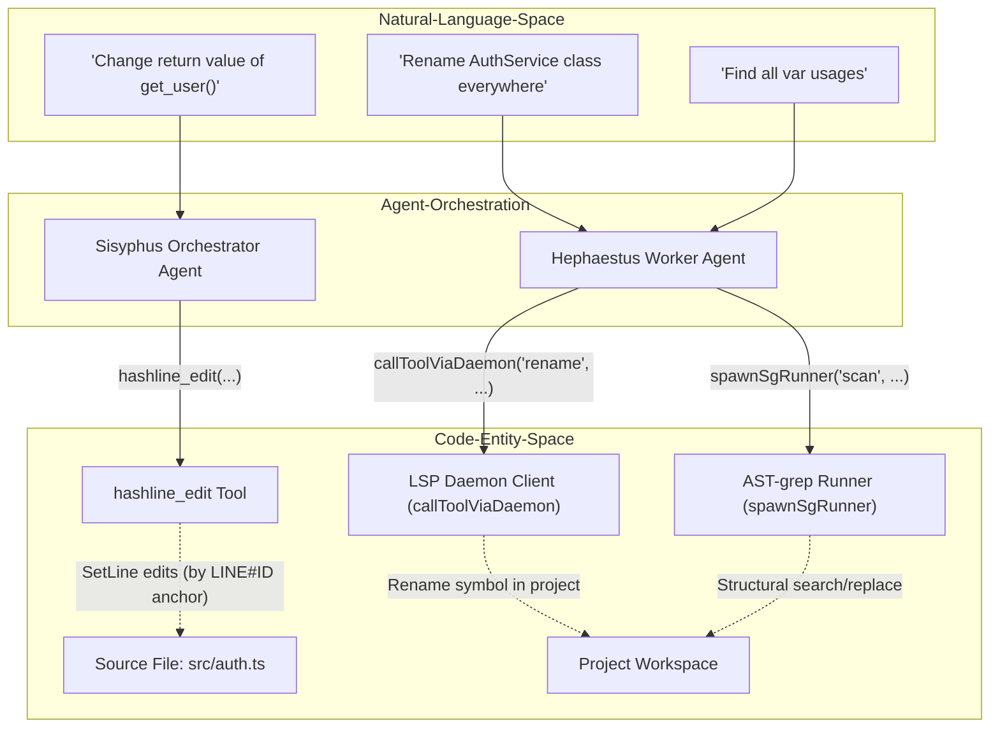
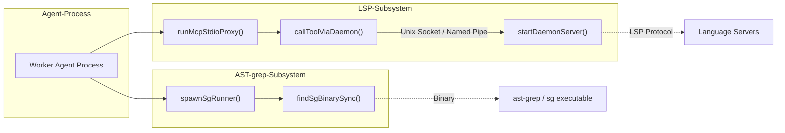

# Code Manipulation Tools

Relevant source files

The following files were used as context for generating this wiki page:

- [ROADMAP.md](https://github.com/code-yeongyu/oh-my-openagent/blob/HEAD/ROADMAP.md)
- [assets/AGENTS.md](https://github.com/code-yeongyu/oh-my-openagent/blob/HEAD/assets/AGENTS.md)
- [bin/AGENTS.md](https://github.com/code-yeongyu/oh-my-openagent/blob/HEAD/bin/AGENTS.md)
- [packages/claude-code-compat-core/AGENTS.md](https://github.com/code-yeongyu/oh-my-openagent/blob/HEAD/packages/claude-code-compat-core/AGENTS.md)
- [packages/git-bash-mcp/src/mcp-schema.test.ts](https://github.com/code-yeongyu/oh-my-openagent/blob/HEAD/packages/git-bash-mcp/src/mcp-schema.test.ts)
- [packages/git-bash-mcp/src/mcp-startup.test.ts](https://github.com/code-yeongyu/oh-my-openagent/blob/HEAD/packages/git-bash-mcp/src/mcp-startup.test.ts)
- [packages/git-bash-mcp/src/mcp-timeout.test.ts](https://github.com/code-yeongyu/oh-my-openagent/blob/HEAD/packages/git-bash-mcp/src/mcp-timeout.test.ts)
- [packages/git-bash-mcp/src/mcp.ts](https://github.com/code-yeongyu/oh-my-openagent/blob/HEAD/packages/git-bash-mcp/src/mcp.ts)
- [packages/lsp-core/AGENTS.md](https://github.com/code-yeongyu/oh-my-openagent/blob/HEAD/packages/lsp-core/AGENTS.md)
- [packages/lsp-core/package.json](https://github.com/code-yeongyu/oh-my-openagent/blob/HEAD/packages/lsp-core/package.json)
- [packages/lsp-core/src/index.ts](https://github.com/code-yeongyu/oh-my-openagent/blob/HEAD/packages/lsp-core/src/index.ts)
- [packages/lsp-core/src/lsp/client-diagnostics-freshness.integration.test.ts](https://github.com/code-yeongyu/oh-my-openagent/blob/HEAD/packages/lsp-core/src/lsp/client-diagnostics-freshness.integration.test.ts)
- [packages/lsp-core/src/lsp/client.ts](https://github.com/code-yeongyu/oh-my-openagent/blob/HEAD/packages/lsp-core/src/lsp/client.ts)
- [packages/lsp-core/src/lsp/fixtures/diagnostics-freshness-contract-probe.ts](https://github.com/code-yeongyu/oh-my-openagent/blob/HEAD/packages/lsp-core/src/lsp/fixtures/diagnostics-freshness-contract-probe.ts)
- [packages/lsp-core/src/lsp/fixtures/workspace-edit-server.mjs](https://github.com/code-yeongyu/oh-my-openagent/blob/HEAD/packages/lsp-core/src/lsp/fixtures/workspace-edit-server.mjs)
- [packages/lsp-core/src/lsp/workspace-apply-edit-test-support.ts](https://github.com/code-yeongyu/oh-my-openagent/blob/HEAD/packages/lsp-core/src/lsp/workspace-apply-edit-test-support.ts)
- [packages/lsp-core/src/mcp.ts](https://github.com/code-yeongyu/oh-my-openagent/blob/HEAD/packages/lsp-core/src/mcp.ts)
- [packages/lsp-daemon/.gitattributes](https://github.com/code-yeongyu/oh-my-openagent/blob/HEAD/packages/lsp-daemon/.gitattributes)
- [packages/lsp-daemon/.gitignore](https://github.com/code-yeongyu/oh-my-openagent/blob/HEAD/packages/lsp-daemon/.gitignore)
- [packages/lsp-daemon/AGENTS.md](https://github.com/code-yeongyu/oh-my-openagent/blob/HEAD/packages/lsp-daemon/AGENTS.md)
- [packages/lsp-daemon/biome.json](https://github.com/code-yeongyu/oh-my-openagent/blob/HEAD/packages/lsp-daemon/biome.json)
- [packages/lsp-daemon/package-lock.json](https://github.com/code-yeongyu/oh-my-openagent/blob/HEAD/packages/lsp-daemon/package-lock.json)
- [packages/lsp-daemon/package.json](https://github.com/code-yeongyu/oh-my-openagent/blob/HEAD/packages/lsp-daemon/package.json)
- [packages/lsp-daemon/scripts/stamp-dist-version.mjs](https://github.com/code-yeongyu/oh-my-openagent/blob/HEAD/packages/lsp-daemon/scripts/stamp-dist-version.mjs)
- [packages/lsp-daemon/src/cli.ts](https://github.com/code-yeongyu/oh-my-openagent/blob/HEAD/packages/lsp-daemon/src/cli.ts)
- [packages/lsp-daemon/src/daemon-client.ts](https://github.com/code-yeongyu/oh-my-openagent/blob/HEAD/packages/lsp-daemon/src/daemon-client.ts)
- [packages/lsp-daemon/src/daemon-failure-result.ts](https://github.com/code-yeongyu/oh-my-openagent/blob/HEAD/packages/lsp-daemon/src/daemon-failure-result.ts)
- [packages/lsp-daemon/src/daemon-request-error.ts](https://github.com/code-yeongyu/oh-my-openagent/blob/HEAD/packages/lsp-daemon/src/daemon-request-error.ts)
- [packages/lsp-daemon/src/daemon-server.ts](https://github.com/code-yeongyu/oh-my-openagent/blob/HEAD/packages/lsp-daemon/src/daemon-server.ts)
- [packages/lsp-daemon/src/ensure-daemon.ts](https://github.com/code-yeongyu/oh-my-openagent/blob/HEAD/packages/lsp-daemon/src/ensure-daemon.ts)
- [packages/lsp-daemon/src/index.ts](https://github.com/code-yeongyu/oh-my-openagent/blob/HEAD/packages/lsp-daemon/src/index.ts)
- [packages/lsp-daemon/src/lock.ts](https://github.com/code-yeongyu/oh-my-openagent/blob/HEAD/packages/lsp-daemon/src/lock.ts)
- [packages/lsp-daemon/src/paths.ts](https://github.com/code-yeongyu/oh-my-openagent/blob/HEAD/packages/lsp-daemon/src/paths.ts)
- [packages/lsp-daemon/src/proxy.ts](https://github.com/code-yeongyu/oh-my-openagent/blob/HEAD/packages/lsp-daemon/src/proxy.ts)
- [packages/lsp-daemon/src/request-routing.ts](https://github.com/code-yeongyu/oh-my-openagent/blob/HEAD/packages/lsp-daemon/src/request-routing.ts)
- [packages/lsp-daemon/src/run-daemon.ts](https://github.com/code-yeongyu/oh-my-openagent/blob/HEAD/packages/lsp-daemon/src/run-daemon.ts)
- [packages/lsp-daemon/src/socket-jsonrpc.ts](https://github.com/code-yeongyu/oh-my-openagent/blob/HEAD/packages/lsp-daemon/src/socket-jsonrpc.ts)
- [packages/lsp-daemon/test/daemon-client-retry.test.ts](https://github.com/code-yeongyu/oh-my-openagent/blob/HEAD/packages/lsp-daemon/test/daemon-client-retry.test.ts)
- [packages/lsp-daemon/test/daemon-failure-result.test.ts](https://github.com/code-yeongyu/oh-my-openagent/blob/HEAD/packages/lsp-daemon/test/daemon-failure-result.test.ts)
- [packages/lsp-daemon/test/daemon-roundtrip.test.ts](https://github.com/code-yeongyu/oh-my-openagent/blob/HEAD/packages/lsp-daemon/test/daemon-roundtrip.test.ts)
- [packages/lsp-daemon/test/ensure-daemon.test.ts](https://github.com/code-yeongyu/oh-my-openagent/blob/HEAD/packages/lsp-daemon/test/ensure-daemon.test.ts)
- [packages/lsp-daemon/test/lock.test.ts](https://github.com/code-yeongyu/oh-my-openagent/blob/HEAD/packages/lsp-daemon/test/lock.test.ts)
- [packages/lsp-daemon/test/paths.test.ts](https://github.com/code-yeongyu/oh-my-openagent/blob/HEAD/packages/lsp-daemon/test/paths.test.ts)
- [packages/lsp-daemon/test/proxy-lifecycle.test.ts](https://github.com/code-yeongyu/oh-my-openagent/blob/HEAD/packages/lsp-daemon/test/proxy-lifecycle.test.ts)
- [packages/lsp-daemon/test/proxy-startup-watchdog.test.ts](https://github.com/code-yeongyu/oh-my-openagent/blob/HEAD/packages/lsp-daemon/test/proxy-startup-watchdog.test.ts)
- [packages/lsp-daemon/test/proxy.test.ts](https://github.com/code-yeongyu/oh-my-openagent/blob/HEAD/packages/lsp-daemon/test/proxy.test.ts)
- [packages/lsp-daemon/test/request-routing.test.ts](https://github.com/code-yeongyu/oh-my-openagent/blob/HEAD/packages/lsp-daemon/test/request-routing.test.ts)
- [packages/lsp-daemon/test/socket-jsonrpc.test.ts](https://github.com/code-yeongyu/oh-my-openagent/blob/HEAD/packages/lsp-daemon/test/socket-jsonrpc.test.ts)
- [packages/lsp-daemon/tsconfig.build.json](https://github.com/code-yeongyu/oh-my-openagent/blob/HEAD/packages/lsp-daemon/tsconfig.build.json)
- [packages/lsp-tools-mcp/AGENTS.md](https://github.com/code-yeongyu/oh-my-openagent/blob/HEAD/packages/lsp-tools-mcp/AGENTS.md)
- [packages/lsp-tools-mcp/README.md](https://github.com/code-yeongyu/oh-my-openagent/blob/HEAD/packages/lsp-tools-mcp/README.md)
- [packages/lsp-tools-mcp/src/mcp.ts](https://github.com/code-yeongyu/oh-my-openagent/blob/HEAD/packages/lsp-tools-mcp/src/mcp.ts)
- [packages/mcp-client-core/AGENTS.md](https://github.com/code-yeongyu/oh-my-openagent/blob/HEAD/packages/mcp-client-core/AGENTS.md)
- [packages/omo-codex/scripts/install-hook-targets.test.mjs](https://github.com/code-yeongyu/oh-my-openagent/blob/HEAD/packages/omo-codex/scripts/install-hook-targets.test.mjs)
- [packages/omo-codex/scripts/install-lazycodex-version-stamp.test.mjs](https://github.com/code-yeongyu/oh-my-openagent/blob/HEAD/packages/omo-codex/scripts/install-lazycodex-version-stamp.test.mjs)
- [packages/omo-codex/scripts/install-local-bun-global-update.test.mjs](https://github.com/code-yeongyu/oh-my-openagent/blob/HEAD/packages/omo-codex/scripts/install-local-bun-global-update.test.mjs)
- [packages/omo-codex/src/install/codex-hook-targets.ts](https://github.com/code-yeongyu/oh-my-openagent/blob/HEAD/packages/omo-codex/src/install/codex-hook-targets.ts)
- [packages/omo-codex/src/install/codex-hook-trust.ts](https://github.com/code-yeongyu/oh-my-openagent/blob/HEAD/packages/omo-codex/src/install/codex-hook-trust.ts)
- [packages/omo-codex/src/install/codex-marketplace.ts](https://github.com/code-yeongyu/oh-my-openagent/blob/HEAD/packages/omo-codex/src/install/codex-marketplace.ts)
- [packages/omo-codex/src/install/install-codex-mcp-manifest.test.ts](https://github.com/code-yeongyu/oh-my-openagent/blob/HEAD/packages/omo-codex/src/install/install-codex-mcp-manifest.test.ts)
- [packages/omo-codex/src/install/install-codex-packaged.test.ts](https://github.com/code-yeongyu/oh-my-openagent/blob/HEAD/packages/omo-codex/src/install/install-codex-packaged.test.ts)
- [packages/omo-codex/src/install/install-codex-reasoning.test.ts](https://github.com/code-yeongyu/oh-my-openagent/blob/HEAD/packages/omo-codex/src/install/install-codex-reasoning.test.ts)
- [packages/omo-codex/src/install/lazycodex-bun-global-paths.ts](https://github.com/code-yeongyu/oh-my-openagent/blob/HEAD/packages/omo-codex/src/install/lazycodex-bun-global-paths.ts)
- [packages/omo-codex/src/install/lazycodex-manual-update.ts](https://github.com/code-yeongyu/oh-my-openagent/blob/HEAD/packages/omo-codex/src/install/lazycodex-manual-update.ts)
- [packages/omo-codex/src/install/lazycodex-version-stamp.ts](https://github.com/code-yeongyu/oh-my-openagent/blob/HEAD/packages/omo-codex/src/install/lazycodex-version-stamp.ts)
- [packages/omo-codex/src/install/types.ts](https://github.com/code-yeongyu/oh-my-openagent/blob/HEAD/packages/omo-codex/src/install/types.ts)
- [packages/openclaw-core/AGENTS.md](https://github.com/code-yeongyu/oh-my-openagent/blob/HEAD/packages/openclaw-core/AGENTS.md)
- [packages/rules-engine/AGENTS.md](https://github.com/code-yeongyu/oh-my-openagent/blob/HEAD/packages/rules-engine/AGENTS.md)
- [packages/skills-loader-core/AGENTS.md](https://github.com/code-yeongyu/oh-my-openagent/blob/HEAD/packages/skills-loader-core/AGENTS.md)
- [packages/team-core/AGENTS.md](https://github.com/code-yeongyu/oh-my-openagent/blob/HEAD/packages/team-core/AGENTS.md)
- [scripts/AGENTS.md](https://github.com/code-yeongyu/oh-my-openagent/blob/HEAD/scripts/AGENTS.md)
- [tests/AGENTS.md](https://github.com/code-yeongyu/oh-my-openagent/blob/HEAD/tests/AGENTS.md)
- [tests/hashline/bun.lock](https://github.com/code-yeongyu/oh-my-openagent/blob/HEAD/tests/hashline/bun.lock)
- [tests/hashline/headless.ts](https://github.com/code-yeongyu/oh-my-openagent/blob/HEAD/tests/hashline/headless.ts)
- [tests/hashline/package.json](https://github.com/code-yeongyu/oh-my-openagent/blob/HEAD/tests/hashline/package.json)
- [tests/hashline/test-edge-cases.ts](https://github.com/code-yeongyu/oh-my-openagent/blob/HEAD/tests/hashline/test-edge-cases.ts)
- [tests/hashline/test-edit-ops.ts](https://github.com/code-yeongyu/oh-my-openagent/blob/HEAD/tests/hashline/test-edit-ops.ts)
- [tests/hashline/test-environment.test.ts](https://github.com/code-yeongyu/oh-my-openagent/blob/HEAD/tests/hashline/test-environment.test.ts)
- [tests/hashline/test-environment.ts](https://github.com/code-yeongyu/oh-my-openagent/blob/HEAD/tests/hashline/test-environment.ts)
- [tests/hashline/test-multi-model.ts](https://github.com/code-yeongyu/oh-my-openagent/blob/HEAD/tests/hashline/test-multi-model.ts)

This page documents the core code manipulation tools available in oh-my-opencode: the hash-anchored line edit system (`hashline_edit`), Language Server Protocol (LSP) tools (rename, goto, diagnostics), and AST-grep pattern tools for syntax-aware code search and transformation.

These tools empower agents to perform precise, reliable, and semantically rich source code changes and queries, integrating AI-driven intents with verified code operations.

---

## Overview

Oh-my-opencode provides three main categories of code manipulation tools targeting different use cases with distinct implementations:

| Category          | Tools              | Purpose                                                       | Implementation Reference                                                       |
|-------------------|--------------------|---------------------------------------------------------------|--------------------------------------------------------------------------------|
| **Hashline Editing** | `hashline_edit`     | Content-hash verified, line-level edits with autocorrect and undo safety | [packages/omo-opencode/src/config/schema/oh-my-opencode-config.ts:59-60](https://github.com/code-yeongyu/oh-my-openagent/blob/HEAD/packages/omo-opencode/src/config/schema/oh-my-opencode-config.ts#L59-L60)      |
| **LSP Refactoring**  | LSP MCP Tools      | Workspace-aware rename, navigation, and diagnostics using Language Servers | [packages/lsp-daemon/src/daemon-client.ts:73-75](https://github.com/code-yeongyu/oh-my-openagent/blob/HEAD/packages/lsp-daemon/src/daemon-client.ts#L73-L75), [packages/lsp-daemon/src/proxy.ts:114-124](https://github.com/code-yeongyu/oh-my-openagent/blob/HEAD/packages/lsp-daemon/src/proxy.ts#L114-L124) |
| **AST Pattern Search** | AST-grep MCP       | Structural search and replace based on syntax trees           | [packages/utils/src/ast-grep/sg-resolver.ts:6-7](https://github.com/code-yeongyu/oh-my-openagent/blob/HEAD/packages/utils/src/ast-grep/sg-resolver.ts#L6-L7)                             |

These tools are exposed via MCP (Model Context Protocol) tooling infrastructure, allowing agents to invoke them with rich context and receive structured results.

### Data Flow: From Natural Language Intent to Code Entity

The following diagram illustrates how an agent's natural language intent is translated into calls on these tools, targeting specific code entities within files or the project workspace.

Sources: [packages/lsp-daemon/src/daemon-client.ts:36-40](https://github.com/code-yeongyu/oh-my-openagent/blob/HEAD/packages/lsp-daemon/src/daemon-client.ts#L36-L40), [packages/lsp-daemon/src/proxy.ts:114-124](https://github.com/code-yeongyu/oh-my-openagent/blob/HEAD/packages/lsp-daemon/src/proxy.ts#L114-L124), [packages/ast-grep-mcp/src/sg-runner.ts:9-10](https://github.com/code-yeongyu/oh-my-openagent/blob/HEAD/packages/ast-grep-mcp/src/sg-runner.ts#L9-L10)

---

## Hashline Edit System (`hashline_edit`)

The `hashline_edit` tool is a foundational code manipulation system based on line-level content hashing to provide content-anchored, verified edits.

### Purpose and Architecture

- Anchors edits via **LINE#ID** markers — stable line identifiers computed from content hashes.
- Prevents accidental or conflicting edits by verifying the current line content hash before applying changes.
- Enabled via configuration in `OhMyOpenCodeConfigSchema` [packages/omo-opencode/src/config/schema/oh-my-opencode-config.ts:59-60](https://github.com/code-yeongyu/oh-my-openagent/blob/HEAD/packages/omo-opencode/src/config/schema/oh-my-opencode-config.ts#L59-L60).

### Validation and Error Recovery

Before applying edits, the tool validates each LINE#ID reference against the current file content. This mechanism is inspired by `oh-my-pi` and ensures that if a file has changed since the agent last read it, the edit is rejected rather than applied to the wrong location.

---

## LSP and AST MCP Tools

Oh-my-opencode leverages MCP-based language tools for deep source code intelligence and transformation.

### LSP Tools and Daemon Architecture

LSP tools are implemented via a **LSP Daemon** [packages/lsp-daemon/src/daemon-server.ts:36-39](https://github.com/code-yeongyu/oh-my-openagent/blob/HEAD/packages/lsp-daemon/src/daemon-server.ts#L36-L39) (defined in `packages/lsp-daemon/src/daemon-server.ts`). This daemon runs as a background process to manage persistent Language Server instances.

Key components of the LSP subsystem:

- **`DaemonRequestError`**: Handles failures in the JSON-RPC communication over the socket [packages/lsp-daemon/src/daemon-request-error.ts:1-20](https://github.com/code-yeongyu/oh-my-openagent/blob/HEAD/packages/lsp-daemon/src/daemon-request-error.ts#L1-L20) (not shown but part of LSP error handling).
- **`ensureDaemonRunning`**: Ensures the background LSP daemon process is active before sending requests. It pings the daemon and spawns a new process if unreachable. This operation handles concurrency and readiness timeouts to provide reliable LSP availability [packages/lsp-daemon/src/ensure-daemon.ts:39-53](https://github.com/code-yeongyu/oh-my-openagent/blob/HEAD/packages/lsp-daemon/src/ensure-daemon.ts#L39-L53).
- **`callToolViaDaemon`**: The primary client function used by agents to perform LSP operations like rename, goto, and diagnostics. It automatically handles retries, authentication, request timeouts, and cancellation [packages/lsp-daemon/src/daemon-client.ts:36-71](https://github.com/code-yeongyu/oh-my-openagent/blob/HEAD/packages/lsp-daemon/src/daemon-client.ts#L36-L71).
- **`runMcpStdioProxy`**: A MCP stdio proxy that forwards MCP JSON-RPC tool calls from the agent process to the LSP daemon via a local socket or named pipe. It handles lifecycle events such as early input close or startup timeouts [packages/lsp-daemon/src/proxy.ts:38-108](https://github.com/code-yeongyu/oh-my-openagent/blob/HEAD/packages/lsp-daemon/src/proxy.ts#L38-L108).
- **`handleProxyRequest`**: Routes JSON-RPC requests either to local handlers or to `callToolViaDaemon` for MCP tool invocation [packages/lsp-daemon/src/proxy.ts:114-124](https://github.com/code-yeongyu/oh-my-openagent/blob/HEAD/packages/lsp-daemon/src/proxy.ts#L114-L124).

The daemon uses platform-specific socket paths, supporting Unix domain sockets or Windows named pipes transparently, constructed via canonical paths, user IDs, and other environment parameters [packages/lsp-daemon/src/paths.ts:132-143](https://github.com/code-yeongyu/oh-my-openagent/blob/HEAD/packages/lsp-daemon/src/paths.ts#L132-L143).

Clients send a `DaemonToolContext` object containing precise project configuration and environment for correct context-aware behavior, such as discovering `lsp.json` config files in `.opencode` or `.omo` directories [packages/lsp-daemon/src/daemon-client.ts:24-27](https://github.com/code-yeongyu/oh-my-openagent/blob/HEAD/packages/lsp-daemon/src/daemon-client.ts#L24-L27), [packages/lsp-daemon/src/proxy.ts:134-171](https://github.com/code-yeongyu/oh-my-openagent/blob/HEAD/packages/lsp-daemon/src/proxy.ts#L134-L171).

### Code-Specific Hooks and Diagnostics

The system includes mechanisms to automatically trigger and retrieve diagnostics after code changes:

- **`callDiagnosticsViaDaemon`**: Convenience function to request diagnostics for a given file path with a configured severity level (e.g., "error") [packages/lsp-daemon/src/daemon-client.ts:73-75](https://github.com/code-yeongyu/oh-my-openagent/blob/HEAD/packages/lsp-daemon/src/daemon-client.ts#L73-L75).

- **`handleLspMcpRequest`**: Processes incoming MCP method calls such as `initialize`, `tools/list`, and `tools/call`, forwarding recognized calls to the appropriate LSP server logic or local handlers [packages/lsp-core/src/mcp.ts:33-63](https://github.com/code-yeongyu/oh-my-openagent/blob/HEAD/packages/lsp-core/src/mcp.ts#L33-L63) (not fully shown here but part of the broader MCP core).

### AST-grep Integration

Structural code search and transformations happen via the AST-grep tool integration.

- **`spawnSgRunner`**: This function starts and manages the `sg` (ast-grep) binary as a child process to perform AST pattern scanning and rewriting tasks. It handles NDJSON streaming output and recovers partial records gracefully [packages/ast-grep-mcp/src/sg-runner.ts:9-10](https://github.com/code-yeongyu/oh-my-openagent/blob/HEAD/packages/ast-grep-mcp/src/sg-runner.ts#L9-L10).

- **`findSgBinarySync`**: Determines the `sg` binary location using a tiered approach:

  - First, `OMO_AST_GREP_SG_PATH` environment variable override.

  - Next, runtime directory resolution of the harness.

  - Finally, system `PATH` lookup.

This layered resolution ensures robustness across environments and deployment targets [packages/utils/src/ast-grep/sg-resolver.ts:6-7](https://github.com/code-yeongyu/oh-my-openagent/blob/HEAD/packages/utils/src/ast-grep/sg-resolver.ts#L6-L7).

### MCP Tool Architecture Overview

Sources: [packages/lsp-daemon/src/proxy.ts:87-100](https://github.com/code-yeongyu/oh-my-openagent/blob/HEAD/packages/lsp-daemon/src/proxy.ts#L87-L100), [packages/lsp-daemon/src/daemon-client.ts:36-40](https://github.com/code-yeongyu/oh-my-openagent/blob/HEAD/packages/lsp-daemon/src/daemon-client.ts#L36-L40), [packages/ast-grep-mcp/src/sg-runner.ts:9-10](https://github.com/code-yeongyu/oh-my-openagent/blob/HEAD/packages/ast-grep-mcp/src/sg-runner.ts#L9-L10), [packages/utils/src/ast-grep/sg-resolver.ts:6-7](https://github.com/code-yeongyu/oh-my-openagent/blob/HEAD/packages/utils/src/ast-grep/sg-resolver.ts#L6-L7)

---

## Git Bash for Windows Tooling

On Windows platforms, oh-my-opencode provides a specialized `git_bash` MCP tool to execute shell commands reliably within a Git Bash environment.

- **`runMcpStdioServer`**: Starts the Git Bash MCP server to listen for JSON-RPC requests on stdio [packages/git-bash-mcp/src/mcp.ts:65-78](https://github.com/code-yeongyu/oh-my-openagent/blob/HEAD/packages/git-bash-mcp/src/mcp.ts#L65-L78).

- **`resolveGitBash`**: Attempts to locate the `bash.exe` executable on Windows by checking common installation locations [packages/git-bash-mcp/src/mcp.ts:4-4](https://github.com/code-yeongyu/oh-my-openagent/blob/HEAD/packages/git-bash-mcp/src/mcp.ts#L4).

- **`runGitBashCommand`**: Runs commands through Git Bash with a default and configurable timeout, providing safer execution on Windows where native POSIX shells are unavailable [packages/git-bash-mcp/src/mcp.ts:5-7](https://github.com/code-yeongyu/oh-my-openagent/blob/HEAD/packages/git-bash-mcp/src/mcp.ts#L5-L7).

This tooling facilitates executing shell commands via an MCP tool named `git_bash` that the agent or other parts of the system can call.

---

## Summary

The code manipulation tools in oh-my-opencode offer agents robust, verified mechanisms to transform source code. The `hashline_edit` system ensures safe edits via content hashes anchored to line identities. LSP MCP tools provide workspace-wide intelligence and complex refactoring primitives through a dedicated `lsp-daemon` process and client proxy setup, handling context propagation and resilience. Structural intelligence is provided by the `ast-grep` runner, which manages syntax-aware search and transformation via an external binary integrated through MCP.

Together, these tools enable flexible yet reliable code modifications driven by agent intents within a highly orchestrated multi-agent AI system.

---

## Sources

- [packages/lsp-daemon/src/daemon-client.ts:24-27](https://github.com/code-yeongyu/oh-my-openagent/blob/HEAD/packages/lsp-daemon/src/daemon-client.ts#L24-L27)
- [packages/lsp-daemon/src/daemon-client.ts:36-71](https://github.com/code-yeongyu/oh-my-openagent/blob/HEAD/packages/lsp-daemon/src/daemon-client.ts#L36-L71)
- [packages/lsp-daemon/src/daemon-server.ts:36-39](https://github.com/code-yeongyu/oh-my-openagent/blob/HEAD/packages/lsp-daemon/src/daemon-server.ts#L36-L39)
- [packages/lsp-daemon/src/daemon-request-error.ts:1-20](https://github.com/code-yeongyu/oh-my-openagent/blob/HEAD/packages/lsp-daemon/src/daemon-request-error.ts#L1-L20)
- [packages/lsp-daemon/src/ensure-daemon.ts:39-53](https://github.com/code-yeongyu/oh-my-openagent/blob/HEAD/packages/lsp-daemon/src/ensure-daemon.ts#L39-L53)
- [packages/lsp-daemon/src/proxy.ts:38-108](https://github.com/code-yeongyu/oh-my-openagent/blob/HEAD/packages/lsp-daemon/src/proxy.ts#L38-L108)
- [packages/lsp-daemon/src/proxy.ts:114-124](https://github.com/code-yeongyu/oh-my-openagent/blob/HEAD/packages/lsp-daemon/src/proxy.ts#L114-L124)
- [packages/lsp-daemon/src/proxy.ts:134-171](https://github.com/code-yeongyu/oh-my-openagent/blob/HEAD/packages/lsp-daemon/src/proxy.ts#L134-L171)
- [packages/lsp-daemon/src/paths.ts:132-143](https://github.com/code-yeongyu/oh-my-openagent/blob/HEAD/packages/lsp-daemon/src/paths.ts#L132-L143)
- [packages/lsp-core/src/mcp.ts:33-63](https://github.com/code-yeongyu/oh-my-openagent/blob/HEAD/packages/lsp-core/src/mcp.ts#L33-L63)
- [packages/ast-grep-mcp/src/sg-runner.ts:9-10](https://github.com/code-yeongyu/oh-my-openagent/blob/HEAD/packages/ast-grep-mcp/src/sg-runner.ts#L9-L10)
- [packages/utils/src/ast-grep/sg-resolver.ts:6-7](https://github.com/code-yeongyu/oh-my-openagent/blob/HEAD/packages/utils/src/ast-grep/sg-resolver.ts#L6-L7)
- [packages/git-bash-mcp/src/mcp.ts:4-7](https://github.com/code-yeongyu/oh-my-openagent/blob/HEAD/packages/git-bash-mcp/src/mcp.ts#L4-L7)
- [packages/git-bash-mcp/src/mcp.ts:65-78](https://github.com/code-yeongyu/oh-my-openagent/blob/HEAD/packages/git-bash-mcp/src/mcp.ts#L65-L78)
- [packages/omo-opencode/src/config/schema/oh-my-opencode-config.ts:59-60](https://github.com/code-yeongyu/oh-my-openagent/blob/HEAD/packages/omo-opencode/src/config/schema/oh-my-opencode-config.ts#L59-L60)2d