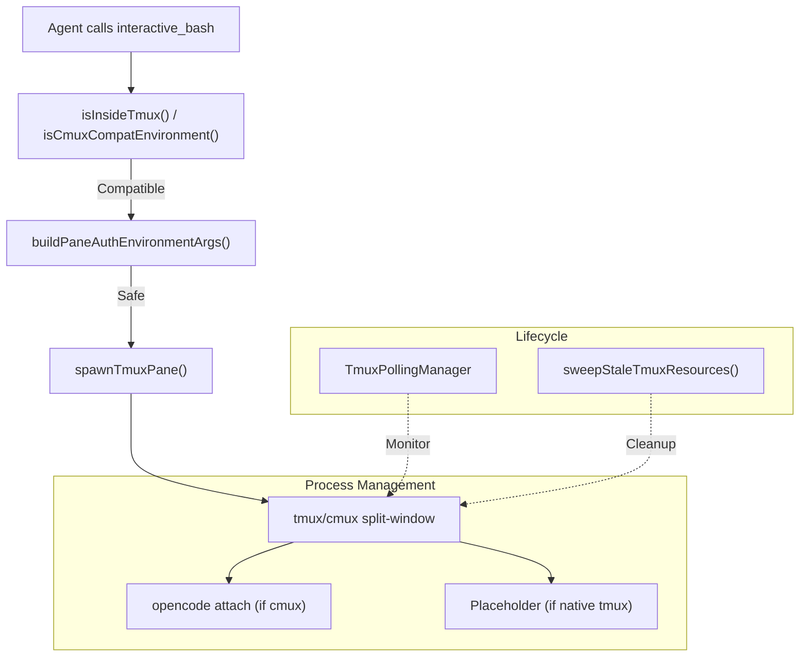
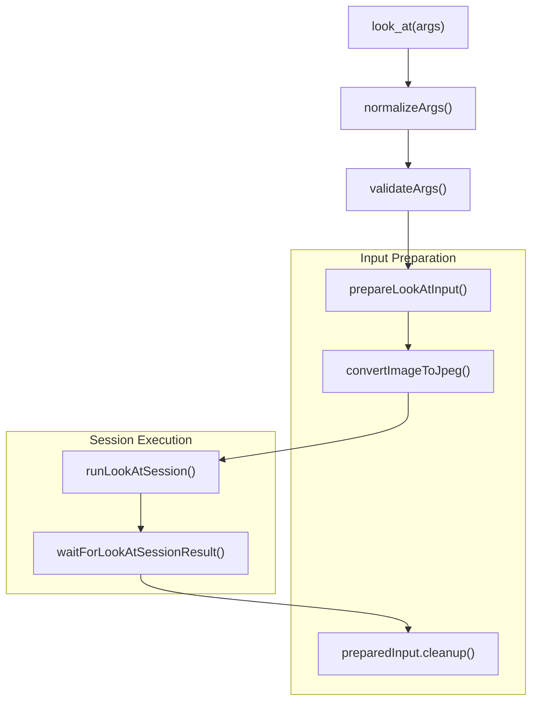
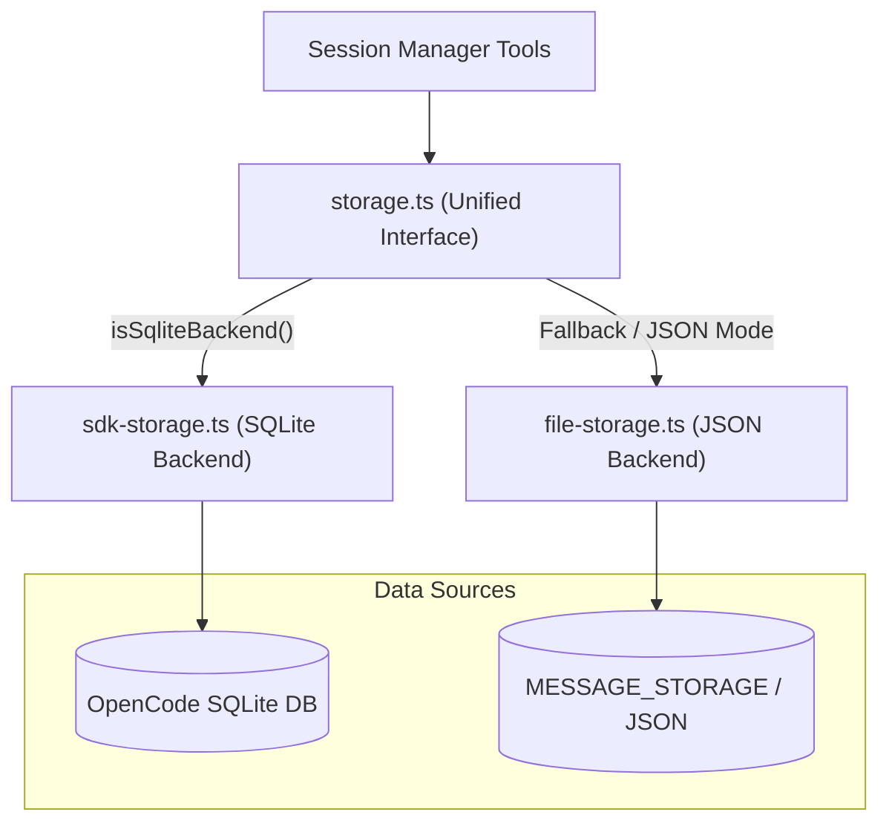
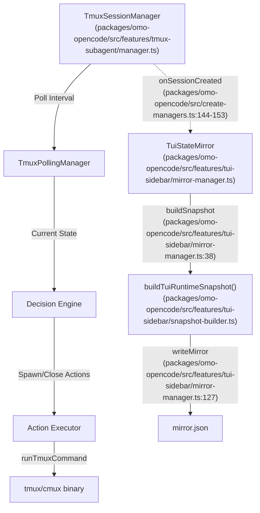
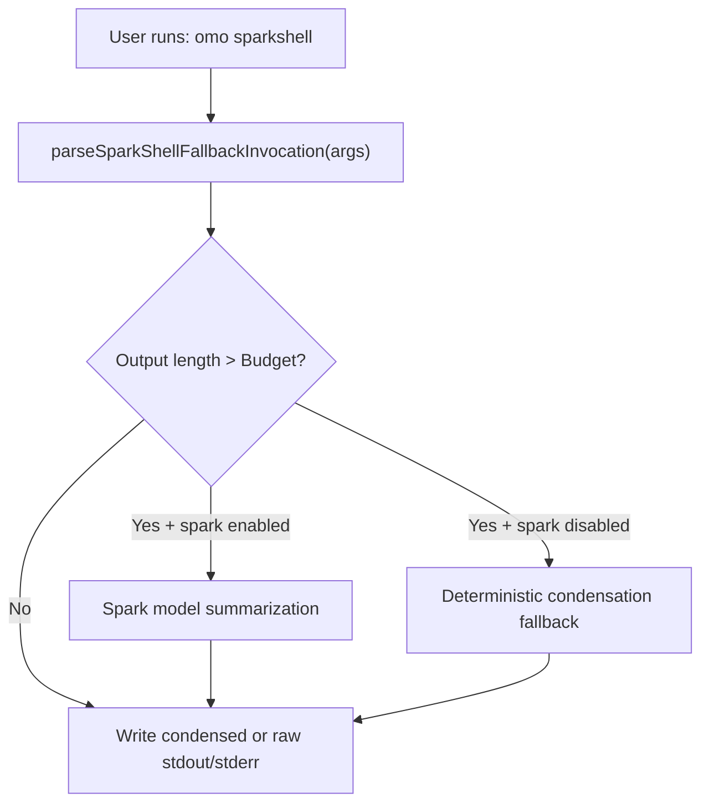
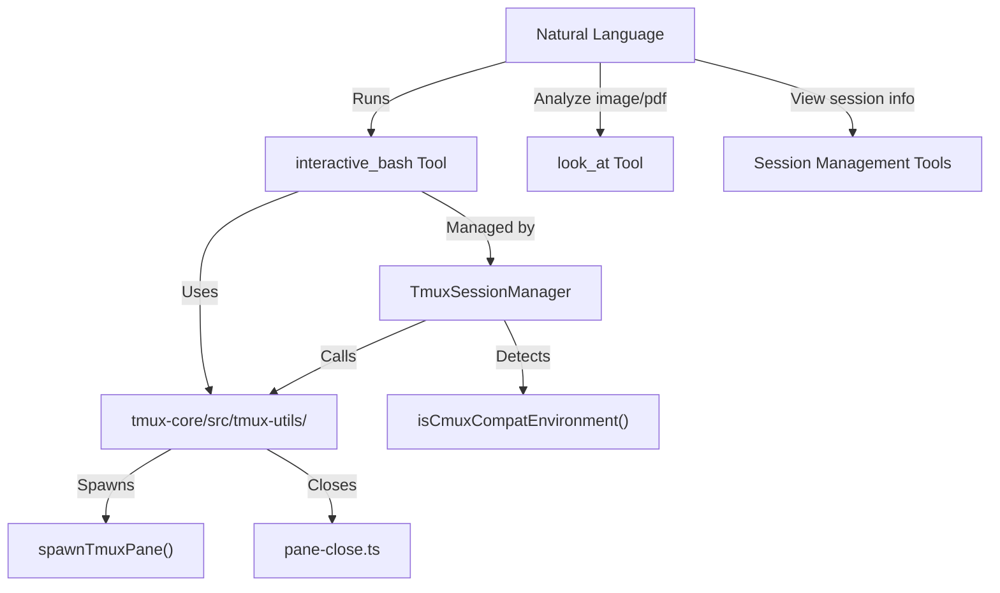
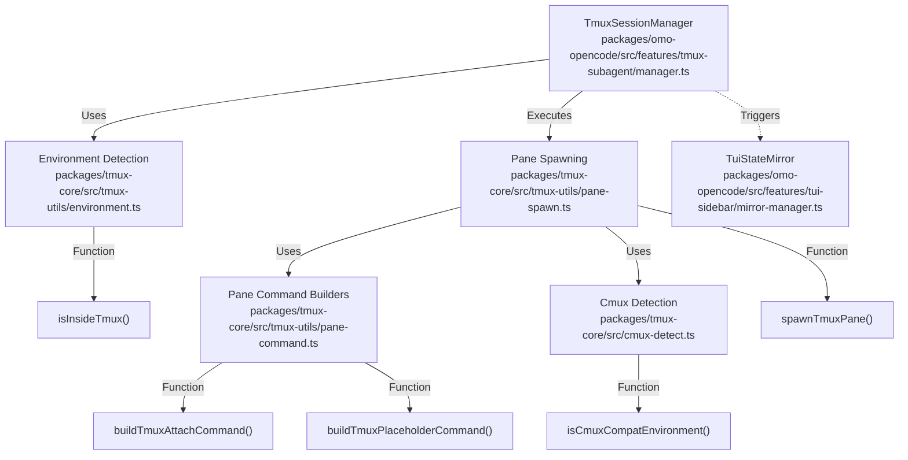

# Interactive Tools

Relevant source files

The following files were used as context for generating this wiki page:

- [packages/omo-opencode/src/create-hooks.ts](https://github.com/code-yeongyu/oh-my-openagent/blob/HEAD/packages/omo-opencode/src/create-hooks.ts)
- [packages/omo-opencode/src/create-managers.monitor.test.ts](https://github.com/code-yeongyu/oh-my-openagent/blob/HEAD/packages/omo-opencode/src/create-managers.monitor.test.ts)
- [packages/omo-opencode/src/create-managers.test.ts](https://github.com/code-yeongyu/oh-my-openagent/blob/HEAD/packages/omo-opencode/src/create-managers.test.ts)
- [packages/omo-opencode/src/create-managers.ts](https://github.com/code-yeongyu/oh-my-openagent/blob/HEAD/packages/omo-opencode/src/create-managers.ts)
- [packages/omo-opencode/src/create-tools.ts](https://github.com/code-yeongyu/oh-my-openagent/blob/HEAD/packages/omo-opencode/src/create-tools.ts)
- [packages/omo-opencode/src/features/background-agent/index.ts](https://github.com/code-yeongyu/oh-my-openagent/blob/HEAD/packages/omo-opencode/src/features/background-agent/index.ts)
- [packages/omo-opencode/src/features/tmux-subagent/manager.test.ts](https://github.com/code-yeongyu/oh-my-openagent/blob/HEAD/packages/omo-opencode/src/features/tmux-subagent/manager.test.ts)
- [packages/omo-opencode/src/features/tmux-subagent/manager.ts](https://github.com/code-yeongyu/oh-my-openagent/blob/HEAD/packages/omo-opencode/src/features/tmux-subagent/manager.ts)
- [packages/omo-opencode/src/features/tmux-subagent/stale-tmux-resource-sweeper.ts](https://github.com/code-yeongyu/oh-my-openagent/blob/HEAD/packages/omo-opencode/src/features/tmux-subagent/stale-tmux-resource-sweeper.ts)
- [packages/omo-opencode/src/features/tui-sidebar/mirror-manager.test.ts](https://github.com/code-yeongyu/oh-my-openagent/blob/HEAD/packages/omo-opencode/src/features/tui-sidebar/mirror-manager.test.ts)
- [packages/omo-opencode/src/features/tui-sidebar/mirror-manager.ts](https://github.com/code-yeongyu/oh-my-openagent/blob/HEAD/packages/omo-opencode/src/features/tui-sidebar/mirror-manager.ts)
- [packages/omo-opencode/src/features/tui-sidebar/qa/register-and-run.sh](https://github.com/code-yeongyu/oh-my-openagent/blob/HEAD/packages/omo-opencode/src/features/tui-sidebar/qa/register-and-run.sh)
- [packages/omo-opencode/src/features/tui-sidebar/snapshot-builder.test.ts](https://github.com/code-yeongyu/oh-my-openagent/blob/HEAD/packages/omo-opencode/src/features/tui-sidebar/snapshot-builder.test.ts)
- [packages/omo-opencode/src/features/tui-sidebar/snapshot-builder.ts](https://github.com/code-yeongyu/oh-my-openagent/blob/HEAD/packages/omo-opencode/src/features/tui-sidebar/snapshot-builder.ts)
- [packages/omo-opencode/src/hooks/atlas/session-last-agent.json.test.ts](https://github.com/code-yeongyu/oh-my-openagent/blob/HEAD/packages/omo-opencode/src/hooks/atlas/session-last-agent.json.test.ts)
- [packages/omo-opencode/src/hooks/atlas/session-last-agent.ts](https://github.com/code-yeongyu/oh-my-openagent/blob/HEAD/packages/omo-opencode/src/hooks/atlas/session-last-agent.ts)
- [packages/omo-opencode/src/plugin/event-session-lifecycle.ts](https://github.com/code-yeongyu/oh-my-openagent/blob/HEAD/packages/omo-opencode/src/plugin/event-session-lifecycle.ts)
- [packages/omo-opencode/src/plugin/event.monitor.test.ts](https://github.com/code-yeongyu/oh-my-openagent/blob/HEAD/packages/omo-opencode/src/plugin/event.monitor.test.ts)
- [packages/omo-opencode/src/plugin/event.ts](https://github.com/code-yeongyu/oh-my-openagent/blob/HEAD/packages/omo-opencode/src/plugin/event.ts)
- [packages/omo-opencode/src/plugin/hooks/create-core-hooks.ts](https://github.com/code-yeongyu/oh-my-openagent/blob/HEAD/packages/omo-opencode/src/plugin/hooks/create-core-hooks.ts)
- [packages/omo-opencode/src/shared/tmux/tmux-utils/adapter-deps.ts](https://github.com/code-yeongyu/oh-my-openagent/blob/HEAD/packages/omo-opencode/src/shared/tmux/tmux-utils/adapter-deps.ts)
- [packages/omo-opencode/src/shared/tmux/tmux-utils/pane-close.ts](https://github.com/code-yeongyu/oh-my-openagent/blob/HEAD/packages/omo-opencode/src/shared/tmux/tmux-utils/pane-close.ts)
- [packages/omo-opencode/src/shared/tmux/tmux-utils/pane-command.test.ts](https://github.com/code-yeongyu/oh-my-openagent/blob/HEAD/packages/omo-opencode/src/shared/tmux/tmux-utils/pane-command.test.ts)
- [packages/omo-opencode/src/tui.test.ts](https://github.com/code-yeongyu/oh-my-openagent/blob/HEAD/packages/omo-opencode/src/tui.test.ts)
- [packages/omo-opencode/src/tui.ts](https://github.com/code-yeongyu/oh-my-openagent/blob/HEAD/packages/omo-opencode/src/tui.ts)
- [packages/tmux-core/src/cmux-detect.test.ts](https://github.com/code-yeongyu/oh-my-openagent/blob/HEAD/packages/tmux-core/src/cmux-detect.test.ts)
- [packages/tmux-core/src/cmux-detect.ts](https://github.com/code-yeongyu/oh-my-openagent/blob/HEAD/packages/tmux-core/src/cmux-detect.ts)
- [packages/tmux-core/src/tmux-utils.test.ts](https://github.com/code-yeongyu/oh-my-openagent/blob/HEAD/packages/tmux-core/src/tmux-utils.test.ts)
- [packages/tmux-core/src/tmux-utils/pane-activate.ts](https://github.com/code-yeongyu/oh-my-openagent/blob/HEAD/packages/tmux-core/src/tmux-utils/pane-activate.ts)
- [packages/tmux-core/src/tmux-utils/pane-command.test.ts](https://github.com/code-yeongyu/oh-my-openagent/blob/HEAD/packages/tmux-core/src/tmux-utils/pane-command.test.ts)
- [packages/tmux-core/src/tmux-utils/pane-command.ts](https://github.com/code-yeongyu/oh-my-openagent/blob/HEAD/packages/tmux-core/src/tmux-utils/pane-command.ts)
- [packages/tmux-core/src/tmux-utils/pane-replace.test.ts](https://github.com/code-yeongyu/oh-my-openagent/blob/HEAD/packages/tmux-core/src/tmux-utils/pane-replace.test.ts)
- [packages/tmux-core/src/tmux-utils/pane-replace.ts](https://github.com/code-yeongyu/oh-my-openagent/blob/HEAD/packages/tmux-core/src/tmux-utils/pane-replace.ts)
- [packages/tmux-core/src/tmux-utils/pane-spawn-runner.test.ts](https://github.com/code-yeongyu/oh-my-openagent/blob/HEAD/packages/tmux-core/src/tmux-utils/pane-spawn-runner.test.ts)
- [packages/tmux-core/src/tmux-utils/pane-spawn.ts](https://github.com/code-yeongyu/oh-my-openagent/blob/HEAD/packages/tmux-core/src/tmux-utils/pane-spawn.ts)
- [packages/tmux-core/src/tmux-utils/session-spawn.ts](https://github.com/code-yeongyu/oh-my-openagent/blob/HEAD/packages/tmux-core/src/tmux-utils/session-spawn.ts)
- [packages/tmux-core/src/tmux-utils/window-spawn.test.ts](https://github.com/code-yeongyu/oh-my-openagent/blob/HEAD/packages/tmux-core/src/tmux-utils/window-spawn.test.ts)
- [packages/tmux-core/src/tmux-utils/window-spawn.ts](https://github.com/code-yeongyu/oh-my-openagent/blob/HEAD/packages/tmux-core/src/tmux-utils/window-spawn.ts)

## Purpose and Scope

This page documents the interactive tools in Oh My OpenAgent that facilitate real-time user interaction with running shell sessions, multimodal content analysis, and session management. It covers:

- `interactive_bash`: Persistent terminal sessions using tmux panes to enable interactive shell workflows (e.g., REPL, debugging).
- `look_at`: Multimodal document and image analysis tool with vision capabilities and format conversion.
- Session management tools: Listing, reading, searching, and fetching metadata about agent sessions.
- `sparkshell`: The condensing shell wrapper executed via `omo sparkshell`, which summarizes and condenses large shell command outputs for efficient agent consumption.
- `TmuxSessionManager`: The central orchestration engine for managing subagent panes, supporting both native `tmux` and `cmux` (OpenCode's custom terminal multiplexer) environments.
- `TuiStateMirror`: A management layer that synchronizes the internal agent state to a readable mirror for TUI sidebar visualization.

These tools provide bridges between natural language commands and code entities/processes, supporting persistent state, visual understanding, and efficient large output handling.

---

## interactive_bash Tool

### Overview

The `interactive_bash` tool executes shell commands inside persistent tmux panes rather than launching one-off subprocesses. This approach supports real-time interaction, history retention, and multi-step workflows like REPL sessions.

#### Key Properties

- **Persistent tmux integration**: Commands run in dedicated tmux panes managed by `TmuxSessionManager`, supporting concurrency and separate session windows [packages/omo-opencode/src/features/tmux-subagent/manager.ts:110-172](https://github.com/code-yeongyu/oh-my-openagent/blob/HEAD/packages/omo-opencode/src/features/tmux-subagent/manager.ts#L110-L172).
- **cmux Compatibility**: The system detects `cmux` environments via `isCmuxCompatEnvironment` [packages/tmux-core/src/cmux-detect.ts:1-10](https://github.com/code-yeongyu/oh-my-openagent/blob/HEAD/packages/tmux-core/src/cmux-detect.ts#L1-L10). In these environments, it bypasses standard tmux placeholders and uses `opencode attach` directly to provide a seamless terminal experience [packages/tmux-core/src/tmux-utils/pane-spawn.ts:87-89](https://github.com/code-yeongyu/oh-my-openagent/blob/HEAD/packages/tmux-core/src/tmux-utils/pane-spawn.ts#L87-L89).
- **Security Gates**: Disallows potentially problematic subcommands and enforces strict credential isolation. Authenticated `cmux` panes are explicitly unsupported to prevent credential leakage through shell metacharacters [packages/tmux-core/src/tmux-utils/pane-spawn.ts:81-85](https://github.com/code-yeongyu/oh-my-openagent/blob/HEAD/packages/tmux-core/src/tmux-utils/pane-spawn.ts#L81-L85), [packages/tmux-core/src/tmux-utils/window-spawn.ts:65-69](https://github.com/code-yeongyu/oh-my-openagent/blob/HEAD/packages/tmux-core/src/tmux-utils/window-spawn.ts#L65-L69), [packages/tmux-core/src/tmux-utils/session-spawn.ts:93-97](https://github.com/code-yeongyu/oh-my-openagent/blob/HEAD/packages/tmux-core/src/tmux-utils/session-spawn.ts#L93-L97), [packages/tmux-core/src/tmux-utils/pane-replace.ts:48-52](https://github.com/code-yeongyu/oh-my-openagent/blob/HEAD/packages/tmux-core/src/tmux-utils/pane-replace.ts#L48-L52), [packages/tmux-core/src/tmux-utils/pane-activate.ts:30-34](https://github.com/code-yeongyu/oh-my-openagent/blob/HEAD/packages/tmux-core/src/tmux-utils/pane-activate.ts#L30-L34).
- **Resource Cleanup**: Automated sweepers like `sweepStaleOmoAgentSessions` and `sweepStaleOmoAttachPanes` identify and kill sessions or panes associated with dead PIDs or inactive attach servers [packages/omo-opencode/src/features/tmux-subagent/manager.ts:14-15](https://github.com/code-yeongyu/oh-my-openagent/blob/HEAD/packages/omo-opencode/src/features/tmux-subagent/manager.ts#L14-L15).

### Execution Flow Diagram

Sources: [packages/tmux-core/src/tmux-utils/pane-spawn.ts:33-122](https://github.com/code-yeongyu/oh-my-openagent/blob/HEAD/packages/tmux-core/src/tmux-utils/pane-spawn.ts#L33-L122), [packages/tmux-core/src/tmux-utils/pane-command.ts:5-49](https://github.com/code-yeongyu/oh-my-openagent/blob/HEAD/packages/tmux-core/src/tmux-utils/pane-command.ts#L5-L49), [packages/omo-opencode/src/features/tmux-subagent/manager.ts:174-177](https://github.com/code-yeongyu/oh-my-openagent/blob/HEAD/packages/omo-opencode/src/features/tmux-subagent/manager.ts#L174-L177), [packages/omo-opencode/src/features/tmux-subagent/stale-tmux-resource-sweeper.ts:1-10](https://github.com/code-yeongyu/oh-my-openagent/blob/HEAD/packages/omo-opencode/src/features/tmux-subagent/stale-tmux-resource-sweeper.ts#L1-L10)

---

## look_at Tool

### Overview

The `look_at` tool allows agents to perform vision-enabled and document analysis on images and PDF documents using multimodal capabilities.

#### Core Features

- **Argument normalization and validation**:
  - Supports inputs via file paths or direct base64 image data.
  - Normalizes `path` arg to `file_path` for LLM compatibility.
  - Validates that either/both file paths and/or image data are provided.
  
- **Input preparation**:
  - Detects and converts unsupported image formats (e.g., HEIC) to JPEG using platform utilities (`sips`, ImageMagick).

- **Session-based processing**:
  - Spawns a transient sub-session using a specialized agent.
  - Sends prepared inputs with the analysis goal to the child session.
  - Waits for the session's response, then cleans up temporary files.

### Data Flow Diagram

Sources: [packages/omo-opencode/src/features/tmux-subagent/manager.ts:137-172](https://github.com/code-yeongyu/oh-my-openagent/blob/HEAD/packages/omo-opencode/src/features/tmux-subagent/manager.ts#L137-L172)

---

## Session Management Tools

### Overview

The session management tools give programmatic access to historical agent conversations, including listing, reading transcripts, searching, and getting session metadata.

#### Tools Summary

| Tool Name      | Purpose                                                       |
|----------------|---------------------------------------------------------------|
| `session_list` | Lists sessions with filters on date, project, agent, etc.     |
| `session_read` | Reads full session messages and optionally todos             |
| `session_search` | Full-text search across session transcripts with timeout    |
| `session_info` | Extracts metadata, including agent counts and permissions     |

These tools leverage logic to resolve which agent was last active in a specific session ID via `getLastAgentFromSession`, which is critical for UI attribution and task resumption [packages/omo-opencode/src/features/tui-sidebar/snapshot-builder.ts:49](https://github.com/code-yeongyu/oh-my-openagent/blob/HEAD/packages/omo-opencode/src/features/tui-sidebar/snapshot-builder.ts#L49).

### Storage Architecture Diagram

Sources: [packages/omo-opencode/src/features/tmux-subagent/manager.ts:110-128](https://github.com/code-yeongyu/oh-my-openagent/blob/HEAD/packages/omo-opencode/src/features/tmux-subagent/manager.ts#L110-L128), [packages/omo-opencode/src/features/tui-sidebar/snapshot-builder.ts:39-53](https://github.com/code-yeongyu/oh-my-openagent/blob/HEAD/packages/omo-opencode/src/features/tui-sidebar/snapshot-builder.ts#L39-L53)

---

## TmuxSessionManager & TUI Synchronization

### Overview
`TmuxSessionManager` is the primary class responsible for the lifecycle of subagent panes. It manages state via `TrackedSession` objects and coordinates with `TmuxPollingManager` to ensure panes remain synchronized with agent activity [packages/omo-opencode/src/features/tmux-subagent/manager.ts:110-172](https://github.com/code-yeongyu/oh-my-openagent/blob/HEAD/packages/omo-opencode/src/features/tmux-subagent/manager.ts#L110-L172).

The `TuiStateMirror` monitors these sessions and background tasks, flushing a JSON snapshot to disk for consumption by the TUI sidebar [packages/omo-opencode/src/features/tui-sidebar/mirror-manager.ts:23-40](https://github.com/code-yeongyu/oh-my-openagent/blob/HEAD/packages/omo-opencode/src/features/tui-sidebar/mirror-manager.ts#L23-L40).

### cmux Integration
A significant feature of the interactive toolset is its compatibility with `cmux`.
- **Predicate Scoping**: Literal tmux detection (`isInsideTmux`) remains strict, while `isCmuxCompatEnvironment` allows `cmux` to participate in inline pane lifecycles [packages/tmux-core/src/cmux-detect.ts:1-10](https://github.com/code-yeongyu/oh-my-openagent/blob/HEAD/packages/tmux-core/src/cmux-detect.ts#L1-L10).
- **Eager Attach**: In `cmux`, the system performs an "eager attach" using `buildTmuxAttachCommand`, allowing the agent to immediately interact with the session without manual user intervention [packages/tmux-core/src/tmux-utils/pane-spawn.ts:87-89](https://github.com/code-yeongyu/oh-my-openagent/blob/HEAD/packages/tmux-core/src/tmux-utils/pane-spawn.ts#L87-L89).

### State Synchronization Flow

Sources: [packages/omo-opencode/src/features/tmux-subagent/manager.ts:156-164](https://github.com/code-yeongyu/oh-my-openagent/blob/HEAD/packages/omo-opencode/src/features/tmux-subagent/manager.ts#L156-L164), [packages/omo-opencode/src/features/tmux-subagent/manager.test.ts:101-104](https://github.com/code-yeongyu/oh-my-openagent/blob/HEAD/packages/omo-opencode/src/features/tmux-subagent/manager.test.ts#L101-L104), [packages/omo-opencode/src/features/tui-sidebar/mirror-manager.ts:121-135](https://github.com/code-yeongyu/oh-my-openagent/blob/HEAD/packages/omo-opencode/src/features/tui-sidebar/mirror-manager.ts#L121-L135), [packages/omo-opencode/src/create-managers.ts:144-153](https://github.com/code-yeongyu/oh-my-openagent/blob/HEAD/packages/omo-opencode/src/create-managers.ts#L144-L153), [packages/omo-opencode/src/features/tui-sidebar/mirror-manager.ts:38](https://github.com/code-yeongyu/oh-my-openagent/blob/HEAD/packages/omo-opencode/src/features/tui-sidebar/mirror-manager.ts#L38), [packages/omo-opencode/src/features/tui-sidebar/snapshot-builder.ts:1-107](https://github.com/code-yeongyu/oh-my-openagent/blob/HEAD/packages/omo-opencode/src/features/tui-sidebar/snapshot-builder.ts#L1-L107)

---

## SparkShell — The Condensing Shell Wrapper

### Purpose

`sparkshell` is a specialized shell wrapper executed via the CLI command `omo sparkshell`. It is designed to wrap shell commands which typically produce large outputs, condensing and summarizing the outputs for AI agents to consume efficiently.

### Key Features and Behavior

- **Oversized output condensation**: When output surpasses a configurable budget, condensation is triggered.
- **Spark summarization**: Oversized outputs are first summarized using a "spark" model, producing a faithful summary preserving original output lines.
- **Session context awareness**: When attached to a Codex session, conversation context is fed to the summarizer for relevance ranking.

### Data Flow Diagram for Sparkshell Execution

Sources: [packages/omo-opencode/src/cli/install-codex/install-codex.ts:1-2](https://github.com/code-yeongyu/oh-my-openagent/blob/HEAD/packages/omo-opencode/src/cli/install-codex/install-codex.ts#L1-L2)

---

## Bridging Natural Language to Code Entities

### Mapping: Interactive Tools to Code Components

### Mapping: Key Classes and Functions

---

# Sources

- [packages/omo-opencode/src/features/tmux-subagent/manager.ts:1-172](https://github.com/code-yeongyu/oh-my-openagent/blob/HEAD/packages/omo-opencode/src/features/tmux-subagent/manager.ts#L1-L172)
- [packages/omo-opencode/src/features/tmux-subagent/manager.test.ts:1-180](https://github.com/code-yeongyu/oh-my-openagent/blob/HEAD/packages/omo-opencode/src/features/tmux-subagent/manager.test.ts#L1-L180)
- [packages/tmux-core/src/tmux-utils/pane-spawn.ts:1-123](https://github.com/code-yeongyu/oh-my-openagent/blob/HEAD/packages/tmux-core/src/tmux-utils/pane-spawn.ts#L1-L123)
- [packages/tmux-core/src/tmux-utils/pane-spawn-runner.test.ts:1-195](https://github.com/code-yeongyu/oh-my-openagent/blob/HEAD/packages/tmux-core/src/tmux-utils/pane-spawn-runner.test.ts#L1-L195)
- [packages/tmux-core/src/tmux-utils/pane-command.ts:1-39](https://github.com/code-yeongyu/oh-my-openagent/blob/HEAD/packages/tmux-core/src/tmux-utils/pane-command.ts#L1-L39)
- [packages/tmux-core/src/tmux-utils/pane-command.test.ts:1-173](https://github.com/code-yeongyu/oh-my-openagent/blob/HEAD/packages/tmux-core/src/tmux-utils/pane-command.test.ts#L1-L173)
- [packages/tmux-core/src/tmux-utils/session-spawn.ts:1-167](https://github.com/code-yeongyu/oh-my-openagent/blob/HEAD/packages/tmux-core/src/tmux-utils/session-spawn.ts#L1-L167)
- [packages/tmux-core/src/tmux-utils/window-spawn.ts:1-113](https://github.com/code-yeongyu/oh-my-openagent/blob/HEAD/packages/tmux-core/src/tmux-utils/window-spawn.ts#L1-L113)
- [packages/tmux-core/src/tmux-utils/pane-replace.ts:1-85](https://github.com/code-yeongyu/oh-my-openagent/blob/HEAD/packages/tmux-core/src/tmux-utils/pane-replace.ts#L1-L85)
- [packages/tmux-core/src/tmux-utils/pane-replace.test.ts:1-159](https://github.com/code-yeongyu/oh-my-openagent/blob/HEAD/packages/tmux-core/src/tmux-utils/pane-replace.test.ts#L1-L159)
- [packages/tmux-core/src/tmux-utils/pane-activate.ts:1-59](https://github.com/code-yeongyu/oh-my-openagent/blob/HEAD/packages/tmux-core/src/tmux-utils/pane-activate.ts#L1-L59)
- [packages/tmux-core/src/cmux-detect.ts:1-10](https://github.com/code-yeongyu/oh-my-openagent/blob/HEAD/packages/tmux-core/src/cmux-detect.ts#L1-L10)
- [packages/omo-opencode/src/shared/tmux/tmux-utils/pane-command.test.ts:1-116](https://github.com/code-yeongyu/oh-my-openagent/blob/HEAD/packages/omo-opencode/src/shared/tmux/tmux-utils/pane-command.test.ts#L1-L116)
- [packages/omo-opencode/src/features/tmux-subagent/stale-tmux-resource-sweeper.ts:1-10](https://github.com/code-yeongyu/oh-my-openagent/blob/HEAD/packages/omo-opencode/src/features/tmux-subagent/stale-tmux-resource-sweeper.ts#L1-L10)
- [packages/omo-opencode/src/cli/install-codex/install-codex.ts:1-2](https://github.com/code-yeongyu/oh-my-openagent/blob/HEAD/packages/omo-opencode/src/cli/install-codex/install-codex.ts#L1-L2)
- [packages/omo-opencode/src/features/tui-sidebar/mirror-manager.ts:1-137](https://github.com/code-yeongyu/oh-my-openagent/blob/HEAD/packages/omo-opencode/src/features/tui-sidebar/mirror-manager.ts#L1-L137)
- [packages/omo-opencode/src/features/tui-sidebar/snapshot-builder.ts:1-107](https://github.com/code-yeongyu/oh-my-openagent/blob/HEAD/packages/omo-opencode/src/features/tui-sidebar/snapshot-builder.ts#L1-L107)
- [packages/omo-opencode/src/create-managers.ts:85-94](https://github.com/code-yeongyu/oh-my-openagent/blob/HEAD/packages/omo-opencode/src/create-managers.ts#L85-L94)
- [packages/omo-opencode/src/create-managers.ts:144-153](https://github.com/code-yeongyu/oh-my-openagent/blob/HEAD/packages/omo-opencode/src/create-managers.ts#L144-L153)2e