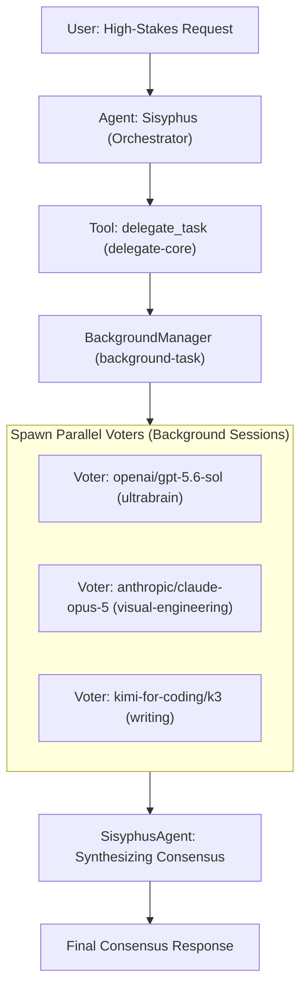
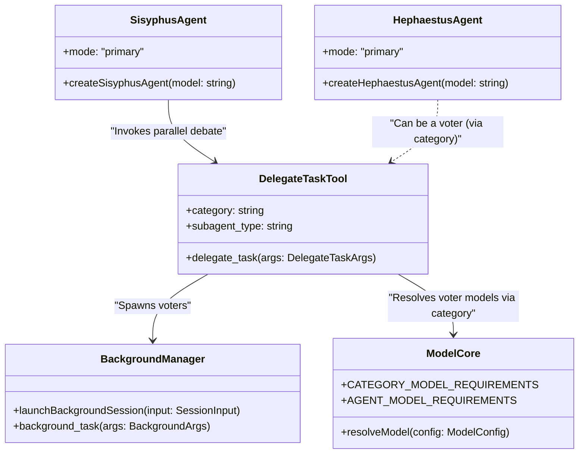

# Consensus Tool

Relevant source files

The following files were used as context for generating this wiki page:

- [packages/model-core/src/agent-model-requirements.ts](https://github.com/code-yeongyu/oh-my-openagent/blob/HEAD/packages/model-core/src/agent-model-requirements.ts)
- [packages/model-core/src/category-model-requirements.ts](https://github.com/code-yeongyu/oh-my-openagent/blob/HEAD/packages/model-core/src/category-model-requirements.ts)
- [packages/model-core/src/category-routing-policy.test.ts](https://github.com/code-yeongyu/oh-my-openagent/blob/HEAD/packages/model-core/src/category-routing-policy.test.ts)
- [packages/model-core/src/gpt-5.6-copilot-resolution.test.ts](https://github.com/code-yeongyu/oh-my-openagent/blob/HEAD/packages/model-core/src/gpt-5.6-copilot-resolution.test.ts)
- [packages/model-core/src/model-capability-guardrails.test.ts](https://github.com/code-yeongyu/oh-my-openagent/blob/HEAD/packages/model-core/src/model-capability-guardrails.test.ts)
- [packages/model-core/src/model-requirements-agents.test.ts](https://github.com/code-yeongyu/oh-my-openagent/blob/HEAD/packages/model-core/src/model-requirements-agents.test.ts)
- [packages/model-core/src/model-requirements-categories.test.ts](https://github.com/code-yeongyu/oh-my-openagent/blob/HEAD/packages/model-core/src/model-requirements-categories.test.ts)
- [packages/omo-opencode/src/agents/utils.test.ts](https://github.com/code-yeongyu/oh-my-openagent/blob/HEAD/packages/omo-opencode/src/agents/utils.test.ts)
- [packages/omo-opencode/src/cli/config-manager/generate-omo-config.test.ts](https://github.com/code-yeongyu/oh-my-openagent/blob/HEAD/packages/omo-opencode/src/cli/config-manager/generate-omo-config.test.ts)
- [packages/omo-opencode/src/cli/model-fallback-providers.test.ts](https://github.com/code-yeongyu/oh-my-openagent/blob/HEAD/packages/omo-opencode/src/cli/model-fallback-providers.test.ts)
- [packages/omo-opencode/src/cli/model-fallback.test.ts](https://github.com/code-yeongyu/oh-my-openagent/blob/HEAD/packages/omo-opencode/src/cli/model-fallback.test.ts)
- [packages/omo-opencode/src/cli/openai-only-model-catalog.test.ts](https://github.com/code-yeongyu/oh-my-openagent/blob/HEAD/packages/omo-opencode/src/cli/openai-only-model-catalog.test.ts)
- [packages/omo-opencode/src/cli/openai-only-model-catalog.ts](https://github.com/code-yeongyu/oh-my-openagent/blob/HEAD/packages/omo-opencode/src/cli/openai-only-model-catalog.ts)
- [packages/omo-opencode/src/cli/provider-model-id-transform.test.ts](https://github.com/code-yeongyu/oh-my-openagent/blob/HEAD/packages/omo-opencode/src/cli/provider-model-id-transform.test.ts)
- [packages/omo-opencode/src/features/claude-code-agent-loader/opencode-config-agents-reader.test.ts](https://github.com/code-yeongyu/oh-my-openagent/blob/HEAD/packages/omo-opencode/src/features/claude-code-agent-loader/opencode-config-agents-reader.test.ts)
- [packages/omo-opencode/src/hooks/model-fallback/hook.test.ts](https://github.com/code-yeongyu/oh-my-openagent/blob/HEAD/packages/omo-opencode/src/hooks/model-fallback/hook.test.ts)
- [packages/omo-opencode/src/hooks/no-sisyphus-gpt/hook.ts](https://github.com/code-yeongyu/oh-my-openagent/blob/HEAD/packages/omo-opencode/src/hooks/no-sisyphus-gpt/hook.ts)
- [packages/omo-opencode/src/plugin/event.model-fallback.test.ts](https://github.com/code-yeongyu/oh-my-openagent/blob/HEAD/packages/omo-opencode/src/plugin/event.model-fallback.test.ts)
- [packages/omo-opencode/src/plugin/event.test.ts](https://github.com/code-yeongyu/oh-my-openagent/blob/HEAD/packages/omo-opencode/src/plugin/event.test.ts)
- [packages/omo-opencode/src/tools/AGENTS.md](https://github.com/code-yeongyu/oh-my-openagent/blob/HEAD/packages/omo-opencode/src/tools/AGENTS.md)
- [packages/omo-opencode/src/tools/delegate-task/anthropic-categories.ts](https://github.com/code-yeongyu/oh-my-openagent/blob/HEAD/packages/omo-opencode/src/tools/delegate-task/anthropic-categories.ts)
- [packages/omo-opencode/src/tools/delegate-task/builtin-categories.ts](https://github.com/code-yeongyu/oh-my-openagent/blob/HEAD/packages/omo-opencode/src/tools/delegate-task/builtin-categories.ts)
- [packages/omo-opencode/src/tools/delegate-task/builtin-category-definition.ts](https://github.com/code-yeongyu/oh-my-openagent/blob/HEAD/packages/omo-opencode/src/tools/delegate-task/builtin-category-definition.ts)
- [packages/omo-opencode/src/tools/delegate-task/categories.ts](https://github.com/code-yeongyu/oh-my-openagent/blob/HEAD/packages/omo-opencode/src/tools/delegate-task/categories.ts)
- [packages/omo-opencode/src/tools/delegate-task/category-routing-policy.test.ts](https://github.com/code-yeongyu/oh-my-openagent/blob/HEAD/packages/omo-opencode/src/tools/delegate-task/category-routing-policy.test.ts)
- [packages/omo-opencode/src/tools/delegate-task/constants.ts](https://github.com/code-yeongyu/oh-my-openagent/blob/HEAD/packages/omo-opencode/src/tools/delegate-task/constants.ts)
- [packages/omo-opencode/src/tools/delegate-task/google-categories.ts](https://github.com/code-yeongyu/oh-my-openagent/blob/HEAD/packages/omo-opencode/src/tools/delegate-task/google-categories.ts)
- [packages/omo-opencode/src/tools/delegate-task/kimi-categories.ts](https://github.com/code-yeongyu/oh-my-openagent/blob/HEAD/packages/omo-opencode/src/tools/delegate-task/kimi-categories.ts)
- [packages/omo-opencode/src/tools/delegate-task/openai-categories.ts](https://github.com/code-yeongyu/oh-my-openagent/blob/HEAD/packages/omo-opencode/src/tools/delegate-task/openai-categories.ts)
- [packages/omo-opencode/src/tools/delegate-task/tools.test.ts](https://github.com/code-yeongyu/oh-my-openagent/blob/HEAD/packages/omo-opencode/src/tools/delegate-task/tools.test.ts)
- [packages/senpi-task/scripts/manual-category-qa.ts](https://github.com/code-yeongyu/oh-my-openagent/blob/HEAD/packages/senpi-task/scripts/manual-category-qa.ts)
- [packages/senpi-task/src/agents/builtin/fallback-chains.test.ts](https://github.com/code-yeongyu/oh-my-openagent/blob/HEAD/packages/senpi-task/src/agents/builtin/fallback-chains.test.ts)
- [packages/senpi-task/src/agents/builtin/fallback-chains.ts](https://github.com/code-yeongyu/oh-my-openagent/blob/HEAD/packages/senpi-task/src/agents/builtin/fallback-chains.ts)
- [packages/senpi-task/src/category/__snapshots__/resolve-category.test.ts.snap](https://github.com/code-yeongyu/oh-my-openagent/blob/HEAD/packages/senpi-task/src/category/__snapshots__/resolve-category.test.ts.snap)
- [packages/senpi-task/src/category/anthropic-categories.test.ts](https://github.com/code-yeongyu/oh-my-openagent/blob/HEAD/packages/senpi-task/src/category/anthropic-categories.test.ts)
- [packages/senpi-task/src/category/anthropic-categories.ts](https://github.com/code-yeongyu/oh-my-openagent/blob/HEAD/packages/senpi-task/src/category/anthropic-categories.ts)
- [packages/senpi-task/src/category/category-routing-policy.test.ts](https://github.com/code-yeongyu/oh-my-openagent/blob/HEAD/packages/senpi-task/src/category/category-routing-policy.test.ts)
- [packages/senpi-task/src/category/fallback-chains.ts](https://github.com/code-yeongyu/oh-my-openagent/blob/HEAD/packages/senpi-task/src/category/fallback-chains.ts)
- [packages/senpi-task/src/category/google-categories.ts](https://github.com/code-yeongyu/oh-my-openagent/blob/HEAD/packages/senpi-task/src/category/google-categories.ts)
- [packages/senpi-task/src/category/openai-categories.ts](https://github.com/code-yeongyu/oh-my-openagent/blob/HEAD/packages/senpi-task/src/category/openai-categories.ts)
- [packages/senpi-task/src/category/resolve-category-boundary.test.ts](https://github.com/code-yeongyu/oh-my-openagent/blob/HEAD/packages/senpi-task/src/category/resolve-category-boundary.test.ts)

The **Consensus Tool** is a specialized multi-lineage consensus debate facility integrated within the `oh-my-openagent` system. It centers on spawning multiple voters—each representing a distinct model family such as Anthropic, OpenAI, Google, or open-source—in parallel, collecting their independent reasoning, and synthesizing a unified final position. This tool is designed explicitly for high-stakes decisions where a single model's output might be insufficient or potentially biased, enabling robust multi-perspective validation.

---

## Overview

The Consensus Tool is architected to:

- **Spawn multiple voters in parallel** across different model lineages (Claude, GPT, Gemini, Kimi, GLM, etc.) to leverage diverse model capabilities. [packages/model-core/src/agent-model-requirements.ts:4-186](https://github.com/code-yeongyu/oh-my-openagent/blob/HEAD/packages/model-core/src/agent-model-requirements.ts#L4-L186), [packages/model-core/src/category-model-requirements.ts:3-161](https://github.com/code-yeongyu/oh-my-openagent/blob/HEAD/packages/model-core/src/category-model-requirements.ts#L3-L161)
- **Synthesize outcomes into a final consensus response** using a primary orchestrator, primarily the **Sisyphus** agent. [packages/omo-opencode/src/agents/AGENTS.md:111-112](https://github.com/code-yeongyu/oh-my-openagent/blob/HEAD/packages/omo-opencode/src/agents/AGENTS.md#L111-L112)
- **Facilitate decisions in scenarios demanding high reliability**, such as architectural design, critical security audits, or ambiguous requirement resolution.

The tool relies on the existing infrastructure around task delegation, background task management, and agent orchestration, allowing seamless integration into the broader system.

Sources: [packages/omo-opencode/src/agents/AGENTS.md:111-112](https://github.com/code-yeongyu/oh-my-openagent/blob/HEAD/packages/omo-opencode/src/agents/AGENTS.md#L111-L112), [packages/model-core/src/agent-model-requirements.ts:4-186](https://github.com/code-yeongyu/oh-my-openagent/blob/HEAD/packages/model-core/src/agent-model-requirements.ts#L4-L186), [packages/model-core/src/category-model-requirements.ts:3-161](https://github.com/code-yeongyu/oh-my-openagent/blob/HEAD/packages/model-core/src/category-model-requirements.ts#L3-L161)

---

## Technical Implementation

### Core Components

1.  **Delegate Task Tool (`delegate_task`)**
    This tool orchestrates task delegation by spawning subagent sessions per voter model and capturing their outputs. It supports full skill and category integration, allowing voters to be specialized for specific domains. The tool logic consumes `delegate-core`.
    Sources: [packages/omo-opencode/src/tools/delegate-task/tools.test.ts:44-46](https://github.com/code-yeongyu/oh-my-openagent/blob/HEAD/packages/omo-opencode/src/tools/delegate-task/tools.test.ts#L44-L46)

2.  **Background Task System**
    Manages parallel voter sessions. It tracks spawned sessions, manages their lifecycles, and provides notifications when tasks complete via the `BackgroundManager`.
    Sources: [packages/omo-opencode/src/plugin/event.model-fallback.test.ts:82-89](https://github.com/code-yeongyu/oh-my-openagent/blob/HEAD/packages/omo-opencode/src/plugin/event.model-fallback.test.ts#L82-L89)

3.  **Sisyphus Orchestrator**
    Acts as the primary consensus coordinator. It delegates to the `delegate_task` tool multiple times, each representing a voter from distinct model families. It waits for all background voter tasks to complete, collects their outputs, and synthesizes them.
    Sources: [packages/omo-opencode/src/agents/AGENTS.md:111-112](https://github.com/code-yeongyu/oh-my-openagent/blob/HEAD/packages/omo-opencode/src/agents/AGENTS.md#L111-L112)

4.  **Model Resolution Pipeline**
    Ensures that the tool selects voters from truly different families by matching against available providers and models. The system maps specific "categories" to distinct model lineages to guarantee diversity. This is handled by the `model-core` package.
    Sources: [packages/model-core/src/category-model-requirements.ts:3-161](https://github.com/code-yeongyu/oh-my-openagent/blob/HEAD/packages/model-core/src/category-model-requirements.ts#L3-L161), [packages/model-core/src/agent-model-requirements.ts:3-186](https://github.com/code-yeongyu/oh-my-openagent/blob/HEAD/packages/model-core/src/agent-model-requirements.ts#L3-L186)

Sources:
[packages/omo-opencode/src/tools/delegate-task/tools.test.ts:44-46](https://github.com/code-yeongyu/oh-my-openagent/blob/HEAD/packages/omo-opencode/src/tools/delegate-task/tools.test.ts#L44-L46)
[packages/omo-opencode/src/plugin/event.model-fallback.test.ts:82-89](https://github.com/code-yeongyu/oh-my-openagent/blob/HEAD/packages/omo-opencode/src/plugin/event.model-fallback.test.ts#L82-L89)
[packages/omo-opencode/src/agents/AGENTS.md:111-112](https://github.com/code-yeongyu/oh-my-openagent/blob/HEAD/packages/omo-opencode/src/agents/AGENTS.md#L111-L112)
[packages/model-core/src/category-model-requirements.ts:3-161](https://github.com/code-yeongyu/oh-my-openagent/blob/HEAD/packages/model-core/src/category-model-requirements.ts#L3-L161)
[packages/model-core/src/agent-model-requirements.ts:3-186](https://github.com/code-yeongyu/oh-my-openagent/blob/HEAD/packages/model-core/src/agent-model-requirements.ts#L3-L186)

---

### Data and Control Flow

The following diagram illustrates how natural language requests trigger code-level tool execution and model family filtering.

**Diagram: Consensus Flow - Natural Language Space to Code Entities**

-   The **User's high-stakes prompt** is received by the orchestrator `SisyphusAgent`. [packages/omo-opencode/src/agents/AGENTS.md:111-112](https://github.com/code-yeongyu/oh-my-openagent/blob/HEAD/packages/omo-opencode/src/agents/AGENTS.md#L111-L112)
-   `SisyphusAgent` invokes the `delegate_task` tool. [packages/omo-opencode/src/tools/delegate-task/tools.test.ts:44-46](https://github.com/code-yeongyu/oh-my-openagent/blob/HEAD/packages/omo-opencode/src/tools/delegate-task/tools.test.ts#L44-L46)
-   The `BackgroundManager` logic launches multiple background sessions (voters). [packages/omo-opencode/src/plugin/event.model-fallback.test.ts:82-89](https://github.com/code-yeongyu/oh-my-openagent/blob/HEAD/packages/omo-opencode/src/plugin/event.model-fallback.test.ts#L82-L89)
-   Model lineage is verified using `CATEGORY_MODEL_REQUIREMENTS` to ensure diversity across connected providers. [packages/model-core/src/category-model-requirements.ts:3-161](https://github.com/code-yeongyu/oh-my-openagent/blob/HEAD/packages/model-core/src/category-model-requirements.ts#L3-L161)
-   Upon completion, `SisyphusAgent` gathers their outputs, consolidates, and generates a final synthesized consensus response.

Sources:
[packages/omo-opencode/src/agents/AGENTS.md:111-112](https://github.com/code-yeongyu/oh-my-openagent/blob/HEAD/packages/omo-opencode/src/agents/AGENTS.md#L111-L112)
[packages/omo-opencode/src/tools/delegate-task/tools.test.ts:44-46](https://github.com/code-yeongyu/oh-my-openagent/blob/HEAD/packages/omo-opencode/src/tools/delegate-task/tools.test.ts#L44-L46)
[packages/omo-opencode/src/plugin/event.model-fallback.test.ts:82-89](https://github.com/code-yeongyu/oh-my-openagent/blob/HEAD/packages/omo-opencode/src/plugin/event.model-fallback.test.ts#L82-L89)
[packages/model-core/src/category-model-requirements.ts:3-161](https://github.com/code-yeongyu/oh-my-openagent/blob/HEAD/packages/model-core/src/category-model-requirements.ts#L3-L161)

---

### Voting Model Category Mapping

The system utilizes a category-to-model mapping to guarantee that consensus voters represent diverse reasoning approaches. These are defined in `CATEGORY_MODEL_REQUIREMENTS`: [packages/model-core/src/category-model-requirements.ts:3-161](https://github.com/code-yeongyu/oh-my-openagent/blob/HEAD/packages/model-core/src/category-model-requirements.ts#L3-L161)

| Category | Primary Model | Providers | Domain / Strength |
| :--- | :--- | :--- | :--- |
| `ultrabrain` | `gpt-5.6-sol` | OpenAI, Copilot, Vercel | Hard logic / heavy reasoning. [packages/model-core/src/category-model-requirements.ts:28-46](https://github.com/code-yeongyu/oh-my-openagent/blob/HEAD/packages/model-core/src/category-model-requirements.ts#L28-L46) |
| `visual-engineering` | `claude-opus-5` | Anthropic, Copilot, Vercel | Frontend, UI/UX, design. [packages/model-core/src/category-model-requirements.ts:4-27](https://github.com/code-yeongyu/oh-my-openagent/blob/HEAD/packages/model-core/src/category-model-requirements.ts#L4-L27) |
| `writing` | `kimi-k3` | Kimi, Moonshot, Vercel | Prose, documentation, creative. [packages/model-core/src/category-model-requirements.ts:143-161](https://github.com/code-yeongyu/oh-my-openagent/blob/HEAD/packages/model-core/src/category-model-requirements.ts#L143-L161) |
| `deep` | `gpt-5.6-sol` | OpenAI, Copilot, Vercel | Goal-oriented autonomous research. [packages/model-core/src/category-model-requirements.ts:47-55](https://github.com/code-yeongyu/oh-my-openagent/blob/HEAD/packages/model-core/src/category-model-requirements.ts#L47-L55) |
| `artistry` | `claude-fable-5` | Anthropic, Copilot, Vercel | Unconventional problem-solving. [packages/model-core/src/category-model-requirements.ts:56-74](https://github.com/code-yeongyu/oh-my-openagent/blob/HEAD/packages/model-core/src/category-model-requirements.ts#L56-L74) |
| `quick` | `kimi-for-coding-highspeed` | Kimi, DeepSeek, Qwen | Fast, low-latency execution. [packages/model-core/src/category-model-requirements.ts:75-94](https://github.com/code-yeongyu/oh-my-openagent/blob/HEAD/packages/model-core/src/category-model-requirements.ts#L75-L94) |

The model resolution logic ensures that these categories resolve to the correct model and variant, even when user overrides are present in the configuration files. [packages/omo-opencode/src/agents/utils.test.ts:33-72](https://github.com/code-yeongyu/oh-my-openagent/blob/HEAD/packages/omo-opencode/src/agents/utils.test.ts#L33-L72)

Sources:
[packages/model-core/src/category-model-requirements.ts:3-161](https://github.com/code-yeongyu/oh-my-openagent/blob/HEAD/packages/model-core/src/category-model-requirements.ts#L3-L161)
[packages/omo-opencode/src/agents/utils.test.ts:33-72](https://github.com/code-yeongyu/oh-my-openagent/blob/HEAD/packages/omo-opencode/src/agents/utils.test.ts#L33-L72)

---

### Reliability and Fallback

Because consensus requires multiple models to succeed, the tool is tightly integrated with the **Model Resolution and Fallback** system. If a voter model fails, the system attempts to re-dispatch the voter task using a fallback model from the same or similar lineage.

- **Fallback Chain:** Each agent and category has a pre-defined fallback chain (e.g., Sisyphus falls back from Claude to Kimi to GPT). [packages/model-core/src/agent-model-requirements.ts:4-31](https://github.com/code-yeongyu/oh-my-openagent/blob/HEAD/packages/model-core/src/agent-model-requirements.ts#L4-L31)
- **Provider Concurrency:** Concurrency limits are enforced per provider to prevent consensus spawns from triggering rate limits.
    Sources: [packages/omo-opencode/src/plugin/event.model-fallback.test.ts:131-135](https://github.com/code-yeongyu/oh-my-openagent/blob/HEAD/packages/omo-opencode/src/plugin/event.model-fallback.test.ts#L131-L135)

Sources:
[packages/model-core/src/agent-model-requirements.ts:4-31](https://github.com/code-yeongyu/oh-my-openagent/blob/HEAD/packages/model-core/src/agent-model-requirements.ts#L4-L31)
[packages/omo-opencode/src/plugin/event.model-fallback.test.ts:131-135](https://github.com/code-yeongyu/oh-my-openagent/blob/HEAD/packages/omo-opencode/src/plugin/event.model-fallback.test.ts#L131-L135)

---

### Execution Path: Key Code Entities

**Diagram: Consensus Tool Class and Function Relationships**

This diagram illustrates the relationship between the delegation logic, the model requirements, and the specific agents that participate in the consensus process. The `delegate_task` tool is defined in `packages/omo-opencode/src/tools/delegate-task/tools.test.ts:44-46]`. The `ModelCore` package is `packages/model-core/`. `SisyphusAgent` and `HephaestusAgent` are defined in `packages/omo-opencode/src/agents/AGENTS.md`.

Sources:
[packages/omo-opencode/src/tools/delegate-task/tools.test.ts:44-46](https://github.com/code-yeongyu/oh-my-openagent/blob/HEAD/packages/omo-opencode/src/tools/delegate-task/tools.test.ts#L44-L46)
[packages/model-core/src/agent-model-requirements.ts:3-186](https://github.com/code-yeongyu/oh-my-openagent/blob/HEAD/packages/model-core/src/agent-model-requirements.ts#L3-L186)
[packages/model-core/src/category-model-requirements.ts:3-161](https://github.com/code-yeongyu/oh-my-openagent/blob/HEAD/packages/model-core/src/category-model-requirements.ts#L3-L161)
[packages/omo-opencode/src/agents/AGENTS.md](https://github.com/code-yeongyu/oh-my-openagent/blob/HEAD/packages/omo-opencode/src/agents/AGENTS.md)

---

## Summary

The Consensus Tool is an advanced facility within the `oh-my-openagent` plugin designed to leverage multi-model diversity for trustworthy, high-confidence decision-making. By spawning parallel voters across major AI model families (Anthropic, OpenAI, Google, etc.) and synthesizing their independent outputs, it delivers robust consensus on complex tasks. It integrates deeply with the established background task system, the model resolution pipeline, and the delegation orchestration logic.

This tool is recommended when stakes demand caution and cross-validation beyond what a single model lineage can provide.

---

**Sources:**
- `packages/omo-opencode/src/agents/AGENTS.md`
- `packages/omo-opencode/src/tools/delegate-task/tools.test.ts:44-46`
- `packages/omo-opencode/src/plugin/event.model-fallback.test.ts:82-89`, `packages/omo-opencode/src/plugin/event.model-fallback.test.ts:131-135`
- `packages/model-core/src/agent-model-requirements.ts:3-186`
- `packages/model-core/src/category-model-requirements.ts:3-161`
- `packages/omo-opencode/src/agents/utils.test.ts:33-72`2f:T