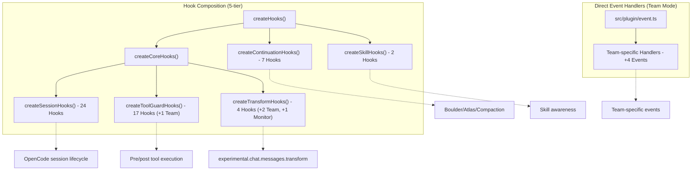
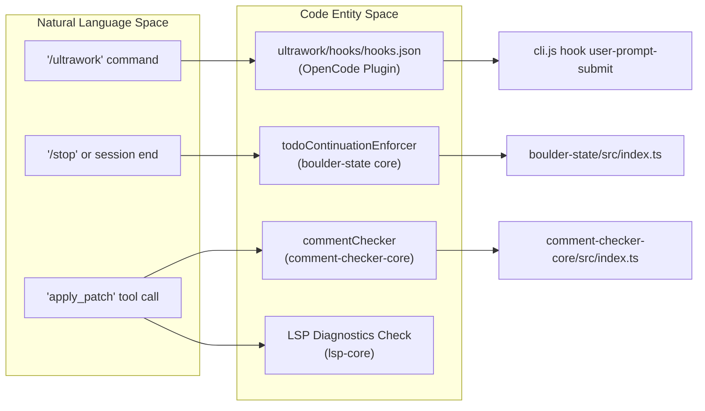

# Hook System

<details>
<summary>Relevant source files</summary>

The following files were used as context for generating this wiki page:

- [.omo/evidence/20260812-init-deep/hierarchy-green.txt](https://github.com/code-yeongyu/oh-my-openagent/blob/HEAD/.omo/evidence/20260812-init-deep/hierarchy-green.txt)
- [.omo/evidence/20260812-init-deep/hierarchy-red.txt](https://github.com/code-yeongyu/oh-my-openagent/blob/HEAD/.omo/evidence/20260812-init-deep/hierarchy-red.txt)
- [.omo/evidence/20260812-init-deep/manual-review.md](https://github.com/code-yeongyu/oh-my-openagent/blob/HEAD/.omo/evidence/20260812-init-deep/manual-review.md)
- [.omo/evidence/20260812-init-deep/qa-summary.md](https://github.com/code-yeongyu/oh-my-openagent/blob/HEAD/.omo/evidence/20260812-init-deep/qa-summary.md)
- [.omo/evidence/20260812-init-deep/scoring.md](https://github.com/code-yeongyu/oh-my-openagent/blob/HEAD/.omo/evidence/20260812-init-deep/scoring.md)
- [.omo/evidence/20260812-init-deep/validation-green.txt](https://github.com/code-yeongyu/oh-my-openagent/blob/HEAD/.omo/evidence/20260812-init-deep/validation-green.txt)
- [.omo/evidence/20260812-init-deep/validation-red.txt](https://github.com/code-yeongyu/oh-my-openagent/blob/HEAD/.omo/evidence/20260812-init-deep/validation-red.txt)
- [AGENTS.md](https://github.com/code-yeongyu/oh-my-openagent/blob/HEAD/AGENTS.md)
- [packages/AGENTS.md](https://github.com/code-yeongyu/oh-my-openagent/blob/HEAD/packages/AGENTS.md)
- [packages/ast-grep-mcp/AGENTS.md](https://github.com/code-yeongyu/oh-my-openagent/blob/HEAD/packages/ast-grep-mcp/AGENTS.md)
- [packages/memory-core/AGENTS.md](https://github.com/code-yeongyu/oh-my-openagent/blob/HEAD/packages/memory-core/AGENTS.md)
- [packages/omo-opencode/src/AGENTS.md](https://github.com/code-yeongyu/oh-my-openagent/blob/HEAD/packages/omo-opencode/src/AGENTS.md)
- [packages/omo-opencode/src/agents/AGENTS.md](https://github.com/code-yeongyu/oh-my-openagent/blob/HEAD/packages/omo-opencode/src/agents/AGENTS.md)
- [packages/omo-opencode/src/agents/prometheus/AGENTS.md](https://github.com/code-yeongyu/oh-my-openagent/blob/HEAD/packages/omo-opencode/src/agents/prometheus/AGENTS.md)
- [packages/omo-opencode/src/config-migration/AGENTS.md](https://github.com/code-yeongyu/oh-my-openagent/blob/HEAD/packages/omo-opencode/src/config-migration/AGENTS.md)
- [packages/omo-opencode/src/features/AGENTS.md](https://github.com/code-yeongyu/oh-my-openagent/blob/HEAD/packages/omo-opencode/src/features/AGENTS.md)
- [packages/omo-opencode/src/features/boulder-state/AGENTS.md](https://github.com/code-yeongyu/oh-my-openagent/blob/HEAD/packages/omo-opencode/src/features/boulder-state/AGENTS.md)
- [packages/omo-opencode/src/features/team-mode/AGENTS.md](https://github.com/code-yeongyu/oh-my-openagent/blob/HEAD/packages/omo-opencode/src/features/team-mode/AGENTS.md)
- [packages/omo-opencode/src/hooks/AGENTS.md](https://github.com/code-yeongyu/oh-my-openagent/blob/HEAD/packages/omo-opencode/src/hooks/AGENTS.md)
- [packages/omo-opencode/src/hooks/auto-update-checker/AGENTS.md](https://github.com/code-yeongyu/oh-my-openagent/blob/HEAD/packages/omo-opencode/src/hooks/auto-update-checker/AGENTS.md)
- [packages/omo-opencode/src/hooks/keyword-detector/AGENTS.md](https://github.com/code-yeongyu/oh-my-openagent/blob/HEAD/packages/omo-opencode/src/hooks/keyword-detector/AGENTS.md)

</details>


The Hook System is the extensibility backbone of the `oh-my-opencode` (aka `oh-my-openagent`) plugin. It implements a comprehensive lifecycle framework with **54 base hooks** (61 with team-mode, 62 with team-mode + monitor) currently active in the integrated plugin namespace.

- **43 Core Hooks** distributed among Session (24), Tool Guard (17), and Transform (4) categories.
- **7 Continuation Hooks**, managing session continuity, background orchestration, and context compaction.
- **2 Skill Hooks**, handling skill-awareness and command automation.
- **4 Direct Event Handlers** for team-mode specific events.

Together, these hooks intercept and augment runtime execution at key phases like tool execution, message transformation, and session lifecycle events. They enable advanced behaviors like context injection, error recovery, model fallback, and agent task continuation.

Sources: [packages/omo-opencode/src/AGENTS.md:71-103](https://github.com/code-yeongyu/oh-my-openagent/blob/HEAD/packages/omo-opencode/src/AGENTS.md#L71-L103), [packages/omo-opencode/src/hooks/AGENTS.md:6-22](https://github.com/code-yeongyu/oh-my-openagent/blob/HEAD/packages/omo-opencode/src/hooks/AGENTS.md#L6-L22)

---

## System Overview

### Hook Categories and Counts

The system organizes hooks into five tiers, plus direct event handlers for team mode. The counts vary when `team_mode.enabled` is active.

| Tier | Composer | Base Count | With Team Mode | Where |
|---|---|---|---|---|
| **Session** | `create-session-hooks.ts` | 24 | 24 | OpenCode session lifecycle + chat.params + chat.message |
| **Tool Guard** | `create-tool-guard-hooks.ts` | 17 | 18 | Pre/post tool execution (+1: `team-tool-gating`) |
| **Transform** | `create-transform-hooks.ts` | 4 | 6 | `experimental.chat.messages.transform` (+2: `team-mode-status-injector`, `team-mailbox-injector`; `monitor-status-injector` is a further +1 gated on `monitor.enabled`, not team-mode) |
| **Continuation** | `create-continuation-hooks.ts` | 7 | 7 | Boulder/atlas/compaction/notification |
| **Skill** | `create-skill-hooks.ts` | 2 | 2 | Skill awareness (categorySkillReminder, autoSlashCommand) |
| **Direct Event Handlers** | `src/plugin/event.ts` | 0 | +4 | `team-session-events/` sub-files |

Total exposed hooks: **54 base, 61 with team-mode, 62 with team-mode + monitor**.
Sources: [packages/omo-opencode/src/AGENTS.md:74-103](https://github.com/code-yeongyu/oh-my-openagent/blob/HEAD/packages/omo-opencode/src/AGENTS.md#L74-L103), [packages/omo-opencode/src/hooks/AGENTS.md:11-22](https://github.com/code-yeongyu/oh-my-openagent/blob/HEAD/packages/omo-opencode/src/hooks/AGENTS.md#L11-L22)

### High-Level Hook Architecture

Hooks are composed in a 5-tier structure. Each tier produces an object of handlers that are invoked by the matching OpenCode handler in registration order via `safeHook()` wrappers.

**Hook Composition Hierarchy**

Sources: [packages/omo-opencode/src/AGENTS.md:74-105](https://github.com/code-yeongyu/oh-my-openagent/blob/HEAD/packages/omo-opencode/src/AGENTS.md#L74-L105), [packages/omo-opencode/src/hooks/AGENTS.md:11-22](https://github.com/code-yeongyu/oh-my-openagent/blob/HEAD/packages/omo-opencode/src/hooks/AGENTS.md#L11-L22)

---

## Hook Lifecycle and Event Integration

Hooks are tied to specific events within the plugin's `PluginInterface`, defined in `src/plugin-interface.ts`.

| Event | Hook Invocation Point | Description |
| :--- | :--- | :--- |
| `SessionStart` | New session start | Bootstrap provisioning, environment setup, and `autoUpdateChecker`. |
| `PreToolUse` | Before tool execution | Guard file operations (e.g., `writeExistingFileGuard`), inject project rules (`rulesInjector`), and enforce agent-specific constraints. |
| `PostToolUse` | After tool returns | Detect JSON errors (`jsonErrorRecovery`), check comments (`commentChecker`), and truncate large outputs (`toolOutputTruncator`). |
| `Stop` | Session termination | Triggers continuation checks like `todoContinuationEnforcer` (Boulder) to see if work should resume. |
| `PostCompact` | After state compaction | Reset caches (e.g., `LSP Diagnostics Cache`) and preserve critical context. |

Sources: [packages/omo-opencode/src/plugin-interface.ts:30-33](https://github.com/code-yeongyu/oh-my-openagent/blob/HEAD/packages/omo-opencode/src/plugin-interface.ts#L30-L33), [packages/omo-codex/plugin/components/rules/hooks/hooks.json:3-54](https://github.com/code-yeongyu/oh-my-openagent/blob/HEAD/packages/omo-codex/plugin/components/rules/hooks/hooks.json#L3-L54), [packages/omo-codex/plugin/components/lsp/hooks/hooks.json:3-30](https://github.com/code-yeongyu/oh-my-openagent/blob/HEAD/packages/omo-codex/plugin/components/lsp/hooks/hooks.json#L3-L30)

### Bridging Intent to Hook Entities

This diagram illustrates how a user's intent or a system state change flows from natural language triggers into specific code entities within the hook system.

**Intent to Code Mapping**

Sources: [packages/omo-codex/plugin/components/ultrawork/hooks/hooks.json:3-16](https://github.com/code-yeongyu/oh-my-openagent/blob/HEAD/packages/omo-codex/plugin/components/ultrawork/hooks/hooks.json#L3-L16), [packages/omo-codex/plugin/components/comment-checker/hooks/hooks.json:3-17](https://github.com/code-yeongyu/oh-my-openagent/blob/HEAD/packages/omo-codex/plugin/components/comment-checker/hooks/hooks.json#L3-L17), [packages/omo-opencode/src/AGENTS.md:95-97](https://github.com/code-yeongyu/oh-my-openagent/blob/HEAD/packages/omo-opencode/src/AGENTS.md#L95-L97)

---

## Core Hooks (45-48)

The core hooks provide essential plugin capabilities. For detailed descriptions, see [Core Hooks](26_5.1-core-hooks.md).

*   **Session Hooks (24):** Manage state and model behavior, including `modelFallback` for proactive retries, `thinkMode` switching, and `runtimeFallback`. These also include `codegraphBootstrap` and `astGrepSgProvision` for bootstrapping tools.
*   **Tool Guard Hooks (17-18):** Enforce safety and reliability, such as `writeExistingFileGuard`, `bashFileReadGuard`, `notepadWriteGuard`, and `teamToolGating`.
*   **Transform Hooks (4-6):** Modify chat message content before it reaches the LLM, including `contextInjectorMessagesTransform`, `claudeCodeHooks`, and team-mode specific injectors.

Sources: [packages/omo-opencode/src/AGENTS.md:75-94](https://github.com/code-yeongyu/oh-my-openagent/blob/HEAD/packages/omo-opencode/src/AGENTS.md#L75-L94), [packages/omo-opencode/src/hooks/AGENTS.md:26-54](https://github.com/code-yeongyu/oh-my-openagent/blob/HEAD/packages/omo-opencode/src/hooks/AGENTS.md#L26-L54)

---

## Continuation Hooks (7)

Continuation hooks support session longevity and background processing. For details, see [Continuation Hooks](27_5.2-continuation-hooks.md).

*   **Boulder System:** The `todoContinuationEnforcer` prevents agents from abandoning incomplete tasks by monitoring session status and enforcing a "loop" until success criteria are met.
*   **Atlas Orchestrator:** The `atlasHook` coordinates task management and session continuity.
*   **Background Notifications:** The `backgroundNotificationHook` dispatches alerts for background task status changes.

Sources: [packages/omo-opencode/src/AGENTS.md:95-97](https://github.com/code-yeongyu/oh-my-openagent/blob/HEAD/packages/omo-opencode/src/AGENTS.md#L95-L97), [packages/omo-opencode/src/hooks/AGENTS.md:88-94](https://github.com/code-yeongyu/oh-my-openagent/blob/HEAD/packages/omo-opencode/src/hooks/AGENTS.md#L88-L94)

---

## Session Notifications

The system dispatches platform-specific notifications (Windows Toasts, macOS AppleScript) on session events. These are controlled via the `sessionNotification` hook.

For in-depth info, see [Session Notifications](28_5.3-session-notifications.md).

Sources: [packages/omo-opencode/src/AGENTS.md:77](https://github.com/code-yeongyu/oh-my-openagent/blob/HEAD/packages/omo-opencode/src/AGENTS.md#L77), [packages/omo-opencode/src/hooks/AGENTS.md:30](https://github.com/code-yeongyu/oh-my-openagent/blob/HEAD/packages/omo-opencode/src/hooks/AGENTS.md#L30)

---

## Disabling Hooks

Hooks can be disabled via the `disabled_hooks` array in the `omo.jsonc` configuration file. This allows users to strip specific behaviors (like comment checking or auto-updates) without modifying the plugin code. The allowlist for `disabled_hooks` is defined by `HookNameSchema` in [`src/config/schema/hooks.ts`](https://github.com/code-yeongyu/oh-my-openagent/blob/HEAD/packages/omo-opencode/src/config/schema/hooks.ts) [packages/omo-opencode/src/hooks/AGENTS.md:24-25](https://github.com/code-yeongyu/oh-my-openagent/blob/HEAD/packages/omo-opencode/src/hooks/AGENTS.md#L24-L25).

```jsonc
// omo.jsonc
{
  "disabled_hooks": [
    "comment-checker",
    "todo-continuation-enforcer",
    "auto-update-checker"
  ]
}
```
Sources: [packages/omo-opencode/src/AGENTS.md:61](https://github.com/code-yeongyu/oh-my-openagent/blob/HEAD/packages/omo-opencode/src/AGENTS.md#L61), [packages/omo-opencode/src/hooks/AGENTS.md:24-25](https://github.com/code-yeongyu/oh-my-openagent/blob/HEAD/packages/omo-opencode/src/hooks/AGENTS.md#L24-L25)

---

## Related Documentation

- [Core Hooks](26_5.1-core-hooks.md) — Detailed documentation on session, tool, and transform hooks.
- [Continuation Hooks](27_5.2-continuation-hooks.md) — Boulder enforcement, Atlas, and compaction logic.
- [Session Notifications](28_5.3-session-notifications.md) — Idle detection and OS-specific notification dispatch.
- [Creating Custom Hooks](29_5.4-creating-custom-hooks.md) — Factory patterns and registration for new hooks.30:T3974