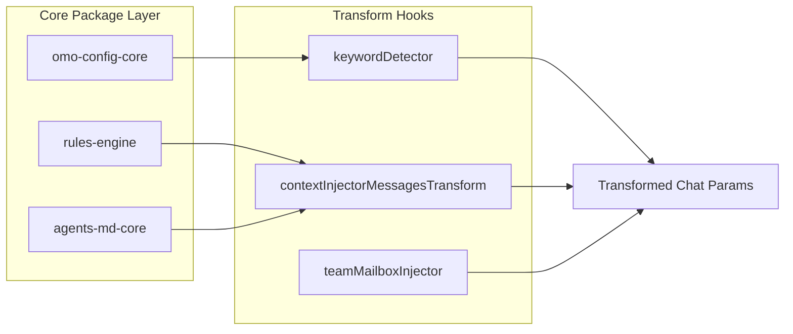

# Core Hooks

Relevant source files

The following files were used as context for generating this wiki page:

- [packages/omo-codex/plugin/components/teammode/hooks/hooks.json](https://github.com/code-yeongyu/oh-my-openagent/blob/HEAD/packages/omo-codex/plugin/components/teammode/hooks/hooks.json)
- [packages/omo-codex/plugin/hooks/post-compact-resetting-git-bash-mcp-reminder.json](https://github.com/code-yeongyu/oh-my-openagent/blob/HEAD/packages/omo-codex/plugin/hooks/post-compact-resetting-git-bash-mcp-reminder.json)
- [packages/omo-codex/plugin/hooks/post-compact-resetting-lsp-diagnostics-cache.json](https://github.com/code-yeongyu/oh-my-openagent/blob/HEAD/packages/omo-codex/plugin/hooks/post-compact-resetting-lsp-diagnostics-cache.json)
- [packages/omo-codex/plugin/hooks/post-compact-resetting-project-rule-cache.json](https://github.com/code-yeongyu/oh-my-openagent/blob/HEAD/packages/omo-codex/plugin/hooks/post-compact-resetting-project-rule-cache.json)
- [packages/omo-codex/plugin/hooks/post-tool-use-checking-codegraph-init-guidance.json](https://github.com/code-yeongyu/oh-my-openagent/blob/HEAD/packages/omo-codex/plugin/hooks/post-tool-use-checking-codegraph-init-guidance.json)
- [packages/omo-codex/plugin/hooks/post-tool-use-checking-comments.json](https://github.com/code-yeongyu/oh-my-openagent/blob/HEAD/packages/omo-codex/plugin/hooks/post-tool-use-checking-comments.json)
- [packages/omo-codex/plugin/hooks/post-tool-use-checking-lsp-diagnostics.json](https://github.com/code-yeongyu/oh-my-openagent/blob/HEAD/packages/omo-codex/plugin/hooks/post-tool-use-checking-lsp-diagnostics.json)
- [packages/omo-codex/plugin/hooks/post-tool-use-checking-thread-title-hygiene.json](https://github.com/code-yeongyu/oh-my-openagent/blob/HEAD/packages/omo-codex/plugin/hooks/post-tool-use-checking-thread-title-hygiene.json)
- [packages/omo-codex/plugin/hooks/post-tool-use-matching-project-rules.json](https://github.com/code-yeongyu/oh-my-openagent/blob/HEAD/packages/omo-codex/plugin/hooks/post-tool-use-matching-project-rules.json)
- [packages/omo-codex/plugin/hooks/pre-tool-use-enforcing-unlimited-goal-budget.json](https://github.com/code-yeongyu/oh-my-openagent/blob/HEAD/packages/omo-codex/plugin/hooks/pre-tool-use-enforcing-unlimited-goal-budget.json)
- [packages/omo-codex/plugin/hooks/pre-tool-use-recommending-git-bash-mcp.json](https://github.com/code-yeongyu/oh-my-openagent/blob/HEAD/packages/omo-codex/plugin/hooks/pre-tool-use-recommending-git-bash-mcp.json)
- [packages/omo-codex/plugin/hooks/session-start-checking-auto-update.json](https://github.com/code-yeongyu/oh-my-openagent/blob/HEAD/packages/omo-codex/plugin/hooks/session-start-checking-auto-update.json)
- [packages/omo-codex/plugin/hooks/session-start-checking-codegraph-bootstrap.json](https://github.com/code-yeongyu/oh-my-openagent/blob/HEAD/packages/omo-codex/plugin/hooks/session-start-checking-codegraph-bootstrap.json)
- [packages/omo-codex/plugin/hooks/session-start-loading-project-rules.json](https://github.com/code-yeongyu/oh-my-openagent/blob/HEAD/packages/omo-codex/plugin/hooks/session-start-loading-project-rules.json)
- [packages/omo-codex/plugin/hooks/session-start-recording-session-telemetry.json](https://github.com/code-yeongyu/oh-my-openagent/blob/HEAD/packages/omo-codex/plugin/hooks/session-start-recording-session-telemetry.json)
- [packages/omo-config-core/src/migration/index.ts](https://github.com/code-yeongyu/oh-my-openagent/blob/HEAD/packages/omo-config-core/src/migration/index.ts)
- [packages/omo-opencode/src/agents/sisyphus/claude-opus-4-7.ts](https://github.com/code-yeongyu/oh-my-openagent/blob/HEAD/packages/omo-opencode/src/agents/sisyphus/claude-opus-4-7.ts)
- [packages/omo-opencode/src/cli/config-manager/plugin-detection.test.ts](https://github.com/code-yeongyu/oh-my-openagent/blob/HEAD/packages/omo-opencode/src/cli/config-manager/plugin-detection.test.ts)
- [packages/omo-opencode/src/features/opencode-runtime-skills/source-server.test.ts](https://github.com/code-yeongyu/oh-my-openagent/blob/HEAD/packages/omo-opencode/src/features/opencode-runtime-skills/source-server.test.ts)
- [packages/omo-opencode/src/features/opencode-runtime-skills/source-server.ts](https://github.com/code-yeongyu/oh-my-openagent/blob/HEAD/packages/omo-opencode/src/features/opencode-runtime-skills/source-server.ts)
- [packages/omo-opencode/src/hooks/claude-code-hooks/config-loader.test.ts](https://github.com/code-yeongyu/oh-my-openagent/blob/HEAD/packages/omo-opencode/src/hooks/claude-code-hooks/config-loader.test.ts)
- [packages/omo-opencode/src/hooks/claude-code-hooks/config-loader.ts](https://github.com/code-yeongyu/oh-my-openagent/blob/HEAD/packages/omo-opencode/src/hooks/claude-code-hooks/config-loader.ts)
- [packages/omo-opencode/src/index.telemetry.test.ts](https://github.com/code-yeongyu/oh-my-openagent/blob/HEAD/packages/omo-opencode/src/index.telemetry.test.ts)
- [packages/omo-opencode/src/index.test.ts](https://github.com/code-yeongyu/oh-my-openagent/blob/HEAD/packages/omo-opencode/src/index.test.ts)
- [packages/omo-opencode/src/plugin-handlers/config-handler-cache.test.ts](https://github.com/code-yeongyu/oh-my-openagent/blob/HEAD/packages/omo-opencode/src/plugin-handlers/config-handler-cache.test.ts)
- [packages/omo-opencode/src/plugin-handlers/config-handler-formatter.test.ts](https://github.com/code-yeongyu/oh-my-openagent/blob/HEAD/packages/omo-opencode/src/plugin-handlers/config-handler-formatter.test.ts)
- [packages/omo-opencode/src/plugin-handlers/config-handler.test.ts](https://github.com/code-yeongyu/oh-my-openagent/blob/HEAD/packages/omo-opencode/src/plugin-handlers/config-handler.test.ts)
- [packages/omo-opencode/src/plugin-handlers/config-handler.ts](https://github.com/code-yeongyu/oh-my-openagent/blob/HEAD/packages/omo-opencode/src/plugin-handlers/config-handler.ts)
- [packages/omo-opencode/src/plugin-handlers/plugin-components-loader.ts](https://github.com/code-yeongyu/oh-my-openagent/blob/HEAD/packages/omo-opencode/src/plugin-handlers/plugin-components-loader.ts)
- [packages/omo-opencode/src/shared/external-plugin-detector.test.ts](https://github.com/code-yeongyu/oh-my-openagent/blob/HEAD/packages/omo-opencode/src/shared/external-plugin-detector.test.ts)
- [packages/omo-opencode/src/startup-migration.ts](https://github.com/code-yeongyu/oh-my-openagent/blob/HEAD/packages/omo-opencode/src/startup-migration.ts)
- [packages/omo-opencode/src/testing/create-plugin-module-live-route.test.ts](https://github.com/code-yeongyu/oh-my-openagent/blob/HEAD/packages/omo-opencode/src/testing/create-plugin-module-live-route.test.ts)
- [packages/omo-opencode/src/testing/create-plugin-module.test.ts](https://github.com/code-yeongyu/oh-my-openagent/blob/HEAD/packages/omo-opencode/src/testing/create-plugin-module.test.ts)
- [packages/omo-opencode/src/testing/create-plugin-module.ts](https://github.com/code-yeongyu/oh-my-openagent/blob/HEAD/packages/omo-opencode/src/testing/create-plugin-module.ts)

Core Hooks are the foundational lifecycle hooks that intercept and modify behavior during OpenCode and Codex session execution. They form the first three tiers of the 5-tier composition model used to overlay custom logic onto agent sessions. Core Hooks comprise three main groups:

- **Session Hooks** (24 hooks) — Lifecycle management and event handling for session creation, messaging, error states, idling, model fallback, goal management, and more [packages/omo-opencode/src/testing/create-plugin-module.ts:51-54](https://github.com/code-yeongyu/oh-my-openagent/blob/HEAD/packages/omo-opencode/src/testing/create-plugin-module.ts#L51-L54).
- **Tool Guard Hooks** (17–18 hooks with team-mode) — Pre- and post-tool-execution guards enforcing safety, context injection, filtering, retry logic, and validation [packages/omo-codex/plugin/hooks/post-tool-use-checking-thread-title-hygiene.json:3-15](https://github.com/code-yeongyu/oh-my-openagent/blob/HEAD/packages/omo-codex/plugin/hooks/post-tool-use-checking-thread-title-hygiene.json#L3-L15).
- **Transform Hooks** (4–6 hooks with team-mode) — Message and system transform hooks that mutate or enrich message streams, prompt context, or model parameters before delivery to providers.

Each hook in these groups is designed as a factory function producing a hook callback that accepts event input and optional output state. Hooks can read or mutate data, trigger secondary effects, or block tool usage events.

**Sources:**
[packages/omo-opencode/src/testing/create-plugin-module.ts:51-54](https://github.com/code-yeongyu/oh-my-openagent/blob/HEAD/packages/omo-opencode/src/testing/create-plugin-module.ts#L51-L54), [packages/omo-codex/plugin/hooks/post-tool-use-checking-thread-title-hygiene.json:3-15](https://github.com/code-yeongyu/oh-my-openagent/blob/HEAD/packages/omo-codex/plugin/hooks/post-tool-use-checking-thread-title-hygiene.json#L3-L15)

---

## Hook Architecture

Core Hooks are instantiated by dedicated creator functions within the OpenCode plugin adapter. These creators assemble hook implementations based on runtime config and environment conditions. The `createHooks` function is responsible for this assembly [packages/omo-opencode/src/testing/create-plugin-module.ts:86](https://github.com/code-yeongyu/oh-my-openagent/blob/HEAD/packages/omo-opencode/src/testing/create-plugin-module.ts#L86).

### Hook Registration and Data Flow

The following diagram illustrates how natural language events (User Prompts, Tool Outputs) are associated with specific code entities in the hook system.

**Natural Language to Code Entity Mapping**

```mermaid
graph TB
    subgraph Natural_Language_Space_Events ["Natural Language Space (Events)"]
        prompt["User Prompt Submit"]
        toolExec["Tool Execution"]
        sessionIdle["Session Idle"]
        compaction["Session Compaction"]
        sessionStart["Session Start"]
    end

    subgraph Code_Entity_Space_Adapters_Hooks ["Code Entity Space (Adapters & Hooks)"]
        dispatcher["createEventHookDispatcher()"]
        
        subgraph Session_Hooks ["Session Hooks"]
            goalHook["createGoalHook()"]
            fallbackHook["createModelFallbackHook()"]
            telemetryHook["telemetry/cli.js hook session-start"]
            autoUpdateHook["auto-update.mjs hook session-start"]
            codegraphBootstrapHook["codegraph/cli.js hook session-start"]
        end
        
        subgraph Tool_Guard_Hooks ["Tool Guard Hooks"]
            commentChecker["comment-checker-core"]
            hashlineRead["hashlineReadEnhancer"]
            threadTitleHygiene["teammode/cli.js hook post-tool-use"]
            codegraphInitGuidance["codegraph/cli.js hook post-tool-use"]
            gitBashMcp["git-bash/cli.js hook pre-tool-use"]
        end
        
        subgraph Transform_Hooks ["Transform Hooks"]
            keywordDetector["createKeywordDetectorHook()"]
            contextInjector["createContextInjectorMessagesTransformHook()"]
        end
    end
    
    prompt --> keywordDetector
    toolExec --> commentChecker
    toolExec --> hashlineRead
    toolExec --> threadTitleHygiene
    toolExec --> codegraphInitGuidance
    toolExec --> gitBashMcp
    sessionIdle --> goalHook
    compaction --> contextInjector
    sessionStart --> telemetryHook
    sessionStart --> autoUpdateHook
    sessionStart --> codegraphBootstrapHook
    prompt --> dispatcher
    dispatcher --> fallbackHook
```

**Sources:**
[packages/omo-opencode/src/testing/create-plugin-module.ts:86](https://github.com/code-yeongyu/oh-my-openagent/blob/HEAD/packages/omo-opencode/src/testing/create-plugin-module.ts#L86), [packages/omo-codex/plugin/hooks/session-start-recording-session-telemetry.json:3-15](https://github.com/code-yeongyu/oh-my-openagent/blob/HEAD/packages/omo-codex/plugin/hooks/session-start-recording-session-telemetry.json#L3-L15), [packages/omo-codex/plugin/hooks/session-start-checking-auto-update.json:3-15](https://github.com/code-yeongyu/oh-my-openagent/blob/HEAD/packages/omo-codex/plugin/hooks/session-start-checking-auto-update.json#L3-L15), [packages/omo-codex/plugin/hooks/session-start-checking-codegraph-bootstrap.json:3-15](https://github.com/code-yeongyu/oh-my-openagent/blob/HEAD/packages/omo-codex/plugin/hooks/session-start-checking-codegraph-bootstrap.json#L3-L15), [packages/omo-codex/plugin/hooks/post-tool-use-checking-thread-title-hygiene.json:3-15](https://github.com/code-yeongyu/oh-my-openagent/blob/HEAD/packages/omo-codex/plugin/hooks/post-tool-use-checking-thread-title-hygiene.json#L3-L15), [packages/omo-codex/plugin/hooks/post-tool-use-checking-codegraph-init-guidance.json:3-15](https://github.com/code-yeongyu/oh-my-openagent/blob/HEAD/packages/omo-codex/plugin/hooks/post-tool-use-checking-codegraph-init-guidance.json#L3-L15), [packages/omo-codex/plugin/hooks/pre-tool-use-recommending-git-bash-mcp.json:3-15](https://github.com/code-yeongyu/oh-my-openagent/blob/HEAD/packages/omo-codex/plugin/hooks/pre-tool-use-recommending-git-bash-mcp.json#L3-L15)

---

## Session Hooks (24)

Session Hooks orchestrate session lifecycle events, chat message interceptors, and error or idle handling. They operate tightly with the adapter's session APIs to influence prompt construction, model selection, and recovery [packages/omo-opencode/src/testing/create-plugin-module.ts:51-54](https://github.com/code-yeongyu/oh-my-openagent/blob/HEAD/packages/omo-opencode/src/testing/create-plugin-module.ts#L51-L54).

### Key Session Hooks

| Hook Name | Purpose |
| :--- | :--- |
| `preemptiveCompaction` | Triggers session summarization before hitting model context window limits. |
| `sessionNotification` | Emits OS-level notifications when a session completes or becomes idle. |
| `modelFallback` | Proactively switches model providers or fallback chains on failures. |
| `anthropicContextWindowLimitRecovery` | Attempts recovery when Anthropic returns empty due to context limits. |
| `goal` | Manages persistent per-session objectives and usage accounting. |
| `taskResumeInfo` | Injects task-specific context when resuming paused workflows. |
| `SessionStart` | Executes commands at the beginning of a session, e.g., for telemetry, auto-updates, or CodeGraph bootstrapping [packages/omo-codex/plugin/hooks/session-start-recording-session-telemetry.json:3-15](https://github.com/code-yeongyu/oh-my-openagent/blob/HEAD/packages/omo-codex/plugin/hooks/session-start-recording-session-telemetry.json#L3-L15), [packages/omo-codex/plugin/hooks/session-start-checking-auto-update.json:3-15](https://github.com/code-yeongyu/oh-my-openagent/blob/HEAD/packages/omo-codex/plugin/hooks/session-start-checking-auto-update.json#L3-L15), [packages/omo-codex/plugin/hooks/session-start-checking-codegraph-bootstrap.json:3-15](https://github.com/code-yeongyu/oh-my-openagent/blob/HEAD/packages/omo-codex/plugin/hooks/session-start-checking-codegraph-bootstrap.json#L3-L15). |

**Sources:**
[packages/omo-opencode/src/testing/create-plugin-module.ts:51-54](https://github.com/code-yeongyu/oh-my-openagent/blob/HEAD/packages/omo-opencode/src/testing/create-plugin-module.ts#L51-L54), [packages/omo-codex/plugin/hooks/session-start-recording-session-telemetry.json:3-15](https://github.com/code-yeongyu/oh-my-openagent/blob/HEAD/packages/omo-codex/plugin/hooks/session-start-recording-session-telemetry.json#L3-L15), [packages/omo-codex/plugin/hooks/session-start-checking-auto-update.json:3-15](https://github.com/code-yeongyu/oh-my-openagent/blob/HEAD/packages/omo-codex/plugin/hooks/session-start-checking-auto-update.json#L3-L15), [packages/omo-codex/plugin/hooks/session-start-checking-codegraph-bootstrap.json:3-15](https://github.com/code-yeongyu/oh-my-openagent/blob/HEAD/packages/omo-codex/plugin/hooks/session-start-checking-codegraph-bootstrap.json#L3-L15)

---

## Tool Guard Hooks (17-18)

Tool Guard Hooks intercept lifecycle points before and after tool execution. They run in `PreToolUse` or `PostToolUse` contexts.

### Guard Implementations

| Hook Name | Trigger | Function |
| :--- | :--- | :--- |
| `commentChecker` | Post | Blocks tool output if prohibited comment patterns are detected. |
| `rulesInjector` | Pre | Injects applicable `AGENTS.md` and `.rules` files based on project scope. |
| `writeExistingFileGuard` | Pre | Requires file read before writes/edits to prevent overwrite mistakes. |
| `hashlineReadEnhancer` | Post | Tags read tool output with `LINE#ID` content hashes. |
| `teamToolGating` | Pre | (Team mode) Restricts tool usage based on team member eligibility. |
| `threadTitleHygiene` | Post | Checks thread title hygiene after `create_thread` tool use, typically for team mode [packages/omo-codex/plugin/hooks/post-tool-use-checking-thread-title-hygiene.json:3-15](https://github.com/code-yeongyu/oh-my-openagent/blob/HEAD/packages/omo-codex/plugin/hooks/post-tool-use-checking-thread-title-hygiene.json#L3-L15). |
| `codegraphInitGuidance` | Post | Provides guidance related to CodeGraph initialization after CodeGraph tools are used [packages/omo-codex/plugin/hooks/post-tool-use-checking-codegraph-init-guidance.json:3-15](https://github.com/code-yeongyu/oh-my-openagent/blob/HEAD/packages/omo-codex/plugin/hooks/post-tool-use-checking-codegraph-init-guidance.json#L3-L15). |
| `gitBashMcp` | Pre | Recommends Git Bash MCP when the `Bash` tool is used [packages/omo-codex/plugin/hooks/pre-tool-use-recommending-git-bash-mcp.json:3-15](https://github.com/code-yeongyu/oh-my-openagent/blob/HEAD/packages/omo-codex/plugin/hooks/pre-tool-use-recommending-git-bash-mcp.json#L3-L15). |

**Sources:**
[packages/omo-codex/plugin/hooks/post-tool-use-checking-thread-title-hygiene.json:3-15](https://github.com/code-yeongyu/oh-my-openagent/blob/HEAD/packages/omo-codex/plugin/hooks/post-tool-use-checking-thread-title-hygiene.json#L3-L15), [packages/omo-codex/plugin/hooks/post-tool-use-checking-codegraph-init-guidance.json:3-15](https://github.com/code-yeongyu/oh-my-openagent/blob/HEAD/packages/omo-codex/plugin/hooks/post-tool-use-checking-codegraph-init-guidance.json#L3-L15), [packages/omo-codex/plugin/hooks/pre-tool-use-recommending-git-bash-mcp.json:3-15](https://github.com/code-yeongyu/oh-my-openagent/blob/HEAD/packages/omo-codex/plugin/hooks/pre-tool-use-recommending-git-bash-mcp.json#L3-L15)

---

## Transform Hooks (4–6)

Transform Hooks modify message streams and model parameters just before sending to the LLM. They primarily target the `experimental.chat.messages.transform` event.

### Data Transformation Pipeline

This diagram shows how internal core packages are utilized by the Transform Hooks to mutate the session state.

**Code Entity to Data Flow**

**Sources:**
[packages/omo-opencode/src/plugin-handlers/config-handler.ts:108-110](https://github.com/code-yeongyu/oh-my-openagent/blob/HEAD/packages/omo-opencode/src/plugin-handlers/config-handler.ts#L108-L110)

---

## Harness-Specific Integration

While the logic is defined in Core Hooks, the execution mechanism varies by harness:

1.  **OpenCode Adapter**: Hooks are wired directly into the `PluginInterface` and executed in-process via `safeHook()` wrappers. The `createHooks` function in `create-plugin-module.ts` is responsible for assembling these hooks [packages/omo-opencode/src/testing/create-plugin-module.ts:86](https://github.com/code-yeongyu/oh-my-openagent/blob/HEAD/packages/omo-opencode/src/testing/create-plugin-module.ts#L86).
2.  **Codex Adapter**: Hooks are defined in `hooks.json` manifests and executed as external CLI commands (e.g., `node cli.js hook pre-tool-use`) to maintain isolation [packages/omo-codex/plugin/hooks/session-start-checking-codegraph-bootstrap.json:3-15](https://github.com/code-yeongyu/oh-my-openagent/blob/HEAD/packages/omo-codex/plugin/hooks/session-start-checking-codegraph-bootstrap.json#L3-L15), [packages/omo-codex/plugin/hooks/post-tool-use-checking-thread-title-hygiene.json:3-15](https://github.com/code-yeongyu/oh-my-openagent/blob/HEAD/packages/omo-codex/plugin/hooks/post-tool-use-checking-thread-title-hygiene.json#L3-L15).

**Sources:**
[packages/omo-opencode/src/testing/create-plugin-module.ts:86](https://github.com/code-yeongyu/oh-my-openagent/blob/HEAD/packages/omo-opencode/src/testing/create-plugin-module.ts#L86), [packages/omo-codex/plugin/hooks/session-start-checking-codegraph-bootstrap.json:3-15](https://github.com/code-yeongyu/oh-my-openagent/blob/HEAD/packages/omo-codex/plugin/hooks/session-start-checking-codegraph-bootstrap.json#L3-L15), [packages/omo-codex/plugin/hooks/post-tool-use-checking-thread-title-hygiene.json:3-15](https://github.com/code-yeongyu/oh-my-openagent/blob/HEAD/packages/omo-codex/plugin/hooks/post-tool-use-checking-thread-title-hygiene.json#L3-L15)31:T4298,# C