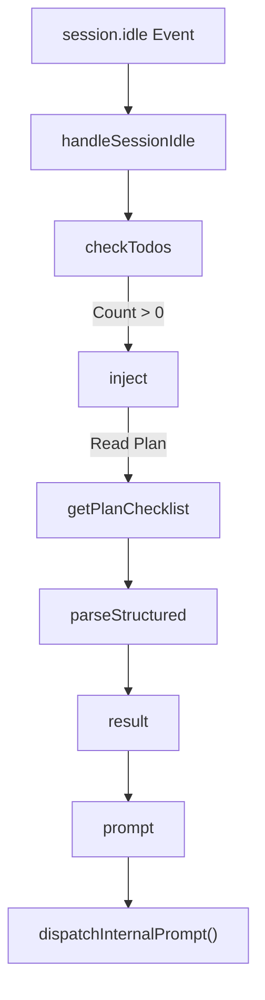
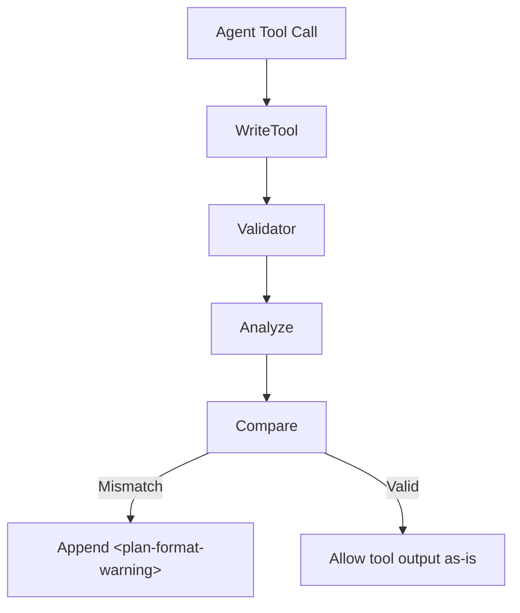
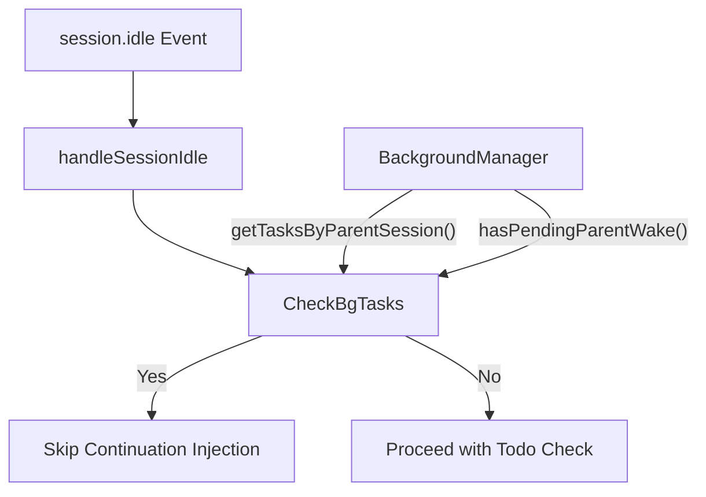
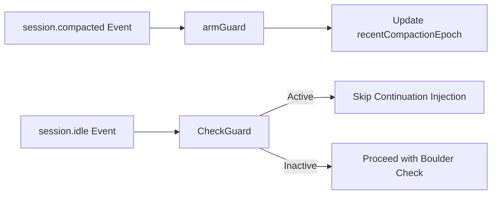

# Continuation Hooks

<details>
<summary>Relevant source files</summary>

The following files were used as context for generating this wiki page:

- [packages/boulder-state/index.d.ts](https://github.com/code-yeongyu/oh-my-openagent/blob/HEAD/packages/boulder-state/index.d.ts)
- [packages/boulder-state/src/index.ts](https://github.com/code-yeongyu/oh-my-openagent/blob/HEAD/packages/boulder-state/src/index.ts)
- [packages/boulder-state/src/plan-checklist.test.ts](https://github.com/code-yeongyu/oh-my-openagent/blob/HEAD/packages/boulder-state/src/plan-checklist.test.ts)
- [packages/boulder-state/src/plan-checklist.ts](https://github.com/code-yeongyu/oh-my-openagent/blob/HEAD/packages/boulder-state/src/plan-checklist.ts)
- [packages/boulder-state/src/read-state.test.ts](https://github.com/code-yeongyu/oh-my-openagent/blob/HEAD/packages/boulder-state/src/read-state.test.ts)
- [packages/boulder-state/src/storage/index.ts](https://github.com/code-yeongyu/oh-my-openagent/blob/HEAD/packages/boulder-state/src/storage/index.ts)
- [packages/boulder-state/src/storage/plan-progress.ts](https://github.com/code-yeongyu/oh-my-openagent/blob/HEAD/packages/boulder-state/src/storage/plan-progress.ts)
- [packages/boulder-state/src/storage/read-state.ts](https://github.com/code-yeongyu/oh-my-openagent/blob/HEAD/packages/boulder-state/src/storage/read-state.ts)
- [packages/boulder-state/src/storage/session.ts](https://github.com/code-yeongyu/oh-my-openagent/blob/HEAD/packages/boulder-state/src/storage/session.ts)
- [packages/boulder-state/src/storage/shared.ts](https://github.com/code-yeongyu/oh-my-openagent/blob/HEAD/packages/boulder-state/src/storage/shared.ts)
- [packages/boulder-state/src/storage/task.ts](https://github.com/code-yeongyu/oh-my-openagent/blob/HEAD/packages/boulder-state/src/storage/task.ts)
- [packages/boulder-state/src/storage/write-state.ts](https://github.com/code-yeongyu/oh-my-openagent/blob/HEAD/packages/boulder-state/src/storage/write-state.ts)
- [packages/boulder-state/src/top-level-task.ts](https://github.com/code-yeongyu/oh-my-openagent/blob/HEAD/packages/boulder-state/src/top-level-task.ts)
- [packages/boulder-state/src/types.ts](https://github.com/code-yeongyu/oh-my-openagent/blob/HEAD/packages/boulder-state/src/types.ts)
- [packages/omo-codex/plugin/components/start-work-continuation/src/boulder-reader.ts](https://github.com/code-yeongyu/oh-my-openagent/blob/HEAD/packages/omo-codex/plugin/components/start-work-continuation/src/boulder-reader.ts)
- [packages/omo-codex/plugin/components/start-work-continuation/src/index.ts](https://github.com/code-yeongyu/oh-my-openagent/blob/HEAD/packages/omo-codex/plugin/components/start-work-continuation/src/index.ts)
- [packages/omo-codex/plugin/components/start-work-continuation/src/plan-checklist.ts](https://github.com/code-yeongyu/oh-my-openagent/blob/HEAD/packages/omo-codex/plugin/components/start-work-continuation/src/plan-checklist.ts)
- [packages/omo-codex/plugin/components/start-work-continuation/test/boulder-reader.test.ts](https://github.com/code-yeongyu/oh-my-openagent/blob/HEAD/packages/omo-codex/plugin/components/start-work-continuation/test/boulder-reader.test.ts)
- [packages/omo-codex/plugin/components/start-work-continuation/test/cli.test.ts](https://github.com/code-yeongyu/oh-my-openagent/blob/HEAD/packages/omo-codex/plugin/components/start-work-continuation/test/cli.test.ts)
- [packages/omo-codex/plugin/components/start-work-continuation/test/fixtures/plan-scaffold.md](https://github.com/code-yeongyu/oh-my-openagent/blob/HEAD/packages/omo-codex/plugin/components/start-work-continuation/test/fixtures/plan-scaffold.md)
- [packages/omo-opencode/src/features/boulder-state/storage.test.ts](https://github.com/code-yeongyu/oh-my-openagent/blob/HEAD/packages/omo-opencode/src/features/boulder-state/storage.test.ts)
- [packages/omo-opencode/src/features/boulder-state/top-level-task.test.ts](https://github.com/code-yeongyu/oh-my-openagent/blob/HEAD/packages/omo-opencode/src/features/boulder-state/top-level-task.test.ts)
- [packages/omo-opencode/src/features/claude-code-session-state/state.ts](https://github.com/code-yeongyu/oh-my-openagent/blob/HEAD/packages/omo-opencode/src/features/claude-code-session-state/state.ts)
- [packages/omo-opencode/src/hooks/plan-format-validator/hook.test.ts](https://github.com/code-yeongyu/oh-my-openagent/blob/HEAD/packages/omo-opencode/src/hooks/plan-format-validator/hook.test.ts)
- [packages/omo-opencode/src/hooks/plan-format-validator/hook.ts](https://github.com/code-yeongyu/oh-my-openagent/blob/HEAD/packages/omo-opencode/src/hooks/plan-format-validator/hook.ts)
- [packages/omo-opencode/src/hooks/todo-continuation-enforcer/continuation-injection.test.ts](https://github.com/code-yeongyu/oh-my-openagent/blob/HEAD/packages/omo-opencode/src/hooks/todo-continuation-enforcer/continuation-injection.test.ts)
- [packages/omo-opencode/src/hooks/todo-continuation-enforcer/continuation-injection.ts](https://github.com/code-yeongyu/oh-my-openagent/blob/HEAD/packages/omo-opencode/src/hooks/todo-continuation-enforcer/continuation-injection.ts)
- [packages/omo-opencode/src/hooks/todo-continuation-enforcer/handler.ts](https://github.com/code-yeongyu/oh-my-openagent/blob/HEAD/packages/omo-opencode/src/hooks/todo-continuation-enforcer/handler.ts)
- [packages/omo-opencode/src/hooks/todo-continuation-enforcer/idle-event.ts](https://github.com/code-yeongyu/oh-my-openagent/blob/HEAD/packages/omo-opencode/src/hooks/todo-continuation-enforcer/idle-event.ts)
- [packages/omo-opencode/src/hooks/todo-continuation-enforcer/non-idle-events.test.ts](https://github.com/code-yeongyu/oh-my-openagent/blob/HEAD/packages/omo-opencode/src/hooks/todo-continuation-enforcer/non-idle-events.test.ts)
- [packages/omo-opencode/src/hooks/todo-continuation-enforcer/non-idle-events.ts](https://github.com/code-yeongyu/oh-my-openagent/blob/HEAD/packages/omo-opencode/src/hooks/todo-continuation-enforcer/non-idle-events.ts)
- [packages/omo-opencode/src/hooks/todo-continuation-enforcer/session-state.test.ts](https://github.com/code-yeongyu/oh-my-openagent/blob/HEAD/packages/omo-opencode/src/hooks/todo-continuation-enforcer/session-state.test.ts)
- [packages/omo-opencode/src/hooks/todo-continuation-enforcer/session-state.ts](https://github.com/code-yeongyu/oh-my-openagent/blob/HEAD/packages/omo-opencode/src/hooks/todo-continuation-enforcer/session-state.ts)
- [packages/omo-opencode/src/hooks/todo-continuation-enforcer/types.ts](https://github.com/code-yeongyu/oh-my-openagent/blob/HEAD/packages/omo-opencode/src/hooks/todo-continuation-enforcer/types.ts)
- [packages/omo-opencode/src/tools/call-omo-agent/sync-executor-reawaken-guard.test.ts](https://github.com/code-yeongyu/oh-my-openagent/blob/HEAD/packages/omo-opencode/src/tools/call-omo-agent/sync-executor-reawaken-guard.test.ts)
- [packages/omo-opencode/src/tools/call-omo-agent/sync-executor.ts](https://github.com/code-yeongyu/oh-my-openagent/blob/HEAD/packages/omo-opencode/src/tools/call-omo-agent/sync-executor.ts)
- [packages/omo-opencode/src/tools/delegate-task/sync-session-lifecycle.test.ts](https://github.com/code-yeongyu/oh-my-openagent/blob/HEAD/packages/omo-opencode/src/tools/delegate-task/sync-session-lifecycle.test.ts)
- [packages/omo-opencode/src/tools/delegate-task/sync-session-lifecycle.ts](https://github.com/code-yeongyu/oh-my-openagent/blob/HEAD/packages/omo-opencode/src/tools/delegate-task/sync-session-lifecycle.ts)
- [packages/omo-opencode/src/tools/delegate-task/sync-task-reawaken-guard.test.ts](https://github.com/code-yeongyu/oh-my-openagent/blob/HEAD/packages/omo-opencode/src/tools/delegate-task/sync-task-reawaken-guard.test.ts)
- [packages/omo-opencode/src/tools/delegate-task/sync-task.ts](https://github.com/code-yeongyu/oh-my-openagent/blob/HEAD/packages/omo-opencode/src/tools/delegate-task/sync-task.ts)

</details>


Continuation hooks enforce task completion, manage multi-agent continuation states, and coordinate background task notifications. They are a distinct layer in the OhMyOpenAgent lifecycle hook system designed to maintain session progress and avoid premature session termination or orphaned tasks in long-running AI orchestration workflows.

---

## Overview

Continuation hooks work mainly on lifecycle events such as `session.idle`, `event` (various subtypes), and `session.compacted` to:

- Detect incomplete work (e.g., outstanding todos) and enforce continuation by injecting prompts.
- Track the lineage and state of active multi-agent plans with Boulder and Atlas.
- Manage notifications and background task lifecycle to keep parent sessions informed.
- Handle session context pruning (compaction) carefully to avoid hallucinated or stale continuation prompts.

| Hook Name | Event | Role / Function |
|---|---|---|
| `todoContinuationEnforcer` (Boulder) | `session.idle` | Forces continuation prompt if incomplete todos remain and the session is considered idle |
| `atlasHook` | `event` (tool.execute, session.idle, etc.) | Tracks Boulder plan state, enforces strict verification gates, and manages continuation on idle |
| Background Notification Hook | `session.idle`, background task events | Ensures parent sessions don't continue prematurely when background child tasks are active or just completed |
| Compaction Hooks | `session.compacted` | Manage session state after history pruning, avoiding hallucinations and preserving context across compactions |

---

## todoContinuationEnforcer (Boulder Mechanism)

The **Boulder** mechanism is implemented as the `todoContinuationEnforcer` hook. It guarantees long-running tasks with unfinished todos receive prompt injections to continue work instead of silently stopping. It monitors the session state and identifies "stagnation" (consecutive turns without progress) to trigger re-intervention or backoff.

### Implementation Highlights

- **Stagnation Tracking**: The enforcer tracks `stagnationCount` and `consecutiveFailures` in the `SessionState` [packages/omo-opencode/src/hooks/todo-continuation-enforcer/types.ts:41-42](https://github.com/code-yeongyu/oh-my-openagent/blob/HEAD/packages/omo-opencode/src/hooks/todo-continuation-enforcer/types.ts#L41-L42). If an agent fails to make progress across multiple turns, it may trigger a reset or alert.
- **Cooldown Logic**: To prevent rapid-fire loop failures, it applies a cooldown (`CONTINUATION_COOLDOWN_MS`) that doubles exponentially based on `consecutiveFailures` [packages/omo-opencode/src/hooks/todo-continuation-enforcer/idle-event.ts:160-165](https://github.com/code-yeongyu/oh-my-openagent/blob/HEAD/packages/omo-opencode/src/hooks/todo-continuation-enforcer/idle-event.ts#L160-L165).
- **Codex Integration**: In `omo-codex`, the logic reads the `boulder.json` state via `readContinuationState` [packages/omo-codex/plugin/components/start-work-continuation/src/boulder-reader.ts:37-57](https://github.com/code-yeongyu/oh-my-openagent/blob/HEAD/packages/omo-codex/plugin/components/start-work-continuation/src/boulder-reader.ts#L37-L57) to determine if the session is continuable based on status ("active" or "paused") [packages/omo-codex/plugin/components/start-work-continuation/src/boulder-reader.ts:174-176](https://github.com/code-yeongyu/oh-my-openagent/blob/HEAD/packages/omo-codex/plugin/components/start-work-continuation/src/boulder-reader.ts#L174-L176).
- **Abort & Error Detection**: The hook monitors for `MessageAbortedError`, `TokenLimitError`, and unrecoverable request errors to halt continuation and avoid infinite loops [packages/omo-opencode/src/hooks/todo-continuation-enforcer/handler.ts:82-110](https://github.com/code-yeongyu/oh-my-openagent/blob/HEAD/packages/omo-opencode/src/hooks/todo-continuation-enforcer/handler.ts#L82-L110).

### Plan Checklist Parsing

The core of the Boulder mechanism relies on `getPlanChecklist`, which parses Markdown plans located in `.omo/plans/*.md` [packages/boulder-state/src/plan-checklist.ts:35-48](https://github.com/code-yeongyu/oh-my-openagent/blob/HEAD/packages/boulder-state/src/plan-checklist.ts#L35-L48).

- **Structured Sections**: It specifically looks for `## TODOs` and `## Final Verification Wave` headings using regex patterns [packages/boulder-state/src/plan-checklist.ts:6-8](https://github.com/code-yeongyu/oh-my-openagent/blob/HEAD/packages/boulder-state/src/plan-checklist.ts#L6-L8).
- **Grammar Enforcement**: Tasks must follow a strict format: `- [ ] 1. Task Title` for todos and `- [ ] F1. Task Title` for final verification [packages/boulder-state/src/plan-checklist.ts:11-12](https://github.com/code-yeongyu/oh-my-openagent/blob/HEAD/packages/boulder-state/src/plan-checklist.ts#L11-L12).
- **Fencing Protection**: The parser tracks Markdown code fences (e.g., ` ``` `) via `parseOpeningFence` and `isClosingFence` to ignore example checkboxes that are not actual tasks [packages/boulder-state/src/plan-checklist.ts:241-260](https://github.com/code-yeongyu/oh-my-openagent/blob/HEAD/packages/boulder-state/src/plan-checklist.ts#L241-L260).

### Data Flow Diagram: Boulder Task Verification



Sources:
- `handleSessionIdle`: [packages/omo-opencode/src/hooks/todo-continuation-enforcer/idle-event.ts:20-37](https://github.com/code-yeongyu/oh-my-openagent/blob/HEAD/packages/omo-opencode/src/hooks/todo-continuation-enforcer/idle-event.ts#L20-L37)
- `injectContinuation`: [packages/omo-opencode/src/hooks/todo-continuation-enforcer/continuation-injection.ts:51-68](https://github.com/code-yeongyu/oh-my-openagent/blob/HEAD/packages/omo-opencode/src/hooks/todo-continuation-enforcer/continuation-injection.ts#L51-L68)
- `parseStructuredPlan`: [packages/boulder-state/src/plan-checklist.ts:68-124](https://github.com/code-yeongyu/oh-my-openagent/blob/HEAD/packages/boulder-state/src/plan-checklist.ts#L68-L124)
- `CONTINUATION_PROMPT`: [packages/omo-opencode/src/hooks/todo-continuation-enforcer/continuation-injection.ts:170-175](https://github.com/code-yeongyu/oh-my-openagent/blob/HEAD/packages/omo-opencode/src/hooks/todo-continuation-enforcer/continuation-injection.ts#L170-L175)

---

## Atlas Hook and Plan Validation

### Role

The `atlasHook` (and related `plan-format-validator`) ensures that agents maintain the integrity of the plan structure. If an agent writes a plan that the system cannot parse, it provides immediate feedback.

### Plan Format Validation

The `createPlanFormatValidatorHook` intercepts `Write` or `Edit` tool calls targeting plan files [packages/omo-opencode/src/hooks/plan-format-validator/hook.ts:144-156](https://github.com/code-yeongyu/oh-my-openagent/blob/HEAD/packages/omo-opencode/src/hooks/plan-format-validator/hook.ts#L144-L156).

- **Malformed Row Detection**: It compares the `rawCount` of checkboxes against the `validCount` from the official parser via `analyzeStructuredSections` [packages/omo-opencode/src/hooks/plan-format-validator/hook.ts:78-84](https://github.com/code-yeongyu/oh-my-openagent/blob/HEAD/packages/omo-opencode/src/hooks/plan-format-validator/hook.ts#L78-L84).
- **Warning Injection**: If tasks are skipped due to missing numeric prefixes (e.g., omitting `1.`), it appends a `<plan-format-warning>` to the tool output using `buildWarning` [packages/omo-opencode/src/hooks/plan-format-validator/hook.ts:107-142](https://github.com/code-yeongyu/oh-my-openagent/blob/HEAD/packages/omo-opencode/src/hooks/plan-format-validator/hook.ts#L107-L142).

### State Management: Boulder Storage

The `boulder-state` package provides the persistence layer for these hooks:
- `readBoulderState`: Loads the current active plan and tracked session IDs from `.omo/boulder.json` [packages/omo-codex/plugin/components/start-work-continuation/src/boulder-reader.ts:59-67](https://github.com/code-yeongyu/oh-my-openagent/blob/HEAD/packages/omo-codex/plugin/components/start-work-continuation/src/boulder-reader.ts#L59-L67).
- `getWorkForSession`: Identifies the specific work context for a given session ID, prioritizing the newest updated work [packages/omo-codex/plugin/components/start-work-continuation/src/boulder-reader.ts:111-129](https://github.com/code-yeongyu/oh-my-openagent/blob/HEAD/packages/omo-codex/plugin/components/start-work-continuation/src/boulder-reader.ts#L111-L129).

### Data Flow: Plan Format Enforcement



Sources:
- `analyzeStructuredSections`: [packages/omo-opencode/src/hooks/plan-format-validator/hook.ts:43-84](https://github.com/code-yeongyu/oh-my-openagent/blob/HEAD/packages/omo-opencode/src/hooks/plan-format-validator/hook.ts#L43-L84)
- `buildWarning`: [packages/omo-opencode/src/hooks/plan-format-validator/hook.ts:107-142](https://github.com/code-yeongyu/oh-my-openagent/blob/HEAD/packages/omo-opencode/src/hooks/plan-format-validator/hook.ts#L107-L142)
- `createPlanFormatValidatorHook`: [packages/omo-opencode/src/hooks/plan-format-validator/hook.ts:166-202](https://github.com/code-yeongyu/oh-my-openagent/blob/HEAD/packages/omo-opencode/src/hooks/plan-format-validator/hook.ts#L166-L202)

---

## Background Notification Hook

The background notification hook prevents the main agent session from prematurely continuing when background tasks are still active or have just completed and need to report back. This ensures proper synchronization between parent and child agent workflows.

- **`hasRunningBgTasks` Check**: Before injecting a continuation prompt, `injectContinuation` and `handleSessionIdle` check if there are any running or pending background tasks associated with the current session using `backgroundManager.getTasksByParentSession` or `backgroundManager.hasPendingParentWake` [packages/omo-opencode/src/hooks/todo-continuation-enforcer/continuation-injection.ts:91-95](https://github.com/code-yeongyu/oh-my-openagent/blob/HEAD/packages/omo-opencode/src/hooks/todo-continuation-enforcer/continuation-injection.ts#L91-L95), [packages/omo-opencode/src/hooks/todo-continuation-enforcer/idle-event.ts:83-87](https://github.com/code-yeongyu/oh-my-openagent/blob/HEAD/packages/omo-opencode/src/hooks/todo-continuation-enforcer/idle-event.ts#L83-L87).
- **`handedBackSyncSessions`**: This set tracks sessions that have been handed back to a parent, preventing further continuation injections in the child session [packages/omo-opencode/src/hooks/todo-continuation-enforcer/continuation-injection.ts:80-83](https://github.com/code-yeongyu/oh-my-openagent/blob/HEAD/packages/omo-opencode/src/hooks/todo-continuation-enforcer/continuation-injection.ts#L80-L83), [packages/omo-opencode/src/hooks/todo-continuation-enforcer/idle-event.ts:56-59](https://github.com/code-yeongyu/oh-my-openagent/blob/HEAD/packages/omo-opencode/src/hooks/todo-continuation-enforcer/idle-event.ts#L56-L59).

### Data Flow: Background Task Synchronization



Sources:
- `injectContinuation`: [packages/omo-opencode/src/hooks/todo-continuation-enforcer/continuation-injection.ts:91-95](https://github.com/code-yeongyu/oh-my-openagent/blob/HEAD/packages/omo-opencode/src/hooks/todo-continuation-enforcer/continuation-injection.ts#L91-L95)
- `handleSessionIdle`: [packages/omo-opencode/src/hooks/todo-continuation-enforcer/idle-event.ts:83-87](https://github.com/code-yeongyu/oh-my-openagent/blob/HEAD/packages/omo-opencode/src/hooks/todo-continuation-enforcer/idle-event.ts#L83-L87)
- `handedBackSyncSessions`: [packages/omo-opencode/src/hooks/todo-continuation-enforcer/continuation-injection.ts:80-83](https://github.com/code-yeongyu/oh-my-openagent/blob/HEAD/packages/omo-opencode/src/hooks/todo-continuation-enforcer/continuation-injection.ts#L80-L83), [packages/omo-opencode/src/hooks/todo-continuation-enforcer/idle-event.ts:56-59](https://github.com/code-yeongyu/oh-my-openagent/blob/HEAD/packages/omo-opencode/src/hooks/todo-continuation-enforcer/idle-event.ts#L56-L59)

---

## Compaction Hooks

Compaction pruning can cause agents to lose context. OhMyOpenAgent uses specialized hooks to preserve state after a session is compacted.

- **Compaction Guard**: The `armCompactionGuard` function is called when a `session.compacted` event is received [packages/omo-opencode/src/hooks/todo-continuation-enforcer/handler.ts:135-143](https://github.com/code-yeongyu/oh-my-openagent/blob/HEAD/packages/omo-opencode/src/hooks/todo-continuation-enforcer/handler.ts#L135-L143). It increments a `recentCompactionEpoch` to signal that the message history has been truncated.
- **Agent Recovery**: If an agent becomes "unknown" after compaction, the `isCompactionGuardActive` check prevents the enforcer from injecting a continuation prompt until the agent's identity is re-established [packages/omo-opencode/src/hooks/todo-continuation-enforcer/continuation-injection.ts:156-161](https://github.com/code-yeongyu/oh-my-openagent/blob/HEAD/packages/omo-opencode/src/hooks/todo-continuation-enforcer/continuation-injection.ts#L156-L161).
- **Boulder Sync**: The `readContinuationState` utility ensures that the `checklist` is refreshed from the actual file content on disk after any operation that might have changed the plan [packages/omo-codex/plugin/components/start-work-continuation/src/boulder-reader.ts:37-57](https://github.com/code-yeongyu/oh-my-openagent/blob/HEAD/packages/omo-codex/plugin/components/start-work-continuation/src/boulder-reader.ts#L37-L57).

### Summary: Compaction Hook Flow



Sources:
- `armCompactionGuard`: [packages/omo-opencode/src/hooks/todo-continuation-enforcer/compaction-guard.ts](https://github.com/code-yeongyu/oh-my-openagent/blob/HEAD/packages/omo-opencode/src/hooks/todo-continuation-enforcer/compaction-guard.ts) (referenced via [packages/omo-opencode/src/hooks/todo-continuation-enforcer/handler.ts:139](https://github.com/code-yeongyu/oh-my-openagent/blob/HEAD/packages/omo-opencode/src/hooks/todo-continuation-enforcer/handler.ts#L139))
- `isCompactionGuardActive`: [packages/omo-opencode/src/hooks/todo-continuation-enforcer/compaction-guard.ts](https://github.com/code-yeongyu/oh-my-openagent/blob/HEAD/packages/omo-opencode/src/hooks/todo-continuation-enforcer/compaction-guard.ts) (referenced via [packages/omo-opencode/src/hooks/todo-continuation-enforcer/idle-event.ts:180](https://github.com/code-yeongyu/oh-my-openagent/blob/HEAD/packages/omo-opencode/src/hooks/todo-continuation-enforcer/idle-event.ts#L180))
- `readContinuationState`: [packages/omo-codex/plugin/components/start-work-continuation/src/boulder-reader.ts:37-57](https://github.com/code-yeongyu/oh-my-openagent/blob/HEAD/packages/omo-codex/plugin/components/start-work-continuation/src/boulder-reader.ts#L37-L57)