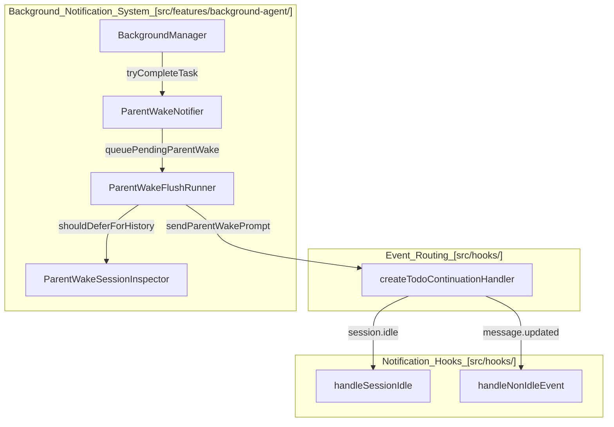
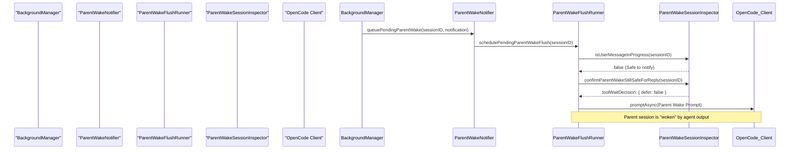

# Session Notifications

Relevant source files

The following files were used as context for generating this wiki page:

- [packages/omo-opencode/src/features/background-agent/background-task-marker.ts](https://github.com/code-yeongyu/oh-my-openagent/blob/HEAD/packages/omo-opencode/src/features/background-agent/background-task-marker.ts)
- [packages/omo-opencode/src/features/background-agent/background-task-notification-template.test.ts](https://github.com/code-yeongyu/oh-my-openagent/blob/HEAD/packages/omo-opencode/src/features/background-agent/background-task-notification-template.test.ts)
- [packages/omo-opencode/src/features/background-agent/background-task-notification-template.ts](https://github.com/code-yeongyu/oh-my-openagent/blob/HEAD/packages/omo-opencode/src/features/background-agent/background-task-notification-template.ts)
- [packages/omo-opencode/src/features/background-agent/error-classifier.test.ts](https://github.com/code-yeongyu/oh-my-openagent/blob/HEAD/packages/omo-opencode/src/features/background-agent/error-classifier.test.ts)
- [packages/omo-opencode/src/features/background-agent/error-classifier.ts](https://github.com/code-yeongyu/oh-my-openagent/blob/HEAD/packages/omo-opencode/src/features/background-agent/error-classifier.ts)
- [packages/omo-opencode/src/features/background-agent/manager-continuation-marker.test.ts](https://github.com/code-yeongyu/oh-my-openagent/blob/HEAD/packages/omo-opencode/src/features/background-agent/manager-continuation-marker.test.ts)
- [packages/omo-opencode/src/features/background-agent/manager.test.ts](https://github.com/code-yeongyu/oh-my-openagent/blob/HEAD/packages/omo-opencode/src/features/background-agent/manager.test.ts)
- [packages/omo-opencode/src/features/background-agent/manager.ts](https://github.com/code-yeongyu/oh-my-openagent/blob/HEAD/packages/omo-opencode/src/features/background-agent/manager.ts)
- [packages/omo-opencode/src/features/background-agent/parent-wake-active-defer-ceiling.test.ts](https://github.com/code-yeongyu/oh-my-openagent/blob/HEAD/packages/omo-opencode/src/features/background-agent/parent-wake-active-defer-ceiling.test.ts)
- [packages/omo-opencode/src/features/background-agent/parent-wake-active-turn-event.test.ts](https://github.com/code-yeongyu/oh-my-openagent/blob/HEAD/packages/omo-opencode/src/features/background-agent/parent-wake-active-turn-event.test.ts)
- [packages/omo-opencode/src/features/background-agent/parent-wake-assistant-text-race.test.ts](https://github.com/code-yeongyu/oh-my-openagent/blob/HEAD/packages/omo-opencode/src/features/background-agent/parent-wake-assistant-text-race.test.ts)
- [packages/omo-opencode/src/features/background-agent/parent-wake-dedupe.ts](https://github.com/code-yeongyu/oh-my-openagent/blob/HEAD/packages/omo-opencode/src/features/background-agent/parent-wake-dedupe.ts)
- [packages/omo-opencode/src/features/background-agent/parent-wake-dispatched-tracker.ts](https://github.com/code-yeongyu/oh-my-openagent/blob/HEAD/packages/omo-opencode/src/features/background-agent/parent-wake-dispatched-tracker.ts)
- [packages/omo-opencode/src/features/background-agent/parent-wake-flush-runner.ts](https://github.com/code-yeongyu/oh-my-openagent/blob/HEAD/packages/omo-opencode/src/features/background-agent/parent-wake-flush-runner.ts)
- [packages/omo-opencode/src/features/background-agent/parent-wake-inflight-dispatch.test.ts](https://github.com/code-yeongyu/oh-my-openagent/blob/HEAD/packages/omo-opencode/src/features/background-agent/parent-wake-inflight-dispatch.test.ts)
- [packages/omo-opencode/src/features/background-agent/parent-wake-late-error-recovery.test.ts](https://github.com/code-yeongyu/oh-my-openagent/blob/HEAD/packages/omo-opencode/src/features/background-agent/parent-wake-late-error-recovery.test.ts)
- [packages/omo-opencode/src/features/background-agent/parent-wake-notifier-types.ts](https://github.com/code-yeongyu/oh-my-openagent/blob/HEAD/packages/omo-opencode/src/features/background-agent/parent-wake-notifier-types.ts)
- [packages/omo-opencode/src/features/background-agent/parent-wake-notifier.ts](https://github.com/code-yeongyu/oh-my-openagent/blob/HEAD/packages/omo-opencode/src/features/background-agent/parent-wake-notifier.ts)
- [packages/omo-opencode/src/features/background-agent/parent-wake-pending-queue.ts](https://github.com/code-yeongyu/oh-my-openagent/blob/HEAD/packages/omo-opencode/src/features/background-agent/parent-wake-pending-queue.ts)
- [packages/omo-opencode/src/features/background-agent/parent-wake-window-recovery.ts](https://github.com/code-yeongyu/oh-my-openagent/blob/HEAD/packages/omo-opencode/src/features/background-agent/parent-wake-window-recovery.ts)
- [packages/omo-opencode/src/features/background-agent/parent-wake-window-requeue.test.ts](https://github.com/code-yeongyu/oh-my-openagent/blob/HEAD/packages/omo-opencode/src/features/background-agent/parent-wake-window-requeue.test.ts)
- [packages/omo-opencode/src/features/hook-message-injector/injector.test.ts](https://github.com/code-yeongyu/oh-my-openagent/blob/HEAD/packages/omo-opencode/src/features/hook-message-injector/injector.test.ts)
- [packages/omo-opencode/src/features/hook-message-injector/sdk-message-lookup.ts](https://github.com/code-yeongyu/oh-my-openagent/blob/HEAD/packages/omo-opencode/src/features/hook-message-injector/sdk-message-lookup.ts)
- [packages/omo-opencode/src/features/team-mode/integration.test.ts](https://github.com/code-yeongyu/oh-my-openagent/blob/HEAD/packages/omo-opencode/src/features/team-mode/integration.test.ts)
- [packages/omo-opencode/src/features/team-mode/team-mailbox/poll.test.ts](https://github.com/code-yeongyu/oh-my-openagent/blob/HEAD/packages/omo-opencode/src/features/team-mode/team-mailbox/poll.test.ts)
- [packages/omo-opencode/src/features/team-mode/team-runtime/create.test.ts](https://github.com/code-yeongyu/oh-my-openagent/blob/HEAD/packages/omo-opencode/src/features/team-mode/team-runtime/create.test.ts)
- [packages/omo-opencode/src/features/team-mode/test-support/async-test-helpers.ts](https://github.com/code-yeongyu/oh-my-openagent/blob/HEAD/packages/omo-opencode/src/features/team-mode/test-support/async-test-helpers.ts)
- [packages/omo-opencode/src/hooks/atlas/tool-execute-after-background-launch.test.ts](https://github.com/code-yeongyu/oh-my-openagent/blob/HEAD/packages/omo-opencode/src/hooks/atlas/tool-execute-after-background-launch.test.ts)
- [packages/omo-opencode/src/hooks/atlas/tool-execute-after-subagent-completion.test.ts](https://github.com/code-yeongyu/oh-my-openagent/blob/HEAD/packages/omo-opencode/src/hooks/atlas/tool-execute-after-subagent-completion.test.ts)
- [packages/omo-opencode/src/hooks/atlas/tool-execute-after-subagent-completion.ts](https://github.com/code-yeongyu/oh-my-openagent/blob/HEAD/packages/omo-opencode/src/hooks/atlas/tool-execute-after-subagent-completion.ts)
- [packages/omo-opencode/src/hooks/atlas/tool-execute-after.ts](https://github.com/code-yeongyu/oh-my-openagent/blob/HEAD/packages/omo-opencode/src/hooks/atlas/tool-execute-after.ts)
- [packages/omo-opencode/src/hooks/atlas/types.ts](https://github.com/code-yeongyu/oh-my-openagent/blob/HEAD/packages/omo-opencode/src/hooks/atlas/types.ts)
- [packages/omo-opencode/src/shared/posthog-activity-state.ts](https://github.com/code-yeongyu/oh-my-openagent/blob/HEAD/packages/omo-opencode/src/shared/posthog-activity-state.ts)
- [packages/omo-opencode/src/shared/posthog.test.ts](https://github.com/code-yeongyu/oh-my-openagent/blob/HEAD/packages/omo-opencode/src/shared/posthog.test.ts)
- [packages/omo-opencode/src/shared/posthog.ts](https://github.com/code-yeongyu/oh-my-openagent/blob/HEAD/packages/omo-opencode/src/shared/posthog.ts)
- [packages/omo-opencode/src/shared/prompt-async-gate/pending-tool-turn.test.ts](https://github.com/code-yeongyu/oh-my-openagent/blob/HEAD/packages/omo-opencode/src/shared/prompt-async-gate/pending-tool-turn.test.ts)
- [packages/team-core/src/team-mailbox/poll.test.ts](https://github.com/code-yeongyu/oh-my-openagent/blob/HEAD/packages/team-core/src/team-mailbox/poll.test.ts)

This page details the session notification subsystem within `oh-my-openagent`. It covers the lifecycle of session notifications, including idle detection, platform-specific OS notifications, specialized background task "parent wake" notifications, and grace period handling to prevent race conditions and notification storms.

---

## Overview

The session notification system is implemented as part of the OpenCode plugin and listens to session lifecycle events. Its primary goals are:

-   **Idle Detection with Confirmation:** It detects when a session becomes idle and only sends notifications after a configurable confirmation delay to avoid premature alerts.
-   **Parent Wake Mechanism:** Background tasks notify (or "wake") their parent sessions upon completion, errors, or input requests. This system consolidates these notifications to prevent duplicates and notification storms.
-   **Platform-Specific OS Notifications:** It interfaces with native OS notification utilities on macOS, Linux, and Windows for user alerts.
-   **Grace Periods and Race Condition Guards:** Multiple timing safeguards are in place to avoid floods of notifications and prevent subtle race conditions such as those encountered in Electron on macOS arm64, where simultaneous user messages and notifications can crash the sidecar.
-   **Goal-Driven Continuation:** When an active goal is registered for a session, idle detection can trigger automatic prompt injections via the `todo-continuation-enforcer` to continue progress toward that goal.

---

## Architecture

The session notification system spans several collaborating modules, designed for separation of concerns and extensibility:

| Component | Responsibility | Location |
| :--- | :--- | :--- |
| **BackgroundManager** | Main orchestrator handling background tasks, tracking lifecycle, and coordinating notifications. | [packages/omo-opencode/src/features/background-agent/manager.ts:21-21](https://github.com/code-yeongyu/oh-my-openagent/blob/HEAD/packages/omo-opencode/src/features/background-agent/manager.ts#L21) |
| **ParentWakeNotifier** | Manages notification queuing, dispatch, retries, and state of parent session wake requests. | [packages/omo-opencode/src/features/background-agent/parent-wake-notifier.ts:18-18](https://github.com/code-yeongyu/oh-my-openagent/blob/HEAD/packages/omo-opencode/src/features/background-agent/parent-wake-notifier.ts#L18) |
| **ParentWakeFlushRunner** | Executes the pending "wake" events dispatching to parent sessions, enforcing safety checks such as user activity. | [packages/omo-opencode/src/features/background-agent/parent-wake-flush-runner.ts:20-20](https://github.com/code-yeongyu/oh-my-openagent/blob/HEAD/packages/omo-opencode/src/features/background-agent/parent-wake-flush-runner.ts#L20) |
| **ParentWakeSessionInspector** | Analyzes session activity history to determine safe windows for notifications and deferrals. | [packages/omo-opencode/src/features/background-agent/parent-wake-session-inspector.ts:8-8](https://github.com/code-yeongyu/oh-my-openagent/blob/HEAD/packages/omo-opencode/src/features/background-agent/parent-wake-session-inspector.ts#L8) |
| **ParentWakeDispatchedTracker** | Tracks dispatched wakes to suppress duplicate or redundant notifications and handle window recovery. | [packages/omo-opencode/src/features/background-agent/parent-wake-dispatched-tracker.ts:4-4](https://github.com/code-yeongyu/oh-my-openagent/blob/HEAD/packages/omo-opencode/src/features/background-agent/parent-wake-dispatched-tracker.ts#L4) |
| **TodoContinuationEnforcer** | Monitors session idle events to inject continuation prompts if tasks remain incomplete. | [packages/omo-opencode/src/hooks/atlas/tool-execute-after-subagent-completion.ts:10-12](https://github.com/code-yeongyu/oh-my-openagent/blob/HEAD/packages/omo-opencode/src/hooks/atlas/tool-execute-after-subagent-completion.ts#L10-L12) |

The notification flow begins when background tasks complete and signal the `ParentWakeNotifier`. These notifications enter a pending queue, managed and periodically flushed by `ParentWakeFlushRunner`, which assesses session activity and defers dispatch as needed to avoid collisions with user input or ongoing agent processing.

### High-Level Module Interaction

Sources:
[packages/omo-opencode/src/features/background-agent/parent-wake-notifier.ts:25-70](https://github.com/code-yeongyu/oh-my-openagent/blob/HEAD/packages/omo-opencode/src/features/background-agent/parent-wake-notifier.ts#L25-L70),
[packages/omo-opencode/src/features/background-agent/parent-wake-flush-runner.ts:23-58](https://github.com/code-yeongyu/oh-my-openagent/blob/HEAD/packages/omo-opencode/src/features/background-agent/parent-wake-flush-runner.ts#L23-L58),
[packages/omo-opencode/src/features/background-agent/manager.ts:108-116](https://github.com/code-yeongyu/oh-my-openagent/blob/HEAD/packages/omo-opencode/src/features/background-agent/manager.ts#L108-L116),
[packages/omo-opencode/src/hooks/atlas/tool-execute-after-subagent-completion.ts:10-12](https://github.com/code-yeongyu/oh-my-openagent/blob/HEAD/packages/omo-opencode/src/hooks/atlas/tool-execute-after-subagent-completion.ts#L10-L12)

---

## Parent Wake Dispatch Flow

The Parent Wake system is designed as a state machine with strict safety checks, preventing notification storms and ensuring orderly communication between background agents and their parent sessions.

The flow involves:

-   Background agents or the manager enqueues a parent wake notification via `ParentWakeNotifier.queuePendingParentWake` [packages/omo-opencode/src/features/background-agent/parent-wake-notifier.ts:108-117](https://github.com/code-yeongyu/oh-my-openagent/blob/HEAD/packages/omo-opencode/src/features/background-agent/parent-wake-notifier.ts#L108-L117).
-   The notifier schedules a flush of pending wakes using `ParentWakeFlushRunner.schedulePendingParentWakeFlush` [packages/omo-opencode/src/features/background-agent/parent-wake-flush-runner.ts:156-164](https://github.com/code-yeongyu/oh-my-openagent/blob/HEAD/packages/omo-opencode/src/features/background-agent/parent-wake-flush-runner.ts#L156-L164).
-   Before dispatching, the flush runner queries `ParentWakeSessionInspector` to confirm the parent session is not actively engaged (user input or active agent turn) [packages/omo-opencode/src/features/background-agent/parent-wake-flush-runner.ts:52-58](https://github.com/code-yeongyu/oh-my-openagent/blob/HEAD/packages/omo-opencode/src/features/background-agent/parent-wake-flush-runner.ts#L52-L58).
-   If safe, it sends a `promptAsync` request to the OpenCode session to "wake" the user interface or session for interaction [packages/omo-opencode/src/features/background-agent/parent-wake-prompt-dispatch.ts:1-10](https://github.com/code-yeongyu/oh-my-openagent/blob/HEAD/packages/omo-opencode/src/features/background-agent/parent-wake-prompt-dispatch.ts#L1-L10).

Sources:
[packages/omo-opencode/src/features/background-agent/parent-wake-flush-runner.ts:23-113](https://github.com/code-yeongyu/oh-my-openagent/blob/HEAD/packages/omo-opencode/src/features/background-agent/parent-wake-flush-runner.ts#L23-L113),
[packages/omo-opencode/src/features/background-agent/parent-wake-notifier.ts:108-117](https://github.com/code-yeongyu/oh-my-openagent/blob/HEAD/packages/omo-opencode/src/features/background-agent/parent-wake-notifier.ts#L108-L117)

---

## Implementation Details

### 1. Parent Wake Safety Guards

The `ParentWakeFlushRunner` enforces multiple guards before actually dispatching a wake notification:

-   **Session Activity Check:** It detects if the parent session is currently receiving input or producing output. If active, it defers sending the notification to avoid interrupting the user [packages/omo-opencode/src/features/background-agent/parent-wake-flush-runner.ts:52-58](https://github.com/code-yeongyu/oh-my-openagent/blob/HEAD/packages/omo-opencode/src/features/background-agent/parent-wake-flush-runner.ts#L52-L58).
-   **Idle Settle Delay:** Calls `settleAfterSessionIdle()` to ensure any session state changes that might cause duplicate notifications have settled [packages/omo-opencode/src/features/background-agent/parent-wake-flush-runner.ts:32-32](https://github.com/code-yeongyu/oh-my-openagent/blob/HEAD/packages/omo-opencode/src/features/background-agent/parent-wake-flush-runner.ts#L32).
-   **User Message Race Guard:** If a user message was just received within `PARENT_WAKE_USER_MESSAGE_IN_PROGRESS_WINDOW_MS` (2 seconds), dispatch changes to an admit-only (no follow-up reply) mode to prevent sidecar crashes [packages/omo-opencode/src/features/background-agent/parent-wake-flush-runner.ts:93-113](https://github.com/code-yeongyu/oh-my-openagent/blob/HEAD/packages/omo-opencode/src/features/background-agent/parent-wake-flush-runner.ts#L93-L113). This constant is defined in `manager.ts` [packages/omo-opencode/src/features/background-agent/manager.ts:160-160](https://github.com/code-yeongyu/oh-my-openagent/blob/HEAD/packages/omo-opencode/src/features/background-agent/manager.ts#L160).
-   **Tool Call Deferment:** Inspects recent tool calls via `shouldDeferForHistory` to further defer dispatch if the session is in a fragile state [packages/omo-opencode/src/features/background-agent/parent-wake-flush-runner.ts:79-84](https://github.com/code-yeongyu/oh-my-openagent/blob/HEAD/packages/omo-opencode/src/features/background-agent/parent-wake-flush-runner.ts#L79-L84).
-   **Retry on Empty Assistant Output:** If a dispatched wake does not generate a reply from the model, the system re-queues the notification with `allowEmptyAssistantTurnRetry: true` [packages/omo-opencode/src/features/background-agent/parent-wake-notifier.ts:154-167](https://github.com/code-yeongyu/oh-my-openagent/blob/HEAD/packages/omo-opencode/src/features/background-agent/parent-wake-notifier.ts#L154-L167).

Sources:
[packages/omo-opencode/src/features/background-agent/parent-wake-flush-runner.ts:52-113](https://github.com/code-yeongyu/oh-my-openagent/blob/HEAD/packages/omo-opencode/src/features/background-agent/parent-wake-flush-runner.ts#L52-L113),
[packages/omo-opencode/src/features/background-agent/parent-wake-notifier.ts:154-167](https://github.com/code-yeongyu/oh-my-openagent/blob/HEAD/packages/omo-opencode/src/features/background-agent/parent-wake-notifier.ts#L154-L167),
[packages/omo-opencode/src/features/background-agent/manager.ts:160-160](https://github.com/code-yeongyu/oh-my-openagent/blob/HEAD/packages/omo-opencode/src/features/background-agent/manager.ts#L160)

---

### 2. Window Recovery and Requeuing

The system maintains a recovery window to handle cases where a wake prompt is accepted by the platform but fails to produce a response:

-   The `ParentWakeDispatchedTracker` monitors dispatched wakes. If the `failureRequeueWindowMs` elapses without output, it triggers recovery [packages/omo-opencode/src/features/background-agent/parent-wake-dispatched-tracker.ts:35-36](https://github.com/code-yeongyu/oh-my-openagent/blob/HEAD/packages/omo-opencode/src/features/background-agent/parent-wake-dispatched-tracker.ts#L35-L36).
-   The `handleDispatchedParentWakeWindowElapsed` function checks if assistant or tool output appeared; if not, it requeues the wake [packages/omo-opencode/src/features/background-agent/parent-wake-notifier.ts:127-152](https://github.com/code-yeongyu/oh-my-openagent/blob/HEAD/packages/omo-opencode/src/features/background-agent/parent-wake-notifier.ts#L127-L152).
-   Retry attempts are capped (e.g., `noAssistantOutputRetryCount`) to prevent indefinite loops [packages/omo-opencode/src/features/background-agent/parent-wake-window-requeue.test.ts:135-158](https://github.com/code-yeongyu/oh-my-openagent/blob/HEAD/packages/omo-opencode/src/features/background-agent/parent-wake-window-requeue.test.ts#L135-L158).

Sources:
[packages/omo-opencode/src/features/background-agent/parent-wake-notifier.ts:127-152](https://github.com/code-yeongyu/oh-my-openagent/blob/HEAD/packages/omo-opencode/src/features/background-agent/parent-wake-notifier.ts#L127-L152),
[packages/omo-opencode/src/features/background-agent/parent-wake-window-requeue.test.ts:135-158](https://github.com/code-yeongyu/oh-my-openagent/blob/HEAD/packages/omo-opencode/src/features/background-agent/parent-wake-window-requeue.test.ts#L135-L158),
[packages/omo-opencode/src/features/background-agent/parent-wake-dispatched-tracker.ts:35-36](https://github.com/code-yeongyu/oh-my-openagent/blob/HEAD/packages/omo-opencode/src/features/background-agent/parent-wake-dispatched-tracker.ts#L35-L36)

---

### 3. Background Task Markers

The system updates a `background-task` marker in the session continuation state to reflect active work or pending completion notifications:

-   **Active State:** The marker is set to `active` while tasks are running or completion notifications are pending (`BACKGROUND_COMPLETION_WAKE_PENDING_REASON`) [packages/omo-opencode/src/features/background-agent/background-task-marker.ts:7-10](https://github.com/code-yeongyu/oh-my-openagent/blob/HEAD/packages/omo-opencode/src/features/background-agent/background-task-marker.ts#L7-L10).
-   **Idle State:** It transitions to `idle` only when all child background tasks complete and any queued parent wake has been dispatched [packages/omo-opencode/src/features/background-agent/manager-continuation-marker.test.ts:147-148](https://github.com/code-yeongyu/oh-my-openagent/blob/HEAD/packages/omo-opencode/src/features/background-agent/manager-continuation-marker.test.ts#L147-L148).
-   This prevents the `todo-continuation-enforcer` from injecting prompts while background work is still in progress [packages/omo-opencode/src/hooks/atlas/tool-execute-after-subagent-completion.ts:10-12](https://github.com/code-yeongyu/oh-my-openagent/blob/HEAD/packages/omo-opencode/src/hooks/atlas/tool-execute-after-subagent-completion.ts#L10-L12).

Sources:
[packages/omo-opencode/src/features/background-agent/background-task-marker.ts:7-10](https://github.com/code-yeongyu/oh-my-openagent/blob/HEAD/packages/omo-opencode/src/features/background-agent/background-task-marker.ts#L7-L10),
[packages/omo-opencode/src/features/background-agent/manager-continuation-marker.test.ts:147-148](https://github.com/code-yeongyu/oh-my-openagent/blob/HEAD/packages/omo-opencode/src/features/background-agent/manager-continuation-marker.test.ts#L147-L148),
[packages/omo-opencode/src/hooks/atlas/tool-execute-after-subagent-completion.ts:10-12](https://github.com/code-yeongyu/oh-my-openagent/blob/HEAD/packages/omo-opencode/src/hooks/atlas/tool-execute-after-subagent-completion.ts#L10-L12)

---

## Todo Continuation Enforcer

The `todo-continuation-enforcer` is a specialized hook that ensures task progress even when the user is idle.

### Logic Flow

1.  **Idle Detection:** Listens for `session.idle` [packages/omo-opencode/src/hooks/atlas/tool-execute-after-subagent-completion.ts:10-12](https://github.com/code-yeongyu/oh-my-openagent/blob/HEAD/packages/omo-opencode/src/hooks/atlas/tool-execute-after-subagent-completion.ts#L10-L12).
2.  **Validation:** Skips if background tasks are running, if a user question is unanswered, or if a token limit was hit [packages/omo-opencode/src/hooks/atlas/tool-execute-after-subagent-completion.ts:10-12](https://github.com/code-yeongyu/oh-my-openagent/blob/HEAD/packages/omo-opencode/src/hooks/atlas/tool-execute-after-subagent-completion.ts#L10-L12).
3.  **Stagnation Detection:** Checks if the agent is making progress. If the same incomplete todo count persists, it increments a stagnation counter [packages/omo-opencode/src/hooks/atlas/tool-execute-after-subagent-completion.ts:10-12](https://github.com/code-yeongyu/oh-my-openagent/blob/HEAD/packages/omo-opencode/src/hooks/atlas/tool-execute-after-subagent-completion.ts#L10-L12).
4.  **Injection:** Calls `injectContinuation` to send a prompt like "Remaining tasks: ..." to the agent [packages/omo-opencode/src/hooks/atlas/tool-execute-after-subagent-completion.ts:10-12](https://github.com/code-yeongyu/oh-my-openagent/blob/HEAD/packages/omo-opencode/src/hooks/atlas/tool-execute-after-subagent-completion.ts#L10-L12).
5.  **Interruption Handling:** If a real user message is detected during the continuation countdown, it records a `user-interruption` and cancels the injection [packages/omo-opencode/src/hooks/atlas/tool-execute-after-subagent-completion.ts:10-12](https://github.com/code-yeongyu/oh-my-openagent/blob/HEAD/packages/omo-opencode/src/hooks/atlas/tool-execute-after-subagent-completion.ts#L10-L12).

Sources:
[packages/omo-opencode/src/hooks/atlas/tool-execute-after-subagent-completion.ts:10-12](https://github.com/code-yeongyu/oh-my-openagent/blob/HEAD/packages/omo-opencode/src/hooks/atlas/tool-execute-after-subagent-completion.ts#L10-L12)

---

## Grace Periods and Safety Windows

Several grace periods and timing windows prevent notification races and cascading notifications:

| Constant | Value | Purpose |
| :--- | :--- | :--- |
| `PARENT_WAKE_USER_MESSAGE_IN_PROGRESS_WINDOW_MS` | 2,000ms | Time following a user message where wakes are "admit-only" [packages/omo-opencode/src/features/background-agent/manager.ts:160-160](https://github.com/code-yeongyu/oh-my-openagent/blob/HEAD/packages/omo-opencode/src/features/background-agent/manager.ts#L160). |
| `PENDING_PARENT_WAKE_RETRY_MS` | 1,000ms | Default retry delay for pending parent wakes [packages/omo-opencode/src/features/background-agent/manager.ts:149-149](https://github.com/code-yeongyu/oh-my-openagent/blob/HEAD/packages/omo-opencode/src/features/background-agent/manager.ts#L149). |
| `PENDING_PARENT_WAKE_DEBOUNCE_MS` | 100ms | Debounce delay for scheduling parent wake flushes [packages/omo-opencode/src/features/background-agent/manager.ts:150-150](https://github.com/code-yeongyu/oh-my-openagent/blob/HEAD/packages/omo-opencode/src/features/background-agent/manager.ts#L150). |
| `PARENT_WAKE_ACCEPTED_MESSAGE_SKEW_MS` | 5,000ms | Window for considering a message "recent" for parent wake deferral [packages/omo-opencode/src/features/background-agent/manager.ts:151-151](https://github.com/code-yeongyu/oh-my-openagent/blob/HEAD/packages/omo-opencode/src/features/background-agent/manager.ts#L151). |
| `PARENT_WAKE_TOOL_CALL_DEFER_MAX_MS` | 5,000ms | Maximum deferral time for parent wakes due to tool calls [packages/omo-opencode/src/features/background-agent/manager.ts:152-152](https://github.com/code-yeongyu/oh-my-openagent/blob/HEAD/packages/omo-opencode/src/features/background-agent/manager.ts#L152). |
| `PENDING_PARENT_WAKE_MAX_ACTIVE_DEFER_MS` | 60,000ms | Maximum time a parent wake can be deferred if the session is active [packages/omo-opencode/src/features/background-agent/parent-wake-flush-runner.ts:18-18](https://github.com/code-yeongyu/oh-my-openagent/blob/HEAD/packages/omo-opencode/src/features/background-agent/parent-wake-flush-runner.ts#L18). |

Sources:
[packages/omo-opencode/src/features/background-agent/manager.ts:149-162](https://github.com/code-yeongyu/oh-my-openagent/blob/HEAD/packages/omo-opencode/src/features/background-agent/manager.ts#L149-L162),
[packages/omo-opencode/src/features/background-agent/parent-wake-flush-runner.ts:18-18](https://github.com/code-yeongyu/oh-my-openagent/blob/HEAD/packages/omo-opencode/src/features/background-agent/parent-wake-flush-runner.ts#L18)

---

# References

-   **Parent Wake Mechanism:** [packages/omo-opencode/src/features/background-agent/parent-wake-notifier.ts](https://github.com/code-yeongyu/oh-my-openagent/blob/HEAD/packages/omo-opencode/src/features/background-agent/parent-wake-notifier.ts)
-   **Flush Logic:** [packages/omo-opencode/src/features/background-agent/parent-wake-flush-runner.ts](https://github.com/code-yeongyu/oh-my-openagent/blob/HEAD/packages/omo-opencode/src/features/background-agent/parent-wake-flush-runner.ts)
-   **Background Manager:** [packages/omo-opencode/src/features/background-agent/manager.ts](https://github.com/code-yeongyu/oh-my-openagent/blob/HEAD/packages/omo-opencode/src/features/background-agent/manager.ts)
-   **Parent Wake Window Recovery:** [packages/omo-opencode/src/features/background-agent/parent-wake-window-recovery.ts](https://github.com/code-yeongyu/oh-my-openagent/blob/HEAD/packages/omo-opencode/src/features/background-agent/parent-wake-window-recovery.ts)
-   **Parent Wake Dispatched Tracker:** [packages/omo-opencode/src/features/background-agent/parent-wake-dispatched-tracker.ts](https://github.com/code-yeongyu/oh-my-openagent/blob/HEAD/packages/omo-opencode/src/features/background-agent/parent-wake-dispatched-tracker.ts)
-   **Parent Wake Pending Queue:** [packages/omo-opencode/src/features/background-agent/parent-wake-pending-queue.ts](https://github.com/code-yeongyu/oh-my-openagent/blob/HEAD/packages/omo-opencode/src/features/background-agent/parent-wake-pending-queue.ts)
-   **Parent Wake Dedupe:** [packages/omo-opencode/src/features/background-agent/parent-wake-dedupe.ts](https://github.com/code-yeongyu/oh-my-openagent/blob/HEAD/packages/omo-opencode/src/features/background-agent/parent-wake-dedupe.ts)
-   **Background Task Marker:** [packages/omo-opencode/src/features/background-agent/background-task-marker.ts](https://github.com/code-yeongyu/oh-my-openagent/blob/HEAD/packages/omo-opencode/src/features/background-agent/background-task-marker.ts)
-   **Atlas Tool Execute After Subagent Completion:** [packages/omo-opencode/src/hooks/atlas/tool-execute-after-subagent-completion.ts](https://github.com/code-yeongyu/oh-my-openagent/blob/HEAD/packages/omo-opencode/src/hooks/atlas/tool-execute-after-subagent-completion.ts)

---

# End of 5.3 Session Notifications