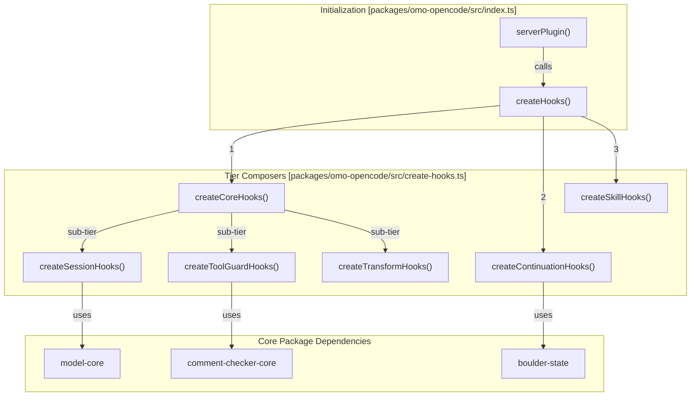
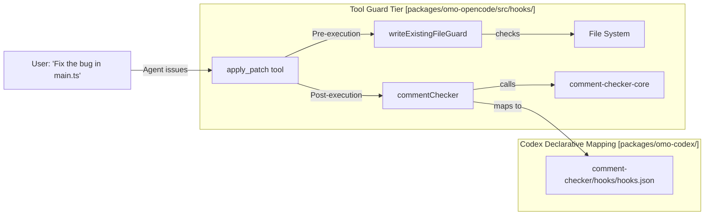
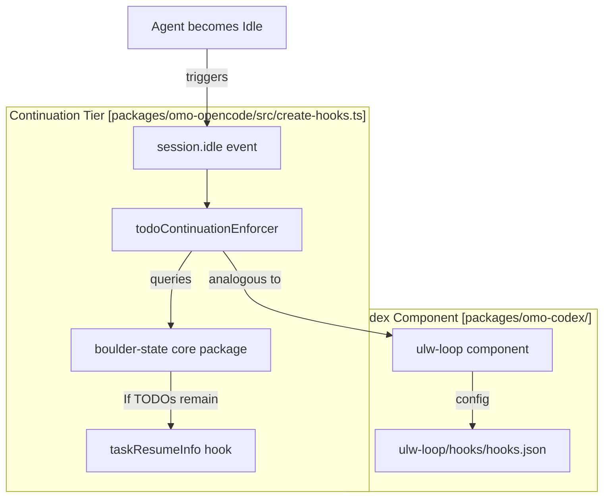

# Creating Custom Hooks

<details>
<summary>Relevant source files</summary>

The following files were used as context for generating this wiki page:

- [.omo/evidence/20260812-init-deep/hierarchy-green.txt](https://github.com/code-yeongyu/oh-my-openagent/blob/HEAD/.omo/evidence/20260812-init-deep/hierarchy-green.txt)
- [.omo/evidence/20260812-init-deep/hierarchy-red.txt](https://github.com/code-yeongyu/oh-my-openagent/blob/HEAD/.omo/evidence/20260812-init-deep/hierarchy-red.txt)
- [.omo/evidence/20260812-init-deep/manual-review.md](https://github.com/code-yeongyu/oh-my-openagent/blob/HEAD/.omo/evidence/20260812-init-deep/manual-review.md)
- [.omo/evidence/20260812-init-deep/qa-summary.md](https://github.com/code-yeongyu/oh-my-openagent/blob/HEAD/.omo/evidence/20260812-init-deep/qa-summary.md)
- [.omo/evidence/20260812-init-deep/scoring.md](https://github.com/code-yeongyu/oh-my-openagent/blob/HEAD/.omo/evidence/20260812-init-deep/scoring.md)
- [.omo/evidence/20260812-init-deep/validation-green.txt](https://github.com/code-yeongyu/oh-my-openagent/blob/HEAD/.omo/evidence/20260812-init-deep/validation-green.txt)
- [.omo/evidence/20260812-init-deep/validation-red.txt](https://github.com/code-yeongyu/oh-my-openagent/blob/HEAD/.omo/evidence/20260812-init-deep/validation-red.txt)
- [AGENTS.md](https://github.com/code-yeongyu/oh-my-openagent/blob/HEAD/AGENTS.md)
- [packages/AGENTS.md](https://github.com/code-yeongyu/oh-my-openagent/blob/HEAD/packages/AGENTS.md)
- [packages/ast-grep-mcp/AGENTS.md](https://github.com/code-yeongyu/oh-my-openagent/blob/HEAD/packages/ast-grep-mcp/AGENTS.md)
- [packages/memory-core/AGENTS.md](https://github.com/code-yeongyu/oh-my-openagent/blob/HEAD/packages/memory-core/AGENTS.md)
- [packages/omo-opencode/src/AGENTS.md](https://github.com/code-yeongyu/oh-my-openagent/blob/HEAD/packages/omo-opencode/src/AGENTS.md)
- [packages/omo-opencode/src/agents/AGENTS.md](https://github.com/code-yeongyu/oh-my-openagent/blob/HEAD/packages/omo-opencode/src/agents/AGENTS.md)
- [packages/omo-opencode/src/agents/prometheus/AGENTS.md](https://github.com/code-yeongyu/oh-my-openagent/blob/HEAD/packages/omo-opencode/src/agents/prometheus/AGENTS.md)
- [packages/omo-opencode/src/config-migration/AGENTS.md](https://github.com/code-yeongyu/oh-my-openagent/blob/HEAD/packages/omo-opencode/src/config-migration/AGENTS.md)
- [packages/omo-opencode/src/features/AGENTS.md](https://github.com/code-yeongyu/oh-my-openagent/blob/HEAD/packages/omo-opencode/src/features/AGENTS.md)
- [packages/omo-opencode/src/features/boulder-state/AGENTS.md](https://github.com/code-yeongyu/oh-my-openagent/blob/HEAD/packages/omo-opencode/src/features/boulder-state/AGENTS.md)
- [packages/omo-opencode/src/features/team-mode/AGENTS.md](https://github.com/code-yeongyu/oh-my-openagent/blob/HEAD/packages/omo-opencode/src/features/team-mode/AGENTS.md)
- [packages/omo-opencode/src/hooks/AGENTS.md](https://github.com/code-yeongyu/oh-my-openagent/blob/HEAD/packages/omo-opencode/src/hooks/AGENTS.md)
- [packages/omo-opencode/src/hooks/auto-update-checker/AGENTS.md](https://github.com/code-yeongyu/oh-my-openagent/blob/HEAD/packages/omo-opencode/src/hooks/auto-update-checker/AGENTS.md)
- [packages/omo-opencode/src/hooks/keyword-detector/AGENTS.md](https://github.com/code-yeongyu/oh-my-openagent/blob/HEAD/packages/omo-opencode/src/hooks/keyword-detector/AGENTS.md)

</details>


This page provides a technical guide for implementing custom hooks within the oh-my-openagent plugin ecosystem. It explains how hooks integrate into the agent lifecycle across different harnesses (OpenCode, Codex, Senpi), the factory pattern used for implementation, and the 5-tier composition model.

For reference on built-in hooks, consult [5.1 Core Hooks](26_5.1-core-hooks.md) and [5.2 Continuation Hooks](27_5.2-continuation-hooks.md).

---

## Hook System Architecture

The hook system serves as the primary extension point for intercepting and modulating the agent lifecycle. Hooks are implemented as factory functions that return handlers for lifecycle events such as `chat.message`, `tool.execute`, or `session.idle`.

The system is organized into a **5-tier composition model** to ensure logical grouping and execution order [packages/omo-opencode/src/AGENTS.md:69-106](https://github.com/code-yeongyu/oh-my-openagent/blob/HEAD/packages/omo-opencode/src/AGENTS.md#L69-L106):

1.  **Session Hooks:** 24 hooks managing lifecycle, notifications, model fallback, and context window recovery [packages/omo-opencode/src/hooks/AGENTS.md:26-54](https://github.com/code-yeongyu/oh-my-openagent/blob/HEAD/packages/omo-opencode/src/hooks/AGENTS.md#L26-L54).
2.  **Tool Guard Hooks:** 17+ hooks providing pre- and post-execution validation, such as the `commentChecker` and `writeExistingFileGuard` [packages/omo-opencode/src/hooks/AGENTS.md:55-76](https://github.com/code-yeongyu/oh-my-openagent/blob/HEAD/packages/omo-opencode/src/hooks/AGENTS.md#L55-L76).
3.  **Transform Hooks:** 4+ hooks for message stream manipulation, including `keywordDetector` and `contextInjectorMessagesTransform` [packages/omo-opencode/src/hooks/AGENTS.md:77-86](https://github.com/code-yeongyu/oh-my-openagent/blob/HEAD/packages/omo-opencode/src/hooks/AGENTS.md#L77-L86).
4.  **Continuation Hooks:** 7 hooks managing long-running tasks, including the `todoContinuationEnforcer` (Boulder) and `backgroundNotificationHook` [packages/omo-opencode/src/hooks/AGENTS.md:87-94](https://github.com/code-yeongyu/oh-my-openagent/blob/HEAD/packages/omo-opencode/src/hooks/AGENTS.md#L87-L94).
5.  **Skill Hooks:** 2 hooks for skill-aware enhancements like `autoSlashCommand` [packages/omo-opencode/src/hooks/AGENTS.md:95-98](https://github.com/code-yeongyu/oh-my-openagent/blob/HEAD/packages/omo-opencode/src/hooks/AGENTS.md#L95-L98).

### Hook Initialization Pipeline

During plugin startup, the `createHooks()` function orchestrates the assembly of all active hooks by calling tier-specific composers [packages/omo-opencode/src/AGENTS.md:74-98](https://github.com/code-yeongyu/oh-my-openagent/blob/HEAD/packages/omo-opencode/src/AGENTS.md#L74-L98).


**Sources:** [packages/omo-opencode/src/AGENTS.md:39-51](https://github.com/code-yeongyu/oh-my-openagent/blob/HEAD/packages/omo-opencode/src/AGENTS.md#L39-L51), [packages/omo-opencode/src/AGENTS.md:69-106](https://github.com/code-yeongyu/oh-my-openagent/blob/HEAD/packages/omo-opencode/src/AGENTS.md#L69-L106), [packages/omo-opencode/src/create-hooks.ts:36-36](https://github.com/code-yeongyu/oh-my-openagent/blob/HEAD/packages/omo-opencode/src/create-hooks.ts#L36)

---

## Multi-Harness Hook Implementation

While the OpenCode adapter uses a programmatic 5-tier composition, the **Codex (omo-codex)** adapter uses a declarative `hooks.json` structure for its components. This allows the Codex harness to trigger specific CLI commands at lifecycle points [packages/omo-codex/plugin/components/ulw-loop/hooks/hooks.json:1-52](https://github.com/code-yeongyu/oh-my-openagent/blob/HEAD/packages/omo-codex/plugin/components/ulw-loop/hooks/hooks.json#L1-L52).

### Codex Hook Declaration Example
In `omo-codex`, hooks are mapped to CLI actions in a component's `hooks.json`:
- **PreToolUse:** Used to guard spawns or enforce budgets [packages/omo-codex/plugin/components/ulw-loop/hooks/hooks.json:15-37](https://github.com/code-yeongyu/oh-my-openagent/blob/HEAD/packages/omo-codex/plugin/components/ulw-loop/hooks/hooks.json#L15-L37).
- **PostToolUse:** Used for checking comments or LSP diagnostics after a file edit [packages/omo-codex/plugin/components/comment-checker/hooks/hooks.json:3-17](https://github.com/code-yeongyu/oh-my-openagent/blob/HEAD/packages/omo-codex/plugin/components/comment-checker/hooks/hooks.json#L3-L17), [packages/omo-codex/plugin/components/lsp/hooks/hooks.json:3-15](https://github.com/code-yeongyu/oh-my-openagent/blob/HEAD/packages/omo-codex/plugin/components/lsp/hooks/hooks.json#L3-L15).
- **SessionStart:** Used for recording telemetry or loading rules [packages/omo-codex/plugin/components/telemetry/hooks/hooks.json:3-16](https://github.com/code-yeongyu/oh-my-openagent/blob/HEAD/packages/omo-codex/plugin/components/telemetry/hooks/hooks.json#L3-L16), [packages/omo-codex/plugin/components/rules/hooks/hooks.json:3-14](https://github.com/code-yeongyu/oh-my-openagent/blob/HEAD/packages/omo-codex/plugin/components/rules/hooks/hooks.json#L3-L14).

---

## How to Create a Custom Hook (OpenCode Adapter)

### Step 1: Implement the Factory
Create a factory function that accepts the `PluginContext`. This context provides access to managers like `TmuxSessionManager` and `BackgroundManager` [packages/omo-opencode/src/create-managers.ts:34-34](https://github.com/code-yeongyu/oh-my-openagent/blob/HEAD/packages/omo-opencode/src/create-managers.ts#L34).

```typescript
// Example Hook Factory
export function createMyCustomHook(ctx: PluginContext) {
  return {
    "chat.message": async (input: ChatMessageInput, output: ChatMessageHandlerOutput) => {
      // Logic to modify message or trigger side-effects
    },
    event: async (input: EventInput) => {
      // Handle session.idle or session.started
    }
  };
}
```
**Sources:** [packages/omo-opencode/src/plugin-interface.ts:33-33](https://github.com/code-yeongyu/oh-my-openagent/blob/HEAD/packages/omo-opencode/src/plugin-interface.ts#L33), [packages/omo-opencode/src/create-managers.ts:34-34](https://github.com/code-yeongyu/oh-my-openagent/blob/HEAD/packages/omo-opencode/src/create-managers.ts#L34)

### Step 2: Register in Tier Composition
Add the hook to the relevant tier in `packages/omo-opencode/src/create-hooks.ts`. Use `safeHook` to ensure the hook respects the `disabled_hooks` configuration [packages/omo-opencode/src/AGENTS.md:105-106](https://github.com/code-yeongyu/oh-my-openagent/blob/HEAD/packages/omo-opencode/src/AGENTS.md#L105-L106).

```typescript
// Inside createSessionHooks()
const myHook = isHookEnabled("my-hook-name")
  ? safeHook("my-hook-name", () => createMyCustomHook(args))
  : null;
```
**Sources:** [packages/omo-opencode/src/AGENTS.md:70-71](https://github.com/code-yeongyu/oh-my-openagent/blob/HEAD/packages/omo-opencode/src/AGENTS.md#L70-L71), [packages/omo-opencode/src/create-hooks.ts:36-36](https://github.com/code-yeongyu/oh-my-openagent/blob/HEAD/packages/omo-opencode/src/create-hooks.ts#L36)

---

## Bridging Concepts to Code

### Diagram: Natural Language to Code Entity Mapping (Tool Guard)
This diagram shows how a user's request to edit a file triggers specific code entities within the Hook system to ensure safety and correctness.


**Sources:** [packages/omo-opencode/src/AGENTS.md:85-91](https://github.com/code-yeongyu/oh-my-openagent/blob/HEAD/packages/omo-opencode/src/AGENTS.md#L85-L91), [packages/omo-codex/plugin/components/comment-checker/hooks/hooks.json:3-17](https://github.com/code-yeongyu/oh-my-openagent/blob/HEAD/packages/omo-codex/plugin/components/comment-checker/hooks/hooks.json#L3-L17), [packages/AGENTS.md:45-45](https://github.com/code-yeongyu/oh-my-openagent/blob/HEAD/packages/AGENTS.md#L45)

### Diagram: Continuation Lifecycle Mapping
Shows how the "Natural Language" concept of continuing work maps to the `boulder-state` core package and the `todoContinuationEnforcer` hook.


**Sources:** [packages/omo-opencode/src/AGENTS.md:95-97](https://github.com/code-yeongyu/oh-my-openagent/blob/HEAD/packages/omo-opencode/src/AGENTS.md#L95-L97), [packages/AGENTS.md:47-47](https://github.com/code-yeongyu/oh-my-openagent/blob/HEAD/packages/AGENTS.md#L47), [packages/omo-codex/plugin/components/ulw-loop/hooks/hooks.json:39-50](https://github.com/code-yeongyu/oh-my-openagent/blob/HEAD/packages/omo-codex/plugin/components/ulw-loop/hooks/hooks.json#L39-L50)

---

## Mandatory QA for Hook Development
Every change to a hook **must** be verified using the harness-specific QA skills. "It typechecks" is not sufficient [AGENTS.md:7-14](https://github.com/code-yeongyu/oh-my-openagent/blob/HEAD/AGENTS.md#L7-L14).

- **OpenCode Hooks:** Run the `opencode-qa` skill and prove the hook fired using `scripts/sse-hook-probe.sh --event <name>` [AGENTS.md:15-21](https://github.com/code-yeongyu/oh-my-openagent/blob/HEAD/AGENTS.md#L15-L21).
- **Codex Hooks:** Run the `codex-qa` skill and verify the `hook/started` / `hook/completed` notifications via `scripts/app-server-drive.sh --plugin` [AGENTS.md:22-28](https://github.com/code-yeongyu/oh-my-openagent/blob/HEAD/AGENTS.md#L22-L28).
- **Evidence:** Record all outputs in `.omo/evidence/<YYYYMMDD>-<slug>/`. No evidence means the QA did not happen [AGENTS.md:29-37](https://github.com/code-yeongyu/oh-my-openagent/blob/HEAD/AGENTS.md#L29-L37).

**Sources:** [AGENTS.md:7-37](https://github.com/code-yeongyu/oh-my-openagent/blob/HEAD/AGENTS.md#L7-L37), [packages/omo-opencode/src/AGENTS.md:5-21](https://github.com/code-yeongyu/oh-my-openagent/blob/HEAD/packages/omo-opencode/src/AGENTS.md#L5-L21)