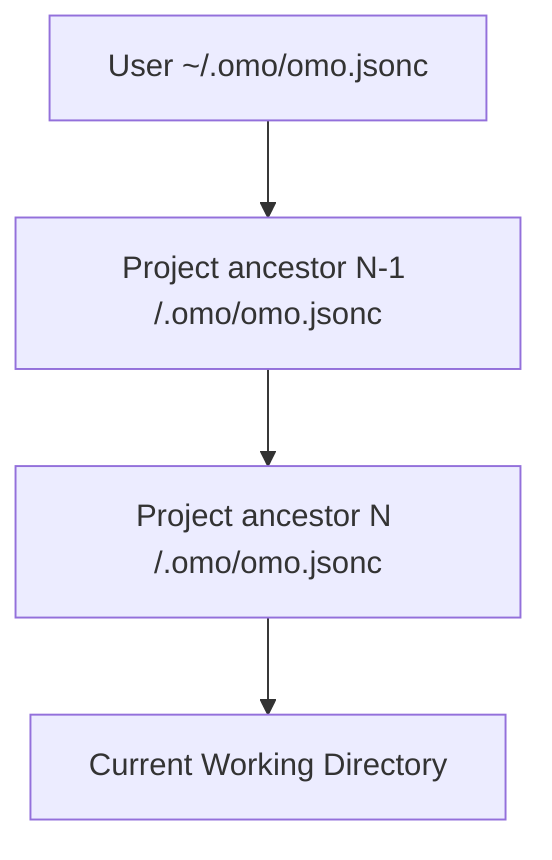
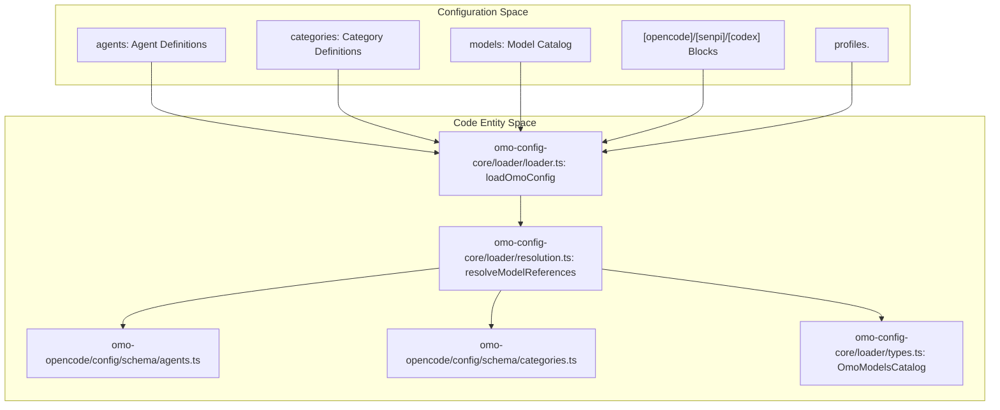

# Configuration Reference

Relevant source files

The following files were used as context for generating this wiki page:

- [.agents/AGENTS.md](https://github.com/code-yeongyu/oh-my-openagent/blob/HEAD/.agents/AGENTS.md)
- [.agents/skills/work-with-pr-workspace/iteration-1/eval-5/with_skill/outputs/execution-plan.md](https://github.com/code-yeongyu/oh-my-openagent/blob/HEAD/.agents/skills/work-with-pr-workspace/iteration-1/eval-5/with_skill/outputs/execution-plan.md)
- [.omo/evidence/20260730-senpi-task-padding/green-prompt.txt](https://github.com/code-yeongyu/oh-my-openagent/blob/HEAD/.omo/evidence/20260730-senpi-task-padding/green-prompt.txt)
- [.omo/evidence/20260730-senpi-task-padding/red-prompt.txt](https://github.com/code-yeongyu/oh-my-openagent/blob/HEAD/.omo/evidence/20260730-senpi-task-padding/red-prompt.txt)
- [.omo/evidence/20260809-omo-agent-toolkit-rename/task-5.txt](https://github.com/code-yeongyu/oh-my-openagent/blob/HEAD/.omo/evidence/20260809-omo-agent-toolkit-rename/task-5.txt)
- [.opencode/AGENTS.md](https://github.com/code-yeongyu/oh-my-openagent/blob/HEAD/.opencode/AGENTS.md)
- [.opencode/skills/work-with-pr-workspace/iteration-1/eval-5/with_skill/outputs/execution-plan.md](https://github.com/code-yeongyu/oh-my-openagent/blob/HEAD/.opencode/skills/work-with-pr-workspace/iteration-1/eval-5/with_skill/outputs/execution-plan.md)
- [CHANGELOG.md](https://github.com/code-yeongyu/oh-my-openagent/blob/HEAD/CHANGELOG.md)
- [README.ja.md](https://github.com/code-yeongyu/oh-my-openagent/blob/HEAD/README.ja.md)
- [README.ko.md](https://github.com/code-yeongyu/oh-my-openagent/blob/HEAD/README.ko.md)
- [README.md](https://github.com/code-yeongyu/oh-my-openagent/blob/HEAD/README.md)
- [README.ru.md](https://github.com/code-yeongyu/oh-my-openagent/blob/HEAD/README.ru.md)
- [README.zh-cn.md](https://github.com/code-yeongyu/oh-my-openagent/blob/HEAD/README.zh-cn.md)
- [assets/oh-my-opencode.schema.json](https://github.com/code-yeongyu/oh-my-openagent/blob/HEAD/assets/oh-my-opencode.schema.json)
- [assets/omo.schema.json](https://github.com/code-yeongyu/oh-my-openagent/blob/HEAD/assets/omo.schema.json)
- [docs/AGENTS.md](https://github.com/code-yeongyu/oh-my-openagent/blob/HEAD/docs/AGENTS.md)
- [docs/examples/coding-focused.jsonc](https://github.com/code-yeongyu/oh-my-openagent/blob/HEAD/docs/examples/coding-focused.jsonc)
- [docs/examples/default.jsonc](https://github.com/code-yeongyu/oh-my-openagent/blob/HEAD/docs/examples/default.jsonc)
- [docs/examples/planning-focused.jsonc](https://github.com/code-yeongyu/oh-my-openagent/blob/HEAD/docs/examples/planning-focused.jsonc)
- [docs/guide/agent-model-matching.md](https://github.com/code-yeongyu/oh-my-openagent/blob/HEAD/docs/guide/agent-model-matching.md)
- [docs/guide/installation.md](https://github.com/code-yeongyu/oh-my-openagent/blob/HEAD/docs/guide/installation.md)
- [docs/guide/orchestration.md](https://github.com/code-yeongyu/oh-my-openagent/blob/HEAD/docs/guide/orchestration.md)
- [docs/guide/overview.md](https://github.com/code-yeongyu/oh-my-openagent/blob/HEAD/docs/guide/overview.md)
- [docs/guide/senpi-task.md](https://github.com/code-yeongyu/oh-my-openagent/blob/HEAD/docs/guide/senpi-task.md)
- [docs/guide/team-mode.md](https://github.com/code-yeongyu/oh-my-openagent/blob/HEAD/docs/guide/team-mode.md)
- [docs/reference/cli.md](https://github.com/code-yeongyu/oh-my-openagent/blob/HEAD/docs/reference/cli.md)
- [docs/reference/codex-telemetry.md](https://github.com/code-yeongyu/oh-my-openagent/blob/HEAD/docs/reference/codex-telemetry.md)
- [docs/reference/configuration.md](https://github.com/code-yeongyu/oh-my-openagent/blob/HEAD/docs/reference/configuration.md)
- [docs/reference/features.md](https://github.com/code-yeongyu/oh-my-openagent/blob/HEAD/docs/reference/features.md)
- [docs/reference/known-issues.md](https://github.com/code-yeongyu/oh-my-openagent/blob/HEAD/docs/reference/known-issues.md)
- [docs/reference/omo-json.md](https://github.com/code-yeongyu/oh-my-openagent/blob/HEAD/docs/reference/omo-json.md)
- [docs/reference/prompt-async-gate-rfc.md](https://github.com/code-yeongyu/oh-my-openagent/blob/HEAD/docs/reference/prompt-async-gate-rfc.md)
- [docs/reference/rules-injection-cross-module-comparison.md](https://github.com/code-yeongyu/oh-my-openagent/blob/HEAD/docs/reference/rules-injection-cross-module-comparison.md)
- [packages/model-core/AGENTS.md](https://github.com/code-yeongyu/oh-my-openagent/blob/HEAD/packages/model-core/AGENTS.md)
- [packages/omo-codex/README.md](https://github.com/code-yeongyu/oh-my-openagent/blob/HEAD/packages/omo-codex/README.md)
- [packages/omo-codex/plugin/README.md](https://github.com/code-yeongyu/oh-my-openagent/blob/HEAD/packages/omo-codex/plugin/README.md)
- [packages/omo-codex/plugin/components/start-work-continuation/AGENTS.md](https://github.com/code-yeongyu/oh-my-openagent/blob/HEAD/packages/omo-codex/plugin/components/start-work-continuation/AGENTS.md)
- [packages/omo-codex/tsconfig.json](https://github.com/code-yeongyu/oh-my-openagent/blob/HEAD/packages/omo-codex/tsconfig.json)
- [packages/omo-config-core/AGENTS.md](https://github.com/code-yeongyu/oh-my-openagent/blob/HEAD/packages/omo-config-core/AGENTS.md)
- [packages/omo-config-core/src/index.ts](https://github.com/code-yeongyu/oh-my-openagent/blob/HEAD/packages/omo-config-core/src/index.ts)
- [packages/omo-config-core/src/internal/index.ts](https://github.com/code-yeongyu/oh-my-openagent/blob/HEAD/packages/omo-config-core/src/internal/index.ts)
- [packages/omo-config-core/src/internal/jsonc-parse.ts](https://github.com/code-yeongyu/oh-my-openagent/blob/HEAD/packages/omo-config-core/src/internal/jsonc-parse.ts)
- [packages/omo-config-core/src/internal/plain-object.ts](https://github.com/code-yeongyu/oh-my-openagent/blob/HEAD/packages/omo-config-core/src/internal/plain-object.ts)
- [packages/omo-config-core/src/internal/posix-path.ts](https://github.com/code-yeongyu/oh-my-openagent/blob/HEAD/packages/omo-config-core/src/internal/posix-path.ts)
- [packages/omo-config-core/src/loader/legacy-user-config-purge.test.ts](https://github.com/code-yeongyu/oh-my-openagent/blob/HEAD/packages/omo-config-core/src/loader/legacy-user-config-purge.test.ts)
- [packages/omo-config-core/src/loader/loader.test.ts](https://github.com/code-yeongyu/oh-my-openagent/blob/HEAD/packages/omo-config-core/src/loader/loader.test.ts)
- [packages/omo-config-core/src/loader/paths.test.ts](https://github.com/code-yeongyu/oh-my-openagent/blob/HEAD/packages/omo-config-core/src/loader/paths.test.ts)
- [packages/omo-config-core/src/loader/paths.ts](https://github.com/code-yeongyu/oh-my-openagent/blob/HEAD/packages/omo-config-core/src/loader/paths.ts)
- [packages/omo-config-core/src/loader/project-config-path-discovery.test.ts](https://github.com/code-yeongyu/oh-my-openagent/blob/HEAD/packages/omo-config-core/src/loader/project-config-path-discovery.test.ts)
- [packages/omo-config-core/src/loader/resolution.test.ts](https://github.com/code-yeongyu/oh-my-openagent/blob/HEAD/packages/omo-config-core/src/loader/resolution.test.ts)
- [packages/omo-config-core/src/loader/types.ts](https://github.com/code-yeongyu/oh-my-openagent/blob/HEAD/packages/omo-config-core/src/loader/types.ts)
- [packages/omo-config-core/src/migration/backup-move.ts](https://github.com/code-yeongyu/oh-my-openagent/blob/HEAD/packages/omo-config-core/src/migration/backup-move.ts)
- [packages/omo-config-core/src/migration/batch.test.ts](https://github.com/code-yeongyu/oh-my-openagent/blob/HEAD/packages/omo-config-core/src/migration/batch.test.ts)
- [packages/omo-config-core/src/migration/batch.ts](https://github.com/code-yeongyu/oh-my-openagent/blob/HEAD/packages/omo-config-core/src/migration/batch.ts)
- [packages/omo-config-core/src/migration/commit.ts](https://github.com/code-yeongyu/oh-my-openagent/blob/HEAD/packages/omo-config-core/src/migration/commit.ts)
- [packages/omo-config-core/src/migration/engine.ts](https://github.com/code-yeongyu/oh-my-openagent/blob/HEAD/packages/omo-config-core/src/migration/engine.ts)
- [packages/omo-config-core/src/migration/journal.ts](https://github.com/code-yeongyu/oh-my-openagent/blob/HEAD/packages/omo-config-core/src/migration/journal.ts)
- [packages/omo-config-core/src/migration/lock.test.ts](https://github.com/code-yeongyu/oh-my-openagent/blob/HEAD/packages/omo-config-core/src/migration/lock.test.ts)
- [packages/omo-config-core/src/migration/lock.ts](https://github.com/code-yeongyu/oh-my-openagent/blob/HEAD/packages/omo-config-core/src/migration/lock.ts)
- [packages/omo-config-core/src/migration/merge-commit.test.ts](https://github.com/code-yeongyu/oh-my-openagent/blob/HEAD/packages/omo-config-core/src/migration/merge-commit.test.ts)
- [packages/omo-config-core/src/migration/merge.ts](https://github.com/code-yeongyu/oh-my-openagent/blob/HEAD/packages/omo-config-core/src/migration/merge.ts)
- [packages/omo-config-core/src/migration/migration-test-support.ts](https://github.com/code-yeongyu/oh-my-openagent/blob/HEAD/packages/omo-config-core/src/migration/migration-test-support.ts)
- [packages/omo-config-core/src/migration/predicate.test.ts](https://github.com/code-yeongyu/oh-my-openagent/blob/HEAD/packages/omo-config-core/src/migration/predicate.test.ts)
- [packages/omo-config-core/src/migration/predicate.ts](https://github.com/code-yeongyu/oh-my-openagent/blob/HEAD/packages/omo-config-core/src/migration/predicate.ts)
- [packages/omo-config-core/src/migration/recovery.test.ts](https://github.com/code-yeongyu/oh-my-openagent/blob/HEAD/packages/omo-config-core/src/migration/recovery.test.ts)
- [packages/omo-config-core/src/migration/recovery.ts](https://github.com/code-yeongyu/oh-my-openagent/blob/HEAD/packages/omo-config-core/src/migration/recovery.ts)
- [packages/omo-config-core/src/migration/transaction.test.ts](https://github.com/code-yeongyu/oh-my-openagent/blob/HEAD/packages/omo-config-core/src/migration/transaction.test.ts)
- [packages/omo-config-core/src/migration/types.ts](https://github.com/code-yeongyu/oh-my-openagent/blob/HEAD/packages/omo-config-core/src/migration/types.ts)
- [packages/omo-config-core/src/models/index.ts](https://github.com/code-yeongyu/oh-my-openagent/blob/HEAD/packages/omo-config-core/src/models/index.ts)
- [packages/omo-config-core/src/models/model-catalog-cycles.ts](https://github.com/code-yeongyu/oh-my-openagent/blob/HEAD/packages/omo-config-core/src/models/model-catalog-cycles.ts)
- [packages/omo-config-core/src/models/model-reference-resolution.test.ts](https://github.com/code-yeongyu/oh-my-openagent/blob/HEAD/packages/omo-config-core/src/models/model-reference-resolution.test.ts)
- [packages/omo-config-core/src/models/model-reference-resolution.ts](https://github.com/code-yeongyu/oh-my-openagent/blob/HEAD/packages/omo-config-core/src/models/model-reference-resolution.ts)
- [packages/omo-config-core/src/writer/types.ts](https://github.com/code-yeongyu/oh-my-openagent/blob/HEAD/packages/omo-config-core/src/writer/types.ts)
- [packages/omo-config-core/src/writer/writer-security.test.ts](https://github.com/code-yeongyu/oh-my-openagent/blob/HEAD/packages/omo-config-core/src/writer/writer-security.test.ts)
- [packages/omo-config-core/src/writer/writer.test.ts](https://github.com/code-yeongyu/oh-my-openagent/blob/HEAD/packages/omo-config-core/src/writer/writer.test.ts)
- [packages/omo-config-core/src/writer/writer.ts](https://github.com/code-yeongyu/oh-my-openagent/blob/HEAD/packages/omo-config-core/src/writer/writer.ts)
- [packages/omo-opencode/src/agents/hephaestus/AGENTS.md](https://github.com/code-yeongyu/oh-my-openagent/blob/HEAD/packages/omo-opencode/src/agents/hephaestus/AGENTS.md)
- [packages/omo-opencode/src/cli/doctor/AGENTS.md](https://github.com/code-yeongyu/oh-my-openagent/blob/HEAD/packages/omo-opencode/src/cli/doctor/AGENTS.md)
- [packages/omo-opencode/src/config/schema/categories.ts](https://github.com/code-yeongyu/oh-my-openagent/blob/HEAD/packages/omo-opencode/src/config/schema/categories.ts)
- [packages/omo-opencode/src/shared/markdown-link-audit.test.ts](https://github.com/code-yeongyu/oh-my-openagent/blob/HEAD/packages/omo-opencode/src/shared/markdown-link-audit.test.ts)
- [packages/omo-opencode/src/startup-migration.test.ts](https://github.com/code-yeongyu/oh-my-openagent/blob/HEAD/packages/omo-opencode/src/startup-migration.test.ts)
- [packages/omo-senpi/AGENTS.md](https://github.com/code-yeongyu/oh-my-openagent/blob/HEAD/packages/omo-senpi/AGENTS.md)
- [packages/omo-senpi/src/components/task/usage-guidance.test.ts](https://github.com/code-yeongyu/oh-my-openagent/blob/HEAD/packages/omo-senpi/src/components/task/usage-guidance.test.ts)
- [packages/omo-senpi/src/components/task/usage-guidance.ts](https://github.com/code-yeongyu/oh-my-openagent/blob/HEAD/packages/omo-senpi/src/components/task/usage-guidance.ts)
- [packages/senpi-task/AGENTS.md](https://github.com/code-yeongyu/oh-my-openagent/blob/HEAD/packages/senpi-task/AGENTS.md)
- [packages/shared-skills/AGENTS.md](https://github.com/code-yeongyu/oh-my-openagent/blob/HEAD/packages/shared-skills/AGENTS.md)
- [packages/shared-skills/skills/ultimate-browsing/engine/AGENTS.md](https://github.com/code-yeongyu/oh-my-openagent/blob/HEAD/packages/shared-skills/skills/ultimate-browsing/engine/AGENTS.md)
- [postinstall.test.ts](https://github.com/code-yeongyu/oh-my-openagent/blob/HEAD/postinstall.test.ts)
- [script/AGENTS.md](https://github.com/code-yeongyu/oh-my-openagent/blob/HEAD/script/AGENTS.md)

This page offers a comprehensive overview of the unified configuration system used by `oh-my-openagent` and its OpenCode plugin implementation. The system is centered around the single `omo.jsonc` (or `omo.json`) configuration file, which supports layered overrides, JSONC format with comments, strict schema validation with Zod, and harness-specific blocks.

The configuration is environment-aware, supporting both user-global settings (in `~/.omo/omo.jsonc`) and multiple project-local overrides (`.omo/omo.jsonc`), merged from the closest ancestor directory up to the home directory. Specialized harness blocks like `[opencode]`, `[senpi]`, and `[codex]` allow for adapter-specific overrides and schema validation. Profiles support contextual named variations, activated by environment variables or directory paths.

This parent page links to detailed child pages for each configuration aspect.

---

## Configuration File Locations and Resolution

The configuration loader gathers config layers in a deterministic search order and merges them (lowest to highest precedence):

- **User layer (lowest priority):** `~/.omo/omo.jsonc` on every platform (`omo.json` is accepted as a fallback basename). [docs/reference/configuration.md:49-49](https://github.com/code-yeongyu/oh-my-openagent/blob/HEAD/docs/reference/configuration.md#L49)
- **Project layers:** `.omo/omo.jsonc` (then `.omo/omo.json`) in every directory from the working directory up to `$HOME`. Farther ancestors merge first, so the nearest project file wins and beats the user layer. `$HOME` itself is skipped by the walk because `~/.omo` is already the user layer. If the working directory is outside `$HOME`, the walk continues to the filesystem root. [docs/reference/configuration.md:50-51](https://github.com/code-yeongyu/oh-my-openagent/blob/HEAD/docs/reference/configuration.md#L50-L51)
- **Symlinks skipped:** Symlinked `.omo` directories or config files are ignored as a safety measure to avoid ambiguous config state [packages/omo-config-core/src/loader/paths.ts:20-113](https://github.com/code-yeongyu/oh-my-openagent/blob/HEAD/packages/omo-config-core/src/loader/paths.ts#L20-L113).
- **Legacy migration:** Legacy files like `oh-my-openagent.json[c]` and `oh-my-opencode.json[c]` are no longer read at runtime but are imported once by the migration engine [docs/reference/configuration.md:3-3](https://github.com/code-yeongyu/oh-my-openagent/blob/HEAD/docs/reference/configuration.md#L3).

The effective merged configuration is the deep merge of these layers. Within the merged document, each harness resolves its own view using a 4-layer resolution order [docs/reference/configuration.md:52-60](https://github.com/code-yeongyu/oh-my-openagent/blob/HEAD/docs/reference/configuration.md#L52-L60).

Sources:  
- [packages/omo-config-core/src/loader/paths.ts:20-113](https://github.com/code-yeongyu/oh-my-openagent/blob/HEAD/packages/omo-config-core/src/loader/paths.ts#L20-L113)  
- [docs/reference/configuration.md:43-61](https://github.com/code-yeongyu/oh-my-openagent/blob/HEAD/docs/reference/configuration.md#L43-L61)  
- [packages/omo-config-core/src/loader/loader.test.ts:28-89](https://github.com/code-yeongyu/oh-my-openagent/blob/HEAD/packages/omo-config-core/src/loader/loader.test.ts#L28-L89)

---

## JSONC Format and Schema Validation

### JSONC Support
`omo.jsonc` files support JSON with comments (single-line `//` and block comments), and trailing commas [docs/reference/configuration.md:82-82](https://github.com/code-yeongyu/oh-my-openagent/blob/HEAD/docs/reference/configuration.md#L82).

### Schema Validation
A strict Zod schema validates the merged config at runtime. The root schema includes keys for `agents`, `categories`, `models`, `task`, `teams`, and harness-specific blocks [assets/omo.schema.json:1-120](https://github.com/code-yeongyu/oh-my-openagent/blob/HEAD/assets/omo.schema.json#L1-L120).

The JSON schema artifact is generated and shipped at `assets/omo.schema.json` for IDE integration [assets/omo.schema.json:1-120](https://github.com/code-yeongyu/oh-my-openagent/blob/HEAD/assets/omo.schema.json#L1-L120). Users can enable autocomplete by adding the `$schema` key [docs/reference/configuration.md:84-90](https://github.com/code-yeongyu/oh-my-openagent/blob/HEAD/docs/reference/configuration.md#L84-L90).

Sources:  
- [docs/reference/configuration.md:82-90](https://github.com/code-yeongyu/oh-my-openagent/blob/HEAD/docs/reference/configuration.md#L82-L90)  
- [assets/omo.schema.json:1-120](https://github.com/code-yeongyu/oh-my-openagent/blob/HEAD/assets/omo.schema.json#L1-L120)  

---

## Harness Blocks and Profiles

### Harness Blocks
The root configuration supports bracketed blocks keyed by harness name:
- `[opencode]` — Settings for the OpenCode plugin, including background tasks, hooks, and skills [docs/reference/configuration.md:108-114](https://github.com/code-yeongyu/oh-my-openagent/blob/HEAD/docs/reference/configuration.md#L108-L114).
- `[senpi]` — Overrides for the Senpi native adapter [docs/reference/configuration.md:57-57](https://github.com/code-yeongyu/oh-my-openagent/blob/HEAD/docs/reference/configuration.md#L57).
- `[codex]` — Overrides for the Codex CLI adapter [docs/reference/configuration.md:57-57](https://github.com/code-yeongyu/oh-my-openagent/blob/HEAD/docs/reference/configuration.md#L57).

### Profiles
Profiles are named overlays under the `profiles` key. Activation priority is determined by [docs/reference/configuration.md:65-72](https://github.com/code-yeongyu/oh-my-openagent/blob/HEAD/docs/reference/configuration.md#L65-L72):
1. `OMO_PROFILE` environment variable.
2. `OCX_PROFILE` variable.
3. An `OPENCODE_CONFIG_DIR` whose path ends in `profiles/<name>`.

For details, see [Harness Blocks and Profiles](35_6.5-harness-blocks-and-profiles.md).

Sources:  
- [docs/reference/configuration.md:52-72](https://github.com/code-yeongyu/oh-my-openagent/blob/HEAD/docs/reference/configuration.md#L52-L72)  

---

## Shared Models Catalog and Resolution

The `models` key defines a catalog mapping short names to the canonical shape `{ model, reasoning? }`. Deprecated `variant` and `reasoningEffort` inputs are accepted for compatibility and normalized to `reasoning`. When an agent or category `model` string matches a catalog key, it resolves to the entry's model ID and fills any unset `reasoning` from the entry; tuning written at the use site always wins. `[harness]` blocks can override individual catalog entries for one harness. [docs/reference/configuration.md:74-77](https://github.com/code-yeongyu/oh-my-openagent/blob/HEAD/docs/reference/configuration.md#L74-L77)

### Diagram: Config Resolution to Runtime Entities

Sources:  
- [docs/reference/configuration.md:74-77](https://github.com/code-yeongyu/oh-my-openagent/blob/HEAD/docs/reference/configuration.md#L74-L77)  
- [packages/omo-config-core/src/loader/loader.ts](https://github.com/code-yeongyu/oh-my-openagent/blob/HEAD/packages/omo-config-core/src/loader/loader.ts)  
- [packages/omo-config-core/src/loader/resolution.ts](https://github.com/code-yeongyu/oh-my-openagent/blob/HEAD/packages/omo-config-core/src/loader/resolution.ts)
- [packages/omo-opencode/src/config/schema/agents.ts](https://github.com/code-yeongyu/oh-my-openagent/blob/HEAD/packages/omo-opencode/src/config/schema/agents.ts)
- [packages/omo-opencode/src/config/schema/categories.ts](https://github.com/code-yeongyu/oh-my-openagent/blob/HEAD/packages/omo-opencode/src/config/schema/categories.ts)
- [packages/omo-config-core/src/loader/types.ts](https://github.com/code-yeongyu/oh-my-openagent/blob/HEAD/packages/omo-config-core/src/loader/types.ts)

---

## Lock+Journal Migration Engine for Legacy Files

The first time a current harness starts (and again on install or via the CLI), a lock-and-journal migration engine imports the legacy files into the unified file. [docs/reference/configuration.md:94-96](https://github.com/code-yeongyu/oh-my-openagent/blob/HEAD/docs/reference/configuration.md#L94-L96)
- **Sources:** `oh-my-openagent.json[c]` / `oh-my-opencode.json[c]` in the OpenCode user config directory, in each of its `profiles/<name>/` directories, and in walked project `.opencode/` directories, plus `~/.omo/config.jsonc`. [docs/reference/configuration.md:97-99](https://github.com/code-yeongyu/oh-my-openagent/blob/HEAD/docs/reference/configuration.md#L97-L99)
- **Targets:** The legacy user file imports into `~/.omo/omo.jsonc` under `[opencode]`; each legacy profile becomes `profiles.<name>."[opencode]"` holding only the keys that differ from the user file; a project file imports into that project's `.omo/omo.jsonc`. `~/.omo/config.jsonc` imports its shared `codegraph` settings plus its `[opencode]` / `[codex]` blocks, and a legacy `[omo]` block maps to `[senpi]`. [docs/reference/configuration.md:99-100](https://github.com/code-yeongyu/oh-my-openagent/blob/HEAD/docs/reference/configuration.md#L99-L100)
- **Conflict policy:** No-clobber. A value already present in the target wins, and every skipped legacy value is reported as a diagnostic instead of overwriting. Prior legacy migration history is preserved under the target's `legacy_migrations` key. [docs/reference/configuration.md:100-100](https://github.com/code-yeongyu/oh-my-openagent/blob/HEAD/docs/reference/configuration.md#L100)
- **Markers:** Each applied migration records its ID in the target's `_migrations` array, so re-runs are no-ops. `2026-07-opencode-config-unification` covers the `oh-my-*` files; `2026-07-codex-config-jsonc` covers `~/.omo/config.jsonc`; `2026-08-reasoning-unification` rewrites persisted model and reasoning fields. [docs/reference/configuration.md:101-103](https://github.com/code-yeongyu/oh-my-openagent/blob/HEAD/docs/reference/configuration.md#L101-L103)
- **Backups:** Sources move to `~/.omo/migration-backup-<UTC timestamp>-opencode-config/` (project sources to `<project>/.omo/migration-backup-<UTC timestamp>/`). An interrupted run resumes from its journal on the next start. [docs/reference/configuration.md:104-104](https://github.com/code-yeongyu/oh-my-openagent/blob/HEAD/docs/reference/configuration.md#L104)
- **Manual run:** `oh-my-openagent config migrate`. `--dry-run` prints the transform, backup move plan, and conflicts without writing; `--json` prints machine-readable output. [docs/reference/configuration.md:105-105](https://github.com/code-yeongyu/oh-my-openagent/blob/HEAD/docs/reference/configuration.md#L105)

For details, see [Harness Blocks and Profiles](35_6.5-harness-blocks-and-profiles.md).

Sources:  
- [docs/reference/configuration.md:94-105](https://github.com/code-yeongyu/oh-my-openagent/blob/HEAD/docs/reference/configuration.md#L94-L105)  
- [packages/omo-config-core/src/migration/commit.ts:20-90](https://github.com/code-yeongyu/oh-my-openagent/blob/HEAD/packages/omo-config-core/src/migration/commit.ts#L20-L90)  
- [packages/omo-config-core/src/migration/batch.ts](https://github.com/code-yeongyu/oh-my-openagent/blob/HEAD/packages/omo-config-core/src/migration/batch.ts)
- [packages/omo-config-core/src/migration/journal.ts](https://github.com/code-yeongyu/oh-my-openagent/blob/HEAD/packages/omo-config-core/src/migration/journal.ts)
- [packages/omo-config-core/src/migration/lock.ts](https://github.com/code-yeongyu/oh-my-openagent/blob/HEAD/packages/omo-config-core/src/migration/lock.ts)
- [packages/omo-opencode/src/startup-migration.test.ts](https://github.com/code-yeongyu/oh-my-openagent/blob/HEAD/packages/omo-opencode/src/startup-migration.test.ts)

---

## Related Child Pages

- [Agent Configuration](31_6.1-agent-configuration.md) — Document agent override syntax, model/variant/temperature/permissions configuration, agent modes, and the new unified reasoning field with :level suffix.
- [Category Configuration](32_6.2-category-configuration.md) — Explain user-defined categories, model/variant/reasoningEffort configuration, and category inheritance.
- [Disabling Features](33_6.3-disabling-features.md) — Cover disabled_hooks, disabled_skills, disabled_mcps, disabled_commands, disabled_tools, and disabled_providers arrays.
- [MCP Configuration](34_6.4-mcp-configuration.md) — Document the 3-tier MCP system (built-in, Claude Code, skill-embedded), MCP configuration options, and OAuth authentication for MCP servers.
- [Harness Blocks and Profiles](35_6.5-harness-blocks-and-profiles.md) — Document the new omo.jsonc harness-specific blocks ([opencode], [senpi], [codex]), the profiles system activated by OMO_PROFILE/OCX_PROFILE/OPENCODE_CONFIG_DIR, the shared models catalog, and the 4-layer resolution order. Also covers the lock+journal migration engine for importing legacy oh-my-openagent.json[c] / oh-my-opencode.json[c] files.
- [Experimental Features](36_6.6-experimental-features.md) — Cover experimental config flags like plugin_load_timeout_ms, enableParentSessionNotifications, default_mode (auto-activates ultrawork), and keyword-detector.enabled_expansions.
- [OpenClaw Integration](37_6.7-openclaw-integration.md) — Document the OpenClaw webhook/notification gateway system for external integrations (Discord, Telegram, HTTP webhooks, shell commands), configuration schema, event hooks, and reply listener setup.

---

**Sources:**
- [docs/reference/configuration.md:1-140](https://github.com/code-yeongyu/oh-my-openagent/blob/HEAD/docs/reference/configuration.md#L1-L140)
- [packages/omo-config-core/src/loader/paths.ts:20-113](https://github.com/code-yeongyu/oh-my-openagent/blob/HEAD/packages/omo-config-core/src/loader/paths.ts#L20-L113)
- [assets/omo.schema.json:1-180](https://github.com/code-yeongyu/oh-my-openagent/blob/HEAD/assets/omo.schema.json#L1-L180)
- [packages/omo-config-core/src/migration/commit.ts:10-90](https://github.com/code-yeongyu/oh-my-openagent/blob/HEAD/packages/omo-config-core/src/migration/commit.ts#L10-L90)
- [packages/omo-config-core/src/migration/batch.ts](https://github.com/code-yeongyu/oh-my-openagent/blob/HEAD/packages/omo-config-core/src/migration/batch.ts)
- [packages/omo-config-core/src/migration/journal.ts](https://github.com/code-yeongyu/oh-my-openagent/blob/HEAD/packages/omo-config-core/src/migration/journal.ts)
- [packages/omo-config-core/src/migration/lock.ts](https://github.com/code-yeongyu/oh-my-openagent/blob/HEAD/packages/omo-config-core/src/migration/lock.ts)
- [packages/omo-opencode/src/startup-migration.test.ts](https://github.com/code-yeongyu/oh-my-openagent/blob/HEAD/packages/omo-opencode/src/startup-migration.test.ts)35:T4892,# Agent Con