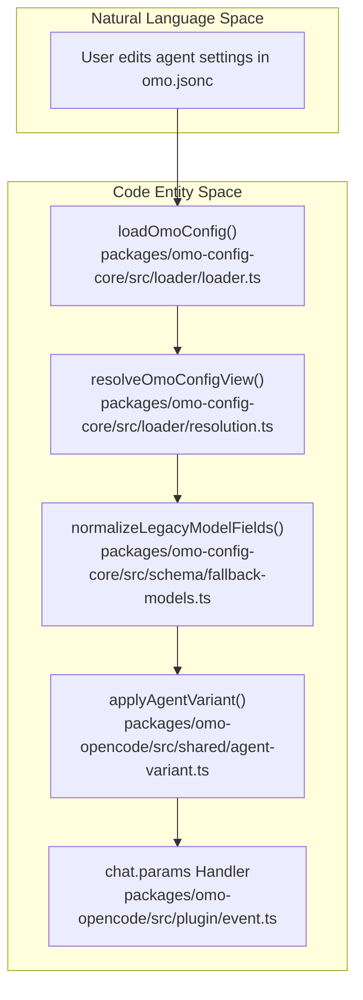
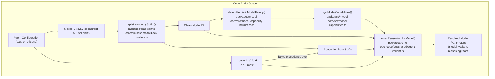

# Agent Configuration

<details>
<summary>Relevant source files</summary>

The following files were used as context for generating this wiki page:

- [.omo/evidence/20260810-omo-native-telemetry/task-4.md](https://github.com/code-yeongyu/oh-my-openagent/blob/HEAD/.omo/evidence/20260810-omo-native-telemetry/task-4.md)
- [.omo/evidence/task-17-subagent-session-resume-revival.txt](https://github.com/code-yeongyu/oh-my-openagent/blob/HEAD/.omo/evidence/task-17-subagent-session-resume-revival.txt)
- [.omo/evidence/task-3-senpi-model-chain-overhaul.txt](https://github.com/code-yeongyu/oh-my-openagent/blob/HEAD/.omo/evidence/task-3-senpi-model-chain-overhaul.txt)
- [packages/model-core/src/agent-model-requirements.ts](https://github.com/code-yeongyu/oh-my-openagent/blob/HEAD/packages/model-core/src/agent-model-requirements.ts)
- [packages/model-core/src/category-model-requirements.ts](https://github.com/code-yeongyu/oh-my-openagent/blob/HEAD/packages/model-core/src/category-model-requirements.ts)
- [packages/model-core/src/category-routing-policy.test.ts](https://github.com/code-yeongyu/oh-my-openagent/blob/HEAD/packages/model-core/src/category-routing-policy.test.ts)
- [packages/model-core/src/gpt-5.6-copilot-resolution.test.ts](https://github.com/code-yeongyu/oh-my-openagent/blob/HEAD/packages/model-core/src/gpt-5.6-copilot-resolution.test.ts)
- [packages/model-core/src/model-capability-guardrails.test.ts](https://github.com/code-yeongyu/oh-my-openagent/blob/HEAD/packages/model-core/src/model-capability-guardrails.test.ts)
- [packages/model-core/src/model-requirements-agents.test.ts](https://github.com/code-yeongyu/oh-my-openagent/blob/HEAD/packages/model-core/src/model-requirements-agents.test.ts)
- [packages/model-core/src/model-requirements-categories.test.ts](https://github.com/code-yeongyu/oh-my-openagent/blob/HEAD/packages/model-core/src/model-requirements-categories.test.ts)
- [packages/omo-config-core/package.json](https://github.com/code-yeongyu/oh-my-openagent/blob/HEAD/packages/omo-config-core/package.json)
- [packages/omo-config-core/src/loader/harness-fold.test.ts](https://github.com/code-yeongyu/oh-my-openagent/blob/HEAD/packages/omo-config-core/src/loader/harness-fold.test.ts)
- [packages/omo-config-core/src/loader/index.ts](https://github.com/code-yeongyu/oh-my-openagent/blob/HEAD/packages/omo-config-core/src/loader/index.ts)
- [packages/omo-config-core/src/loader/loader-resolution.test.ts](https://github.com/code-yeongyu/oh-my-openagent/blob/HEAD/packages/omo-config-core/src/loader/loader-resolution.test.ts)
- [packages/omo-config-core/src/loader/loader.ts](https://github.com/code-yeongyu/oh-my-openagent/blob/HEAD/packages/omo-config-core/src/loader/loader.ts)
- [packages/omo-config-core/src/loader/merge.ts](https://github.com/code-yeongyu/oh-my-openagent/blob/HEAD/packages/omo-config-core/src/loader/merge.ts)
- [packages/omo-config-core/src/loader/resolution.ts](https://github.com/code-yeongyu/oh-my-openagent/blob/HEAD/packages/omo-config-core/src/loader/resolution.ts)
- [packages/omo-config-core/src/loader/telemetry-resolution.test.ts](https://github.com/code-yeongyu/oh-my-openagent/blob/HEAD/packages/omo-config-core/src/loader/telemetry-resolution.test.ts)
- [packages/omo-config-core/src/loader/top-level-senpi-config-characterization.test.ts](https://github.com/code-yeongyu/oh-my-openagent/blob/HEAD/packages/omo-config-core/src/loader/top-level-senpi-config-characterization.test.ts)
- [packages/omo-config-core/src/schema/agent-schema.test.ts](https://github.com/code-yeongyu/oh-my-openagent/blob/HEAD/packages/omo-config-core/src/schema/agent-schema.test.ts)
- [packages/omo-config-core/src/schema/agent.ts](https://github.com/code-yeongyu/oh-my-openagent/blob/HEAD/packages/omo-config-core/src/schema/agent.ts)
- [packages/omo-config-core/src/schema/category.test.ts](https://github.com/code-yeongyu/oh-my-openagent/blob/HEAD/packages/omo-config-core/src/schema/category.test.ts)
- [packages/omo-config-core/src/schema/category.ts](https://github.com/code-yeongyu/oh-my-openagent/blob/HEAD/packages/omo-config-core/src/schema/category.ts)
- [packages/omo-config-core/src/schema/codegraph.ts](https://github.com/code-yeongyu/oh-my-openagent/blob/HEAD/packages/omo-config-core/src/schema/codegraph.ts)
- [packages/omo-config-core/src/schema/config-schema.test.ts](https://github.com/code-yeongyu/oh-my-openagent/blob/HEAD/packages/omo-config-core/src/schema/config-schema.test.ts)
- [packages/omo-config-core/src/schema/config.ts](https://github.com/code-yeongyu/oh-my-openagent/blob/HEAD/packages/omo-config-core/src/schema/config.ts)
- [packages/omo-config-core/src/schema/fallback-models.ts](https://github.com/code-yeongyu/oh-my-openagent/blob/HEAD/packages/omo-config-core/src/schema/fallback-models.ts)
- [packages/omo-config-core/src/schema/harness.ts](https://github.com/code-yeongyu/oh-my-openagent/blob/HEAD/packages/omo-config-core/src/schema/harness.ts)
- [packages/omo-config-core/src/schema/index.ts](https://github.com/code-yeongyu/oh-my-openagent/blob/HEAD/packages/omo-config-core/src/schema/index.ts)
- [packages/omo-config-core/src/schema/model-ref.ts](https://github.com/code-yeongyu/oh-my-openagent/blob/HEAD/packages/omo-config-core/src/schema/model-ref.ts)
- [packages/omo-config-core/src/schema/reasoning-vocabulary.ts](https://github.com/code-yeongyu/oh-my-openagent/blob/HEAD/packages/omo-config-core/src/schema/reasoning-vocabulary.ts)
- [packages/omo-config-core/src/schema/task.test.ts](https://github.com/code-yeongyu/oh-my-openagent/blob/HEAD/packages/omo-config-core/src/schema/task.test.ts)
- [packages/omo-config-core/src/schema/task.ts](https://github.com/code-yeongyu/oh-my-openagent/blob/HEAD/packages/omo-config-core/src/schema/task.ts)
- [packages/omo-config-core/src/schema/team.ts](https://github.com/code-yeongyu/oh-my-openagent/blob/HEAD/packages/omo-config-core/src/schema/team.ts)
- [packages/omo-config-core/src/schema/telemetry.test.ts](https://github.com/code-yeongyu/oh-my-openagent/blob/HEAD/packages/omo-config-core/src/schema/telemetry.test.ts)
- [packages/omo-config-core/src/schema/telemetry.ts](https://github.com/code-yeongyu/oh-my-openagent/blob/HEAD/packages/omo-config-core/src/schema/telemetry.ts)
- [packages/omo-opencode/src/agents/utils.test.ts](https://github.com/code-yeongyu/oh-my-openagent/blob/HEAD/packages/omo-opencode/src/agents/utils.test.ts)
- [packages/omo-opencode/src/cli/config-manager/generate-omo-config.test.ts](https://github.com/code-yeongyu/oh-my-openagent/blob/HEAD/packages/omo-opencode/src/cli/config-manager/generate-omo-config.test.ts)
- [packages/omo-opencode/src/cli/model-fallback-providers.test.ts](https://github.com/code-yeongyu/oh-my-openagent/blob/HEAD/packages/omo-opencode/src/cli/model-fallback-providers.test.ts)
- [packages/omo-opencode/src/cli/model-fallback.test.ts](https://github.com/code-yeongyu/oh-my-openagent/blob/HEAD/packages/omo-opencode/src/cli/model-fallback.test.ts)
- [packages/omo-opencode/src/cli/openai-only-model-catalog.test.ts](https://github.com/code-yeongyu/oh-my-openagent/blob/HEAD/packages/omo-opencode/src/cli/openai-only-model-catalog.test.ts)
- [packages/omo-opencode/src/cli/openai-only-model-catalog.ts](https://github.com/code-yeongyu/oh-my-openagent/blob/HEAD/packages/omo-opencode/src/cli/openai-only-model-catalog.ts)
- [packages/omo-opencode/src/cli/provider-model-id-transform.test.ts](https://github.com/code-yeongyu/oh-my-openagent/blob/HEAD/packages/omo-opencode/src/cli/provider-model-id-transform.test.ts)
- [packages/omo-opencode/src/config-migration/2026-08-reasoning-unification/fixture-expected.json](https://github.com/code-yeongyu/oh-my-openagent/blob/HEAD/packages/omo-opencode/src/config-migration/2026-08-reasoning-unification/fixture-expected.json)
- [packages/omo-opencode/src/config-migration/2026-08-reasoning-unification/fixture-input.json](https://github.com/code-yeongyu/oh-my-openagent/blob/HEAD/packages/omo-opencode/src/config-migration/2026-08-reasoning-unification/fixture-input.json)
- [packages/omo-opencode/src/features/claude-code-agent-loader/opencode-config-agents-reader.test.ts](https://github.com/code-yeongyu/oh-my-openagent/blob/HEAD/packages/omo-opencode/src/features/claude-code-agent-loader/opencode-config-agents-reader.test.ts)
- [packages/omo-opencode/src/hooks/model-fallback/hook.test.ts](https://github.com/code-yeongyu/oh-my-openagent/blob/HEAD/packages/omo-opencode/src/hooks/model-fallback/hook.test.ts)
- [packages/omo-opencode/src/hooks/no-sisyphus-gpt/hook.ts](https://github.com/code-yeongyu/oh-my-openagent/blob/HEAD/packages/omo-opencode/src/hooks/no-sisyphus-gpt/hook.ts)
- [packages/omo-opencode/src/plugin/event.model-fallback.test.ts](https://github.com/code-yeongyu/oh-my-openagent/blob/HEAD/packages/omo-opencode/src/plugin/event.model-fallback.test.ts)
- [packages/omo-opencode/src/plugin/event.test.ts](https://github.com/code-yeongyu/oh-my-openagent/blob/HEAD/packages/omo-opencode/src/plugin/event.test.ts)
- [packages/omo-senpi/src/components/config-resolution/index.test.ts](https://github.com/code-yeongyu/oh-my-openagent/blob/HEAD/packages/omo-senpi/src/components/config-resolution/index.test.ts)
- [packages/senpi-task/scripts/manual-category-qa.ts](https://github.com/code-yeongyu/oh-my-openagent/blob/HEAD/packages/senpi-task/scripts/manual-category-qa.ts)
- [packages/senpi-task/scripts/manual-routing-policy-qa.ts](https://github.com/code-yeongyu/oh-my-openagent/blob/HEAD/packages/senpi-task/scripts/manual-routing-policy-qa.ts)
- [packages/senpi-task/src/agents/builtin/fallback-chains.test.ts](https://github.com/code-yeongyu/oh-my-openagent/blob/HEAD/packages/senpi-task/src/agents/builtin/fallback-chains.test.ts)
- [packages/senpi-task/src/agents/builtin/fallback-chains.ts](https://github.com/code-yeongyu/oh-my-openagent/blob/HEAD/packages/senpi-task/src/agents/builtin/fallback-chains.ts)
- [packages/senpi-task/src/category/__snapshots__/resolve-category.test.ts.snap](https://github.com/code-yeongyu/oh-my-openagent/blob/HEAD/packages/senpi-task/src/category/__snapshots__/resolve-category.test.ts.snap)
- [packages/senpi-task/src/category/anthropic-categories.test.ts](https://github.com/code-yeongyu/oh-my-openagent/blob/HEAD/packages/senpi-task/src/category/anthropic-categories.test.ts)
- [packages/senpi-task/src/category/anthropic-categories.ts](https://github.com/code-yeongyu/oh-my-openagent/blob/HEAD/packages/senpi-task/src/category/anthropic-categories.ts)
- [packages/senpi-task/src/category/category-routing-policy.test.ts](https://github.com/code-yeongyu/oh-my-openagent/blob/HEAD/packages/senpi-task/src/category/category-routing-policy.test.ts)
- [packages/senpi-task/src/category/fallback-chains.ts](https://github.com/code-yeongyu/oh-my-openagent/blob/HEAD/packages/senpi-task/src/category/fallback-chains.ts)
- [packages/senpi-task/src/category/google-categories.ts](https://github.com/code-yeongyu/oh-my-openagent/blob/HEAD/packages/senpi-task/src/category/google-categories.ts)
- [packages/senpi-task/src/category/openai-categories.ts](https://github.com/code-yeongyu/oh-my-openagent/blob/HEAD/packages/senpi-task/src/category/openai-categories.ts)
- [packages/senpi-task/src/category/resolve-category-boundary.test.ts](https://github.com/code-yeongyu/oh-my-openagent/blob/HEAD/packages/senpi-task/src/category/resolve-category-boundary.test.ts)
- [packages/senpi-task/src/config/settings.test.ts](https://github.com/code-yeongyu/oh-my-openagent/blob/HEAD/packages/senpi-task/src/config/settings.test.ts)
- [packages/senpi-task/src/lifecycle/batch-admission.test.ts](https://github.com/code-yeongyu/oh-my-openagent/blob/HEAD/packages/senpi-task/src/lifecycle/batch-admission.test.ts)
- [packages/senpi-task/src/manager/residency-unlimited.test.ts](https://github.com/code-yeongyu/oh-my-openagent/blob/HEAD/packages/senpi-task/src/manager/residency-unlimited.test.ts)
- [packages/team-core/src/config.ts](https://github.com/code-yeongyu/oh-my-openagent/blob/HEAD/packages/team-core/src/config.ts)
- [packages/utils/package.json](https://github.com/code-yeongyu/oh-my-openagent/blob/HEAD/packages/utils/package.json)
- [packages/utils/src/skill-path-resolver.ts](https://github.com/code-yeongyu/oh-my-openagent/blob/HEAD/packages/utils/src/skill-path-resolver.ts)
- [tests/omo-config-category-drift.test.ts](https://github.com/code-yeongyu/oh-my-openagent/blob/HEAD/tests/omo-config-category-drift.test.ts)

</details>


This page comprehensively documents how agents in the oh-my-openagent system are configured. It covers the precise override syntax for agents, detailed model selection with variants, temperature and reasoning effort parameters, permission enforcement, agent modes, and the integration of the modern unified reasoning field that supports the `:level` suffix. These configurations enable flexible tuning of AI agents’ behavior and capabilities, ensuring optimized orchestration across multiple models and providers.

---

## Configuration Structure and Syntax

Agent configurations reside in the `agents` object within the main `omo.jsonc` or harness-specific blocks. Each entry maps an agent's unique name to its configuration properties defined by the `OmoAgentDefSchema` [packages/omo-config-core/src/schema/agent.ts:1-20](https://github.com/code-yeongyu/oh-my-openagent/blob/HEAD/packages/omo-config-core/src/schema/agent.ts#L1-L20).

### Key Fields

- **`model` (string):** Specifies the exact model identifier, typically in `<provider>/<modelID>` format. Example: `"anthropic/claude-opus-5"`.
- **`variant` (string):** (Deprecated) Explicit variant identifier. The system now prefers the `reasoning` field [packages/omo-config-core/src/schema/fallback-models.ts:38-72](https://github.com/code-yeongyu/oh-my-openagent/blob/HEAD/packages/omo-config-core/src/schema/fallback-models.ts#L38-L72).
- **`temperature` (number):** Sampling temperature controlling response randomness (usually between 0.0 and 2.0).
- **`thinking` (object):** Advanced reasoning configuration for models supporting extended thought. Includes `type` (`enabled`/`disabled`) and `budgetTokens` [packages/omo-config-core/src/schema/fallback-models.ts:6-9](https://github.com/code-yeongyu/oh-my-openagent/blob/HEAD/packages/omo-config-core/src/schema/fallback-models.ts#L6-L9).
- **`reasoning` (string):** Defines the canonical reasoning level: `"off"`, `"low"`, `"medium"`, `"high"`, `"xhigh"`, `"max"`, or `"auto"`.
- **`permission` (object):** Restricts agent capabilities, enabling deterministic enforcement of allowed tools and actions.
- **`prompt_append` (string):** Extra prompt instructions appended for custom modifications.
- **`mode` (string):** Agent interaction mode (`primary`, `subagent`).
- **`category` (string):** Associates the agent with a task category for shared settings.
- **`fallback_models` (array/object):** Specifies alternative fallback models for robustness.

### Example Agent Config

```jsonc
{
  "agents": {
    "sisyphus": {
      "model": "anthropic/claude-opus-5",
      "reasoning": "high",
      "temperature": 0.1,
      "thinking": {
        "type": "enabled",
        "budgetTokens": 32000
      },
      "permission": {
        "write": true,
        "edit": true,
        "task": true
      },
      "mode": "primary"
    },
    "hephaestus": {
      "model": "openai/gpt-5.6-sol",
      "reasoning": "medium",
      "temperature": 0.2,
      "mode": "primary"
    }
  }
}
```

**Sources:**
[packages/omo-config-core/src/schema/agent.ts:1-20](https://github.com/code-yeongyu/oh-my-openagent/blob/HEAD/packages/omo-config-core/src/schema/agent.ts#L1-L20),
[packages/omo-config-core/src/schema/category.ts:16-43](https://github.com/code-yeongyu/oh-my-openagent/blob/HEAD/packages/omo-config-core/src/schema/category.ts#L16-L43),
[packages/omo-config-core/src/schema/fallback-models.ts:38-72](https://github.com/code-yeongyu/oh-my-openagent/blob/HEAD/packages/omo-config-core/src/schema/fallback-models.ts#L38-L72)

---

## Data Flow: Agent Configuration Loading and Application

The configuration loading and application process involves several key steps and components:

1.  **Discovery and Layering**
    The `loadOmoConfig` function walks the filesystem from CWD up to `$HOME`, merging project-level `.omo/omo.jsonc` files over the user-level `~/.omo/omo.jsonc` [packages/omo-config-core/src/loader/loader.ts:23-45](https://github.com/code-yeongyu/oh-my-openagent/blob/HEAD/packages/omo-config-core/src/loader/loader.ts#L23-L45).

2.  **Harness and Profile Resolution**
    The system folds the merged config based on the active harness (e.g., `[opencode]`, `[senpi]`, `[codex]`) and the active profile (e.g., `OMO_PROFILE` environment variable) [packages/omo-config-core/src/loader/resolution.ts:25-26](https://github.com/code-yeongyu/oh-my-openagent/blob/HEAD/packages/omo-config-core/src/loader/resolution.ts#L25-L26).

3.  **Normalization and Legacy Migration**
    Legacy fields like `variant` and `reasoningEffort` are normalized into the unified `reasoning` field via `normalizeLegacyModelFields` [packages/omo-config-core/src/schema/fallback-models.ts:38-72](https://github.com/code-yeongyu/oh-my-openagent/blob/HEAD/packages/omo-config-core/src/schema/fallback-models.ts#L38-L72).

4.  **Agent Variant Application**
    During a chat session, `applyAgentVariant` is called by the plugin interface [packages/omo-opencode/src/plugin/event.model-fallback.test.ts:173-177](https://github.com/code-yeongyu/oh-my-openagent/blob/HEAD/packages/omo-opencode/src/plugin/event.model-fallback.test.ts#L173-L177). It resolves the final model parameters and injects them into the message payload.

### Diagram: Configuration Loading & Application Pipeline



**Sources:**
[packages/omo-config-core/src/loader/loader.ts:23-45](https://github.com/code-yeongyu/oh-my-openagent/blob/HEAD/packages/omo-config-core/src/loader/loader.ts#L23-L45),
[packages/omo-config-core/src/loader/resolution.ts:25-26](https://github.com/code-yeongyu/oh-my-openagent/blob/HEAD/packages/omo-config-core/src/loader/resolution.ts#L25-L26),
[packages/omo-config-core/src/schema/fallback-models.ts:38-72](https://github.com/code-yeongyu/oh-my-openagent/blob/HEAD/packages/omo-config-core/src/schema/fallback-models.ts#L38-L72),
[packages/omo-opencode/src/plugin/event.model-fallback.test.ts:173-177](https://github.com/code-yeongyu/oh-my-openagent/blob/HEAD/packages/omo-opencode/src/plugin/event.model-fallback.test.ts#L173-L177),
[packages/omo-opencode/src/shared/agent-variant.ts:129-139](https://github.com/code-yeongyu/oh-my-openagent/blob/HEAD/packages/omo-opencode/src/shared/agent-variant.ts#L129-L139)

---

## Model and Variant Resolution with Reasoning Unification

The system uses `lowerReasoningForModel` to bridge the gap between canonical reasoning levels and provider-specific parameters [packages/omo-opencode/src/shared/agent-variant.ts:28-49](https://github.com/code-yeongyu/oh-my-openagent/blob/HEAD/packages/omo-opencode/src/shared/agent-variant.ts#L28-L49).

-   **Level to Variant Mapping:** If a model metadata defines a variant matching the reasoning level (e.g., `high`), the system uses that variant [packages/model-core/src/model-settings-compatibility.test.ts:21-41](https://github.com/code-yeongyu/oh-my-openagent/blob/HEAD/packages/model-core/src/model-settings-compatibility.test.ts#L21-L41).
-   **Level to ReasoningEffort Mapping:** If no matching variant exists, the level is passed as a `reasoningEffort` parameter (common for OpenAI `o1`/`o3` series) [packages/omo-opencode/src/shared/agent-variant.ts:46-49](https://github.com/code-yeongyu/oh-my-openagent/blob/HEAD/packages/omo-opencode/src/shared/agent-variant.ts#L46-L49).
-   **Heuristic Family Detection:** The system uses `HEURISTIC_MODEL_FAMILY_REGISTRY` to determine model capabilities (like thinking support or available variants) based on model ID patterns [packages/model-core/src/model-capability-heuristics.ts:13-113](https://github.com/code-yeongyu/oh-my-openagent/blob/HEAD/packages/model-core/src/model-capability-heuristics.ts#L13-L113).

### Example Behavior

| Config (agent)      | Model Family      | Resulting Application             |
| :------------------ | :---------------- | :-------------------------------- |
| `reasoning: "high"` | `claude-opus`     | `variant: "high"`                 |
| `reasoning: "high"` | `openai-reasoning` | `reasoningEffort: "high"`         |
| `reasoning: "off"`  | Any               | `reasoningEffort: "none"`         |
| `reasoning: "auto"` | Any               | No override applied               |

**Sources:**
[packages/omo-opencode/src/shared/agent-variant.ts:28-49](https://github.com/code-yeongyu/oh-my-openagent/blob/HEAD/packages/omo-opencode/src/shared/agent-variant.ts#L28-L49),
[packages/model-core/src/model-capability-heuristics.ts:13-113](https://github.com/code-yeongyu/oh-my-openagent/blob/HEAD/packages/model-core/src/model-capability-heuristics.ts#L13-L113),
[packages/model-core/src/model-settings-compatibility.test.ts:108-120](https://github.com/code-yeongyu/oh-my-openagent/blob/HEAD/packages/model-core/src/model-settings-compatibility.test.ts#L108-L120)

---

## Agent Modes and Permissions

### Agent Modes

Agents are categorized by their role in the orchestration hierarchy [packages/omo-config-core/src/schema/agent.ts:19](https://github.com/code-yeongyu/oh-my-openagent/blob/HEAD/packages/omo-config-core/src/schema/agent.ts#L19).

| Mode       | Description                                   |
| :--------- | :-------------------------------------------- |
| `primary`  | Directly interactable agents (e.g., Sisyphus). |
| `subagent` | Specialized workers called by primary agents. |

### Permission Enforcement

Permissions are strictly enforced via the `PROMETHEUS_PERMISSION` and similar definitions during agent configuration building [packages/omo-opencode/src/plugin-handlers/prometheus-agent-config-builder.ts:111-132](https://github.com/code-yeongyu/oh-my-openagent/blob/HEAD/packages/omo-opencode/src/plugin-handlers/prometheus-agent-config-builder.ts#L111-L132). These controls limit an agent's ability to:

-   Write or edit files.
-   Execute shell commands.
-   Delegate tasks to other agents.

### Diagram: Agent Model Resolution Logic



**Sources:**
[packages/model-core/src/model-capability-heuristics.ts:115-129](https://github.com/code-yeongyu/oh-my-openagent/blob/HEAD/packages/model-core/src/model-capability-heuristics.ts#L115-L129),
[packages/omo-opencode/src/shared/agent-variant.ts:28-49](https://github.com/code-yeongyu/oh-my-openagent/blob/HEAD/packages/omo-opencode/src/shared/agent-variant.ts#L28-L49),
[packages/omo-opencode/src/plugin-handlers/prometheus-agent-config-builder.ts:44-147](https://github.com/code-yeongyu/oh-my-openagent/blob/HEAD/packages/omo-opencode/src/plugin-handlers/prometheus-agent-config-builder.ts#L44-L147),
[packages/omo-config-core/src/schema/fallback-models.ts:24-36](https://github.com/code-yeongyu/oh-my-openagent/blob/HEAD/packages/omo-config-core/src/schema/fallback-models.ts#L24-L36)

---

## Unified Reasoning Field and `:level` Suffix Syntax

The system supports a `:level` suffix in model strings (e.g., `"openai/o3-mini:high"`) which is parsed during configuration normalization [packages/omo-config-core/src/schema/fallback-models.ts:24-36](https://github.com/code-yeongyu/oh-my-openagent/blob/HEAD/packages/omo-config-core/src/schema/fallback-models.ts#L24-L36).

-   **Suffix Parsing:** `splitReasoningSuffix` extracts the base model and the reasoning level from the string.
-   **Normalization:** The extracted level is converted to the canonical reasoning vocabulary [packages/omo-config-core/src/schema/reasoning-vocabulary.ts:1-50](https://github.com/code-yeongyu/oh-my-openagent/blob/HEAD/packages/omo-config-core/src/schema/reasoning-vocabulary.ts#L1-L50).
-   **Precedence:** Explicit `reasoning` fields in an agent configuration take precedence over suffixes in the `model` string [packages/omo-opencode/src/shared/agent-variant.ts:80-84](https://github.com/code-yeongyu/oh-my-openagent/blob/HEAD/packages/omo-opencode/src/shared/agent-variant.ts#L80-L84).

**Sources:**
[packages/omo-config-core/src/schema/fallback-models.ts:24-36](https://github.com/code-yeongyu/oh-my-openagent/blob/HEAD/packages/omo-config-core/src/schema/fallback-models.ts#L24-L36),
[packages/omo-opencode/src/shared/agent-variant.ts:70-84](https://github.com/code-yeongyu/oh-my-openagent/blob/HEAD/packages/omo-opencode/src/shared/agent-variant.ts#L70-L84)36