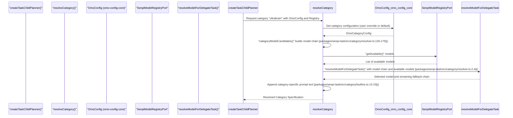
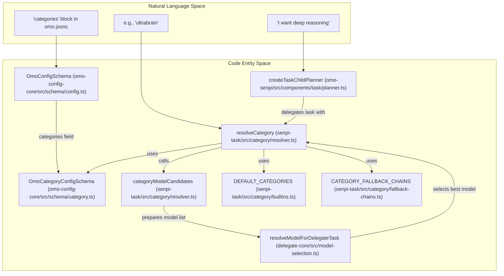

# Category Configuration

<details>
<summary>Relevant source files</summary>

The following files were used as context for generating this wiki page:

- [.omo/evidence/20260810-omo-native-telemetry/task-4.md](https://github.com/code-yeongyu/oh-my-openagent/blob/HEAD/.omo/evidence/20260810-omo-native-telemetry/task-4.md)
- [.omo/evidence/task-17-subagent-session-resume-revival.txt](https://github.com/code-yeongyu/oh-my-openagent/blob/HEAD/.omo/evidence/task-17-subagent-session-resume-revival.txt)
- [.omo/evidence/task-3-senpi-model-chain-overhaul.txt](https://github.com/code-yeongyu/oh-my-openagent/blob/HEAD/.omo/evidence/task-3-senpi-model-chain-overhaul.txt)
- [.omo/evidence/task-5-senpi-model-chain-overhaul.txt](https://github.com/code-yeongyu/oh-my-openagent/blob/HEAD/.omo/evidence/task-5-senpi-model-chain-overhaul.txt)
- [packages/delegate-core/src/model-selection.test.ts](https://github.com/code-yeongyu/oh-my-openagent/blob/HEAD/packages/delegate-core/src/model-selection.test.ts)
- [packages/delegate-core/src/model-selection.ts](https://github.com/code-yeongyu/oh-my-openagent/blob/HEAD/packages/delegate-core/src/model-selection.ts)
- [packages/omo-config-core/package.json](https://github.com/code-yeongyu/oh-my-openagent/blob/HEAD/packages/omo-config-core/package.json)
- [packages/omo-config-core/src/loader/harness-fold.test.ts](https://github.com/code-yeongyu/oh-my-openagent/blob/HEAD/packages/omo-config-core/src/loader/harness-fold.test.ts)
- [packages/omo-config-core/src/loader/index.ts](https://github.com/code-yeongyu/oh-my-openagent/blob/HEAD/packages/omo-config-core/src/loader/index.ts)
- [packages/omo-config-core/src/loader/loader-resolution.test.ts](https://github.com/code-yeongyu/oh-my-openagent/blob/HEAD/packages/omo-config-core/src/loader/loader-resolution.test.ts)
- [packages/omo-config-core/src/loader/loader.ts](https://github.com/code-yeongyu/oh-my-openagent/blob/HEAD/packages/omo-config-core/src/loader/loader.ts)
- [packages/omo-config-core/src/loader/merge.ts](https://github.com/code-yeongyu/oh-my-openagent/blob/HEAD/packages/omo-config-core/src/loader/merge.ts)
- [packages/omo-config-core/src/loader/resolution.ts](https://github.com/code-yeongyu/oh-my-openagent/blob/HEAD/packages/omo-config-core/src/loader/resolution.ts)
- [packages/omo-config-core/src/loader/telemetry-resolution.test.ts](https://github.com/code-yeongyu/oh-my-openagent/blob/HEAD/packages/omo-config-core/src/loader/telemetry-resolution.test.ts)
- [packages/omo-config-core/src/loader/top-level-senpi-config-characterization.test.ts](https://github.com/code-yeongyu/oh-my-openagent/blob/HEAD/packages/omo-config-core/src/loader/top-level-senpi-config-characterization.test.ts)
- [packages/omo-config-core/src/schema/agent-schema.test.ts](https://github.com/code-yeongyu/oh-my-openagent/blob/HEAD/packages/omo-config-core/src/schema/agent-schema.test.ts)
- [packages/omo-config-core/src/schema/agent.ts](https://github.com/code-yeongyu/oh-my-openagent/blob/HEAD/packages/omo-config-core/src/schema/agent.ts)
- [packages/omo-config-core/src/schema/category.test.ts](https://github.com/code-yeongyu/oh-my-openagent/blob/HEAD/packages/omo-config-core/src/schema/category.test.ts)
- [packages/omo-config-core/src/schema/category.ts](https://github.com/code-yeongyu/oh-my-openagent/blob/HEAD/packages/omo-config-core/src/schema/category.ts)
- [packages/omo-config-core/src/schema/codegraph.ts](https://github.com/code-yeongyu/oh-my-openagent/blob/HEAD/packages/omo-config-core/src/schema/codegraph.ts)
- [packages/omo-config-core/src/schema/config-schema.test.ts](https://github.com/code-yeongyu/oh-my-openagent/blob/HEAD/packages/omo-config-core/src/schema/config-schema.test.ts)
- [packages/omo-config-core/src/schema/config.ts](https://github.com/code-yeongyu/oh-my-openagent/blob/HEAD/packages/omo-config-core/src/schema/config.ts)
- [packages/omo-config-core/src/schema/fallback-models.ts](https://github.com/code-yeongyu/oh-my-openagent/blob/HEAD/packages/omo-config-core/src/schema/fallback-models.ts)
- [packages/omo-config-core/src/schema/harness.ts](https://github.com/code-yeongyu/oh-my-openagent/blob/HEAD/packages/omo-config-core/src/schema/harness.ts)
- [packages/omo-config-core/src/schema/index.ts](https://github.com/code-yeongyu/oh-my-openagent/blob/HEAD/packages/omo-config-core/src/schema/index.ts)
- [packages/omo-config-core/src/schema/model-ref.ts](https://github.com/code-yeongyu/oh-my-openagent/blob/HEAD/packages/omo-config-core/src/schema/model-ref.ts)
- [packages/omo-config-core/src/schema/reasoning-vocabulary.ts](https://github.com/code-yeongyu/oh-my-openagent/blob/HEAD/packages/omo-config-core/src/schema/reasoning-vocabulary.ts)
- [packages/omo-config-core/src/schema/task.test.ts](https://github.com/code-yeongyu/oh-my-openagent/blob/HEAD/packages/omo-config-core/src/schema/task.test.ts)
- [packages/omo-config-core/src/schema/task.ts](https://github.com/code-yeongyu/oh-my-openagent/blob/HEAD/packages/omo-config-core/src/schema/task.ts)
- [packages/omo-config-core/src/schema/team.ts](https://github.com/code-yeongyu/oh-my-openagent/blob/HEAD/packages/omo-config-core/src/schema/team.ts)
- [packages/omo-config-core/src/schema/telemetry.test.ts](https://github.com/code-yeongyu/oh-my-openagent/blob/HEAD/packages/omo-config-core/src/schema/telemetry.test.ts)
- [packages/omo-config-core/src/schema/telemetry.ts](https://github.com/code-yeongyu/oh-my-openagent/blob/HEAD/packages/omo-config-core/src/schema/telemetry.ts)
- [packages/omo-opencode/src/config-migration/2026-08-reasoning-unification/fixture-expected.json](https://github.com/code-yeongyu/oh-my-openagent/blob/HEAD/packages/omo-opencode/src/config-migration/2026-08-reasoning-unification/fixture-expected.json)
- [packages/omo-opencode/src/config-migration/2026-08-reasoning-unification/fixture-input.json](https://github.com/code-yeongyu/oh-my-openagent/blob/HEAD/packages/omo-opencode/src/config-migration/2026-08-reasoning-unification/fixture-input.json)
- [packages/omo-senpi/scripts/qa/task-runtime-fallback-e2e.mjs](https://github.com/code-yeongyu/oh-my-openagent/blob/HEAD/packages/omo-senpi/scripts/qa/task-runtime-fallback-e2e.mjs)
- [packages/omo-senpi/scripts/qa/task-runtime-fallback-mock-provider.ts](https://github.com/code-yeongyu/oh-my-openagent/blob/HEAD/packages/omo-senpi/scripts/qa/task-runtime-fallback-mock-provider.ts)
- [packages/omo-senpi/src/components/config-resolution/index.test.ts](https://github.com/code-yeongyu/oh-my-openagent/blob/HEAD/packages/omo-senpi/src/components/config-resolution/index.test.ts)
- [packages/omo-senpi/src/components/task/planner-agent-effort.test.ts](https://github.com/code-yeongyu/oh-my-openagent/blob/HEAD/packages/omo-senpi/src/components/task/planner-agent-effort.test.ts)
- [packages/omo-senpi/src/components/task/planner-runtime-fallback.test.ts](https://github.com/code-yeongyu/oh-my-openagent/blob/HEAD/packages/omo-senpi/src/components/task/planner-runtime-fallback.test.ts)
- [packages/omo-senpi/src/components/task/planner.test.ts](https://github.com/code-yeongyu/oh-my-openagent/blob/HEAD/packages/omo-senpi/src/components/task/planner.test.ts)
- [packages/omo-senpi/src/components/task/planner.ts](https://github.com/code-yeongyu/oh-my-openagent/blob/HEAD/packages/omo-senpi/src/components/task/planner.ts)
- [packages/senpi-task/scripts/manual-routing-policy-qa.ts](https://github.com/code-yeongyu/oh-my-openagent/blob/HEAD/packages/senpi-task/scripts/manual-routing-policy-qa.ts)
- [packages/senpi-task/src/agents/agent-builtin-chain-tuning.test.ts](https://github.com/code-yeongyu/oh-my-openagent/blob/HEAD/packages/senpi-task/src/agents/agent-builtin-chain-tuning.test.ts)
- [packages/senpi-task/src/agents/resolve-agent.test.ts](https://github.com/code-yeongyu/oh-my-openagent/blob/HEAD/packages/senpi-task/src/agents/resolve-agent.test.ts)
- [packages/senpi-task/src/agents/resolve-agent.ts](https://github.com/code-yeongyu/oh-my-openagent/blob/HEAD/packages/senpi-task/src/agents/resolve-agent.ts)
- [packages/senpi-task/src/category/available-categories.test.ts](https://github.com/code-yeongyu/oh-my-openagent/blob/HEAD/packages/senpi-task/src/category/available-categories.test.ts)
- [packages/senpi-task/src/category/gating.test.ts](https://github.com/code-yeongyu/oh-my-openagent/blob/HEAD/packages/senpi-task/src/category/gating.test.ts)
- [packages/senpi-task/src/category/index.ts](https://github.com/code-yeongyu/oh-my-openagent/blob/HEAD/packages/senpi-task/src/category/index.ts)
- [packages/senpi-task/src/category/resolve-category.test.ts](https://github.com/code-yeongyu/oh-my-openagent/blob/HEAD/packages/senpi-task/src/category/resolve-category.test.ts)
- [packages/senpi-task/src/category/resolver.ts](https://github.com/code-yeongyu/oh-my-openagent/blob/HEAD/packages/senpi-task/src/category/resolver.ts)
- [packages/senpi-task/src/category/types.ts](https://github.com/code-yeongyu/oh-my-openagent/blob/HEAD/packages/senpi-task/src/category/types.ts)
- [packages/senpi-task/src/config/settings.test.ts](https://github.com/code-yeongyu/oh-my-openagent/blob/HEAD/packages/senpi-task/src/config/settings.test.ts)
- [packages/senpi-task/src/lifecycle/batch-admission.test.ts](https://github.com/code-yeongyu/oh-my-openagent/blob/HEAD/packages/senpi-task/src/lifecycle/batch-admission.test.ts)
- [packages/senpi-task/src/manager/manager-runtime-fallback.test.ts](https://github.com/code-yeongyu/oh-my-openagent/blob/HEAD/packages/senpi-task/src/manager/manager-runtime-fallback.test.ts)
- [packages/senpi-task/src/manager/residency-unlimited.test.ts](https://github.com/code-yeongyu/oh-my-openagent/blob/HEAD/packages/senpi-task/src/manager/residency-unlimited.test.ts)
- [packages/senpi-task/src/manager/runtime-fallback-event.ts](https://github.com/code-yeongyu/oh-my-openagent/blob/HEAD/packages/senpi-task/src/manager/runtime-fallback-event.ts)
- [packages/senpi-task/src/manager/transcript-log.test.ts](https://github.com/code-yeongyu/oh-my-openagent/blob/HEAD/packages/senpi-task/src/manager/transcript-log.test.ts)
- [packages/senpi-task/src/manager/transcript-log.ts](https://github.com/code-yeongyu/oh-my-openagent/blob/HEAD/packages/senpi-task/src/manager/transcript-log.ts)
- [packages/senpi-task/src/model-chain.ts](https://github.com/code-yeongyu/oh-my-openagent/blob/HEAD/packages/senpi-task/src/model-chain.ts)
- [packages/senpi-task/src/runners/in-process-runtime-fallback.test.ts](https://github.com/code-yeongyu/oh-my-openagent/blob/HEAD/packages/senpi-task/src/runners/in-process-runtime-fallback.test.ts)
- [packages/senpi-task/src/runners/in-process/runtime-fallback-settings.ts](https://github.com/code-yeongyu/oh-my-openagent/blob/HEAD/packages/senpi-task/src/runners/in-process/runtime-fallback-settings.ts)
- [packages/senpi-task/src/tools/output/render.test.ts](https://github.com/code-yeongyu/oh-my-openagent/blob/HEAD/packages/senpi-task/src/tools/output/render.test.ts)
- [packages/senpi-task/src/tools/output/render.ts](https://github.com/code-yeongyu/oh-my-openagent/blob/HEAD/packages/senpi-task/src/tools/output/render.ts)
- [packages/team-core/src/config.ts](https://github.com/code-yeongyu/oh-my-openagent/blob/HEAD/packages/team-core/src/config.ts)
- [packages/utils/package.json](https://github.com/code-yeongyu/oh-my-openagent/blob/HEAD/packages/utils/package.json)
- [packages/utils/src/skill-path-resolver.ts](https://github.com/code-yeongyu/oh-my-openagent/blob/HEAD/packages/utils/src/skill-path-resolver.ts)
- [tests/omo-config-category-drift.test.ts](https://github.com/code-yeongyu/oh-my-openagent/blob/HEAD/tests/omo-config-category-drift.test.ts)

</details>


Category configuration provides reusable model and parameter presets that agents inherit during task delegation. Categories define model selection, variant, reasoning effort, temperature, and tool permissions for common task patterns like visual engineering, deep reasoning, or quick tasks.

For agent-specific configuration including model overrides and permissions, see **6.1 Agent Configuration**. For skill-based agent customization, see **4.3 Skills System**.

---

## Purpose and Scope

Categories serve as configuration templates that:

1.  **Group model requirements by task type** - Different task patterns (visual work, deep reasoning, quick responses) map to optimal model choices, with associated fallback chains and reasoning effort levels.
2.  **Enable reusable configuration** - Define model, variant, reasoning effort, and category-specific parameters once, which agents inherit when spawned within or delegated to that category. For example, the `delegate_task` tool uses the category field to resolve model and reasoning settings [packages/omo-senpi/src/components/task/planner.ts:53-68](https://github.com/code-yeongyu/oh-my-openagent/blob/HEAD/packages/omo-senpi/src/components/task/planner.ts#L53-L68).
3.  **Support category inheritance and overrides** - Users can override built-in categories or define new ones in their `.omo/omo.jsonc` config file under the `categories` block [packages/omo-config-core/src/schema/config.ts:19-19](https://github.com/code-yeongyu/oh-my-openagent/blob/HEAD/packages/omo-config-core/src/schema/config.ts#L19).
4.  **Facilitate runtime model resolution** - The system dynamically resolves category model requirements based on provider availability to select the best reachable model variant [packages/senpi-task/src/category/resolve-category.test.ts:116-133](https://github.com/code-yeongyu/oh-my-openagent/blob/HEAD/packages/senpi-task/src/category/resolve-category.test.ts#L116-L133).

The category system acts as **passive configuration templates** rather than active agents, meaning categories encapsulate preferences and constraints that agents inherit for task delegation decisions.

**Sources:**
- [packages/omo-config-core/src/schema/category.ts:16-43](https://github.com/code-yeongyu/oh-my-openagent/blob/HEAD/packages/omo-config-core/src/schema/category.ts#L16-L43)
- [packages/omo-senpi/src/components/task/planner.ts:53-68](https://github.com/code-yeongyu/oh-my-openagent/blob/HEAD/packages/omo-senpi/src/components/task/planner.ts#L53-L68)
- [packages/senpi-task/src/category/resolve-category.test.ts:116-133](https://github.com/code-yeongyu/oh-my-openagent/blob/HEAD/packages/senpi-task/src/category/resolve-category.test.ts#L116-L133)

---

## Built-in Categories and Defaults

Oh My OpenAgent defines 8 built-in categories optimized for common task domains. These are defined in provider-specific files and aggregated in the `DEFAULT_CATEGORIES` record [packages/senpi-task/src/category/builtins.ts:16-16](https://github.com/code-yeongyu/oh-my-openagent/blob/HEAD/packages/senpi-task/src/category/builtins.ts#L16).

| Category | Default Model | Default Variant | Reasoning Effort | Typical Use Case |
| :--- | :--- | :--- | :--- | :--- |
| `visual-engineering` | `anthropic/claude-opus-5` | `max` | High | Frontend/UI/UX work, design system [packages/senpi-task/src/category/fallback-chains.ts:10-10](https://github.com/code-yeongyu/oh-my-openagent/blob/HEAD/packages/senpi-task/src/category/fallback-chains.ts#L10) |
| `ultrabrain` | `openai/gpt-5.6-sol` | `xhigh` | Very High | Hard logic, intensive reasoning [packages/senpi-task/src/category/fallback-chains.ts:11-11](https://github.com/code-yeongyu/oh-my-openagent/blob/HEAD/packages/senpi-task/src/category/fallback-chains.ts#L11) |
| `deep` | `openai/gpt-5.6-sol` | `medium` | Medium | Autonomous multi-step problem solving [packages/senpi-task/src/category/fallback-chains.ts:12-12](https://github.com/code-yeongyu/oh-my-openagent/blob/HEAD/packages/senpi-task/src/category/fallback-chains.ts#L12) |
| `artistry` | `anthropic/claude-fable-5` | `xhigh` | High | Creative, unconventional approaches [packages/senpi-task/src/category/fallback-chains.ts:13-13](https://github.com/code-yeongyu/oh-my-openagent/blob/HEAD/packages/senpi-task/src/category/fallback-chains.ts#L13) |
| `quick` | `kimi-for-coding-highspeed` | (no variant) | Low | Trivial single-file fixes [packages/senpi-task/src/category/fallback-chains.ts:14-14](https://github.com/code-yeongyu/oh-my-openagent/blob/HEAD/packages/senpi-task/src/category/fallback-chains.ts#L14) |
| `unspecified-low` | `openai/gpt-5.6-luna` | `xhigh` | Low | Moderate effort fallback [packages/senpi-task/src/category/fallback-chains.ts:15-15](https://github.com/code-yeongyu/oh-my-openagent/blob/HEAD/packages/senpi-task/src/category/fallback-chains.ts#L15) |
| `unspecified-high` | `kimi-for-coding/k3` | `max` | High | High effort fallback [packages/senpi-task/src/category/fallback-chains.ts:16-16](https://github.com/code-yeongyu/oh-my-openagent/blob/HEAD/packages/senpi-task/src/category/fallback-chains.ts#L16) |
| `writing` | `kimi-for-coding/k3` | `low` | Low | Documentation, prose [packages/senpi-task/src/category/fallback-chains.ts:17-17](https://github.com/code-yeongyu/oh-my-openagent/blob/HEAD/packages/senpi-task/src/category/fallback-chains.ts#L17) |

### Category Context and Prompt Appends
Each category includes a `<Category_Context>` block appended to the agent's prompt to enforce specific mindsets, such as the "Autonomous problem-solver" mindset for `deep` tasks [packages/senpi-task/src/category/builtins.ts:100-119](https://github.com/code-yeongyu/oh-my-openagent/blob/HEAD/packages/senpi-task/src/category/builtins.ts#L100-L119) or the "Exhaustively Explicit" requirement for `quick` tasks [packages/senpi-task/src/category/builtins.ts:150-199](https://github.com/code-yeongyu/oh-my-openagent/blob/HEAD/packages/senpi-task/src/category/builtins.ts#L150-L199).

**Sources:**
- [packages/senpi-task/src/category/builtins.ts:16-16](https://github.com/code-yeongyu/oh-my-openagent/blob/HEAD/packages/senpi-task/src/category/builtins.ts#L16)
- [packages/senpi-task/src/category/builtins.ts:100-119](https://github.com/code-yeongyu/oh-my-openagent/blob/HEAD/packages/senpi-task/src/category/builtins.ts#L100-L119)
- [packages/senpi-task/src/category/builtins.ts:150-199](https://github.com/code-yeongyu/oh-my-openagent/blob/HEAD/packages/senpi-task/src/category/builtins.ts#L150-L199)
- [packages/senpi-task/src/category/fallback-chains.ts:10-17](https://github.com/code-yeongyu/oh-my-openagent/blob/HEAD/packages/senpi-task/src/category/fallback-chains.ts#L10-L17)

---

## Category Configuration Data Flow and Resolution

The resolution pipeline combines user-defined overrides with system defaults and runtime provider availability. The core logic resides in `resolveCategory` [packages/senpi-task/src/category/resolver.ts:188-188](https://github.com/code-yeongyu/oh-my-openagent/blob/HEAD/packages/senpi-task/src/category/resolver.ts#L188).

1.  **User Configuration Check**: `loadOmoConfig` merges the `categories` block from `omo.jsonc` layers [packages/omo-config-core/src/loader/loader.ts:151-152](https://github.com/code-yeongyu/oh-my-openagent/blob/HEAD/packages/omo-config-core/src/loader/loader.ts#L151-L152).
2.  **Model Chain Construction**: `categoryModelCandidates` constructs a list of potential models, prioritizing the `models` array over `model` + `fallback_models` [packages/senpi-task/src/category/resolver.ts:126-175](https://github.com/code-yeongyu/oh-my-openagent/blob/HEAD/packages/senpi-task/src/category/resolver.ts#L126-L175).
3.  **Model Resolution**: `resolveModelForDelegateTask` (from `@oh-my-opencode/delegate-core`) selects the best available model from the constructed chain, considering provider availability [packages/senpi-task/src/category/resolver.ts:2-4](https://github.com/code-yeongyu/oh-my-openagent/blob/HEAD/packages/senpi-task/src/category/resolver.ts#L2-L4).
4.  **Prompt Append**: `CATEGORY_PROMPT_APPEND_RESOLVERS` and `CATEGORY_PROMPT_APPENDS` are used to add context to the prompt [packages/senpi-task/src/category/builtins.ts:13-15](https://github.com/code-yeongyu/oh-my-openagent/blob/HEAD/packages/senpi-task/src/category/builtins.ts#L13-L15).

### Diagram: Category Resolution Logic

Title: "Category Resolution Logic"


**Sources:**
- [packages/omo-config-core/src/loader/loader.ts:151-152](https://github.com/code-yeongyu/oh-my-openagent/blob/HEAD/packages/omo-config-core/src/loader/loader.ts#L151-L152)
- [packages/senpi-task/src/category/resolver.ts:2-4](https://github.com/code-yeongyu/oh-my-openagent/blob/HEAD/packages/senpi-task/src/category/resolver.ts#L2-L4)
- [packages/senpi-task/src/category/resolver.ts:126-175](https://github.com/code-yeongyu/oh-my-openagent/blob/HEAD/packages/senpi-task/src/category/resolver.ts#L126-L175)
- [packages/senpi-task/src/category/resolver.ts:188-188](https://github.com/code-yeongyu/oh-my-openagent/blob/HEAD/packages/senpi-task/src/category/resolver.ts#L188)
- [packages/senpi-task/src/category/builtins.ts:13-15](https://github.com/code-yeongyu/oh-my-openagent/blob/HEAD/packages/senpi-task/src/category/builtins.ts#L13-L15)

---

## Implementation Details

### Schema Definition
The `OmoCategoryConfigSchema` defines the structure for both built-in and user categories. It supports strict validation and automatic normalization of legacy fields [packages/omo-config-core/src/schema/category.ts:16-53](https://github.com/code-yeongyu/oh-my-openagent/blob/HEAD/packages/omo-config-core/src/schema/category.ts#L16-L53).

| Key | Type | Description |
| :--- | :--- | :--- |
| `model` | `string` | The primary model ID (e.g., `anthropic/claude-3-5-sonnet`) |
| `models` | `array` | A fallback chain of model IDs or objects [packages/omo-config-core/src/schema/category.ts:19-19](https://github.com/code-yeongyu/oh-my-openagent/blob/HEAD/packages/omo-config-core/src/schema/category.ts#L19) |
| `reasoning` | `string` | Unified reasoning level (e.g., `high`, `max`, `off`) [packages/omo-config-core/src/schema/category.ts:20-20](https://github.com/code-yeongyu/oh-my-openagent/blob/HEAD/packages/omo-config-core/src/schema/category.ts#L20) |
| `prompt_append` | `string` | Text added to the system prompt for this category [packages/omo-config-core/src/schema/category.ts:38-38](https://github.com/code-yeongyu/oh-my-openagent/blob/HEAD/packages/omo-config-core/src/schema/category.ts#L38) |
| `tools` | `record` | Boolean map to enable/disable specific tools [packages/omo-config-core/src/schema/category.ts:37-37](https://github.com/code-yeongyu/oh-my-openagent/blob/HEAD/packages/omo-config-core/src/schema/category.ts#L37)

### Bridging Code Entities to Logic
The following diagram maps user-facing category concepts to the internal code structures that handle them.

Title: "Category Configuration Entity Mapping"


**Sources:**
- [packages/omo-config-core/src/schema/category.ts:16-53](https://github.com/code-yeongyu/oh-my-openagent/blob/HEAD/packages/omo-config-core/src/schema/category.ts#L16-L53)
- [packages/omo-config-core/src/schema/config.ts:19-19](https://github.com/code-yeongyu/oh-my-openagent/blob/HEAD/packages/omo-config-core/src/schema/config.ts#L19)
- [packages/senpi-task/src/category/resolver.ts:126-175](https://github.com/code-yeongyu/oh-my-openagent/blob/HEAD/packages/senpi-task/src/category/resolver.ts#L126-L175)
- [packages/senpi-task/src/category/resolver.ts:188-188](https://github.com/code-yeongyu/oh-my-openagent/blob/HEAD/packages/senpi-task/src/category/resolver.ts#L188)
- [packages/senpi-task/src/category/builtins.ts:16-16](https://github.com/code-yeongyu/oh-my-openagent/blob/HEAD/packages/senpi-task/src/category/builtins.ts#L16)
- [packages/senpi-task/src/category/fallback-chains.ts:23-23](https://github.com/code-yeongyu/oh-my-openagent/blob/HEAD/packages/senpi-task/src/category/fallback-chains.ts#L23)
- [packages/delegate-core/src/model-selection.ts:1-1](https://github.com/code-yeongyu/oh-my-openagent/blob/HEAD/packages/delegate-core/src/model-selection.ts#L1)
- [packages/omo-senpi/src/components/task/planner.ts:31-34](https://github.com/code-yeongyu/oh-my-openagent/blob/HEAD/packages/omo-senpi/src/components/task/planner.ts#L31-L34)

---

## User Category Configuration Example

Users can customize category configurations in their `.omo/omo.jsonc` to override model, variant, reasoning effort, or add custom categories. The system supports a `:level` suffix on model strings for concise reasoning configuration [packages/omo-config-core/src/schema/fallback-models.ts:24-36](https://github.com/code-yeongyu/oh-my-openagent/blob/HEAD/packages/omo-config-core/src/schema/fallback-models.ts#L24-L36).

```jsonc
{
  "categories": {
    "visual-engineering": {
      "model": "google/gemini-3.1-pro:high", // Model with reasoning level suffix
      "temperature": 0.2,
      "description": "Custom tuned visual engineering category"
    },
    "security-audit": {
      "model": "openai/gpt-5.6-sol",
      "reasoning": "max",
      "prompt_append": "Focus on identifying SQL injection and XSS vulnerabilities."
    }
  }
}
```

### Inheritance and Agent Integration
When an agent is spawned via `delegate_task`, it inherits:
- **Model and Reasoning**: Resolved from the category's `models` chain [packages/senpi-task/src/agents/resolve-agent.ts:113-129](https://github.com/code-yeongyu/oh-my-openagent/blob/HEAD/packages/senpi-task/src/agents/resolve-agent.ts#L113-L129) or the category's direct model configuration [packages/omo-senpi/src/components/task/planner.ts:156-156](https://github.com/code-yeongyu/oh-my-openagent/blob/HEAD/packages/omo-senpi/src/components/task/planner.ts#L156).
- **Tool Restrictions**: Merged from the category's `tools` record and the agent's `disallowedTools` [packages/senpi-task/src/agents/resolve-agent.ts:176-179](https://github.com/code-yeongyu/oh-my-openagent/blob/HEAD/packages/senpi-task/src/agents/resolve-agent.ts#L176-L179).
- **Context**: The `prompt_append` is injected via the `CATEGORY_PROMPT_APPEND_RESOLVERS` [packages/senpi-task/src/category/builtins.ts:14-14](https://github.com/code-yeongyu/oh-my-openagent/blob/HEAD/packages/senpi-task/src/category/builtins.ts#L14).

**Sources:**
- [packages/omo-config-core/src/schema/config.ts:19-19](https://github.com/code-yeongyu/oh-my-openagent/blob/HEAD/packages/omo-config-core/src/schema/config.ts#L19)
- [packages/omo-config-core/src/schema/fallback-models.ts:24-36](https://github.com/code-yeongyu/oh-my-openagent/blob/HEAD/packages/omo-config-core/src/schema/fallback-models.ts#L24-L36)
- [packages/senpi-task/src/agents/resolve-agent.ts:113-129](https://github.com/code-yeongyu/oh-my-openagent/blob/HEAD/packages/senpi-task/src/agents/resolve-agent.ts#L113-L129)
- [packages/senpi-task/src/agents/resolve-agent.ts:176-179](https://github.com/code-yeongyu/oh-my-openagent/blob/HEAD/packages/senpi-task/src/agents/resolve-agent.ts#L176-L179)
- [packages/omo-senpi/src/components/task/planner.ts:156-156](https://github.com/code-yeongyu/oh-my-openagent/blob/HEAD/packages/omo-senpi/src/components/task/planner.ts#L156)
- [packages/senpi-task/src/category/builtins.ts:14-14](https://github.com/code-yeongyu/oh-my-openagent/blob/HEAD/packages/senpi-task/src/category/builtins.ts#L14)