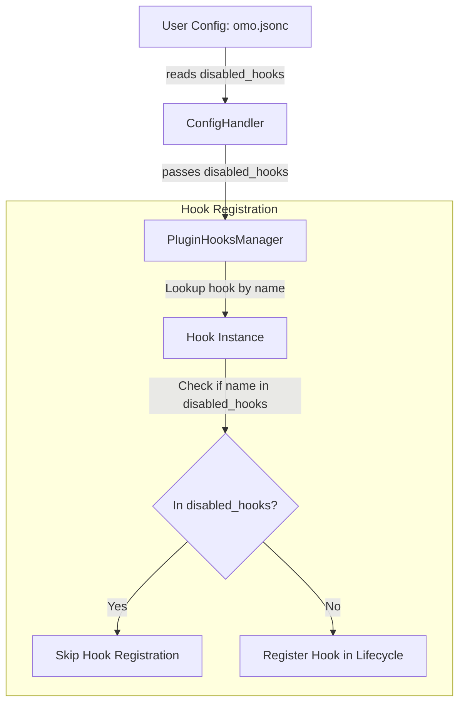
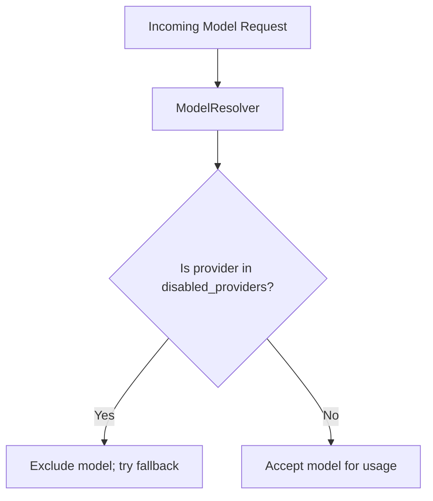
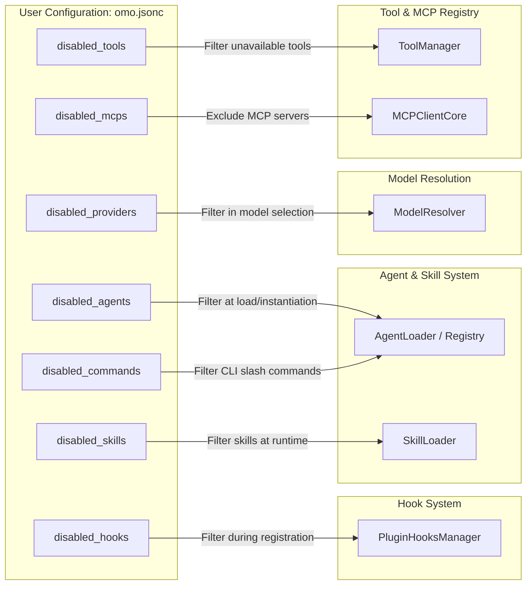

# Disabling Features

Relevant source files

The following files were used as context for generating this wiki page:

- [.omo/evidence/20260810-omo-native-telemetry/task-4.md](https://github.com/code-yeongyu/oh-my-openagent/blob/HEAD/.omo/evidence/20260810-omo-native-telemetry/task-4.md)
- [.omo/evidence/task-17-subagent-session-resume-revival.txt](https://github.com/code-yeongyu/oh-my-openagent/blob/HEAD/.omo/evidence/task-17-subagent-session-resume-revival.txt)
- [.omo/evidence/task-3-senpi-model-chain-overhaul.txt](https://github.com/code-yeongyu/oh-my-openagent/blob/HEAD/.omo/evidence/task-3-senpi-model-chain-overhaul.txt)
- [packages/omo-config-core/package.json](https://github.com/code-yeongyu/oh-my-openagent/blob/HEAD/packages/omo-config-core/package.json)
- [packages/omo-config-core/src/index.ts](https://github.com/code-yeongyu/oh-my-openagent/blob/HEAD/packages/omo-config-core/src/index.ts)
- [packages/omo-config-core/src/internal/index.ts](https://github.com/code-yeongyu/oh-my-openagent/blob/HEAD/packages/omo-config-core/src/internal/index.ts)
- [packages/omo-config-core/src/internal/jsonc-parse.ts](https://github.com/code-yeongyu/oh-my-openagent/blob/HEAD/packages/omo-config-core/src/internal/jsonc-parse.ts)
- [packages/omo-config-core/src/internal/plain-object.ts](https://github.com/code-yeongyu/oh-my-openagent/blob/HEAD/packages/omo-config-core/src/internal/plain-object.ts)
- [packages/omo-config-core/src/internal/posix-path.ts](https://github.com/code-yeongyu/oh-my-openagent/blob/HEAD/packages/omo-config-core/src/internal/posix-path.ts)
- [packages/omo-config-core/src/loader/harness-fold.test.ts](https://github.com/code-yeongyu/oh-my-openagent/blob/HEAD/packages/omo-config-core/src/loader/harness-fold.test.ts)
- [packages/omo-config-core/src/loader/index.ts](https://github.com/code-yeongyu/oh-my-openagent/blob/HEAD/packages/omo-config-core/src/loader/index.ts)
- [packages/omo-config-core/src/loader/legacy-user-config-purge.test.ts](https://github.com/code-yeongyu/oh-my-openagent/blob/HEAD/packages/omo-config-core/src/loader/legacy-user-config-purge.test.ts)
- [packages/omo-config-core/src/loader/loader-resolution.test.ts](https://github.com/code-yeongyu/oh-my-openagent/blob/HEAD/packages/omo-config-core/src/loader/loader-resolution.test.ts)
- [packages/omo-config-core/src/loader/loader.test.ts](https://github.com/code-yeongyu/oh-my-openagent/blob/HEAD/packages/omo-config-core/src/loader/loader.test.ts)
- [packages/omo-config-core/src/loader/loader.ts](https://github.com/code-yeongyu/oh-my-openagent/blob/HEAD/packages/omo-config-core/src/loader/loader.ts)
- [packages/omo-config-core/src/loader/merge.ts](https://github.com/code-yeongyu/oh-my-openagent/blob/HEAD/packages/omo-config-core/src/loader/merge.ts)
- [packages/omo-config-core/src/loader/paths.test.ts](https://github.com/code-yeongyu/oh-my-openagent/blob/HEAD/packages/omo-config-core/src/loader/paths.test.ts)
- [packages/omo-config-core/src/loader/paths.ts](https://github.com/code-yeongyu/oh-my-openagent/blob/HEAD/packages/omo-config-core/src/loader/paths.ts)
- [packages/omo-config-core/src/loader/project-config-path-discovery.test.ts](https://github.com/code-yeongyu/oh-my-openagent/blob/HEAD/packages/omo-config-core/src/loader/project-config-path-discovery.test.ts)
- [packages/omo-config-core/src/loader/resolution.test.ts](https://github.com/code-yeongyu/oh-my-openagent/blob/HEAD/packages/omo-config-core/src/loader/resolution.test.ts)
- [packages/omo-config-core/src/loader/resolution.ts](https://github.com/code-yeongyu/oh-my-openagent/blob/HEAD/packages/omo-config-core/src/loader/resolution.ts)
- [packages/omo-config-core/src/loader/telemetry-resolution.test.ts](https://github.com/code-yeongyu/oh-my-openagent/blob/HEAD/packages/omo-config-core/src/loader/telemetry-resolution.test.ts)
- [packages/omo-config-core/src/loader/top-level-senpi-config-characterization.test.ts](https://github.com/code-yeongyu/oh-my-openagent/blob/HEAD/packages/omo-config-core/src/loader/top-level-senpi-config-characterization.test.ts)
- [packages/omo-config-core/src/loader/types.ts](https://github.com/code-yeongyu/oh-my-openagent/blob/HEAD/packages/omo-config-core/src/loader/types.ts)
- [packages/omo-config-core/src/migration/backup-move.ts](https://github.com/code-yeongyu/oh-my-openagent/blob/HEAD/packages/omo-config-core/src/migration/backup-move.ts)
- [packages/omo-config-core/src/migration/batch.test.ts](https://github.com/code-yeongyu/oh-my-openagent/blob/HEAD/packages/omo-config-core/src/migration/batch.test.ts)
- [packages/omo-config-core/src/migration/batch.ts](https://github.com/code-yeongyu/oh-my-openagent/blob/HEAD/packages/omo-config-core/src/migration/batch.ts)
- [packages/omo-config-core/src/migration/commit.ts](https://github.com/code-yeongyu/oh-my-openagent/blob/HEAD/packages/omo-config-core/src/migration/commit.ts)
- [packages/omo-config-core/src/migration/engine.ts](https://github.com/code-yeongyu/oh-my-openagent/blob/HEAD/packages/omo-config-core/src/migration/engine.ts)
- [packages/omo-config-core/src/migration/journal.ts](https://github.com/code-yeongyu/oh-my-openagent/blob/HEAD/packages/omo-config-core/src/migration/journal.ts)
- [packages/omo-config-core/src/migration/lock.test.ts](https://github.com/code-yeongyu/oh-my-openagent/blob/HEAD/packages/omo-config-core/src/migration/lock.test.ts)
- [packages/omo-config-core/src/migration/lock.ts](https://github.com/code-yeongyu/oh-my-openagent/blob/HEAD/packages/omo-config-core/src/migration/lock.ts)
- [packages/omo-config-core/src/migration/merge-commit.test.ts](https://github.com/code-yeongyu/oh-my-openagent/blob/HEAD/packages/omo-config-core/src/migration/merge-commit.test.ts)
- [packages/omo-config-core/src/migration/merge.ts](https://github.com/code-yeongyu/oh-my-openagent/blob/HEAD/packages/omo-config-core/src/migration/merge.ts)
- [packages/omo-config-core/src/migration/migration-test-support.ts](https://github.com/code-yeongyu/oh-my-openagent/blob/HEAD/packages/omo-config-core/src/migration/migration-test-support.ts)
- [packages/omo-config-core/src/migration/predicate.test.ts](https://github.com/code-yeongyu/oh-my-openagent/blob/HEAD/packages/omo-config-core/src/migration/predicate.test.ts)
- [packages/omo-config-core/src/migration/predicate.ts](https://github.com/code-yeongyu/oh-my-openagent/blob/HEAD/packages/omo-config-core/src/migration/predicate.ts)
- [packages/omo-config-core/src/migration/recovery.test.ts](https://github.com/code-yeongyu/oh-my-openagent/blob/HEAD/packages/omo-config-core/src/migration/recovery.test.ts)
- [packages/omo-config-core/src/migration/recovery.ts](https://github.com/code-yeongyu/oh-my-openagent/blob/HEAD/packages/omo-config-core/src/migration/recovery.ts)
- [packages/omo-config-core/src/migration/transaction.test.ts](https://github.com/code-yeongyu/oh-my-openagent/blob/HEAD/packages/omo-config-core/src/migration/transaction.test.ts)
- [packages/omo-config-core/src/migration/types.ts](https://github.com/code-yeongyu/oh-my-openagent/blob/HEAD/packages/omo-config-core/src/migration/types.ts)
- [packages/omo-config-core/src/models/index.ts](https://github.com/code-yeongyu/oh-my-openagent/blob/HEAD/packages/omo-config-core/src/models/index.ts)
- [packages/omo-config-core/src/models/model-catalog-cycles.ts](https://github.com/code-yeongyu/oh-my-openagent/blob/HEAD/packages/omo-config-core/src/models/model-catalog-cycles.ts)
- [packages/omo-config-core/src/models/model-reference-resolution.test.ts](https://github.com/code-yeongyu/oh-my-openagent/blob/HEAD/packages/omo-config-core/src/models/model-reference-resolution.test.ts)
- [packages/omo-config-core/src/models/model-reference-resolution.ts](https://github.com/code-yeongyu/oh-my-openagent/blob/HEAD/packages/omo-config-core/src/models/model-reference-resolution.ts)
- [packages/omo-config-core/src/schema/agent-schema.test.ts](https://github.com/code-yeongyu/oh-my-openagent/blob/HEAD/packages/omo-config-core/src/schema/agent-schema.test.ts)
- [packages/omo-config-core/src/schema/agent.ts](https://github.com/code-yeongyu/oh-my-openagent/blob/HEAD/packages/omo-config-core/src/schema/agent.ts)
- [packages/omo-config-core/src/schema/category.test.ts](https://github.com/code-yeongyu/oh-my-openagent/blob/HEAD/packages/omo-config-core/src/schema/category.test.ts)
- [packages/omo-config-core/src/schema/category.ts](https://github.com/code-yeongyu/oh-my-openagent/blob/HEAD/packages/omo-config-core/src/schema/category.ts)
- [packages/omo-config-core/src/schema/codegraph.ts](https://github.com/code-yeongyu/oh-my-openagent/blob/HEAD/packages/omo-config-core/src/schema/codegraph.ts)
- [packages/omo-config-core/src/schema/config-schema.test.ts](https://github.com/code-yeongyu/oh-my-openagent/blob/HEAD/packages/omo-config-core/src/schema/config-schema.test.ts)
- [packages/omo-config-core/src/schema/config.ts](https://github.com/code-yeongyu/oh-my-openagent/blob/HEAD/packages/omo-config-core/src/schema/config.ts)
- [packages/omo-config-core/src/schema/fallback-models.ts](https://github.com/code-yeongyu/oh-my-openagent/blob/HEAD/packages/omo-config-core/src/schema/fallback-models.ts)
- [packages/omo-config-core/src/schema/harness.ts](https://github.com/code-yeongyu/oh-my-openagent/blob/HEAD/packages/omo-config-core/src/schema/harness.ts)
- [packages/omo-config-core/src/schema/index.ts](https://github.com/code-yeongyu/oh-my-openagent/blob/HEAD/packages/omo-config-core/src/schema/index.ts)
- [packages/omo-config-core/src/schema/model-ref.ts](https://github.com/code-yeongyu/oh-my-openagent/blob/HEAD/packages/omo-config-core/src/schema/model-ref.ts)
- [packages/omo-config-core/src/schema/reasoning-vocabulary.ts](https://github.com/code-yeongyu/oh-my-openagent/blob/HEAD/packages/omo-config-core/src/schema/reasoning-vocabulary.ts)
- [packages/omo-config-core/src/schema/task.test.ts](https://github.com/code-yeongyu/oh-my-openagent/blob/HEAD/packages/omo-config-core/src/schema/task.test.ts)
- [packages/omo-config-core/src/schema/task.ts](https://github.com/code-yeongyu/oh-my-openagent/blob/HEAD/packages/omo-config-core/src/schema/task.ts)
- [packages/omo-config-core/src/schema/team.ts](https://github.com/code-yeongyu/oh-my-openagent/blob/HEAD/packages/omo-config-core/src/schema/team.ts)
- [packages/omo-config-core/src/schema/telemetry.test.ts](https://github.com/code-yeongyu/oh-my-openagent/blob/HEAD/packages/omo-config-core/src/schema/telemetry.test.ts)
- [packages/omo-config-core/src/schema/telemetry.ts](https://github.com/code-yeongyu/oh-my-openagent/blob/HEAD/packages/omo-config-core/src/schema/telemetry.ts)
- [packages/omo-config-core/src/writer/types.ts](https://github.com/code-yeongyu/oh-my-openagent/blob/HEAD/packages/omo-config-core/src/writer/types.ts)
- [packages/omo-config-core/src/writer/writer-security.test.ts](https://github.com/code-yeongyu/oh-my-openagent/blob/HEAD/packages/omo-config-core/src/writer/writer-security.test.ts)
- [packages/omo-config-core/src/writer/writer.test.ts](https://github.com/code-yeongyu/oh-my-openagent/blob/HEAD/packages/omo-config-core/src/writer/writer.test.ts)
- [packages/omo-config-core/src/writer/writer.ts](https://github.com/code-yeongyu/oh-my-openagent/blob/HEAD/packages/omo-config-core/src/writer/writer.ts)
- [packages/omo-opencode/src/config-migration/2026-08-reasoning-unification/fixture-expected.json](https://github.com/code-yeongyu/oh-my-openagent/blob/HEAD/packages/omo-opencode/src/config-migration/2026-08-reasoning-unification/fixture-expected.json)
- [packages/omo-opencode/src/config-migration/2026-08-reasoning-unification/fixture-input.json](https://github.com/code-yeongyu/oh-my-openagent/blob/HEAD/packages/omo-opencode/src/config-migration/2026-08-reasoning-unification/fixture-input.json)
- [packages/omo-opencode/src/startup-migration.test.ts](https://github.com/code-yeongyu/oh-my-openagent/blob/HEAD/packages/omo-opencode/src/startup-migration.test.ts)
- [packages/omo-senpi/src/components/config-resolution/index.test.ts](https://github.com/code-yeongyu/oh-my-openagent/blob/HEAD/packages/omo-senpi/src/components/config-resolution/index.test.ts)
- [packages/senpi-task/scripts/manual-routing-policy-qa.ts](https://github.com/code-yeongyu/oh-my-openagent/blob/HEAD/packages/senpi-task/scripts/manual-routing-policy-qa.ts)
- [packages/senpi-task/src/config/settings.test.ts](https://github.com/code-yeongyu/oh-my-openagent/blob/HEAD/packages/senpi-task/src/config/settings.test.ts)
- [packages/senpi-task/src/lifecycle/batch-admission.test.ts](https://github.com/code-yeongyu/oh-my-openagent/blob/HEAD/packages/senpi-task/src/lifecycle/batch-admission.test.ts)
- [packages/senpi-task/src/manager/residency-unlimited.test.ts](https://github.com/code-yeongyu/oh-my-openagent/blob/HEAD/packages/senpi-task/src/manager/residency-unlimited.test.ts)
- [packages/team-core/src/config.ts](https://github.com/code-yeongyu/oh-my-openagent/blob/HEAD/packages/team-core/src/config.ts)
- [packages/utils/package.json](https://github.com/code-yeongyu/oh-my-openagent/blob/HEAD/packages/utils/package.json)
- [packages/utils/src/skill-path-resolver.ts](https://github.com/code-yeongyu/oh-my-openagent/blob/HEAD/packages/utils/src/skill-path-resolver.ts)
- [tests/omo-config-category-drift.test.ts](https://github.com/code-yeongyu/oh-my-openagent/blob/HEAD/tests/omo-config-category-drift.test.ts)

This page provides an in-depth technical explanation of the feature disabling system in `oh-my-openagent`. It details how the various `disabled_*` arrays in the unified configuration file `omo.jsonc` selectively prune hooks, skills, MCPs, commands, tools, providers, and agents at runtime and load time.

## Overview

`oh-my-openagent` supports a unified configuration system where multiple feature categories can be selectively disabled globally or per profile. The primary disabling arrays reside inside the `[opencode]` block or a profile-specific variant in the `omo.jsonc` configuration file, validated against [`assets/oh-my-opencode.schema.json`](https://github.com/code-yeongyu/oh-my-openagent/blob/HEAD/assets/oh-my-opencode.schema.json).

| Configuration Array | Disables | Purpose/Scope |
| :--- | :--- | :--- |
| `disabled_hooks` | Lifecycle and guard hooks | Prevents specific hooks (e.g., keyword detector, continuation enforcers) from running [packages/omo-config-core/src/schema/config.ts:38-41](https://github.com/code-yeongyu/oh-my-openagent/blob/HEAD/packages/omo-config-core/src/schema/config.ts#L38-L41) |
| `disabled_skills` | Shared skills library | Removes embedded or configured skills to restrict agent capabilities [packages/omo-config-core/src/schema/config.ts:38-41](https://github.com/code-yeongyu/oh-my-openagent/blob/HEAD/packages/omo-config-core/src/schema/config.ts#L38-L41) |
| `disabled_mcps` | Model Context Protocol (MCP) servers | Disables built-in integrations with MCPs such as codegraph or git_bash [packages/omo-config-core/src/schema/config.ts:38-41](https://github.com/code-yeongyu/oh-my-openagent/blob/HEAD/packages/omo-config-core/src/schema/config.ts#L38-L41) |
| `disabled_commands` | Built-in slash commands | Disables core commands like `/goal`, `/refactor`, `/start-work` [packages/omo-config-core/src/schema/config.ts:38-41](https://github.com/code-yeongyu/oh-my-openagent/blob/HEAD/packages/omo-config-core/src/schema/config.ts#L38-L41) |
| `disabled_tools` | Low-level tool implementations | Removes access to specific tools like `write_file` or `delegate_task` [packages/omo-config-core/src/schema/config.ts:38-41](https://github.com/code-yeongyu/oh-my-openagent/blob/HEAD/packages/omo-config-core/src/schema/config.ts#L38-L41) |
| `disabled_providers` | Model provider namespaces | Excludes entire model families (e.g., `openai`, `anthropic`) from resolution [packages/omo-config-core/src/schema/config.ts:38-41](https://github.com/code-yeongyu/oh-my-openagent/blob/HEAD/packages/omo-config-core/src/schema/config.ts#L38-L41) |
| `disabled_agents` | Specialized AI agents | Prevents instantiation and routing to particular agents like `oracle` [packages/omo-config-core/src/schema/config.ts:38-41](https://github.com/code-yeongyu/oh-my-openagent/blob/HEAD/packages/omo-config-core/src/schema/config.ts#L38-L41) |

These arrays are merged following the 4-layer resolution pipeline (`shared base → [harness] block → profiles.<name> → profiles.<name>.[harness]`), enabling override and refinement by profiles or harnesses [packages/omo-config-core/src/loader/loader.ts:141-173](https://github.com/code-yeongyu/oh-my-openagent/blob/HEAD/packages/omo-config-core/src/loader/loader.ts#L141-L173).

Sources:
[packages/omo-config-core/src/schema/config.ts:38-41](https://github.com/code-yeongyu/oh-my-openagent/blob/HEAD/packages/omo-config-core/src/schema/config.ts#L38-L41)
[packages/omo-config-core/src/loader/loader.ts:141-173](https://github.com/code-yeongyu/oh-my-openagent/blob/HEAD/packages/omo-config-core/src/loader/loader.ts#L141-L173)

---

## Disabling Hooks

The system defines a large hook architecture across Session, Tool Guard, Transform, Continuation, and Skill tiers. These hooks inject custom logic at various points—session lifecycle, tool invocation guards, and continuation enforcement.

### Implementation Details

The `disabled_hooks` array specifies hook names which are to be skipped from registration entirely. The `ConfigHandler` reads this array during configuration resolution, and hook registration managers check the `disabled_hooks` list before attaching hooks to lifecycle events. This effectively **prevents the hook's logic from executing anywhere in the system.**

### Data Flow Diagram: From Config to Hook Suppression

Sources:
[packages/omo-config-core/src/schema/config.ts:38-41](https://github.com/code-yeongyu/oh-my-openagent/blob/HEAD/packages/omo-config-core/src/schema/config.ts#L38-L41)

---

## Disabling Built-in Slash Commands

Certain slash commands are globally registered and exposed as user interface commands. These include:
- `/goal`
- `/refactor`
- `/start-work`
- `/stop-continuation`
- `/remove-ai-slops`
- `/hyperplan`

### Implementation Details

The schema enforces that `disabled_commands` entries are restricted to the enum of known commands [packages/omo-config-core/src/schema/config.ts:38-41](https://github.com/code-yeongyu/oh-my-openagent/blob/HEAD/packages/omo-config-core/src/schema/config.ts#L38-L41). During plugin initialization, the command registry excludes commands listed in the configuration. Disabled commands do not appear in the TUI help output nor process command invocations.

Sources:
[packages/omo-config-core/src/schema/config.ts:38-41](https://github.com/code-yeongyu/oh-my-openagent/blob/HEAD/packages/omo-config-core/src/schema/config.ts#L38-L41)

---

## Disabling Providers

`disabled_providers` configures the exclusion of entire model providers (namespaces) such as `anthropic`, `openai`, `github-copilot`, `opencode`, `opencode-go`, and `vercel`.

### Model Resolution Integration

The model resolution pipeline checks `disabled_providers` during model matching. When a requested model's provider prefix matches an entry in `disabled_providers`, it is excluded from consideration, and the system attempts the next fallback model in the chain.

### Provider Filtering Data Flow

Sources:
[packages/omo-config-core/src/schema/config.ts:38-41](https://github.com/code-yeongyu/oh-my-openagent/blob/HEAD/packages/omo-config-core/src/schema/config.ts#L38-L41)

---

## Disabling Tools and MCPs

### Disabled Tools (`disabled_tools`)
Defined as an array of tool names (e.g., `write_file`, `delegate_task`) to exclude [packages/omo-config-core/src/schema/config.ts:38-41](https://github.com/code-yeongyu/oh-my-openagent/blob/HEAD/packages/omo-config-core/src/schema/config.ts#L38-L41). If a tool is in `disabled_tools`, it is entirely removed from the set presented to LLMs and from actual invocation.

### Disabled MCPs (`disabled_mcps`)
MCP servers are integrations for features like code graphs, browsing automation, and shell access (`git_bash`). `disabled_mcps` removes these MCP registrations, disabling those features [packages/omo-config-core/src/schema/config.ts:38-41](https://github.com/code-yeongyu/oh-my-openagent/blob/HEAD/packages/omo-config-core/src/schema/config.ts#L38-L41).

### Permissions and Agent Restrictions
Independently, per-agent configurations can restrict tool usage by permissions (`agents.*.permissions`) or built-in restrictions (e.g., `oracle`, `librarian`, and `explore` are read-only).

Sources:
[packages/omo-config-core/src/schema/config.ts:38-41](https://github.com/code-yeongyu/oh-my-openagent/blob/HEAD/packages/omo-config-core/src/schema/config.ts#L38-L41)

---

## Disabling Skills and Agents

### Disabling Skills
The shared skills library includes skills like `git-master`, `ast-grep`, and `ulw-plan`. The `disabled_skills` array lists skill names to exclude from discovery and usage at runtime [packages/omo-config-core/src/schema/config.ts:38-41](https://github.com/code-yeongyu/oh-my-openagent/blob/HEAD/packages/omo-config-core/src/schema/config.ts#L38-L41).

### Disabling Agents
The `disabled_agents` array prevents particular specialized agents (from the 11 built-in agents) from being instantiated [packages/omo-config-core/src/schema/config.ts:38-41](https://github.com/code-yeongyu/oh-my-openagent/blob/HEAD/packages/omo-config-core/src/schema/config.ts#L38-L41). Canonical agents that can be disabled include `oracle`, `metis`, `momus`, or `multimodal-looker`.

Sources:
[packages/omo-config-core/src/schema/config.ts:38-41](https://github.com/code-yeongyu/oh-my-openagent/blob/HEAD/packages/omo-config-core/src/schema/config.ts#L38-L41)

---

## Summary Diagram: Config Disabling Bridges

This diagram associates system configuration names with the internal entities they control.

Sources:
[packages/omo-config-core/src/schema/config.ts:38-41](https://github.com/code-yeongyu/oh-my-openagent/blob/HEAD/packages/omo-config-core/src/schema/config.ts#L38-L41)
[packages/omo-config-core/src/loader/loader.ts:141-173](https://github.com/code-yeongyu/oh-my-openagent/blob/HEAD/packages/omo-config-core/src/loader/loader.ts#L141-L173)38:T350c