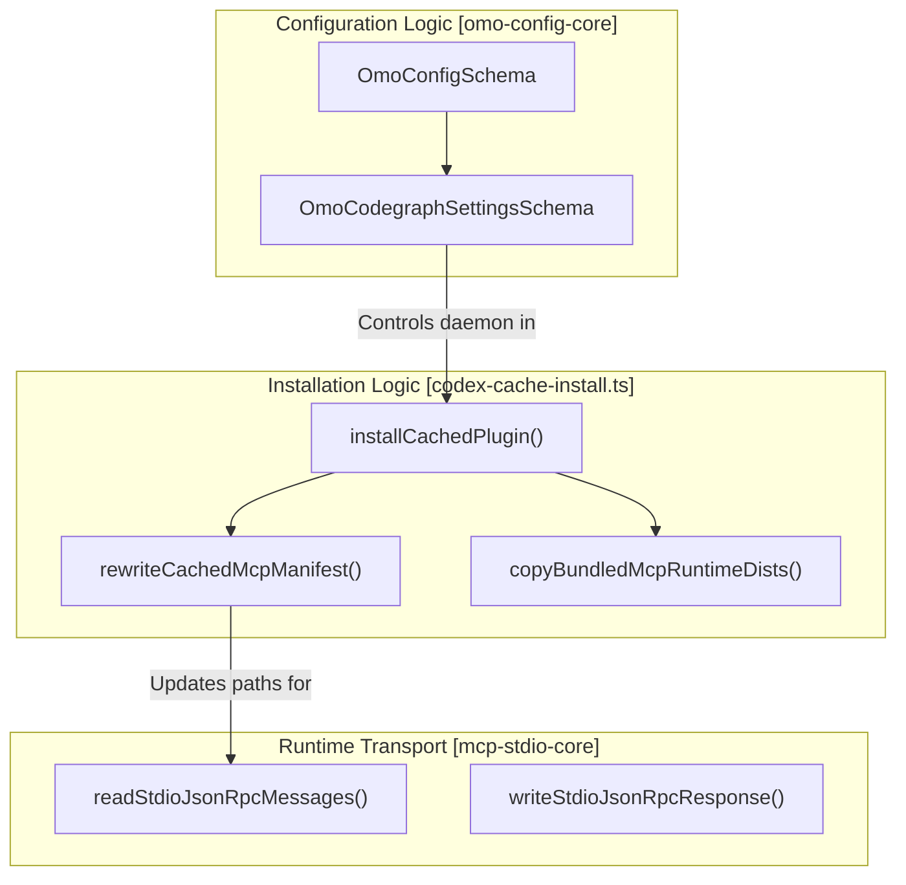

# MCP Configuration

Relevant source files

The following files were used as context for generating this wiki page:

- [.agents/AGENTS.md](https://github.com/code-yeongyu/oh-my-openagent/blob/HEAD/.agents/AGENTS.md)
- [.agents/skills/work-with-pr-workspace/iteration-1/eval-5/with_skill/outputs/execution-plan.md](https://github.com/code-yeongyu/oh-my-openagent/blob/HEAD/.agents/skills/work-with-pr-workspace/iteration-1/eval-5/with_skill/outputs/execution-plan.md)
- [.omo/evidence/20260730-senpi-task-padding/green-prompt.txt](https://github.com/code-yeongyu/oh-my-openagent/blob/HEAD/.omo/evidence/20260730-senpi-task-padding/green-prompt.txt)
- [.omo/evidence/20260730-senpi-task-padding/red-prompt.txt](https://github.com/code-yeongyu/oh-my-openagent/blob/HEAD/.omo/evidence/20260730-senpi-task-padding/red-prompt.txt)
- [.omo/evidence/20260809-omo-agent-toolkit-rename/task-5.txt](https://github.com/code-yeongyu/oh-my-openagent/blob/HEAD/.omo/evidence/20260809-omo-agent-toolkit-rename/task-5.txt)
- [.opencode/AGENTS.md](https://github.com/code-yeongyu/oh-my-openagent/blob/HEAD/.opencode/AGENTS.md)
- [.opencode/skills/work-with-pr-workspace/iteration-1/eval-5/with_skill/outputs/execution-plan.md](https://github.com/code-yeongyu/oh-my-openagent/blob/HEAD/.opencode/skills/work-with-pr-workspace/iteration-1/eval-5/with_skill/outputs/execution-plan.md)
- [CHANGELOG.md](https://github.com/code-yeongyu/oh-my-openagent/blob/HEAD/CHANGELOG.md)
- [README.ja.md](https://github.com/code-yeongyu/oh-my-openagent/blob/HEAD/README.ja.md)
- [README.ko.md](https://github.com/code-yeongyu/oh-my-openagent/blob/HEAD/README.ko.md)
- [README.md](https://github.com/code-yeongyu/oh-my-openagent/blob/HEAD/README.md)
- [README.ru.md](https://github.com/code-yeongyu/oh-my-openagent/blob/HEAD/README.ru.md)
- [README.zh-cn.md](https://github.com/code-yeongyu/oh-my-openagent/blob/HEAD/README.zh-cn.md)
- [assets/oh-my-opencode.schema.json](https://github.com/code-yeongyu/oh-my-openagent/blob/HEAD/assets/oh-my-opencode.schema.json)
- [assets/omo.schema.json](https://github.com/code-yeongyu/oh-my-openagent/blob/HEAD/assets/omo.schema.json)
- [docs/AGENTS.md](https://github.com/code-yeongyu/oh-my-openagent/blob/HEAD/docs/AGENTS.md)
- [docs/examples/coding-focused.jsonc](https://github.com/code-yeongyu/oh-my-openagent/blob/HEAD/docs/examples/coding-focused.jsonc)
- [docs/examples/default.jsonc](https://github.com/code-yeongyu/oh-my-openagent/blob/HEAD/docs/examples/default.jsonc)
- [docs/examples/planning-focused.jsonc](https://github.com/code-yeongyu/oh-my-openagent/blob/HEAD/docs/examples/planning-focused.jsonc)
- [docs/guide/agent-model-matching.md](https://github.com/code-yeongyu/oh-my-openagent/blob/HEAD/docs/guide/agent-model-matching.md)
- [docs/guide/installation.md](https://github.com/code-yeongyu/oh-my-openagent/blob/HEAD/docs/guide/installation.md)
- [docs/guide/orchestration.md](https://github.com/code-yeongyu/oh-my-openagent/blob/HEAD/docs/guide/orchestration.md)
- [docs/guide/overview.md](https://github.com/code-yeongyu/oh-my-openagent/blob/HEAD/docs/guide/overview.md)
- [docs/guide/senpi-task.md](https://github.com/code-yeongyu/oh-my-openagent/blob/HEAD/docs/guide/senpi-task.md)
- [docs/guide/team-mode.md](https://github.com/code-yeongyu/oh-my-openagent/blob/HEAD/docs/guide/team-mode.md)
- [docs/reference/cli.md](https://github.com/code-yeongyu/oh-my-openagent/blob/HEAD/docs/reference/cli.md)
- [docs/reference/codex-telemetry.md](https://github.com/code-yeongyu/oh-my-openagent/blob/HEAD/docs/reference/codex-telemetry.md)
- [docs/reference/configuration.md](https://github.com/code-yeongyu/oh-my-openagent/blob/HEAD/docs/reference/configuration.md)
- [docs/reference/features.md](https://github.com/code-yeongyu/oh-my-openagent/blob/HEAD/docs/reference/features.md)
- [docs/reference/known-issues.md](https://github.com/code-yeongyu/oh-my-openagent/blob/HEAD/docs/reference/known-issues.md)
- [docs/reference/omo-json.md](https://github.com/code-yeongyu/oh-my-openagent/blob/HEAD/docs/reference/omo-json.md)
- [docs/reference/prompt-async-gate-rfc.md](https://github.com/code-yeongyu/oh-my-openagent/blob/HEAD/docs/reference/prompt-async-gate-rfc.md)
- [docs/reference/rules-injection-cross-module-comparison.md](https://github.com/code-yeongyu/oh-my-openagent/blob/HEAD/docs/reference/rules-injection-cross-module-comparison.md)
- [packages/model-core/AGENTS.md](https://github.com/code-yeongyu/oh-my-openagent/blob/HEAD/packages/model-core/AGENTS.md)
- [packages/omo-codex/README.md](https://github.com/code-yeongyu/oh-my-openagent/blob/HEAD/packages/omo-codex/README.md)
- [packages/omo-codex/plugin/README.md](https://github.com/code-yeongyu/oh-my-openagent/blob/HEAD/packages/omo-codex/plugin/README.md)
- [packages/omo-codex/plugin/components/start-work-continuation/AGENTS.md](https://github.com/code-yeongyu/oh-my-openagent/blob/HEAD/packages/omo-codex/plugin/components/start-work-continuation/AGENTS.md)
- [packages/omo-codex/tsconfig.json](https://github.com/code-yeongyu/oh-my-openagent/blob/HEAD/packages/omo-codex/tsconfig.json)
- [packages/omo-config-core/AGENTS.md](https://github.com/code-yeongyu/oh-my-openagent/blob/HEAD/packages/omo-config-core/AGENTS.md)
- [packages/omo-opencode/src/agents/hephaestus/AGENTS.md](https://github.com/code-yeongyu/oh-my-openagent/blob/HEAD/packages/omo-opencode/src/agents/hephaestus/AGENTS.md)
- [packages/omo-opencode/src/cli/doctor/AGENTS.md](https://github.com/code-yeongyu/oh-my-openagent/blob/HEAD/packages/omo-opencode/src/cli/doctor/AGENTS.md)
- [packages/omo-opencode/src/config/schema/categories.ts](https://github.com/code-yeongyu/oh-my-openagent/blob/HEAD/packages/omo-opencode/src/config/schema/categories.ts)
- [packages/omo-opencode/src/shared/markdown-link-audit.test.ts](https://github.com/code-yeongyu/oh-my-openagent/blob/HEAD/packages/omo-opencode/src/shared/markdown-link-audit.test.ts)
- [packages/omo-senpi/AGENTS.md](https://github.com/code-yeongyu/oh-my-openagent/blob/HEAD/packages/omo-senpi/AGENTS.md)
- [packages/omo-senpi/src/components/task/usage-guidance.test.ts](https://github.com/code-yeongyu/oh-my-openagent/blob/HEAD/packages/omo-senpi/src/components/task/usage-guidance.test.ts)
- [packages/omo-senpi/src/components/task/usage-guidance.ts](https://github.com/code-yeongyu/oh-my-openagent/blob/HEAD/packages/omo-senpi/src/components/task/usage-guidance.ts)
- [packages/senpi-task/AGENTS.md](https://github.com/code-yeongyu/oh-my-openagent/blob/HEAD/packages/senpi-task/AGENTS.md)
- [packages/shared-skills/AGENTS.md](https://github.com/code-yeongyu/oh-my-openagent/blob/HEAD/packages/shared-skills/AGENTS.md)
- [packages/shared-skills/skills/ultimate-browsing/engine/AGENTS.md](https://github.com/code-yeongyu/oh-my-openagent/blob/HEAD/packages/shared-skills/skills/ultimate-browsing/engine/AGENTS.md)
- [postinstall.test.ts](https://github.com/code-yeongyu/oh-my-openagent/blob/HEAD/postinstall.test.ts)
- [script/AGENTS.md](https://github.com/code-yeongyu/oh-my-openagent/blob/HEAD/script/AGENTS.md)

This page documents the Model Context Protocol (MCP) configuration in the oh-my-openagent codebase. It covers the 3-tier MCP system design, MCP configuration options, JSON-RPC stdio transport implementation, and OAuth authentication for MCP connections.

---

## Overview and Scope

The MCP system orchestrates external model and tool servers with standardized JSON-RPC stdio communication. MCPs serve as external tools or microservices that agents call to extend their capabilities.

Configuration supports three tiers of MCPs:

1.  **Built-in MCPs:** Local or bundled MCP servers integrated directly (e.g., LSP, CodeGraph).
2.  **Claude Code MCPs:** MCP servers configured from local `.mcp.json` or `~/.claude.json` config files.
3.  **Skill-embedded MCPs:** MCP servers declared dynamically inside agent skills.

This page details the configuration options, data flow across these tiers, the core MCP server implementation, and authentication via OAuth for MCP connections.

---

## Three-Tier MCP Architecture

The MCP system merges MCP server definitions from three input tiers in priority order:

-   **Tier 1: Built-in MCPs** provide default static and remote MCP servers. This includes the `codegraph` daemon and `lsp` services.
-   **Tier 2: Claude Code MCPs** read user or project MCP definitions from `.mcp.json` or `~/.claude.json` configuration files, with environment variable expansion and security controls.
-   **Tier 3: Skill-Embedded MCPs** dynamically register MCP servers declared as YAML metadata inside skills found in `.opencode/skills/` or `.agents/`.

### MCP 3-Tier Integration Data Flow

```mermaid
graph TD
    subgraph Tier_1_Built_in_MCPs ["Tier 1: Built-in MCPs"]
        Builtin["Built-in Registry"]
        LSP["lsp-tools-mcp"]
        CG["codegraph daemon"]
        Builtin --> LSP & CG
    end

    subgraph Tier_2_Claude_Code_MCPs ["Tier 2: Claude Code MCPs"]
        Loader["loadMcpConfigs()"]
        McpJson[".mcp.json (Project)"]
        ClaudeJson["~/.claude.json (User)"]
        EnvExp["expandEnvVarsInObject()"]
        Loader --> McpJson & ClaudeJson --> EnvExp
    end

    subgraph Tier_3_Skill_Embedded_MCPs ["Tier 3: Skill-Embedded MCPs"]
        SkillMgr["SkillMcpManager"]
        SkillYAML["SKILL.md YAML MCP Definitions"]
        OAuth["OAuth 2.0 + PKCE Authentication"]
        SkillMgr --> SkillYAML
        SkillMgr --> OAuth
    end

    subgraph Registry_Execution ["Registry & Execution"]
        Merge["applyMcpConfig() merges all MCPs"]
        Client["McpClientCore.getOrCreateClient()"]
        Stdio["createStdioClient()"]
        
        Tier1["Tier 1 MCPs"] --> Merge
        Tier2["Tier 2 MCPs"] --> Merge
        Tier3["Tier 3 MCPs"] --> Merge
        Merge --> Client
        Client --> Stdio
    end
```

Sources: [packages/omo-codex/src/install/codex-cache-mcp-manifest.ts:7-25](https://github.com/code-yeongyu/oh-my-openagent/blob/HEAD/packages/omo-codex/src/install/codex-cache-mcp-manifest.ts#L7-L25), [packages/omo-config-core/src/schema/codegraph.ts:1-10](https://github.com/code-yeongyu/oh-my-openagent/blob/HEAD/packages/omo-config-core/src/schema/codegraph.ts#L1-L10), [packages/omo-codex/src/install/codex-cache-install.ts:50-52](https://github.com/code-yeongyu/oh-my-openagent/blob/HEAD/packages/omo-codex/src/install/codex-cache-install.ts#L50-L52)

---

## JSON-RPC Stdio Transport Layer

MCP communication uses JSON-RPC 2.0 over standard input/output streams. The `mcp-stdio-core` package implements the core transport primitives.

### Transport Features

-   Supports **two framing modes**:
    -   **Line-delimited JSON**: Simple `\n` separated JSON objects.
    -   **Content-Length framed**: Standard LSP-style framing with HTTP-like `Content-Length` headers.
-   Reads from a Node `Readable` stream asynchronously yielding parsed messages.
-   Writes JSON-RPC responses with corresponding framing according to the request.

### Core Functions

-   `readStdioJsonRpcMessages(input: Readable)`
    Generator yielding parsed requests or parse errors from the input stream. Handles partial/incomplete messages gracefully.

-   `writeStdioJsonRpcResponse(output: Writable, response, responseMode)`
    Writes a JSON-RPC response to an output stream using the appropriate framing mode.

### Server Implementation

`runJsonRpcStdioServer(config)` creates an async JSON-RPC stdio server:

-   Reads requests from `config.input` and calls `config.handler`.
-   Writes handler responses to `config.output`.
-   Implements idle timeout with automatic shutdown.
-   Optionally watches parent process liveness and shuts down if parent exits.

Sources: [packages/omo-codex/src/install/codex-cache.test.ts:14-31](https://github.com/code-yeongyu/oh-my-openagent/blob/HEAD/packages/omo-codex/src/install/codex-cache.test.ts#L14-L31), [packages/omo-codex/scripts/install-dist/install-local.mjs:66-86](https://github.com/code-yeongyu/oh-my-openagent/blob/HEAD/packages/omo-codex/scripts/install-dist/install-local.mjs#L66-L86)

---

## Tier 1: Built-in MCPs

Tier 1 MCPs provide essential, always-available MCP servers. A significant component here is the `codegraph` settings managed in the unified config.

### CodeGraph MCP Configuration
The `codegraph` setting in `omo.jsonc` controls the behavior of the CodeGraph MCP daemon.

| Field | Type | Default | Description |
|-------|------|---------|-------------|
| `daemon` | boolean | `true` | Enables or disables the CodeGraph MCP daemon. |

### LSP MCP
The LSP MCP hosts tools like `lsp_diagnostics`, `lsp_goto_definition`, etc. During plugin installation, relative paths in the MCP manifest for these tools are rewritten to absolute paths in the plugin cache to ensure runtime reliability.

Sources: [packages/omo-config-core/src/schema/codegraph.ts:5-18](https://github.com/code-yeongyu/oh-my-openagent/blob/HEAD/packages/omo-config-core/src/schema/codegraph.ts#L5-L18), [packages/omo-codex/src/install/codex-cache-mcp-manifest.ts:7-15](https://github.com/code-yeongyu/oh-my-openagent/blob/HEAD/packages/omo-codex/src/install/codex-cache-mcp-manifest.ts#L7-L15)

---

## Tier 2: Claude Code MCPs Configuration

This tier loads MCP definitions from standard Claude Code config files with environment variable expansion. During the installation of the `omo-codex` adapter, these manifests are sanitized and paths are localized.

### MCP Manifest Rewriting
The function `rewriteCachedMcpManifest` is responsible for updating the `.mcp.json` manifest during the plugin caching process. It:
1.  Converts relative `args` and `cwd` paths to absolute paths within the plugin cache.
2.  Handles bundled MCP runtime distributions, ensuring that external dependencies are correctly mapped to their cached locations.

### Environment Variable Security
To limit potential security risks, the configuration resolution logic ensures that environment variables are expanded but filtered through sanitization logic (e.g., `sanitizeNpmInstallEnv`) to prevent sensitive leaks like `npm_config_allow_scripts` during MCP setup.

Sources: [packages/omo-codex/src/install/codex-cache-mcp-manifest.ts:7-25](https://github.com/code-yeongyu/oh-my-openagent/blob/HEAD/packages/omo-codex/src/install/codex-cache-mcp-manifest.ts#L7-L25), [packages/omo-codex/src/install/codex-cache-install.ts:25-50](https://github.com/code-yeongyu/oh-my-openagent/blob/HEAD/packages/omo-codex/src/install/codex-cache-install.ts#L25-L50), [packages/omo-codex/src/install/codex-cache.test.ts:61-95](https://github.com/code-yeongyu/oh-my-openagent/blob/HEAD/packages/omo-codex/src/install/codex-cache.test.ts#L61-L95)

---

## Tier 3: Skill-Embedded MCPs

Skills can declare MCP servers inside their YAML metadata, allowing dynamic registration.

### Skill MCP Lifecycle
-   Skills located in `.opencode/skills/` or `.agents/` directories can embed MCP definitions.
-   The system synchronizes these skills and ensures that any `spawn_agent` calls or MCP tool definitions follow compatibility guidance (e.g., setting `fork_context=false`).
-   During installation, the `maybeRunNpmSyncSkills` function ensures that skill-based dependencies are resolved.

Sources: [packages/omo-codex/plugin/test/aggregate-skills.test.mjs:13-49](https://github.com/code-yeongyu/oh-my-openagent/blob/HEAD/packages/omo-codex/plugin/test/aggregate-skills.test.mjs#L13-L49), [packages/omo-codex/src/install/codex-cache-install.ts:48-48](https://github.com/code-yeongyu/oh-my-openagent/blob/HEAD/packages/omo-codex/src/install/codex-cache-install.ts#L48)

---

## OAuth Authentication for MCP Servers

For secure remote MCP servers, an OAuth 2.0 + PKCE + Dynamic Client Registration (DCR) flow is implemented.

### Features
-   Supports user login, logout, and session status via CLI subcommands.
-   Manages token storage securely for reuse across sessions.
-   Transparently injects OAuth tokens into MCP client requests to authorized MCP servers.

This mechanism enables seamless integration with protected MCP services, ensuring capabilities are accessible only to authenticated users.

---

## Connection Management and Cleanup

Proper connection lifecycle and resource cleanup are critical for long-running MCP processes.

### Entity Mapping Diagram
This diagram bridges the "Natural Language Space" of MCP management to the "Code Entity Space" of the installation and transport logic.

Sources: [packages/omo-codex/src/install/codex-cache-install.ts:31-59](https://github.com/code-yeongyu/oh-my-openagent/blob/HEAD/packages/omo-codex/src/install/codex-cache-install.ts#L31-L59), [packages/omo-codex/src/install/codex-cache-mcp-manifest.ts:7-20](https://github.com/code-yeongyu/oh-my-openagent/blob/HEAD/packages/omo-codex/src/install/codex-cache-mcp-manifest.ts#L7-L20)

---

## Configuration Reference

### Key MCP Configuration Options in `omo.jsonc`

| Property | Type | Description |
|----------|------|-------------|
| `codegraph.daemon` | boolean | Toggle the built-in CodeGraph MCP server. |
| `disabled_mcps` | string[] | An array of MCP names to disable. [assets/oh-my-opencode.schema.json:32-37](https://github.com/code-yeongyu/oh-my-openagent/blob/HEAD/assets/oh-my-opencode.schema.json#L32-L37) |
| `mcp_env_allowlist` | string[] | A list of environment variables that MCPs are allowed to access. [assets/oh-my-opencode.schema.json:83-88](https://github.com/code-yeongyu/oh-my-openagent/blob/HEAD/assets/oh-my-opencode.schema.json#L83-L88) |
| `[codex].models` | object | Model catalog overrides for the Codex harness MCPs. |
| `_migrations` | string[] | Tracks completed MCP configuration migrations. |

Sources: [packages/omo-config-core/src/schema/codegraph.ts:16-18](https://github.com/code-yeongyu/oh-my-openagent/blob/HEAD/packages/omo-config-core/src/schema/codegraph.ts#L16-L18), [packages/omo-config-core/src/schema/config.ts:37-51](https://github.com/code-yeongyu/oh-my-openagent/blob/HEAD/packages/omo-config-core/src/schema/config.ts#L37-L51), [assets/oh-my-opencode.schema.json:32-37](https://github.com/code-yeongyu/oh-my-openagent/blob/HEAD/assets/oh-my-opencode.schema.json#L32-L37), [assets/oh-my-opencode.schema.json:83-88](https://github.com/code-yeongyu/oh-my-openagent/blob/HEAD/assets/oh-my-opencode.schema.json#L83-L88)