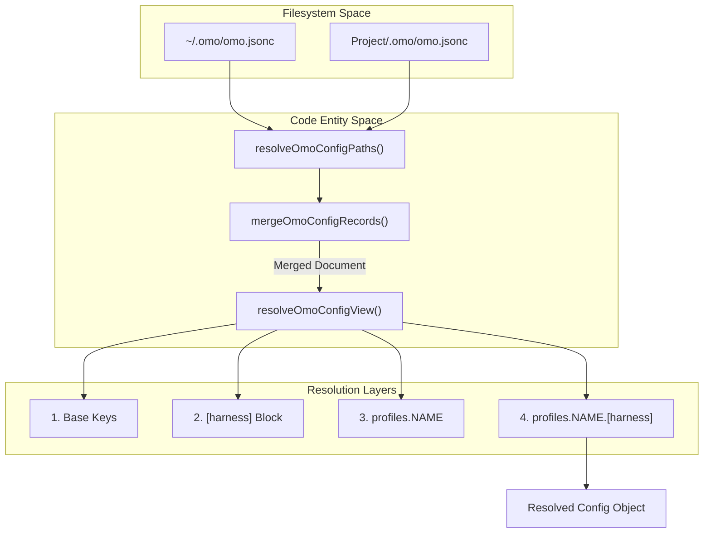
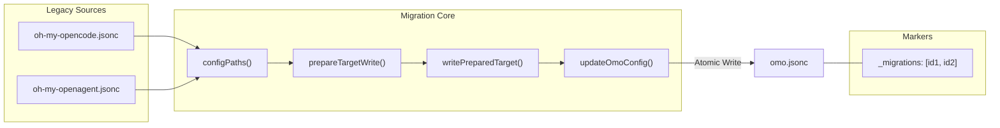

# Harness Blocks and Profiles

<details>
<summary>Relevant source files</summary>

The following files were used as context for generating this wiki page:

- [packages/omo-config-core/src/index.ts](https://github.com/code-yeongyu/oh-my-openagent/blob/HEAD/packages/omo-config-core/src/index.ts)
- [packages/omo-config-core/src/internal/index.ts](https://github.com/code-yeongyu/oh-my-openagent/blob/HEAD/packages/omo-config-core/src/internal/index.ts)
- [packages/omo-config-core/src/internal/jsonc-parse.ts](https://github.com/code-yeongyu/oh-my-openagent/blob/HEAD/packages/omo-config-core/src/internal/jsonc-parse.ts)
- [packages/omo-config-core/src/internal/plain-object.ts](https://github.com/code-yeongyu/oh-my-openagent/blob/HEAD/packages/omo-config-core/src/internal/plain-object.ts)
- [packages/omo-config-core/src/internal/posix-path.ts](https://github.com/code-yeongyu/oh-my-openagent/blob/HEAD/packages/omo-config-core/src/internal/posix-path.ts)
- [packages/omo-config-core/src/loader/legacy-user-config-purge.test.ts](https://github.com/code-yeongyu/oh-my-openagent/blob/HEAD/packages/omo-config-core/src/loader/legacy-user-config-purge.test.ts)
- [packages/omo-config-core/src/loader/loader.test.ts](https://github.com/code-yeongyu/oh-my-openagent/blob/HEAD/packages/omo-config-core/src/loader/loader.test.ts)
- [packages/omo-config-core/src/loader/paths.test.ts](https://github.com/code-yeongyu/oh-my-openagent/blob/HEAD/packages/omo-config-core/src/loader/paths.test.ts)
- [packages/omo-config-core/src/loader/paths.ts](https://github.com/code-yeongyu/oh-my-openagent/blob/HEAD/packages/omo-config-core/src/loader/paths.ts)
- [packages/omo-config-core/src/loader/project-config-path-discovery.test.ts](https://github.com/code-yeongyu/oh-my-openagent/blob/HEAD/packages/omo-config-core/src/loader/project-config-path-discovery.test.ts)
- [packages/omo-config-core/src/loader/resolution.test.ts](https://github.com/code-yeongyu/oh-my-openagent/blob/HEAD/packages/omo-config-core/src/loader/resolution.test.ts)
- [packages/omo-config-core/src/loader/types.ts](https://github.com/code-yeongyu/oh-my-openagent/blob/HEAD/packages/omo-config-core/src/loader/types.ts)
- [packages/omo-config-core/src/migration/backup-move.ts](https://github.com/code-yeongyu/oh-my-openagent/blob/HEAD/packages/omo-config-core/src/migration/backup-move.ts)
- [packages/omo-config-core/src/migration/batch.test.ts](https://github.com/code-yeongyu/oh-my-openagent/blob/HEAD/packages/omo-config-core/src/migration/batch.test.ts)
- [packages/omo-config-core/src/migration/batch.ts](https://github.com/code-yeongyu/oh-my-openagent/blob/HEAD/packages/omo-config-core/src/migration/batch.ts)
- [packages/omo-config-core/src/migration/commit.ts](https://github.com/code-yeongyu/oh-my-openagent/blob/HEAD/packages/omo-config-core/src/migration/commit.ts)
- [packages/omo-config-core/src/migration/engine.ts](https://github.com/code-yeongyu/oh-my-openagent/blob/HEAD/packages/omo-config-core/src/migration/engine.ts)
- [packages/omo-config-core/src/migration/journal.ts](https://github.com/code-yeongyu/oh-my-openagent/blob/HEAD/packages/omo-config-core/src/migration/journal.ts)
- [packages/omo-config-core/src/migration/lock.test.ts](https://github.com/code-yeongyu/oh-my-openagent/blob/HEAD/packages/omo-config-core/src/migration/lock.test.ts)
- [packages/omo-config-core/src/migration/lock.ts](https://github.com/code-yeongyu/oh-my-openagent/blob/HEAD/packages/omo-config-core/src/migration/lock.ts)
- [packages/omo-config-core/src/migration/merge-commit.test.ts](https://github.com/code-yeongyu/oh-my-openagent/blob/HEAD/packages/omo-config-core/src/migration/merge-commit.test.ts)
- [packages/omo-config-core/src/migration/merge.ts](https://github.com/code-yeongyu/oh-my-openagent/blob/HEAD/packages/omo-config-core/src/migration/merge.ts)
- [packages/omo-config-core/src/migration/migration-test-support.ts](https://github.com/code-yeongyu/oh-my-openagent/blob/HEAD/packages/omo-config-core/src/migration/migration-test-support.ts)
- [packages/omo-config-core/src/migration/predicate.test.ts](https://github.com/code-yeongyu/oh-my-openagent/blob/HEAD/packages/omo-config-core/src/migration/predicate.test.ts)
- [packages/omo-config-core/src/migration/predicate.ts](https://github.com/code-yeongyu/oh-my-openagent/blob/HEAD/packages/omo-config-core/src/migration/predicate.ts)
- [packages/omo-config-core/src/migration/recovery.test.ts](https://github.com/code-yeongyu/oh-my-openagent/blob/HEAD/packages/omo-config-core/src/migration/recovery.test.ts)
- [packages/omo-config-core/src/migration/recovery.ts](https://github.com/code-yeongyu/oh-my-openagent/blob/HEAD/packages/omo-config-core/src/migration/recovery.ts)
- [packages/omo-config-core/src/migration/transaction.test.ts](https://github.com/code-yeongyu/oh-my-openagent/blob/HEAD/packages/omo-config-core/src/migration/transaction.test.ts)
- [packages/omo-config-core/src/migration/types.ts](https://github.com/code-yeongyu/oh-my-openagent/blob/HEAD/packages/omo-config-core/src/migration/types.ts)
- [packages/omo-config-core/src/models/index.ts](https://github.com/code-yeongyu/oh-my-openagent/blob/HEAD/packages/omo-config-core/src/models/index.ts)
- [packages/omo-config-core/src/models/model-catalog-cycles.ts](https://github.com/code-yeongyu/oh-my-openagent/blob/HEAD/packages/omo-config-core/src/models/model-catalog-cycles.ts)
- [packages/omo-config-core/src/models/model-reference-resolution.test.ts](https://github.com/code-yeongyu/oh-my-openagent/blob/HEAD/packages/omo-config-core/src/models/model-reference-resolution.test.ts)
- [packages/omo-config-core/src/models/model-reference-resolution.ts](https://github.com/code-yeongyu/oh-my-openagent/blob/HEAD/packages/omo-config-core/src/models/model-reference-resolution.ts)
- [packages/omo-config-core/src/writer/types.ts](https://github.com/code-yeongyu/oh-my-openagent/blob/HEAD/packages/omo-config-core/src/writer/types.ts)
- [packages/omo-config-core/src/writer/writer-security.test.ts](https://github.com/code-yeongyu/oh-my-openagent/blob/HEAD/packages/omo-config-core/src/writer/writer-security.test.ts)
- [packages/omo-config-core/src/writer/writer.test.ts](https://github.com/code-yeongyu/oh-my-openagent/blob/HEAD/packages/omo-config-core/src/writer/writer.test.ts)
- [packages/omo-config-core/src/writer/writer.ts](https://github.com/code-yeongyu/oh-my-openagent/blob/HEAD/packages/omo-config-core/src/writer/writer.ts)
- [packages/omo-opencode/src/config-migration/discovery-paths.ts](https://github.com/code-yeongyu/oh-my-openagent/blob/HEAD/packages/omo-opencode/src/config-migration/discovery-paths.ts)
- [packages/omo-opencode/src/config-migration/discovery-roots.ts](https://github.com/code-yeongyu/oh-my-openagent/blob/HEAD/packages/omo-opencode/src/config-migration/discovery-roots.ts)
- [packages/omo-opencode/src/config-migration/discovery-windows-host.test.ts](https://github.com/code-yeongyu/oh-my-openagent/blob/HEAD/packages/omo-opencode/src/config-migration/discovery-windows-host.test.ts)
- [packages/omo-opencode/src/config-migration/discovery.test.ts](https://github.com/code-yeongyu/oh-my-openagent/blob/HEAD/packages/omo-opencode/src/config-migration/discovery.test.ts)
- [packages/omo-opencode/src/config-migration/discovery.ts](https://github.com/code-yeongyu/oh-my-openagent/blob/HEAD/packages/omo-opencode/src/config-migration/discovery.ts)
- [packages/omo-opencode/src/config-migration/types.ts](https://github.com/code-yeongyu/oh-my-openagent/blob/HEAD/packages/omo-opencode/src/config-migration/types.ts)
- [packages/omo-opencode/src/startup-migration.test.ts](https://github.com/code-yeongyu/oh-my-openagent/blob/HEAD/packages/omo-opencode/src/startup-migration.test.ts)
- [packages/omo-senpi/src/components/config-resolution/index.ts](https://github.com/code-yeongyu/oh-my-openagent/blob/HEAD/packages/omo-senpi/src/components/config-resolution/index.ts)
- [packages/omo-senpi/src/components/config-startup/index.test.ts](https://github.com/code-yeongyu/oh-my-openagent/blob/HEAD/packages/omo-senpi/src/components/config-startup/index.test.ts)
- [packages/omo-senpi/src/components/config-startup/index.ts](https://github.com/code-yeongyu/oh-my-openagent/blob/HEAD/packages/omo-senpi/src/components/config-startup/index.ts)

</details>


The unified configuration system, centered around `omo.jsonc`, provides a single harness-spanning surface for the OpenCode plugin, the Senpi adapter, and the Codex environment. This system enables platform-specific overrides via **Harness Blocks** and environment-specific switching via **Profiles**, all while maintaining a shared base of agent and category definitions.

## 4-Layer Resolution Order

When a harness (e.g., `omo-senpi`) loads its configuration via `loadOmoConfig` [packages/omo-config-core/src/index.ts:10-10](https://github.com/code-yeongyu/oh-my-openagent/blob/HEAD/packages/omo-config-core/src/index.ts#L10) (which internally calls `loadOmoConfig` [packages/omo-config-core/src/loader/loader.ts:133-183](https://github.com/code-yeongyu/oh-my-openagent/blob/HEAD/packages/omo-config-core/src/loader/loader.ts#L133-L183)), it resolves a final view by folding four distinct layers in a specific priority order. Later layers overwrite previous ones.

1.  **Shared Base Keys**: Top-level keys like `categories`, `agents`, and `models` that apply to all harnesses.
2.  **Harness Block**: A block named after the current harness (`[opencode]`, `[senpi]`, or `[codex]`).
3.  **Active Profile**: Keys found under `profiles.<name>`.
4.  **Profile Harness Block**: Keys found under `profiles.<name>.[harness]`.

### Profile Activation
The active profile name is determined by `resolveOmoProfileName` [packages/omo-config-core/src/loader/resolution.ts:10-10](https://github.com/code-yeongyu/oh-my-openagent/blob/HEAD/packages/omo-config-core/src/loader/resolution.ts#L10) using the following priority:
1.  `OMO_PROFILE` environment variable.
2.  `OCX_PROFILE` (typically set via `ocx oc -p <name>`).
3.  `OPENCODE_CONFIG_DIR` if the path ends in `profiles/<name>`.

### Data Flow: Config Resolution
The diagram below illustrates how `loadOmoConfig` and `resolveOmoConfigPaths` interact to produce the final runtime configuration.

**Config Resolution Logic**

Sources: [packages/omo-config-core/src/loader/paths.ts:104-113](https://github.com/code-yeongyu/oh-my-openagent/blob/HEAD/packages/omo-config-core/src/loader/paths.ts#L104-L113), [packages/omo-config-core/src/loader/resolution.ts:10-10](https://github.com/code-yeongyu/oh-my-openagent/blob/HEAD/packages/omo-config-core/src/loader/resolution.ts#L10), [packages/omo-config-core/src/loader/loader.ts:152-164](https://github.com/code-yeongyu/oh-my-openagent/blob/HEAD/packages/omo-config-core/src/loader/loader.ts#L152-L164)

## Harness Blocks

Harness blocks allow specific adapters to override shared settings or define harness-only features.

*   **`[opencode]`**: A block containing OpenCode-specific plugin configuration (hooks, skills, tmux settings).
*   **`[senpi]` & `[codex]`**: Typed blocks that accept shared base keys (`agents`, `categories`, `task`, etc.). These are strictly validated against the `OmoConfigSchema` [packages/omo-config-core/src/schema.ts:10-10](https://github.com/code-yeongyu/oh-my-openagent/blob/HEAD/packages/omo-config-core/src/schema.ts#L10).

### Shared Models Catalog
The `models` block serves as a shared registry. Agents and categories can refer to these short-names instead of full provider strings. The system supports a unified `reasoning` field, which replaces the legacy `reasoningEffort` during resolution [packages/omo-config-core/src/models/model-reference-resolution.ts:10-10](https://github.com/code-yeongyu/oh-my-openagent/blob/HEAD/packages/omo-config-core/src/models/model-reference-resolution.ts#L10).

```jsonc
{
  "models": {
    "pro": { "model": "anthropic/claude-3-5-sonnet", "reasoning": "high" }
  },
  "categories": {
    "coding": { "model": "pro" }
  }
}
```
Sources: [assets/omo.schema.json:22-57](https://github.com/code-yeongyu/oh-my-openagent/blob/HEAD/assets/omo.schema.json#L22-L57), [packages/omo-config-core/src/loader/top-level-senpi-config-characterization.test.ts:46-75](https://github.com/code-yeongyu/oh-my-openagent/blob/HEAD/packages/omo-config-core/src/loader/top-level-senpi-config-characterization.test.ts#L46-L75)

## Migration Engine

The `omo-config-core` package includes a **lock+journal migration engine** designed to import legacy configuration files into the unified `omo.jsonc` format.

### Legacy Discovery
The engine searches for legacy files such as `oh-my-openagent.jsonc` and `oh-my-opencode.jsonc` in both user config directories and project-level `.omo/` folders [packages/omo-opencode/src/config-migration/discovery-paths.ts:9-14](https://github.com/code-yeongyu/oh-my-openagent/blob/HEAD/packages/omo-opencode/src/config-migration/discovery-paths.ts#L9-L14).

### Transactional Integrity
The migration process uses a `_migrations` array in the target file to track applied updates [packages/omo-config-core/src/migration/commit.ts:26-33](https://github.com/code-yeongyu/oh-my-openagent/blob/HEAD/packages/omo-config-core/src/migration/commit.ts#L26-L33).
1.  **Validation**: Ensures the target path is a valid omo config location (User or Project scope) [packages/omo-config-core/src/migration/commit.ts:42-53](https://github.com/code-yeongyu/oh-my-openagent/blob/HEAD/packages/omo-config-core/src/migration/commit.ts#L42-L53).
2.  **Journaling**: Prepares edits using `prepareTargetWrite` to merge additions without clobbering existing user settings [packages/omo-config-core/src/migration/commit.ts:79-91](https://github.com/code-yeongyu/oh-my-openagent/blob/HEAD/packages/omo-config-core/src/migration/commit.ts#L79-L91).
3.  **Atomic Write**: Uses `writeAtomically` in the `writer.ts` module by creating a `.tmp` file and renaming it to ensure configuration is never left in a corrupted state [packages/omo-config-core/src/writer/writer.ts:71-86](https://github.com/code-yeongyu/oh-my-openagent/blob/HEAD/packages/omo-config-core/src/writer/writer.ts#L71-L86).

**Migration Data Flow**

Sources: [packages/omo-opencode/src/config-migration/discovery-paths.ts:55-59](https://github.com/code-yeongyu/oh-my-openagent/blob/HEAD/packages/omo-opencode/src/config-migration/discovery-paths.ts#L55-L59), [packages/omo-config-core/src/migration/commit.ts:79-128](https://github.com/code-yeongyu/oh-my-openagent/blob/HEAD/packages/omo-config-core/src/migration/commit.ts#L79-L128), [packages/omo-config-core/src/writer/writer.ts:122-164](https://github.com/code-yeongyu/oh-my-openagent/blob/HEAD/packages/omo-config-core/src/writer/writer.ts#L122-L164)

## Implementation Details

### Path Resolution
The system performs a "farthest-first" walk from the CWD up to the `$HOME` directory to find project-level configurations. It ignores symlinked directories and files for security [packages/omo-config-core/src/loader/paths.ts:75-102](https://github.com/code-yeongyu/oh-my-openagent/blob/HEAD/packages/omo-config-core/src/loader/paths.ts#L75-L102).

### Safety Guards
*   **Symlink Protection**: The `updateOmoConfig` function refuses to edit symlinked config files or configs under symlinked `.omo` directories to prevent accidental modification of shared system files [packages/omo-config-core/src/writer/writer.ts:88-112](https://github.com/code-yeongyu/oh-my-openagent/blob/HEAD/packages/omo-config-core/src/writer/writer.ts#L88-L112).
*   **Backups**: Every write operation creates a timestamped backup (e.g., `omo.jsonc.bak.2026-07-06...`) before applying changes [packages/omo-config-core/src/writer/writer.ts:36-50](https://github.com/code-yeongyu/oh-my-openagent/blob/HEAD/packages/omo-config-core/src/writer/writer.ts#L36-L50).
*   **Validation**: Config layers are validated against `OmoConfigLayerSchema` before merging, and the final merged result is validated against `OmoConfigSchema` [packages/omo-config-core/src/loader/loader.ts:112-118](https://github.com/code-yeongyu/oh-my-openagent/blob/HEAD/packages/omo-config-core/src/loader/loader.ts#L112-L118).

### Key Functions and Classes
| Entity | Location | Role |
| :--- | :--- | :--- |
| `loadOmoConfig` | [packages/omo-config-core/src/index.ts:10](https://github.com/code-yeongyu/oh-my-openagent/blob/HEAD/packages/omo-config-core/src/index.ts#L10) | Main entry point for loading and merging all config layers. |
| `updateOmoConfig` | [packages/omo-config-core/src/writer/writer.ts:122](https://github.com/code-yeongyu/oh-my-openagent/blob/HEAD/packages/omo-config-core/src/writer/writer.ts#L122) | Safely modifies `omo.jsonc` with support for JSONC edits and backups. |
| `resolveOmoConfigPaths` | [packages/omo-config-core/src/loader/paths.ts:104](https://github.com/code-yeongyu/oh-my-openagent/blob/HEAD/packages/omo-config-core/src/loader/paths.ts#L104) | Resolves the hierarchy of user and project config paths. |
| `resolveOmoTaskSettings` | [packages/omo-config-core/src/schema/task.ts:78](https://github.com/code-yeongyu/oh-my-openagent/blob/HEAD/packages/omo-config-core/src/schema/task.ts#L78) | Resolves task settings, calculating `residency_max_children` based on CPU cores if not specified. |

Sources: [packages/omo-config-core/src/loader/paths.ts](https://github.com/code-yeongyu/oh-my-openagent/blob/HEAD/packages/omo-config-core/src/loader/paths.ts), [packages/omo-config-core/src/writer/writer.ts](https://github.com/code-yeongyu/oh-my-openagent/blob/HEAD/packages/omo-config-core/src/writer/writer.ts), [packages/omo-config-core/src/schema/task.ts](https://github.com/code-yeongyu/oh-my-openagent/blob/HEAD/packages/omo-config-core/src/schema/task.ts)