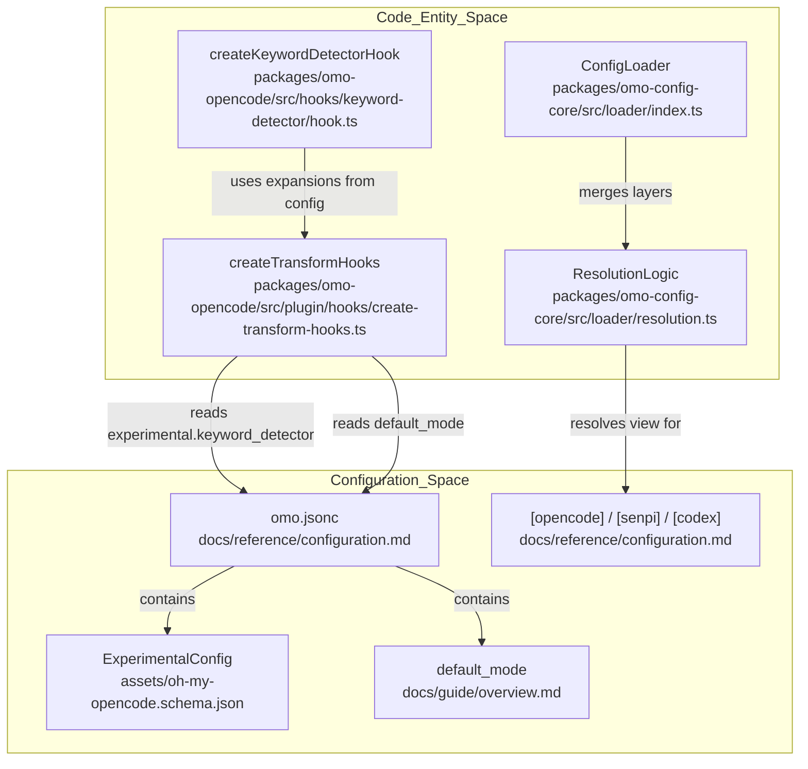
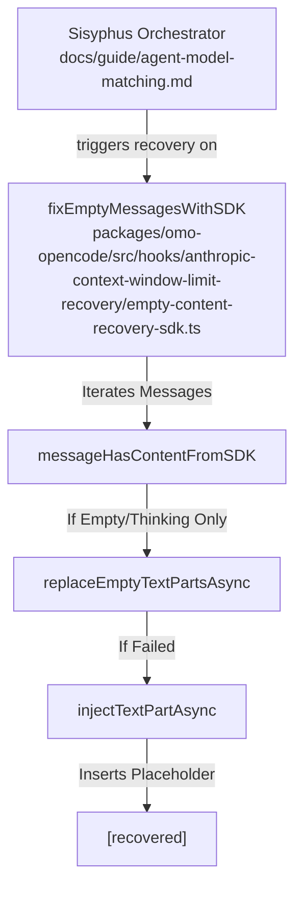

# Experimental Features

Relevant source files

The following files were used as context for generating this wiki page:

- [.agents/skills/work-with-pr-workspace/iteration-1/eval-5/with_skill/outputs/execution-plan.md](https://github.com/code-yeongyu/oh-my-openagent/blob/HEAD/.agents/skills/work-with-pr-workspace/iteration-1/eval-5/with_skill/outputs/execution-plan.md)
- [.omo/evidence/20260809-omo-agent-toolkit-rename/task-5.txt](https://github.com/code-yeongyu/oh-my-openagent/blob/HEAD/.omo/evidence/20260809-omo-agent-toolkit-rename/task-5.txt)
- [.omo/evidence/20260810-omo-native-telemetry/task-4.md](https://github.com/code-yeongyu/oh-my-openagent/blob/HEAD/.omo/evidence/20260810-omo-native-telemetry/task-4.md)
- [.omo/evidence/task-17-subagent-session-resume-revival.txt](https://github.com/code-yeongyu/oh-my-openagent/blob/HEAD/.omo/evidence/task-17-subagent-session-resume-revival.txt)
- [.omo/evidence/task-3-senpi-model-chain-overhaul.txt](https://github.com/code-yeongyu/oh-my-openagent/blob/HEAD/.omo/evidence/task-3-senpi-model-chain-overhaul.txt)
- [.opencode/skills/work-with-pr-workspace/iteration-1/eval-5/with_skill/outputs/execution-plan.md](https://github.com/code-yeongyu/oh-my-openagent/blob/HEAD/.opencode/skills/work-with-pr-workspace/iteration-1/eval-5/with_skill/outputs/execution-plan.md)
- [CHANGELOG.md](https://github.com/code-yeongyu/oh-my-openagent/blob/HEAD/CHANGELOG.md)
- [README.ja.md](https://github.com/code-yeongyu/oh-my-openagent/blob/HEAD/README.ja.md)
- [README.ko.md](https://github.com/code-yeongyu/oh-my-openagent/blob/HEAD/README.ko.md)
- [README.md](https://github.com/code-yeongyu/oh-my-openagent/blob/HEAD/README.md)
- [README.ru.md](https://github.com/code-yeongyu/oh-my-openagent/blob/HEAD/README.ru.md)
- [README.zh-cn.md](https://github.com/code-yeongyu/oh-my-openagent/blob/HEAD/README.zh-cn.md)
- [assets/oh-my-opencode.schema.json](https://github.com/code-yeongyu/oh-my-openagent/blob/HEAD/assets/oh-my-opencode.schema.json)
- [docs/examples/coding-focused.jsonc](https://github.com/code-yeongyu/oh-my-openagent/blob/HEAD/docs/examples/coding-focused.jsonc)
- [docs/examples/default.jsonc](https://github.com/code-yeongyu/oh-my-openagent/blob/HEAD/docs/examples/default.jsonc)
- [docs/examples/planning-focused.jsonc](https://github.com/code-yeongyu/oh-my-openagent/blob/HEAD/docs/examples/planning-focused.jsonc)
- [docs/guide/agent-model-matching.md](https://github.com/code-yeongyu/oh-my-openagent/blob/HEAD/docs/guide/agent-model-matching.md)
- [docs/guide/installation.md](https://github.com/code-yeongyu/oh-my-openagent/blob/HEAD/docs/guide/installation.md)
- [docs/guide/orchestration.md](https://github.com/code-yeongyu/oh-my-openagent/blob/HEAD/docs/guide/orchestration.md)
- [docs/guide/overview.md](https://github.com/code-yeongyu/oh-my-openagent/blob/HEAD/docs/guide/overview.md)
- [docs/guide/team-mode.md](https://github.com/code-yeongyu/oh-my-openagent/blob/HEAD/docs/guide/team-mode.md)
- [docs/reference/cli.md](https://github.com/code-yeongyu/oh-my-openagent/blob/HEAD/docs/reference/cli.md)
- [docs/reference/codex-telemetry.md](https://github.com/code-yeongyu/oh-my-openagent/blob/HEAD/docs/reference/codex-telemetry.md)
- [docs/reference/configuration.md](https://github.com/code-yeongyu/oh-my-openagent/blob/HEAD/docs/reference/configuration.md)
- [docs/reference/features.md](https://github.com/code-yeongyu/oh-my-openagent/blob/HEAD/docs/reference/features.md)
- [docs/reference/known-issues.md](https://github.com/code-yeongyu/oh-my-openagent/blob/HEAD/docs/reference/known-issues.md)
- [docs/reference/prompt-async-gate-rfc.md](https://github.com/code-yeongyu/oh-my-openagent/blob/HEAD/docs/reference/prompt-async-gate-rfc.md)
- [docs/reference/rules-injection-cross-module-comparison.md](https://github.com/code-yeongyu/oh-my-openagent/blob/HEAD/docs/reference/rules-injection-cross-module-comparison.md)
- [packages/omo-codex/README.md](https://github.com/code-yeongyu/oh-my-openagent/blob/HEAD/packages/omo-codex/README.md)
- [packages/omo-codex/plugin/README.md](https://github.com/code-yeongyu/oh-my-openagent/blob/HEAD/packages/omo-codex/plugin/README.md)
- [packages/omo-codex/tsconfig.json](https://github.com/code-yeongyu/oh-my-openagent/blob/HEAD/packages/omo-codex/tsconfig.json)
- [packages/omo-config-core/package.json](https://github.com/code-yeongyu/oh-my-openagent/blob/HEAD/packages/omo-config-core/package.json)
- [packages/omo-config-core/src/loader/harness-fold.test.ts](https://github.com/code-yeongyu/oh-my-openagent/blob/HEAD/packages/omo-config-core/src/loader/harness-fold.test.ts)
- [packages/omo-config-core/src/loader/index.ts](https://github.com/code-yeongyu/oh-my-openagent/blob/HEAD/packages/omo-config-core/src/loader/index.ts)
- [packages/omo-config-core/src/loader/loader-resolution.test.ts](https://github.com/code-yeongyu/oh-my-openagent/blob/HEAD/packages/omo-config-core/src/loader/loader-resolution.test.ts)
- [packages/omo-config-core/src/loader/loader.ts](https://github.com/code-yeongyu/oh-my-openagent/blob/HEAD/packages/omo-config-core/src/loader/loader.ts)
- [packages/omo-config-core/src/loader/merge.ts](https://github.com/code-yeongyu/oh-my-openagent/blob/HEAD/packages/omo-config-core/src/loader/merge.ts)
- [packages/omo-config-core/src/loader/resolution.ts](https://github.com/code-yeongyu/oh-my-openagent/blob/HEAD/packages/omo-config-core/src/loader/resolution.ts)
- [packages/omo-config-core/src/loader/telemetry-resolution.test.ts](https://github.com/code-yeongyu/oh-my-openagent/blob/HEAD/packages/omo-config-core/src/loader/telemetry-resolution.test.ts)
- [packages/omo-config-core/src/loader/top-level-senpi-config-characterization.test.ts](https://github.com/code-yeongyu/oh-my-openagent/blob/HEAD/packages/omo-config-core/src/loader/top-level-senpi-config-characterization.test.ts)
- [packages/omo-config-core/src/schema/agent-schema.test.ts](https://github.com/code-yeongyu/oh-my-openagent/blob/HEAD/packages/omo-config-core/src/schema/agent-schema.test.ts)
- [packages/omo-config-core/src/schema/agent.ts](https://github.com/code-yeongyu/oh-my-openagent/blob/HEAD/packages/omo-config-core/src/schema/agent.ts)
- [packages/omo-config-core/src/schema/category.test.ts](https://github.com/code-yeongyu/oh-my-openagent/blob/HEAD/packages/omo-config-core/src/schema/category.test.ts)
- [packages/omo-config-core/src/schema/category.ts](https://github.com/code-yeongyu/oh-my-openagent/blob/HEAD/packages/omo-config-core/src/schema/category.ts)
- [packages/omo-config-core/src/schema/codegraph.ts](https://github.com/code-yeongyu/oh-my-openagent/blob/HEAD/packages/omo-config-core/src/schema/codegraph.ts)
- [packages/omo-config-core/src/schema/config-schema.test.ts](https://github.com/code-yeongyu/oh-my-openagent/blob/HEAD/packages/omo-config-core/src/schema/config-schema.test.ts)
- [packages/omo-config-core/src/schema/config.ts](https://github.com/code-yeongyu/oh-my-openagent/blob/HEAD/packages/omo-config-core/src/schema/config.ts)
- [packages/omo-config-core/src/schema/fallback-models.ts](https://github.com/code-yeongyu/oh-my-openagent/blob/HEAD/packages/omo-config-core/src/schema/fallback-models.ts)
- [packages/omo-config-core/src/schema/harness.ts](https://github.com/code-yeongyu/oh-my-openagent/blob/HEAD/packages/omo-config-core/src/schema/harness.ts)
- [packages/omo-config-core/src/schema/index.ts](https://github.com/code-yeongyu/oh-my-openagent/blob/HEAD/packages/omo-config-core/src/schema/index.ts)
- [packages/omo-config-core/src/schema/model-ref.ts](https://github.com/code-yeongyu/oh-my-openagent/blob/HEAD/packages/omo-config-core/src/schema/model-ref.ts)
- [packages/omo-config-core/src/schema/reasoning-vocabulary.ts](https://github.com/code-yeongyu/oh-my-openagent/blob/HEAD/packages/omo-config-core/src/schema/reasoning-vocabulary.ts)
- [packages/omo-config-core/src/schema/task.test.ts](https://github.com/code-yeongyu/oh-my-openagent/blob/HEAD/packages/omo-config-core/src/schema/task.test.ts)
- [packages/omo-config-core/src/schema/task.ts](https://github.com/code-yeongyu/oh-my-openagent/blob/HEAD/packages/omo-config-core/src/schema/task.ts)
- [packages/omo-config-core/src/schema/team.ts](https://github.com/code-yeongyu/oh-my-openagent/blob/HEAD/packages/omo-config-core/src/schema/team.ts)
- [packages/omo-config-core/src/schema/telemetry.test.ts](https://github.com/code-yeongyu/oh-my-openagent/blob/HEAD/packages/omo-config-core/src/schema/telemetry.test.ts)
- [packages/omo-config-core/src/schema/telemetry.ts](https://github.com/code-yeongyu/oh-my-openagent/blob/HEAD/packages/omo-config-core/src/schema/telemetry.ts)
- [packages/omo-opencode/src/config-migration/2026-08-reasoning-unification/fixture-expected.json](https://github.com/code-yeongyu/oh-my-openagent/blob/HEAD/packages/omo-opencode/src/config-migration/2026-08-reasoning-unification/fixture-expected.json)
- [packages/omo-opencode/src/config-migration/2026-08-reasoning-unification/fixture-input.json](https://github.com/code-yeongyu/oh-my-openagent/blob/HEAD/packages/omo-opencode/src/config-migration/2026-08-reasoning-unification/fixture-input.json)
- [packages/omo-opencode/src/shared/markdown-link-audit.test.ts](https://github.com/code-yeongyu/oh-my-openagent/blob/HEAD/packages/omo-opencode/src/shared/markdown-link-audit.test.ts)
- [packages/omo-senpi/src/components/config-resolution/index.test.ts](https://github.com/code-yeongyu/oh-my-openagent/blob/HEAD/packages/omo-senpi/src/components/config-resolution/index.test.ts)
- [packages/senpi-task/scripts/manual-routing-policy-qa.ts](https://github.com/code-yeongyu/oh-my-openagent/blob/HEAD/packages/senpi-task/scripts/manual-routing-policy-qa.ts)
- [packages/senpi-task/src/config/settings.test.ts](https://github.com/code-yeongyu/oh-my-openagent/blob/HEAD/packages/senpi-task/src/config/settings.test.ts)
- [packages/senpi-task/src/lifecycle/batch-admission.test.ts](https://github.com/code-yeongyu/oh-my-openagent/blob/HEAD/packages/senpi-task/src/lifecycle/batch-admission.test.ts)
- [packages/senpi-task/src/manager/residency-unlimited.test.ts](https://github.com/code-yeongyu/oh-my-openagent/blob/HEAD/packages/senpi-task/src/manager/residency-unlimited.test.ts)
- [packages/team-core/src/config.ts](https://github.com/code-yeongyu/oh-my-openagent/blob/HEAD/packages/team-core/src/config.ts)
- [packages/utils/package.json](https://github.com/code-yeongyu/oh-my-openagent/blob/HEAD/packages/utils/package.json)
- [packages/utils/src/skill-path-resolver.ts](https://github.com/code-yeongyu/oh-my-openagent/blob/HEAD/packages/utils/src/skill-path-resolver.ts)
- [postinstall.test.ts](https://github.com/code-yeongyu/oh-my-openagent/blob/HEAD/postinstall.test.ts)
- [tests/omo-config-category-drift.test.ts](https://github.com/code-yeongyu/oh-my-openagent/blob/HEAD/tests/omo-config-category-drift.test.ts)

This page documents experimental configuration options available under the `experimental` configuration section. These features are considered unstable, may change in future releases, and are intended for advanced users or developers testing new capabilities.

Experimental features include plugin loading timeouts, context window monitoring adjustments, environment context toggles, session degradation recovery systems, and specific keyword detector expansions.

---

## Configuration Schema

All experimental features are configured under the `experimental` top-level key in the `OhMyOpenCodeConfig` [assets/oh-my-opencode.schema.json:280-280](https://github.com/code-yeongyu/oh-my-openagent/blob/HEAD/assets/oh-my-opencode.schema.json#L280). The schema is defined using JSON Schema (and internally via Zod) and validated during the configuration pipeline [docs/reference/configuration.md:84-90](https://github.com/code-yeongyu/oh-my-openagent/blob/HEAD/docs/reference/configuration.md#L84-L90). 

The configuration system has recently undergone a major unification refactor. One unified file, `omo.jsonc`, now configures every harness (OpenCode, Senpi, and Codex) [docs/reference/configuration.md:3-3](https://github.com/code-yeongyu/oh-my-openagent/blob/HEAD/docs/reference/configuration.md#L3). Experimental flags can be set at the shared base level or within harness-specific blocks like `[opencode]` or `[senpi]` [docs/reference/configuration.md:56-59](https://github.com/code-yeongyu/oh-my-openagent/blob/HEAD/docs/reference/configuration.md#L56-L59).

### Experimental Flag Definitions

The following table details the flags available within the `ExperimentalConfig` object:

| Flag | Type | Description |
| :--- | :--- | :--- |
| `aggressive_truncation` | `boolean` | Enables aggressive context pruning to manage token usage. |
| `task_system` | `boolean` | Enables the next-generation task orchestration system (Status: In-progress refactor) [README.md:12-14](https://github.com/code-yeongyu/oh-my-openagent/blob/HEAD/README.md#L12-L14). |
| `plugin_load_timeout_ms` | `number` | Timeout for loading plugin components. Default is typically 10000ms. |
| `enableParentSessionNotifications` | `boolean` | Enables experimental notification bridging between sub-agents and parent sessions via OpenClaw webhooks [docs/reference/configuration.md:28-28](https://github.com/code-yeongyu/oh-my-openagent/blob/HEAD/docs/reference/configuration.md#L28). |
| `model_fallback_title` | `boolean` | Appends fallback model info to the session title on runtime fallback. |
| `default_mode` | `string` | Sets the default mode for new sessions (e.g., `"ultrawork"` to auto-activate the discipline loop) [docs/guide/overview.md:135-138](https://github.com/code-yeongyu/oh-my-openagent/blob/HEAD/docs/guide/overview.md#L135-L138). |
| `keyword-detector.enabled_expansions` | `array` | Specifies which keyword expansions are enabled for the `createKeywordDetectorHook`. |

**Sources:** [assets/oh-my-opencode.schema.json:1-300](https://github.com/code-yeongyu/oh-my-openagent/blob/HEAD/assets/oh-my-opencode.schema.json#L1-L300), [docs/reference/configuration.md:43-104](https://github.com/code-yeongyu/oh-my-openagent/blob/HEAD/docs/reference/configuration.md#L43-L104), [README.md:11-15](https://github.com/code-yeongyu/oh-my-openagent/blob/HEAD/README.md#L11-L15), [docs/reference/configuration.md:3-61](https://github.com/code-yeongyu/oh-my-openagent/blob/HEAD/docs/reference/configuration.md#L3-L61)

---

## Implementation Architecture

The configuration system bridges user-defined experimental flags to the internal logic of the plugin via the hook creation and feature activation layers. This is part of the multi-harness refactor to support OpenCode, Codex, and Senpi [README.ko.md:12-14](https://github.com/code-yeongyu/oh-my-openagent/blob/HEAD/README.ko.md#L12-L14).

### Feature Activation Flow
Title: "Experimental Feature Consumer Mapping"

**Sources:** [docs/reference/configuration.md:43-82](https://github.com/code-yeongyu/oh-my-openagent/blob/HEAD/docs/reference/configuration.md#L43-L82), [README.ja.md:12-14](https://github.com/code-yeongyu/oh-my-openagent/blob/HEAD/README.ja.md#L12-L14), [docs/guide/overview.md:135-140](https://github.com/code-yeongyu/oh-my-openagent/blob/HEAD/docs/guide/overview.md#L135-L140), [packages/omo-config-core/src/loader/resolution.ts:1-50](https://github.com/code-yeongyu/oh-my-openagent/blob/HEAD/packages/omo-config-core/src/loader/resolution.ts#L1-L50)

---

## Specific Experimental Features

### `plugin_load_timeout_ms`

This flag controls the maximum time allowed for the initialization of plugin components. If loading agents, skills, or commands exceeds this threshold, the system triggers a timeout to prevent the host application (OpenCode/Codex) from hanging during the boot sequence. This is critical for the "Light Edition" components like `rules` and `lsp` [docs/guide/installation.md:6-6](https://github.com/code-yeongyu/oh-my-openagent/blob/HEAD/docs/guide/installation.md#L6).

### `enableParentSessionNotifications`

This feature enables notifications from sub-agents to their parent sessions. The orchestration system, particularly when using background tasks or `call_omo_agent`, relies on this for status reporting [docs/reference/features.md:71-79](https://github.com/code-yeongyu/oh-my-openagent/blob/HEAD/docs/reference/features.md#L71-L79). This allows child sessions to push UI updates and progress toasts back to the primary orchestrator's view, often integrated with OpenClaw for external notification gateways like Discord [README.md:19-24](https://github.com/code-yeongyu/oh-my-openagent/blob/HEAD/README.md#L19-L24).

### `default_mode`

The `default_mode` flag allows auto-activation of specific behaviors like `ultrawork`. When a session starts, the `keyword-detector` hook checks this setting to determine if it should immediately trigger the `ultrawork` loop or other persistent goals [docs/guide/overview.md:135-138](https://github.com/code-yeongyu/oh-my-openagent/blob/HEAD/docs/guide/overview.md#L135-L138). This is intended to reduce friction for users who exclusively use OMO for autonomous "discipline" tasks [README.md:109-110](https://github.com/code-yeongyu/oh-my-openagent/blob/HEAD/README.md#L109-L110).

### `keyword-detector.enabled_expansions`

The `createKeywordDetectorHook` uses this configuration to determine which input expansions are active. This hook monitors user messages for specific keywords (like `ulw` or `plan`) and expands them into complex instructions or triggers the `Boulder` work-state mechanism (Ralph Loop) [docs/guide/orchestration.md:12-13](https://github.com/code-yeongyu/oh-my-openagent/blob/HEAD/docs/guide/orchestration.md#L12-L13).

---

## Session and Message Transformations

Experimental features often interact with how messages are transformed before being sent to the model, especially for recovery scenarios involving model-specific limitations.

### Assistant Prefill and Empty Content Recovery
Title: "Anthropic Empty Content Recovery Flow"

The system includes an experimental recovery system for Anthropic models that encounter context window limits or empty content errors. This logic identifies messages that only contain `thinking` or `meta` parts and treats them as empty, injecting a placeholder to maintain session validity. This is particularly relevant for `sisyphus` when running on `claude-opus-5` [docs/guide/agent-model-matching.md:11-13](https://github.com/code-yeongyu/oh-my-openagent/blob/HEAD/docs/guide/agent-model-matching.md#L11-L13).

### Hook Creation Safety
Experimental hooks are managed via a safety wrapper in the `createTransformHooks` pipeline. This wrapper ensures that if an experimental hook (like `keyword-detector` or `team-mode-status-injector`) fails during instantiation, it does not prevent the rest of the plugin from loading, maintaining "process hygiene" [docs/guide/agent-model-matching.md:24-27](https://github.com/code-yeongyu/oh-my-openagent/blob/HEAD/docs/guide/agent-model-matching.md#L24-L27).

**Sources:** [docs/guide/agent-model-matching.md:11-29](https://github.com/code-yeongyu/oh-my-openagent/blob/HEAD/docs/guide/agent-model-matching.md#L11-L29), [docs/reference/features.md:7-23](https://github.com/code-yeongyu/oh-my-openagent/blob/HEAD/docs/reference/features.md#L7-L23), [assets/oh-my-opencode.schema.json:51-56](https://github.com/code-yeongyu/oh-my-openagent/blob/HEAD/assets/oh-my-opencode.schema.json#L51-L56), [docs/reference/configuration.md:94-104](https://github.com/code-yeongyu/oh-my-openagent/blob/HEAD/docs/reference/configuration.md#L94-L104)