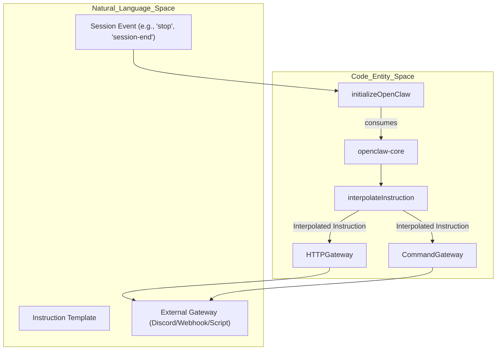
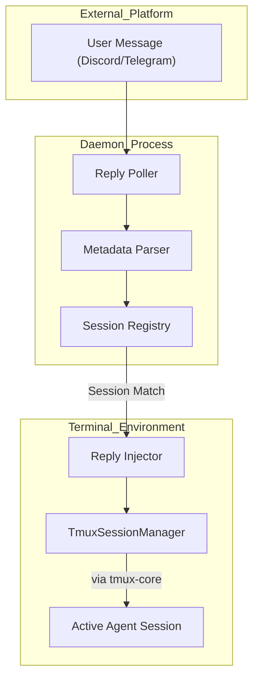

# OpenClaw Integration

Relevant source files

The following files were used as context for generating this wiki page:

- [.agents/skills/work-with-pr-workspace/iteration-1/eval-5/with_skill/outputs/execution-plan.md](https://github.com/code-yeongyu/oh-my-openagent/blob/HEAD/.agents/skills/work-with-pr-workspace/iteration-1/eval-5/with_skill/outputs/execution-plan.md)
- [.omo/evidence/20260809-omo-agent-toolkit-rename/task-5.txt](https://github.com/code-yeongyu/oh-my-openagent/blob/HEAD/.omo/evidence/20260809-omo-agent-toolkit-rename/task-5.txt)
- [.omo/evidence/20260810-omo-native-telemetry/task-4.md](https://github.com/code-yeongyu/oh-my-openagent/blob/HEAD/.omo/evidence/20260810-omo-native-telemetry/task-4.md)
- [.omo/evidence/task-17-subagent-session-resume-revival.txt](https://github.com/code-yeongyu/oh-my-openagent/blob/HEAD/.omo/evidence/task-17-subagent-session-resume-revival.txt)
- [.omo/evidence/task-3-senpi-model-chain-overhaul.txt](https://github.com/code-yeongyu/oh-my-openagent/blob/HEAD/.omo/evidence/task-3-senpi-model-chain-overhaul.txt)
- [.opencode/skills/work-with-pr-workspace/iteration-1/eval-5/with_skill/outputs/execution-plan.md](https://github.com/code-yeongyu/oh-my-openagent/blob/HEAD/.opencode/skills/work-with-pr-workspace/iteration-1/eval-5/with_skill/outputs/execution-plan.md)
- [CHANGELOG.md](https://github.com/code-yeongyu/oh-my-openagent/blob/HEAD/CHANGELOG.md)
- [README.ja.md](https://github.com/code-yeongyu/oh-my-openagent/blob/HEAD/README.ja.md)
- [README.ko.md](https://github.com/code-yeongyu/oh-my-openagent/blob/HEAD/README.ko.md)
- [README.md](https://github.com/code-yeongyu/oh-my-openagent/blob/HEAD/README.md)
- [README.ru.md](https://github.com/code-yeongyu/oh-my-openagent/blob/HEAD/README.ru.md)
- [README.zh-cn.md](https://github.com/code-yeongyu/oh-my-openagent/blob/HEAD/README.zh-cn.md)
- [assets/oh-my-opencode.schema.json](https://github.com/code-yeongyu/oh-my-openagent/blob/HEAD/assets/oh-my-opencode.schema.json)
- [docs/examples/coding-focused.jsonc](https://github.com/code-yeongyu/oh-my-openagent/blob/HEAD/docs/examples/coding-focused.jsonc)
- [docs/examples/default.jsonc](https://github.com/code-yeongyu/oh-my-openagent/blob/HEAD/docs/examples/default.jsonc)
- [docs/examples/planning-focused.jsonc](https://github.com/code-yeongyu/oh-my-openagent/blob/HEAD/docs/examples/planning-focused.jsonc)
- [docs/guide/agent-model-matching.md](https://github.com/code-yeongyu/oh-my-openagent/blob/HEAD/docs/guide/agent-model-matching.md)
- [docs/guide/installation.md](https://github.com/code-yeongyu/oh-my-openagent/blob/HEAD/docs/guide/installation.md)
- [docs/guide/orchestration.md](https://github.com/code-yeongyu/oh-my-openagent/blob/HEAD/docs/guide/orchestration.md)
- [docs/guide/overview.md](https://github.com/code-yeongyu/oh-my-openagent/blob/HEAD/docs/guide/overview.md)
- [docs/guide/team-mode.md](https://github.com/code-yeongyu/oh-my-openagent/blob/HEAD/docs/guide/team-mode.md)
- [docs/reference/cli.md](https://github.com/code-yeongyu/oh-my-openagent/blob/HEAD/docs/reference/cli.md)
- [docs/reference/codex-telemetry.md](https://github.com/code-yeongyu/oh-my-openagent/blob/HEAD/docs/reference/codex-telemetry.md)
- [docs/reference/configuration.md](https://github.com/code-yeongyu/oh-my-openagent/blob/HEAD/docs/reference/configuration.md)
- [docs/reference/features.md](https://github.com/code-yeongyu/oh-my-openagent/blob/HEAD/docs/reference/features.md)
- [docs/reference/known-issues.md](https://github.com/code-yeongyu/oh-my-openagent/blob/HEAD/docs/reference/known-issues.md)
- [docs/reference/prompt-async-gate-rfc.md](https://github.com/code-yeongyu/oh-my-openagent/blob/HEAD/docs/reference/prompt-async-gate-rfc.md)
- [docs/reference/rules-injection-cross-module-comparison.md](https://github.com/code-yeongyu/oh-my-openagent/blob/HEAD/docs/reference/rules-injection-cross-module-comparison.md)
- [packages/omo-codex/README.md](https://github.com/code-yeongyu/oh-my-openagent/blob/HEAD/packages/omo-codex/README.md)
- [packages/omo-codex/plugin/README.md](https://github.com/code-yeongyu/oh-my-openagent/blob/HEAD/packages/omo-codex/plugin/README.md)
- [packages/omo-codex/tsconfig.json](https://github.com/code-yeongyu/oh-my-openagent/blob/HEAD/packages/omo-codex/tsconfig.json)
- [packages/omo-config-core/package.json](https://github.com/code-yeongyu/oh-my-openagent/blob/HEAD/packages/omo-config-core/package.json)
- [packages/omo-config-core/src/loader/harness-fold.test.ts](https://github.com/code-yeongyu/oh-my-openagent/blob/HEAD/packages/omo-config-core/src/loader/harness-fold.test.ts)
- [packages/omo-config-core/src/loader/index.ts](https://github.com/code-yeongyu/oh-my-openagent/blob/HEAD/packages/omo-config-core/src/loader/index.ts)
- [packages/omo-config-core/src/loader/loader-resolution.test.ts](https://github.com/code-yeongyu/oh-my-openagent/blob/HEAD/packages/omo-config-core/src/loader/loader-resolution.test.ts)
- [packages/omo-config-core/src/loader/loader.ts](https://github.com/code-yeongyu/oh-my-openagent/blob/HEAD/packages/omo-config-core/src/loader/loader.ts)
- [packages/omo-config-core/src/loader/merge.ts](https://github.com/code-yeongyu/oh-my-openagent/blob/HEAD/packages/omo-config-core/src/loader/merge.ts)
- [packages/omo-config-core/src/loader/resolution.ts](https://github.com/code-yeongyu/oh-my-openagent/blob/HEAD/packages/omo-config-core/src/loader/resolution.ts)
- [packages/omo-config-core/src/loader/telemetry-resolution.test.ts](https://github.com/code-yeongyu/oh-my-openagent/blob/HEAD/packages/omo-config-core/src/loader/telemetry-resolution.test.ts)
- [packages/omo-config-core/src/loader/top-level-senpi-config-characterization.test.ts](https://github.com/code-yeongyu/oh-my-openagent/blob/HEAD/packages/omo-config-core/src/loader/top-level-senpi-config-characterization.test.ts)
- [packages/omo-config-core/src/schema/agent-schema.test.ts](https://github.com/code-yeongyu/oh-my-openagent/blob/HEAD/packages/omo-config-core/src/schema/agent-schema.test.ts)
- [packages/omo-config-core/src/schema/agent.ts](https://github.com/code-yeongyu/oh-my-openagent/blob/HEAD/packages/omo-config-core/src/schema/agent.ts)
- [packages/omo-config-core/src/schema/category.test.ts](https://github.com/code-yeongyu/oh-my-openagent/blob/HEAD/packages/omo-config-core/src/schema/category.test.ts)
- [packages/omo-config-core/src/schema/category.ts](https://github.com/code-yeongyu/oh-my-openagent/blob/HEAD/packages/omo-config-core/src/schema/category.ts)
- [packages/omo-config-core/src/schema/codegraph.ts](https://github.com/code-yeongyu/oh-my-openagent/blob/HEAD/packages/omo-config-core/src/schema/codegraph.ts)
- [packages/omo-config-core/src/schema/config-schema.test.ts](https://github.com/code-yeongyu/oh-my-openagent/blob/HEAD/packages/omo-config-core/src/schema/config-schema.test.ts)
- [packages/omo-config-core/src/schema/config.ts](https://github.com/code-yeongyu/oh-my-openagent/blob/HEAD/packages/omo-config-core/src/schema/config.ts)
- [packages/omo-config-core/src/schema/fallback-models.ts](https://github.com/code-yeongyu/oh-my-openagent/blob/HEAD/packages/omo-config-core/src/schema/fallback-models.ts)
- [packages/omo-config-core/src/schema/harness.ts](https://github.com/code-yeongyu/oh-my-openagent/blob/HEAD/packages/omo-config-core/src/schema/harness.ts)
- [packages/omo-config-core/src/schema/index.ts](https://github.com/code-yeongyu/oh-my-openagent/blob/HEAD/packages/omo-config-core/src/schema/index.ts)
- [packages/omo-config-core/src/schema/model-ref.ts](https://github.com/code-yeongyu/oh-my-openagent/blob/HEAD/packages/omo-config-core/src/schema/model-ref.ts)
- [packages/omo-config-core/src/schema/reasoning-vocabulary.ts](https://github.com/code-yeongyu/oh-my-openagent/blob/HEAD/packages/omo-config-core/src/schema/reasoning-vocabulary.ts)
- [packages/omo-config-core/src/schema/task.test.ts](https://github.com/code-yeongyu/oh-my-openagent/blob/HEAD/packages/omo-config-core/src/schema/task.test.ts)
- [packages/omo-config-core/src/schema/task.ts](https://github.com/code-yeongyu/oh-my-openagent/blob/HEAD/packages/omo-config-core/src/schema/task.ts)
- [packages/omo-config-core/src/schema/team.ts](https://github.com/code-yeongyu/oh-my-openagent/blob/HEAD/packages/omo-config-core/src/schema/team.ts)
- [packages/omo-config-core/src/schema/telemetry.test.ts](https://github.com/code-yeongyu/oh-my-openagent/blob/HEAD/packages/omo-config-core/src/schema/telemetry.test.ts)
- [packages/omo-config-core/src/schema/telemetry.ts](https://github.com/code-yeongyu/oh-my-openagent/blob/HEAD/packages/omo-config-core/src/schema/telemetry.ts)
- [packages/omo-opencode/src/config-migration/2026-08-reasoning-unification/fixture-expected.json](https://github.com/code-yeongyu/oh-my-openagent/blob/HEAD/packages/omo-opencode/src/config-migration/2026-08-reasoning-unification/fixture-expected.json)
- [packages/omo-opencode/src/config-migration/2026-08-reasoning-unification/fixture-input.json](https://github.com/code-yeongyu/oh-my-openagent/blob/HEAD/packages/omo-opencode/src/config-migration/2026-08-reasoning-unification/fixture-input.json)
- [packages/omo-opencode/src/shared/markdown-link-audit.test.ts](https://github.com/code-yeongyu/oh-my-openagent/blob/HEAD/packages/omo-opencode/src/shared/markdown-link-audit.test.ts)
- [packages/omo-senpi/src/components/config-resolution/index.test.ts](https://github.com/code-yeongyu/oh-my-openagent/blob/HEAD/packages/omo-senpi/src/components/config-resolution/index.test.ts)
- [packages/senpi-task/scripts/manual-routing-policy-qa.ts](https://github.com/code-yeongyu/oh-my-openagent/blob/HEAD/packages/senpi-task/scripts/manual-routing-policy-qa.ts)
- [packages/senpi-task/src/config/settings.test.ts](https://github.com/code-yeongyu/oh-my-openagent/blob/HEAD/packages/senpi-task/src/config/settings.test.ts)
- [packages/senpi-task/src/lifecycle/batch-admission.test.ts](https://github.com/code-yeongyu/oh-my-openagent/blob/HEAD/packages/senpi-task/src/lifecycle/batch-admission.test.ts)
- [packages/senpi-task/src/manager/residency-unlimited.test.ts](https://github.com/code-yeongyu/oh-my-openagent/blob/HEAD/packages/senpi-task/src/manager/residency-unlimited.test.ts)
- [packages/team-core/src/config.ts](https://github.com/code-yeongyu/oh-my-openagent/blob/HEAD/packages/team-core/src/config.ts)
- [packages/utils/package.json](https://github.com/code-yeongyu/oh-my-openagent/blob/HEAD/packages/utils/package.json)
- [packages/utils/src/skill-path-resolver.ts](https://github.com/code-yeongyu/oh-my-openagent/blob/HEAD/packages/utils/src/skill-path-resolver.ts)
- [postinstall.test.ts](https://github.com/code-yeongyu/oh-my-openagent/blob/HEAD/postinstall.test.ts)
- [tests/omo-config-category-drift.test.ts](https://github.com/code-yeongyu/oh-my-openagent/blob/HEAD/tests/omo-config-category-drift.test.ts)

OpenClaw is a notification gateway and remote interaction system for `oh-my-openagent`. It allows the agent to send status updates, reasoning logs, and user questions to external platforms (Discord, Telegram, or custom HTTP endpoints) and receive replies that are injected back into the active session via `tmux`. Following the package layering refactor, the core logic for the gateway and daemon resides in the harness-neutral `openclaw-core` package, while the OpenCode-specific wiring is handled by the plugin adapter. [packages/AGENTS.md:15-15](https://github.com/code-yeongyu/oh-my-openagent/blob/HEAD/packages/AGENTS.md#L15), [packages/omo-opencode/src/AGENTS.md:48-48](https://github.com/code-yeongyu/oh-my-openagent/blob/HEAD/packages/omo-opencode/src/AGENTS.md#L48)

## Overview

The OpenClaw system consists of two primary components:
1.  **Outbound Dispatcher**: Triggers notifications based on session events (e.g., session start, idle, or when the agent asks a question).
2.  **Inbound Reply Listener**: A daemonized process that polls external services (Discord/Telegram) and injects user responses directly into the agent's `tmux` pane. [packages/omo-opencode/src/AGENTS.md:48-48](https://github.com/code-yeongyu/oh-my-openagent/blob/HEAD/packages/omo-opencode/src/AGENTS.md#L48)

### Data Flow: Outbound Notification

The following diagram illustrates how internal session events are transformed into external notifications via the initialization and gateway logic.

**Event to Notification Flow**

**Sources:** [packages/omo-opencode/src/AGENTS.md:48-48](https://github.com/code-yeongyu/oh-my-openagent/blob/HEAD/packages/omo-opencode/src/AGENTS.md#L48), [packages/AGENTS.md:15-15](https://github.com/code-yeongyu/oh-my-openagent/blob/HEAD/packages/AGENTS.md#L15)

---

## Configuration Schema

OpenClaw is integrated into the main unified configuration via the `openclaw` property in `omo.jsonc`. It supports runtime normalization and validation of gateway targets. The schema is defined in the harness-neutral `omo-config-core` package. [packages/omo-config-core/AGENTS.md:7-7](https://github.com/code-yeongyu/oh-my-openagent/blob/HEAD/packages/omo-config-core/AGENTS.md#L7), [packages/omo-config-core/src/schema/config.ts:37-51](https://github.com/code-yeongyu/oh-my-openagent/blob/HEAD/packages/omo-config-core/src/schema/config.ts#L37-L51)

### Gateways and Hooks
- **Gateways**: Define *where* to send data. Supports `http` (webhooks) and `command` (local shell scripts).
- **Hooks**: Define *when* to send data. Maps an event (like `session-start`) to a specific gateway and provides an `instruction` template.

| Field | Type | Description |
| :--- | :--- | :--- |
| `enabled` | `boolean` | Global toggle for the OpenClaw system. |
| `gateways` | `object` | Map of named gateway configurations (HTTP or Command). |
| `hooks` | `object` | Map of event names to hook objects with templates. |
| `replyListener` | `object` | Configuration for the inbound polling daemon (Discord/Telegram tokens). |

**Sources:** [packages/omo-config-core/src/schema/config.ts:37-51](https://github.com/code-yeongyu/oh-my-openagent/blob/HEAD/packages/omo-config-core/src/schema/config.ts#L37-L51), [packages/omo-opencode/src/AGENTS.md:48-48](https://github.com/code-yeongyu/oh-my-openagent/blob/HEAD/packages/omo-opencode/src/AGENTS.md#L48)

---

## Event Hooks

The system utilizes event triggers to intercept session lifecycle states. The notification system is often used in conjunction with the `backgroundNotificationHook` to alert users when long-running tasks complete. [packages/omo-opencode/src/hooks/AGENTS.md:97-97](https://github.com/code-yeongyu/oh-my-openagent/blob/HEAD/packages/omo-opencode/src/hooks/AGENTS.md#L97)

### Supported Context Variables
Instruction templates support double-curly brace variables. These are interpolated at runtime before dispatching to the gateway.

| Variable | Description |
| :--- | :--- |
| `{{sessionId}}` | Current session UUID. |
| `{{projectName}}` | Basename of the project directory. |
| `{{question}}` | The text of the question if the agent is asking the user. |
| `{{tmuxTail}}` | Captured output from the active terminal via `tmux-core`. |
| `{{reasoning}}` | Internal reasoning steps provided by the agent. |
| `{{event}}` | The name of the triggering event. |

**Sources:** [packages/omo-opencode/src/hooks/AGENTS.md:31-31](https://github.com/code-yeongyu/oh-my-openagent/blob/HEAD/packages/omo-opencode/src/hooks/AGENTS.md#L31), [packages/tmux-core/AGENTS.md:51-51](https://github.com/code-yeongyu/oh-my-openagent/blob/HEAD/packages/tmux-core/AGENTS.md#L51)

---

## Outbound Dispatchers

### HTTP Gateway
Sends a `POST` request to a validated URL.
- **Payload**: Includes the interpolated `instruction`, `event`, and `timestamp`.
- **Security**: Remote URLs are validated to ensure secure transport for non-local traffic.

### Command Gateway
Executes a local shell command, allowing integration with local scripts or CLI tools (e.g., `ntfy`, `curl`).
- **Security**: Variables are escaped to prevent shell injection.
- **Execution**: Runs in a sub-process with configurable timeouts.

### Runtime Integration
OpenClaw notifications are triggered by various system managers. For example, the `BackgroundManager` uses OpenClaw to notify the user when a background agent finishes its task or requires input. [packages/omo-opencode/src/features/AGENTS.md:47-47](https://github.com/code-yeongyu/oh-my-openagent/blob/HEAD/packages/omo-opencode/src/features/AGENTS.md#L47)

**Sources:** [packages/omo-opencode/src/features/AGENTS.md:47-47](https://github.com/code-yeongyu/oh-my-openagent/blob/HEAD/packages/omo-opencode/src/features/AGENTS.md#L47), [packages/omo-opencode/src/AGENTS.md:48-48](https://github.com/code-yeongyu/oh-my-openagent/blob/HEAD/packages/omo-opencode/src/AGENTS.md#L48)

---

## Inbound Reply Listener

The Reply Listener is a background daemon that allows users to respond to agent questions from platforms like Discord or Telegram. It is initialized during the plugin startup sequence. [packages/omo-opencode/src/AGENTS.md:48-48](https://github.com/code-yeongyu/oh-my-openagent/blob/HEAD/packages/omo-opencode/src/AGENTS.md#L48)

### Daemon Lifecycle
1.  **Initialization**: `initializeOpenClaw` checks for configured bot tokens and starts the polling loop if `openclaw` config is present. [packages/omo-opencode/src/AGENTS.md:48-48](https://github.com/code-yeongyu/oh-my-openagent/blob/HEAD/packages/omo-opencode/src/AGENTS.md#L48)
2.  **Polling**: The listener executes platform-specific pollers to check for new messages directed at the agent.
3.  **Termination**: Clean shutdown ensures that polling stops and resources are released when the harness exits.

### Reply Injection Flow
When a valid message is received from an authorized user:
1.  **Registry Lookup**: The system identifies the session using a registry match between the external message metadata and the internal session ID.
2.  **Tmux Integration**: The system identifies the target `tmux` pane associated with the session using `TmuxSessionManager`. [packages/omo-opencode/src/features/AGENTS.md:15-15](https://github.com/code-yeongyu/oh-my-openagent/blob/HEAD/packages/omo-opencode/src/features/AGENTS.md#L15)
3.  **Injection**: User input is sent back to the agent's interactive environment via `tmux-core` primitives, allowing the agent to continue its work based on the remote feedback. [packages/tmux-core/AGENTS.md:51-51](https://github.com/code-yeongyu/oh-my-openagent/blob/HEAD/packages/tmux-core/AGENTS.md#L51)

**Inbound Interaction Logic**

**Sources:** [packages/omo-opencode/src/features/AGENTS.md:15-15](https://github.com/code-yeongyu/oh-my-openagent/blob/HEAD/packages/omo-opencode/src/features/AGENTS.md#L15), [packages/tmux-core/AGENTS.md:51-51](https://github.com/code-yeongyu/oh-my-openagent/blob/HEAD/packages/tmux-core/AGENTS.md#L51), [packages/omo-opencode/src/AGENTS.md:48-48](https://github.com/code-yeongyu/oh-my-openagent/blob/HEAD/packages/omo-opencode/src/AGENTS.md#L48)

### Security and Validation
- **Whitelisted Context**: Only specific context fields are sent in the outbound payload to prevent sensitive data leakage.
- **Command Sanitization**: Shell arguments are escaped to prevent malicious command execution.
- **Rate Limiting**: The inbound listener includes rate limiting to prevent API abuse or session flooding from external platforms.
- **Authorized Users**: Inbound replies are only accepted from user IDs specified in the `replyListener` configuration within `omo.jsonc`. [packages/omo-config-core/src/schema/config.ts:37-51](https://github.com/code-yeongyu/oh-my-openagent/blob/HEAD/packages/omo-config-core/src/schema/config.ts#L37-L51)

**Sources:** [packages/omo-config-core/src/schema/config.ts:37-51](https://github.com/code-yeongyu/oh-my-openagent/blob/HEAD/packages/omo-config-core/src/schema/config.ts#L37-L51), [packages/omo-opencode/src/AGENTS.md:48-48](https://github.com/code-yeongyu/oh-my-openagent/blob/HEAD/packages/omo-opencode/src/AGENTS.md#L48)