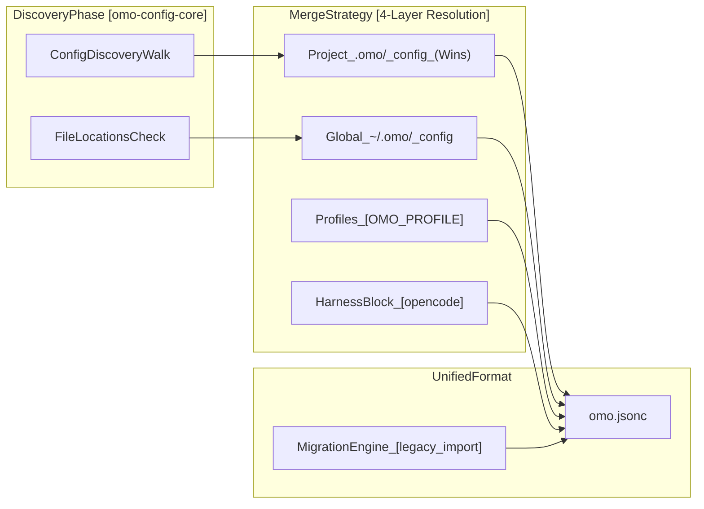

# Installation and Setup

<details>
<summary>Relevant source files</summary>

The following files were used as context for generating this wiki page:

- [.agents/skills/work-with-pr-workspace/iteration-1/eval-5/with_skill/outputs/execution-plan.md](https://github.com/code-yeongyu/oh-my-openagent/blob/HEAD/.agents/skills/work-with-pr-workspace/iteration-1/eval-5/with_skill/outputs/execution-plan.md)
- [.github/scripts/write-job-summary.sh](https://github.com/code-yeongyu/oh-my-openagent/blob/HEAD/.github/scripts/write-job-summary.sh)
- [.github/workflows/ci.yml](https://github.com/code-yeongyu/oh-my-openagent/blob/HEAD/.github/workflows/ci.yml)
- [.github/workflows/cla.yml](https://github.com/code-yeongyu/oh-my-openagent/blob/HEAD/.github/workflows/cla.yml)
- [.github/workflows/lint-workflows.yml](https://github.com/code-yeongyu/oh-my-openagent/blob/HEAD/.github/workflows/lint-workflows.yml)
- [.github/workflows/package-labels.yml](https://github.com/code-yeongyu/oh-my-openagent/blob/HEAD/.github/workflows/package-labels.yml)
- [.github/workflows/publish-platform.yml](https://github.com/code-yeongyu/oh-my-openagent/blob/HEAD/.github/workflows/publish-platform.yml)
- [.github/workflows/publish.yml](https://github.com/code-yeongyu/oh-my-openagent/blob/HEAD/.github/workflows/publish.yml)
- [.github/workflows/refresh-model-capabilities.yml](https://github.com/code-yeongyu/oh-my-openagent/blob/HEAD/.github/workflows/refresh-model-capabilities.yml)
- [.github/workflows/sisyphus-agent.yml](https://github.com/code-yeongyu/oh-my-openagent/blob/HEAD/.github/workflows/sisyphus-agent.yml)
- [.github/workflows/web-ci.yml](https://github.com/code-yeongyu/oh-my-openagent/blob/HEAD/.github/workflows/web-ci.yml)
- [.github/workflows/web-deploy.yml](https://github.com/code-yeongyu/oh-my-openagent/blob/HEAD/.github/workflows/web-deploy.yml)
- [.omo/evidence/20260809-omo-agent-toolkit-rename/task-5.txt](https://github.com/code-yeongyu/oh-my-openagent/blob/HEAD/.omo/evidence/20260809-omo-agent-toolkit-rename/task-5.txt)
- [.opencode/skills/work-with-pr-workspace/iteration-1/eval-5/with_skill/outputs/execution-plan.md](https://github.com/code-yeongyu/oh-my-openagent/blob/HEAD/.opencode/skills/work-with-pr-workspace/iteration-1/eval-5/with_skill/outputs/execution-plan.md)
- [CHANGELOG.md](https://github.com/code-yeongyu/oh-my-openagent/blob/HEAD/CHANGELOG.md)
- [CLA.md](https://github.com/code-yeongyu/oh-my-openagent/blob/HEAD/CLA.md)
- [README.ja.md](https://github.com/code-yeongyu/oh-my-openagent/blob/HEAD/README.ja.md)
- [README.ko.md](https://github.com/code-yeongyu/oh-my-openagent/blob/HEAD/README.ko.md)
- [README.md](https://github.com/code-yeongyu/oh-my-openagent/blob/HEAD/README.md)
- [README.ru.md](https://github.com/code-yeongyu/oh-my-openagent/blob/HEAD/README.ru.md)
- [README.zh-cn.md](https://github.com/code-yeongyu/oh-my-openagent/blob/HEAD/README.zh-cn.md)
- [assets/oh-my-opencode.schema.json](https://github.com/code-yeongyu/oh-my-openagent/blob/HEAD/assets/oh-my-opencode.schema.json)
- [bin/oh-my-opencode.js](https://github.com/code-yeongyu/oh-my-openagent/blob/HEAD/bin/oh-my-opencode.js)
- [bin/oh-my-opencode.test.ts](https://github.com/code-yeongyu/oh-my-openagent/blob/HEAD/bin/oh-my-opencode.test.ts)
- [bin/platform.d.ts](https://github.com/code-yeongyu/oh-my-openagent/blob/HEAD/bin/platform.d.ts)
- [bin/platform.js](https://github.com/code-yeongyu/oh-my-openagent/blob/HEAD/bin/platform.js)
- [bin/platform.test.ts](https://github.com/code-yeongyu/oh-my-openagent/blob/HEAD/bin/platform.test.ts)
- [docs/examples/coding-focused.jsonc](https://github.com/code-yeongyu/oh-my-openagent/blob/HEAD/docs/examples/coding-focused.jsonc)
- [docs/examples/default.jsonc](https://github.com/code-yeongyu/oh-my-openagent/blob/HEAD/docs/examples/default.jsonc)
- [docs/examples/planning-focused.jsonc](https://github.com/code-yeongyu/oh-my-openagent/blob/HEAD/docs/examples/planning-focused.jsonc)
- [docs/guide/agent-model-matching.md](https://github.com/code-yeongyu/oh-my-openagent/blob/HEAD/docs/guide/agent-model-matching.md)
- [docs/guide/installation.md](https://github.com/code-yeongyu/oh-my-openagent/blob/HEAD/docs/guide/installation.md)
- [docs/guide/orchestration.md](https://github.com/code-yeongyu/oh-my-openagent/blob/HEAD/docs/guide/orchestration.md)
- [docs/guide/overview.md](https://github.com/code-yeongyu/oh-my-openagent/blob/HEAD/docs/guide/overview.md)
- [docs/guide/team-mode.md](https://github.com/code-yeongyu/oh-my-openagent/blob/HEAD/docs/guide/team-mode.md)
- [docs/reference/cli.md](https://github.com/code-yeongyu/oh-my-openagent/blob/HEAD/docs/reference/cli.md)
- [docs/reference/codex-telemetry.md](https://github.com/code-yeongyu/oh-my-openagent/blob/HEAD/docs/reference/codex-telemetry.md)
- [docs/reference/configuration.md](https://github.com/code-yeongyu/oh-my-openagent/blob/HEAD/docs/reference/configuration.md)
- [docs/reference/features.md](https://github.com/code-yeongyu/oh-my-openagent/blob/HEAD/docs/reference/features.md)
- [docs/reference/known-issues.md](https://github.com/code-yeongyu/oh-my-openagent/blob/HEAD/docs/reference/known-issues.md)
- [docs/reference/lazycodex-npm-reservation.md](https://github.com/code-yeongyu/oh-my-openagent/blob/HEAD/docs/reference/lazycodex-npm-reservation.md)
- [docs/reference/prompt-async-gate-rfc.md](https://github.com/code-yeongyu/oh-my-openagent/blob/HEAD/docs/reference/prompt-async-gate-rfc.md)
- [docs/reference/rules-injection-cross-module-comparison.md](https://github.com/code-yeongyu/oh-my-openagent/blob/HEAD/docs/reference/rules-injection-cross-module-comparison.md)
- [packages/oh-my-opencode-windows-arm64/bin/.gitkeep](https://github.com/code-yeongyu/oh-my-openagent/blob/HEAD/packages/oh-my-opencode-windows-arm64/bin/.gitkeep)
- [packages/omo-codex/README.md](https://github.com/code-yeongyu/oh-my-openagent/blob/HEAD/packages/omo-codex/README.md)
- [packages/omo-codex/plugin/README.md](https://github.com/code-yeongyu/oh-my-openagent/blob/HEAD/packages/omo-codex/plugin/README.md)
- [packages/omo-codex/tsconfig.json](https://github.com/code-yeongyu/oh-my-openagent/blob/HEAD/packages/omo-codex/tsconfig.json)
- [packages/omo-opencode/src/shared/markdown-link-audit.test.ts](https://github.com/code-yeongyu/oh-my-openagent/blob/HEAD/packages/omo-opencode/src/shared/markdown-link-audit.test.ts)
- [postinstall.mjs](https://github.com/code-yeongyu/oh-my-openagent/blob/HEAD/postinstall.mjs)
- [postinstall.test.ts](https://github.com/code-yeongyu/oh-my-openagent/blob/HEAD/postinstall.test.ts)
- [script/build-binaries.test.ts](https://github.com/code-yeongyu/oh-my-openagent/blob/HEAD/script/build-binaries.test.ts)
- [script/build-binaries.ts](https://github.com/code-yeongyu/oh-my-openagent/blob/HEAD/script/build-binaries.ts)
- [script/build-cli-node.test.ts](https://github.com/code-yeongyu/oh-my-openagent/blob/HEAD/script/build-cli-node.test.ts)
- [script/build-cli-node.ts](https://github.com/code-yeongyu/oh-my-openagent/blob/HEAD/script/build-cli-node.ts)
- [script/codex-test-script.test.ts](https://github.com/code-yeongyu/oh-my-openagent/blob/HEAD/script/codex-test-script.test.ts)
- [script/package-labels-workflow.test.ts](https://github.com/code-yeongyu/oh-my-openagent/blob/HEAD/script/package-labels-workflow.test.ts)
- [script/package-layout.test.ts](https://github.com/code-yeongyu/oh-my-openagent/blob/HEAD/script/package-layout.test.ts)
- [script/publish-lazycodex-sync-workflow.test.ts](https://github.com/code-yeongyu/oh-my-openagent/blob/HEAD/script/publish-lazycodex-sync-workflow.test.ts)
- [script/publish-lazycodex-workflow.test.ts](https://github.com/code-yeongyu/oh-my-openagent/blob/HEAD/script/publish-lazycodex-workflow.test.ts)
- [script/publish-workflow.test.ts](https://github.com/code-yeongyu/oh-my-openagent/blob/HEAD/script/publish-workflow.test.ts)
- [script/publish.ts](https://github.com/code-yeongyu/oh-my-openagent/blob/HEAD/script/publish.ts)
- [script/remove-stale-self-package-tests.test.ts](https://github.com/code-yeongyu/oh-my-openagent/blob/HEAD/script/remove-stale-self-package-tests.test.ts)
- [script/remove-stale-self-package-tests.ts](https://github.com/code-yeongyu/oh-my-openagent/blob/HEAD/script/remove-stale-self-package-tests.ts)
- [script/senpi-test-script.test.ts](https://github.com/code-yeongyu/oh-my-openagent/blob/HEAD/script/senpi-test-script.test.ts)

</details>


This document provides a high-level overview of the installation process for `oh-my-openagent` (published as `oh-my-opencode`), including CLI installation, platform-specific binary selection, and initial model configuration. The system is designed as a multi-model agent orchestration harness for OpenCode, supporting a wide range of providers including Anthropic, OpenAI, Google Gemini, GitHub Copilot, and specialized providers like OpenCode Go or Vercel AI Gateway [docs/reference/cli.md:62-72](https://github.com/code-yeongyu/oh-my-openagent/blob/HEAD/docs/reference/cli.md#L62-L72).

For information about the interactive TUI and CLI commands, see [CLI Installation](39_7.1-cli-installation.md). For provider-specific authentication configuration, see [Provider Authentication](40_7.2-provider-authentication.md). For detailed troubleshooting of installation issues, see [Troubleshooting Installation](42_7.4-troubleshooting-installation.md).

## Installation Editions

`oh-my-openagent` ships in two distinct editions of the same product to accommodate different user environments and feature requirements [docs/guide/installation.md:3-8](https://github.com/code-yeongyu/oh-my-openagent/blob/HEAD/docs/guide/installation.md#L3-L8).

| Edition | Target Platform | Core Features |
| :--- | :--- | :--- |
| **Ultimate** | OpenCode | Full orchestration, 11 agents, 54+ hooks, Team Mode, `ulw-loop`, hashline edits [docs/guide/installation.md:5-5](https://github.com/code-yeongyu/oh-my-openagent/blob/HEAD/docs/guide/installation.md#L5). |
| **Light** | OpenAI Codex CLI | Portable components: `rules`, `lsp`, `ultrawork`, `telemetry`. No agent orchestration [docs/guide/installation.md:6-6](https://github.com/code-yeongyu/oh-my-openagent/blob/HEAD/docs/guide/installation.md#L6). |

Sources: [docs/guide/installation.md:3-15](https://github.com/code-yeongyu/oh-my-openagent/blob/HEAD/docs/guide/installation.md#L3-L15), [docs/reference/cli.md:17-18](https://github.com/code-yeongyu/oh-my-openagent/blob/HEAD/docs/reference/cli.md#L17-L18)

### Quick Start
The recommended way to install and configure the system is through the interactive installer, which handles both plugin registration and configuration generation [docs/guide/installation.md:12-14](https://github.com/code-yeongyu/oh-my-openagent/blob/HEAD/docs/guide/installation.md#L12-L14).

```bash
# Install Ultimate (OpenCode)
bunx oh-my-openagent install

# Install Light (Codex CLI)
npx lazycodex-ai install
```

The `install` command (also aliased as `setup`) detects whether it should run in **TUI mode** (for interactive terminals) or **non-interactive mode** (via `--no-tui`) [docs/reference/cli.md:59-60](https://github.com/code-yeongyu/oh-my-openagent/blob/HEAD/docs/reference/cli.md#L59-L60). Note that `oh-my-openagent` and `oh-my-opencode` are dual-published during the transition period [docs/reference/cli.md:3-8](https://github.com/code-yeongyu/oh-my-openagent/blob/HEAD/docs/reference/cli.md#L3-L8). For Codex users, the `lazycodex-ai` alias is preferred [docs/guide/installation.md:16-16](https://github.com/code-yeongyu/oh-my-openagent/blob/HEAD/docs/guide/installation.md#L16).

Sources: [docs/guide/installation.md:10-15](https://github.com/code-yeongyu/oh-my-openagent/blob/HEAD/docs/guide/installation.md#L10-L15), [docs/reference/cli.md:33-72](https://github.com/code-yeongyu/oh-my-openagent/blob/HEAD/docs/reference/cli.md#L33-L72)

## Initial Configuration

The system has transitioned to a unified configuration model using `omo.jsonc`. Legacy files like `oh-my-opencode.json` are now handled by a **lock-and-journal migration engine** [docs/reference/configuration.md:96-102](https://github.com/code-yeongyu/oh-my-openagent/blob/HEAD/docs/reference/configuration.md#L96-L102).

### Provider Selection Logic
The installer maps user subscriptions to provider availability. This tracks which native providers (Anthropic, OpenAI, Google) or integrated gateways (Copilot, OpenCode Zen, OpenCode Go) are accessible [docs/guide/installation.md:20-22](https://github.com/code-yeongyu/oh-my-openagent/blob/HEAD/docs/guide/installation.md#L20-L22).

**Subscription to Configuration Flow**

```mermaid
graph TD
    subgraph UserSubscriptionInputs_Install_CLI_Flags ["UserSubscriptionInputs [Install CLI Flags]"]
        C["--claude"]
        O["--openai"]
        G["--gemini"]
        OG["--opencode-go"]
        OZ["--opencode-zen"]
    end

    subgraph InstallerLogic_omo_install ["InstallerLogic [omo_install]"]
        V["detectCurrentConfig"]
        M["addPluginToOpenCodeConfig"]
        W["writeOmoConfig"]
    end

    subgraph OutputEntities_omo_jsonc ["OutputEntities [omo_jsonc]"]
        AC["AgentConfig: sisyphus"]
        CC["CategoryConfig: visual-engineering"]
        TC["ToolConfig: background_task"]
    end

    C & O & G & OG & OZ --> V
    V --> M
    M --> W
    W --> AC
    W --> CC
    W --> TC
```



Sources: [docs/guide/installation.md:91-118](https://github.com/code-yeongyu/oh-my-openagent/blob/HEAD/docs/guide/installation.md#L91-L118), [docs/reference/cli.md:45-72](https://github.com/code-yeongyu/oh-my-openagent/blob/HEAD/docs/reference/cli.md#L45-L72), [docs/reference/configuration.md:75-142](https://github.com/code-yeongyu/oh-my-openagent/blob/HEAD/docs/reference/configuration.md#L75-L142)

### Agent-Model Matching
The system assigns each agent a model that matches its working style. Sisyphus (orchestrator) prefers Claude/Kimi/GLM, while Hephaestus (deep specialist) requires GPT-5.6 [docs/guide/agent-model-matching.md:43-70](https://github.com/code-yeongyu/oh-my-openagent/blob/HEAD/docs/guide/agent-model-matching.md#L43-L70).

| Provider Flag | Agent Impact | Primary Model Recommendation |
|-------|---------------------------|------|
| `--claude=max20` | Sisyphus Orchestration | `claude-opus-5` [docs/reference/features.md:13-13](https://github.com/code-yeongyu/oh-my-openagent/blob/HEAD/docs/reference/features.md#L13) |
| `--openai=yes` | Hephaestus / Oracle | `gpt-5.6-sol` [docs/reference/features.md:14-15](https://github.com/code-yeongyu/oh-my-openagent/blob/HEAD/docs/reference/features.md#L14-L15) |
| `--opencode-go` | Sisyphus / Atlas | `kimi-k3`, `glm-5.2` [docs/reference/features.md:13-23](https://github.com/code-yeongyu/oh-my-openagent/blob/HEAD/docs/reference/features.md#L13-L23) |
| `--gemini=yes` | Visual Engineering | `google/gemini-3.1-pro` [docs/reference/configuration.md:127-127](https://github.com/code-yeongyu/oh-my-openagent/blob/HEAD/docs/reference/configuration.md#L127) |

Sources: [docs/guide/agent-model-matching.md:7-41](https://github.com/code-yeongyu/oh-my-openagent/blob/HEAD/docs/guide/agent-model-matching.md#L7-L41), [docs/reference/configuration.md:79-124](https://github.com/code-yeongyu/oh-my-openagent/blob/HEAD/docs/reference/configuration.md#L79-L124), [docs/reference/features.md:11-32](https://github.com/code-yeongyu/oh-my-openagent/blob/HEAD/docs/reference/features.md#L11-L32)

## Configuration Management

Configuration files are discovered via a 4-layer resolution model. User-level config is stored in `~/.omo/omo.jsonc`, while project-level overrides reside in `.omo/omo.jsonc` [docs/reference/configuration.md:49-55](https://github.com/code-yeongyu/oh-my-openagent/blob/HEAD/docs/reference/configuration.md#L49-L55).

**Configuration Resolution Diagram**



| Path Candidate | Platform | Priority |
|----------|----------------|----------------|
| `.omo/omo.jsonc` | All | High (Project-specific) [docs/reference/configuration.md:50-50](https://github.com/code-yeongyu/oh-my-openagent/blob/HEAD/docs/reference/configuration.md#L50) |
| `~/.omo/omo.jsonc` | All | Medium (User-global) [docs/reference/configuration.md:49-49](https://github.com/code-yeongyu/oh-my-openagent/blob/HEAD/docs/reference/configuration.md#L49) |

Sources: [docs/reference/configuration.md:44-72](https://github.com/code-yeongyu/oh-my-openagent/blob/HEAD/docs/reference/configuration.md#L44-L72)

## Verification and Diagnostics

After installation, verify the setup using the built-in diagnostic tools.

- **Doctor Command**: Run `bunx oh-my-opencode doctor` to verify platform binary resolution and effective model resolution [docs/reference/cli.md:120-141](https://github.com/code-yeongyu/oh-my-openagent/blob/HEAD/docs/reference/cli.md#L120-L141).
- **Auth Verification**: Use `opencode auth list` to see connected providers and `opencode models` to list available model strings [docs/guide/agent-model-matching.md:91-99](https://github.com/code-yeongyu/oh-my-openagent/blob/HEAD/docs/guide/agent-model-matching.md#L91-L99).
- **Telemetry State**: Anonymous telemetry is enabled by default to track DAU/WAU/MAU via hashed identifiers [README.md:134-134](https://github.com/code-yeongyu/oh-my-openagent/blob/HEAD/README.md#L134). It can be disabled via `OMO_SEND_ANONYMOUS_TELEMETRY=0` or `OMO_DISABLE_POSTHOG=1` [README.zh-cn.md:134-134](https://github.com/code-yeongyu/oh-my-openagent/blob/HEAD/README.zh-cn.md#L134).
- **MCP OAuth**: Manage authenticated MCP server tokens via `mcp oauth` commands, supporting OAuth 2.0 + PKCE + DCR [docs/reference/cli.md:41-41](https://github.com/code-yeongyu/oh-my-openagent/blob/HEAD/docs/reference/cli.md#L41).

Sources: [docs/guide/agent-model-matching.md:91-110](https://github.com/code-yeongyu/oh-my-openagent/blob/HEAD/docs/guide/agent-model-matching.md#L91-L110), [docs/reference/cli.md:30-41](https://github.com/code-yeongyu/oh-my-openagent/blob/HEAD/docs/reference/cli.md#L30-L41), [README.md:134-134](https://github.com/code-yeongyu/oh-my-openagent/blob/HEAD/README.md#L134), [README.zh-cn.md:134-134](https://github.com/code-yeongyu/oh-my-openagent/blob/HEAD/README.zh-cn.md#L134)

---

### Related Pages
- [CLI Installation](39_7.1-cli-installation.md) — Details on the `install` command, TUI modes, and automated setup.
- [Provider Authentication](40_7.2-provider-authentication.md) — Guide for configuring API keys and subscriptions for all supported LLM providers.
- [Platform Binaries](41_7.3-platform-binaries.md) — Explanation of the 11 platform-specific packages and AVX2/Baseline variants.
- [Troubleshooting Installation](42_7.4-troubleshooting-installation.md) — Common installation errors, including Git Bash discovery on Windows [docs/guide/installation.md:45-50](https://github.com/code-yeongyu/oh-my-openagent/blob/HEAD/docs/guide/installation.md#L45-L50).
- [MCP OAuth Authentication](43_7.5-mcp-oauth-authentication.md) — Documenting the OAuth 2.0 + PKCE + DCR flow for authenticated MCP servers.3d:T3c5c,#