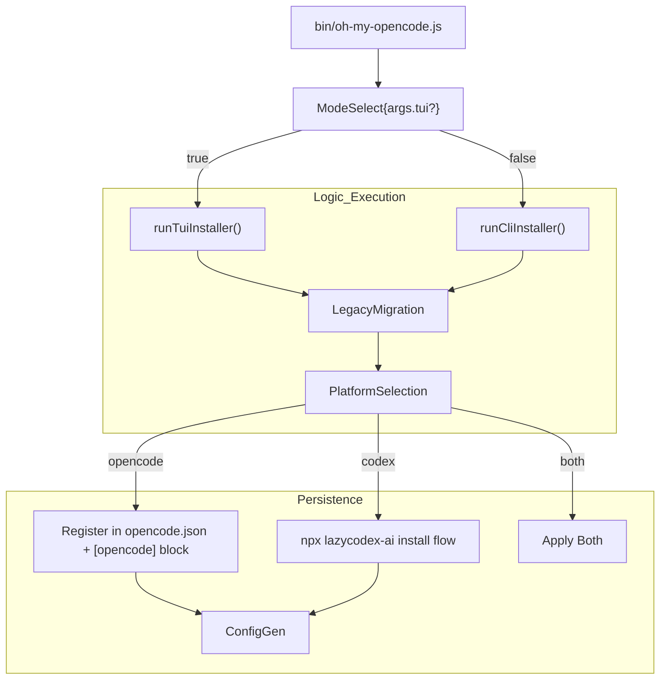
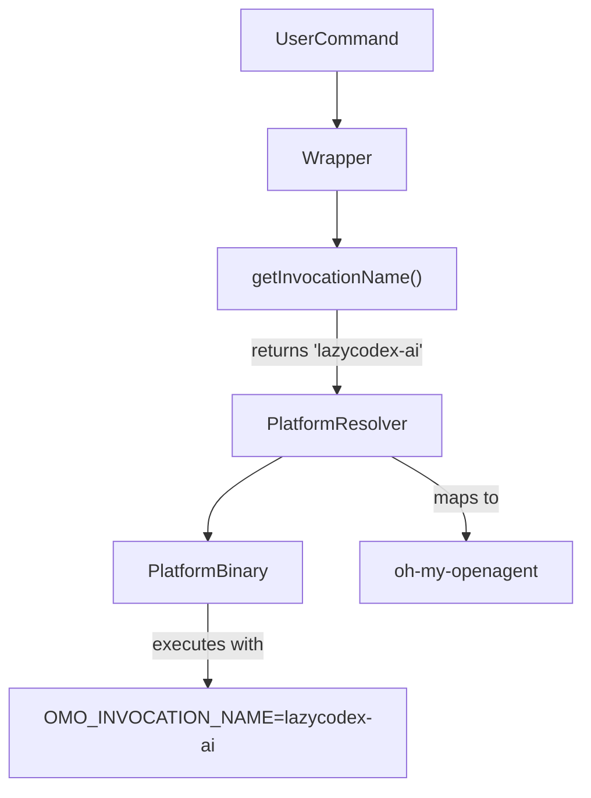

# CLI Installation

<details>
<summary>Relevant source files</summary>

The following files were used as context for generating this wiki page:

- [.agents/skills/work-with-pr-workspace/iteration-1/eval-5/with_skill/outputs/execution-plan.md](https://github.com/code-yeongyu/oh-my-openagent/blob/HEAD/.agents/skills/work-with-pr-workspace/iteration-1/eval-5/with_skill/outputs/execution-plan.md)
- [.omo/evidence/20260809-omo-agent-toolkit-rename/task-5.txt](https://github.com/code-yeongyu/oh-my-openagent/blob/HEAD/.omo/evidence/20260809-omo-agent-toolkit-rename/task-5.txt)
- [.opencode/skills/work-with-pr-workspace/iteration-1/eval-5/with_skill/outputs/execution-plan.md](https://github.com/code-yeongyu/oh-my-openagent/blob/HEAD/.opencode/skills/work-with-pr-workspace/iteration-1/eval-5/with_skill/outputs/execution-plan.md)
- [CHANGELOG.md](https://github.com/code-yeongyu/oh-my-openagent/blob/HEAD/CHANGELOG.md)
- [README.ja.md](https://github.com/code-yeongyu/oh-my-openagent/blob/HEAD/README.ja.md)
- [README.ko.md](https://github.com/code-yeongyu/oh-my-openagent/blob/HEAD/README.ko.md)
- [README.md](https://github.com/code-yeongyu/oh-my-openagent/blob/HEAD/README.md)
- [README.ru.md](https://github.com/code-yeongyu/oh-my-openagent/blob/HEAD/README.ru.md)
- [README.zh-cn.md](https://github.com/code-yeongyu/oh-my-openagent/blob/HEAD/README.zh-cn.md)
- [assets/oh-my-opencode.schema.json](https://github.com/code-yeongyu/oh-my-openagent/blob/HEAD/assets/oh-my-opencode.schema.json)
- [docs/examples/coding-focused.jsonc](https://github.com/code-yeongyu/oh-my-openagent/blob/HEAD/docs/examples/coding-focused.jsonc)
- [docs/examples/default.jsonc](https://github.com/code-yeongyu/oh-my-openagent/blob/HEAD/docs/examples/default.jsonc)
- [docs/examples/planning-focused.jsonc](https://github.com/code-yeongyu/oh-my-openagent/blob/HEAD/docs/examples/planning-focused.jsonc)
- [docs/guide/agent-model-matching.md](https://github.com/code-yeongyu/oh-my-openagent/blob/HEAD/docs/guide/agent-model-matching.md)
- [docs/guide/installation.md](https://github.com/code-yeongyu/oh-my-openagent/blob/HEAD/docs/guide/installation.md)
- [docs/guide/orchestration.md](https://github.com/code-yeongyu/oh-my-openagent/blob/HEAD/docs/guide/orchestration.md)
- [docs/guide/overview.md](https://github.com/code-yeongyu/oh-my-openagent/blob/HEAD/docs/guide/overview.md)
- [docs/guide/team-mode.md](https://github.com/code-yeongyu/oh-my-openagent/blob/HEAD/docs/guide/team-mode.md)
- [docs/reference/cli.md](https://github.com/code-yeongyu/oh-my-openagent/blob/HEAD/docs/reference/cli.md)
- [docs/reference/codex-telemetry.md](https://github.com/code-yeongyu/oh-my-openagent/blob/HEAD/docs/reference/codex-telemetry.md)
- [docs/reference/configuration.md](https://github.com/code-yeongyu/oh-my-openagent/blob/HEAD/docs/reference/configuration.md)
- [docs/reference/features.md](https://github.com/code-yeongyu/oh-my-openagent/blob/HEAD/docs/reference/features.md)
- [docs/reference/known-issues.md](https://github.com/code-yeongyu/oh-my-openagent/blob/HEAD/docs/reference/known-issues.md)
- [docs/reference/prompt-async-gate-rfc.md](https://github.com/code-yeongyu/oh-my-openagent/blob/HEAD/docs/reference/prompt-async-gate-rfc.md)
- [docs/reference/rules-injection-cross-module-comparison.md](https://github.com/code-yeongyu/oh-my-openagent/blob/HEAD/docs/reference/rules-injection-cross-module-comparison.md)
- [packages/lsp-daemon/test/daemon-client.test.ts](https://github.com/code-yeongyu/oh-my-openagent/blob/HEAD/packages/lsp-daemon/test/daemon-client.test.ts)
- [packages/omo-codex/README.md](https://github.com/code-yeongyu/oh-my-openagent/blob/HEAD/packages/omo-codex/README.md)
- [packages/omo-codex/plugin/README.md](https://github.com/code-yeongyu/oh-my-openagent/blob/HEAD/packages/omo-codex/plugin/README.md)
- [packages/omo-codex/plugin/test/bootstrap-binlinks.test.mjs](https://github.com/code-yeongyu/oh-my-openagent/blob/HEAD/packages/omo-codex/plugin/test/bootstrap-binlinks.test.mjs)
- [packages/omo-codex/scripts/install-agent-links.test.mjs](https://github.com/code-yeongyu/oh-my-openagent/blob/HEAD/packages/omo-codex/scripts/install-agent-links.test.mjs)
- [packages/omo-codex/scripts/install-bin-links.test.mjs](https://github.com/code-yeongyu/oh-my-openagent/blob/HEAD/packages/omo-codex/scripts/install-bin-links.test.mjs)
- [packages/omo-codex/scripts/install-cli-args.test.mjs](https://github.com/code-yeongyu/oh-my-openagent/blob/HEAD/packages/omo-codex/scripts/install-cli-args.test.mjs)
- [packages/omo-codex/scripts/install-delegated-command.test.mjs](https://github.com/code-yeongyu/oh-my-openagent/blob/HEAD/packages/omo-codex/scripts/install-delegated-command.test.mjs)
- [packages/omo-codex/scripts/install-local-entrypoint.test.mjs](https://github.com/code-yeongyu/oh-my-openagent/blob/HEAD/packages/omo-codex/scripts/install-local-entrypoint.test.mjs)
- [packages/omo-codex/scripts/install-local.mjs](https://github.com/code-yeongyu/oh-my-openagent/blob/HEAD/packages/omo-codex/scripts/install-local.mjs)
- [packages/omo-codex/scripts/install-local.test.mjs](https://github.com/code-yeongyu/oh-my-openagent/blob/HEAD/packages/omo-codex/scripts/install-local.test.mjs)
- [packages/omo-codex/scripts/install-project-local-cleanup.test.mjs](https://github.com/code-yeongyu/oh-my-openagent/blob/HEAD/packages/omo-codex/scripts/install-project-local-cleanup.test.mjs)
- [packages/omo-codex/src/install/codex-cache-bins.test.ts](https://github.com/code-yeongyu/oh-my-openagent/blob/HEAD/packages/omo-codex/src/install/codex-cache-bins.test.ts)
- [packages/omo-codex/src/install/codex-cache-bins.ts](https://github.com/code-yeongyu/oh-my-openagent/blob/HEAD/packages/omo-codex/src/install/codex-cache-bins.ts)
- [packages/omo-codex/src/install/codex-cache-command-shim.ts](https://github.com/code-yeongyu/oh-my-openagent/blob/HEAD/packages/omo-codex/src/install/codex-cache-command-shim.ts)
- [packages/omo-codex/src/install/codex-cache-dangling-bins.ts](https://github.com/code-yeongyu/oh-my-openagent/blob/HEAD/packages/omo-codex/src/install/codex-cache-dangling-bins.ts)
- [packages/omo-codex/src/install/codex-cache-install.test.ts](https://github.com/code-yeongyu/oh-my-openagent/blob/HEAD/packages/omo-codex/src/install/codex-cache-install.test.ts)
- [packages/omo-codex/src/install/codex-cache-install.ts](https://github.com/code-yeongyu/oh-my-openagent/blob/HEAD/packages/omo-codex/src/install/codex-cache-install.ts)
- [packages/omo-codex/src/install/codex-cache-local-dependencies.ts](https://github.com/code-yeongyu/oh-my-openagent/blob/HEAD/packages/omo-codex/src/install/codex-cache-local-dependencies.ts)
- [packages/omo-codex/src/install/codex-cache-runtime-wrapper.ts](https://github.com/code-yeongyu/oh-my-openagent/blob/HEAD/packages/omo-codex/src/install/codex-cache-runtime-wrapper.ts)
- [packages/omo-codex/src/install/codex-cache.test.ts](https://github.com/code-yeongyu/oh-my-openagent/blob/HEAD/packages/omo-codex/src/install/codex-cache.test.ts)
- [packages/omo-codex/src/install/codex-git-bash-hooks.ts](https://github.com/code-yeongyu/oh-my-openagent/blob/HEAD/packages/omo-codex/src/install/codex-git-bash-hooks.ts)
- [packages/omo-codex/src/install/install-codex-test-fixtures.ts](https://github.com/code-yeongyu/oh-my-openagent/blob/HEAD/packages/omo-codex/src/install/install-codex-test-fixtures.ts)
- [packages/omo-codex/src/install/install-codex.test.ts](https://github.com/code-yeongyu/oh-my-openagent/blob/HEAD/packages/omo-codex/src/install/install-codex.test.ts)
- [packages/omo-codex/src/install/install-codex.ts](https://github.com/code-yeongyu/oh-my-openagent/blob/HEAD/packages/omo-codex/src/install/install-codex.ts)
- [packages/omo-codex/src/install/install-local-cli.ts](https://github.com/code-yeongyu/oh-my-openagent/blob/HEAD/packages/omo-codex/src/install/install-local-cli.ts)
- [packages/omo-codex/src/install/lazycodex-cli-args.ts](https://github.com/code-yeongyu/oh-my-openagent/blob/HEAD/packages/omo-codex/src/install/lazycodex-cli-args.ts)
- [packages/omo-codex/src/install/lazycodex-delegated-command.ts](https://github.com/code-yeongyu/oh-my-openagent/blob/HEAD/packages/omo-codex/src/install/lazycodex-delegated-command.ts)
- [packages/omo-codex/src/install/lazycodex-install-surface.test.ts](https://github.com/code-yeongyu/oh-my-openagent/blob/HEAD/packages/omo-codex/src/install/lazycodex-install-surface.test.ts)
- [packages/omo-codex/src/install/lsp-daemon-reaper-live.test.ts](https://github.com/code-yeongyu/oh-my-openagent/blob/HEAD/packages/omo-codex/src/install/lsp-daemon-reaper-live.test.ts)
- [packages/omo-codex/src/install/lsp-daemon-reaper.test-support.ts](https://github.com/code-yeongyu/oh-my-openagent/blob/HEAD/packages/omo-codex/src/install/lsp-daemon-reaper.test-support.ts)
- [packages/omo-codex/src/install/lsp-daemon-reaper.test.ts](https://github.com/code-yeongyu/oh-my-openagent/blob/HEAD/packages/omo-codex/src/install/lsp-daemon-reaper.test.ts)
- [packages/omo-codex/tsconfig.json](https://github.com/code-yeongyu/oh-my-openagent/blob/HEAD/packages/omo-codex/tsconfig.json)
- [packages/omo-opencode/src/cli/install-codex/install-codex.ts](https://github.com/code-yeongyu/oh-my-openagent/blob/HEAD/packages/omo-opencode/src/cli/install-codex/install-codex.ts)
- [packages/omo-opencode/src/cli/install-codex/link-cached-plugin-agents.ts](https://github.com/code-yeongyu/oh-my-openagent/blob/HEAD/packages/omo-opencode/src/cli/install-codex/link-cached-plugin-agents.ts)
- [packages/omo-opencode/src/features/team-mode/team-runtime/create.ts](https://github.com/code-yeongyu/oh-my-openagent/blob/HEAD/packages/omo-opencode/src/features/team-mode/team-runtime/create.ts)
- [packages/omo-opencode/src/features/tmux-subagent/failed-readiness-cache.ts](https://github.com/code-yeongyu/oh-my-openagent/blob/HEAD/packages/omo-opencode/src/features/tmux-subagent/failed-readiness-cache.ts)
- [packages/omo-opencode/src/features/tmux-subagent/resolve-server-url.ts](https://github.com/code-yeongyu/oh-my-openagent/blob/HEAD/packages/omo-opencode/src/features/tmux-subagent/resolve-server-url.ts)
- [packages/omo-opencode/src/shared/markdown-link-audit.test.ts](https://github.com/code-yeongyu/oh-my-openagent/blob/HEAD/packages/omo-opencode/src/shared/markdown-link-audit.test.ts)
- [postinstall.test.ts](https://github.com/code-yeongyu/oh-my-openagent/blob/HEAD/postinstall.test.ts)

</details>


## Purpose and Scope

This page documents the `oh-my-opencode install` command (aliased as `setup`), which performs initial setup by detecting available AI providers, generating optimized model configurations, and integrating the plugin into the chosen harness (OpenCode, Codex, or both). The installation process handles environment detection, model requirement matching, and configuration file generation.

The install command operates in two modes:
- **TUI mode** (default): Interactive terminal UI with provider detection and confirmation prompts using `@clack/prompts`.
- **CLI mode** (non-interactive): Accepts command-line arguments for automated or CI environments via `--no-tui`.

## Installation Process Overview

The installation flow coordinates provider detection, model requirement matching, and file system operations. It is designed to handle both fresh installations and upgrades by checking for existing `oh-my-opencode` configurations. A key part of the modern installation is the **lock+journal migration engine**, which imports legacy `oh-my-openagent.json[c]` or `oh-my-opencode.json[c]` files into the unified `omo.jsonc` format [docs/reference/configuration.md:96-105](https://github.com/code-yeongyu/oh-my-openagent/blob/HEAD/docs/reference/configuration.md#L96-L105).

**Installation Flow Diagram**



**Installation Flow Phases**

| Phase | Component | Purpose |
|-------|-----------|---------|
| 1. Binary Verification | `bin/oh-my-opencode.js` | Detects platform/arch/libc to spawn correct binary [bin/oh-my-opencode.js:141-163](https://github.com/code-yeongyu/oh-my-openagent/blob/HEAD/bin/oh-my-opencode.js#L141-L163). |
| 2. Version Check | `postinstall.mjs` | Ensures OpenCode >= 1.4.0 and checks for version mismatches between main and platform packages [postinstall.mjs:17-147](https://github.com/code-yeongyu/oh-my-openagent/blob/HEAD/postinstall.mjs#L17-L147). |
| 3. Legacy Migration | `omo-config-core` | Migrates legacy JSON/JSONC files into the unified `omo.jsonc` schema [docs/reference/configuration.md:96-105](https://github.com/code-yeongyu/oh-my-openagent/blob/HEAD/docs/reference/configuration.md#L96-L105). |
| 4. Platform Routing | `--platform` flag | Routes installation to OpenCode plugin registration, Codex `config.toml` updates, or both [docs/guide/installation.md:10-14](https://github.com/code-yeongyu/oh-my-openagent/blob/HEAD/docs/guide/installation.md#L10-L14). |
| 5. Post-Install | `invalidateOpenCodePluginCache()` | Clears OpenCode plugin cache to ensure the new version is loaded [postinstall.mjs:106-122](https://github.com/code-yeongyu/oh-my-openagent/blob/HEAD/postinstall.mjs#L106-L122). |

**Sources:** [bin/oh-my-opencode.js:1-223](https://github.com/code-yeongyu/oh-my-openagent/blob/HEAD/bin/oh-my-opencode.js#L1-L223), [postinstall.mjs:1-194](https://github.com/code-yeongyu/oh-my-openagent/blob/HEAD/postinstall.mjs#L1-L194), [docs/reference/configuration.md:96-105](https://github.com/code-yeongyu/oh-my-openagent/blob/HEAD/docs/reference/configuration.md#L96-L105), [docs/guide/installation.md:1-14](https://github.com/code-yeongyu/oh-my-openagent/blob/HEAD/docs/guide/installation.md#L1-L14).

## Command Invocation

### TUI Mode (Default)
TUI mode provides an interactive experience. It requires a TTY to function and uses `@clack/prompts` to guide users through provider setup, subscription detection, and platform selection [docs/guide/installation.md:18-21](https://github.com/code-yeongyu/oh-my-openagent/blob/HEAD/docs/guide/installation.md#L18-L21).

```bash
# Interactive mode (default)
oh-my-opencode install
```

### CLI Mode (Non-Interactive)
CLI mode is triggered by the `--no-tui` flag. It is intended for CI/CD and automated environment provisioning [docs/guide/installation.md:38-39](https://github.com/code-yeongyu/oh-my-openagent/blob/HEAD/docs/guide/installation.md#L38-L39).

**Command-Line Arguments**

| Argument | Values | Description |
|----------|--------|-------------|
| `--tui` / `--no-tui` | boolean | Toggle interactive terminal UI. |
| `--platform` | `opencode`, `codex`, `both` | Target platform for installation. Defaults to `opencode` [docs/guide/installation.md:16](https://github.com/code-yeongyu/oh-my-openagent/blob/HEAD/docs/guide/installation.md#L16). |
| `--codex-autonomous` | boolean | Configures Codex for full-permissions mode (Light edition) [docs/guide/installation.md:33-39](https://github.com/code-yeongyu/oh-my-openagent/blob/HEAD/docs/guide/installation.md#L33-L39). |
| `--claude` | `no`, `yes`, `max20` | Claude subscription level detection. |

**Sources:** [bin/oh-my-opencode.js:98-118](https://github.com/code-yeongyu/oh-my-openagent/blob/HEAD/bin/oh-my-opencode.js#L98-L118), [docs/guide/installation.md:10-39](https://github.com/code-yeongyu/oh-my-openagent/blob/HEAD/docs/guide/installation.md#L10-L39).

## Platform Binary Selection

The `bin/oh-my-opencode.js` wrapper script performs critical runtime environment detection before launching the core TypeScript logic. This ensures the correct package is utilized based on hardware capabilities.

### AVX2 Detection
The system probes for AVX2 support on x64 architectures. If AVX2 is missing, it automatically falls back to `-baseline` package variants to ensure stability on older CPUs [bin/oh-my-opencode.js:37-68](https://github.com/code-yeongyu/oh-my-openagent/blob/HEAD/bin/oh-my-opencode.js#L37-L68).

### Libc Detection
On Linux, the script uses `detect-libc` to distinguish between `glibc` (standard distributions) and `musl` (Alpine Linux). It selects `-musl` suffixed packages accordingly [bin/oh-my-opencode.js:23-35](https://github.com/code-yeongyu/oh-my-openagent/blob/HEAD/bin/oh-my-opencode.js#L23-L35).

**Platform Package Mapping**

| OS | Arch | Variant | Resulting Package |
|----|------|---------|-------------------|
| Linux | x64 | glibc + AVX2 | `oh-my-opencode-linux-x64` |
| Linux | x64 | musl | `oh-my-opencode-linux-x64-musl-baseline` |
| Darwin | arm64 | N/A | `oh-my-opencode-darwin-arm64` |
| Windows | x64 | N/A | `oh-my-opencode-windows-x64` |

**Sources:** [bin/platform.js:30-96](https://github.com/code-yeongyu/oh-my-openagent/blob/HEAD/bin/platform.js#L30-L96), [bin/oh-my-opencode.js:148-182](https://github.com/code-yeongyu/oh-my-openagent/blob/HEAD/bin/oh-my-opencode.js#L148-L182).

## Codex Integration (Light Edition)

If the `lazycodex-ai` alias is used, the installer automatically routes to the Codex-specific flow, installing the "Light Edition" [docs/guide/installation.md:6-16](https://github.com/code-yeongyu/oh-my-openagent/blob/HEAD/docs/guide/installation.md#L6-L16).

### Local Installer
The `maybeRunLazyCodexNodeInstaller` function intercepts `update` and `uninstall` commands for Codex, redirecting them to the specialized `install-local.mjs` script [bin/oh-my-opencode.js:98-118](https://github.com/code-yeongyu/oh-my-openagent/blob/HEAD/bin/oh-my-opencode.js#L98-L118). This manages components like `ultrawork`, `ulw-loop`, and `lsp` in `~/.codex/plugins/cache/sisyphuslabs/omo/` [docs/guide/installation.md:6-13](https://github.com/code-yeongyu/oh-my-openagent/blob/HEAD/docs/guide/installation.md#L6-L13).

### Autonomous Mode
The installer can non-interactively configure Codex for autonomous mode (`approval_policy = "never"`, `sandbox_mode = "danger-full-access"`) using the `--codex-autonomous` flag [docs/guide/installation.md:33-39](https://github.com/code-yeongyu/oh-my-openagent/blob/HEAD/docs/guide/installation.md#L33-L39).

**Codex Routing Diagram**



**Sources:** [bin/oh-my-opencode.js:126-139](https://github.com/code-yeongyu/oh-my-openagent/blob/HEAD/bin/oh-my-opencode.js#L126-L139), [docs/guide/installation.md:6-41](https://github.com/code-yeongyu/oh-my-openagent/blob/HEAD/docs/guide/installation.md#L6-L41), [bin/oh-my-opencode.test.ts:61-80](https://github.com/code-yeongyu/oh-my-openagent/blob/HEAD/bin/oh-my-opencode.test.ts#L61-L80).

## Configuration Generation

The installer generates a unified `omo.jsonc` file. This file uses a 4-layer resolution model (shared base → `[harness]` block → `profiles.<P>` → `profiles.<P>.[harness]`) [docs/reference/configuration.md:52-60](https://github.com/code-yeongyu/oh-my-openagent/blob/HEAD/docs/reference/configuration.md#L52-L60). 

### Model Catalog
A top-level `models` record in `omo.jsonc` maps short names to canonical model IDs and reasoning settings. The installer populates this catalog based on detected provider availability [docs/reference/configuration.md:74-77](https://github.com/code-yeongyu/oh-my-openagent/blob/HEAD/docs/reference/configuration.md#L74-L77).

### Security Invariants
Certain sensitive settings, such as `mcp_env_allowlist`, are only honored from the user-layer `~/.omo/omo.jsonc` to prevent project-level privilege escalation [docs/reference/configuration.md:78-81](https://github.com/code-yeongyu/oh-my-openagent/blob/HEAD/docs/reference/configuration.md#L78-L81).

**Sources:** [docs/reference/configuration.md:43-93](https://github.com/code-yeongyu/oh-my-openagent/blob/HEAD/docs/reference/configuration.md#L43-L93), [assets/oh-my-opencode.schema.json:1-100](https://github.com/code-yeongyu/oh-my-openagent/blob/HEAD/assets/oh-my-opencode.schema.json#L1-L100).

## Post-Installation Verification

After installation, the `postinstall.mjs` script performs several health checks:
1. **Cache Invalidation**: Deletes stale OpenCode plugin directories in `XDG_CACHE_HOME/opencode/packages/` to force a reload of the new version [postinstall.mjs:106-122](https://github.com/code-yeongyu/oh-my-openagent/blob/HEAD/postinstall.mjs#L106-L122).
2. **Version Mismatch Detection**: Compares the version of the main wrapper package with the installed platform-specific binary package. If they differ, it warns the user to re-install both to avoid stale startup banners [postinstall.mjs:172-183](https://github.com/code-yeongyu/oh-my-openagent/blob/HEAD/postinstall.mjs#L172-L183).
3. **OpenCode Version Check**: Validates that the system `opencode` binary meets the minimum requirement (1.4.0) [postinstall.mjs:58-70](https://github.com/code-yeongyu/oh-my-openagent/blob/HEAD/postinstall.mjs#L58-L70).

**Sources:** [postinstall.mjs:134-193](https://github.com/code-yeongyu/oh-my-openagent/blob/HEAD/postinstall.mjs#L134-L193), [bin/version-mismatch.js:37-47](https://github.com/code-yeongyu/oh-my-openagent/blob/HEAD/bin/version-mismatch.js#L37-L47).3e:T30